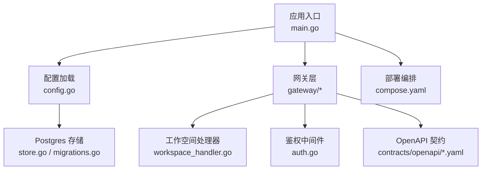
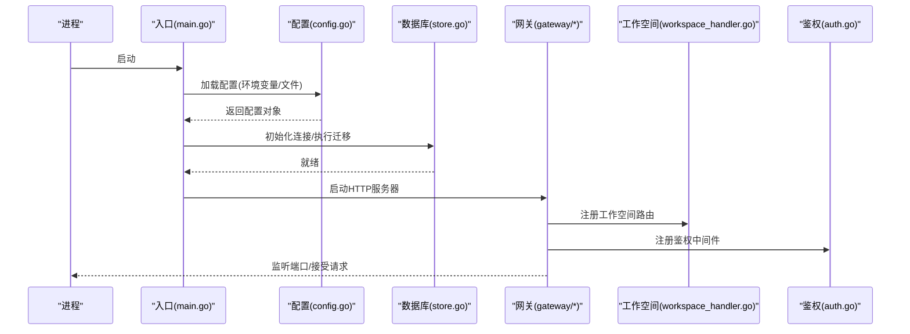
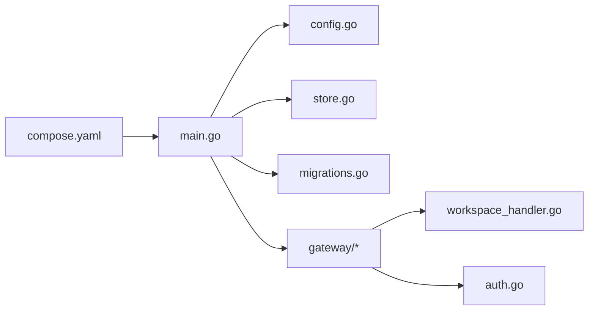

# 配置问题排查

<cite>
**本文引用的文件**   
- [README.md](file://README.md)
- [compose.yaml](file://deploy/compose.yaml)
- [main.go](file://apps/control-plane/cmd/control-plane/main.go)
- [config.go](file://apps/control-plane/internal/config/config.go)
- [config_test.go](file://apps/control-plane/internal/config/config_test.go)
- [store.go](file://apps/control-plane/internal/catalog/postgres/store.go)
- [migrations.go](file://apps/control-plane/internal/catalog/postgres/migrations.go)
- [workspace_handler.go](file://apps/control-plane/internal/gateway/workspace_handler.go)
- [auth.go](file://apps/control-plane/internal/gateway/auth.go)
- [errors.go](file://apps/control-plane/internal/gateway/errors.go)
- [control-plane.v2.yaml](file://contracts/openapi/control-plane.v2.yaml)
- [control-plane-internal.v1.yaml](file://contracts/openapi/control-plane-internal.v1.yaml)
</cite>

## 目录
1. [简介](#简介)
2. [项目结构](#项目结构)
3. [核心组件](#核心组件)
4. [架构总览](#架构总览)
5. [详细组件分析](#详细组件分析)
6. [依赖关系分析](#依赖关系分析)
7. [性能与可用性考虑](#性能与可用性考虑)
8. [故障排查指南](#故障排查指南)
9. [结论](#结论)
10. [附录](#附录)

## 简介
本指南面向 NeKiro 平台的运维与开发者，聚焦“配置问题排查”。内容覆盖数据库连接、API 网关、工作空间、安全等关键配置项的常见问题、验证方法、模板与最佳实践；同时给出不同部署环境的差异点、热重载机制说明、错误诊断方法与自动化检查建议。目标是帮助读者快速定位并修复配置相关问题，提升上线稳定性与可观测性。

## 项目结构
NeKiro 控制面服务位于 apps/control-plane，其配置加载入口在 main.go，配置模型定义在 internal/config/config.go。数据持久化使用 Postgres（catalog 与 workspace 模块），通过 migrations 管理库表变更。对外 API 由 gateway 层暴露，包含工作空间、认证、调用路由等处理逻辑。部署编排示例见 deploy/compose.yaml。OpenAPI 契约位于 contracts/openapi，用于校验接口行为与兼容性。

图示来源
- [main.go](file://apps/control-plane/cmd/control-plane/main.go)
- [config.go](file://apps/control-plane/internal/config/config.go)
- [store.go](file://apps/control-plane/internal/catalog/postgres/store.go)
- [migrations.go](file://apps/control-plane/internal/catalog/postgres/migrations.go)
- [workspace_handler.go](file://apps/control-plane/internal/gateway/workspace_handler.go)
- [auth.go](file://apps/control-plane/internal/gateway/auth.go)
- [compose.yaml](file://deploy/compose.yaml)
- [control-plane.v2.yaml](file://contracts/openapi/control-plane.v2.yaml)
- [control-plane-internal.v1.yaml](file://contracts/openapi/control-plane-internal.v1.yaml)

章节来源
- [README.md](file://README.md)
- [compose.yaml](file://deploy/compose.yaml)
- [main.go](file://apps/control-plane/cmd/control-plane/main.go)
- [config.go](file://apps/control-plane/internal/config/config.go)

## 核心组件
- 配置加载器：负责从环境变量/配置文件解析配置，提供默认值与校验。
- 数据库连接：基于 Postgres 的连接池、迁移执行与查询封装。
- 网关与鉴权：HTTP 网关、请求鉴权、工作空间上下文注入。
- OpenAPI 契约：对外与内部接口的版本化契约，用于兼容性与回归测试。

章节来源
- [config.go](file://apps/control-plane/internal/config/config.go)
- [store.go](file://apps/control-plane/internal/catalog/postgres/store.go)
- [migrations.go](file://apps/control-plane/internal/catalog/postgres/migrations.go)
- [workspace_handler.go](file://apps/control-plane/internal/gateway/workspace_handler.go)
- [auth.go](file://apps/control-plane/internal/gateway/auth.go)
- [control-plane.v2.yaml](file://contracts/openapi/control-plane.v2.yaml)
- [control-plane-internal.v1.yaml](file://contracts/openapi/control-plane-internal.v1.yaml)

## 架构总览
下图展示了控制面服务的启动流程与配置生效路径：入口初始化配置，建立数据库连接并执行迁移，随后启动 HTTP 网关，注册工作空间与鉴权相关路由。

图示来源
- [main.go](file://apps/control-plane/cmd/control-plane/main.go)
- [config.go](file://apps/control-plane/internal/config/config.go)
- [store.go](file://apps/control-plane/internal/catalog/postgres/store.go)
- [migrations.go](file://apps/control-plane/internal/catalog/postgres/migrations.go)
- [workspace_handler.go](file://apps/control-plane/internal/gateway/workspace_handler.go)
- [auth.go](file://apps/control-plane/internal/gateway/auth.go)

## 详细组件分析

### 配置加载与校验
- 配置来源优先级：环境变量优先于配置文件；未显式设置时采用默认值。
- 关键字段：数据库连接串、日志级别、监听地址、工作空间策略、鉴权参数等。
- 校验策略：必填字段非空、URL/端口格式、布尔开关合法范围、超时与重试参数合理性。
- 常见错误：
  - 环境变量名拼写错误或大小写不一致导致回退到默认值。
  - 数据库连接串缺少必要参数（如 host/port/dbname）。
  - 鉴权密钥为空或格式不合法。
  - 工作空间策略字段缺失导致权限判定失败。
- 验证方法：
  - 启动前自检：打印合并后的配置摘要（敏感信息脱敏）。
  - 单元测试覆盖：参考配置测试用例，断言默认值与边界条件。
- 模板建议：
  - 为开发、测试、预发、生产分别维护 .env 样例，明确必填与可选字段。
  - 将敏感信息（密钥、证书）放入外部密钥管理服务，运行时注入。

章节来源
- [config.go](file://apps/control-plane/internal/config/config.go)
- [config_test.go](file://apps/control-plane/internal/config/config_test.go)

### 数据库连接与迁移
- 连接参数：主机、端口、用户名、密码、数据库名、SSL/TLS 模式、连接池大小、最大空闲数、超时等。
- 迁移执行：服务启动时按序执行 SQL 迁移脚本，确保 schema 一致。
- 常见问题：
  - 网络不可达或防火墙阻断导致连接失败。
  - 账号权限不足无法创建/修改表。
  - 迁移顺序错乱或重复执行导致冲突。
  - SSL 证书不匹配或客户端强制 TLS 但服务端未启用。
- 验证方法：
  - 启动后执行健康检查端点（若存在）或简单查询。
  - 查看迁移日志确认是否全部成功。
  - 使用数据库客户端直连验证凭据与网络。
- 最佳实践：
  - 使用只读副本进行查询，主库仅写入。
  - 迁移脚本幂等设计，避免重复执行报错。
  - 对连接池参数做容量规划，结合 QPS 与延迟目标调优。

章节来源
- [store.go](file://apps/control-plane/internal/catalog/postgres/store.go)
- [migrations.go](file://apps/control-plane/internal/catalog/postgres/migrations.go)

### 网关与工作空间配置
- 监听地址与端口：绑定 0.0.0.0 或具体网卡，注意容器网络映射。
- 工作空间策略：命名空间隔离、访问控制、配额限制等。
- 常见问题：
  - 端口被占用或未正确映射导致外部不可访问。
  - 工作空间 ID 不存在或策略未生效。
  - 跨域或代理转发头丢失导致鉴权失败。
- 验证方法：
  - 使用 curl 或浏览器访问健康/状态端点。
  - 检查工作空间列表与详情接口返回。
  - 在网关层开启调试日志，观察请求链路。

章节来源
- [workspace_handler.go](file://apps/control-plane/internal/gateway/workspace_handler.go)

### 安全与鉴权配置
- 鉴权方式：支持多种方案（如 Token/JWT/OIDC），需配置签发方、公钥、令牌有效期等。
- 常见问题：
  - 密钥过期或轮换未同步。
  - 时间偏差导致令牌校验失败。
  - 上游代理篡改或丢弃 Authorization 头。
- 验证方法：
  - 使用已知有效令牌访问受保护接口。
  - 检查鉴权中间件的日志输出与错误码。
- 最佳实践：
  - 使用短期令牌+刷新机制。
  - 严格校验签名与受众，拒绝未知算法。
  - 最小权限原则，按工作空间粒度授权。

章节来源
- [auth.go](file://apps/control-plane/internal/gateway/auth.go)
- [errors.go](file://apps/control-plane/internal/gateway/errors.go)

### OpenAPI 契约与兼容性
- 契约版本：对外与内部接口分别维护版本化 YAML 契约。
- 作用：约束实现与文档一致性，支撑回归测试与兼容性检查。
- 常见问题：
  - 实现与契约不一致导致客户端解析失败。
  - 升级未遵循向后兼容规则引发破坏性变更。
- 验证方法：
  - 使用契约测试套件对比响应结构与语义。
  - 在 CI 中集成契约校验步骤。

章节来源
- [control-plane.v2.yaml](file://contracts/openapi/control-plane.v2.yaml)
- [control-plane-internal.v1.yaml](file://contracts/openapi/control-plane-internal.v1.yaml)

## 依赖关系分析
- 入口 main.go 依赖 config.go 完成配置加载，再依赖 store.go 与 migrations.go 完成数据库初始化。
- 网关层依赖 workspace_handler.go 与 auth.go 提供业务与安全能力。
- 部署编排 compose.yaml 提供环境变量与服务发现的基础设施。

图示来源
- [main.go](file://apps/control-plane/cmd/control-plane/main.go)
- [config.go](file://apps/control-plane/internal/config/config.go)
- [store.go](file://apps/control-plane/internal/catalog/postgres/store.go)
- [migrations.go](file://apps/control-plane/internal/catalog/postgres/migrations.go)
- [workspace_handler.go](file://apps/control-plane/internal/gateway/workspace_handler.go)
- [auth.go](file://apps/control-plane/internal/gateway/auth.go)
- [compose.yaml](file://deploy/compose.yaml)

章节来源
- [main.go](file://apps/control-plane/cmd/control-plane/main.go)
- [config.go](file://apps/control-plane/internal/config/config.go)
- [compose.yaml](file://deploy/compose.yaml)

## 性能与可用性考虑
- 连接池：根据并发与延迟目标调整最大连接数、空闲连接与超时。
- 迁移窗口：在低峰期执行，必要时灰度滚动升级。
- 鉴权开销：缓存公钥/令牌白名单，减少外部依赖延迟。
- 网关限流：针对热点接口实施速率限制与熔断降级。
- 可观测性：统一日志格式、结构化字段、指标上报与告警阈值。

[本节为通用指导，无需源码引用]

## 故障排查指南

### 配置加载阶段
- 现象：服务启动即崩溃或功能异常。
- 排查要点：
  - 核对环境变量键名与大小写。
  - 确认配置文件路径与可读权限。
  - 打印合并后的配置摘要（脱敏）。
- 工具与方法：
  - 运行配置自检命令（若提供）。
  - 使用单元测试断言默认值与边界条件。

章节来源
- [config.go](file://apps/control-plane/internal/config/config.go)
- [config_test.go](file://apps/control-plane/internal/config/config_test.go)

### 数据库连接与迁移
- 现象：连接失败、迁移报错、查询超时。
- 排查要点：
  - 网络连通性、DNS 解析、防火墙策略。
  - 账号权限与默认数据库是否存在。
  - SSL/TLS 模式与证书链是否正确。
  - 迁移脚本顺序与幂等性。
- 工具与方法：
  - 使用 psql 直连验证。
  - 查看迁移日志与错误堆栈。
  - 临时降低连接池大小以定位瓶颈。

章节来源
- [store.go](file://apps/control-plane/internal/catalog/postgres/store.go)
- [migrations.go](file://apps/control-plane/internal/catalog/postgres/migrations.go)

### 网关与工作空间
- 现象：接口 404/502、工作空间不可用。
- 排查要点：
  - 端口绑定与容器映射。
  - 反向代理头透传（Host/X-Forwarded-*）。
  - 工作空间策略与权限。
- 工具与方法：
  - 访问健康/状态端点。
  - 打开网关调试日志，追踪请求链路。

章节来源
- [workspace_handler.go](file://apps/control-plane/internal/gateway/workspace_handler.go)

### 鉴权与安全
- 现象：401/403、令牌校验失败。
- 排查要点：
  - 令牌签名、有效期、受众。
  - 上游代理是否保留 Authorization 头。
  - 系统时间与签发方时间同步。
- 工具与方法：
  - 使用已知有效令牌复现。
  - 检查鉴权中间件错误码与日志。

章节来源
- [auth.go](file://apps/control-plane/internal/gateway/auth.go)
- [errors.go](file://apps/control-plane/internal/gateway/errors.go)

### 部署与环境差异
- 本地开发：
  - 使用 compose.yaml 快速拉起依赖服务。
  - 环境变量集中管理，便于切换。
- 容器化：
  - 注意镜像内时区与语言环境。
  - 通过 Secret 注入敏感配置。
- 云原生：
  - 使用 ConfigMap/Secret 管理配置。
  - 配合探针与健康检查实现自愈。

章节来源
- [compose.yaml](file://deploy/compose.yaml)

### 配置热重载机制
- 现状说明：当前仓库未提供内置的配置热重载实现。
- 建议方案：
  - 通过进程管理器（systemd/supervisor）或编排平台（Kubernetes）触发滚动重启。
  - 在配置变更后，先更新配置源，再优雅重启实例，保证无中断。
  - 对于可热更新的组件（如日志级别），可在内存中维护可替换的配置快照，并提供管理接口更新。

[本节为通用指导，无需源码引用]

### 配置变更最佳实践
- 分环境隔离：开发/测试/预发/生产独立配置。
- 最小变更：每次仅改少量配置，便于回滚。
- 灰度发布：逐步放量，观察指标与错误率。
- 审计与版本化：变更记录留痕，关联变更单。
- 自动化校验：CI 中集成配置校验与契约测试。

[本节为通用指导，无需源码引用]

### 自动化工具与检查清单
- 配置校验：
  - 编写单元测试覆盖必填字段、类型与范围。
  - 在启动流程中加入配置自检步骤。
- 契约测试：
  - 基于 OpenAPI 生成客户端或服务端桩，进行回归测试。
- 基础设施检查：
  - 数据库连通性探测、迁移状态检查。
  - 鉴权端到端演练（模拟登录与访问受限资源）。

章节来源
- [config_test.go](file://apps/control-plane/internal/config/config_test.go)
- [control-plane.v2.yaml](file://contracts/openapi/control-plane.v2.yaml)
- [control-plane-internal.v1.yaml](file://contracts/openapi/control-plane-internal.v1.yaml)

## 结论
通过对配置加载、数据库连接、网关与工作空间、鉴权安全以及部署环境的系统性梳理，本文提供了从问题定位到修复落地的完整路径。建议在生产环境中引入自动化校验与契约测试，结合灰度与回滚策略，持续提升配置变更的安全性与稳定性。

[本节为总结性内容，无需源码引用]

## 附录

### 配置模板（示例字段）
- 数据库
  - 主机、端口、用户名、密码、数据库名、SSL 模式、连接池大小、超时
- 网关
  - 监听地址、端口、日志级别、超时、限流阈值
- 鉴权
  - 签发方、公钥/证书、令牌有效期、刷新策略
- 工作空间
  - 命名空间策略、访问控制、配额限制

[本节为通用模板，无需源码引用]

### 常用验证命令（概念性）
- 健康检查：GET /health
- 状态检查：GET /status
- 工作空间列表：GET /workspaces
- 鉴权演练：携带有效令牌访问受保护接口

[本节为通用指导，无需源码引用]