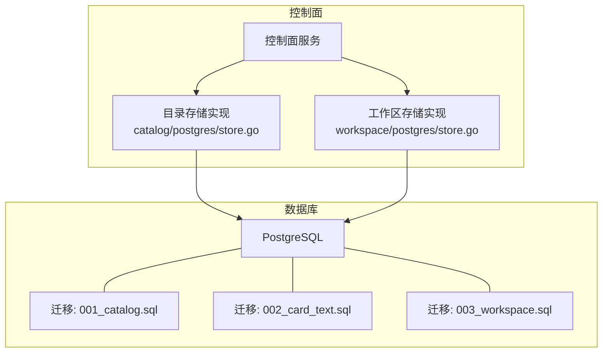
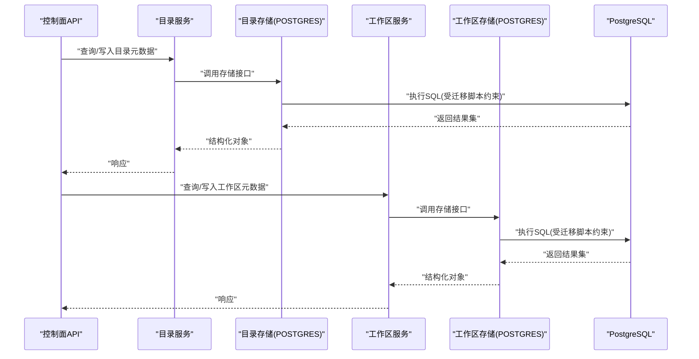
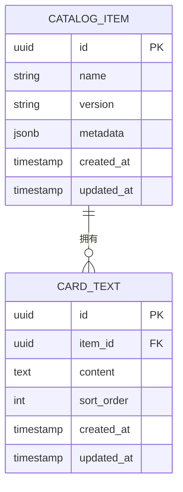
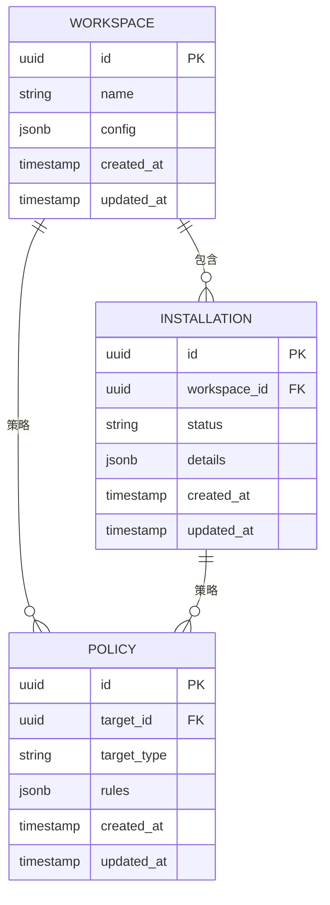
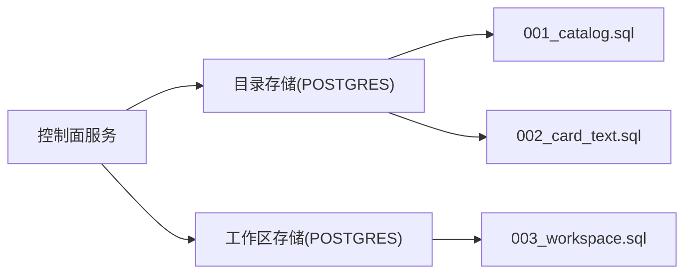

# 数据库模式设计

<cite>
**本文引用的文件**   
- [apps/control-plane/migrations/001_catalog.sql](file://apps/control-plane/migrations/001_catalog.sql)
- [apps/control-plane/migrations/002_card_text.sql](file://apps/control-plane/migrations/002_card_text.sql)
- [apps/control-plane/migrations/003_workspace.sql](file://apps/control-plane/migrations/003_workspace.sql)
- [apps/control-plane/internal/catalog/postgres/store.go](file://apps/control-plane/internal/catalog/postgres/store.go)
- [apps/control-plane/internal/workspace/postgres/store.go](file://apps/control-plane/internal/workspace/postgres/store.go)
</cite>

## 目录
1. [简介](#简介)
2. [项目结构](#项目结构)
3. [核心组件](#核心组件)
4. [架构总览](#架构总览)
5. [详细组件分析](#详细组件分析)
6. [依赖关系分析](#依赖关系分析)
7. [性能考虑](#性能考虑)
8. [故障排查指南](#故障排查指南)
9. [结论](#结论)
10. [附录](#附录)

## 简介
本文件为 NeKiro 平台的数据库模式设计文档，聚焦于控制面（Control Plane）的持久化层。目标包括：
- 完整梳理所有数据库表的结构、字段定义、数据类型与约束
- 明确主键、外键关系、索引设计与查询优化策略
- 解释表间关联与数据完整性约束
- 提供 ER 图与关系映射
- 给出分区/分片与扩展性建议
- 总结性能优化技巧与最佳实践
- 制定备份、恢复与监控策略

说明：
- 当前仓库中数据库迁移脚本位于 apps/control-plane/migrations 目录下，包含 catalog 与 workspace 两个领域的数据模型变更。
- 代码侧通过 Go 模块访问 PostgreSQL，使用迁移脚本驱动 schema 演进。

## 项目结构
NeKiro 控制面的数据库相关资产主要分布在以下位置：
- 迁移脚本：apps/control-plane/migrations/*.sql
- 数据访问实现：apps/control-plane/internal/{catalog,workspace}/postgres/store.go

图表来源
- [apps/control-plane/internal/catalog/postgres/store.go](file://apps/control-plane/internal/catalog/postgres/store.go)
- [apps/control-plane/internal/workspace/postgres/store.go](file://apps/control-plane/internal/workspace/postgres/store.go)
- [apps/control-plane/migrations/001_catalog.sql](file://apps/control-plane/migrations/001_catalog.sql)
- [apps/control-plane/migrations/002_card_text.sql](file://apps/control-plane/migrations/002_card_text.sql)
- [apps/control-plane/migrations/003_workspace.sql](file://apps/control-plane/migrations/003_workspace.sql)

章节来源
- [apps/control-plane/migrations/001_catalog.sql](file://apps/control-plane/migrations/001_catalog.sql)
- [apps/control-plane/migrations/002_card_text.sql](file://apps/control-plane/migrations/002_card_text.sql)
- [apps/control-plane/migrations/003_workspace.sql](file://apps/control-plane/migrations/003_workspace.sql)
- [apps/control-plane/internal/catalog/postgres/store.go](file://apps/control-plane/internal/catalog/postgres/store.go)
- [apps/control-plane/internal/workspace/postgres/store.go](file://apps/control-plane/internal/workspace/postgres/store.go)

## 核心组件
本节概述控制面中与数据库相关的核心组件及其职责：
- 目录（Catalog）存储：负责 Agent 卡片、能力注册等元数据的持久化与检索
- 工作区（Workspace）存储：负责工作区实例、安装状态、策略等元数据的持久化与检索
- 迁移管理：通过 SQL 迁移脚本对数据库进行版本化演进

章节来源
- [apps/control-plane/internal/catalog/postgres/store.go](file://apps/control-plane/internal/catalog/postgres/store.go)
- [apps/control-plane/internal/workspace/postgres/store.go](file://apps/control-plane/internal/workspace/postgres/store.go)

## 架构总览
下图展示控制面服务如何通过存储层访问 PostgreSQL，以及迁移脚本如何驱动数据库模式演进。

图表来源
- [apps/control-plane/internal/catalog/postgres/store.go](file://apps/control-plane/internal/catalog/postgres/store.go)
- [apps/control-plane/internal/workspace/postgres/store.go](file://apps/control-plane/internal/workspace/postgres/store.go)

## 详细组件分析

### 目录（Catalog）数据模型
基于迁移脚本与存储实现，目录域涉及的核心实体包括：
- 目录项（Catalog Item）：描述一个可被发现的 Agent 或能力条目
- 文本内容（Card Text）：与目录项关联的富文本或卡片正文

ER 关系概览
- 目录项与文本内容为 1:N 关系（一个目录项对应多条文本记录）
- 目录项具备唯一标识与必要元数据字段，用于快速检索与排序

图表来源
- [apps/control-plane/migrations/001_catalog.sql](file://apps/control-plane/migrations/001_catalog.sql)
- [apps/control-plane/migrations/002_card_text.sql](file://apps/control-plane/migrations/002_card_text.sql)

字段与约束要点
- 主键：各表均使用 UUID 作为主键，保证全局唯一性与分布式友好
- 外键：CARD_TEXT.item_id 引用 CATALOG_ITEM.id，确保引用完整性
- 索引：
  - 在 CATALOG_ITEM.name、version 上建立索引以支持按名称与版本检索
  - 在 CARD_TEXT.item_id 上建立索引以加速按目录项聚合查询
  - 在 CARD_TEXT.sort_order 上建立索引以支持有序输出
- 时间戳：created_at、updated_at 用于审计与增量同步
- JSONB：metadata 字段采用 JSONB 类型，便于灵活扩展且支持部分更新与查询

查询优化策略
- 常用查询路径：
  - 按名称+版本精确查找目录项
  - 按目录项 ID 获取其全部文本并按 sort_order 排序
- 建议索引：
  - (name, version) 复合索引
  - (item_id, sort_order) 复合索引
- 分页与游标：
  - 针对列表查询建议使用基于更新时间或主键的游标分页，避免深度偏移带来的性能问题

章节来源
- [apps/control-plane/migrations/001_catalog.sql](file://apps/control-plane/migrations/001_catalog.sql)
- [apps/control-plane/migrations/002_card_text.sql](file://apps/control-plane/migrations/002_card_text.sql)
- [apps/control-plane/internal/catalog/postgres/store.go](file://apps/control-plane/internal/catalog/postgres/store.go)

### 工作区（Workspace）数据模型
工作区域涉及的核心实体包括：
- 工作区（Workspace）：代表一次安装或运行环境实例
- 安装记录（Installation）：与工作区关联的安装生命周期信息
- 策略（Policy）：与工作区或安装相关的策略配置

ER 关系概览
- 工作区与安装记录为 1:N 关系
- 策略可与工作区或安装记录关联（具体取决于迁移定义）

图表来源
- [apps/control-plane/migrations/003_workspace.sql](file://apps/control-plane/migrations/003_workspace.sql)

字段与约束要点
- 主键：UUID 主键
- 外键：INSTALLATION.workspace_id 引用 WORKSPACE.id；POLICY.target_id 与 target_type 组合表示多态关联
- 索引：
  - 在 WORKSPACE.name 上建立索引以支持按名称检索
  - 在 INSTALLATION.workspace_id 上建立索引以加速按工作区聚合
  - 在 POLICY.target_id 与 target_type 上建立复合索引以支持多态策略查询
- 状态字段：INSTALLATION.status 用于表达安装生命周期状态
- JSONB：config、details、rules 使用 JSONB 提升灵活性

查询优化策略
- 常用查询路径：
  - 按工作区名称检索工作区
  - 按工作区 ID 获取其安装历史
  - 按策略目标（target_type + target_id）获取策略
- 建议索引：
  - (workspace_id) 单列索引
  - (target_type, target_id) 复合索引
- 事务边界：
  - 工作区创建与其初始安装记录的写入应在同一事务内完成，保证一致性

章节来源
- [apps/control-plane/migrations/003_workspace.sql](file://apps/control-plane/migrations/003_workspace.sql)
- [apps/control-plane/internal/workspace/postgres/store.go](file://apps/control-plane/internal/workspace/postgres/store.go)

### 迁移管理与版本控制
- 迁移脚本命名规范：NNN_description.sql，按顺序执行
- 关键迁移：
  - 001_catalog.sql：初始化目录相关表结构与基础索引
  - 002_card_text.sql：引入卡片文本表并建立与目录项的关联
  - 003_workspace.sql：引入工作区、安装与策略相关表结构
- 回滚策略：
  - 建议为每个正向迁移编写对应的反向迁移脚本，以便在需要时安全回滚
- 幂等性：
  - 迁移脚本应具备幂等性，避免重复执行导致错误

章节来源
- [apps/control-plane/migrations/001_catalog.sql](file://apps/control-plane/migrations/001_catalog.sql)
- [apps/control-plane/migrations/002_card_text.sql](file://apps/control-plane/migrations/002_card_text.sql)
- [apps/control-plane/migrations/003_workspace.sql](file://apps/control-plane/migrations/003_workspace.sql)

## 依赖关系分析
控制面服务通过存储层访问 PostgreSQL，存储层直接依赖迁移脚本定义的表结构与索引。

图表来源
- [apps/control-plane/internal/catalog/postgres/store.go](file://apps/control-plane/internal/catalog/postgres/store.go)
- [apps/control-plane/internal/workspace/postgres/store.go](file://apps/control-plane/internal/workspace/postgres/store.go)
- [apps/control-plane/migrations/001_catalog.sql](file://apps/control-plane/migrations/001_catalog.sql)
- [apps/control-plane/migrations/002_card_text.sql](file://apps/control-plane/migrations/002_card_text.sql)
- [apps/control-plane/migrations/003_workspace.sql](file://apps/control-plane/migrations/003_workspace.sql)

章节来源
- [apps/control-plane/internal/catalog/postgres/store.go](file://apps/control-plane/internal/catalog/postgres/store.go)
- [apps/control-plane/internal/workspace/postgres/store.go](file://apps/control-plane/internal/workspace/postgres/store.go)

## 性能考虑
- 索引设计
  - 优先为高频过滤条件与连接键建立索引
  - 复合索引应遵循最左前缀原则，将选择性高的列放在前面
- 查询优化
  - 避免 SELECT *，仅选择必要字段
  - 使用 EXPLAIN ANALYZE 分析慢查询，识别全表扫描与临时表
  - 合理使用 LIMIT/OFFSET 或基于游标的分页
- 事务与锁
  - 缩短事务范围，减少长事务导致的锁竞争
  - 对于写热点表，考虑行级锁与并发控制
- 连接池
  - 合理设置最大连接数与空闲超时，避免连接耗尽
- 缓存
  - 对读多写少的元数据（如目录项）可引入应用层缓存，降低数据库压力
- 批量操作
  - 使用批量插入/更新减少往返开销

[本节为通用指导，不直接分析具体文件]

## 故障排查指南
- 迁移失败
  - 检查迁移脚本语法与依赖顺序
  - 确认数据库版本与迁移兼容性
  - 查看迁移日志定位具体失败的 DDL/DML
- 索引缺失导致慢查询
  - 使用 EXPLAIN 分析执行计划
  - 根据实际查询模式补充或调整索引
- 死锁与锁等待
  - 分析事务提交顺序与锁粒度
  - 拆分大事务，减少锁持有时间
- 连接池耗尽
  - 监控连接池使用率
  - 调整连接池参数与应用并发度

章节来源
- [apps/control-plane/migrations/001_catalog.sql](file://apps/control-plane/migrations/001_catalog.sql)
- [apps/control-plane/migrations/002_card_text.sql](file://apps/control-plane/migrations/002_card_text.sql)
- [apps/control-plane/migrations/003_workspace.sql](file://apps/control-plane/migrations/003_workspace.sql)

## 结论
NeKiro 控制面的数据库模式围绕目录与工作区两大领域展开，采用迁移脚本驱动的模式演进方式，结合合理的索引与约束设计，满足高可用与可扩展的需求。后续可在读写分离、分库分表与缓存层面进一步扩展，以支撑更大规模的业务场景。

[本节为总结性内容，不直接分析具体文件]

## 附录

### 备份与恢复策略
- 全量备份
  - 定期执行 pg_dump 全量导出，保留多份历史快照
- 增量备份
  - 启用 WAL 归档，结合 PITR 实现时间点恢复
- 恢复演练
  - 定期进行恢复演练，验证备份有效性
- 异地容灾
  - 将备份副本复制到异地存储，防范区域级故障

### 监控策略
- 指标采集
  - 监控连接数、慢查询、锁等待、I/O 延迟等关键指标
- 告警规则
  - 设定阈值告警，及时发现问题
- 日志审计
  - 开启慢查询日志与审计日志，便于事后分析

### 扩展性考虑
- 分区策略
  - 对时间序列型表（如安装日志）可按时间分区
- 分片设计
  - 按租户或业务域进行水平分片，提升写入与查询并行度
- 读写分离
  - 将读请求路由到只读副本，减轻主库压力
- 容量规划
  - 根据增长趋势预留空间与计算资源

[本节为通用指导，不直接分析具体文件]