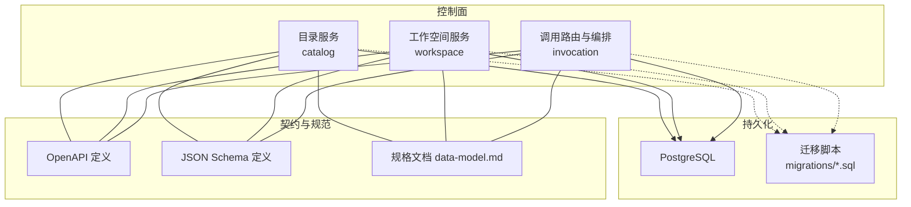
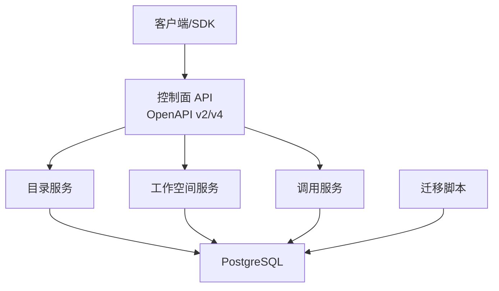
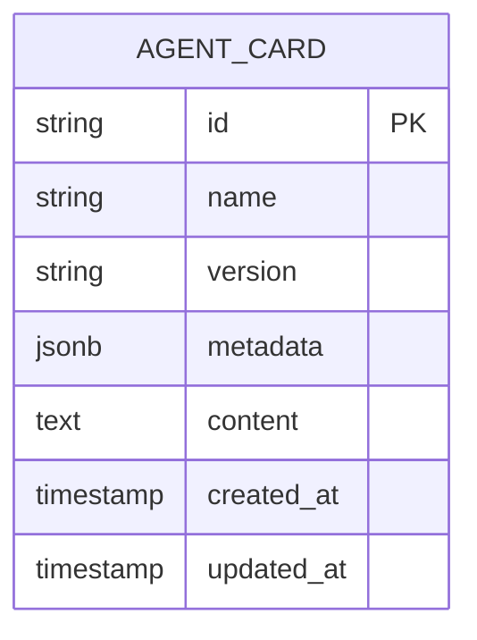
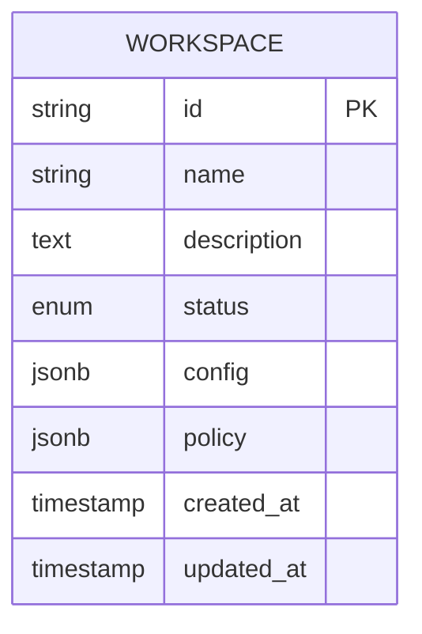
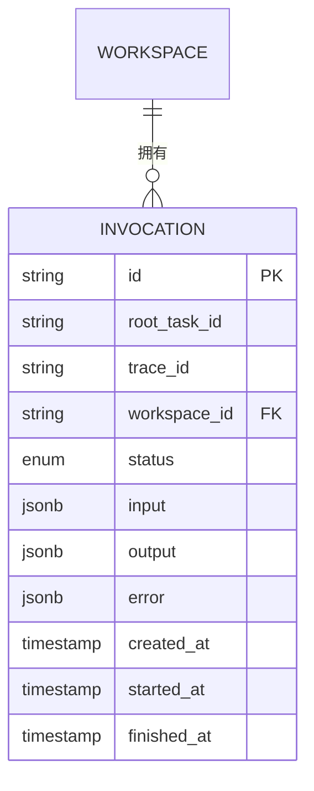
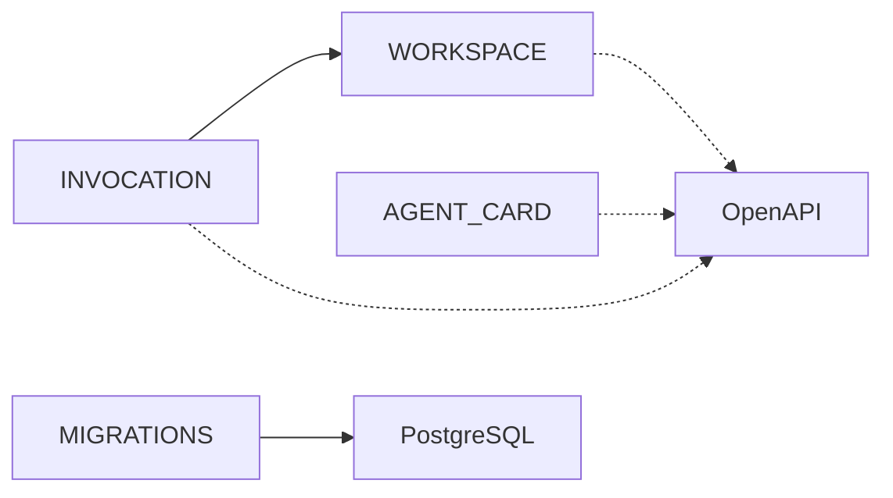

# 数据模型

<cite>
**本文引用的文件**   
- [apps/control-plane/internal/catalog/model.go](file://apps/control-plane/internal/catalog/model.go)
- [apps/control-plane/internal/workspace/model.go](file://apps/control-plane/internal/workspace/model.go)
- [apps/control-plane/migrations/001_catalog.sql](file://apps/control-plane/migrations/001_catalog.sql)
- [apps/control-plane/migrations/002_card_text.sql](file://apps/control-plane/migrations/002_card_text.sql)
- [apps/control-plane/migrations/003_workspace.sql](file://apps/control-plane/migrations/003_workspace.sql)
- [contracts/schemas/agent-card.v0.2.schema.json](file://contracts/schemas/agent-card.v0.2.schema.json)
- [contracts/schemas/workspace.v1.schema.json](file://contracts/schemas/workspace.v1.schema.json)
- [contracts/openapi/control-plane.v2.yaml](file://contracts/openapi/control-plane.v2.yaml)
- [contracts/openapi/control-plane-invocation.v4.yaml](file://contracts/openapi/control-plane-invocation.v4.yaml)
- [specs/002-catalog-registry-discovery/data-model.md](file://specs/002-catalog-registry-discovery/data-model.md)
- [specs/003-workspace-installation-contracts/data-model.md](file://specs/003-workspace-installation-contracts/data-model.md)
- [specs/010-invocation-routing-ledger/data-model.md](file://specs/010-invocation-routing-ledger/data-model.md)
</cite>

## 目录
1. [简介](#简介)
2. [项目结构](#项目结构)
3. [核心组件](#核心组件)
4. [架构总览](#架构总览)
5. [详细组件分析](#详细组件分析)
6. [依赖关系分析](#依赖关系分析)
7. [性能考虑](#性能考虑)
8. [故障排查指南](#故障排查指南)
9. [结论](#结论)
10. [附录](#附录)

## 简介
本文件为 NeKiro 平台的数据模型文档，聚焦代理卡片（Agent Card）、工作空间（Workspace）与调用记录（Invocation）等核心实体。内容涵盖：
- 实体关系、字段定义与数据类型
- 主键/外键、索引与约束
- 数据验证规则与业务规则
- 数据库模式图与示例数据
- 数据访问模式、缓存策略与性能考量
- 数据生命周期、保留策略与归档规则
- 数据迁移路径与版本管理
- 数据安全、隐私要求与访问控制

## 项目结构
NeKiro 的控制面包含以下与数据模型密切相关的目录与文件：
- 领域模型定义位于各子域内部（如 catalog、workspace），并配合 SQL 迁移脚本落地到 PostgreSQL
- 契约层通过 OpenAPI 与 JSON Schema 描述对外接口与数据结构
- 规范文档 specs 对各子域的数据模型进行补充说明

图表来源
- [apps/control-plane/migrations/001_catalog.sql](file://apps/control-plane/migrations/001_catalog.sql)
- [apps/control-plane/migrations/002_card_text.sql](file://apps/control-plane/migrations/002_card_text.sql)
- [apps/control-plane/migrations/003_workspace.sql](file://apps/control-plane/migrations/003_workspace.sql)
- [contracts/openapi/control-plane.v2.yaml](file://contracts/openapi/control-plane.v2.yaml)
- [contracts/openapi/control-plane-invocation.v4.yaml](file://contracts/openapi/control-plane-invocation.v4.yaml)
- [contracts/schemas/agent-card.v0.2.schema.json](file://contracts/schemas/agent-card.v0.2.schema.json)
- [contracts/schemas/workspace.v1.schema.json](file://contracts/schemas/workspace.v1.schema.json)
- [specs/002-catalog-registry-discovery/data-model.md](file://specs/002-catalog-registry-discovery/data-model.md)
- [specs/003-workspace-installation-contracts/data-model.md](file://specs/003-workspace-installation-contracts/data-model.md)
- [specs/010-invocation-routing-ledger/data-model.md](file://specs/010-invocation-routing-ledger/data-model.md)

章节来源
- [apps/control-plane/internal/catalog/model.go](file://apps/control-plane/internal/catalog/model.go)
- [apps/control-plane/internal/workspace/model.go](file://apps/control-plane/internal/workspace/model.go)
- [apps/control-plane/migrations/001_catalog.sql](file://apps/control-plane/migrations/001_catalog.sql)
- [apps/control-plane/migrations/002_card_text.sql](file://apps/control-plane/migrations/002_card_text.sql)
- [apps/control-plane/migrations/003_workspace.sql](file://apps/control-plane/migrations/003_workspace.sql)
- [contracts/schemas/agent-card.v0.2.schema.json](file://contracts/schemas/agent-card.v0.2.schema.json)
- [contracts/schemas/workspace.v1.schema.json](file://contracts/schemas/workspace.v1.schema.json)
- [contracts/openapi/control-plane.v2.yaml](file://contracts/openapi/control-plane.v2.yaml)
- [contracts/openapi/control-plane-invocation.v4.yaml](file://contracts/openapi/control-plane-invocation.v4.yaml)
- [specs/002-catalog-registry-discovery/data-model.md](file://specs/002-catalog-registry-discovery/data-model.md)
- [specs/003-workspace-installation-contracts/data-model.md](file://specs/003-workspace-installation-contracts/data-model.md)
- [specs/010-invocation-routing-ledger/data-model.md](file://specs/010-invocation-routing-ledger/data-model.md)

## 核心组件
本节概述三大核心数据域及其职责：
- 目录（Catalog）：存储代理卡片的元数据与文本内容，提供发现与解析能力
- 工作空间（Workspace）：隔离租户/环境的资源边界，承载安装与配置上下文
- 调用（Invocation）：记录一次调用的路由、状态与结果，支撑可观测性与审计

章节来源
- [specs/002-catalog-registry-discovery/data-model.md](file://specs/002-catalog-registry-discovery/data-model.md)
- [specs/003-workspace-installation-contracts/data-model.md](file://specs/003-workspace-installation-contracts/data-model.md)
- [specs/010-invocation-routing-ledger/data-model.md](file://specs/010-invocation-routing-ledger/data-model.md)

## 架构总览
下图展示数据模型在系统中的位置与交互：
- 外部通过 OpenAPI 暴露的 API 访问目录与工作空间
- 调用链路通过 invocation 服务落库，形成可追踪的调用记录
- 所有变更通过迁移脚本演进，确保一致性

图表来源
- [contracts/openapi/control-plane.v2.yaml](file://contracts/openapi/control-plane.v2.yaml)
- [contracts/openapi/control-plane-invocation.v4.yaml](file://contracts/openapi/control-plane-invocation.v4.yaml)
- [apps/control-plane/migrations/001_catalog.sql](file://apps/control-plane/migrations/001_catalog.sql)
- [apps/control-plane/migrations/002_card_text.sql](file://apps/control-plane/migrations/002_card_text.sql)
- [apps/control-plane/migrations/003_workspace.sql](file://apps/control-plane/migrations/003_workspace.sql)

## 详细组件分析

### 代理卡片（Agent Card）
代理卡片用于描述一个可被发现的代理能力，包括标识、名称、版本、权限、技能集合、端点信息等。

- 主要字段与类型
  - 标识符：字符串，唯一
  - 名称：字符串，非空
  - 版本：语义化版本字符串
  - 权限列表：数组，元素含权限标识与来源
  - 技能集合：数组，元素含技能标识与版本
  - 端点信息：对象，包含 URL、认证方式等
  - 文本内容：长文本，支持全文检索（见迁移 002）

- 主键/外键与索引
  - 主键：代理卡片标识符
  - 唯一性：名称+版本组合唯一（建议）
  - 索引：按名称、版本、标签等常用查询列建立索引；文本字段使用全文索引

- 约束与校验
  - 必填字段：标识符、名称、版本
  - 格式校验：URL 合法、版本号符合语义化版本
  - 权限与技能：ID 不重复、跨版本引用需满足兼容性规则

- 数据验证规则与业务规则
  - 遵循 agent-card v0.2 JSON Schema 的结构与语义规则
  - 权限与技能的来源与版本需满足兼容性矩阵

- 示例数据要点
  - 最小可用卡片应包含标识符、名称、版本、至少一个技能与端点
  - 文本内容可用于摘要或搜索预览

图表来源
- [apps/control-plane/migrations/001_catalog.sql](file://apps/control-plane/migrations/001_catalog.sql)
- [apps/control-plane/migrations/002_card_text.sql](file://apps/control-plane/migrations/002_card_text.sql)
- [contracts/schemas/agent-card.v0.2.schema.json](file://contracts/schemas/agent-card.v0.2.schema.json)

章节来源
- [apps/control-plane/internal/catalog/model.go](file://apps/control-plane/internal/catalog/model.go)
- [apps/control-plane/migrations/001_catalog.sql](file://apps/control-plane/migrations/001_catalog.sql)
- [apps/control-plane/migrations/002_card_text.sql](file://apps/control-plane/migrations/002_card_text.sql)
- [contracts/schemas/agent-card.v0.2.schema.json](file://contracts/schemas/agent-card.v0.2.schema.json)
- [specs/002-catalog-registry-discovery/data-model.md](file://specs/002-catalog-registry-discovery/data-model.md)

### 工作空间（Workspace）
工作空间是租户/环境级别的隔离单元，承载安装、配置与策略等上下文。

- 主要字段与类型
  - 标识符：字符串，唯一
  - 名称：字符串，非空
  - 描述：可选文本
  - 状态：枚举（如创建中、就绪、停用）
  - 配置：JSON 对象，存储安装参数与运行时配置
  - 策略：JSON 对象，存储访问控制与配额策略
  - 时间戳：创建、更新时间

- 主键/外键与索引
  - 主键：工作空间标识符
  - 唯一性：名称在工作空间维度唯一（建议）
  - 索引：按状态、标签、创建时间等常用查询列建立索引

- 约束与校验
  - 必填字段：标识符、名称
  - 状态机：仅允许合法状态转换
  - 配置与策略：遵循 workspace v1 JSON Schema 的结构与语义规则

- 示例数据要点
  - 新建工作空间时需提供基础配置与默认策略
  - 停用后禁止新的安装与写入操作

图表来源
- [apps/control-plane/migrations/003_workspace.sql](file://apps/control-plane/migrations/003_workspace.sql)
- [contracts/schemas/workspace.v1.schema.json](file://contracts/schemas/workspace.v1.schema.json)

章节来源
- [apps/control-plane/internal/workspace/model.go](file://apps/control-plane/internal/workspace/model.go)
- [apps/control-plane/migrations/003_workspace.sql](file://apps/control-plane/migrations/003_workspace.sql)
- [contracts/schemas/workspace.v1.schema.json](file://contracts/schemas/workspace.v1.schema.json)
- [specs/003-workspace-installation-contracts/data-model.md](file://specs/003-workspace-installation-contracts/data-model.md)

### 调用记录（Invocation）
调用记录用于追踪一次请求从入口到执行的全过程，包括路由决策、状态流转、结果与错误信息。

- 主要字段与类型
  - 标识符：字符串，唯一
  - 根任务 ID：字符串，用于关联子任务
  - 跟踪 ID：字符串，用于分布式追踪
  - 工作空间 ID：字符串，外键指向工作空间
  - 状态：枚举（待处理、进行中、成功、失败、取消）
  - 输入/输出：JSON 对象，记录请求与响应片段
  - 错误信息：JSON 对象，记录异常详情
  - 时间戳：创建、开始、结束时间

- 主键/外键与索引
  - 主键：调用标识符
  - 外键：工作空间 ID 引用工作空间表
  - 索引：按工作空间 ID、状态、时间范围、跟踪 ID 建立复合索引以优化查询

- 约束与校验
  - 必填字段：标识符、工作空间 ID、状态
  - 状态机：仅允许合法状态转换（如进行中→成功/失败）
  - 输入/输出大小限制：防止过大负载影响性能

- 示例数据要点
  - 每次调用至少生成一条根记录，子任务通过根任务 ID 关联
  - 流式结果可通过追加事件的方式记录

图表来源
- [contracts/openapi/control-plane-invocation.v4.yaml](file://contracts/openapi/control-plane-invocation.v4.yaml)
- [specs/010-invocation-routing-ledger/data-model.md](file://specs/010-invocation-routing-ledger/data-model.md)

章节来源
- [contracts/openapi/control-plane-invocation.v4.yaml](file://contracts/openapi/control-plane-invocation.v4.yaml)
- [specs/010-invocation-routing-ledger/data-model.md](file://specs/010-invocation-routing-ledger/data-model.md)

## 依赖关系分析
- 直接依赖
  - 调用记录依赖工作空间（外键）
  - 目录与服务通过 OpenAPI 暴露接口，供上层编排与 SDK 使用
- 间接依赖
  - 迁移脚本驱动数据库结构演进，保证向后兼容
  - JSON Schema 与 OpenAPI 共同约束数据形态与行为

图表来源
- [apps/control-plane/migrations/001_catalog.sql](file://apps/control-plane/migrations/001_catalog.sql)
- [apps/control-plane/migrations/002_card_text.sql](file://apps/control-plane/migrations/002_card_text.sql)
- [apps/control-plane/migrations/003_workspace.sql](file://apps/control-plane/migrations/003_workspace.sql)
- [contracts/openapi/control-plane.v2.yaml](file://contracts/openapi/control-plane.v2.yaml)
- [contracts/openapi/control-plane-invocation.v4.yaml](file://contracts/openapi/control-plane-invocation.v4.yaml)

章节来源
- [apps/control-plane/migrations/001_catalog.sql](file://apps/control-plane/migrations/001_catalog.sql)
- [apps/control-plane/migrations/002_card_text.sql](file://apps/control-plane/migrations/002_card_text.sql)
- [apps/control-plane/migrations/003_workspace.sql](file://apps/control-plane/migrations/003_workspace.sql)
- [contracts/openapi/control-plane.v2.yaml](file://contracts/openapi/control-plane.v2.yaml)
- [contracts/openapi/control-plane-invocation.v4.yaml](file://contracts/openapi/control-plane-invocation.v4.yaml)

## 性能考虑
- 索引设计
  - 对高频查询列建立单列或复合索引（如工作空间 ID+状态+时间）
  - 文本字段采用全文索引以提升检索效率
- 读写分离与分片
  - 调用记录写多读少，可考虑按时间分表或分区
  - 目录读取频繁，可引入只读副本
- 缓存策略
  - 代理卡片热点数据可缓存至内存或 Redis，设置合理 TTL
  - 工作空间配置与策略可短期缓存，变更时失效
- 批处理与异步
  - 批量导入代理卡片与初始化工作空间时使用事务与批提交
  - 调用结果的追加写入采用异步队列降低延迟

[本节为通用性能建议，无需特定文件来源]

## 故障排查指南
- 常见错误
  - 唯一性冲突：检查代理卡片名称+版本、工作空间名称是否重复
  - 状态机非法转换：核对调用记录的状态流转是否符合规则
  - 外键约束失败：确认工作空间存在且未被删除
- 定位方法
  - 通过跟踪 ID 检索调用链，结合输入/输出与错误信息定位问题
  - 查看迁移日志与数据库约束错误，确认结构与数据一致性
- 恢复策略
  - 回滚迁移需谨慎，先备份数据
  - 对于损坏的调用记录，可标记为“不可用”并触发补偿流程

章节来源
- [apps/control-plane/migrations/001_catalog.sql](file://apps/control-plane/migrations/001_catalog.sql)
- [apps/control-plane/migrations/002_card_text.sql](file://apps/control-plane/migrations/002_card_text.sql)
- [apps/control-plane/migrations/003_workspace.sql](file://apps/control-plane/migrations/003_workspace.sql)
- [contracts/openapi/control-plane-invocation.v4.yaml](file://contracts/openapi/control-plane-invocation.v4.yaml)

## 结论
NeKiro 的数据模型围绕代理卡片、工作空间与调用记录构建，具备清晰的实体关系与严格的约束校验。通过迁移脚本与契约层（OpenAPI、JSON Schema）保障一致性与可演进性。建议在后续迭代中完善索引与缓存策略，强化数据生命周期管理与安全合规措施。

[本节为总结性内容，无需特定文件来源]

## 附录

### 数据生命周期、保留与归档
- 代理卡片
  - 生命周期：创建→发布→更新→停用→归档
  - 保留策略：历史版本保留 N 个版本，停用后归档至冷存储
- 工作空间
  - 生命周期：创建→就绪→停用→销毁
  - 保留策略：停用后保留配置快照，销毁前导出必要数据
- 调用记录
  - 生命周期：创建→进行中→完成/失败→归档
  - 保留策略：热数据保留 30 天，温数据保留 90 天，冷数据归档长期保存

[本节为通用策略建议，无需特定文件来源]

### 数据安全、隐私与访问控制
- 传输加密：全链路 HTTPS/TLS
- 存储加密：敏感字段（如配置、策略）启用透明加密或应用层加密
- 访问控制：基于工作空间的 RBAC，最小权限原则
- 审计日志：关键操作（创建、更新、删除）记录审计日志，不可篡改

[本节为通用安全建议，无需特定文件来源]

### 数据迁移路径与版本管理
- 迁移脚本编号顺序递增，保持幂等与可回滚
- 新增字段优先默认值与非空约束，避免破坏现有查询
- 大表变更采用在线迁移策略，分批执行

章节来源
- [apps/control-plane/migrations/001_catalog.sql](file://apps/control-plane/migrations/001_catalog.sql)
- [apps/control-plane/migrations/002_card_text.sql](file://apps/control-plane/migrations/002_card_text.sql)
- [apps/control-plane/migrations/003_workspace.sql](file://apps/control-plane/migrations/003_workspace.sql)