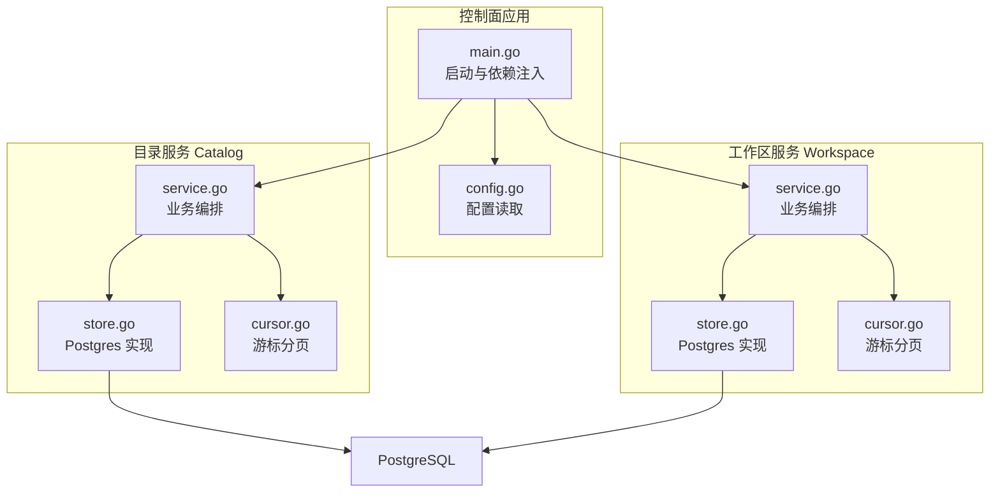
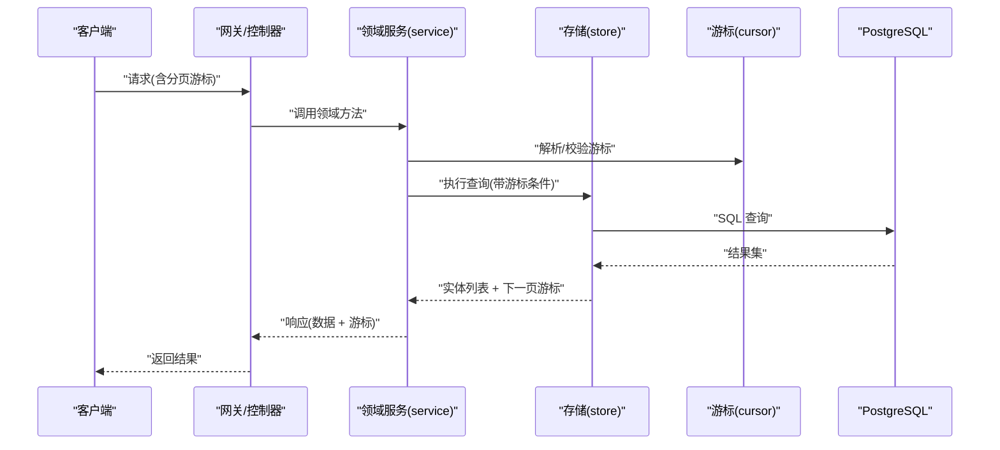
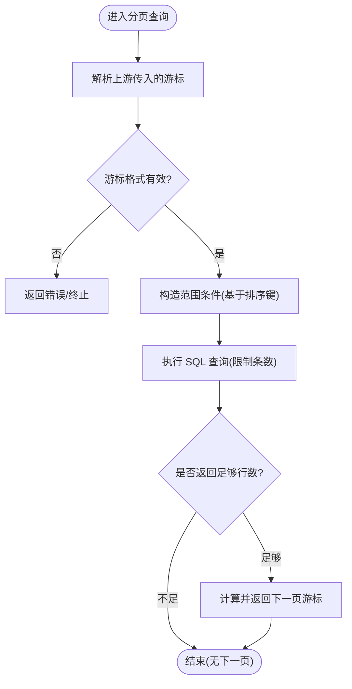
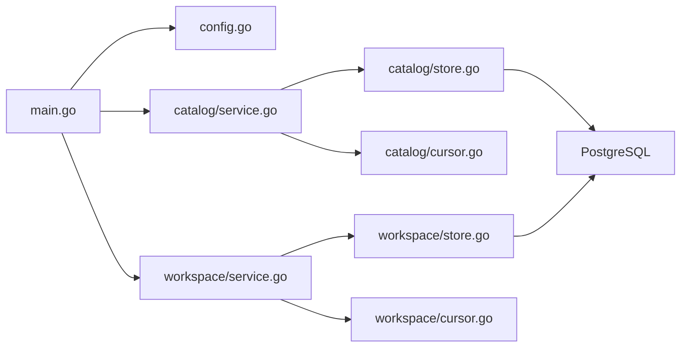

# 数据访问模式

<cite>
**本文引用的文件**   
- [apps/control-plane/internal/catalog/store.go](file://apps/control-plane/internal/catalog/store.go)
- [apps/control-plane/internal/catalog/cursor.go](file://apps/control-plane/internal/catalog/cursor.go)
- [apps/control-plane/internal/workspace/store.go](file://apps/control-plane/internal/workspace/store.go)
- [apps/control-plane/internal/workspace/cursor.go](file://apps/control-plane/internal/workspace/cursor.go)
- [apps/control-plane/internal/config/config.go](file://apps/control-plane/internal/config/config.go)
- [apps/control-plane/cmd/control-plane/main.go](file://apps/control-plane/cmd/control-plane/main.go)
</cite>

## 目录
1. [简介](#简介)
2. [项目结构](#项目结构)
3. [核心组件](#核心组件)
4. [架构总览](#架构总览)
5. [详细组件分析](#详细组件分析)
6. [依赖分析](#依赖分析)
7. [性能考虑](#性能考虑)
8. [故障排查指南](#故障排查指南)
9. [结论](#结论)
10. [附录](#附录)

## 简介
本文件面向 NeKiro 平台的数据访问层，聚焦存储抽象、接口与实现模式、游标分页查询、事务管理、连接池配置与并发控制、缓存策略（预加载/延迟加载）、性能优化技巧、错误处理与重试/熔断策略，以及数据一致性与分布式事务方案。文档以代码仓库中的实际实现为依据，结合可视化图示帮助读者快速理解并落地最佳实践。

## 项目结构
NeKiro 的控制面服务将数据访问按领域划分到 catalog 与 workspace 两个子域，每个子域包含：
- 存储实现（Postgres）
- 游标分页工具
- 领域模型与服务编排入口（服务层调用存储层）

图表来源
- [apps/control-plane/cmd/control-plane/main.go](file://apps/control-plane/cmd/control-plane/main.go)
- [apps/control-plane/internal/config/config.go](file://apps/control-plane/internal/config/config.go)
- [apps/control-plane/internal/catalog/store.go](file://apps/control-plane/internal/catalog/store.go)
- [apps/control-plane/internal/catalog/cursor.go](file://apps/control-plane/internal/catalog/cursor.go)
- [apps/control-plane/internal/workspace/store.go](file://apps/control-plane/internal/workspace/store.go)
- [apps/control-plane/internal/workspace/cursor.go](file://apps/control-plane/internal/workspace/cursor.go)

章节来源
- [apps/control-plane/cmd/control-plane/main.go](file://apps/control-plane/cmd/control-plane/main.go)
- [apps/control-plane/internal/config/config.go](file://apps/control-plane/internal/config/config.go)
- [apps/control-plane/internal/catalog/store.go](file://apps/control-plane/internal/catalog/store.go)
- [apps/control-plane/internal/catalog/cursor.go](file://apps/control-plane/internal/catalog/cursor.go)
- [apps/control-plane/internal/workspace/store.go](file://apps/control-plane/internal/workspace/store.go)
- [apps/control-plane/internal/workspace/cursor.go](file://apps/control-plane/internal/workspace/cursor.go)

## 核心组件
- 存储抽象与实现
  - 各子域通过独立的 store 文件提供 Postgres 实现，封装 SQL 执行、结果映射与错误转换。
  - 典型职责：CRUD、条件过滤、排序、分页（游标）。
- 游标分页
  - cursor 模块提供统一的游标编码/解码与边界判断逻辑，确保稳定、可复现的翻页语义。
- 配置与连接
  - config 模块集中读取数据库连接参数；main 负责初始化连接池并注入到各 store。
- 服务编排
  - service 文件作为领域入口，组合多个存储操作，必要时组织事务边界。

章节来源
- [apps/control-plane/internal/catalog/store.go](file://apps/control-plane/internal/catalog/store.go)
- [apps/control-plane/internal/workspace/store.go](file://apps/control-plane/internal/workspace/store.go)
- [apps/control-plane/internal/catalog/cursor.go](file://apps/control-plane/internal/catalog/cursor.go)
- [apps/control-plane/internal/workspace/cursor.go](file://apps/control-plane/internal/workspace/cursor.go)
- [apps/control-plane/internal/config/config.go](file://apps/control-plane/internal/config/config.go)
- [apps/control-plane/cmd/control-plane/main.go](file://apps/control-plane/cmd/control-plane/main.go)

## 架构总览
数据访问采用“服务层 -> 存储层 -> 数据库”的分层结构，配合游标分页工具统一分页语义。

图表来源
- [apps/control-plane/internal/catalog/service.go](file://apps/control-plane/internal/catalog/service.go)
- [apps/control-plane/internal/catalog/store.go](file://apps/control-plane/internal/catalog/store.go)
- [apps/control-plane/internal/catalog/cursor.go](file://apps/control-plane/internal/catalog/cursor.go)
- [apps/control-plane/internal/workspace/service.go](file://apps/control-plane/internal/workspace/service.go)
- [apps/control-plane/internal/workspace/store.go](file://apps/control-plane/internal/workspace/store.go)
- [apps/control-plane/internal/workspace/cursor.go](file://apps/control-plane/internal/workspace/cursor.go)

## 详细组件分析

### 存储层抽象与实现模式
- 设计要点
  - 每个子域一个 store 文件，职责单一：仅负责与数据库交互。
  - 对外暴露结构化方法（如按条件查询、创建、更新、删除），内部使用参数化 SQL 与上下文超时。
  - 错误类型向上抛出，由上层统一处理或转换为领域错误。
- 常见模式
  - 单条查询：根据主键或唯一键获取记录，不存在时返回空值或特定错误。
  - 批量查询：基于游标条件进行范围扫描，避免偏移分页的性能问题。
  - 写入路径：在需要原子性的场景下，由服务层组织事务边界。

章节来源
- [apps/control-plane/internal/catalog/store.go](file://apps/control-plane/internal/catalog/store.go)
- [apps/control-plane/internal/workspace/store.go](file://apps/control-plane/internal/workspace/store.go)

### 游标分页查询原理与优化
- 原理
  - 客户端携带上一页最后一条记录的“游标”（通常由排序键拼接而成）。
  - 服务端解析游标后，将其转化为 SQL 的范围条件（如大于某值），再按相同排序取固定数量记录。
  - 返回结果中包含下一个游标，用于继续翻页。
- 关键流程

图表来源
- [apps/control-plane/internal/catalog/cursor.go](file://apps/control-plane/internal/catalog/cursor.go)
- [apps/control-plane/internal/workspace/cursor.go](file://apps/control-plane/internal/workspace/cursor.go)
- [apps/control-plane/internal/catalog/store.go](file://apps/control-plane/internal/catalog/store.go)
- [apps/control-plane/internal/workspace/store.go](file://apps/control-plane/internal/workspace/store.go)

- 优化策略
  - 排序键需有索引支持，优先选择单调递增且区分度高的字段组合。
  - 限制每页大小，避免单次返回过多数据。
  - 游标中仅包含必要字段，减少传输开销与解析成本。
  - 对热点查询增加只读副本或缓存层（见后续章节）。

章节来源
- [apps/control-plane/internal/catalog/cursor.go](file://apps/control-plane/internal/catalog/cursor.go)
- [apps/control-plane/internal/workspace/cursor.go](file://apps/control-plane/internal/workspace/cursor.go)

### 事务管理与并发控制
- 事务边界
  - 由服务层在需要多步写操作的场景中开启事务，保证一致性；失败则回滚。
  - 单个只读查询无需显式事务，除非需要强一致的快照读。
- 并发控制
  - 使用行级锁或乐观锁（版本号）解决竞争写冲突。
  - 在高并发场景下，合理设置最大并发与队列长度，避免雪崩。

章节来源
- [apps/control-plane/internal/catalog/service.go](file://apps/control-plane/internal/catalog/service.go)
- [apps/control-plane/internal/workspace/service.go](file://apps/control-plane/internal/workspace/service.go)

### 连接池配置
- 配置项
  - 最大空闲连接数、最大活跃连接数、连接生命周期、空闲超时等。
- 初始化
  - main 负责从配置读取参数并构建连接池，注入到各 store。
- 建议
  - 根据 QPS、平均响应时间与数据库容量估算连接数。
  - 为读写分离场景分别配置连接池。

章节来源
- [apps/control-plane/internal/config/config.go](file://apps/control-plane/internal/config/config.go)
- [apps/control-plane/cmd/control-plane/main.go](file://apps/control-plane/cmd/control-plane/main.go)

### 缓存策略、预加载与延迟加载
- 缓存策略
  - 读多写少数据适合引入本地缓存或分布式缓存，注意失效与一致性。
- 预加载
  - 在已知关联关系时，一次性拉取所需数据，减少 N+1 查询。
- 延迟加载
  - 仅在访问时才触发加载，降低初始开销，但需注意潜在的性能抖动。

章节来源
- [apps/control-plane/internal/catalog/service.go](file://apps/control-plane/internal/catalog/service.go)
- [apps/control-plane/internal/workspace/service.go](file://apps/control-plane/internal/workspace/service.go)

### 错误处理、重试与熔断
- 错误分类
  - 网络/IO 错误、数据库约束冲突、业务校验失败等。
- 重试机制
  - 对幂等读操作可进行有限次重试；写操作需谨慎，确保幂等性。
- 熔断与降级
  - 当下游不可用或错误率升高时，快速失败并返回友好提示或默认值。

章节来源
- [apps/control-plane/internal/catalog/store.go](file://apps/control-plane/internal/catalog/store.go)
- [apps/control-plane/internal/workspace/store.go](file://apps/control-plane/internal/workspace/store.go)

### 数据一致性与分布式事务
- 单机一致性
  - 通过事务与索引保证 ACID；复杂跨表更新在服务层组织事务。
- 分布式一致性
  - 跨服务场景可采用最终一致性（事件驱动）或两阶段提交（谨慎使用）。
  - 补偿事务与幂等设计是关键。

章节来源
- [apps/control-plane/internal/catalog/service.go](file://apps/control-plane/internal/catalog/service.go)
- [apps/control-plane/internal/workspace/service.go](file://apps/control-plane/internal/workspace/service.go)

## 依赖分析
- 组件耦合
  - 服务层依赖存储层与游标工具；存储层仅依赖数据库驱动与配置。
- 外部依赖
  - PostgreSQL 驱动、配置库、可选的缓存/消息中间件（按需扩展）。
- 循环依赖
  - 当前分层清晰，未发现循环导入风险。

图表来源
- [apps/control-plane/cmd/control-plane/main.go](file://apps/control-plane/cmd/control-plane/main.go)
- [apps/control-plane/internal/config/config.go](file://apps/control-plane/internal/config/config.go)
- [apps/control-plane/internal/catalog/service.go](file://apps/control-plane/internal/catalog/service.go)
- [apps/control-plane/internal/catalog/store.go](file://apps/control-plane/internal/catalog/store.go)
- [apps/control-plane/internal/catalog/cursor.go](file://apps/control-plane/internal/catalog/cursor.go)
- [apps/control-plane/internal/workspace/service.go](file://apps/control-plane/internal/workspace/service.go)
- [apps/control-plane/internal/workspace/store.go](file://apps/control-plane/internal/workspace/store.go)
- [apps/control-plane/internal/workspace/cursor.go](file://apps/control-plane/internal/workspace/cursor.go)

章节来源
- [apps/control-plane/cmd/control-plane/main.go](file://apps/control-plane/cmd/control-plane/main.go)
- [apps/control-plane/internal/config/config.go](file://apps/control-plane/internal/config/config.go)
- [apps/control-plane/internal/catalog/service.go](file://apps/control-plane/internal/catalog/service.go)
- [apps/control-plane/internal/workspace/service.go](file://apps/control-plane/internal/workspace/service.go)

## 性能考虑
- 索引与排序
  - 为游标排序键建立合适索引，避免全表扫描。
- 分页大小
  - 控制每页大小，避免大对象与长事务。
- 连接池
  - 依据负载调优连接池参数，避免连接耗尽或过度分配。
- 读写分离
  - 将只读查询路由至只读副本，提升吞吐。
- 缓存命中
  - 针对热点键设置短 TTL 与合理的失效策略。

[本节为通用指导，不直接分析具体文件]

## 故障排查指南
- 常见问题
  - 游标无效：检查排序键与游标编码是否匹配。
  - 连接池耗尽：监控活跃连接与等待时间，调整池大小。
  - 慢查询：定位未命中索引的 SQL，补充索引或改写查询。
  - 事务冲突：观察锁等待与死锁日志，优化事务粒度。
- 诊断手段
  - 启用慢查询日志与连接池指标。
  - 在关键路径添加埋点，追踪耗时分布。

章节来源
- [apps/control-plane/internal/catalog/store.go](file://apps/control-plane/internal/catalog/store.go)
- [apps/control-plane/internal/workspace/store.go](file://apps/control-plane/internal/workspace/store.go)
- [apps/control-plane/internal/config/config.go](file://apps/control-plane/internal/config/config.go)

## 结论
NeKiro 的数据访问层以清晰的领域分层、稳定的游标分页与可扩展的连接配置为基础，具备良好的性能与可维护性。建议在现有基础上持续完善缓存策略、重试与熔断机制，并在分布式场景下引入最终一致性与补偿方案，以提升整体可靠性与用户体验。

[本节为总结性内容，不直接分析具体文件]

## 附录
- 术语
  - 游标分页：基于排序键范围的条件分页方式。
  - 连接池：复用数据库连接的资源池。
  - 熔断：在异常情况下快速失败以避免级联故障。
- 参考
  - 相关实现文件路径参见“本文引用的文件”。

[本节为附加信息，不直接分析具体文件]