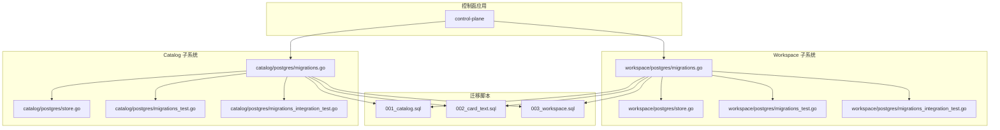
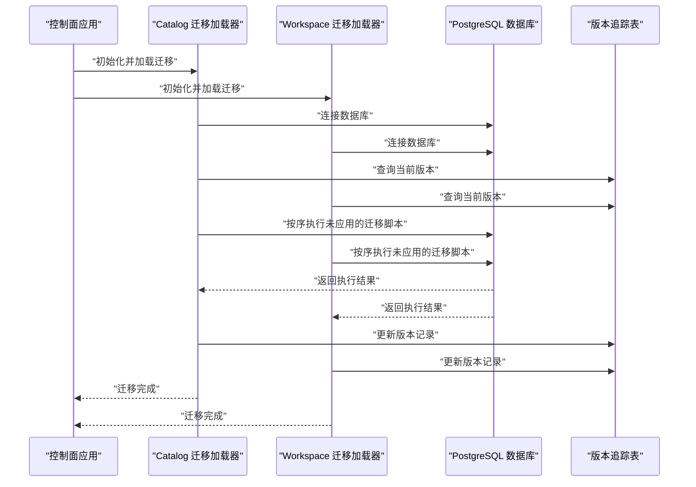
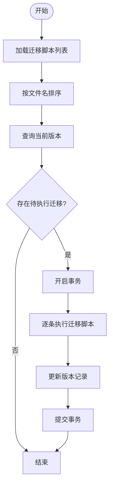
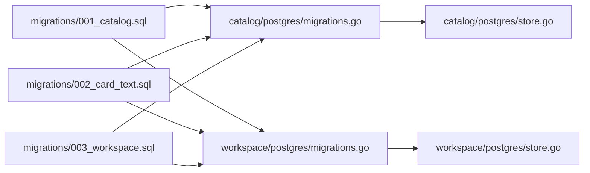

# 数据迁移管理

<cite>
**本文引用的文件**   
- [migrations.go](file://apps/control-plane/internal/catalog/postgres/migrations.go)
- [migrations_test.go](file://apps/control-plane/internal/catalog/postgres/migrations_test.go)
- [migrations_integration_test.go](file://apps/control-plane/internal/catalog/postgres/migrations_integration_test.go)
- [store.go](file://apps/control-plane/internal/catalog/postgres/store.go)
- [001_catalog.sql](file://apps/control-plane/migrations/001_catalog.sql)
- [002_card_text.sql](file://apps/control-plane/migrations/002_card_text.sql)
- [003_workspace.sql](file://apps/control-plane/migrations/003_workspace.sql)
- [migrations.go](file://apps/control-plane/internal/workspace/postgres/migrations.go)
- [migrations_test.go](file://apps/control-plane/internal/workspace/postgres/migrations_test.go)
- [migrations_integration_test.go](file://apps/control-plane/internal/workspace/postgres/migrations_integration_test.go)
- [store.go](file://apps/control-plane/internal/workspace/postgres/store.go)
</cite>

## 目录
1. [简介](#简介)
2. [项目结构](#项目结构)
3. [核心组件](#核心组件)
4. [架构总览](#架构总览)
5. [详细组件分析](#详细组件分析)
6. [依赖关系分析](#依赖关系分析)
7. [性能考虑](#性能考虑)
8. [故障排查指南](#故障排查指南)
9. [结论](#结论)
10. [附录](#附录)

## 简介
本文件面向 NeKiro 平台的数据迁移管理，聚焦于控制面（Control Plane）中 Catalog 与 Workspace 两个子系统的数据库迁移。文档覆盖以下主题：
- 迁移脚本的版本控制、命名规范与执行顺序
- 迁移文件的结构与语法约定（创建、修改、删除）
- 迁移回滚策略与错误处理机制
- 迁移测试方法与验证流程
- 生产环境部署流程与风险控制
- 迁移冲突解决与数据一致性保证
- 迁移监控与日志记录

## 项目结构
NeKiro 的迁移相关代码位于 control-plane 应用内，按子系统划分：
- 迁移脚本集中存放于 apps/control-plane/migrations 目录，采用数字前缀命名，确保可排序的执行顺序。
- 各子系统的迁移加载与执行逻辑位于对应 postgres 包中，包含迁移注册、版本追踪、集成与单元测试。

图表来源
- [migrations.go](file://apps/control-plane/internal/catalog/postgres/migrations.go)
- [migrations.go](file://apps/control-plane/internal/workspace/postgres/migrations.go)
- [001_catalog.sql](file://apps/control-plane/migrations/001_catalog.sql)
- [002_card_text.sql](file://apps/control-plane/migrations/002_card_text.sql)
- [003_workspace.sql](file://apps/control-plane/migrations/003_workspace.sql)

章节来源
- [migrations.go](file://apps/control-plane/internal/catalog/postgres/migrations.go)
- [migrations.go](file://apps/control-plane/internal/workspace/postgres/migrations.go)
- [001_catalog.sql](file://apps/control-plane/migrations/001_catalog.sql)
- [002_card_text.sql](file://apps/control-plane/migrations/002_card_text.sql)
- [003_workspace.sql](file://apps/control-plane/migrations/003_workspace.sql)

## 核心组件
- 迁移脚本集合：以数字前缀命名的 SQL 文件，定义数据库结构的增量变更。
- 迁移加载器：在各子系统的 postgres 包中实现，负责读取、解析并执行迁移脚本。
- 版本追踪表：用于记录已执行的迁移版本，避免重复执行与确保幂等性。
- 测试套件：包括单元测试与集成测试，验证迁移加载、执行与回滚路径。

章节来源
- [migrations.go](file://apps/control-plane/internal/catalog/postgres/migrations.go)
- [migrations.go](file://apps/control-plane/internal/workspace/postgres/migrations.go)
- [migrations_test.go](file://apps/control-plane/internal/catalog/postgres/migrations_test.go)
- [migrations_test.go](file://apps/control-plane/internal/workspace/postgres/migrations_test.go)
- [migrations_integration_test.go](file://apps/control-plane/internal/catalog/postgres/migrations_integration_test.go)
- [migrations_integration_test.go](file://apps/control-plane/internal/workspace/postgres/migrations_integration_test.go)

## 架构总览
下图展示了迁移在应用启动时的调用链路与关键交互点。

图表来源
- [migrations.go](file://apps/control-plane/internal/catalog/postgres/migrations.go)
- [migrations.go](file://apps/control-plane/internal/workspace/postgres/migrations.go)
- [store.go](file://apps/control-plane/internal/catalog/postgres/store.go)
- [store.go](file://apps/control-plane/internal/workspace/postgres/store.go)

## 详细组件分析

### 迁移脚本与命名规范
- 命名规范：使用三位或更多位数字前缀加下划线与描述，如 001_catalog.sql、002_card_text.sql、003_workspace.sql。该格式便于文件系统排序与语义化理解。
- 版本控制：每个 SQL 文件代表一次不可逆的增量变更；新增变更应追加新编号文件，禁止修改历史文件。
- 执行顺序：由文件名前缀决定，系统按字典序依次执行尚未应用的迁移。

章节来源
- [001_catalog.sql](file://apps/control-plane/migrations/001_catalog.sql)
- [002_card_text.sql](file://apps/control-plane/migrations/002_card_text.sql)
- [003_workspace.sql](file://apps/control-plane/migrations/003_workspace.sql)

### 迁移文件结构与语法约定
- 文件内容应为幂等的 DDL/DML 语句集合，建议：
  - 使用事务包裹多条语句，确保原子性。
  - 对可能重复执行的变更增加条件判断（例如 IF NOT EXISTS）。
  - 明确注释变更目的与影响范围。
- 支持的变更类型：
  - 创建：建表、索引、序列、视图等。
  - 修改：添加列、修改约束、重建索引等。
  - 删除：删除对象需谨慎，需评估数据依赖与回滚方案。

章节来源
- [001_catalog.sql](file://apps/control-plane/migrations/001_catalog.sql)
- [002_card_text.sql](file://apps/control-plane/migrations/002_card_text.sql)
- [003_workspace.sql](file://apps/control-plane/migrations/003_workspace.sql)

### 迁移加载与执行流程（Catalog 子系统）

图表来源
- [migrations.go](file://apps/control-plane/internal/catalog/postgres/migrations.go)
- [store.go](file://apps/control-plane/internal/catalog/postgres/store.go)

章节来源
- [migrations.go](file://apps/control-plane/internal/catalog/postgres/migrations.go)
- [store.go](file://apps/control-plane/internal/catalog/postgres/store.go)

### 迁移加载与执行流程（Workspace 子系统）

图表来源
- [migrations.go](file://apps/control-plane/internal/workspace/postgres/migrations.go)
- [store.go](file://apps/control-plane/internal/workspace/postgres/store.go)

章节来源
- [migrations.go](file://apps/control-plane/internal/workspace/postgres/migrations.go)
- [store.go](file://apps/control-plane/internal/workspace/postgres/store.go)

### 回滚策略与错误处理
- 回滚策略：
  - 推荐为每次正向迁移编写对应的反向脚本，并在发布流程中提供回滚命令。
  - 若无法完全反向，至少提供降级方案（如保留旧字段、兼容读路径）。
- 错误处理：
  - 单条迁移失败时，事务应回滚，保持数据库状态一致。
  - 记录详细的错误上下文（迁移编号、SQL 片段、错误码），便于定位问题。
  - 对于幂等性不足的脚本，需在应用层进行重试与告警。

章节来源
- [migrations.go](file://apps/control-plane/internal/catalog/postgres/migrations.go)
- [migrations.go](file://apps/control-plane/internal/workspace/postgres/migrations.go)
- [migrations_integration_test.go](file://apps/control-plane/internal/catalog/postgres/migrations_integration_test.go)
- [migrations_integration_test.go](file://apps/control-plane/internal/workspace/postgres/migrations_integration_test.go)

### 迁移测试方法与验证流程
- 单元测试：
  - 验证迁移脚本加载与排序正确性。
  - 校验版本追踪表的读写行为。
- 集成测试：
  - 在真实或容器化的 PostgreSQL 环境中执行完整迁移流程。
  - 模拟失败场景（网络中断、权限不足、DDL 冲突），验证回滚与错误上报。
- 验证流程：
  - 预检：检查目标库版本与兼容性。
  - 执行：按序执行迁移并记录审计日志。
  - 后验：运行数据一致性校验与业务冒烟用例。

章节来源
- [migrations_test.go](file://apps/control-plane/internal/catalog/postgres/migrations_test.go)
- [migrations_test.go](file://apps/control-plane/internal/workspace/postgres/migrations_test.go)
- [migrations_integration_test.go](file://apps/control-plane/internal/catalog/postgres/migrations_integration_test.go)
- [migrations_integration_test.go](file://apps/control-plane/internal/workspace/postgres/migrations_integration_test.go)

### 生产环境部署流程与风险控制
- 部署流程：
  - 灰度发布：先在少量实例执行迁移，观察指标与日志。
  - 全量发布：确认稳定后推广至全部实例。
  - 回滚预案：准备一键回滚脚本与快速切换入口。
- 风险控制：
  - 迁移窗口：选择低峰时段，提前通知相关方。
  - 容量规划：大表变更需评估锁等待与 IO 压力。
  - 监控告警：对慢查询、锁冲突、错误率设置阈值告警。

[本节为通用指导，不直接分析具体文件]

### 迁移冲突解决与数据一致性保证
- 冲突识别：
  - 并发迁移导致的主键/唯一约束冲突。
  - 长事务导致的锁竞争。
- 解决方案：
  - 串行化迁移执行，避免多实例并行写入同一版本。
  - 分阶段变更：先扩后缩（先加列再迁移数据最后删旧列）。
  - 使用幂等脚本与条件语句减少重复执行风险。
- 一致性保证：
  - 事务边界清晰，失败即回滚。
  - 变更后进行数据抽样校验与完整性检查。

[本节为通用指导，不直接分析具体文件]

### 迁移监控与日志记录机制
- 监控指标：
  - 迁移执行耗时、成功/失败次数、版本跃迁信息。
  - 数据库锁等待、慢查询统计。
- 日志记录：
  - 记录迁移编号、开始/结束时间、受影响行数、错误堆栈。
  - 将关键事件接入统一日志平台与告警系统。

[本节为通用指导，不直接分析具体文件]

## 依赖关系分析

图表来源
- [migrations.go](file://apps/control-plane/internal/catalog/postgres/migrations.go)
- [migrations.go](file://apps/control-plane/internal/workspace/postgres/migrations.go)
- [store.go](file://apps/control-plane/internal/catalog/postgres/store.go)
- [store.go](file://apps/control-plane/internal/workspace/postgres/store.go)
- [001_catalog.sql](file://apps/control-plane/migrations/001_catalog.sql)
- [002_card_text.sql](file://apps/control-plane/migrations/002_card_text.sql)
- [003_workspace.sql](file://apps/control-plane/migrations/003_workspace.sql)

章节来源
- [migrations.go](file://apps/control-plane/internal/catalog/postgres/migrations.go)
- [migrations.go](file://apps/control-plane/internal/workspace/postgres/migrations.go)
- [store.go](file://apps/control-plane/internal/catalog/postgres/store.go)
- [store.go](file://apps/control-plane/internal/workspace/postgres/store.go)
- [001_catalog.sql](file://apps/control-plane/migrations/001_catalog.sql)
- [002_card_text.sql](file://apps/control-plane/migrations/002_card_text.sql)
- [003_workspace.sql](file://apps/control-plane/migrations/003_workspace.sql)

## 性能考虑
- 大表变更建议分批次进行，避免长时间锁表。
- 批量 DML 操作使用合适的批大小，平衡吞吐与内存占用。
- 为频繁查询的列建立合适索引，但注意写放大与空间开销。
- 在迁移前后采集基准指标，对比差异并优化。

[本节为通用指导，不直接分析具体文件]

## 故障排查指南
- 常见问题：
  - 迁移重复执行：检查版本追踪表与幂等性。
  - 锁等待超时：分析长事务与并发写入热点。
  - 权限不足：确认数据库用户具备必要 DDL/DML 权限。
- 排查步骤：
  - 查看迁移日志与错误堆栈。
  - 核对当前数据库版本与期望版本。
  - 复现最小化场景，逐步缩小问题范围。
  - 必要时回滚到上一稳定版本并修复脚本。

章节来源
- [migrations_integration_test.go](file://apps/control-plane/internal/catalog/postgres/migrations_integration_test.go)
- [migrations_integration_test.go](file://apps/control-plane/internal/workspace/postgres/migrations_integration_test.go)

## 结论
通过规范的命名与版本控制、清晰的加载与执行流程、完善的测试与回滚策略，以及严格的监控与日志记录，NeKiro 平台能够在保证数据一致性的前提下安全高效地完成数据库结构演进。建议在后续迭代中持续完善幂等性与可观测性，提升迁移的可维护性与可靠性。

[本节为总结性内容，不直接分析具体文件]

## 附录
- 最佳实践清单：
  - 所有迁移脚本必须幂等且可重入。
  - 变更前进行风险评估与影响面分析。
  - 发布前完成本地与集成环境的回归测试。
  - 发布后执行数据一致性校验与业务冒烟用例。
- 参考文件路径：
  - 迁移脚本：apps/control-plane/migrations/*.sql
  - 迁移实现：apps/control-plane/internal/*/postgres/migrations.go
  - 存储与版本追踪：apps/control-plane/internal/*/postgres/store.go
  - 测试用例：apps/control-plane/internal/*/postgres/migrations_test.go 与 migrations_integration_test.go

[本节为补充信息，不直接分析具体文件]