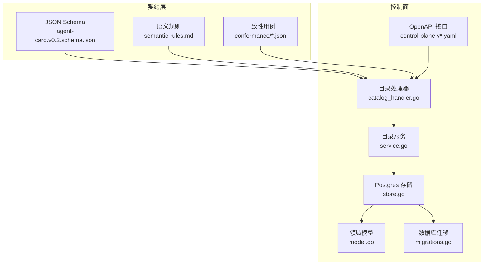
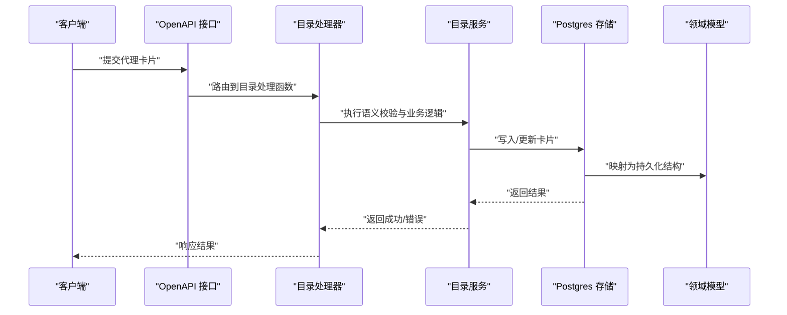
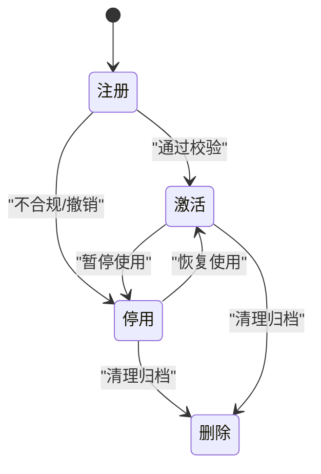
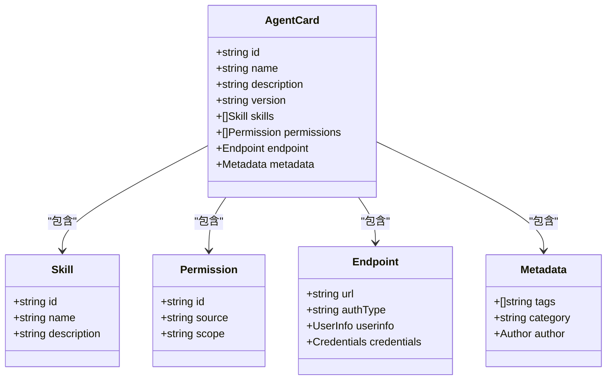
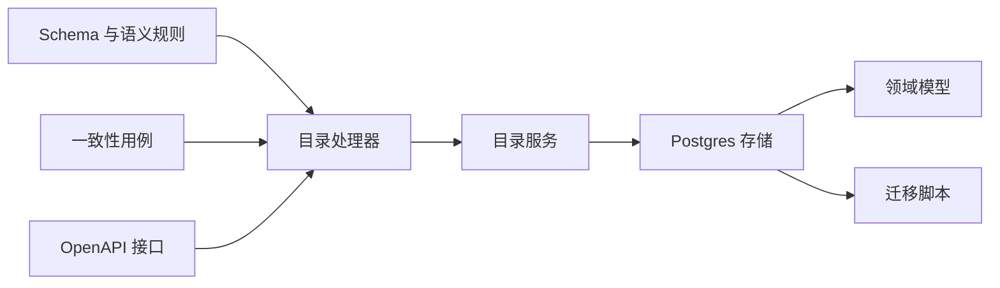

# 代理卡片模型

<cite>
**本文引用的文件**   
- [agent-card.v0.2.schema.json](file://contracts/schemas/agent-card.v0.2.schema.json)
- [semantic-rules.md](file://contracts/agent-card/v0.2/semantic-rules.md)
- [valid-baseline.json](file://contracts/agent-card/v0.2/conformance/valid-baseline.json)
- [invalid-structural-missing-name.json](file://contracts/agent-card/v0.2/conformance/invalid-structural-missing-name.json)
- [invalid-duplicate-skill-id.json](file://contracts/agent-card/v0.2/conformance/invalid-duplicate-skill-id.json)
- [invalid-duplicate-permission-id.json](file://contracts/agent-card/v0.2/conformance/invalid-duplicate-permission-id.json)
- [invalid-endpoint-userinfo-empty.json](file://contracts/agent-card/v0.2/conformance/invalid-endpoint-userinfo-empty.json)
- [invalid-endpoint-userinfo-credentials.json](file://contracts/agent-card/v0.2/conformance/invalid-endpoint-userinfo-credentials.json)
- [invalid-cross-version-permission.json](file://contracts/agent-card/v0.2/conformance/invalid-cross-version-permission.json)
- [invalid-cross-version-permission-source.json](file://contracts/agent-card/v0.2/conformance/invalid-cross-version-permission-source.json)
- [invalid-case-mismatched-permission.json](file://contracts/agent-card/v0.2/conformance/invalid-case-mismatched-permission.json)
- [valid-shared-permission.json](file://contracts/agent-card/v0.2/conformance/valid-shared-permission.json)
- [agent_card_semantics.go](file://contracts/agent_card_semantics.go)
- [catalog_handler.go](file://apps/control-plane/internal/gateway/catalog_handler.go)
- [store.go](file://apps/control-plane/internal/catalog/postgres/store.go)
- [model.go](file://apps/control-plane/internal/catalog/model.go)
- [service.go](file://apps/control-plane/internal/catalog/service.go)
- [migrations.go](file://apps/control-plane/internal/catalog/postgres/migrations.go)
- [control-plane.v1.yaml](file://contracts/openapi/control-plane.v1.yaml)
- [control-plane.v2.yaml](file://contracts/openapi/control-plane.v2.yaml)
- [control-plane.v3.yaml](file://contracts/openapi/control-plane.v3.yaml)
- [control-plane.v4.yaml](file://contracts/openapi/control-plane.v4.yaml)
</cite>

## 目录
1. [简介](#简介)
2. [项目结构](#项目结构)
3. [核心组件](#核心组件)
4. [架构总览](#架构总览)
5. [详细组件分析](#详细组件分析)
6. [依赖分析](#依赖分析)
7. [性能考虑](#性能考虑)
8. [故障排查指南](#故障排查指南)
9. [结论](#结论)
10. [附录](#附录)

## 简介
本文件面向 NeKiro 平台的“代理卡片（Agent Card）”模型，系统性说明其数据结构、字段类型与验证规则、能力定义、端点配置、元数据信息、生命周期状态与转换、版本兼容策略，并提供 JSON Schema 示例路径与 Go 结构体映射指引。文档同时给出最佳实践与常见问题排查建议，帮助开发者正确设计、注册与使用代理卡片。

## 项目结构
围绕代理卡片的核心资产分布在以下位置：
- 契约与校验
  - JSON Schema：contracts/schemas/agent-card.v0.2.schema.json
  - 语义规则与一致性用例：contracts/agent-card/v0.2/*
  - 语义实现与测试：contracts/agent_card_semantics.go
- 控制面服务
  - 目录服务与持久化：apps/control-plane/internal/catalog/*
  - OpenAPI 接口：contracts/openapi/control-plane.*.yaml

图表来源
- [agent-card.v0.2.schema.json](file://contracts/schemas/agent-card.v0.2.schema.json)
- [semantic-rules.md](file://contracts/agent-card/v0.2/semantic-rules.md)
- [catalog_handler.go](file://apps/control-plane/internal/gateway/catalog_handler.go)
- [service.go](file://apps/control-plane/internal/catalog/service.go)
- [store.go](file://apps/control-plane/internal/catalog/postgres/store.go)
- [model.go](file://apps/control-plane/internal/catalog/model.go)
- [migrations.go](file://apps/control-plane/internal/catalog/postgres/migrations.go)
- [control-plane.v1.yaml](file://contracts/openapi/control-plane.v1.yaml)
- [control-plane.v2.yaml](file://contracts/openapi/control-plane.v2.yaml)
- [control-plane.v3.yaml](file://contracts/openapi/control-plane.v3.yaml)
- [control-plane.v4.yaml](file://contracts/openapi/control-plane.v4.yaml)

章节来源
- [agent-card.v0.2.schema.json](file://contracts/schemas/agent-card.v0.2.schema.json)
- [semantic-rules.md](file://contracts/agent-card/v0.2/semantic-rules.md)
- [catalog_handler.go](file://apps/control-plane/internal/gateway/catalog_handler.go)
- [service.go](file://apps/control-plane/internal/catalog/service.go)
- [store.go](file://apps/control-plane/internal/catalog/postgres/store.go)
- [model.go](file://apps/control-plane/internal/catalog/model.go)
- [migrations.go](file://apps/control-plane/internal/catalog/postgres/migrations.go)
- [control-plane.v1.yaml](file://contracts/openapi/control-plane.v1.yaml)
- [control-plane.v2.yaml](file://contracts/openapi/control-plane.v2.yaml)
- [control-plane.v3.yaml](file://contracts/openapi/control-plane.v3.yaml)
- [control-plane.v4.yaml](file://contracts/openapi/control-plane.v4.yaml)

## 核心组件
本节聚焦代理卡片的完整数据结构与关键属性，包括基本信息、能力定义、端点配置与元数据。

- 基本信息
  - 名称：字符串，必填，唯一标识代理的显示名。
  - 描述：字符串，可选，用于人类可读的说明。
  - 版本：字符串或对象，遵循语义化版本或平台自定义格式；用于区分不同迭代。
- 能力定义
  - 技能列表：数组，每项包含 id、名称、描述等；id 需全局唯一且不可重复。
  - 权限要求：数组或对象集合，支持跨版本引用与共享；每个权限项具备 id、来源、作用域等约束。
- 端点配置
  - API 地址：字符串，必须为合法 URL。
  - 认证方式：枚举或对象，支持多种机制（如 Bearer Token、OAuth2、自定义头），并限制 userinfo 与 credentials 的组合合法性。
- 元数据信息
  - 标签：字符串数组，便于检索与筛选。
  - 分类：字符串，表示代理的业务类别。
  - 作者：字符串或对象，记录提供方或维护者信息。

字段类型与验证要点
- 必填性：名称、版本、至少一个端点或能力为强约束。
- 唯一性：技能 id 与权限 id 在卡片内不可重复。
- 组合约束：端点的认证方式与 userinfo/credentials 字段存在互斥或共存规则。
- 跨版本兼容性：权限可跨版本引用，但需满足来源与作用域规则。

章节来源
- [agent-card.v0.2.schema.json](file://contracts/schemas/agent-card.v0.2.schema.json)
- [semantic-rules.md](file://contracts/agent-card/v0.2/semantic-rules.md)
- [valid-baseline.json](file://contracts/agent-card/v0.2/conformance/valid-baseline.json)
- [invalid-structural-missing-name.json](file://contracts/agent-card/v0.2/conformance/invalid-structural-missing-name.json)
- [invalid-duplicate-skill-id.json](file://contracts/agent-card/v0.2/conformance/invalid-duplicate-skill-id.json)
- [invalid-duplicate-permission-id.json](file://contracts/agent-card/v0.2/conformance/invalid-duplicate-permission-id.json)
- [invalid-endpoint-userinfo-empty.json](file://contracts/agent-card/v0.2/conformance/invalid-endpoint-userinfo-empty.json)
- [invalid-endpoint-userinfo-credentials.json](file://contracts/agent-card/v0.2/conformance/invalid-endpoint-userinfo-credentials.json)
- [invalid-cross-version-permission.json](file://contracts/agent-card/v0.2/conformance/invalid-cross-version-permission.json)
- [invalid-cross-version-permission-source.json](file://contracts/agent-card/v0.2/conformance/invalid-cross-version-permission-source.json)
- [invalid-case-mismatched-permission.json](file://contracts/agent-card/v0.2/conformance/invalid-case-mismatched-permission.json)
- [valid-shared-permission.json](file://contracts/agent-card/v0.2/conformance/valid-shared-permission.json)

## 架构总览
代理卡片从契约到落库的关键流程如下：
- 契约层提供 JSON Schema 与语义规则，并通过一致性用例进行回归验证。
- 控制面通过 OpenAPI 暴露目录接口，由目录处理器接收请求，调用目录服务执行校验与持久化。
- 存储层基于 Postgres 持久化卡片实体，迁移脚本管理表结构演进。

图表来源
- [control-plane.v1.yaml](file://contracts/openapi/control-plane.v1.yaml)
- [control-plane.v2.yaml](file://contracts/openapi/control-plane.v2.yaml)
- [control-plane.v3.yaml](file://contracts/openapi/control-plane.v3.yaml)
- [control-plane.v4.yaml](file://contracts/openapi/control-plane.v4.yaml)
- [catalog_handler.go](file://apps/control-plane/internal/gateway/catalog_handler.go)
- [service.go](file://apps/control-plane/internal/catalog/service.go)
- [store.go](file://apps/control-plane/internal/catalog/postgres/store.go)
- [model.go](file://apps/control-plane/internal/catalog/model.go)

## 详细组件分析

### 数据结构与字段规范
- 基本信息字段
  - 名称：必填，非空字符串，长度与字符集受 Schema 约束。
  - 描述：可选，文本内容，支持多语言键值对或纯文本。
  - 版本：必填，遵循语义化版本或平台扩展格式，用于向后兼容判断。
- 能力定义
  - 技能列表：数组，元素含 id、名称、描述、输入输出模式等；id 唯一性校验失败将拒绝注册。
  - 权限要求：数组或对象集合，支持共享与跨版本引用；重复 id 或非法来源将被拒绝。
- 端点配置
  - API 地址：必填，URL 格式校验严格。
  - 认证方式：必填或按场景可选，支持多种机制；userinfo 与 credentials 的组合有明确约束。
- 元数据信息
  - 标签：字符串数组，去重与大小写敏感。
  - 分类：字符串，预定义或自由文本。
  - 作者：字符串或对象，包含名称、联系方式等。

字段验证规则与业务含义
- 必填性与唯一性：名称、版本、技能 id、权限 id 的约束确保卡片可被唯一识别与检索。
- 组合约束：端点认证方式与 userinfo/credentials 的互斥/共存规则防止不安全配置。
- 跨版本兼容：权限可跨版本引用，但来源与作用域需符合语义规则，避免破坏性变更。

章节来源
- [agent-card.v0.2.schema.json](file://contracts/schemas/agent-card.v0.2.schema.json)
- [semantic-rules.md](file://contracts/agent-card/v0.2/semantic-rules.md)
- [invalid-structural-missing-name.json](file://contracts/agent-card/v0.2/conformance/invalid-structural-missing-name.json)
- [invalid-duplicate-skill-id.json](file://contracts/agent-card/v0.2/conformance/invalid-duplicate-skill-id.json)
- [invalid-duplicate-permission-id.json](file://contracts/agent-card/v0.2/conformance/invalid-duplicate-permission-id.json)
- [invalid-endpoint-userinfo-empty.json](file://contracts/agent-card/v0.2/conformance/invalid-endpoint-userinfo-empty.json)
- [invalid-endpoint-userinfo-credentials.json](file://contracts/agent-card/v0.2/conformance/invalid-endpoint-userinfo-credentials.json)
- [invalid-cross-version-permission.json](file://contracts/agent-card/v0.2/conformance/invalid-cross-version-permission.json)
- [invalid-cross-version-permission-source.json](file://contracts/agent-card/v0.2/conformance/invalid-cross-version-permission-source.json)
- [invalid-case-mismatched-permission.json](file://contracts/agent-card/v0.2/conformance/invalid-case-mismatched-permission.json)
- [valid-shared-permission.json](file://contracts/agent-card/v0.2/conformance/valid-shared-permission.json)

### 生命周期状态与转换
代理卡片在目录中的典型状态包括：注册、激活、停用、删除。状态转换遵循最小权限与可审计原则：
- 注册：新卡片进入目录，处于待审核或草稿态。
- 激活：通过校验后转为可用状态，供路由与发现。
- 停用：因合规或运维需要暂停使用，保留历史与依赖关系。
- 删除：彻底移除或归档，视平台策略而定。

[此图为概念性状态图，无需源码映射]

### 版本兼容策略与向后兼容保证
- 语义化版本：主版本变更可能引入破坏性变更，次版本新增特性，修订版本修复问题。
- 向后兼容保证：
  - 新增字段默认可选，不影响旧客户端解析。
  - 废弃字段保留一段时间并提供迁移提示。
  - 权限与端点配置采用可扩展对象，允许未来扩展而不破坏现有行为。
- 跨版本引用：权限可跨版本引用，但来源与作用域需满足语义规则，避免隐式依赖导致的不稳定。

章节来源
- [semantic-rules.md](file://contracts/agent-card/v0.2/semantic-rules.md)
- [invalid-cross-version-permission.json](file://contracts/agent-card/v0.2/conformance/invalid-cross-version-permission.json)
- [invalid-cross-version-permission-source.json](file://contracts/agent-card/v0.2/conformance/invalid-cross-version-permission-source.json)

### Go 结构体映射与持久化模型
- 契约到模型的映射
  - JSON Schema 字段映射到 Go 结构体字段，使用 tag 指定序列化与校验规则。
  - 目录服务在入库前进行二次校验，确保领域不变量。
- 持久化模型
  - 领域模型包含卡片 ID、版本、能力集合、端点配置、元数据等。
  - 存储层负责与数据库交互，迁移脚本管理表结构演进。

图表来源
- [model.go](file://apps/control-plane/internal/catalog/model.go)
- [store.go](file://apps/control-plane/internal/catalog/postgres/store.go)
- [migrations.go](file://apps/control-plane/internal/catalog/postgres/migrations.go)

章节来源
- [model.go](file://apps/control-plane/internal/catalog/model.go)
- [store.go](file://apps/control-plane/internal/catalog/postgres/store.go)
- [migrations.go](file://apps/control-plane/internal/catalog/postgres/migrations.go)

### 实际配置示例与最佳实践
- 示例路径
  - 基线有效样例：contracts/agent-card/v0.2/conformance/valid-baseline.json
  - 共享权限样例：contracts/agent-card/v0.2/conformance/valid-shared-permission.json
- 最佳实践
  - 明确命名与版本：使用语义化版本，保持变更记录清晰。
  - 精简权限范围：仅声明必要权限，避免过度授权。
  - 端点安全：优先使用标准认证方式，避免明文凭证。
  - 标签与分类：合理组织，提升检索效率。
  - 跨版本兼容：谨慎引入破坏性变更，提供迁移指南。

章节来源
- [valid-baseline.json](file://contracts/agent-card/v0.2/conformance/valid-baseline.json)
- [valid-shared-permission.json](file://contracts/agent-card/v0.2/conformance/valid-shared-permission.json)

## 依赖分析
代理卡片相关模块之间的依赖关系如下：
- 契约层（Schema、语义规则、一致性用例）驱动控制面的校验逻辑。
- 控制面通过 OpenAPI 暴露接口，目录处理器调用目录服务完成业务处理。
- 目录服务与存储层交互，持久化卡片实体，迁移脚本管理数据库结构。

图表来源
- [agent-card.v0.2.schema.json](file://contracts/schemas/agent-card.v0.2.schema.json)
- [semantic-rules.md](file://contracts/agent-card/v0.2/semantic-rules.md)
- [catalog_handler.go](file://apps/control-plane/internal/gateway/catalog_handler.go)
- [service.go](file://apps/control-plane/internal/catalog/service.go)
- [store.go](file://apps/control-plane/internal/catalog/postgres/store.go)
- [model.go](file://apps/control-plane/internal/catalog/model.go)
- [migrations.go](file://apps/control-plane/internal/catalog/postgres/migrations.go)
- [control-plane.v1.yaml](file://contracts/openapi/control-plane.v1.yaml)
- [control-plane.v2.yaml](file://contracts/openapi/control-plane.v2.yaml)
- [control-plane.v3.yaml](file://contracts/openapi/control-plane.v3.yaml)
- [control-plane.v4.yaml](file://contracts/openapi/control-plane.v4.yaml)

章节来源
- [catalog_handler.go](file://apps/control-plane/internal/gateway/catalog_handler.go)
- [service.go](file://apps/control-plane/internal/catalog/service.go)
- [store.go](file://apps/control-plane/internal/catalog/postgres/store.go)
- [model.go](file://apps/control-plane/internal/catalog/model.go)
- [migrations.go](file://apps/control-plane/internal/catalog/postgres/migrations.go)
- [control-plane.v1.yaml](file://contracts/openapi/control-plane.v1.yaml)
- [control-plane.v2.yaml](file://contracts/openapi/control-plane.v2.yaml)
- [control-plane.v3.yaml](file://contracts/openapi/control-plane.v3.yaml)
- [control-plane.v4.yaml](file://contracts/openapi/control-plane.v4.yaml)

## 性能考虑
- 索引优化：对名称、版本、标签、分类建立合适索引以提升查询性能。
- 缓存策略：对高频读取的卡片元数据进行缓存，降低数据库压力。
- 批量操作：在导入或迁移时采用批量写入减少往返开销。
- 校验前置：在网关层进行轻量校验，尽早拒绝无效请求。

[本节为通用指导，无需源码映射]

## 故障排查指南
常见错误与定位方法：
- 结构缺失：缺少必填字段（如名称）将触发结构性错误。
  - 参考用例：contracts/agent-card/v0.2/conformance/invalid-structural-missing-name.json
- 唯一性冲突：技能或权限 id 重复导致注册失败。
  - 参考用例：contracts/agent-card/v0.2/conformance/invalid-duplicate-skill-id.json、contracts/agent-card/v0.2/conformance/invalid-duplicate-permission-id.json
- 认证配置错误：userinfo 为空或与 credentials 组合不合法。
  - 参考用例：contracts/agent-card/v0.2/conformance/invalid-endpoint-userinfo-empty.json、contracts/agent-card/v0.2/conformance/invalid-endpoint-userinfo-credentials.json
- 跨版本权限问题：权限来源或作用域不符合语义规则。
  - 参考用例：contracts/agent-card/v0.2/conformance/invalid-cross-version-permission.json、contracts/agent-card/v0.2/conformance/invalid-cross-version-permission-source.json、contracts/agent-card/v0.2/conformance/invalid-case-mismatched-permission.json

章节来源
- [invalid-structural-missing-name.json](file://contracts/agent-card/v0.2/conformance/invalid-structural-missing-name.json)
- [invalid-duplicate-skill-id.json](file://contracts/agent-card/v0.2/conformance/invalid-duplicate-skill-id.json)
- [invalid-duplicate-permission-id.json](file://contracts/agent-card/v0.2/conformance/invalid-duplicate-permission-id.json)
- [invalid-endpoint-userinfo-empty.json](file://contracts/agent-card/v0.2/conformance/invalid-endpoint-userinfo-empty.json)
- [invalid-endpoint-userinfo-credentials.json](file://contracts/agent-card/v0.2/conformance/invalid-endpoint-userinfo-credentials.json)
- [invalid-cross-version-permission.json](file://contracts/agent-card/v0.2/conformance/invalid-cross-version-permission.json)
- [invalid-cross-version-permission-source.json](file://contracts/agent-card/v0.2/conformance/invalid-cross-version-permission-source.json)
- [invalid-case-mismatched-permission.json](file://contracts/agent-card/v0.2/conformance/invalid-case-mismatched-permission.json)

## 结论
代理卡片模型以严格的契约与语义规则为基础，结合控制面的校验与持久化能力，提供了完整的生命周期管理与版本兼容保障。通过合理的字段设计、权限与端点配置以及最佳实践，开发者可以构建安全、可维护且易于发现的代理服务。

[本节为总结性内容，无需源码映射]

## 附录
- JSON Schema 示例路径
  - contracts/schemas/agent-card.v0.2.schema.json
- 语义规则与一致性用例
  - contracts/agent-card/v0.2/semantic-rules.md
  - contracts/agent-card/v0.2/conformance/*.json
- 控制面接口与实现
  - contracts/openapi/control-plane.v*.yaml
  - apps/control-plane/internal/gateway/catalog_handler.go
  - apps/control-plane/internal/catalog/service.go
  - apps/control-plane/internal/catalog/postgres/store.go
  - apps/control-plane/internal/catalog/model.go
  - apps/control-plane/internal/catalog/postgres/migrations.go

[本节为资源索引，无需源码映射]