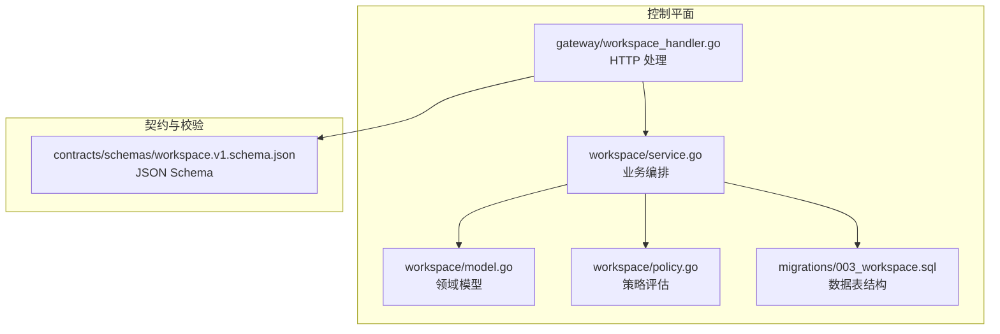
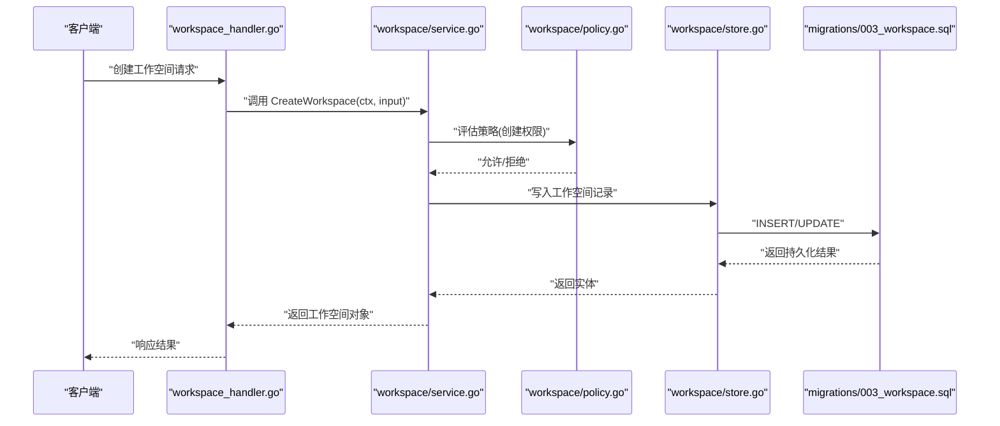
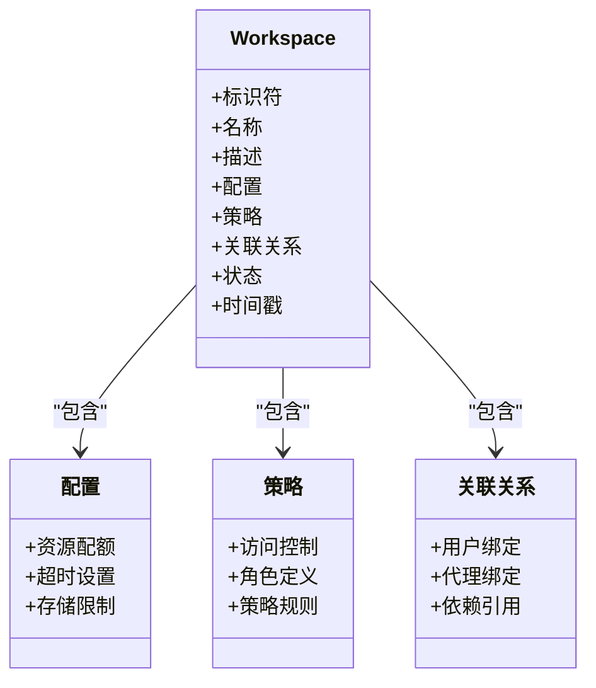
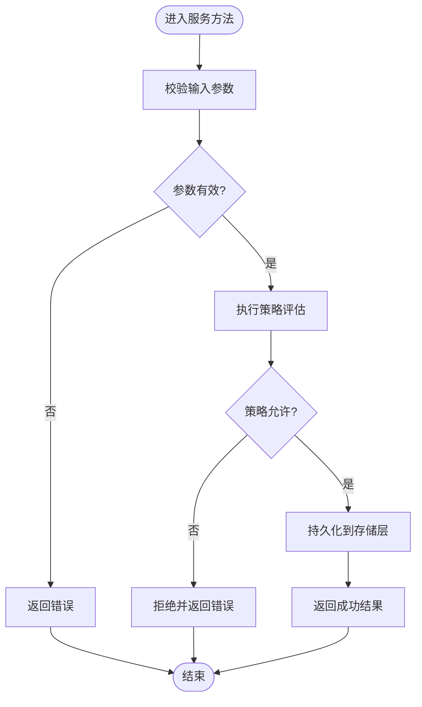
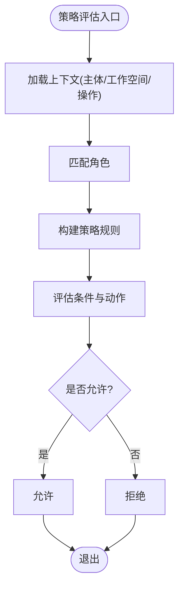
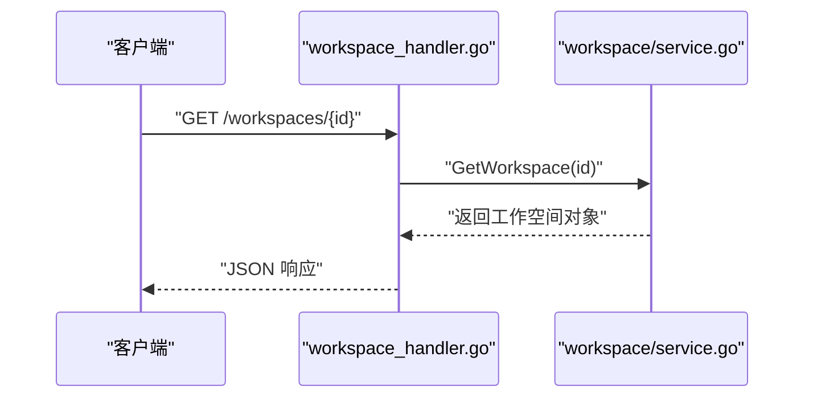
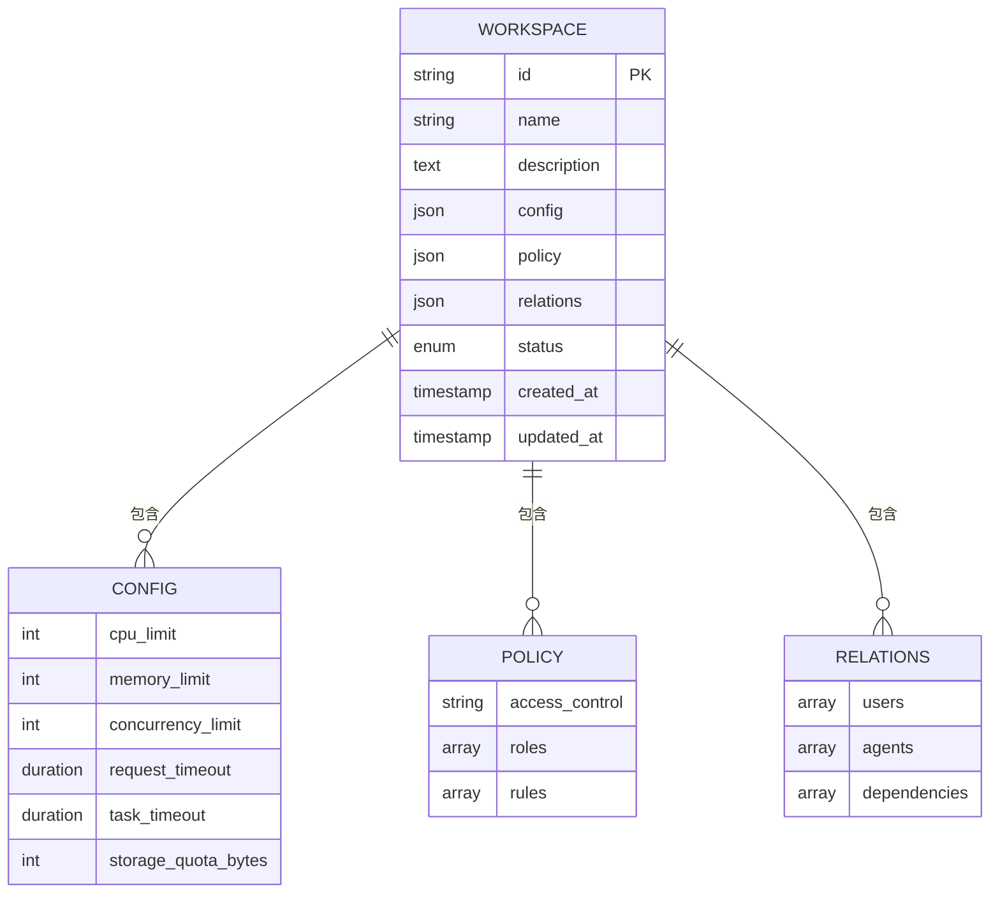
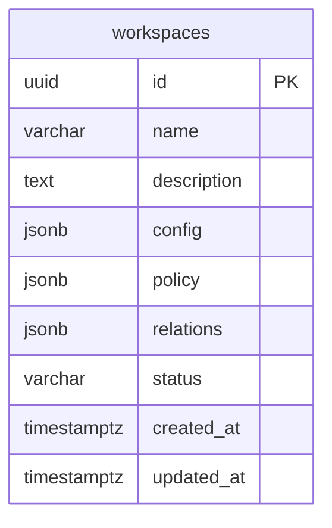
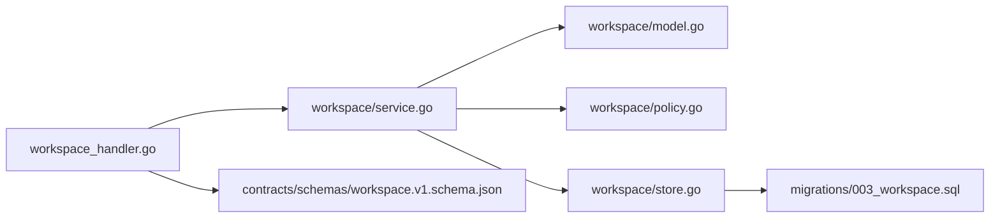

# 工作空间模型

<cite>
**本文引用的文件**   
- [apps/control-plane/internal/workspace/model.go](file://apps/control-plane/internal/workspace/model.go)
- [apps/control-plane/internal/workspace/service.go](file://apps/control-plane/internal/workspace/service.go)
- [apps/control-plane/internal/workspace/store.go](file://apps/control-plane/internal/workspace/store.go)
- [apps/control-plane/internal/workspace/policy.go](file://apps/control-plane/internal/workspace/policy.go)
- [apps/control-plane/internal/gateway/workspace_handler.go](file://apps/control-plane/internal/gateway/workspace_handler.go)
- [contracts/schemas/workspace.v1.schema.json](file://contracts/schemas/workspace.v1.schema.json)
- [migrations/003_workspace.sql](file://migrations/003_workspace.sql)
</cite>

## 目录
1. [简介](#简介)
2. [项目结构](#项目结构)
3. [核心组件](#核心组件)
4. [架构总览](#架构总览)
5. [详细组件分析](#详细组件分析)
6. [依赖关系分析](#依赖关系分析)
7. [性能考虑](#性能考虑)
8. [故障排查指南](#故障排查指南)
9. [结论](#结论)
10. [附录](#附录)

## 简介
本文件面向 NeKiro 平台的工作空间（Workspace）模型，系统性阐述其数据结构、配置参数、权限策略、关联关系、多租户隔离机制与数据边界，以及生命周期管理与状态机设计。文档同时提供 JSON Schema 与 Go 结构体的参考路径，并给出最佳实践与安全建议，帮助读者快速理解并正确使用工作空间能力。

## 项目结构
工作空间相关代码主要位于控制平面（control-plane）的 workspace 模块与网关层，配合数据库迁移与契约定义：
- 领域模型与持久化：workspace 包下的 model、store、service、policy
- 对外接口：gateway 层的 workspace_handler
- 契约与校验：contracts/schemas 中的 workspace.v1.schema.json
- 数据表结构：migrations/003_workspace.sql

图表来源
- [apps/control-plane/internal/workspace/model.go](file://apps/control-plane/internal/workspace/model.go)
- [apps/control-plane/internal/workspace/service.go](file://apps/control-plane/internal/workspace/service.go)
- [apps/control-plane/internal/workspace/policy.go](file://apps/control-plane/internal/workspace/policy.go)
- [apps/control-plane/internal/gateway/workspace_handler.go](file://apps/control-plane/internal/gateway/workspace_handler.go)
- [contracts/schemas/workspace.v1.schema.json](file://contracts/schemas/workspace.v1.schema.json)
- [migrations/003_workspace.sql](file://migrations/003_workspace.sql)

章节来源
- [apps/control-plane/internal/workspace/model.go](file://apps/control-plane/internal/workspace/model.go)
- [apps/control-plane/internal/workspace/service.go](file://apps/control-plane/internal/workspace/service.go)
- [apps/control-plane/internal/workspace/store.go](file://apps/control-plane/internal/workspace/store.go)
- [apps/control-plane/internal/workspace/policy.go](file://apps/control-plane/internal/workspace/policy.go)
- [apps/control-plane/internal/gateway/workspace_handler.go](file://apps/control-plane/internal/gateway/workspace_handler.go)
- [contracts/schemas/workspace.v1.schema.json](file://contracts/schemas/workspace.v1.schema.json)
- [migrations/003_workspace.sql](file://migrations/003_workspace.sql)

## 核心组件
本节聚焦工作空间的核心数据结构与关键行为，涵盖基础信息、配置参数、权限策略、关联关系、多租户隔离与数据边界。

- 基础信息
  - 名称、描述、标识符等元数据字段用于唯一识别与工作空间展示。
  - 标识符通常作为跨系统引用键，需具备全局唯一性与稳定性。
- 配置参数
  - 资源配额：CPU、内存、并发度等上限约束，防止单租户资源滥用。
  - 超时设置：请求/任务级超时，避免长尾阻塞。
  - 存储限制：对象存储或本地卷容量上限，保障多租户公平性。
- 权限策略
  - 访问控制：基于角色与策略规则的组合授权。
  - 角色定义：内置角色（如管理员、开发者、只读）与自定义角色扩展点。
  - 策略规则：支持条件匹配与动作判定，实现细粒度控制。
- 关联关系
  - 用户绑定：工作空间成员与其角色映射。
  - 代理绑定：工作空间内可使用的代理/运行时实例集合。
  - 依赖引用：对其他工作空间或资源的依赖声明，便于编排与治理。
- 多租户隔离与数据边界
  - 以工作空间为隔离单元，所有读写操作均携带工作空间上下文。
  - 数据库层面通过外键与索引确保数据归属清晰，查询强制带工作空间过滤。
  - 策略评估在上下文中注入工作空间标识，保证鉴权结果与数据边界一致。

章节来源
- [apps/control-plane/internal/workspace/model.go](file://apps/control-plane/internal/workspace/model.go)
- [apps/control-plane/internal/workspace/policy.go](file://apps/control-plane/internal/workspace/policy.go)
- [migrations/003_workspace.sql](file://migrations/003_workspace.sql)

## 架构总览
工作空间的生命周期由网关层接收请求，交由服务层编排，最终落库持久化；策略评估贯穿创建、更新、删除等关键路径，确保权限合规。

图表来源
- [apps/control-plane/internal/gateway/workspace_handler.go](file://apps/control-plane/internal/gateway/workspace_handler.go)
- [apps/control-plane/internal/workspace/service.go](file://apps/control-plane/internal/workspace/service.go)
- [apps/control-plane/internal/workspace/policy.go](file://apps/control-plane/internal/workspace/policy.go)
- [apps/control-plane/internal/workspace/store.go](file://apps/control-plane/internal/workspace/store.go)
- [migrations/003_workspace.sql](file://migrations/003_workspace.sql)

## 详细组件分析

### 领域模型（Go 结构体）
工作空间的 Go 结构体定义了完整的数据模型，包括基础信息、配置、策略与关联关系。该结构体是服务层与持久化层的共同契约。

图表来源
- [apps/control-plane/internal/workspace/model.go](file://apps/control-plane/internal/workspace/model.go)

章节来源
- [apps/control-plane/internal/workspace/model.go](file://apps/control-plane/internal/workspace/model.go)

### 服务层（生命周期管理）
服务层负责工作空间的生命周期编排，包括创建、读取、更新、删除与归档。每个操作都会进行输入校验、策略评估与持久化。

图表来源
- [apps/control-plane/internal/workspace/service.go](file://apps/control-plane/internal/workspace/service.go)
- [apps/control-plane/internal/workspace/policy.go](file://apps/control-plane/internal/workspace/policy.go)
- [apps/control-plane/internal/workspace/store.go](file://apps/control-plane/internal/workspace/store.go)

章节来源
- [apps/control-plane/internal/workspace/service.go](file://apps/control-plane/internal/workspace/service.go)
- [apps/control-plane/internal/workspace/store.go](file://apps/control-plane/internal/workspace/store.go)

### 策略评估（权限模型）
策略评估在工作空间的关键操作中生效，确保只有具备相应权限的主体才能执行操作。策略包含访问控制、角色定义与策略规则三部分。

图表来源
- [apps/control-plane/internal/workspace/policy.go](file://apps/control-plane/internal/workspace/policy.go)

章节来源
- [apps/control-plane/internal/workspace/policy.go](file://apps/control-plane/internal/workspace/policy.go)

### 网关处理器（API 流程）
网关处理器将 HTTP 请求转换为内部服务调用，并处理响应与错误。

图表来源
- [apps/control-plane/internal/gateway/workspace_handler.go](file://apps/control-plane/internal/gateway/workspace_handler.go)
- [apps/control-plane/internal/workspace/service.go](file://apps/control-plane/internal/workspace/service.go)

章节来源
- [apps/control-plane/internal/gateway/workspace_handler.go](file://apps/control-plane/internal/gateway/workspace_handler.go)

### 数据模型（JSON Schema）
工作空间的 JSON Schema 定义了对外契约与校验规则，覆盖基础信息、配置参数、权限策略与关联关系等字段。

图表来源
- [contracts/schemas/workspace.v1.schema.json](file://contracts/schemas/workspace.v1.schema.json)

章节来源
- [contracts/schemas/workspace.v1.schema.json](file://contracts/schemas/workspace.v1.schema.json)

### 数据表结构（SQL 迁移）
数据库迁移文件定义了工作空间表的物理结构，确保字段类型、约束与索引符合领域模型与查询需求。

图表来源
- [migrations/003_workspace.sql](file://migrations/003_workspace.sql)

章节来源
- [migrations/003_workspace.sql](file://migrations/003_workspace.sql)

## 依赖关系分析
工作空间模块内部依赖清晰，外部通过网关暴露 API，策略层独立于持久化实现，便于替换与测试。

图表来源
- [apps/control-plane/internal/gateway/workspace_handler.go](file://apps/control-plane/internal/gateway/workspace_handler.go)
- [apps/control-plane/internal/workspace/service.go](file://apps/control-plane/internal/workspace/service.go)
- [apps/control-plane/internal/workspace/model.go](file://apps/control-plane/internal/workspace/model.go)
- [apps/control-plane/internal/workspace/policy.go](file://apps/control-plane/internal/workspace/policy.go)
- [apps/control-plane/internal/workspace/store.go](file://apps/control-plane/internal/workspace/store.go)
- [contracts/schemas/workspace.v1.schema.json](file://contracts/schemas/workspace.v1.schema.json)
- [migrations/003_workspace.sql](file://migrations/003_workspace.sql)

章节来源
- [apps/control-plane/internal/workspace/service.go](file://apps/control-plane/internal/workspace/service.go)
- [apps/control-plane/internal/workspace/store.go](file://apps/control-plane/internal/workspace/store.go)

## 性能考虑
- 索引优化：对常用查询字段（如标识符、状态、时间戳）建立索引，提升检索效率。
- 批量操作：在导入/导出场景使用批量写入，减少事务开销。
- 缓存策略：对只读热点数据（如配置与策略）引入缓存，降低数据库压力。
- 超时与限流：结合配置参数的超时设置与服务层限流，避免雪崩效应。
- 分页与游标：列表查询采用分页与游标，避免全表扫描。

[本节为通用性能指导，不直接分析具体文件]

## 故障排查指南
- 策略拒绝：检查策略评估日志与上下文，确认主体、角色与规则匹配是否正确。
- 参数校验失败：对照 JSON Schema 与服务层校验逻辑，定位缺失或非法字段。
- 持久化异常：查看数据库迁移与连接配置，确认表结构与权限正确。
- 超时问题：调整工作空间配置中的超时参数，并检查下游依赖延迟。

章节来源
- [apps/control-plane/internal/workspace/policy.go](file://apps/control-plane/internal/workspace/policy.go)
- [contracts/schemas/workspace.v1.schema.json](file://contracts/schemas/workspace.v1.schema.json)
- [migrations/003_workspace.sql](file://migrations/003_workspace.sql)

## 结论
工作空间模型以清晰的领域模型为核心，配合策略评估与持久化实现，提供了完善的多租户隔离与权限控制能力。通过 JSON Schema 与 Go 结构体的双重契约，确保了对外接口与内部实现的一致性。遵循本文的最佳实践与安全建议，可在生产环境中稳定运行并持续演进。

[本节为总结性内容，不直接分析具体文件]

## 附录
- 最佳实践
  - 合理设置资源配额与超时，避免单租户影响整体稳定性。
  - 最小权限原则：仅授予必要的角色与策略规则。
  - 定期审计策略与成员绑定，清理过期与冗余权限。
- 安全建议
  - 严格校验输入，防止注入与越权访问。
  - 敏感配置加密存储，传输过程启用 TLS。
  - 开启审计日志，记录关键操作与策略评估结果。

[本节为通用指导，不直接分析具体文件]