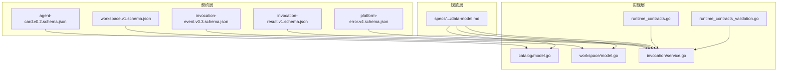
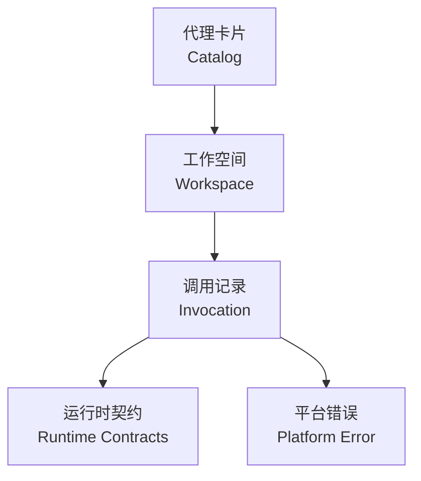
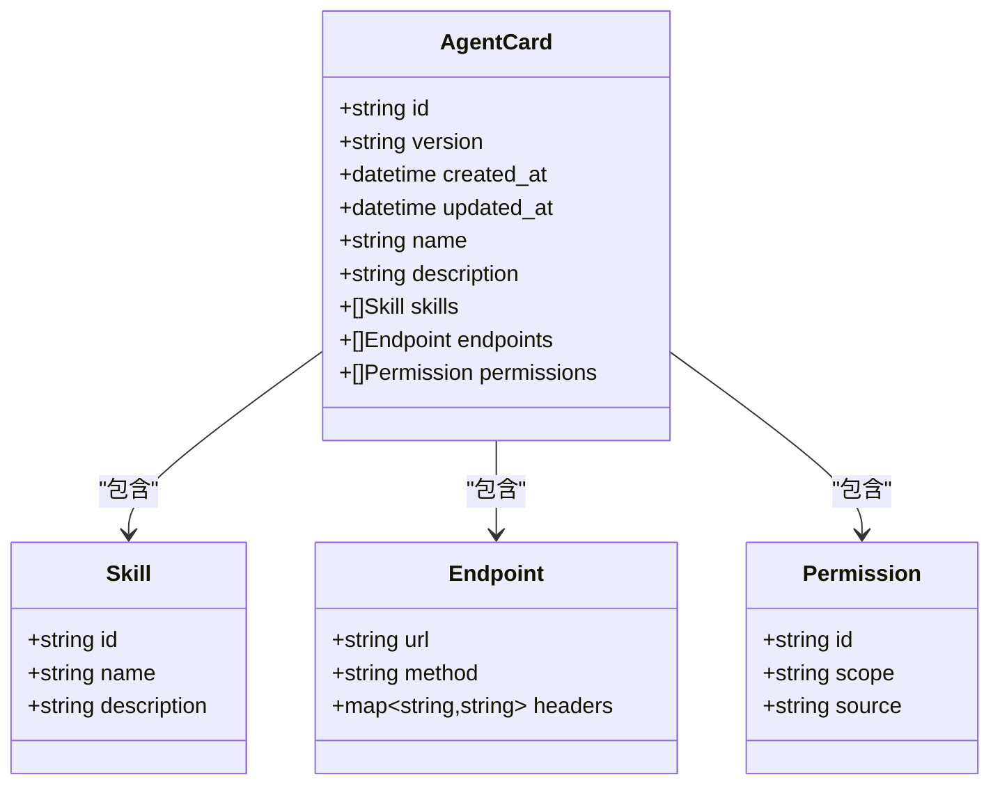
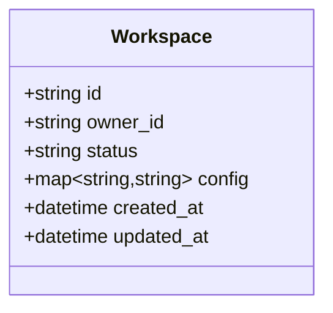
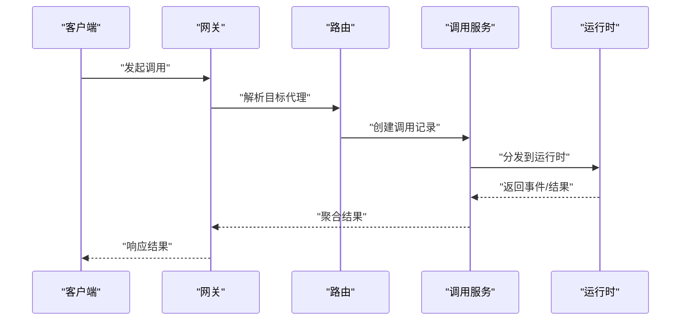

# 核心实体模型

<cite>
**本文引用的文件**   
- [contracts/schemas/agent-card.v0.2.schema.json](file://contracts/schemas/agent-card.v0.2.schema.json)
- [contracts/schemas/workspace.v1.schema.json](file://contracts/schemas/workspace.v1.schema.json)
- [contracts/schemas/invocation-event.v0.3.schema.json](file://contracts/schemas/invocation-event.v0.3.schema.json)
- [contracts/schemas/invocation-result.v1.schema.json](file://contracts/schemas/invocation-result.v1.schema.json)
- [contracts/schemas/platform-error.v4.schema.json](file://contracts/schemas/platform-error.v4.schema.json)
- [contracts/agent_card_semantics.go](file://contracts/agent_card_semantics.go)
- [contracts/runtime_contracts.go](file://contracts/runtime_contracts.go)
- [contracts/runtime_contracts_validation.go](file://contracts/runtime_contracts_validation.go)
- [apps/control-plane/internal/catalog/model.go](file://apps/control-plane/internal/catalog/model.go)
- [apps/control-plane/internal/workspace/model.go](file://apps/control-plane/internal/workspace/model.go)
- [apps/control-plane/internal/invocation/service.go](file://apps/control-plane/internal/invocation/service.go)
- [apps/control-plane/migrations/001_catalog.sql](file://apps/control-plane/migrations/001_catalog.sql)
- [apps/control-plane/migrations/002_card_text.sql](file://apps/control-plane/migrations/002_card_text.sql)
- [apps/control-plane/migrations/003_workspace.sql](file://apps/control-plane/migrations/003_workspace.sql)
- [specs/001-complete-invocation-contracts/data-model.md](file://specs/001-complete-invocation-contracts/data-model.md)
- [specs/002-catalog-registry-discovery/data-model.md](file://specs/002-catalog-registry-discovery/data-model.md)
- [specs/003-workspace-installation-contracts/data-model.md](file://specs/003-workspace-installation-contracts/data-model.md)
- [specs/004-workspace-create-read/data-model.md](file://specs/004-workspace-create-read/data-model.md)
- [specs/010-invocation-routing-ledger/data-model.md](file://specs/010-invocation-routing-ledger/data-model.md)
</cite>

## 目录
1. [简介](#简介)
2. [项目结构](#项目结构)
3. [核心组件](#核心组件)
4. [架构总览](#架构总览)
5. [详细组件分析](#详细组件分析)
6. [依赖关系分析](#依赖关系分析)
7. [性能考虑](#性能考虑)
8. [故障排查指南](#故障排查指南)
9. [结论](#结论)
10. [附录](#附录)

## 简介
本文件聚焦 NeKiro 平台的核心实体模型，围绕以下关键实体展开：代理卡片（Agent Card）、工作空间（Workspace）、调用记录（Invocation）。文档从数据结构、字段定义、验证规则与业务约束出发，结合 JSON Schema 与 Go 结构体映射，说明实体间的关联关系、外键约束与引用完整性；并给出生命周期状态转换、版本兼容性与迁移策略。目标是帮助读者快速理解并正确使用这些核心数据模型。

## 项目结构
NeKiro 将契约与实现分层管理：
- 契约层：位于 contracts/schemas 下的 JSON Schema 与语义规则，定义跨语言、跨版本的接口与数据模型。
- 实现层：位于 apps/control-plane 的 Go 代码，包含领域模型、服务与存储适配器等。
- 规范层：specs 目录提供数据模型与 API 规范的详细说明，作为契约与实现的权威参考。

图表来源
- [contracts/schemas/agent-card.v0.2.schema.json](file://contracts/schemas/agent-card.v0.2.schema.json)
- [contracts/schemas/workspace.v1.schema.json](file://contracts/schemas/workspace.v1.schema.json)
- [contracts/schemas/invocation-event.v0.3.schema.json](file://contracts/schemas/invocation-event.v0.3.schema.json)
- [contracts/schemas/invocation-result.v1.schema.json](file://contracts/schemas/invocation-result.v1.schema.json)
- [contracts/schemas/platform-error.v4.schema.json](file://contracts/schemas/platform-error.v4.schema.json)
- [apps/control-plane/internal/catalog/model.go](file://apps/control-plane/internal/catalog/model.go)
- [apps/control-plane/internal/workspace/model.go](file://apps/control-plane/internal/workspace/model.go)
- [apps/control-plane/internal/invocation/service.go](file://apps/control-plane/internal/invocation/service.go)
- [contracts/runtime_contracts.go](file://contracts/runtime_contracts.go)
- [contracts/runtime_contracts_validation.go](file://contracts/runtime_contracts_validation.go)
- [specs/001-complete-invocation-contracts/data-model.md](file://specs/001-complete-invocation-contracts/data-model.md)
- [specs/002-catalog-registry-discovery/data-model.md](file://specs/002-catalog-registry-discovery/data-model.md)
- [specs/003-workspace-installation-contracts/data-model.md](file://specs/003-workspace-installation-contracts/data-model.md)
- [specs/004-workspace-create-read/data-model.md](file://specs/004-workspace-create-read/data-model.md)
- [specs/010-invocation-routing-ledger/data-model.md](file://specs/010-invocation-routing-ledger/data-model.md)

章节来源
- [contracts/schemas/agent-card.v0.2.schema.json](file://contracts/schemas/agent-card.v0.2.schema.json)
- [contracts/schemas/workspace.v1.schema.json](file://contracts/schemas/workspace.v1.schema.json)
- [contracts/schemas/invocation-event.v0.3.schema.json](file://contracts/schemas/invocation-event.v0.3.schema.json)
- [contracts/schemas/invocation-result.v1.schema.json](file://contracts/schemas/invocation-result.v1.schema.json)
- [contracts/schemas/platform-error.v4.schema.json](file://contracts/schemas/platform-error.v4.schema.json)
- [apps/control-plane/internal/catalog/model.go](file://apps/control-plane/internal/catalog/model.go)
- [apps/control-plane/internal/workspace/model.go](file://apps/control-plane/internal/workspace/model.go)
- [apps/control-plane/internal/invocation/service.go](file://apps/control-plane/internal/invocation/service.go)
- [contracts/runtime_contracts.go](file://contracts/runtime_contracts.go)
- [contracts/runtime_contracts_validation.go](file://contracts/runtime_contracts_validation.go)
- [specs/001-complete-invocation-contracts/data-model.md](file://specs/001-complete-invocation-contracts/data-model.md)
- [specs/002-catalog-registry-discovery/data-model.md](file://specs/002-catalog-registry-discovery/data-model.md)
- [specs/003-workspace-installation-contracts/data-model.md](file://specs/003-workspace-installation-contracts/data-model.md)
- [specs/004-workspace-create-read/data-model.md](file://specs/004-workspace-create-read/data-model.md)
- [specs/010-invocation-routing-ledger/data-model.md](file://specs/010-invocation-routing-ledger/data-model.md)

## 核心组件
本节概述三大核心实体的职责与边界：
- 代理卡片（Agent Card）：描述可被调用的代理能力、端点、权限与元信息，是目录注册与发现的基础。
- 工作空间（Workspace）：隔离资源与安装实例的边界容器，承载安装、配置与访问控制上下文。
- 调用记录（Invocation）：一次端到端调用的完整轨迹，包括路由、事件、结果与错误等。

章节来源
- [specs/002-catalog-registry-discovery/data-model.md](file://specs/002-catalog-registry-discovery/data-model.md)
- [specs/003-workspace-installation-contracts/data-model.md](file://specs/003-workspace-installation-contracts/data-model.md)
- [specs/004-workspace-create-read/data-model.md](file://specs/004-workspace-create-read/data-model.md)
- [specs/010-invocation-routing-ledger/data-model.md](file://specs/010-invocation-routing-ledger/data-model.md)

## 架构总览
下图展示核心实体在系统中的交互与数据流向：代理卡片由目录服务管理，工作空间作为安装与访问边界，调用记录贯穿网关、路由与服务层，形成完整的调用链路。

图表来源
- [apps/control-plane/internal/catalog/model.go](file://apps/control-plane/internal/catalog/model.go)
- [apps/control-plane/internal/workspace/model.go](file://apps/control-plane/internal/workspace/model.go)
- [apps/control-plane/internal/invocation/service.go](file://apps/control-plane/internal/invocation/service.go)
- [contracts/runtime_contracts.go](file://contracts/runtime_contracts.go)
- [contracts/schemas/platform-error.v4.schema.json](file://contracts/schemas/platform-error.v4.schema.json)

## 详细组件分析

### 代理卡片（Agent Card）
- 数据来源与契约
  - JSON Schema 定义：[agent-card.v0.2.schema.json](file://contracts/schemas/agent-card.v0.2.schema.json)
  - 语义规则与校验：[agent_card_semantics.go](file://contracts/agent_card_semantics.go)
- 领域模型映射
  - Go 结构体与持久化映射：[catalog/model.go](file://apps/control-plane/internal/catalog/model.go)
- 数据库迁移
  - 初始结构与扩展字段：[001_catalog.sql](file://apps/control-plane/migrations/001_catalog.sql), [002_card_text.sql](file://apps/control-plane/migrations/002_card_text.sql)
- 字段与约束要点
  - 标识与版本：唯一标识、版本号、时间戳等基础字段。
  - 能力与端点：技能集合、端点列表、权限声明与来源。
  - 文本与元数据：名称、描述、标签等辅助信息。
  - 校验规则：必填项、枚举值、重复 ID 检测、跨版本权限一致性等。
- 生命周期与状态
  - 注册、启用、禁用、归档等状态流转，受目录服务策略与权限控制。
- 兼容性要求
  - 遵循 v0.2 契约，新增字段需向后兼容，旧客户端忽略未知字段。
- 迁移策略
  - 通过 SQL 迁移逐步引入新字段与索引，确保零停机升级。

图表来源
- [contracts/schemas/agent-card.v0.2.schema.json](file://contracts/schemas/agent-card.v0.2.schema.json)
- [contracts/agent_card_semantics.go](file://contracts/agent_card_semantics.go)
- [apps/control-plane/internal/catalog/model.go](file://apps/control-plane/internal/catalog/model.go)
- [apps/control-plane/migrations/001_catalog.sql](file://apps/control-plane/migrations/001_catalog.sql)
- [apps/control-plane/migrations/002_card_text.sql](file://apps/control-plane/migrations/002_card_text.sql)

章节来源
- [contracts/schemas/agent-card.v0.2.schema.json](file://contracts/schemas/agent-card.v0.2.schema.json)
- [contracts/agent_card_semantics.go](file://contracts/agent_card_semantics.go)
- [apps/control-plane/internal/catalog/model.go](file://apps/control-plane/internal/catalog/model.go)
- [apps/control-plane/migrations/001_catalog.sql](file://apps/control-plane/migrations/001_catalog.sql)
- [apps/control-plane/migrations/002_card_text.sql](file://apps/control-plane/migrations/002_card_text.sql)

### 工作空间（Workspace）
- 数据来源与契约
  - JSON Schema 定义：[workspace.v1.schema.json](file://contracts/schemas/workspace.v1.schema.json)
- 领域模型映射
  - Go 结构体与持久化映射：[workspace/model.go](file://apps/control-plane/internal/workspace/model.go)
- 数据库迁移
  - 工作空间表结构与索引：[003_workspace.sql](file://apps/control-plane/migrations/003_workspace.sql)
- 字段与约束要点
  - 标识与归属：唯一标识、创建者、租户或组织归属。
  - 安装与配置：安装版本、特性开关、环境变量等。
  - 访问控制：策略、角色、权限范围。
  - 校验规则：唯一性、必填项、格式校验。
- 生命周期与状态
  - 创建、激活、暂停、删除等状态，配合安装与验收流程。
- 兼容性要求
  - 遵循 v1 契约，新增字段采用默认值与可选策略。
- 迁移策略
  - 通过迁移脚本添加列与索引，保证读写兼容。

图表来源
- [contracts/schemas/workspace.v1.schema.json](file://contracts/schemas/workspace.v1.schema.json)
- [apps/control-plane/internal/workspace/model.go](file://apps/control-plane/internal/workspace/model.go)
- [apps/control-plane/migrations/003_workspace.sql](file://apps/control-plane/migrations/003_workspace.sql)

章节来源
- [contracts/schemas/workspace.v1.schema.json](file://contracts/schemas/workspace.v1.schema.json)
- [apps/control-plane/internal/workspace/model.go](file://apps/control-plane/internal/workspace/model.go)
- [apps/control-plane/migrations/003_workspace.sql](file://apps/control-plane/migrations/003_workspace.sql)

### 调用记录（Invocation）
- 数据来源与契约
  - 事件与结果契约：
    - [invocation-event.v0.3.schema.json](file://contracts/schemas/invocation-event.v0.3.schema.json)
    - [invocation-result.v1.schema.json](file://contracts/schemas/invocation-result.v1.schema.json)
  - 运行时契约与校验：
    - [runtime_contracts.go](file://contracts/runtime_contracts.go)
    - [runtime_contracts_validation.go](file://contracts/runtime_contracts_validation.go)
- 领域模型映射
  - 服务层处理与聚合：[invocation/service.go](file://apps/control-plane/internal/invocation/service.go)
- 字段与约束要点
  - 标识与追踪：调用 ID、根任务 ID、跟踪 ID、工作空间 ID。
  - 事件流：事件类型、时间戳、载荷、上下文头。
  - 结果与错误：成功结果、错误码、错误消息、重试策略。
  - 校验规则：ID 一致性、事件顺序、结果幂等。
- 生命周期与状态
  - 发起、路由、执行、完成、失败、取消等状态转换。
- 兼容性要求
  - 事件与结果遵循 v0.3/v1 契约，新增字段需保持向前兼容。
- 迁移策略
  - 通过追加列与索引优化查询，避免破坏现有事件写入。

图表来源
- [contracts/schemas/invocation-event.v0.3.schema.json](file://contracts/schemas/invocation-event.v0.3.schema.json)
- [contracts/schemas/invocation-result.v1.schema.json](file://contracts/schemas/invocation-result.v1.schema.json)
- [contracts/runtime_contracts.go](file://contracts/runtime_contracts.go)
- [contracts/runtime_contracts_validation.go](file://contracts/runtime_contracts_validation.go)
- [apps/control-plane/internal/invocation/service.go](file://apps/control-plane/internal/invocation/service.go)

章节来源
- [contracts/schemas/invocation-event.v0.3.schema.json](file://contracts/schemas/invocation-event.v0.3.schema.json)
- [contracts/schemas/invocation-result.v1.schema.json](file://contracts/schemas/invocation-result.v1.schema.json)
- [contracts/runtime_contracts.go](file://contracts/runtime_contracts.go)
- [contracts/runtime_contracts_validation.go](file://contracts/runtime_contracts_validation.go)
- [apps/control-plane/internal/invocation/service.go](file://apps/control-plane/internal/invocation/service.go)

### 平台错误（Platform Error）
- 数据来源与契约
  - JSON Schema 定义：[platform-error.v4.schema.json](file://contracts/schemas/platform-error.v4.schema.json)
- 使用场景
  - 统一错误码、错误消息与上下文，便于前端与监控消费。
- 字段与约束要点
  - 错误码、级别、消息、详情、请求 ID、时间戳等。
  - 校验规则：错误码枚举、消息非空、请求 ID 唯一。

章节来源
- [contracts/schemas/platform-error.v4.schema.json](file://contracts/schemas/platform-error.v4.schema.json)

## 依赖关系分析
- 契约到实现的依赖
  - JSON Schema 驱动 Go 结构体生成与校验逻辑。
  - 运行时契约为调用记录的事件与结果提供一致性保障。
- 实体间关系
  - 代理卡片与工作空间：卡片在工作空间内被安装与绑定。
  - 调用记录与工作空间：调用记录归属于特定工作空间。
  - 调用记录与代理卡片：调用记录指向被调用的代理卡片。

图表来源
- [apps/control-plane/internal/catalog/model.go](file://apps/control-plane/internal/catalog/model.go)
- [apps/control-plane/internal/workspace/model.go](file://apps/control-plane/internal/workspace/model.go)
- [apps/control-plane/internal/invocation/service.go](file://apps/control-plane/internal/invocation/service.go)

章节来源
- [apps/control-plane/internal/catalog/model.go](file://apps/control-plane/internal/catalog/model.go)
- [apps/control-plane/internal/workspace/model.go](file://apps/control-plane/internal/workspace/model.go)
- [apps/control-plane/internal/invocation/service.go](file://apps/control-plane/internal/invocation/service.go)

## 性能考虑
- 索引设计
  - 对常用查询字段建立索引（如工作空间 ID、调用 ID、时间戳）。
- 事件写入
  - 批量写入与异步落盘，降低主路径延迟。
- 结果聚合
  - 增量聚合与缓存热点结果，减少重复计算。
- 错误处理
  - 快速失败与降级策略，避免级联故障。

## 故障排查指南
- 常见错误
  - 事件 ID 不匹配：检查调用记录与事件的关联键。
  - 权限不足：核对代理卡片的权限声明与工作空间的策略。
  - 版本不兼容：确认契约版本与运行时支持情况。
- 定位步骤
  - 通过请求 ID 与跟踪 ID 串联日志。
  - 校验 JSON Schema 与语义规则。
  - 回滚最近迁移并复现问题。

章节来源
- [contracts/runtime_contracts_validation.go](file://contracts/runtime_contracts_validation.go)
- [contracts/agent_card_semantics.go](file://contracts/agent_card_semantics.go)

## 结论
NeKiro 平台的核心实体模型以契约为先导，通过 JSON Schema 与语义规则确保跨语言一致性与演进可控。代理卡片、工作空间与调用记录三者相互协作，形成清晰的边界与强一致的引用关系。借助迁移策略与兼容性要求，系统可在不中断服务的前提下持续演进。

## 附录
- 示例与参考
  - 契约示例与测试用例位于 contracts 与 tests 目录，可作为集成与回归测试的基准。
- 规范参考
  - specs 目录提供数据模型与 API 规范的详细说明，建议作为设计与评审的依据。