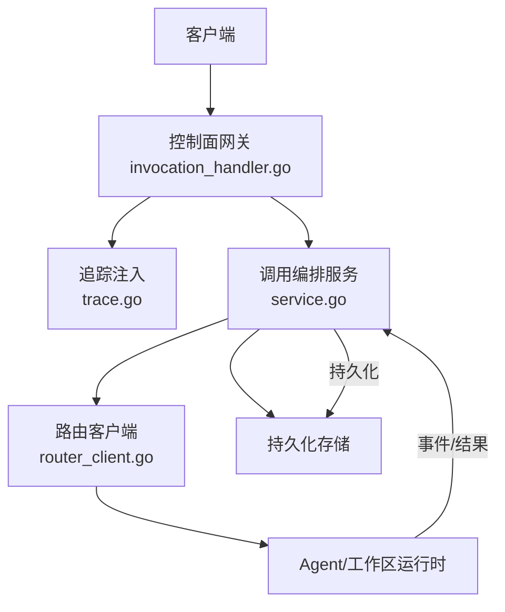
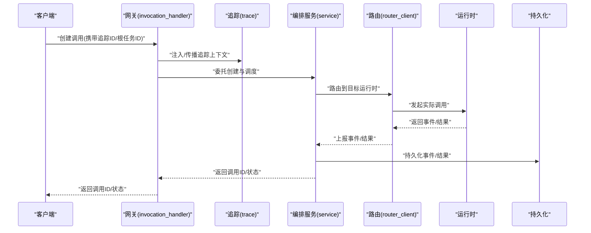
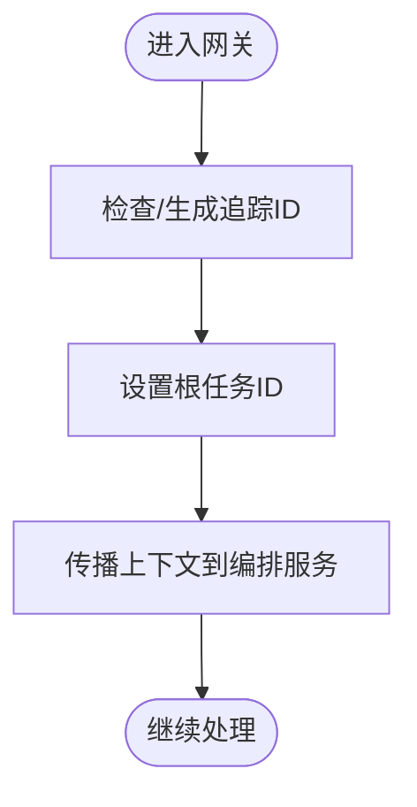
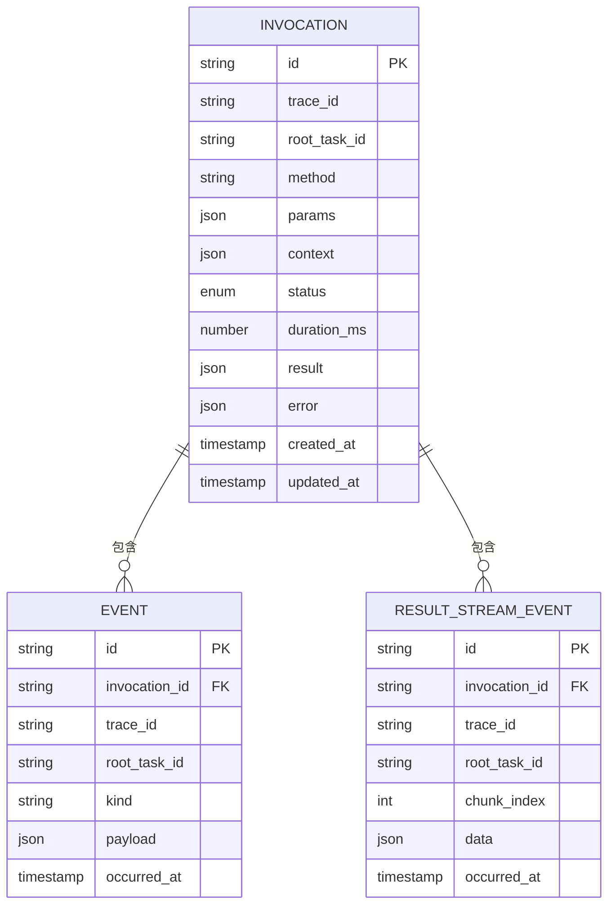
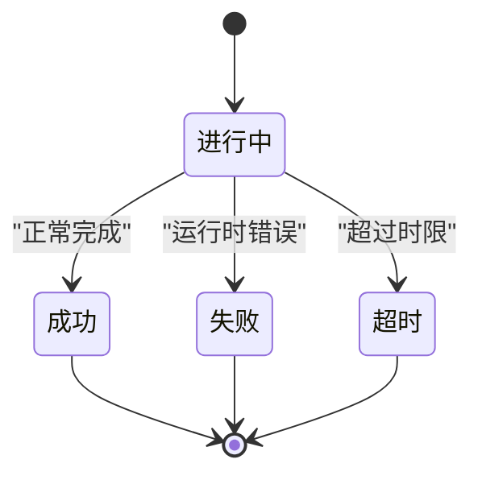
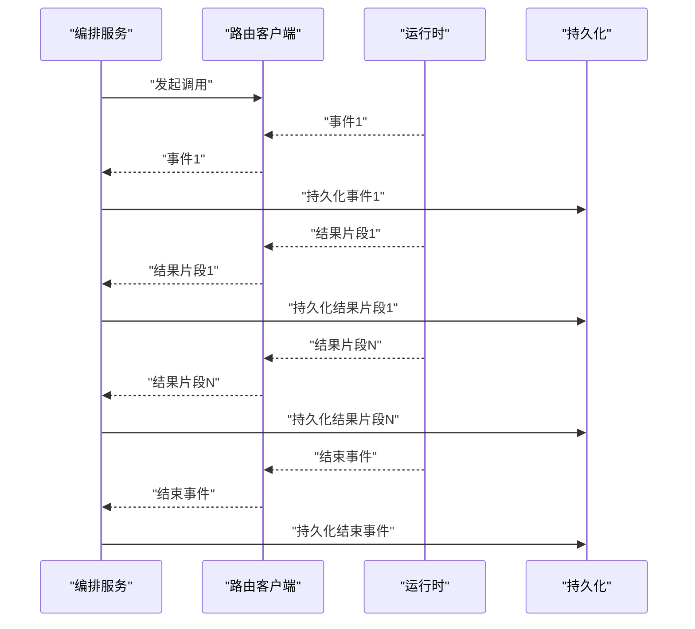
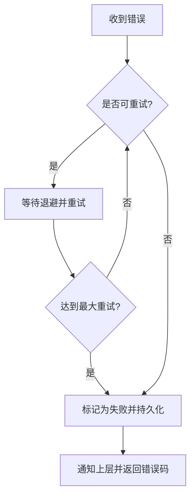
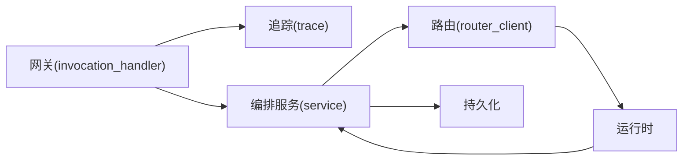

# 调用记录模型

<cite>
**本文引用的文件**   
- [invocation_handler.go](file://apps/control-plane/internal/gateway/invocation_handler.go)
- [service.go](file://apps/control-plane/internal/invocation/service.go)
- [router_client.go](file://apps/control-plane/internal/invocation/router_client.go)
- [trace.go](file://apps/control-plane/internal/gateway/trace.go)
- [control-plane-invocation.v4.yaml](file://contracts/openapi/control-plane-invocation.v4.yaml)
- [semantic-rules.md](file://contracts/invocation/v1/semantic-rules.md)
- [manifest.json](file://contracts/invocation/v1/conformance/manifest.json)
- [event-matching-correlation.json](file://contracts/invocation/v1/conformance/event-matching-correlation.json)
- [stream-matching-correlation.json](file://contracts/invocation/v1/conformance/stream-matching-correlation.json)
- [lifecycle.json](file://contracts/invocation-runtime\v1/conformance/lifecycle.json)
- [errors.json](file://contracts/invocation-runtime\v1/conformance/errors.json)
- [result-stream-event.v2.schema.json](file://contracts/schemas/invocation-result-stream-event.v2.schema.json)
- [invocation-event.v0.3.schema.json](file://contracts/schemas/invocation-event.v0.3.schema.json)
- [invocation-result.v1.schema.json](file://contracts/schemas/invocation-result.v1.schema.json)
- [platform-error.v4.schema.json](file://contracts/schemas/platform-error.v4.schema.json)
- [data-model.md](file://specs/001-complete-invocation-contracts/data-model.md)
- [spec.md](file://specs/001-complete-invocation-contracts/spec.md)
- [decisions/0006-invocation-runtime-trust-and-failure-policy.md](file://docs/decisions/0006-invocation-runtime-trust-and-failure-policy.md)
</cite>

## 目录
1. [简介](#简介)
2. [项目结构](#项目结构)
3. [核心组件](#核心组件)
4. [架构总览](#架构总览)
5. [详细组件分析](#详细组件分析)
6. [依赖分析](#依赖分析)
7. [性能考虑](#性能考虑)
8. [故障排查指南](#故障排查指南)
9. [结论](#结论)
10. [附录](#附录)

## 简介
本文件面向 NeKiro 平台的“调用记录（Invocation）”模型，系统性阐述其数据结构、追踪与分布式链路集成、状态机与生命周期、持久化策略、异步处理与回调机制、查询与分页模式、性能优化建议以及调试技巧。文档以契约与实现为依据，覆盖控制面网关、编排服务、路由客户端、OpenAPI 定义、运行时契约与 Schema 等关键位置，帮助读者从概念到落地全面理解 Invocation 的完整形态。

## 项目结构
围绕调用记录的代码与契约主要分布在以下位置：
- 控制面网关层：负责接收外部请求、建立调用上下文、透传追踪标识并转发至内部服务。
- 调用编排服务：维护调用生命周期、聚合结果与错误、协调路由与持久化。
- 路由客户端：与下游 Agent 或工作区进行实际调用交互。
- OpenAPI 契约：对外暴露的调用相关接口定义。
- 运行时契约与语义规则：定义事件、流式结果、错误码、生命周期约束等。
- JSON Schema：事件、结果、错误等数据结构的强类型校验规范。
- 规格与决策文档：对数据模型、方向性、信任边界与失败策略等进行设计说明。

图表来源
- [invocation_handler.go](file://apps/control-plane/internal/gateway/invocation_handler.go)
- [trace.go](file://apps/control-plane/internal/gateway/trace.go)
- [service.go](file://apps/control-plane/internal/invocation/service.go)
- [router_client.go](file://apps/control-plane/internal/invocation/router_client.go)

章节来源
- [invocation_handler.go](file://apps/control-plane/internal/gateway/invocation_handler.go)
- [service.go](file://apps/control-plane/internal/invocation/service.go)
- [router_client.go](file://apps/control-plane/internal/invocation/router_client.go)
- [trace.go](file://apps/control-plane/internal/gateway/trace.go)

## 核心组件
- 调用标识体系
  - 唯一 ID：一次调用的全局唯一标识，贯穿请求、事件与结果。
  - 追踪 ID：用于跨进程/跨服务的链路追踪，通常由上游传入或由网关生成。
  - 根任务 ID：表示一次调用树中的根节点，便于构建调用链拓扑。
- 请求信息
  - 方法：调用目标能力的方法名。
  - 参数：结构化入参，遵循运行时契约的数据模型。
  - 上下文：包含租户、工作区、权限、扩展字段等元数据。
- 响应信息
  - 结果：成功时的业务返回体，遵循结果 Schema。
  - 错误码：标准化平台错误码，遵循平台错误 Schema。
  - 耗时：端到端耗时统计，支持毫秒级精度。
- 状态信息
  - 进行中、成功、失败、超时等状态，受运行时契约与语义规则约束。
- 事件与流式结果
  - 事件：描述调用过程中的阶段性进展，遵循事件 Schema。
  - 结果流：分片/增量结果，遵循结果流事件 Schema。

章节来源
- [control-plane-invocation.v4.yaml](file://contracts/openapi/control-plane-invocation.v4.yaml)
- [semantic-rules.md](file://contracts/invocation/v1/semantic-rules.md)
- [invocation-event.v0.3.schema.json](file://contracts/schemas/invocation-event.v0.3.schema.json)
- [invocation-result.v1.schema.json](file://contracts/schemas/invocation-result.v1.schema.json)
- [invocation-result-stream-event.v2.schema.json](file://contracts/schemas/invocation-result-stream-event.v2.schema.json)
- [platform-error.v4.schema.json](file://contracts/schemas/platform-error.v4.schema.json)

## 架构总览
调用记录在控制面与运行时的交互中形成闭环：
- 客户端通过控制面 API 发起调用。
- 网关注入追踪上下文并转发至编排服务。
- 编排服务根据路由策略选择目标运行时，执行调用并收集事件与结果。
- 所有关键事件与最终结果均持久化，供后续查询与分析。

图表来源
- [invocation_handler.go](file://apps/control-plane/internal/gateway/invocation_handler.go)
- [trace.go](file://apps/control-plane/internal/gateway/trace.go)
- [service.go](file://apps/control-plane/internal/invocation/service.go)
- [router_client.go](file://apps/control-plane/internal/invocation/router_client.go)

## 详细组件分析

### 调用标识与追踪
- 唯一 ID：作为调用主键，贯穿全生命周期，用于关联事件、结果与日志。
- 追踪 ID：跨服务传播，支持分布式追踪系统（如 OpenTelemetry）集成。
- 根任务 ID：用于组织嵌套调用树，区分不同调用分支。
- 追踪注入：网关层统一注入/透传追踪上下文，确保上下游一致。

图表来源
- [trace.go](file://apps/control-plane/internal/gateway/trace.go)
- [invocation_handler.go](file://apps/control-plane/internal/gateway/invocation_handler.go)

章节来源
- [trace.go](file://apps/control-plane/internal/gateway/trace.go)
- [invocation_handler.go](file://apps/control-plane/internal/gateway/invocation_handler.go)

### 请求与响应模型
- 请求模型
  - 方法：字符串标识，映射到运行时能力。
  - 参数：JSON 对象，遵循运行时契约的数据模型。
  - 上下文：包含工作区、租户、权限令牌等元数据。
- 响应模型
  - 结果：按结果 Schema 定义的结构化数据。
  - 错误：按平台错误 Schema 定义的错误码与消息。
  - 耗时：数值型，单位毫秒。
- 流式结果
  - 事件流：按结果流事件 Schema 定义的增量数据片段。

图表来源
- [invocation-event.v0.3.schema.json](file://contracts/schemas/invocation-event.v0.3.schema.json)
- [invocation-result-stream-event.v2.schema.json](file://contracts/schemas/invocation-result-stream-event.v2.schema.json)
- [invocation-result.v1.schema.json](file://contracts/schemas/invocation-result.v1.schema.json)
- [platform-error.v4.schema.json](file://contracts/schemas/platform-error.v4.schema.json)

章节来源
- [control-plane-invocation.v4.yaml](file://contracts/openapi/control-plane-invocation.v4.yaml)
- [invocation-event.v0.3.schema.json](file://contracts/schemas/invocation-event.v0.3.schema.json)
- [invocation-result-stream-event.v2.schema.json](file://contracts/schemas/invocation-result-stream-event.v2.schema.json)
- [invocation-result.v1.schema.json](file://contracts/schemas/invocation-result.v1.schema.json)
- [platform-error.v4.schema.json](file://contracts/schemas/platform-error.v4.schema.json)

### 状态机与生命周期
- 状态集合
  - 进行中：调用已创建并开始执行。
  - 成功：调用完成且返回有效结果。
  - 失败：调用因错误或异常终止。
  - 超时：调用超过预期时限未完成。
- 转换约束
  - 仅允许符合语义规则的转换路径。
  - 终态（成功/失败/超时）不可逆。
- 运行时契约
  - 生命周期用例与错误用例定义了合法的状态序列与错误场景。

图表来源
- [lifecycle.json](file://contracts/invocation-runtime\v1/conformance/lifecycle.json)
- [semantic-rules.md](file://contracts/invocation/v1/semantic-rules.md)

章节来源
- [lifecycle.json](file://contracts/invocation-runtime\v1/conformance/lifecycle.json)
- [semantic-rules.md](file://contracts/invocation/v1/semantic-rules.md)

### 事件与结果流
- 事件
  - 每个事件携带调用 ID、追踪 ID、根任务 ID，保证可关联。
  - 事件种类包括开始、进度、结束等，具体由运行时决定。
- 结果流
  - 将大结果拆分为多个片段，按顺序推送，避免单次传输过大。
  - 片段索引用于排序与完整性校验。
- 一致性
  - 事件与结果流的追踪 ID 必须与调用一致，否则视为不匹配。

图表来源
- [event-matching-correlation.json](file://contracts/invocation/v1/conformance/event-matching-correlation.json)
- [stream-matching-correlation.json](file://contracts/invocation/v1/conformance/stream-matching-correlation.json)
- [invocation-event.v0.3.schema.json](file://contracts/schemas/invocation-event.v0.3.schema.json)
- [invocation-result-stream-event.v2.schema.json](file://contracts/schemas/invocation-result-stream-event.v2.schema.json)

章节来源
- [event-matching-correlation.json](file://contracts/invocation/v1/conformance/event-matching-correlation.json)
- [stream-matching-correlation.json](file://contracts/invocation/v1/conformance/stream-matching-correlation.json)
- [invocation-event.v0.3.schema.json](file://contracts/schemas/invocation-event.v0.3.schema.json)
- [invocation-result-stream-event.v2.schema.json](file://contracts/schemas/invocation-result-stream-event.v2.schema.json)

### 错误处理与重试策略
- 错误分类
  - 平台错误：通用错误码与消息，适用于跨服务通信。
  - 运行时错误：特定于 Agent/工作区的错误。
- 失败策略
  - 基于决策文档的策略：何时重试、何时降级、何时快速失败。
- 幂等性与去重
  - 通过调用 ID 与事件 ID 保障幂等写入与去重。

图表来源
- [errors.json](file://contracts/invocation-runtime\v1/conformance/errors.json)
- [decisions/0006-invocation-runtime-trust-and-failure-policy.md](file://docs/decisions/0006-invocation-runtime-trust-and-failure-policy.md)

章节来源
- [errors.json](file://contracts/invocation-runtime\v1/conformance/errors.json)
- [decisions/0006-invocation-runtime-trust-and-failure-policy.md]

### 异步调用与回调
- 异步模式
  - 创建调用后立即返回调用 ID，客户端轮询或通过 SSE/WebSocket 订阅事件与结果流。
- 回调机制
  - 运行时通过事件与结果流回推中间状态与最终结果。
  - 编排服务负责聚合与持久化，并在终态时更新调用记录。

章节来源
- [control-plane-invocation.v4.yaml](file://contracts/openapi/control-plane-invocation.v4.yaml)
- [invocation-result-stream-event.v2.schema.json](file://contracts/schemas/invocation-result-stream-event.v2.schema.json)

### 持久化策略
- 表/集合设计
  - 调用记录表：存储主记录与状态。
  - 事件表：存储阶段事件。
  - 结果流表：存储分片结果。
- 索引策略
  - 基于调用 ID、追踪 ID、根任务 ID 建立索引，加速查询与关联。
- 一致性
  - 事务内写入事件与结果片段，保证局部一致性；跨服务通过事件溯源保证最终一致性。

章节来源
- [invocation-event.v0.3.schema.json](file://contracts/schemas/invocation-event.v0.3.schema.json)
- [invocation-result-stream-event.v2.schema.json](file://contracts/schemas/invocation-result-stream-event.v2.schema.json)

### 查询模式与分页
- 常见查询
  - 按调用 ID 精确查询。
  - 按追踪 ID 检索整条链路。
  - 按根任务 ID 检索子调用树。
  - 按时间范围与工作区过滤。
- 分页策略
  - 游标分页：基于更新时间戳与 ID 组合，避免深分页性能问题。
  - 限制每页大小，结合前端滚动加载。

章节来源
- [control-plane-invocation.v4.yaml](file://contracts/openapi/control-plane-invocation.v4.yaml)

## 依赖分析
- 组件耦合
  - 网关依赖追踪模块与编排服务。
  - 编排服务依赖路由客户端与持久化层。
  - 运行时通过事件与结果流与编排服务解耦。
- 外部依赖
  - OpenAPI 契约驱动接口稳定性。
  - JSON Schema 驱动数据校验与兼容性测试。
  - 运行时契约与语义规则驱动行为一致性。

图表来源
- [invocation_handler.go](file://apps/control-plane/internal/gateway/invocation_handler.go)
- [trace.go](file://apps/control-plane/internal/gateway/trace.go)
- [service.go](file://apps/control-plane/internal/invocation/service.go)
- [router_client.go](file://apps/control-plane/internal/invocation/router_client.go)

章节来源
- [invocation_handler.go](file://apps/control-plane/internal/gateway/invocation_handler.go)
- [service.go](file://apps/control-plane/internal/invocation/service.go)
- [router_client.go](file://apps/control-plane/internal/invocation/router_client.go)
- [trace.go](file://apps/control-plane/internal/gateway/trace.go)

## 性能考虑
- 减少序列化开销：尽量复用上下文与追踪对象，避免重复构造。
- 批量持久化：事件与结果片段采用批写入，降低 I/O 次数。
- 流式传输：大结果使用分片流式返回，避免内存峰值。
- 索引优化：为高频查询字段建立复合索引，提升扫描效率。
- 连接池与超时：合理配置下游连接池与超时，防止雪崩。

[本节提供一般性指导，无需源码引用]

## 故障排查指南
- 定位调用
  - 使用调用 ID 直接查询主记录。
  - 使用追踪 ID 拉取整条链路的事件与结果片段。
- 常见问题
  - 追踪 ID 不一致：检查网关注入与下游透传逻辑。
  - 根任务 ID 不匹配：确认嵌套调用是否正确传递根任务 ID。
  - 事件缺失：检查持久化写入与事务边界。
  - 结果流乱序：核对片段索引与排序逻辑。
- 工具与断点
  - 在网关与编排服务的关键路径添加日志与指标。
  - 使用运行时契约的 conformance 用例复现问题。

章节来源
- [event-matching-correlation.json](file://contracts/invocation/v1/conformance/event-matching-correlation.json)
- [stream-matching-correlation.json](file://contracts/invocation/v1/conformance/stream-matching-correlation.json)
- [manifest.json](file://contracts/invocation/v1/conformance/manifest.json)

## 结论
NeKiro 的调用记录模型以清晰的标识体系、严格的语义规则与完善的 Schema 为基础，结合网关追踪注入、编排服务聚合与运行时事件流，实现了高可靠、可观测、可扩展的调用生命周期管理。通过合理的持久化与查询策略，可在大规模分布式环境中高效定位问题与优化性能。

[本节为总结性内容，无需源码引用]

## 附录

### 数据模型参考
- 数据模型与规格说明
  - 参见数据模型与规格文档，了解字段含义、约束与示例。

章节来源
- [data-model.md](file://specs/001-complete-invocation-contracts/data-model.md)
- [spec.md](file://specs/001-complete-invocation-contracts/spec.md)

### 运行时契约与语义规则
- 语义规则与一致性约束
  - 参见运行时契约与语义规则，了解事件、结果、错误的合法性与兼容性要求。

章节来源
- [semantic-rules.md](file://contracts/invocation/v1/semantic-rules.md)
- [lifecycle.json](file://contracts/invocation-runtime\v1/conformance/lifecycle.json)
- [errors.json](file://contracts/invocation-runtime\v1/conformance/errors.json)

### JSON Schema 参考
- 事件 Schema
  - 参见事件 Schema 文件，了解事件结构与字段约束。
- 结果流事件 Schema
  - 参见结果流事件 Schema 文件，了解分片结果结构与索引规则。
- 结果 Schema
  - 参见结果 Schema 文件，了解成功返回体的结构。
- 平台错误 Schema
  - 参见平台错误 Schema 文件，了解错误码与消息规范。

章节来源
- [invocation-event.v0.3.schema.json](file://contracts/schemas/invocation-event.v0.3.schema.json)
- [invocation-result-stream-event.v2.schema.json](file://contracts/schemas/invocation-result-stream-event.v2.schema.json)
- [invocation-result.v1.schema.json](file://contracts/schemas/invocation-result.v1.schema.json)
- [platform-error.v4.schema.json](file://contracts/schemas/platform-error.v4.schema.json)