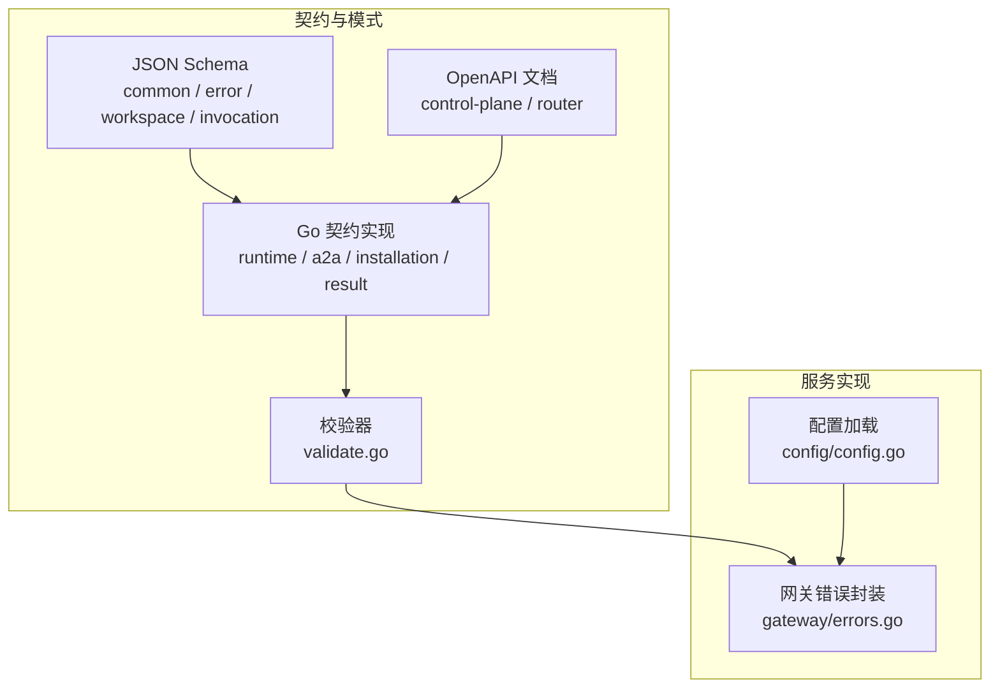
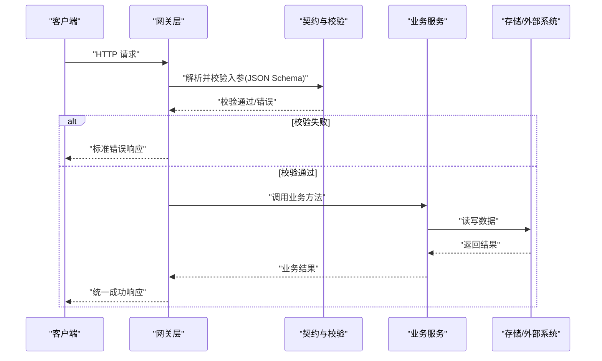
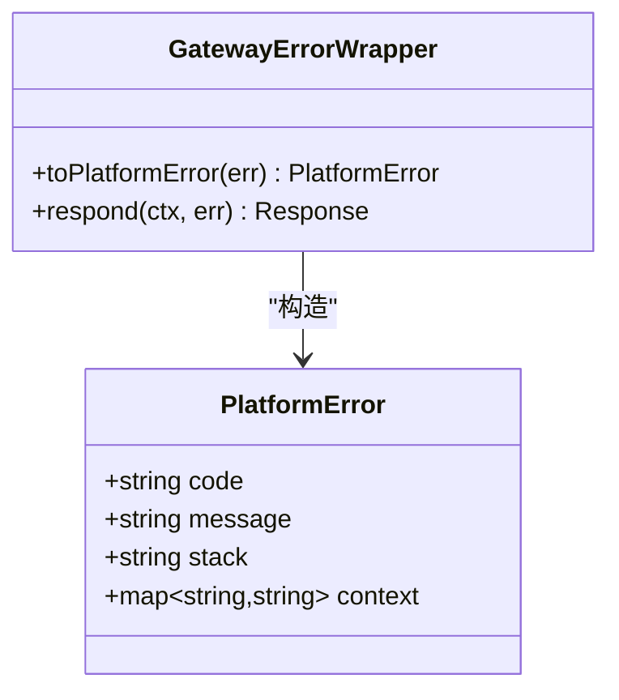
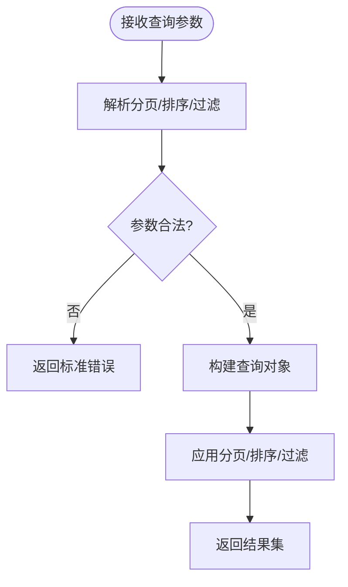
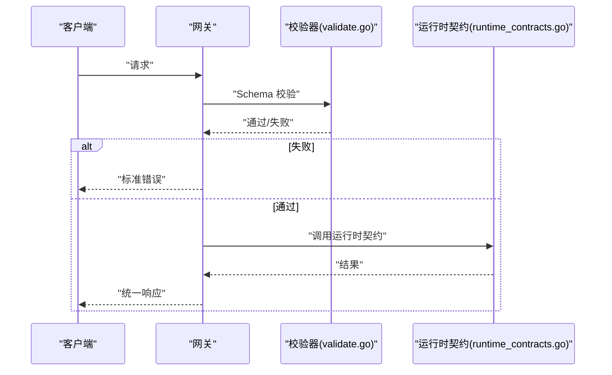
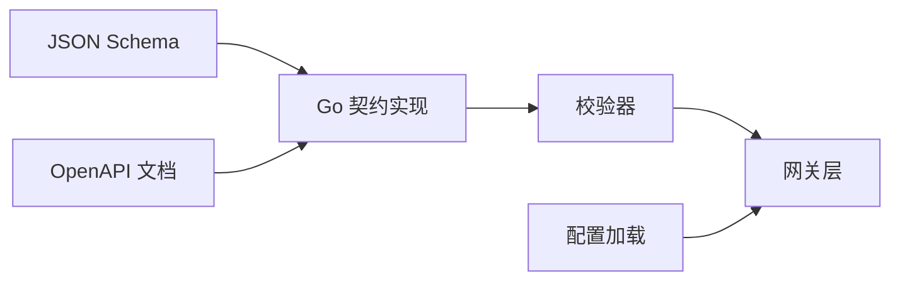

# 通用模式定义

<cite>
**本文引用的文件**   
- [contracts/contracts.go](file://contracts/contracts.go)
- [contracts/validate.go](file://contracts/validate.go)
- [contracts/runtime_contracts.go](file://contracts/runtime_contracts.go)
- [contracts/runtime_contracts_validation.go](file://contracts/runtime_contracts_validation.go)
- [contracts/a2a_profile_v02.go](file://contracts/a2a_profile_v02.go)
- [contracts/installation_contracts.go](file://contracts/installation_contracts.go)
- [contracts/result_contracts.go](file://contracts/result_contracts.go)
- [contracts/openapi/control-plane.v1.yaml](file://contracts/openapi/control-plane.v1.yaml)
- [contracts/openapi/control-plane.v2.yaml](file://contracts/openapi/control-plane.v2.yaml)
- [contracts/schemas/common.v1.schema.json](file://contracts/schemas/common.v1.schema.json)
- [contracts/schemas/platform-error.v1.schema.json](file://contracts/schemas/platform-error.v1.schema.json)
- [contracts/schemas/platform-error.v2.schema.json](file://contracts/schemas/platform-error.v2.schema.json)
- [contracts/schemas/platform-error.v3.schema.json](file://contracts/schemas/platform-error.v3.schema.json)
- [contracts/schemas/platform-error.v4.schema.json](file://contracts/schemas/platform-error.v4.schema.json)
- [contracts/schemas/workspace.v1.schema.json](file://contracts/schemas/workspace.v1.schema.json)
- [contracts/schemas/invocation-result.v1.schema.json](file://contracts/schemas/invocation-result.v1.schema.json)
- [contracts/schemas/invocation-event.v0.1.schema.json](file://contracts/schemas/invocation-event.v0.1.schema.json)
- [contracts/schemas/invocation-event.v0.2.schema.json](file://contracts/schemas/invocation-event.v0.2.schema.json)
- [contracts/schemas/invocation-event.v0.3.schema.json](file://contracts/schemas/invocation-event.v0.3.schema.json)
- [contracts/schemas/invocation-result-stream-event.v1.schema.json](file://contracts/schemas/invocation-result-stream事件.v1.schema.json)
- [contracts/schemas/invocation-result-stream-event.v2.schema.json](file://contracts/schemas/invocation-result-stream-event.v2.schema.json)
- [contracts/schemas/a2a-profile.v0.2.schema.json](file://contracts/schemas/a2a-profile.v0.2.schema.json)
- [contracts/schemas/a2a-profile.v0.3.0.schema.json](file://contracts/schemas/a2a-profile.v0.3.0.schema.json)
- [contracts/schemas/agent-card.v0.1.schema.json](file://contracts/schemas/agent-card.v0.1.schema.json)
- [contracts/schemas/agent-card.v0.2.schema.json](file://contracts/schemas/agent-card.v0.2.schema.json)
- [contracts/schemas/installation.v1.schema.json](file://contracts/schemas/installation.v1.schema.json)
- [contracts/schemas/installation.v2.schema.json](file://contracts/schemas/installation.v2.schema.json)
- [apps/control-plane/internal/gateway/errors.go](file://apps/control-plane/internal/gateway/errors.go)
- [apps/control-plane/internal/config/config.go](file://apps/control-plane/internal/config/config.go)
</cite>

## 目录
1. [简介](#简介)
2. [项目结构](#项目结构)
3. [核心组件](#核心组件)
4. [架构总览](#架构总览)
5. [详细组件分析](#详细组件分析)
6. [依赖分析](#依赖分析)
7. [性能考虑](#性能考虑)
8. [故障排查指南](#故障排查指南)
9. [结论](#结论)
10. [附录](#附录)

## 简介
本文件面向 NeKiro 平台的“通用模式定义”，聚焦跨模块共享的基础数据类型与公共结构，包括：
- 统一错误格式（错误码、消息、堆栈信息）
- 时间格式规范
- 分页参数、排序选项、过滤条件等通用查询组件
- 统一响应格式的设计模式与错误处理策略
- JSON Schema 与 Go 结构体映射关系
- 数据验证规则与约束条件
- 版本演进策略与兼容性保证
- 通用数据处理工具与辅助函数使用指南
- 实际使用示例与集成最佳实践

目标是让不同模块在接口契约、数据结构、错误语义和校验行为上保持一致，降低集成成本并提升可维护性。

## 项目结构
NeKiro 的通用模式主要分布在以下位置：
- contracts/schemas：平台级 JSON Schema 定义（公共类型、错误、工作区、调用结果/事件等）
- contracts/openapi：OpenAPI 文档（控制面与路由内部 API 的版本化描述）
- contracts/*.go：Go 侧契约实现与校验逻辑（运行时契约、A2A Profile、安装契约、结果契约等）
- apps/control-plane/internal/gateway/errors.go：网关层错误封装与传播
- apps/control-plane/internal/config/config.go：配置加载与默认值

图表来源
- [contracts/schemas/common.v1.schema.json](file://contracts/schemas/common.v1.schema.json)
- [contracts/schemas/platform-error.v1.schema.json](file://contracts/schemas/platform-error.v1.schema.json)
- [contracts/openapi/control-plane.v1.yaml](file://contracts/openapi/control-plane.v1.yaml)
- [contracts/runtime_contracts.go](file://contracts/runtime_contracts.go)
- [contracts/validate.go](file://contracts/validate.go)
- [apps/control-plane/internal/gateway/errors.go](file://apps/control-plane/internal/gateway/errors.go)
- [apps/control-plane/internal/config/config.go](file://apps/control-plane/internal/config/config.go)

章节来源
- [contracts/contracts.go](file://contracts/contracts.go)
- [contracts/validate.go](file://contracts/validate.go)
- [contracts/runtime_contracts.go](file://contracts/runtime_contracts.go)
- [contracts/a2a_profile_v02.go](file://contracts/a2a_profile_v02.go)
- [contracts/installation_contracts.go](file://contracts/installation_contracts.go)
- [contracts/result_contracts.go](file://contracts/result_contracts.go)
- [contracts/openapi/control-plane.v1.yaml](file://contracts/openapi/control-plane.v1.yaml)
- [contracts/openapi/control-plane.v2.yaml](file://contracts/openapi/control-plane.v2.yaml)
- [contracts/schemas/common.v1.schema.json](file://contracts/schemas/common.v1.schema.json)
- [contracts/schemas/platform-error.v1.schema.json](file://contracts/schemas/platform-error.v1.schema.json)
- [contracts/schemas/platform-error.v2.schema.json](file://contracts/schemas/platform-error.v2.schema.json)
- [contracts/schemas/platform-error.v3.schema.json](file://contracts/schemas/platform-error.v3.schema.json)
- [contracts/schemas/platform-error.v4.schema.json](file://contracts/schemas/platform-error.v4.schema.json)
- [contracts/schemas/workspace.v1.schema.json](file://contracts/schemas/workspace.v1.schema.json)
- [contracts/schemas/invocation-result.v1.schema.json](file://contracts/schemas/invocation-result.v1.schema.json)
- [contracts/schemas/invocation-event.v0.1.schema.json](file://contracts/schemas/invocation-event.v0.1.schema.json)
- [contracts/schemas/invocation-event.v0.2.schema.json](file://contracts/schemas/invocation-event.v0.2.schema.json)
- [contracts/schemas/invocation-event.v0.3.schema.json](file://contracts/schemas/invocation-event.v0.3.schema.json)
- [contracts/schemas/invocation-result-stream-event.v1.schema.json](file://contracts/schemas/invocation-result-stream-event.v1.schema.json)
- [contracts/schemas/invocation-result-stream-event.v2.schema.json](file://contracts/schemas/invocation-result-stream-event.v2.schema.json)
- [contracts/schemas/a2a-profile.v0.2.schema.json](file://contracts/schemas/a2a-profile.v0.2.schema.json)
- [contracts/schemas/a2a-profile.v0.3.0.schema.json](file://contracts/schemas/a2a-profile.v0.3.0.schema.json)
- [contracts/schemas/agent-card.v0.1.schema.json](file://contracts/schemas/agent-card.v0.1.schema.json)
- [contracts/schemas/agent-card.v0.2.schema.json](file://contracts/schemas/agent-card.v0.2.schema.json)
- [contracts/schemas/installation.v1.schema.json](file://contracts/schemas/installation.v1.schema.json)
- [contracts/schemas/installation.v2.schema.json](file://contracts/schemas/installation.v2.schema.json)
- [apps/control-plane/internal/gateway/errors.go](file://apps/control-plane/internal/gateway/errors.go)
- [apps/control-plane/internal/config/config.go](file://apps/control-plane/internal/config/config.go)

## 核心组件
本节概述跨模块共享的关键通用模式，涵盖错误模型、时间格式、分页/排序/过滤、统一响应与校验流程。

- 统一错误模型
  - 字段语义：错误码、人类可读消息、可选堆栈信息、可选上下文键值对
  - 设计目标：跨语言一致、便于前端展示与后端排障
  - 参考：平台错误 JSON Schema 多版本演进

- 时间格式规范
  - 采用 RFC 3339（ISO 8601）字符串表示 UTC 时间
  - 用于创建时间、更新时间、过期时间等字段

- 分页参数
  - 典型字段：页大小、游标或偏移量
  - 推荐：基于游标的分页以提升大数据集稳定性

- 排序选项
  - 字段名 + 方向（升序/降序）
  - 支持多字段排序时按优先级顺序

- 过滤条件
  - 支持等于、不等于、包含、范围、前缀匹配等
  - 建议以结构化对象表达，避免自由文本解析

- 统一响应格式
  - 成功：状态码 + 数据载荷
  - 失败：标准错误对象 + HTTP 状态码
  - 元信息：请求 ID、追踪 ID、时间戳等

- 数据验证
  - 基于 JSON Schema 的强校验
  - Go 侧二次校验与业务约束

章节来源
- [contracts/schemas/platform-error.v1.schema.json](file://contracts/schemas/platform-error.v1.schema.json)
- [contracts/schemas/platform-error.v2.schema.json](file://contracts/schemas/platform-error.v2.schema.json)
- [contracts/schemas/platform-error.v3.schema.json](file://contracts/schemas/platform-error.v3.schema.json)
- [contracts/schemas/platform-error.v4.schema.json](file://contracts/schemas/platform-error.v4.schema.json)
- [contracts/schemas/common.v1.schema.json](file://contracts/schemas/common.v1.schema.json)
- [contracts/validate.go](file://contracts/validate.go)
- [contracts/runtime_contracts.go](file://contracts/runtime_contracts.go)

## 架构总览
通用模式贯穿“契约定义 → Go 实现 → 校验 → 网关错误封装”的全链路。

图表来源
- [contracts/validate.go](file://contracts/validate.go)
- [contracts/runtime_contracts.go](file://contracts/runtime_contracts.go)
- [apps/control-plane/internal/gateway/errors.go](file://apps/control-plane/internal/gateway/errors.go)

## 详细组件分析

### 统一错误模型与错误处理策略
- 错误模型要点
  - 错误码：稳定枚举或命名空间前缀，便于分类与监控
  - 消息：面向用户的简明提示；调试信息放入堆栈或上下文
  - 堆栈：仅在服务端日志与调试场景使用，避免泄露敏感信息
  - 上下文：可选键值对，记录关键上下文（如资源 ID、操作类型）

- 错误处理策略
  - 网关层将底层异常转换为标准错误对象
  - 区分可重试与不可重试错误，配合幂等与超时策略
  - 对外仅暴露最小必要信息，内部保留完整诊断数据

图表来源
- [contracts/schemas/platform-error.v1.schema.json](file://contracts/schemas/platform-error.v1.schema.json)
- [contracts/schemas/platform-error.v2.schema.json](file://contracts/schemas/platform-error.v2.schema.json)
- [contracts/schemas/platform-error.v3.schema.json](file://contracts/schemas/platform-error.v3.schema.json)
- [contracts/schemas/platform-error.v4.schema.json](file://contracts/schemas/platform-error.v4.schema.json)
- [apps/control-plane/internal/gateway/errors.go](file://apps/control-plane/internal/gateway/errors.go)

章节来源
- [contracts/schemas/platform-error.v1.schema.json](file://contracts/schemas/platform-error.v1.schema.json)
- [contracts/schemas/platform-error.v2.schema.json](file://contracts/schemas/platform-error.v2.schema.json)
- [contracts/schemas/platform-error.v3.schema.json](file://contracts/schemas/platform-error.v3.schema.json)
- [contracts/schemas/platform-error.v4.schema.json](file://contracts/schemas/platform-error.v4.schema.json)
- [apps/control-plane/internal/gateway/errors.go](file://apps/control-plane/internal/gateway/errors.go)

### 时间格式规范
- 采用 RFC 3339 字符串表示时间，确保跨语言一致性与时区明确
- 适用于创建时间、更新时间、过期时间等所有时间字段
- 建议在序列化/反序列化层统一处理，避免业务代码重复实现

章节来源
- [contracts/schemas/common.v1.schema.json](file://contracts/schemas/common.v1.schema.json)

### 分页、排序与过滤
- 分页
  - 游标分页：适合大数据集，避免深翻页性能问题
  - 页大小限制：防止过大负载影响性能
- 排序
  - 字段列表 + 方向，支持多字段组合
- 过滤
  - 结构化条件对象，支持常见比较与集合操作
  - 建议对输入进行白名单校验，防止注入式风险

图表来源
- [contracts/schemas/common.v1.schema.json](file://contracts/schemas/common.v1.schema.json)

章节来源
- [contracts/schemas/common.v1.schema.json](file://contracts/schemas/common.v1.schema.json)

### 统一响应格式
- 成功响应
  - 状态码：HTTP 2xx
  - 数据载荷：业务数据
  - 元信息：请求 ID、追踪 ID、时间戳
- 失败响应
  - 状态码：HTTP 4xx/5xx
  - 错误对象：遵循统一错误模型
- 建议
  - 始终包含请求 ID，便于端到端追踪
  - 对大响应启用压缩与分页

章节来源
- [contracts/openapi/control-plane.v1.yaml](file://contracts/openapi/control-plane.v1.yaml)
- [contracts/openapi/control-plane.v2.yaml](file://contracts/openapi/control-plane.v2.yaml)

### 数据验证规则与约束
- 校验层次
  - 传输层：JSON Schema 强校验，拒绝非法结构
  - 业务层：Go 侧二次校验，补充领域约束
- 校验流程
  - 入参进入网关后先走 Schema 校验
  - 校验失败直接返回标准错误
  - 校验通过后进入业务服务

图表来源
- [contracts/validate.go](file://contracts/validate.go)
- [contracts/runtime_contracts.go](file://contracts/runtime_contracts.go)

章节来源
- [contracts/validate.go](file://contracts/validate.go)
- [contracts/runtime_contracts.go](file://contracts/runtime_contracts.go)
- [contracts/runtime_contracts_validation.go](file://contracts/runtime_contracts_validation.go)

### 版本演进策略与兼容性保证
- 向后兼容原则
  - 新增字段为可选，不破坏旧客户端
  - 删除字段需废弃周期与迁移指引
  - 变更字段类型需谨慎评估影响面
- 版本管理
  - 通过 URL 路径或头部标识版本
  - OpenAPI 与 JSON Schema 同步更新
- 测试保障
  - 契约一致性测试与兼容性矩阵
  - 回归用例覆盖关键路径

章节来源
- [contracts/openapi/control-plane.v1.yaml](file://contracts/openapi/control-plane.v1.yaml)
- [contracts/openapi/control-plane.v2.yaml](file://contracts/openapi/control-plane.v2.yaml)
- [contracts/schemas/platform-error.v1.schema.json](file://contracts/schemas/platform-error.v1.schema.json)
- [contracts/schemas/platform-error.v2.schema.json](file://contracts/schemas/platform-error.v2.schema.json)
- [contracts/schemas/platform-error.v3.schema.json](file://contracts/schemas/platform-error.v3.schema.json)
- [contracts/schemas/platform-error.v4.schema.json](file://contracts/schemas/platform-error.v4.schema.json)

### 通用数据处理工具与辅助函数
- 配置加载
  - 提供默认值与环境变量覆盖
  - 启动时校验必填项
- 错误转换
  - 将底层错误映射为标准错误对象
  - 记录必要上下文以便排障
- 校验辅助
  - 复用 Schema 校验器减少重复代码
  - 提供常用校验器组合（非空、长度、格式等）

章节来源
- [apps/control-plane/internal/config/config.go](file://apps/control-plane/internal/config/config.go)
- [apps/control-plane/internal/gateway/errors.go](file://apps/control-plane/internal/gateway/errors.go)
- [contracts/validate.go](file://contracts/validate.go)

### 使用示例与集成最佳实践
- 错误处理
  - 捕获业务异常，转换为标准错误对象
  - 对外只返回必要信息，内部记录完整堆栈
- 时间处理
  - 统一使用 RFC 3339 序列化/反序列化
- 分页与排序
  - 优先使用游标分页，限制最大页大小
  - 白名单校验排序字段，防止未知字段注入
- 校验
  - 入口即校验，尽早失败
  - 结合 OpenAPI 生成客户端与服务端骨架代码
- 版本管理
  - 新特性走新版本接口，旧接口保持兼容
  - 发布前运行契约一致性测试

章节来源
- [contracts/validate.go](file://contracts/validate.go)
- [contracts/runtime_contracts.go](file://contracts/runtime_contracts.go)
- [contracts/openapi/control-plane.v1.yaml](file://contracts/openapi/control-plane.v1.yaml)
- [contracts/openapi/control-plane.v2.yaml](file://contracts/openapi/control-plane.v2.yaml)

## 依赖分析
通用模式在各模块间的依赖关系如下：
- JSON Schema 作为权威数据模型，被 Go 契约与 OpenAPI 共同引用
- Go 契约实现依赖校验器进行入参与出参校验
- 网关层依赖错误封装与配置加载，输出统一响应

图表来源
- [contracts/schemas/common.v1.schema.json](file://contracts/schemas/common.v1.schema.json)
- [contracts/openapi/control-plane.v1.yaml](file://contracts/openapi/control-plane.v1.yaml)
- [contracts/runtime_contracts.go](file://contracts/runtime_contracts.go)
- [contracts/validate.go](file://contracts/validate.go)
- [apps/control-plane/internal/gateway/errors.go](file://apps/control-plane/internal/gateway/errors.go)
- [apps/control-plane/internal/config/config.go](file://apps/control-plane/internal/config/config.go)

章节来源
- [contracts/contracts.go](file://contracts/contracts.go)
- [contracts/runtime_contracts.go](file://contracts/runtime_contracts.go)
- [contracts/validate.go](file://contracts/validate.go)
- [apps/control-plane/internal/gateway/errors.go](file://apps/control-plane/internal/gateway/errors.go)
- [apps/control-plane/internal/config/config.go](file://apps/control-plane/internal/config/config.go)

## 性能考虑
- 校验开销
  - 在网关层进行轻量 Schema 校验，避免深入业务
  - 对高频路径启用缓存与预编译校验器
- 分页与排序
  - 游标分页避免深翻页
  - 限制最大页大小与排序字段数量
- 错误信息
  - 堆栈信息仅服务端记录，避免网络传输开销
- 序列化
  - 统一时间格式减少解析分支
  - 大响应启用压缩

[本节为通用指导，无需特定文件来源]

## 故障排查指南
- 常见问题
  - 时间格式错误：检查是否使用 RFC 3339
  - 分页越界：确认游标合法性与页大小上限
  - 排序字段非法：核对白名单与方向值
  - 错误码缺失：确认网关是否正确映射底层错误
- 定位步骤
  - 根据响应中的请求 ID 检索日志
  - 查看网关层错误封装日志
  - 对比 OpenAPI 与 Schema 差异
- 修复建议
  - 完善入参校验与边界检查
  - 增加契约一致性测试用例
  - 优化错误消息的可操作性

章节来源
- [apps/control-plane/internal/gateway/errors.go](file://apps/control-plane/internal/gateway/errors.go)
- [contracts/validate.go](file://contracts/validate.go)

## 结论
通过统一的错误模型、时间格式、分页/排序/过滤约定以及严格的校验流程，NeKiro 平台实现了跨模块的一致性与可维护性。配合版本化契约与兼容性测试，可在持续演进中保持稳定的集成体验。

[本节为总结，无需特定文件来源]

## 附录
- 相关契约与模式文件清单
  - 公共与错误模型：platform-error v1-v4、common v1
  - 工作区与安装：workspace v1、installation v1/v2
  - 调用结果与事件：invocation-result v1、invocation-event v0.1-v0.3、invocation-result-stream-event v1/v2
  - A2A 与 Agent Card：a2a-profile v0.2/v0.3.0、agent-card v0.1/v0.2
  - OpenAPI：control-plane v1/v2、router 系列
  - Go 契约与校验：runtime_contracts、a2a_profile_v02、installation_contracts、result_contracts、validate

章节来源
- [contracts/schemas/platform-error.v1.schema.json](file://contracts/schemas/platform-error.v1.schema.json)
- [contracts/schemas/platform-error.v2.schema.json](file://contracts/schemas/platform-error.v2.schema.json)
- [contracts/schemas/platform-error.v3.schema.json](file://contracts/schemas/platform-error.v3.schema.json)
- [contracts/schemas/platform-error.v4.schema.json](file://contracts/schemas/platform-error.v4.schema.json)
- [contracts/schemas/common.v1.schema.json](file://contracts/schemas/common.v1.schema.json)
- [contracts/schemas/workspace.v1.schema.json](file://contracts/schemas/workspace.v1.schema.json)
- [contracts/schemas/installation.v1.schema.json](file://contracts/schemas/installation.v1.schema.json)
- [contracts/schemas/installation.v2.schema.json](file://contracts/schemas/installation.v2.schema.json)
- [contracts/schemas/invocation-result.v1.schema.json](file://contracts/schemas/invocation-result.v1.schema.json)
- [contracts/schemas/invocation-event.v0.1.schema.json](file://contracts/schemas/invocation-event.v0.1.schema.json)
- [contracts/schemas/invocation-event.v0.2.schema.json](file://contracts/schemas/invocation-event.v0.2.schema.json)
- [contracts/schemas/invocation-event.v0.3.schema.json](file://contracts/schemas/invocation-event.v0.3.schema.json)
- [contracts/schemas/invocation-result-stream-event.v1.schema.json](file://contracts/schemas/invocation-result-stream-event.v1.schema.json)
- [contracts/schemas/invocation-result-stream-event.v2.schema.json](file://contracts/schemas/invocation-result-stream-event.v2.schema.json)
- [contracts/schemas/a2a-profile.v0.2.schema.json](file://contracts/schemas/a2a-profile.v0.2.schema.json)
- [contracts/schemas/a2a-profile.v0.3.0.schema.json](file://contracts/schemas/a2a-profile.v0.3.0.schema.json)
- [contracts/schemas/agent-card.v0.1.schema.json](file://contracts/schemas/agent-card.v0.1.schema.json)
- [contracts/schemas/agent-card.v0.2.schema.json](file://contracts/schemas/agent-card.v0.2.schema.json)
- [contracts/openapi/control-plane.v1.yaml](file://contracts/openapi/control-plane.v1.yaml)
- [contracts/openapi/control-plane.v2.yaml](file://contracts/openapi/control-plane.v2.yaml)
- [contracts/runtime_contracts.go](file://contracts/runtime_contracts.go)
- [contracts/a2a_profile_v02.go](file://contracts/a2a_profile_v02.go)
- [contracts/installation_contracts.go](file://contracts/installation_contracts.go)
- [contracts/result_contracts.go](file://contracts/result_contracts.go)
- [contracts/validate.go](file://contracts/validate.go)