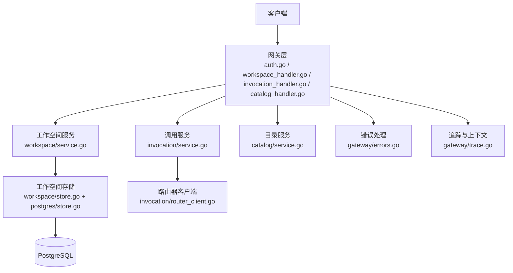
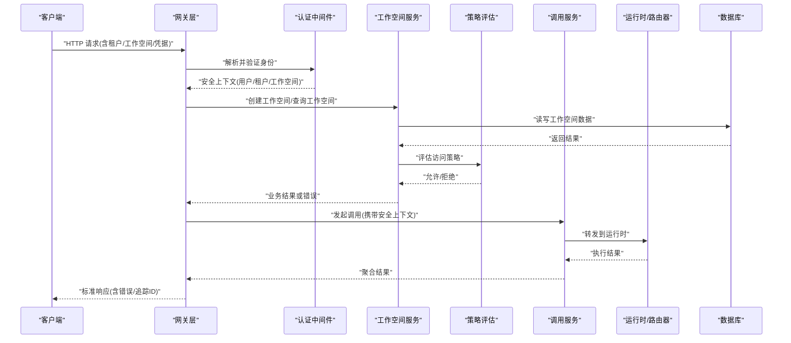
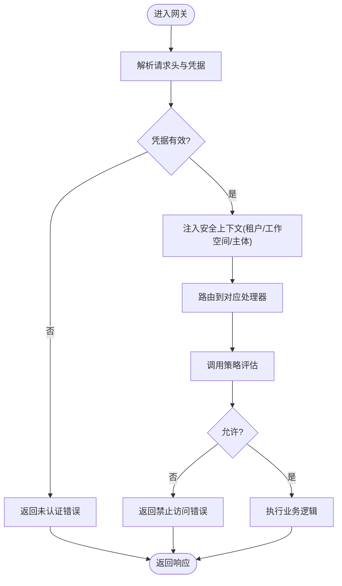
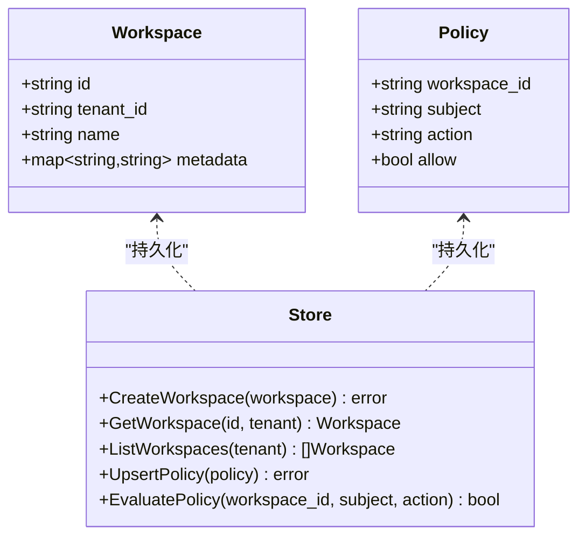
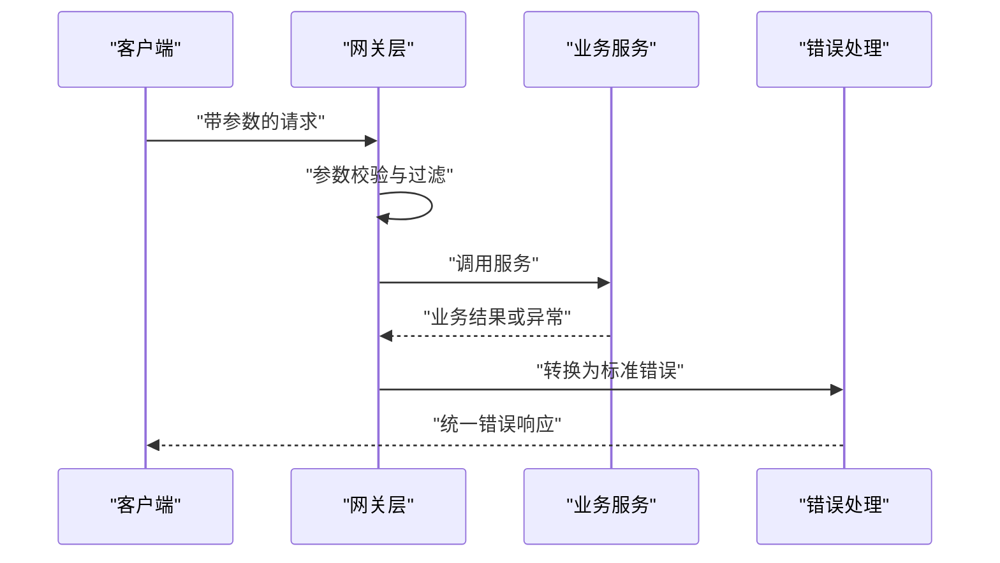
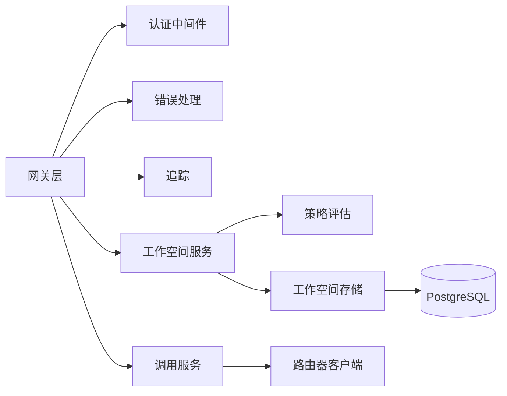

# 安全架构

<cite>
**本文引用的文件**   
- [apps/control-plane/cmd/control-plane/main.go](file://apps/control-plane/cmd/control-plane/main.go)
- [apps/control-plane/internal/gateway/auth.go](file://apps/control-plane/internal/gateway/auth.go)
- [apps/control-plane/internal/gateway/workspace_handler.go](file://apps/control-plane/internal/gateway/workspace_handler.go)
- [apps/control-plane/internal/gateway/invocation_handler.go](file://apps/control-plane/internal/gateway/invocation_handler.go)
- [apps/control-plane/internal/gateway/catalog_handler.go](file://apps/control-plane/internal/gateway/catalog_handler.go)
- [apps/control-plane/internal/gateway/errors.go](file://apps/control-plane/internal/gateway/errors.go)
- [apps/control-plane/internal/gateway/trace.go](file://apps/control-plane/internal/gateway/trace.go)
- [apps/control-plane/internal/workspace/service.go](file://apps/control-plane/internal/workspace/service.go)
- [apps/control-plane/internal/workspace/policy.go](file://apps/control-plane/internal/workspace/policy.go)
- [apps/control-plane/internal/workspace/model.go](file://apps/control-plane/internal/workspace/model.go)
- [apps/control-plane/internal/workspace/store.go](file://apps/control-plane/internal/workspace/store.go)
- [apps/control-plane/internal/workspace/postgres/store.go](file://apps/control-plane/internal/workspace/postgres/store.go)
- [apps/control-plane/internal/workspace/postgres/migrations.go](file://apps/control-plane/internal/workspace/postgres/migrations.go)
- [apps/control-plane/internal/invocation/service.go](file://apps/control-plane/internal/invocation/service.go)
- [apps/control-plane/internal/invocation/router_client.go](file://apps/control-plane/internal/invocation/router_client.go)
- [contracts/openapi/control-plane.v2.yaml](file://contracts/openapi/control-plane.v2.yaml)
- [contracts/schemas/platform-error.v4.schema.json](file://contracts/schemas/platform-error.v4.schema.json)
- [deploy/compose.yaml](file://deploy/compose.yaml)
</cite>

## 目录
1. [简介](#简介)
2. [项目结构](#项目结构)
3. [核心组件](#核心组件)
4. [架构总览](#架构总览)
5. [详细组件分析](#详细组件分析)
6. [依赖分析](#依赖分析)
7. [性能考虑](#性能考虑)
8. [故障排查指南](#故障排查指南)
9. [结论](#结论)
10. [附录](#附录)

## 简介
本文件为 NeKiro 平台的安全架构文档，聚焦于认证与授权、多租户与工作空间隔离、API 安全防护、数据传输与存储加密、威胁模型与防护、以及审计日志与安全监控。内容基于控制面（Control Plane）代码实现与契约定义进行梳理，旨在帮助读者理解系统如何保障身份可信、访问可控、数据可护、行为可溯。

## 项目结构
NeKiro 的控制面位于 apps/control-plane 下，采用分层与按功能域组织的方式：
- 入口与网关层：负责 HTTP 路由、鉴权中间件、错误与追踪处理
- 领域服务层：工作空间、目录、调用编排等
- 持久化层：PostgreSQL 迁移与存储实现
- 契约与 OpenAPI：对外 API 规范与错误模型

图表来源
- [apps/control-plane/internal/gateway/auth.go](file://apps/control-plane/internal/gateway/auth.go)
- [apps/control-plane/internal/gateway/workspace_handler.go](file://apps/control-plane/internal/gateway/workspace_handler.go)
- [apps/control-plane/internal/gateway/invocation_handler.go](file://apps/control-plane/internal/gateway/invocation_handler.go)
- [apps/control-plane/internal/gateway/catalog_handler.go](file://apps/control-plane/internal/gateway/catalog_handler.go)
- [apps/control-plane/internal/workspace/service.go](file://apps/control-plane/internal/workspace/service.go)
- [apps/control-plane/internal/workspace/store.go](file://apps/control-plane/internal/workspace/store.go)
- [apps/control-plane/internal/workspace/postgres/store.go](file://apps/control-plane/internal/workspace/postgres/store.go)
- [apps/control-plane/internal/invocation/service.go](file://apps/control-plane/internal/invocation/service.go)
- [apps/control-plane/internal/invocation/router_client.go](file://apps/control-plane/internal/invocation/router_client.go)
- [apps/control-plane/internal/gateway/errors.go](file://apps/control-plane/internal/gateway/errors.go)
- [apps/control-plane/internal/gateway/trace.go](file://apps/control-plane/internal/gateway/trace.go)

章节来源
- [apps/control-plane/cmd/control-plane/main.go](file://apps/control-plane/cmd/control-plane/main.go)
- [apps/control-plane/internal/gateway/auth.go](file://apps/control-plane/internal/gateway/auth.go)
- [apps/control-plane/internal/gateway/workspace_handler.go](file://apps/control-plane/internal/gateway/workspace_handler.go)
- [apps/control-plane/internal/gateway/invocation_handler.go](file://apps/control-plane/internal/gateway/invocation_handler.go)
- [apps/control-plane/internal/gateway/catalog_handler.go](file://apps/control-plane/internal/gateway/catalog_handler.go)
- [apps/control-plane/internal/workspace/service.go](file://apps/control-plane/internal/workspace/service.go)
- [apps/control-plane/internal/workspace/policy.go](file://apps/control-plane/internal/workspace/policy.go)
- [apps/control-plane/internal/workspace/model.go](file://apps/control-plane/internal/workspace/model.go)
- [apps/control-plane/internal/workspace/store.go](file://apps/control-plane/internal/workspace/store.go)
- [apps/control-plane/internal/workspace/postgres/store.go](file://apps/control-plane/internal/workspace/postgres/store.go)
- [apps/control-plane/internal/invocation/service.go](file://apps/control-plane/internal/invocation/service.go)
- [apps/control-plane/internal/invocation/router_client.go](file://apps/control-plane/internal/invocation/router_client.go)
- [apps/control-plane/internal/gateway/errors.go](file://apps/control-plane/internal/gateway/errors.go)
- [apps/control-plane/internal/gateway/trace.go](file://apps/control-plane/internal/gateway/trace.go)

## 核心组件
- 认证与授权网关
  - 负责解析请求头中的租户与工作空间标识、校验令牌或凭据、注入安全上下文到后续处理器
  - 统一错误响应格式，便于前端与下游消费方一致处理
- 工作空间服务与策略
  - 提供工作空间的创建、读取、权限策略评估能力
  - 通过策略模块对“谁在哪个工作空间能做什么”进行判定
- 调用路由与服务
  - 将外部调用请求转发至运行时或代理，携带必要的安全上下文（如工作空间、租户、调用者身份）
- 持久化与迁移
  - 使用 PostgreSQL 作为主存储，包含工作空间与相关元数据的表结构与迁移脚本
- 错误与追踪
  - 标准化错误码与消息，结合追踪 ID 贯穿请求链路，便于审计与排障

章节来源
- [apps/control-plane/internal/gateway/auth.go](file://apps/control-plane/internal/gateway/auth.go)
- [apps/control-plane/internal/gateway/errors.go](file://apps/control-plane/internal/gateway/errors.go)
- [apps/control-plane/internal/workspace/service.go](file://apps/control-plane/internal/workspace/service.go)
- [apps/control-plane/internal/workspace/policy.go](file://apps/control-plane/internal/workspace/policy.go)
- [apps/control-plane/internal/workspace/model.go](file://apps/control-plane/internal/workspace/model.go)
- [apps/control-plane/internal/workspace/store.go](file://apps/control-plane/internal/workspace/store.go)
- [apps/control-plane/internal/workspace/postgres/store.go](file://apps/control-plane/internal/workspace/postgres/store.go)
- [apps/control-plane/internal/invocation/service.go](file://apps/control-plane/internal/invocation/service.go)
- [apps/control-plane/internal/invocation/router_client.go](file://apps/control-plane/internal/invocation/router_client.go)
- [apps/control-plane/internal/gateway/trace.go](file://apps/control-plane/internal/gateway/trace.go)

## 架构总览
下图展示从客户端到控制面的关键安全路径：网关鉴权、工作空间隔离、策略评估、调用转发与错误/追踪处理。

图表来源
- [apps/control-plane/internal/gateway/auth.go](file://apps/control-plane/internal/gateway/auth.go)
- [apps/control-plane/internal/gateway/workspace_handler.go](file://apps/control-plane/internal/gateway/workspace_handler.go)
- [apps/control-plane/internal/workspace/service.go](file://apps/control-plane/internal/workspace/service.go)
- [apps/control-plane/internal/workspace/policy.go](file://apps/control-plane/internal/workspace/policy.go)
- [apps/control-plane/internal/invocation/service.go](file://apps/control-plane/internal/invocation/service.go)
- [apps/control-plane/internal/invocation/router_client.go](file://apps/control-plane/internal/invocation/router_client.go)
- [apps/control-plane/internal/workspace/postgres/store.go](file://apps/control-plane/internal/workspace/postgres/store.go)
- [apps/control-plane/internal/gateway/errors.go](file://apps/control-plane/internal/gateway/errors.go)
- [apps/control-plane/internal/gateway/trace.go](file://apps/control-plane/internal/gateway/trace.go)

## 详细组件分析

### 认证与授权机制
- 身份验证
  - 网关层中间件负责解析请求头中的租户与工作空间标识，并对凭据进行校验，成功后将安全上下文注入到请求上下文中供后续处理器使用
  - 未通过认证的请求将被拒绝并返回标准错误格式
- 访问控制策略
  - 工作空间服务在执行业务操作前，调用策略模块评估当前主体是否具备相应权限
  - 策略评估依据工作空间模型与策略规则进行判定，确保跨租户与工作空间的数据隔离
- 工作空间级权限模型
  - 工作空间作为资源边界，所有资源与操作均绑定到具体工作空间
  - 策略模型支持细粒度控制（例如：读/写/管理），并在服务层强制校验

图表来源
- [apps/control-plane/internal/gateway/auth.go](file://apps/control-plane/internal/gateway/auth.go)
- [apps/control-plane/internal/workspace/policy.go](file://apps/control-plane/internal/workspace/policy.go)
- [apps/control-plane/internal/workspace/service.go](file://apps/control-plane/internal/workspace/service.go)
- [apps/control-plane/internal/gateway/errors.go](file://apps/control-plane/internal/gateway/errors.go)

章节来源
- [apps/control-plane/internal/gateway/auth.go](file://apps/control-plane/internal/gateway/auth.go)
- [apps/control-plane/internal/workspace/policy.go](file://apps/control-plane/internal/workspace/policy.go)
- [apps/control-plane/internal/workspace/service.go](file://apps/control-plane/internal/workspace/service.go)
- [apps/control-plane/internal/gateway/errors.go](file://apps/control-plane/internal/gateway/errors.go)

### 工作空间隔离与多租户
- 多租户隔离
  - 所有工作空间资源均带有租户标识，服务层与存储层在查询与写入时强制附加租户条件，防止跨租户越权访问
- 工作空间边界
  - 工作空间作为最小权限边界，API 请求必须显式指定工作空间；服务端据此加载策略与数据
- 数据隔离实现
  - 存储层在 SQL 层面附加工作空间与租户过滤条件，确保即使应用层遗漏也能兜底

图表来源
- [apps/control-plane/internal/workspace/model.go](file://apps/control-plane/internal/workspace/model.go)
- [apps/control-plane/internal/workspace/policy.go](file://apps/control-plane/internal/workspace/policy.go)
- [apps/control-plane/internal/workspace/store.go](file://apps/control-plane/internal/workspace/store.go)
- [apps/control-plane/internal/workspace/postgres/store.go](file://apps/control-plane/internal/workspace/postgres/store.go)

章节来源
- [apps/control-plane/internal/workspace/model.go](file://apps/control-plane/internal/workspace/model.go)
- [apps/control-plane/internal/workspace/policy.go](file://apps/control-plane/internal/workspace/policy.go)
- [apps/control-plane/internal/workspace/store.go](file://apps/control-plane/internal/workspace/store.go)
- [apps/control-plane/internal/workspace/postgres/store.go](file://apps/control-plane/internal/workspace/postgres/store.go)

### API 安全防护
- 请求验证
  - 网关层对请求头与工作空间参数进行基础校验，缺失或非法值直接拒绝
  - OpenAPI 契约定义了输入字段与约束，可作为服务端校验的参考
- 输入过滤与输出编码
  - 建议在网关或服务层增加通用过滤器，对输入进行白名单校验与转义，输出侧进行 HTML/JSON 安全编码，避免注入风险
- 错误响应标准化
  - 统一错误模型与状态码，减少信息泄露，便于前端与集成方处理

图表来源
- [apps/control-plane/internal/gateway/workspace_handler.go](file://apps/control-plane/internal/gateway/workspace_handler.go)
- [apps/control-plane/internal/gateway/invocation_handler.go](file://apps/control-plane/internal/gateway/invocation_handler.go)
- [apps/control-plane/internal/gateway/errors.go](file://apps/control-plane/internal/gateway/errors.go)
- [contracts/openapi/control-plane.v2.yaml](file://contracts/openapi/control-plane.v2.yaml)
- [contracts/schemas/platform-error.v4.schema.json](file://contracts/schemas/platform-error.v4.schema.json)

章节来源
- [apps/control-plane/internal/gateway/workspace_handler.go](file://apps/control-plane/internal/gateway/workspace_handler.go)
- [apps/control-plane/internal/gateway/invocation_handler.go](file://apps/control-plane/internal/gateway/invocation_handler.go)
- [apps/control-plane/internal/gateway/errors.go](file://apps/control-plane/internal/gateway/errors.go)
- [contracts/openapi/control-plane.v2.yaml](file://contracts/openapi/control-plane.v2.yaml)
- [contracts/schemas/platform-error.v4.schema.json](file://contracts/schemas/platform-error.v4.schema.json)

### 数据传输安全
- 传输加密
  - 部署配置中启用 HTTPS/TLS，确保客户端与控制面之间的通信加密
- 内部通信
  - 控制面与路由器/运行时的内部通信建议启用 mTLS 或网络层加密，限制仅受信任网段可达

章节来源
- [deploy/compose.yaml](file://deploy/compose.yaml)

### 存储加密策略
- 静态数据加密
  - 建议使用数据库层透明数据加密（TDE）或卷级加密，保护磁盘上的敏感数据
- 密钥管理
  - 密钥应通过安全的密钥管理服务托管，避免硬编码或明文存储在仓库中

章节来源
- [apps/control-plane/internal/workspace/postgres/migrations.go](file://apps/control-plane/internal/workspace/postgres/migrations.go)
- [deploy/compose.yaml](file://deploy/compose.yaml)

### 审计日志与安全监控
- 审计日志
  - 在网关层记录关键事件（认证失败、策略拒绝、工作空间变更、调用转发），包含时间戳、主体、工作空间、动作与结果
- 追踪与关联
  - 使用追踪 ID 贯穿请求链路，便于串联认证、策略、存储与调用各阶段的日志
- 告警与监控
  - 对高频失败、策略拒绝、异常模式进行告警，辅助快速定位问题

章节来源
- [apps/control-plane/internal/gateway/trace.go](file://apps/control-plane/internal/gateway/trace.go)
- [apps/control-plane/internal/gateway/errors.go](file://apps/control-plane/internal/gateway/errors.go)

## 依赖分析
- 组件耦合
  - 网关层依赖认证中间件、错误处理与追踪模块
  - 工作空间服务依赖策略与存储层
  - 调用服务依赖路由器客户端
- 外部依赖
  - PostgreSQL 作为主存储
  - OpenAPI 契约用于接口一致性测试与校验

图表来源
- [apps/control-plane/internal/gateway/auth.go](file://apps/control-plane/internal/gateway/auth.go)
- [apps/control-plane/internal/gateway/errors.go](file://apps/control-plane/internal/gateway/errors.go)
- [apps/control-plane/internal/gateway/trace.go](file://apps/control-plane/internal/gateway/trace.go)
- [apps/control-plane/internal/workspace/service.go](file://apps/control-plane/internal/workspace/service.go)
- [apps/control-plane/internal/workspace/policy.go](file://apps/control-plane/internal/workspace/policy.go)
- [apps/control-plane/internal/workspace/store.go](file://apps/control-plane/internal/workspace/store.go)
- [apps/control-plane/internal/workspace/postgres/store.go](file://apps/control-plane/internal/workspace/postgres/store.go)
- [apps/control-plane/internal/invocation/service.go](file://apps/control-plane/internal/invocation/service.go)
- [apps/control-plane/internal/invocation/router_client.go](file://apps/control-plane/internal/invocation/router_client.go)

章节来源
- [apps/control-plane/internal/gateway/auth.go](file://apps/control-plane/internal/gateway/auth.go)
- [apps/control-plane/internal/workspace/service.go](file://apps/control-plane/internal/workspace/service.go)
- [apps/control-plane/internal/invocation/service.go](file://apps/control-plane/internal/invocation/service.go)
- [apps/control-plane/internal/workspace/postgres/store.go](file://apps/control-plane/internal/workspace/postgres/store.go)

## 性能考虑
- 鉴权缓存
  - 对频繁校验的凭据或策略结果进行短期缓存，降低重复计算开销
- 策略评估优化
  - 将策略规则索引化，按工作空间与主体维度预计算，提高评估速度
- 数据库查询优化
  - 在工作空间与租户字段建立索引，避免全表扫描
- 连接池与超时
  - 合理设置数据库与外部服务连接池大小与超时，避免雪崩

## 故障排查指南
- 常见错误类型
  - 未认证：检查请求头与凭据是否正确传递
  - 禁止访问：确认策略是否允许该主体在当前工作空间执行该动作
  - 参数校验失败：核对 OpenAPI 契约与输入字段
- 定位方法
  - 使用追踪 ID 串联日志，查看认证、策略、存储与调用阶段的具体步骤
  - 关注错误响应中的错误码与消息，对照标准错误模型

章节来源
- [apps/control-plane/internal/gateway/errors.go](file://apps/control-plane/internal/gateway/errors.go)
- [apps/control-plane/internal/gateway/trace.go](file://apps/control-plane/internal/gateway/trace.go)
- [contracts/schemas/platform-error.v4.schema.json](file://contracts/schemas/platform-error.v4.schema.json)

## 结论
NeKiro 控制面通过网关层集中化的认证与授权、工作空间级别的权限模型与策略评估、标准化的错误与追踪机制，构建了较为完善的安全基线。建议在现有基础上进一步完善输入过滤与输出编码、强化内部通信加密与密钥管理，并持续完善审计与监控体系，以应对更复杂的安全威胁场景。

## 附录
- 威胁模型与防护措施（概念性说明）
  - 身份冒用：加强凭据校验与多因素认证
  - 越权访问：严格工作空间与策略评估，最小权限原则
  - 注入攻击：输入白名单与输出编码
  - 数据泄露：传输加密与静态加密，最小化敏感数据暴露
  - 横向移动：网络隔离与内部通信加密
  - 审计缺失：完善审计日志与告警，定期复盘