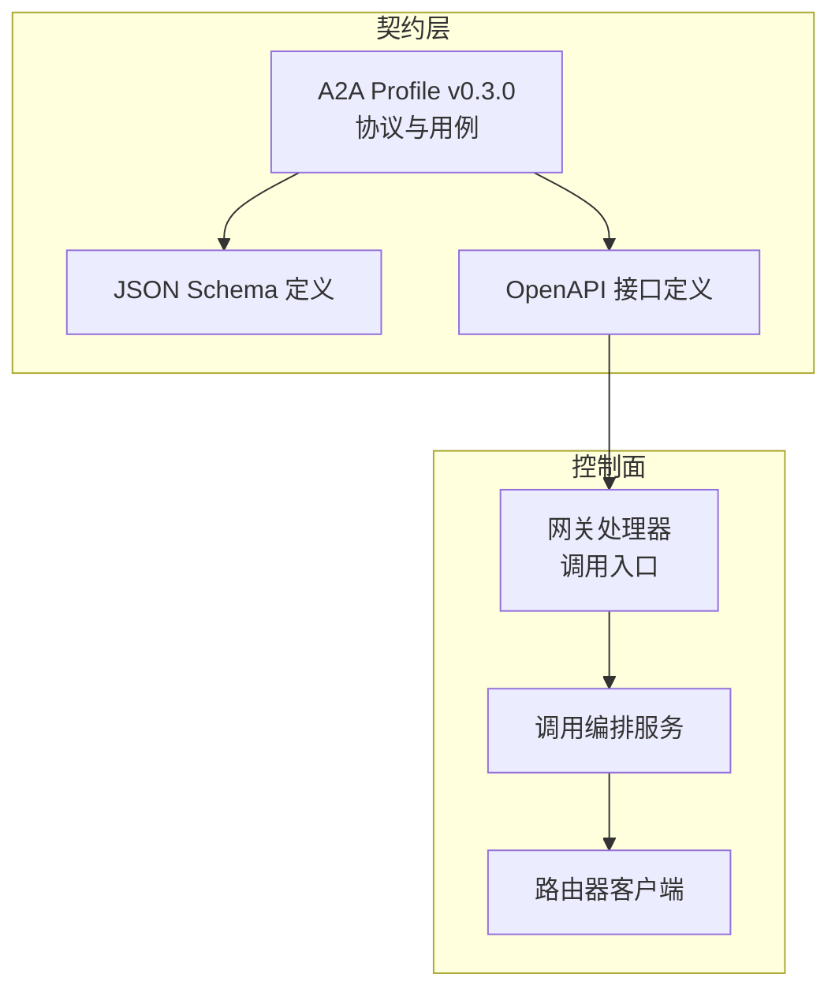
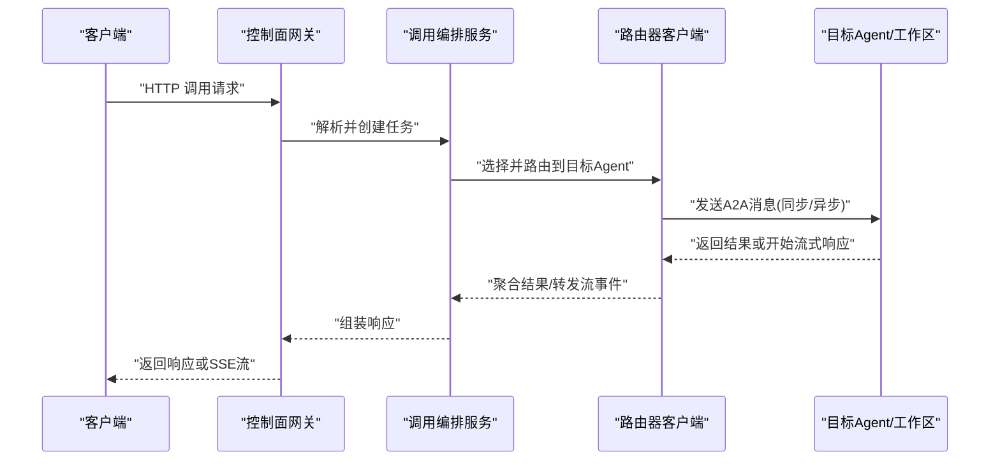
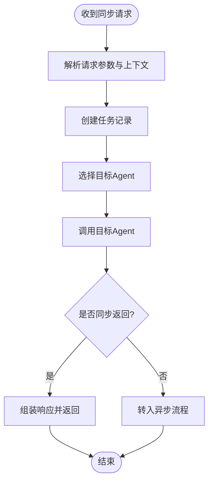
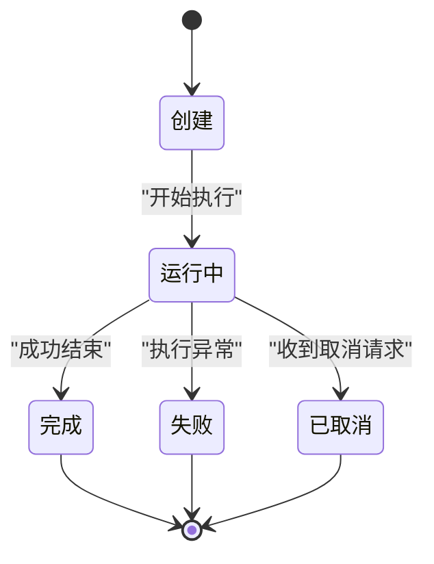
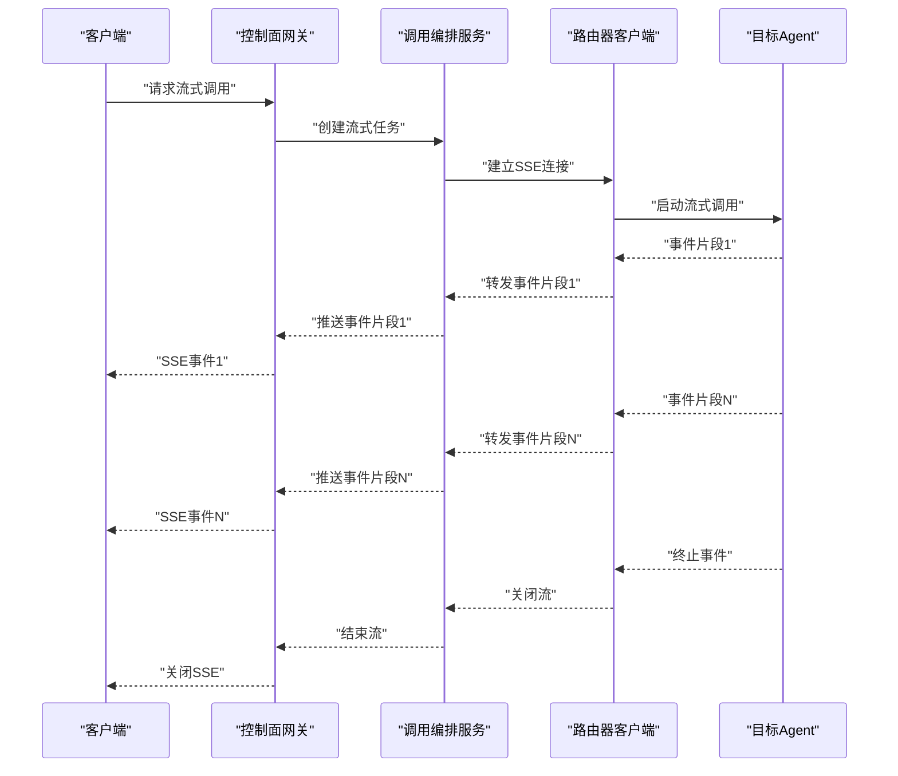
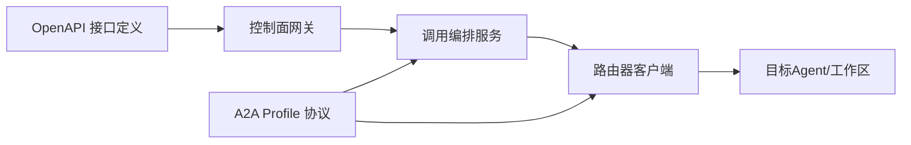

# A2A 消息流

<cite>
**本文引用的文件**   
- [contracts/a2a-profile/v0.3.0.json](file://contracts/a2a-profile/v0.3.0.json)
- [contracts/a2a-profile/v0.3.0/conformance/message-send-request.json](file://contracts/a2a-profile/v0.3.0/conformance/message-send-request.json)
- [contracts/a2a-profile/v0.3.0/conformance/message-stream-request.json](file://contracts/a2a-profile/v0.3.0/conformance/message-stream-request.json)
- [contracts/a2a-profile/v0.3.0/conformance/message-stream-valid.sse](file://contracts/a2a-profile/v0.3.0/conformance/message-stream-valid.sse)
- [contracts/a2a-profile/v0.3.0/conformance/message-stream-artifact-after-last-chunk.sse](file://contracts/a2a-profile/v0.3.0/conformance/message-stream-artifact-after-last-chunk.sse)
- [contracts/a2a-profile/v0.3.0/conformance/message-stream-context-mismatch.sse](file://contracts/a2a-profile/v0.3.0/conformance/message-stream-context-mismatch.sse)
- [contracts/a2a-profile/v0.3.0/conformance/message-stream-eof-without-terminal.sse](file://contracts/a2a-profile/v0.3.0/conformance/message-stream-eof-without-terminal.sse)
- [contracts/a2a-profile/v0.3.0/conformance/message-stream-event-after-terminal.sse](file://contracts/a2a-profile/v0.3.0/conformance/message-stream-event-after-terminal.sse)
- [contracts/a2a-profile/v0.3.0/conformance/tasks-get-request.json](file://contracts/a2a-profile/v0.3.0/conformance/tasks-get-request.json)
- [contracts/a2a-profile/v0.3.0/conformance/tasks-get-response.json](file://contracts/a2a-profile/v0.3.0/conformance/tasks-get-response.json)
- [contracts/a2a-profile/v0.3.0/conformance/tasks-cancel-request.json](file://contracts/a2a-profile/v0.3.0/conformance/tasks-cancel-request.json)
- [contracts/a2a-profile/v0.3.0/conformance/tasks-cancel-response.json](file://contracts/a2a-profile/v0.3.0/conformance/tasks-cancel-response.json)
- [contracts/a2a-profile/v0.3.0/conformance/manifest.json](file://contracts/a2a-profile/v0.3.0/conformance/manifest.json)
- [contracts/schemas/a2a-profile.v0.3.0.schema.json](file://contracts/schemas/a2a-profile.v0.3.0.schema.json)
- [contracts/openapi/router-agent.v1.yaml](file://contracts/openapi/router-agent.v1.yaml)
- [contracts/openapi/control-plane-invocation.v4.yaml](file://contracts/openapi/control-plane-invocation.v4.yaml)
- [apps/control-plane/internal/gateway/invocation_handler.go](file://apps/control-plane/internal/gateway/invocation_handler.go)
- [apps/control-plane/internal/invocation/service.go](file://apps/control-plane/internal/invocation/service.go)
- [apps/control-plane/internal/invocation/router_client.go](file://apps/control-plane/internal/invocation/router_client.go)
</cite>

## 目录
1. [简介](#简介)
2. [项目结构](#项目结构)
3. [核心组件](#核心组件)
4. [架构总览](#架构总览)
5. [详细组件分析](#详细组件分析)
6. [依赖分析](#依赖分析)
7. [性能考虑](#性能考虑)
8. [故障排查指南](#故障排查指南)
9. [结论](#结论)
10. [附录](#附录)

## 简介
本文件面向 NeKiro 平台的 Agent-to-Agent（A2A）消息流，聚焦于 Agent 间通信的消息传递机制与协议规范。文档覆盖：
- 同步消息发送、异步任务处理与流式响应（SSE）的实现方式
- 消息格式定义、序列化规则与传输协议
- 消息生命周期管理与状态跟踪
- 消息队列集成与负载均衡策略
- A2A 协议的完整使用示例与最佳实践

## 项目结构
NeKiro 仓库中与 A2A 消息流直接相关的资产主要分布在以下位置：
- contracts/a2a-profile：A2A Profile 协议定义与一致性测试用例（含请求/响应样例、SSE 流样例）
- contracts/schemas：JSON Schema 校验定义
- contracts/openapi：控制面与路由器的 OpenAPI 接口定义
- apps/control-plane：控制面实现，包含网关处理器、调用编排服务与路由器客户端

图表来源
- [contracts/a2a-profile/v0.3.0.json:1-200](file://contracts/a2a-profile/v0.3.0.json#L1-L200)
- [contracts/schemas/a2a-profile.v0.3.0.schema.json:1-200](file://contracts/schemas/a2a-profile.v0.3.0.schema.json#L1-L200)
- [contracts/openapi/router-agent.v1.yaml:1-200](file://contracts/openapi/router-agent.v1.yaml#L1-L200)
- [apps/control-plane/internal/gateway/invocation_handler.go:1-200](file://apps/control-plane/internal/gateway/invocation_handler.go#L1-L200)
- [apps/control-plane/internal/invocation/service.go:1-200](file://apps/control-plane/internal/invocation/service.go#L1-L200)
- [apps/control-plane/internal/invocation/router_client.go:1-200](file://apps/control-plane/internal/invocation/router_client.go#L1-L200)

章节来源
- [contracts/a2a-profile/v0.3.0.json:1-200](file://contracts/a2a-profile/v0.3.0.json#L1-L200)
- [contracts/schemas/a2a-profile.v0.3.0.schema.json:1-200](file://contracts/schemas/a2a-profile.v0.3.0.schema.json#L1-L200)
- [contracts/openapi/router-agent.v1.yaml:1-200](file://contracts/openapi/router-agent.v1.yaml#L1-L200)
- [apps/control-plane/internal/gateway/invocation_handler.go:1-200](file://apps/control-plane/internal/gateway/invocation_handler.go#L1-L200)
- [apps/control-plane/internal/invocation/service.go:1-200](file://apps/control-plane/internal/invocation/service.go#L1-L200)
- [apps/control-plane/internal/invocation/router_client.go:1-200](file://apps/control-plane/internal/invocation/router_client.go#L1-L200)

## 核心组件
- A2A Profile 协议：定义消息类型、任务模型、上下文与流事件语义，提供一致性测试用例以验证实现正确性。
- JSON Schema：对 A2A 消息体进行强类型约束，确保跨语言实现的互操作性。
- OpenAPI 接口：描述控制面与路由器之间的 HTTP 接口，包括调用分发、结果获取等。
- 控制面网关：接收外部调用请求，解析并转发至内部编排服务。
- 调用编排服务：负责创建任务、维护生命周期、协调路由与结果投递。
- 路由器客户端：与下游 Agent 或工作区实例交互，执行实际调用与流式读取。

章节来源
- [contracts/a2a-profile/v0.3.0.json:1-200](file://contracts/a2a-profile/v0.3.0.json#L1-L200)
- [contracts/schemas/a2a-profile.v0.3.0.schema.json:1-200](file://contracts/schemas/a2a-profile.v0.3.0.schema.json#L1-L200)
- [contracts/openapi/router-agent.v1.yaml:1-200](file://contracts/openapi/router-agent.v1.yaml#L1-L200)
- [apps/control-plane/internal/gateway/invocation_handler.go:1-200](file://apps/control-plane/internal/gateway/invocation_handler.go#L1-L200)
- [apps/control-plane/internal/invocation/service.go:1-200](file://apps/control-plane/internal/invocation/service.go#L1-L200)
- [apps/control-plane/internal/invocation/router_client.go:1-200](file://apps/control-plane/internal/invocation/router_client.go#L1-L200)

## 架构总览
下图展示了从外部调用到 A2A 消息流转的整体流程，涵盖同步请求、异步任务与 SSE 流式响应。

图表来源
- [apps/control-plane/internal/gateway/invocation_handler.go:1-200](file://apps/control-plane/internal/gateway/invocation_handler.go#L1-L200)
- [apps/control-plane/internal/invocation/service.go:1-200](file://apps/control-plane/internal/invocation/service.go#L1-L200)
- [apps/control-plane/internal/invocation/router_client.go:1-200](file://apps/control-plane/internal/invocation/router_client.go#L1-L200)
- [contracts/openapi/router-agent.v1.yaml:1-200](file://contracts/openapi/router-agent.v1.yaml#L1-L200)

## 详细组件分析

### A2A 协议与消息格式
- 协议版本与能力声明：通过 A2A Profile 定义支持的端点、消息类型与行为约束，并提供一致性清单用于自动化验证。
- 消息类型：
  - 消息发送：用于向目标 Agent 发起一次调用，支持同步返回或转为异步任务。
  - 任务查询：获取任务当前状态与结果摘要。
  - 任务取消：在可取消状态下终止任务执行。
- 流式响应：基于 Server-Sent Events（SSE），按事件片段推送中间结果与最终产物。
- 上下文与关联：消息携带上下文标识，用于跨阶段追踪与错误定位。

章节来源
- [contracts/a2a-profile/v0.3.0.json:1-200](file://contracts/a2a-profile/v0.3.0.json#L1-L200)
- [contracts/a2a-profile/v0.3.0/conformance/message-send-request.json:1-200](file://contracts/a2a-profile/v0.3.0/conformance/message-send-request.json#L1-L200)
- [contracts/a2a-profile/v0.3.0/conformance/tasks-get-request.json:1-200](file://contracts/a2a-profile/v0.3.0/conformance/tasks-get-request.json#L1-L200)
- [contracts/a2a-profile/v0.3.0/conformance/tasks-cancel-request.json:1-200](file://contracts/a2a-profile/v0.3.0/conformance/tasks-cancel-request.json#L1-L200)

### 同步消息发送
- 客户端通过控制面网关提交消息，网关将请求转换为内部任务对象并交由编排服务处理。
- 编排服务根据路由策略选择目标 Agent，并通过路由器客户端发起调用。
- 若目标 Agent 支持同步返回，则结果经路由器回传后由网关统一封装返回给客户端。

图表来源
- [apps/control-plane/internal/gateway/invocation_handler.go:1-200](file://apps/control-plane/internal/gateway/invocation_handler.go#L1-L200)
- [apps/control-plane/internal/invocation/service.go:1-200](file://apps/control-plane/internal/invocation/service.go#L1-L200)
- [apps/control-plane/internal/invocation/router_client.go:1-200](file://apps/control-plane/internal/invocation/router_client.go#L1-L200)

章节来源
- [apps/control-plane/internal/gateway/invocation_handler.go:1-200](file://apps/control-plane/internal/gateway/invocation_handler.go#L1-L200)
- [apps/control-plane/internal/invocation/service.go:1-200](file://apps/control-plane/internal/invocation/service.go#L1-L200)
- [apps/control-plane/internal/invocation/router_client.go:1-200](file://apps/control-plane/internal/invocation/router_client.go#L1-L200)

### 异步任务处理
- 当目标 Agent 不支持同步返回或业务需要异步时，编排服务创建任务并返回任务 ID。
- 客户端可通过任务查询接口轮询任务状态与结果摘要。
- 任务状态机通常包含：创建、运行中、完成、失败、已取消等状态，具体以协议与实现为准。

章节来源
- [contracts/a2a-profile/v0.3.0/conformance/tasks-get-request.json:1-200](file://contracts/a2a-profile/v0.3.0/conformance/tasks-get-request.json#L1-L200)
- [contracts/a2a-profile/v0.3.0/conformance/tasks-get-response.json:1-200](file://contracts/a2a-profile/v0.3.0/conformance/tasks-get-response.json#L1-L200)
- [contracts/a2a-profile/v0.3.0/conformance/tasks-cancel-request.json:1-200](file://contracts/a2a-profile/v0.3.0/conformance/tasks-cancel-request.json#L1-L200)
- [contracts/a2a-profile/v0.3.0/conformance/tasks-cancel-response.json:1-200](file://contracts/a2a-profile/v0.3.0/conformance/tasks-cancel-response.json#L1-L200)

### 流式响应（SSE）
- 当目标 Agent 支持流式输出时，路由器客户端建立 SSE 连接并按事件片段推送数据。
- 客户端需正确处理事件顺序、上下文匹配与终止条件，避免在终端事件之后继续消费。
- 一致性测试用例覆盖了常见边界情况，如末尾追加产物、上下文不匹配、无终止的 EOF 等。

图表来源
- [contracts/a2a-profile/v0.3.0/conformance/message-stream-request.json:1-200](file://contracts/a2a-profile/v0.3.0/conformance/message-stream-request.json#L1-L200)
- [contracts/a2a-profile/v0.3.0/conformance/message-stream-valid.sse:1-200](file://contracts/a2a-profile/v0.3.0/conformance/message-stream-valid.sse#L1-L200)
- [contracts/a2a-profile/v0.3.0/conformance/message-stream-artifact-after-last-chunk.sse:1-200](file://contracts/a2a-profile/v0.3.0/conformance/message-stream-artifact-after-last-chunk.sse#L1-L200)
- [contracts/a2a-profile/v0.3.0/conformance/message-stream-context-mismatch.sse:1-200](file://contracts/a2a-profile/v0.3.0/conformance/message-stream-context-mismatch.sse#L1-L200)
- [contracts/a2a-profile/v0.3.0/conformance/message-stream-eof-without-terminal.sse:1-200](file://contracts/a2a-profile/v0.3.0/conformance/message-stream-eof-without-terminal.sse#L1-L200)
- [contracts/a2a-profile/v0.3.0/conformance/message-stream-event-after-terminal.sse:1-200](file://contracts/a2a-profile/v0.3.0/conformance/message-stream-event-after-terminal.sse#L1-L200)

章节来源
- [contracts/a2a-profile/v0.3.0/conformance/message-stream-request.json:1-200](file://contracts/a2a-profile/v0.3.0/conformance/message-stream-request.json#L1-L200)
- [contracts/a2a-profile/v0.3.0/conformance/message-stream-valid.sse:1-200](file://contracts/a2a-profile/v0.3.0/conformance/message-stream-valid.sse#L1-L200)
- [contracts/a2a-profile/v0.3.0/conformance/message-stream-artifact-after-last-chunk.sse:1-200](file://contracts/a2a-profile/v0.3.0/conformance/message-stream-artifact-after-last-chunk.sse#L1-L200)
- [contracts/a2a-profile/v0.3.0/conformance/message-stream-context-mismatch.sse:1-200](file://contracts/a2a-profile/v0.3.0/conformance/message-stream-context-mismatch.sse#L1-L200)
- [contracts/a2a-profile/v0.3.0/conformance/message-stream-eof-without-terminal.sse:1-200](file://contracts/a2a-profile/v0.3.0/conformance/message-stream-eof-without-terminal.sse#L1-L200)
- [contracts/a2a-profile/v0.3.0/conformance/message-stream-event-after-terminal.sse:1-200](file://contracts/a2a-profile/v0.3.0/conformance/message-stream-event-after-terminal.sse#L1-L200)

### 消息生命周期管理与状态跟踪
- 生命周期阶段：创建、调度、执行、产出、完成/失败/取消。
- 状态跟踪：通过任务 ID 与上下文标识贯穿整个调用链，便于日志与链路追踪。
- 幂等性与重试：对关键操作（如任务查询）应保证幂等；对瞬时错误可按策略重试。

章节来源
- [contracts/a2a-profile/v0.3.0/conformance/tasks-get-request.json:1-200](file://contracts/a2a-profile/v0.3.0/conformance/tasks-get-request.json#L1-L200)
- [contracts/a2a-profile/v0.3.0/conformance/tasks-get-response.json:1-200](file://contracts/a2a-profile/v0.3.0/conformance/tasks-get-response.json#L1-L200)
- [contracts/a2a-profile/v0.3.0/conformance/tasks-cancel-request.json:1-200](file://contracts/a2a-profile/v0.3.0/conformance/tasks-cancel-request.json#L1-L200)
- [contracts/a2a-profile/v0.3.0/conformance/tasks-cancel-response.json:1-200](file://contracts/a2a-profile/v0.3.0/conformance/tasks-cancel-response.json#L1-L200)

### 消息队列集成与负载均衡策略
- 队列集成：对于高吞吐场景，可在编排服务与路由器客户端之间引入消息队列以实现削峰填谷与解耦。
- 负载均衡：依据目标 Agent 的能力、负载与健康状况进行动态选择，结合权重与亲和性策略提升整体吞吐与稳定性。
- 背压与限流：在流式场景中实施背压控制，防止下游过载；在网关层配置限流保护系统资源。

[本节为通用指导，未直接分析具体文件]

### A2A 协议使用示例与最佳实践
- 同步调用示例：构造消息请求，设置必要上下文，等待同步返回；注意超时与重试策略。
- 异步任务示例：提交任务后轮询任务状态，直至完成或失败；必要时发起取消请求。
- 流式调用示例：建立 SSE 连接，逐条处理事件片段，严格遵循终止条件与上下文匹配规则。
- 最佳实践：
  - 始终携带上下文与追踪标识，便于问题定位。
  - 对 SSE 流实现健壮的错误恢复与重连逻辑。
  - 合理设置超时与重试次数，避免雪崩效应。
  - 使用一致性测试用例验证实现是否符合协议。

章节来源
- [contracts/a2a-profile/v0.3.0/conformance/message-send-request.json:1-200](file://contracts/a2a-profile/v0.3.0/conformance/message-send-request.json#L1-L200)
- [contracts/a2a-profile/v0.3.0/conformance/message-stream-request.json:1-200](file://contracts/a2a-profile/v0.3.0/conformance/message-stream-request.json#L1-L200)
- [contracts/a2a-profile/v0.3.0/conformance/message-stream-valid.sse:1-200](file://contracts/a2a-profile/v0.3.0/conformance/message-stream-valid.sse#L1-L200)
- [contracts/a2a-profile/v0.3.0/conformance/manifest.json:1-200](file://contracts/a2a-profile/v0.3.0/conformance/manifest.json#L1-L200)

## 依赖分析
- 控制面网关依赖 OpenAPI 定义的接口契约，解析请求并委托编排服务。
- 编排服务依赖路由器客户端与 A2A 协议定义，负责任务生命周期管理。
- 路由器客户端依赖目标 Agent 的工作区接口，执行实际调用与流式读取。

图表来源
- [contracts/openapi/router-agent.v1.yaml:1-200](file://contracts/openapi/router-agent.v1.yaml#L1-L200)
- [contracts/openapi/control-plane-invocation.v4.yaml:1-200](file://contracts/openapi/control-plane-invocation.v4.yaml#L1-L200)
- [contracts/a2a-profile/v0.3.0.json:1-200](file://contracts/a2a-profile/v0.3.0.json#L1-L200)
- [apps/control-plane/internal/gateway/invocation_handler.go:1-200](file://apps/control-plane/internal/gateway/invocation_handler.go#L1-L200)
- [apps/control-plane/internal/invocation/service.go:1-200](file://apps/control-plane/internal/invocation/service.go#L1-L200)
- [apps/control-plane/internal/invocation/router_client.go:1-200](file://apps/control-plane/internal/invocation/router_client.go#L1-L200)

章节来源
- [contracts/openapi/router-agent.v1.yaml:1-200](file://contracts/openapi/router-agent.v1.yaml#L1-L200)
- [contracts/openapi/control-plane-invocation.v4.yaml:1-200](file://contracts/openapi/control-plane-invocation.v4.yaml#L1-L200)
- [contracts/a2a-profile/v0.3.0.json:1-200](file://contracts/a2a-profile/v0.3.0.json#L1-L200)
- [apps/control-plane/internal/gateway/invocation_handler.go:1-200](file://apps/control-plane/internal/gateway/invocation_handler.go#L1-L200)
- [apps/control-plane/internal/invocation/service.go:1-200](file://apps/control-plane/internal/invocation/service.go#L1-L200)
- [apps/control-plane/internal/invocation/router_client.go:1-200](file://apps/control-plane/internal/invocation/router_client.go#L1-L200)

## 性能考虑
- 流式处理优先：对长耗时任务采用 SSE 流式输出，降低端到端延迟。
- 连接复用：与目标 Agent 的连接尽量复用，减少握手开销。
- 批处理与合并：在可能的情况下合并小消息以减少网络往返。
- 监控与度量：采集关键指标（QPS、延迟、错误率、SSE 事件速率）以便容量规划与问题定位。

[本节为通用指导，未直接分析具体文件]

## 故障排查指南
- 常见问题：
  - SSE 流提前终止：检查终止事件是否正确发送，确认客户端未在终端事件后继续消费。
  - 上下文不匹配：核对消息上下文与任务上下文的一致性。
  - 任务不可取消：确认任务是否处于可取消状态。
- 诊断步骤：
  - 使用任务查询接口获取任务状态与错误信息。
  - 查看一致性测试用例中的无效场景，对比实际行为。
  - 启用链路追踪，定位调用链上的瓶颈与异常。

章节来源
- [contracts/a2a-profile/v0.3.0/conformance/message-stream-artifact-after-last-chunk.sse:1-200](file://contracts/a2a-profile/v0.3.0/conformance/message-stream-artifact-after-last-chunk.sse#L1-L200)
- [contracts/a2a-profile/v0.3.0/conformance/message-stream-context-mismatch.sse:1-200](file://contracts/a2a-profile/v0.3.0/conformance/message-stream-context-mismatch.sse#L1-L200)
- [contracts/a2a-profile/v0.3.0/conformance/message-stream-eof-without-terminal.sse:1-200](file://contracts/a2a-profile/v0.3.0/conformance/message-stream-eof-without-terminal.sse#L1-L200)
- [contracts/a2a-profile/v0.3.0/conformance/message-stream-event-after-terminal.sse:1-200](file://contracts/a2a-profile/v0.3.0/conformance/message-stream-event-after-terminal.sse#L1-L200)
- [contracts/a2a-profile/v0.3.0/conformance/tasks-cancel-not-found-response.json:1-200](file://contracts/a2a-profile/v0.3.0/conformance/tasks-cancel-not-found-response.json#L1-L200)
- [contracts/a2a-profile/v0.3.0/conformance/tasks-cancel-not-cancelable-response.json:1-200](file://contracts/a2a-profile/v0.3.0/conformance/tasks-cancel-not-cancelable-response.json#L1-L200)

## 结论
NeKiro 平台的 A2A 消息流以 A2A Profile 为核心契约，结合 JSON Schema 与 OpenAPI 接口定义，实现了同步、异步与流式三种消息传递模式。通过明确的生命周期管理与状态跟踪，以及一致性的测试用例，平台能够在复杂的多 Agent 协作场景中提供稳定、可观测且高性能的通信能力。建议在实际部署中结合消息队列与负载均衡策略，进一步提升系统的可扩展性与韧性。

## 附录
- 参考契约与用例：
  - A2A Profile 主定义与一致性清单
  - 消息发送、任务查询与取消的请求/响应样例
  - SSE 流式响应的有效与无效场景样例

章节来源
- [contracts/a2a-profile/v0.3.0.json:1-200](file://contracts/a2a-profile/v0.3.0.json#L1-L200)
- [contracts/a2a-profile/v0.3.0/conformance/manifest.json:1-200](file://contracts/a2a-profile/v0.3.0/conformance/manifest.json#L1-L200)
- [contracts/a2a-profile/v0.3.0/conformance/message-send-request.json:1-200](file://contracts/a2a-profile/v0.3.0/conformance/message-send-request.json#L1-L200)
- [contracts/a2a-profile/v0.3.0/conformance/tasks-get-request.json:1-200](file://contracts/a2a-profile/v0.3.0/conformance/tasks-get-request.json#L1-L200)
- [contracts/a2a-profile/v0.3.0/conformance/tasks-cancel-request.json:1-200](file://contracts/a2a-profile/v0.3.0/conformance/tasks-cancel-request.json#L1-L200)
- [contracts/a2a-profile/v0.3.0/conformance/message-stream-request.json:1-200](file://contracts/a2a-profile/v0.3.0/conformance/message-stream-request.json#L1-L200)
- [contracts/a2a-profile/v0.3.0/conformance/message-stream-valid.sse:1-200](file://contracts/a2a-profile/v0.3.0/conformance/message-stream-valid.sse#L1-L200)