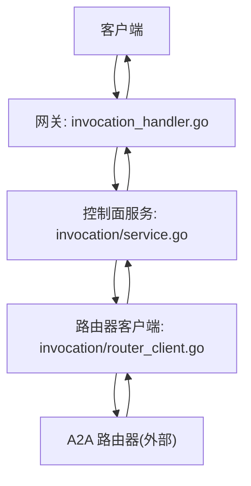
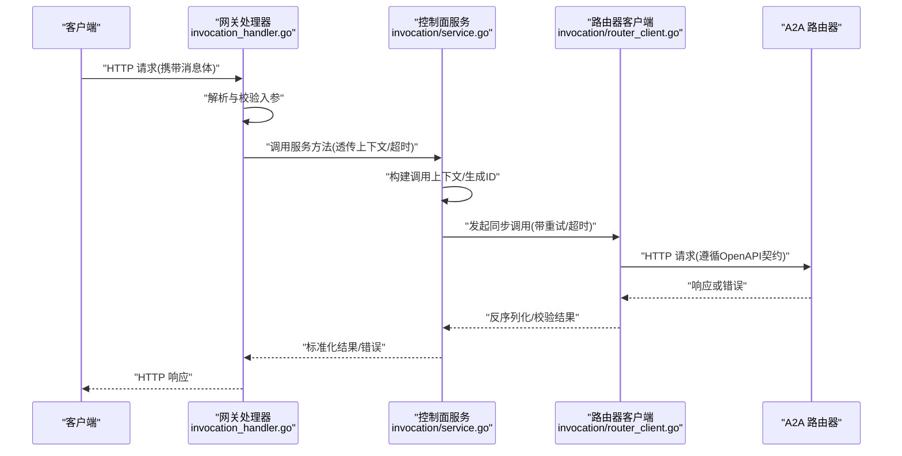
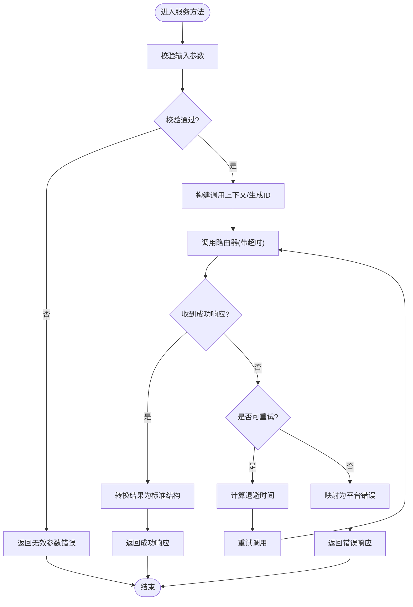
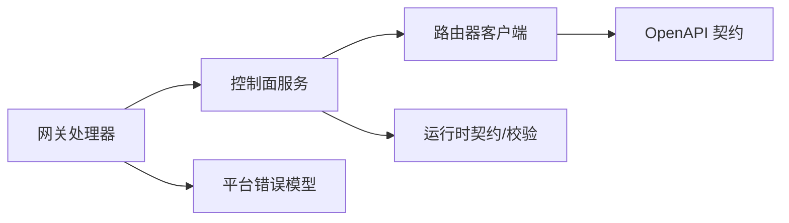

# 同步消息处理

<cite>
**本文引用的文件**   
- [apps/control-plane/internal/gateway/invocation_handler.go](file://apps/control-plane/internal/gateway/invocation_handler.go)
- [apps/control-plane/internal/invocation/service.go](file://apps/control-plane/internal/invocation/service.go)
- [apps/control-plane/internal/invocation/router_client.go](file://apps/control-plane/internal/invocation/router_client.go)
- [contracts/openapi/router-agent.v1.yaml](file://contracts/openapi/router-agent.v1.yaml)
- [contracts/openapi/router-internal.v3.yaml](file://contracts/openapi/router-internal.v3.yaml)
- [contracts/schemas/platform-error.v4.schema.json](file://contracts/schemas/platform-error.v4.schema.json)
- [contracts/runtime_contracts.go](file://contracts/runtime_contracts.go)
- [contracts/runtime_contracts_validation.go](file://contracts/runtime_contracts_validation.go)
- [apps/control-plane/cmd/control-plane/main.go](file://apps/control-plane/cmd/control-plane/main.go)
</cite>

## 目录
1. [简介](#简介)
2. [项目结构](#项目结构)
3. [核心组件](#核心组件)
4. [架构总览](#架构总览)
5. [详细组件分析](#详细组件分析)
6. [依赖分析](#依赖分析)
7. [性能考虑](#性能考虑)
8. [故障排查指南](#故障排查指南)
9. [结论](#结论)
10. [附录](#附录)

## 简介
本文件面向 NeKiro 平台的 A2A（Agent-to-Agent）同步消息处理，聚焦“请求-响应”模式在网关层与控制面之间的实现机制。文档覆盖：
- 同步消息的发送、路由与响应的完整流程
- 消息格式定义、参数校验与错误处理策略
- 请求生命周期管理、超时控制与重试机制
- 与网关层和服务层的集成方式
- 性能优化建议与故障排查指南

## 项目结构
NeKiro 平台中与 A2A 同步消息处理相关的代码主要位于 control-plane 内部模块，并通过 OpenAPI 契约与 a2a-router 交互。关键路径如下：
- 网关入口：invocation_handler.go
- 编排与服务层：invocation/service.go
- 与路由器通信：invocation/router_client.go
- 外部契约：router-agent.v1.yaml、router-internal.v3.yaml
- 错误模型：platform-error.v4.schema.json
- 运行时契约与校验：runtime_contracts.go、runtime_contracts_validation.go
- 服务启动：main.go

图表来源
- [apps/control-plane/internal/gateway/invocation_handler.go](file://apps/control-plane/internal/gateway/invocation_handler.go)
- [apps/control-plane/internal/invocation/service.go](file://apps/control-plane/internal/invocation/service.go)
- [apps/control-plane/internal/invocation/router_client.go](file://apps/control-plane/internal/invocation/router_client.go)

章节来源
- [apps/control-plane/cmd/control-plane/main.go](file://apps/control-plane/cmd/control-plane/main.go)

## 核心组件
- 网关处理器（invocation_handler.go）
  - 职责：接收 HTTP 请求，解析并校验入参，调用控制面服务，返回统一响应或错误。
  - 关键点：上下文传播、超时传递、错误映射到平台错误模型。
- 控制面服务（invocation/service.go）
  - 职责：编排同步调用流程，包括参数校验、构建调用上下文、调用路由器、处理结果与异常。
  - 关键点：生命周期管理、重试策略、结果聚合与转换。
- 路由器客户端（invocation/router_client.go）
  - 职责：封装与 a2a-router 的 HTTP 调用，遵循 router-agent.v1.yaml 与 router-internal.v3.yaml 契约。
  - 关键点：超时、重试、幂等键、追踪 ID 注入。

章节来源
- [apps/control-plane/internal/gateway/invocation_handler.go](file://apps/control-plane/internal/gateway/invocation_handler.go)
- [apps/control-plane/internal/invocation/service.go](file://apps/control-plane/internal/invocation/service.go)
- [apps/control-plane/internal/invocation/router_client.go](file://apps/control-plane/internal/invocation/router_client.go)

## 架构总览
下图展示了从客户端到路由器的端到端同步调用时序，包含校验、路由、重试与错误处理。

图表来源
- [apps/control-plane/internal/gateway/invocation_handler.go](file://apps/control-plane/internal/gateway/invocation_handler.go)
- [apps/control-plane/internal/invocation/service.go](file://apps/control-plane/internal/invocation/service.go)
- [apps/control-plane/internal/invocation/router_client.go](file://apps/control-plane/internal/invocation/router_client.go)
- [contracts/openapi/router-agent.v1.yaml](file://contracts/openapi/router-agent.v1.yaml)
- [contracts/openapi/router-internal.v3.yaml](file://contracts/openapi/router-internal.v3.yaml)

## 详细组件分析

### 网关处理器（invocation_handler.go）
- 功能要点
  - 解析请求体，提取关键字段（如消息内容、目标能力标识、可选元数据）。
  - 基于 OpenAPI 契约进行入参校验，失败时返回平台错误。
  - 将请求上下文（含追踪 ID、租户/工作区信息）传递给服务层。
  - 根据服务层返回设置 HTTP 状态码与响应体。
- 错误处理
  - 将业务错误映射为 platform-error.v4 结构，确保客户端可一致消费。
- 超时控制
  - 使用请求上下文或显式超时参数，避免长时间阻塞。

章节来源
- [apps/control-plane/internal/gateway/invocation_handler.go](file://apps/control-plane/internal/gateway/invocation_handler.go)
- [contracts/schemas/platform-error.v4.schema.json](file://contracts/schemas/platform-error.v4.schema.json)

### 控制面服务（invocation/service.go）
- 功能要点
  - 负责同步调用的编排：参数二次校验、上下文构建、调用路由器、结果转换。
  - 维护调用生命周期：创建/更新/完成/失败等状态流转。
  - 支持重试与退避策略，针对可重试错误进行自动恢复。
- 重试机制
  - 仅对幂等且短暂性错误（如网络抖动、限流）触发重试。
  - 通过指数退避与最大重试次数限制，防止雪崩。
- 超时控制
  - 以“网关超时 > 服务超时 > 路由器超时”的分层策略保证整体 SLA。
- 结果与错误
  - 成功：转换为标准响应结构返回。
  - 失败：包装为平台错误，附带错误码与诊断信息。

章节来源
- [apps/control-plane/internal/invocation/service.go](file://apps/control-plane/internal/invocation/service.go)
- [contracts/runtime_contracts.go](file://contracts/runtime_contracts.go)
- [contracts/runtime_contracts_validation.go](file://contracts/runtime_contracts_validation.go)

### 路由器客户端（invocation/router_client.go）
- 功能要点
  - 依据 router-agent.v1.yaml 与 router-internal.v3.yaml 构造请求与解析响应。
  - 注入追踪 ID、幂等键、超时等横切关注点。
  - 处理网络层异常与协议层错误，向上抛出可重试/不可重试错误。
- 超时与重试
  - 默认超时由服务层传入；可配置重试策略与退避算法。
- 契约一致性
  - 严格遵循 OpenAPI 定义的字段、枚举与约束，避免兼容性问题。

章节来源
- [apps/control-plane/internal/invocation/router_client.go](file://apps/control-plane/internal/invocation/router_client.go)
- [contracts/openapi/router-agent.v1.yaml](file://contracts/openapi/router-agent.v1.yaml)
- [contracts/openapi/router-internal.v3.yaml](file://contracts/openapi/router-internal.v3.yaml)

### 同步调用流程图（算法视角）

图表来源
- [apps/control-plane/internal/invocation/service.go](file://apps/control-plane/internal/invocation/service.go)
- [contracts/runtime_contracts_validation.go](file://contracts/runtime_contracts_validation.go)

## 依赖分析
- 组件耦合
  - 网关处理器依赖服务层，不直接访问路由器。
  - 服务层依赖路由器客户端，屏蔽底层 HTTP 细节。
  - 路由器客户端依赖 OpenAPI 契约定义，确保跨进程接口稳定。
- 外部依赖
  - a2a-router：提供 A2A 能力的实际执行端点。
  - 平台错误模型：统一错误语义，便于客户端处理。
- 可能的循环依赖
  - 当前分层清晰，未见循环依赖迹象。

图表来源
- [apps/control-plane/internal/gateway/invocation_handler.go](file://apps/control-plane/internal/gateway/invocation_handler.go)
- [apps/control-plane/internal/invocation/service.go](file://apps/control-plane/internal/invocation/service.go)
- [apps/control-plane/internal/invocation/router_client.go](file://apps/control-plane/internal/invocation/router_client.go)
- [contracts/openapi/router-agent.v1.yaml](file://contracts/openapi/router-agent.v1.yaml)
- [contracts/openapi/router-internal.v3.yaml](file://contracts/openapi/router-internal.v3.yaml)
- [contracts/runtime_contracts.go](file://contracts/runtime_contracts.go)
- [contracts/runtime_contracts_validation.go](file://contracts/runtime_contracts_validation.go)
- [contracts/schemas/platform-error.v4.schema.json](file://contracts/schemas/platform-error.v4.schema.json)

章节来源
- [contracts/openapi/router-agent.v1.yaml](file://contracts/openapi/router-agent.v1.yaml)
- [contracts/openapi/router-internal.v3.yaml](file://contracts/openapi/router-internal.v3.yaml)
- [contracts/schemas/platform-error.v4.schema.json](file://contracts/schemas/platform-error.v4.schema.json)
- [contracts/runtime_contracts.go](file://contracts/runtime_contracts.go)
- [contracts/runtime_contracts_validation.go](file://contracts/runtime_contracts_validation.go)

## 性能考虑
- 超时分层
  - 网关超时 > 服务超时 > 路由器超时，避免长尾请求占用资源。
- 连接复用与池化
  - 复用 HTTP 连接，减少握手开销；合理设置连接池大小。
- 批量与并发
  - 在安全范围内提升并发度；避免无界并发导致下游过载。
- 缓存与去重
  - 对幂等请求使用幂等键去重，降低重复计算。
- 监控与指标
  - 记录延迟分位、错误率、重试次数、超时占比，辅助容量规划。

[本节为通用指导，无需源码引用]

## 故障排查指南
- 常见错误分类
  - 参数错误：入参缺失/类型不符/违反约束，参考平台错误模型定位。
  - 路由错误：目标不可达/版本不匹配/权限不足，检查 OpenAPI 契约与路由配置。
  - 超时错误：上游处理过慢或链路拥塞，调整超时与重试策略。
  - 重试风暴：退避未生效或重试上限过高，检查服务层重试逻辑。
- 快速定位步骤
  - 查看请求追踪 ID，串联网关-服务-路由器日志。
  - 核对 OpenAPI 契约变更是否已同步至双方。
  - 验证平台错误模型的字段完整性与语义一致性。
- 回滚与降级
  - 出现大规模错误时，优先回滚最近变更；必要时启用降级策略（返回友好错误码）。

章节来源
- [contracts/schemas/platform-error.v4.schema.json](file://contracts/schemas/platform-error.v4.schema.json)
- [contracts/runtime_contracts_validation.go](file://contracts/runtime_contracts_validation.go)

## 结论
NeKiro 平台的 A2A 同步消息处理采用清晰的三层架构：网关处理器、控制面服务与路由器客户端。通过严格的契约校验、分层超时与可控重试，实现了高可用与可观测的同步调用体验。建议在上线前完善监控指标与压测基线，持续优化超时与重试策略，保障端到端 SLA。

[本节为总结，无需源码引用]

## 附录

### 消息格式与契约要点
- 请求/响应结构
  - 遵循 router-agent.v1.yaml 与 router-internal.v3.yaml 的定义，确保字段、类型与约束一致。
- 平台错误模型
  - 使用 platform-error.v4.schema.json 描述错误码、消息与附加信息，便于客户端统一处理。
- 运行时契约
  - 参考 runtime_contracts.go 与 runtime_contracts_validation.go 中的语义规则与校验逻辑。

章节来源
- [contracts/openapi/router-agent.v1.yaml](file://contracts/openapi/router-agent.v1.yaml)
- [contracts/openapi/router-internal.v3.yaml](file://contracts/openapi/router-internal.v3.yaml)
- [contracts/schemas/platform-error.v4.schema.json](file://contracts/schemas/platform-error.v4.schema.json)
- [contracts/runtime_contracts.go](file://contracts/runtime_contracts.go)
- [contracts/runtime_contracts_validation.go](file://contracts/runtime_contracts_validation.go)

### 示例：如何发送与处理同步消息（路径指引）
- 发送同步消息（网关侧）
  - 参考：[apps/control-plane/internal/gateway/invocation_handler.go](file://apps/control-plane/internal/gateway/invocation_handler.go)
- 编排与重试（服务侧）
  - 参考：[apps/control-plane/internal/invocation/service.go](file://apps/control-plane/internal/invocation/service.go)
- 调用路由器（客户端侧）
  - 参考：[apps/control-plane/internal/invocation/router_client.go](file://apps/control-plane/internal/invocation/router_client.go)
- 契约与错误模型
  - 参考：[contracts/openapi/router-agent.v1.yaml](file://contracts/openapi/router-agent.v1.yaml)、[contracts/openapi/router-internal.v3.yaml](file://contracts/openapi/router-internal.v3.yaml)、[contracts/schemas/platform-error.v4.schema.json](file://contracts/schemas/platform-error.v4.schema.json)