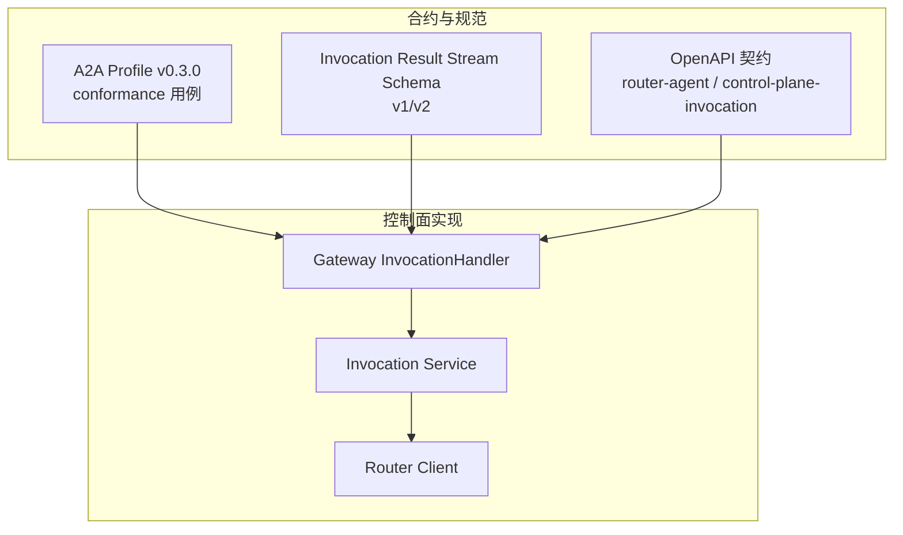
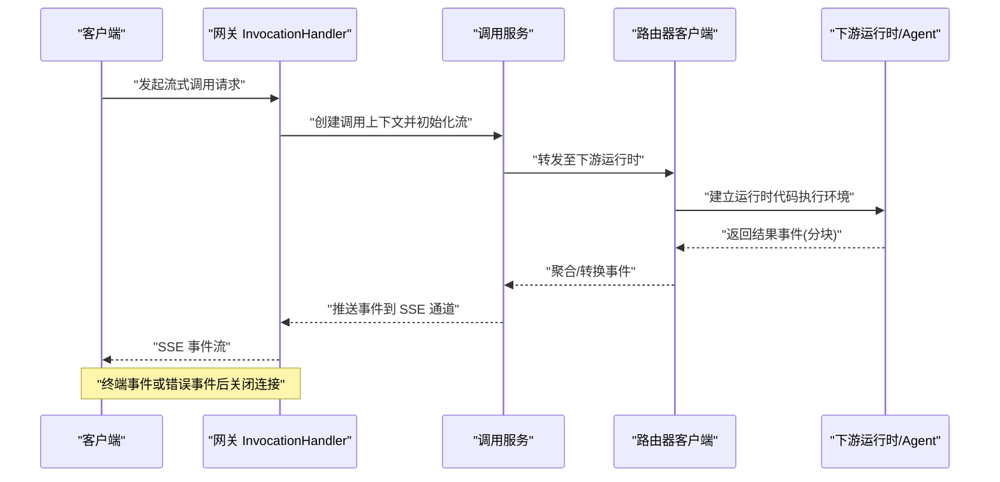
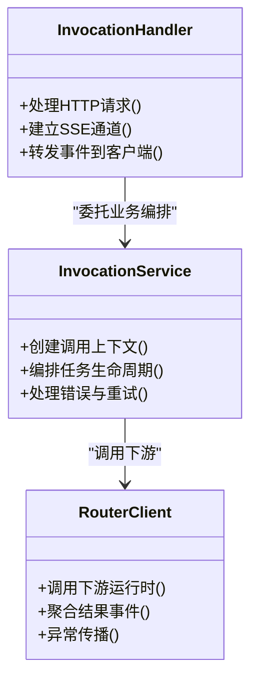
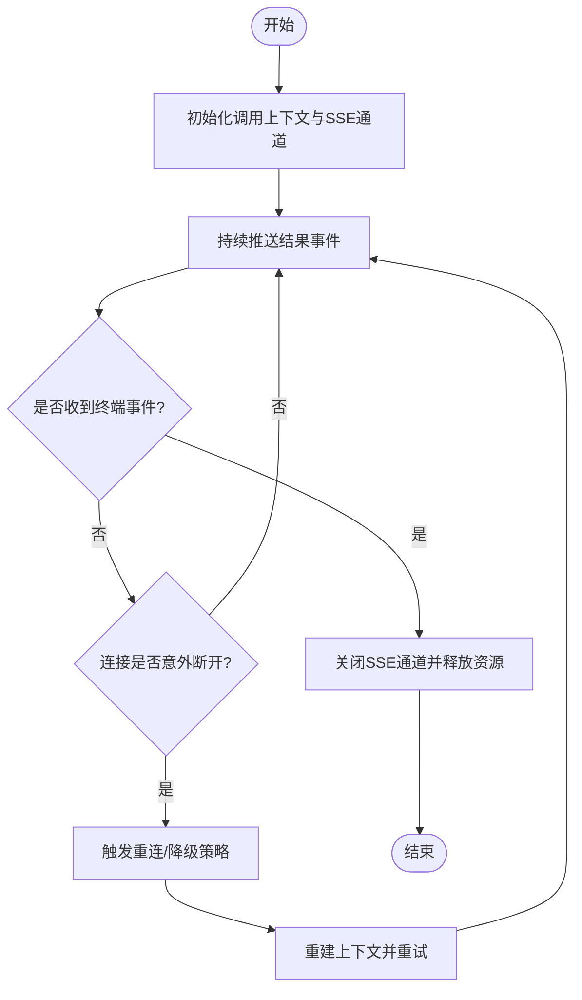
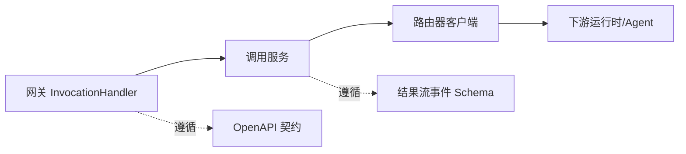

# 流式消息处理

<cite>
**本文引用的文件**   
- [README.md](file://README.md)
- [contracts/a2a-profile/v0.3.0/conformance/message-stream-valid.sse](file://contracts/a2a-profile/v0.3.0/conformance/message-stream-valid.sse)
- [contracts/a2a-profile/v0.3.0/conformance/message-stream-artifact-after-last-chunk.sse](file://contracts/a2a-profile/v0.3.0/conformance/message-stream-artifact-after-last-chunk.sse)
- [contracts/a2a-profile/v0.3.0/conformance/message-stream-context-mismatch.sse](file://contracts/a2a-profile/v0.3.0/conformance/message-stream-context-mismatch.sse)
- [contracts/a2a-profile/v0.3.0/conformance/message-stream-eof-without-terminal.sse](file://contracts/a2a-profile/v0.3.0/conformance/message-stream-eof-without-terminal.sse)
- [contracts/a2a-profile/v0.3.0/conformance/message-stream-event-after-terminal.sse](file://contracts/a2a-profile/v0.3.0/conformance/message-stream-event-after-terminal.sse)
- [contracts/a2a-profile/v0.3.0/conformance/message-stream-request.json](file://contracts/a2a-profile/v0.3.0/conformance/message-stream-request.json)
- [contracts/invocation-runtime/v1/conformance/result-stream.json](file://contracts/invocation-runtime/v1/conformance/result-stream.json)
- [contracts/schemas/invocation-result-stream-event.v1.schema.json](file://contracts/schemas/invocation-result-stream-event.v1.schema.json)
- [contracts/schemas/invocation-result-stream-event.v2.schema.json](file://contracts/schemas/invocation-result-stream-event.v2.schema.json)
- [contracts/openapi/router-agent.v1.yaml](file://contracts/openapi/router-agent.v1.yaml)
- [contracts/openapi/control-plane-invocation.v4.yaml](file://contracts/openapi/control-plane-invocation.v4.yaml)
- [apps/control-plane/internal/gateway/invocation_handler.go](file://apps/control-plane/internal/gateway/invocation_handler.go)
- [apps/control-plane/internal/invocation/service.go](file://apps/control-plane/internal/invocation/service.go)
- [apps/control-plane/internal/invocation/router_client.go](file://apps/control-plane/internal/invocation/router_client.go)
</cite>

## 目录
1. [简介](#简介)
2. [项目结构](#项目结构)
3. [核心组件](#核心组件)
4. [架构总览](#架构总览)
5. [详细组件分析](#详细组件分析)
6. [依赖关系分析](#依赖关系分析)
7. [性能与资源优化](#性能与资源优化)
8. [故障排查指南](#故障排查指南)
9. [结论](#结论)
10. [附录](#附录)

## 简介
本文件面向 NeKiro 平台的 A2A（Agent-to-Agent）流式消息处理，聚焦基于 SSE（Server-Sent Events）的实时通信机制与事件驱动架构。文档覆盖：
- 流式连接的建立、维护与关闭流程
- 事件类型定义、数据分块传输与状态同步机制
- 上下文一致性保证与错误恢复策略
- 完整的流式消息处理示例与客户端集成指南
- 连接池管理与资源优化建议

## 项目结构
NeKiro 平台在合约层对 A2A 流式协议进行了严格定义，并在控制面网关中提供相应的处理入口。关键位置包括：
- 合约与规范：A2A Profile v0.3.0 的 conformance 用例、Invocation Result Stream 的 schema 与 conformance 用例、OpenAPI 路由契约
- 控制面实现：网关层的调用处理器、调用服务与路由器客户端

图表来源
- [contracts/a2a-profile/v0.3.0/conformance/message-stream-valid.sse](file://contracts/a2a-profile/v0.3.0/conformance/message-stream-valid.sse)
- [contracts/schemas/invocation-result-stream-event.v1.schema.json](file://contracts/schemas/invocation-result-stream-event.v1.schema.json)
- [contracts/schemas/invocation-result-stream-event.v2.schema.json](file://contracts/schemas/invocation-result-stream-event.v2.schema.json)
- [contracts/openapi/router-agent.v1.yaml](file://contracts/openapi/router-agent.v1.yaml)
- [contracts/openapi/control-plane-invocation.v4.yaml](file://contracts/openapi/control-plane-invocation.v4.yaml)
- [apps/control-plane/internal/gateway/invocation_handler.go](file://apps/control-plane/internal/gateway/invocation_handler.go)
- [apps/control-plane/internal/invocation/service.go](file://apps/control-plane/internal/invocation/service.go)
- [apps/control-plane/internal/invocation/router_client.go](file://apps/control-plane/internal/invocation/router_client.go)

章节来源
- [README.md](file://README.md)

## 核心组件
- A2A Profile v0.3.0 流式用例：定义了合法的 SSE 流、上下文不匹配、终端后事件、末尾追加 artifact、无终端 EOF 等边界场景，用于校验服务端行为与客户端容错。
- Invocation Result Stream Schema：定义结果流事件的数据结构与字段约束，支撑跨版本演进。
- OpenAPI 契约：描述路由与内部接口，明确流式端点与请求/响应语义。
- 控制面网关与调用服务：负责接收调用请求、转发至下游 Agent/运行时、建立并维护 SSE 流、将结果事件回推给客户端。

章节来源
- [contracts/a2a-profile/v0.3.0/conformance/message-stream-valid.sse](file://contracts/a2a-profile/v0.3.0/conformance/message-stream-valid.sse)
- [contracts/a2a-profile/v0.3.0/conformance/message-stream-context-mismatch.sse](file://contracts/a2a-profile/v0.3.0/conformance/message-stream-context-mismatch.sse)
- [contracts/a2a-profile/v0.3.0/conformance/message-stream-event-after-terminal.sse](file://contracts/a2a-profile/v0.3.0/conformance/message-stream-event-after-terminal.sse)
- [contracts/a2a-profile/v0.3.0/conformance/message-stream-artifact-after-last-chunk.sse](file://contracts/a2a-profile/v0.3.0/conformance/message-stream-artifact-after-last-chunk.sse)
- [contracts/a2a-profile/v0.3.0/conformance/message-stream-eof-without-terminal.sse](file://contracts/a2a-profile/v0.3.0/conformance/message-stream-eof-without-terminal.sse)
- [contracts/schemas/invocation-result-stream-event.v1.schema.json](file://contracts/schemas/invocation-result-stream-event.v1.schema.json)
- [contracts/schemas/invocation-result-stream-event.v2.schema.json](file://contracts/schemas/invocation-result-stream-event.v2.schema.json)
- [contracts/openapi/router-agent.v1.yaml](file://contracts/openapi/router-agent.v1.yaml)
- [contracts/openapi/control-plane-invocation.v4.yaml](file://contracts/openapi/control-plane-invocation.v4.yaml)
- [apps/control-plane/internal/gateway/invocation_handler.go](file://apps/control-plane/internal/gateway/invocation_handler.go)
- [apps/control-plane/internal/invocation/service.go](file://apps/control-plane/internal/invocation/service.go)
- [apps/control-plane/internal/invocation/router_client.go](file://apps/control-plane/internal/invocation/router_client.go)

## 架构总览
SSE 流式通道贯穿“客户端—控制面网关—调用服务—路由器客户端—下游运行时”的全链路。控制面网关作为统一入口，负责鉴权、路由、上下文透传与 SSE 推送；调用服务编排任务生命周期；路由器客户端对接下游 Agent/运行时以获取结果事件。

图表来源
- [apps/control-plane/internal/gateway/invocation_handler.go](file://apps/control-plane/internal/gateway/invocation_handler.go)
- [apps/control-plane/internal/invocation/service.go](file://apps/control-plane/internal/invocation/service.go)
- [apps/control-plane/internal/invocation/router_client.go](file://apps/control-plane/internal/invocation/router_client.go)
- [contracts/openapi/router-agent.v1.yaml](file://contracts/openapi/router-agent.v1.yaml)
- [contracts/openapi/control-plane-invocation.v4.yaml](file://contracts/openapi/control-plane-invocation.v4.yaml)

## 详细组件分析

### A2A Profile v0.3.0 流式用例与事件模型
- 合法流：包含正常的事件序列与终止事件，验证客户端可正确消费与组装。
- 上下文不匹配：当流事件携带的上下文标识与请求不一致时，服务端应拒绝并返回错误。
- 终端后事件：在收到终端事件后继续推送事件属于违规，客户端需忽略后续事件并关闭连接。
- 末尾追加 artifact：在最后一个分块之后追加 artifact 属于违规，客户端需按规范处理。
- 无终端 EOF：流在未发送终端事件的情况下断开，客户端需进行重连或降级处理。

这些用例为服务端实现与客户端容错提供了明确的验收标准。

章节来源
- [contracts/a2a-profile/v0.3.0/conformance/message-stream-valid.sse](file://contracts/a2a-profile/v0.3.0/conformance/message-stream-valid.sse)
- [contracts/a2a-profile/v0.3.0/conformance/message-stream-context-mismatch.sse](file://contracts/a2a-profile/v0.3.0/conformance/message-stream-context-mismatch.sse)
- [contracts/a2a-profile/v0.3.0/conformance/message-stream-event-after-terminal.sse](file://contracts/a2a-profile/v0.3.0/conformance/message-stream-event-after-terminal.sse)
- [contracts/a2a-profile/v0.3.0/conformance/message-stream-artifact-after-last-chunk.sse](file://contracts/a2a-profile/v0.3.0/conformance/message-stream-artifact-after-last-chunk.sse)
- [contracts/a2a-profile/v0.3.0/conformance/message-stream-eof-without-terminal.sse](file://contracts/a2a-profile/v0.3.0/conformance/message-stream-eof-without-terminal.sse)

### 结果流事件 Schema 与分块传输
- 结果流事件 Schema v1/v2：定义事件字段、类型与约束，确保跨版本兼容与可扩展性。
- 分块传输：长任务通过多次事件分块推进进度，最终由终端事件完成一次调用生命周期。
- 状态同步：每个事件携带必要的上下文与追踪信息，便于客户端与服务端保持一致的状态视图。

章节来源
- [contracts/schemas/invocation-result-stream-event.v1.schema.json](file://contracts/schemas/invocation-result-stream-event.v1.schema.json)
- [contracts/schemas/invocation-result-stream-event.v2.schema.json](file://contracts/schemas/invocation-result-stream-event.v2.schema.json)
- [contracts/invocation-runtime/v1/conformance/result-stream.json](file://contracts/invocation-runtime/v1/conformance/result-stream.json)

### 控制面网关与调用服务协作
- 网关层：解析请求、鉴权、路由、建立 SSE 响应通道，并将下游事件回推到客户端。
- 调用服务：管理调用上下文、协调下游运行时、处理错误与重试、保证事务性与幂等性。
- 路由器客户端：封装与下游 Agent/运行时的交互细节，屏蔽差异并提供统一的调用接口。

图表来源
- [apps/control-plane/internal/gateway/invocation_handler.go](file://apps/control-plane/internal/gateway/invocation_handler.go)
- [apps/control-plane/internal/invocation/service.go](file://apps/control-plane/internal/invocation/service.go)
- [apps/control-plane/internal/invocation/router_client.go](file://apps/control-plane/internal/invocation/router_client.go)

章节来源
- [apps/control-plane/internal/gateway/invocation_handler.go](file://apps/control-plane/internal/gateway/invocation_handler.go)
- [apps/control-plane/internal/invocation/service.go](file://apps/control-plane/internal/invocation/service.go)
- [apps/control-plane/internal/invocation/router_client.go](file://apps/control-plane/internal/invocation/router_client.go)

### 流式连接生命周期与错误恢复流程

图表来源
- [apps/control-plane/internal/gateway/invocation_handler.go](file://apps/control-plane/internal/gateway/invocation_handler.go)
- [apps/control-plane/internal/invocation/service.go](file://apps/control-plane/internal/invocation/service.go)
- [contracts/a2a-profile/v0.3.0/conformance/message-stream-eof-without-terminal.sse](file://contracts/a2a-profile/v0.3.0/conformance/message-stream-eof-without-terminal.sse)

章节来源
- [contracts/a2a-profile/v0.3.0/conformance/message-stream-eof-without-terminal.sse](file://contracts/a2a-profile/v0.3.0/conformance/message-stream-eof-without-terminal.sse)

### 客户端集成指南（步骤化）
- 建立连接：向网关流式端点发起 HTTP 请求，设置合适的请求头与超时。
- 订阅事件：读取 SSE 事件流，解析事件体并按上下文与追踪信息进行组装。
- 状态同步：根据终端事件确认调用完成，或在错误事件中记录失败原因。
- 错误处理：遇到上下文不匹配、终端后事件、末尾追加 artifact、无终端 EOF 等情况，按规范进行容错与降级。
- 资源清理：在终端事件或错误事件后主动关闭连接，避免资源泄漏。

章节来源
- [contracts/a2a-profile/v0.3.0/conformance/message-stream-request.json](file://contracts/a2a-profile/v0.3.0/conformance/message-stream-request.json)
- [contracts/a2a-profile/v0.3.0/conformance/message-stream-valid.sse](file://contracts/a2a-profile/v0.3.0/conformance/message-stream-valid.sse)
- [contracts/a2a-profile/v0.3.0/conformance/message-stream-context-mismatch.sse](file://contracts/a2a-profile/v0.3.0/conformance/message-stream-context-mismatch.sse)
- [contracts/a2a-profile/v0.3.0/conformance/message-stream-event-after-terminal.sse](file://contracts/a2a-profile/v0.3.0/conformance/message-stream-event-after-terminal.sse)
- [contracts/a2a-profile/v0.3.0/conformance/message-stream-artifact-after-last-chunk.sse](file://contracts/a2a-profile/v0.3.0/conformance/message-stream-artifact-after-last-chunk.sse)
- [contracts/a2a-profile/v0.3.0/conformance/message-stream-eof-without-terminal.sse](file://contracts/a2a-profile/v0.3.0/conformance/message-stream-eof-without-terminal.sse)

## 依赖关系分析
- 网关层依赖调用服务与路由器客户端，形成清晰的职责分层。
- 调用服务依赖路由器客户端与外部运行时，承担编排与容错。
- 路由器客户端封装下游差异，向上暴露统一接口。
- 合约与规范为各层提供稳定的契约边界，降低耦合度。

图表来源
- [apps/control-plane/internal/gateway/invocation_handler.go](file://apps/control-plane/internal/gateway/invocation_handler.go)
- [apps/control-plane/internal/invocation/service.go](file://apps/control-plane/internal/invocation/service.go)
- [apps/control-plane/internal/invocation/router_client.go](file://apps/control-plane/internal/invocation/router_client.go)
- [contracts/openapi/router-agent.v1.yaml](file://contracts/openapi/router-agent.v1.yaml)
- [contracts/openapi/control-plane-invocation.v4.yaml](file://contracts/openapi/control-plane-invocation.v4.yaml)
- [contracts/schemas/invocation-result-stream-event.v1.schema.json](file://contracts/schemas/invocation-result-stream-event.v1.schema.json)
- [contracts/schemas/invocation-result-stream-event.v2.schema.json](file://contracts/schemas/invocation-result-stream-event.v2.schema.json)

章节来源
- [apps/control-plane/internal/gateway/invocation_handler.go](file://apps/control-plane/internal/gateway/invocation_handler.go)
- [apps/control-plane/internal/invocation/service.go](file://apps/control-plane/internal/invocation/service.go)
- [apps/control-plane/internal/invocation/router_client.go](file://apps/control-plane/internal/invocation/router_client.go)
- [contracts/openapi/router-agent.v1.yaml](file://contracts/openapi/router-agent.v1.yaml)
- [contracts/openapi/control-plane-invocation.v4.yaml](file://contracts/openapi/control-plane-invocation.v4.yaml)
- [contracts/schemas/invocation-result-stream-event.v1.schema.json](file://contracts/schemas/invocation-result-stream-event.v1.schema.json)
- [contracts/schemas/invocation-result-stream-event.v2.schema.json](file://contracts/schemas/invocation-result-stream-event.v2.schema.json)

## 性能与资源优化
- 连接复用：在可控范围内复用底层连接，减少握手开销；注意保持上下文隔离与安全性。
- 背压与限流：对上游请求与下游事件进行速率限制，防止雪崩。
- 缓冲与批处理：合理设置事件缓冲大小，平衡延迟与吞吐。
- 超时与心跳：配置合理的读写超时与心跳间隔，及时检测死连接。
- 资源回收：在终端事件或错误事件后立即释放资源，避免泄漏。
- 监控与指标：采集端到端延迟、事件吞吐、错误率与重连次数，指导容量规划。

[本节为通用指导，无需具体文件引用]

## 故障排查指南
- 上下文不匹配：检查请求与事件中的上下文标识是否一致，确认网关是否正确透传。
- 终端后事件：确认服务端是否在终端事件后停止推送，客户端是否忽略后续事件。
- 末尾追加 artifact：确认最后一个分块之后的 artifact 是否被正确处理或拒绝。
- 无终端 EOF：检查网络稳定性与后端健康状态，必要时启用重连与降级策略。
- 日志与追踪：结合追踪 ID 与上下文信息定位问题根因。

章节来源
- [contracts/a2a-profile/v0.3.0/conformance/message-stream-context-mismatch.sse](file://contracts/a2a-profile/v0.3.0/conformance/message-stream-context-mismatch.sse)
- [contracts/a2a-profile/v0.3.0/conformance/message-stream-event-after-terminal.sse](file://contracts/a2a-profile/v0.3.0/conformance/message-stream-event-after-terminal.sse)
- [contracts/a2a-profile/v0.3.0/conformance/message-stream-artifact-after-last-chunk.sse](file://contracts/a2a-profile/v0.3.0/conformance/message-stream-artifact-after-last-chunk.sse)
- [contracts/a2a-profile/v0.3.0/conformance/message-stream-eof-without-terminal.sse](file://contracts/a2a-profile/v0.3.0/conformance/message-stream-eof-without-terminal.sse)

## 结论
NeKiro 平台通过严格的 A2A Profile 与结果流事件 Schema，配合控制面网关与调用服务的清晰分层，实现了稳定可靠的 SSE 流式消息处理。客户端应遵循规范进行事件消费与错误恢复，并结合性能优化与监控手段保障系统在高负载下的可用性。

[本节为总结，无需具体文件引用]

## 附录
- 参考用例与契约：
  - A2A Profile v0.3.0 conformance 用例
  - Invocation Result Stream Schema v1/v2
  - OpenAPI 契约（router-agent、control-plane-invocation）

章节来源
- [contracts/a2a-profile/v0.3.0/conformance/message-stream-valid.sse](file://contracts/a2a-profile/v0.3.0/conformance/message-stream-valid.sse)
- [contracts/schemas/invocation-result-stream-event.v1.schema.json](file://contracts/schemas/invocation-result-stream-event.v1.schema.json)
- [contracts/schemas/invocation-result-stream-event.v2.schema.json](file://contracts/schemas/invocation-result-stream-event.v2.schema.json)
- [contracts/openapi/router-agent.v1.yaml](file://contracts/openapi/router-agent.v1.yaml)
- [contracts/openapi/control-plane-invocation.v4.yaml](file://contracts/openapi/control-plane-invocation.v4.yaml)