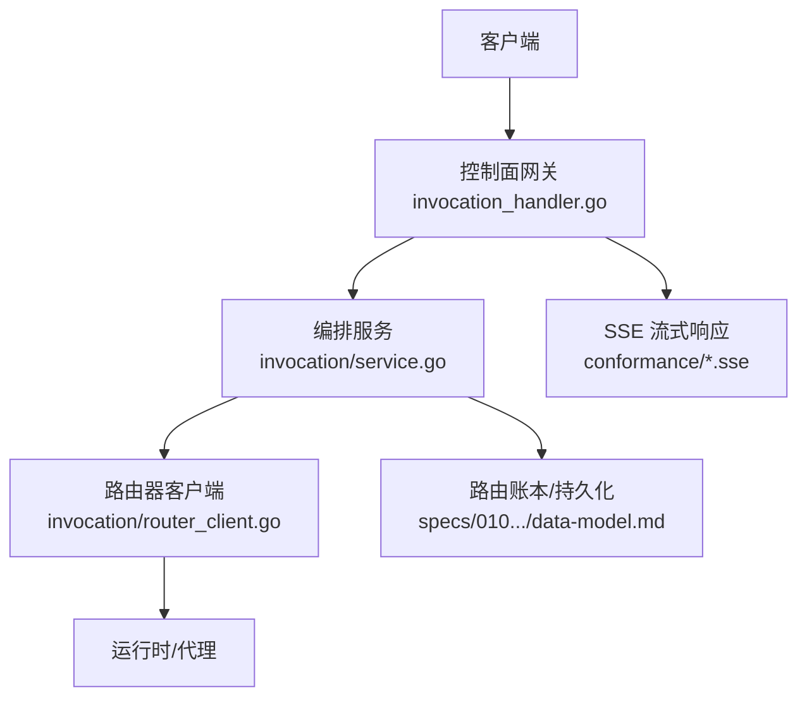
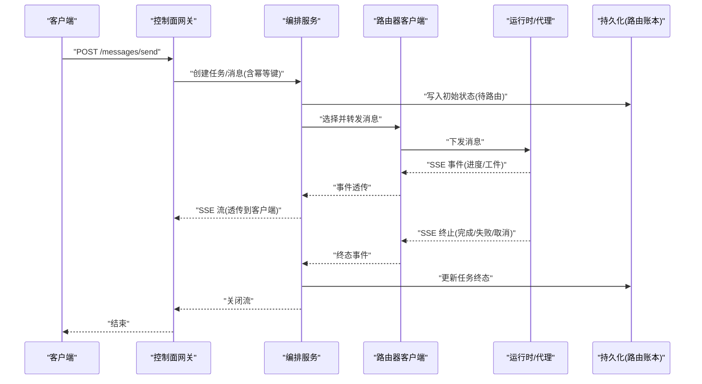
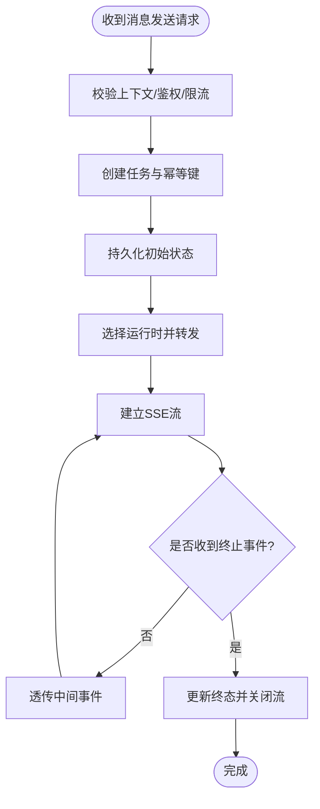
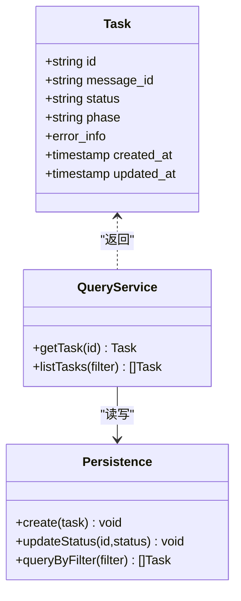
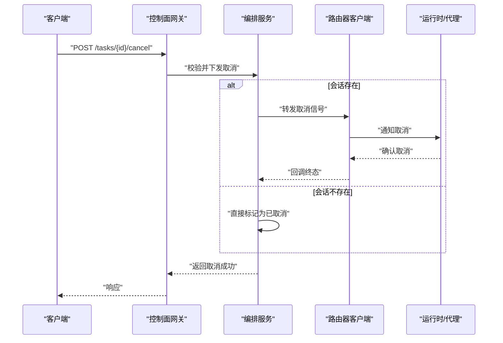
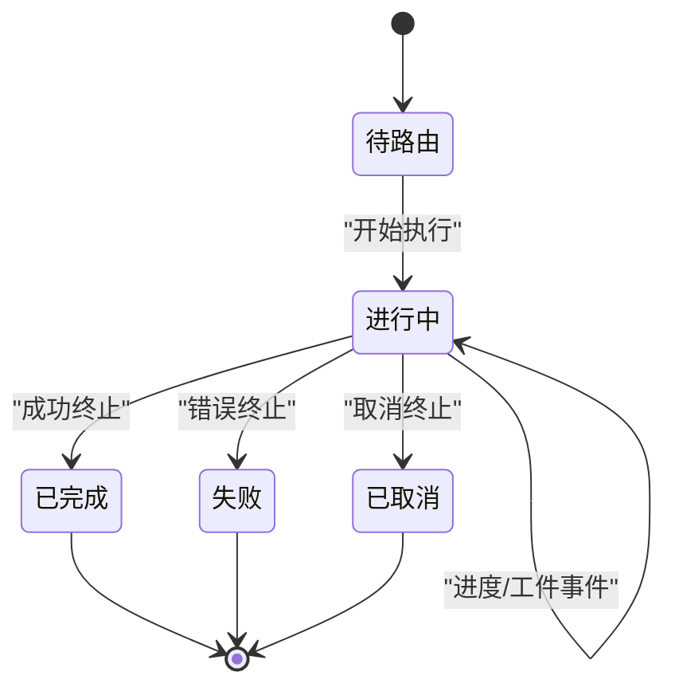
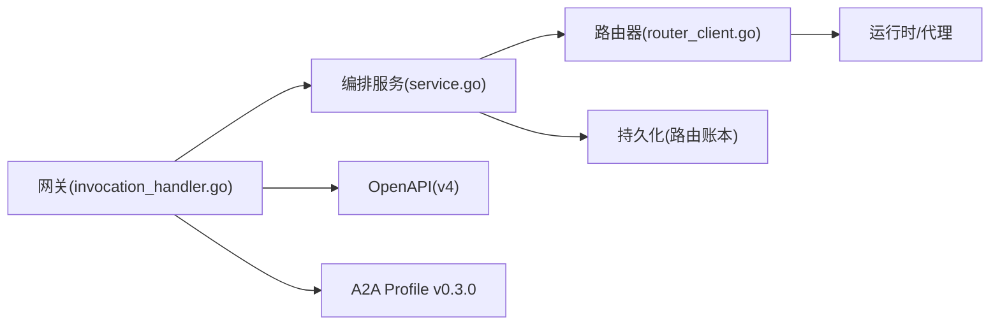

# 消息生命周期管理

<cite>
**本文引用的文件**   
- [apps/control-plane/cmd/control-plane/main.go](file://apps/control-plane/cmd/control-plane/main.go)
- [apps/control-plane/internal/gateway/invocation_handler.go](file://apps/control-plane/internal/gateway/invocation_handler.go)
- [apps/control-plane/internal/invocation/service.go](file://apps/control-plane/internal/invocation/service.go)
- [apps/control-plane/internal/invocation/router_client.go](file://apps/control-plane/internal/invocation/router_client.go)
- [contracts/openapi/control-plane-invocation.v4.yaml](file://contracts/openapi/control-plane-invocation.v4.yaml)
- [contracts/a2a-profile/v0.3.0.json](file://contracts/a2a-profile/v0.3.0.json)
- [contracts/a2a-profile/v0.3.0/conformance/message-send-request.json](file://contracts/a2a-profile/v0.3.0/conformance/message-send-request.json)
- [contracts/a2a-profile/v0.3.0/conformance/tasks-get-request.json](file://contracts/a2a-profile/v0.3.0/conformance/tasks-get-request.json)
- [contracts/a2a-profile/v0.3.0/conformance/tasks-cancel-request.json](file://contracts/a2a-profile/v0.3.0/conformance/tasks-cancel-request.json)
- [contracts/a2a-profile/v0.3.0/conformance/message-stream-request.json](file://contracts/a2a-profile/v0.3.0/conformance/message-stream-request.json)
- [contracts/a2a-profile/v0.3.0/conformance/message-stream-valid.sse](file://contracts/a2a-profile/v0.3.0/conformance/message-stream-valid.sse)
- [contracts/a2a-profile/v0.3.0/conformance/message-stream-event-after-terminal.sse](file://contracts/a2a-profile/v0.3.0/conformance/message-stream-event-after终端.sse)
- [contracts/a2a-profile/v0.3.0/conformance/message-stream-eof-without-terminal.sse](file://contracts/a2a-profile/v0.3.0/conformance/message-stream-eof-without-terminal.sse)
- [contracts/a2a-profile/v0.3.0/conformance/message-stream-context-mismatch.sse](file://contracts/a2a-profile/v0.3.0/conformance/message-stream-context-mismatch.sse)
- [contracts/a2a-profile/v0.3.0/conformance/message-stream-artifact-invalid-append.sse](file://contracts/a2a-profile/v0.3.0/conformance/message-stream-artifact-invalid-append.sse)
- [contracts/a2a-profile/v0.3.0/conformance/message-stream-artifact-after-last-chunk.sse](file://contracts/a2a-profile/v0.3.0/conformance/message-stream-artifact-after-last-chunk.sse)
- [contracts/invocation-runtime/v1/conformance/lifecycle.json](file://contracts/invocation-runtime/v1/conformance/lifecycle.json)
- [specs/010-invocation-routing-ledger/data-model.md](file://specs/010-invocation-routing-ledger/data-model.md)
- [specs/010-invocation-routing-ledger/spec.md](file://specs/010-invocation-routing-ledger/spec.md)
- [specs/012-control-plane-invocation-dispatch/spec.md](file://specs/012-control-plane-invocation-dispatch/spec.md)
- [specs/012-control-plane-invocation-dispatch/data-model.md](file://specs/012-control-plane-invocation-dispatch/data-model.md)
</cite>

## 目录
1. [简介](#简介)
2. [项目结构](#项目结构)
3. [核心组件](#核心组件)
4. [架构总览](#架构总览)
5. [详细组件分析](#详细组件分析)
6. [依赖分析](#依赖分析)
7. [性能考虑](#性能考虑)
8. [故障排查指南](#故障排查指南)
9. [结论](#结论)
10. [附录](#附录)

## 简介
本文件面向 NeKiro 平台的 A2A（Agent-to-Agent）消息生命周期管理，覆盖从消息创建、路由、执行到销毁的完整流程。文档重点包括：
- 状态转换与任务跟踪：消息与任务的创建、推进、完成、失败与取消的状态机与一致性保证。
- 持久化与清理：消息与任务在控制面与运行时的存储策略、索引设计与查询优化。
- 事务与一致性：跨服务调用与落库的事务边界、幂等与最终一致策略。
- 监控与审计：关键事件埋点、SSE 流式输出与审计日志。
- 迁移与兼容：版本演进、向后兼容与回滚策略。

## 项目结构
围绕 A2A 消息生命周期的关键代码位于 control-plane 网关与服务层，以及 contracts 与 specs 中的契约与数据模型定义。

图表来源
- [apps/control-plane/internal/gateway/invocation_handler.go](file://apps/control-plane/internal/gateway/invocation_handler.go)
- [apps/control-plane/internal/invocation/service.go](file://apps/control-plane/internal/invocation/service.go)
- [apps/control-plane/internal/invocation/router_client.go](file://apps/control-plane/internal/invocation/router_client.go)
- [specs/010-invocation-routing-ledger/data-model.md](file://specs/010-invocation-routing-ledger/data-model.md)
- [contracts/a2a-profile/v0.3.0/conformance/message-stream-valid.sse](file://contracts/a2a-profile/v0.3.0/conformance/message-stream-valid.sse)

章节来源
- [apps/control-plane/cmd/control-plane/main.go](file://apps/control-plane/cmd/control-plane/main.go)
- [apps/control-plane/internal/gateway/invocation_handler.go](file://apps/control-plane/internal/gateway/invocation_handler.go)
- [apps/control-plane/internal/invocation/service.go](file://apps/control-plane/internal/invocation/service.go)
- [apps/control-plane/internal/invocation/router_client.go](file://apps/control-plane/internal/invocation/router_client.go)
- [contracts/openapi/control-plane-invocation.v4.yaml](file://contracts/openapi/control-plane-invocation.v4.yaml)

## 核心组件
- 控制面网关（Gateway）
  - 职责：接收 A2A 消息发送、任务查询、取消请求；校验上下文与鉴权；返回同步响应或开启 SSE 流。
  - 关键点：将外部协议映射为内部编排指令，确保幂等键与会话上下文传递。
- 编排服务（Invocation Service）
  - 职责：创建/更新任务记录、维护路由账本、协调与路由器的交互、处理结果回调与状态推进。
  - 关键点：事务边界内写入持久化并触发下游调用；对超时与重试进行治理。
- 路由器客户端（Router Client）
  - 职责：根据能力发现与路由策略选择目标运行时/代理；转发消息与流事件。
  - 关键点：连接池、熔断与退避；携带 trace/correlation 标识。
- 契约与规范（Contracts & Specs）
  - 职责：定义 A2A 消息、任务状态、SSE 事件语义与兼容性约束。
  - 关键点：v0.3.0 行为约定、错误码与字段语义、流终止条件。

章节来源
- [apps/control-plane/internal/gateway/invocation_handler.go](file://apps/control-plane/internal/gateway/invocation_handler.go)
- [apps/control-plane/internal/invocation/service.go](file://apps/control-plane/internal/invocation/service.go)
- [apps/control-plane/internal/invocation/router_client.go](file://apps/control-plane/internal/invocation/router_client.go)
- [contracts/a2a-profile/v0.3.0.json](file://contracts/a2a-profile/v0.3.0.json)
- [contracts/openapi/control-plane-invocation.v4.yaml](file://contracts/openapi/control-plane-invocation.v4.yaml)

## 架构总览
A2A 消息从客户端进入控制面网关，经编排服务落库并路由至运行时，运行时通过 SSE 推送中间结果，最终由编排服务汇总并持久化任务终态。

图表来源
- [apps/control-plane/internal/gateway/invocation_handler.go](file://apps/control-plane/internal/gateway/invocation_handler.go)
- [apps/control-plane/internal/invocation/service.go](file://apps/control-plane/internal/invocation/service.go)
- [apps/control-plane/internal/invocation/router_client.go](file://apps/control-plane/internal/invocation/router_client.go)
- [contracts/a2a-profile/v0.3.0/conformance/message-stream-valid.sse](file://contracts/a2a-profile/v0.3.0/conformance/message-stream-valid.sse)

## 详细组件分析

### 消息发送与任务创建
- 入口：控制面网关接收消息发送请求，解析 A2A 上下文、鉴权与限流。
- 编排：编排服务生成任务 ID 与幂等键，写入路由账本初始状态（如“待路由”）。
- 路由：路由器客户端依据能力与负载策略选择目标运行时，建立 SSE 通道。
- 反馈：网关将运行时 SSE 事件透传给客户端，直至收到终止事件。

图表来源
- [apps/control-plane/internal/gateway/invocation_handler.go](file://apps/control-plane/internal/gateway/invocation_handler.go)
- [apps/control-plane/internal/invocation/service.go](file://apps/control-plane/internal/invocation/service.go)
- [apps/control-plane/internal/invocation/router_client.go](file://apps/control-plane/internal/invocation/router_client.go)
- [contracts/a2a-profile/v0.3.0/conformance/message-stream-valid.sse](file://contracts/a2a-profile/v0.3.0/conformance/message-stream-valid.sse)

章节来源
- [apps/control-plane/internal/gateway/invocation_handler.go](file://apps/control-plane/internal/gateway/invocation_handler.go)
- [apps/control-plane/internal/invocation/service.go](file://apps/control-plane/internal/invocation/service.go)
- [apps/control-plane/internal/invocation/router_client.go](file://apps/control-plane/internal/invocation/router_client.go)
- [contracts/openapi/control-plane-invocation.v4.yaml](file://contracts/openapi/control-plane-invocation.v4.yaml)

### 任务状态跟踪与进度查询
- 状态模型：任务包含唯一 ID、关联消息 ID、当前状态、阶段、错误信息、时间戳等。
- 查询接口：提供按任务 ID 获取详情、按工作区/会话过滤的列表查询。
- 一致性：读路径优先读取本地缓存/副本，必要时回源主库；写路径采用强一致落库。

图表来源
- [specs/010-invocation-routing-ledger/data-model.md](file://specs/010-invocation-routing-ledger/data-model.md)
- [specs/012-control-plane-invocation-dispatch/data-model.md](file://specs/012-control-plane-invocation-dispatch/data-model.md)

章节来源
- [specs/010-invocation-routing-ledger/data-model.md](file://specs/010-invocation-routing-ledger/data-model.md)
- [specs/012-control-plane-invocation-dispatch/data-model.md](file://specs/012-control-plane-invocation-dispatch/data-model.md)

### 取消操作
- 触发：客户端发起取消请求，网关校验权限后交由编排服务处理。
- 传播：编排服务向已建立的运行时会话发送取消信号，若未建立则直接标记任务为“已取消”。
- 幂等：多次取消应幂等，避免重复下发取消信号。

图表来源
- [apps/control-plane/internal/gateway/invocation_handler.go](file://apps/control-plane/internal/gateway/invocation_handler.go)
- [apps/control-plane/internal/invocation/service.go](file://apps/control-plane/internal/invocation/service.go)
- [apps/control-plane/internal/invocation/router_client.go](file://apps/control-plane/internal/invocation/router_client.go)
- [contracts/a2a-profile/v0.3.0/conformance/tasks-cancel-request.json](file://contracts/a2a-profile/v0.3.0/conformance/tasks-cancel-request.json)

章节来源
- [apps/control-plane/internal/gateway/invocation_handler.go](file://apps/control-plane/internal/gateway/invocation_handler.go)
- [apps/control-plane/internal/invocation/service.go](file://apps/control-plane/internal/invocation/service.go)
- [apps/control-plane/internal/invocation/router_client.go](file://apps/control-plane/internal/invocation/router_client.go)
- [contracts/a2a-profile/v0.3.0/conformance/tasks-cancel-request.json](file://contracts/a2a-profile/v0.3.0/conformance/tasks-cancel-request.json)

### 流式事件与终止条件
- 事件类型：进度事件、工件追加、上下文变更、错误事件、终止事件。
- 终止条件：正常完成、失败、取消、上下文不匹配、非法追加、最后分片后继续等。
- 合规性：遵循 v0.3.0 conformance 用例中定义的合法/非法序列。

图表来源
- [contracts/a2a-profile/v0.3.0/conformance/message-stream-valid.sse](file://contracts/a2a-profile/v0.3.0/conformance/message-stream-valid.sse)
- [contracts/a2a-profile/v0.3.0/conformance/message-stream-event-after-terminal.sse](file://contracts/a2a-profile/v0.3.0/conformance/message-stream-event-after终端.sse)
- [contracts/a2a-profile/v0.3.0/conformance/message-stream-eof-without-terminal.sse](file://contracts/a2a-profile/v0.3.0/conformance/message-stream-eof-without-terminal.sse)
- [contracts/a2a-profile/v0.3.0/conformance/message-stream-context-mismatch.sse](file://contracts/a2a-profile/v0.3.0/conformance/message-stream-context-mismatch.sse)
- [contracts/a2a-profile/v0.3.0/conformance/message-stream-artifact-invalid-append.sse](file://contracts/a2a-profile/v0.3.0/conformance/message-stream-artifact-invalid-append.sse)
- [contracts/a2a-profile/v0.3.0/conformance/message-stream-artifact-after-last-chunk.sse](file://contracts/a2a-profile/v0.3.0/conformance/message-stream-artifact-after-last-chunk.sse)

章节来源
- [contracts/a2a-profile/v0.3.0/conformance/message-stream-valid.sse](file://contracts/a2a-profile/v0.3.0/conformance/message-stream-valid.sse)
- [contracts/a2a-profile/v0.3.0/conformance/message-stream-event-after-terminal.sse](file://contracts/a2a-profile/v0.3.0/conformance/message-stream-event-after终端.sse)
- [contracts/a2a-profile/v0.3.0/conformance/message-stream-eof-without-terminal.sse](file://contracts/a2a-profile/v0.3.0/conformance/message-stream-eof-without-terminal.sse)
- [contracts/a2a-profile/v0.3.0/conformance/message-stream-context-mismatch.sse](file://contracts/a2a-profile/v0.3.0/conformance/message-stream-context-mismatch.sse)
- [contracts/a2a-profile/v0.3.0/conformance/message-stream-artifact-invalid-append.sse](file://contracts/a2a-profile/v0.3.0/conformance/message-stream-artifact-invalid-append.sse)
- [contracts/a2a-profile/v0.3.0/conformance/message-stream-artifact-after-last-chunk.sse](file://contracts/a2a-profile/v0.3.0/conformance/message-stream-artifact-after-last-chunk.sse)

### 持久化与清理机制
- 路由账本：记录消息与任务的关键元数据、状态与时间线，作为控制面权威事实源。
- 归档与清理：对已完成/失败/取消的任务按保留策略归档，定期清理过期数据。
- 索引设计：针对任务 ID、工作区、会话、状态、时间范围建立复合索引以优化查询。

章节来源
- [specs/010-invocation-routing-ledger/data-model.md](file://specs/010-invocation-routing-ledger/data-model.md)
- [specs/012-control-plane-invocation-dispatch/data-model.md](file://specs/012-control-plane-invocation-dispatch/data-model.md)

### 事务处理与一致性保证
- 写路径：在事务内完成“任务初始写入 + 路由触发”，失败时回滚，保证原子性。
- 幂等：基于幂等键去重，防止重复创建任务。
- 最终一致：当路由侧不可用时，采用重试与补偿任务，确保最终可观测与可恢复。

章节来源
- [specs/010-invocation-routing-ledger/spec.md](file://specs/010-invocation-routing-ledger/spec.md)
- [specs/012-control-plane-invocation-dispatch/spec.md](file://specs/012-control-plane-invocation-dispatch/spec.md)

### 监控与审计日志
- 关键事件：任务创建、路由选择、事件透传、异常、取消、终止。
- 追踪：贯穿请求的 trace/correlation ID，便于端到端定位。
- 审计：记录敏感操作与状态变更，支持合规与回溯。

章节来源
- [apps/control-plane/internal/gateway/invocation_handler.go](file://apps/control-plane/internal/gateway/invocation_handler.go)
- [apps/control-plane/internal/invocation/service.go](file://apps/control-plane/internal/invocation/service.go)

### 状态迁移与版本兼容性
- 版本策略：A2A Profile v0.3.0 定义的消息与任务语义，保持向后兼容。
- 迁移步骤：新增字段默认值、废弃字段软删除、双写过渡期、灰度切换。
- 回滚：保留旧版 schema 与逻辑分支，快速回切。

章节来源
- [contracts/a2a-profile/v0.3.0.json](file://contracts/a2a-profile/v0.3.0.json)
- [contracts/a2a-profile/v0.3.0/conformance/message-send-request.json](file://contracts/a2a-profile/v0.3.0/conformance/message-send-request.json)
- [contracts/a2a-profile/v0.3.0/conformance/tasks-get-request.json](file://contracts/a2a-profile/v0.3.0/conformance/tasks-get-request.json)
- [contracts/a2a-profile/v0.3.0/conformance/tasks-cancel-request.json](file://contracts/a2a-profile/v0.3.0/conformance/tasks-cancel-request.json)
- [contracts/a2a-profile/v0.3.0/conformance/message-stream-request.json](file://contracts/a2a-profile/v0.3.0/conformance/message-stream-request.json)

## 依赖分析
- 组件耦合
  - 网关依赖编排服务与鉴权/限流中间件。
  - 编排服务依赖路由器客户端与持久化层。
  - 路由器客户端依赖运行时/代理与网络栈。
- 外部依赖
  - OpenAPI 契约驱动接口实现。
  - A2A Profile 与 Conformance 用例指导行为与错误处理。

图表来源
- [apps/control-plane/internal/gateway/invocation_handler.go](file://apps/control-plane/internal/gateway/invocation_handler.go)
- [apps/control-plane/internal/invocation/service.go](file://apps/control-plane/internal/invocation/service.go)
- [apps/control-plane/internal/invocation/router_client.go](file://apps/control-plane/internal/invocation/router_client.go)
- [contracts/openapi/control-plane-invocation.v4.yaml](file://contracts/openapi/control-plane-invocation.v4.yaml)
- [contracts/a2a-profile/v0.3.0.json](file://contracts/a2a-profile/v0.3.0.json)

章节来源
- [apps/control-plane/internal/gateway/invocation_handler.go](file://apps/control-plane/internal/gateway/invocation_handler.go)
- [apps/control-plane/internal/invocation/service.go](file://apps/control-plane/internal/invocation/service.go)
- [apps/control-plane/internal/invocation/router_client.go](file://apps/control-plane/internal/invocation/router_client.go)
- [contracts/openapi/control-plane-invocation.v4.yaml](file://contracts/openapi/control-plane-invocation.v4.yaml)
- [contracts/a2a-profile/v0.3.0.json](file://contracts/a2a-profile/v0.3.0.json)

## 性能考虑
- 连接复用：路由器客户端使用连接池与长连接，减少握手开销。
- 背压与限流：网关与编排层实施令牌桶/漏桶限流，保护后端。
- 批量与分页：列表查询采用游标分页，避免全表扫描。
- 索引优化：针对高频查询维度建立复合索引，减少回表。
- 缓存策略：热点任务元数据短期缓存，失效策略结合版本号与 TTL。

## 故障排查指南
- 常见问题
  - 流提前终止：检查终止事件与 EOF 场景是否符合 v0.3.0 用例。
  - 上下文不匹配：核对 correlation/trace ID 与上下文头。
  - 非法工件追加：验证工件追加顺序与分片完整性。
- 诊断手段
  - 启用链路追踪，收集 trace/correlation ID。
  - 查看路由账本状态与时间线，定位卡住的任务。
  - 回放 SSE 事件，对比 conformance 用例。

章节来源
- [contracts/a2a-profile/v0.3.0/conformance/message-stream-event-after-terminal.sse](file://contracts/a2a-profile/v0.3.0/conformance/message-stream-event-after终端.sse)
- [contracts/a2a-profile/v0.3.0/conformance/message-stream-eof-without-terminal.sse](file://contracts/a2a-profile/v0.3.0/conformance/message-stream-eof-without-terminal.sse)
- [contracts/a2a-profile/v0.3.0/conformance/message-stream-context-mismatch.sse](file://contracts/a2a-profile/v0.3.0/conformance/message-stream-context-mismatch.sse)
- [contracts/a2a-profile/v0.3.0/conformance/message-stream-artifact-invalid-append.sse](file://contracts/a2a-profile/v0.3.0/conformance/message-stream-artifact-invalid-append.sse)
- [contracts/a2a-profile/v0.3.0/conformance/message-stream-artifact-after-last-chunk.sse](file://contracts/a2a-profile/v0.3.0/conformance/message-stream-artifact-after-last-chunk.sse)

## 结论
NeKiro 平台通过控制面网关与编排服务协同，结合路由账本与 A2A Profile v0.3.0 的行为约定，实现了 A2A 消息从创建到销毁的可靠生命周期管理。通过明确的状态机、幂等与事务保障、完善的 SSE 流式传输与合规用例，系统具备高可用、可观测与可扩展的能力。后续可在索引与缓存策略上持续优化，进一步提升吞吐与延迟表现。

## 附录
- 参考契约与用例
  - A2A Profile v0.3.0 与 conformance 用例用于对齐消息与任务语义。
  - OpenAPI v4 定义控制面接口。
  - 运行时生命周期契约用于统一运行时行为。

章节来源
- [contracts/a2a-profile/v0.3.0.json](file://contracts/a2a-profile/v0.3.0.json)
- [contracts/openapi/control-plane-invocation.v4.yaml](file://contracts/openapi/control-plane-invocation.v4.yaml)
- [contracts/invocation-runtime/v1/conformance/lifecycle.json](file://contracts/invocation-runtime/v1/conformance/lifecycle.json)