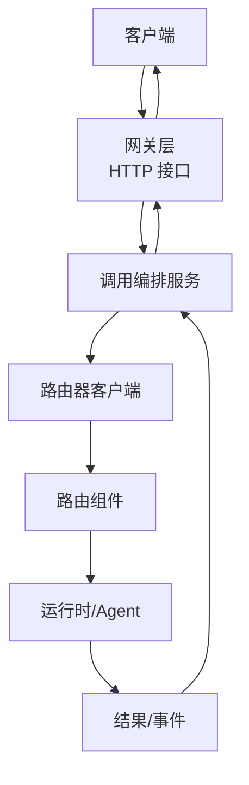
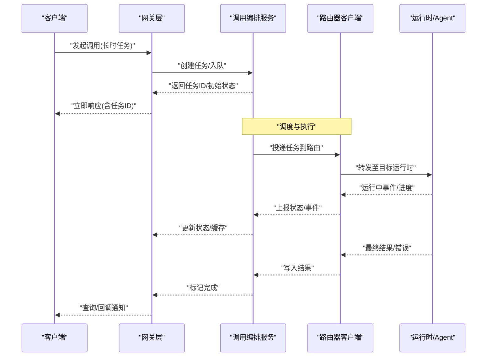
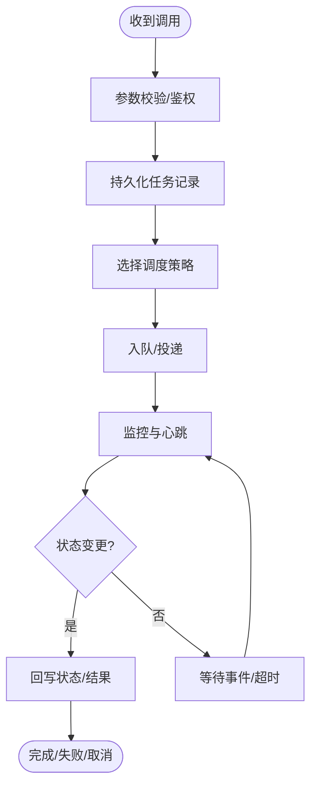
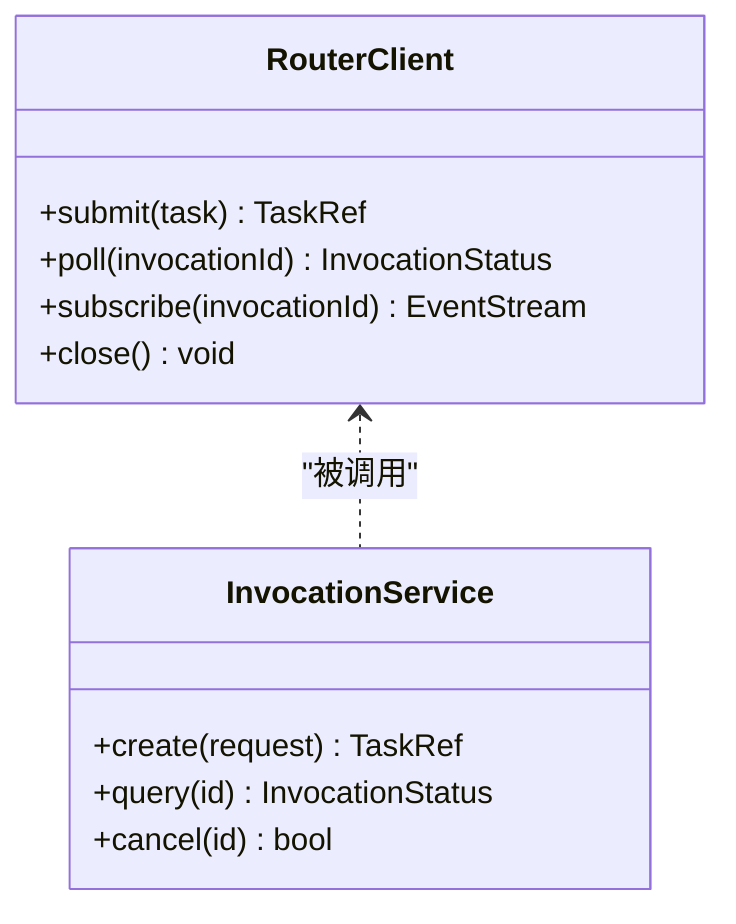
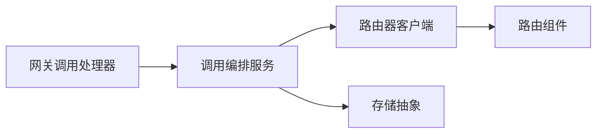

# 异步调用流程

<cite>
**本文引用的文件**   
- [apps/control-plane/cmd/control-plane/main.go](file://apps/control-plane/cmd/control-plane/main.go)
- [apps/control-plane/internal/gateway/invocation_handler.go](file://apps/control-plane/internal/gateway/invocation_handler.go)
- [apps/control-plane/internal/invocation/service.go](file://apps/control-plane/internal/invocation/service.go)
- [apps/control-plane/internal/invocation/router_client.go](file://apps/control-plane/internal/invocation/router_client.go)
- [contracts/openapi/control-plane-invocation.v4.yaml](file://contracts/openapi/control-plane-invocation.v4.yaml)
- [contracts/runtime_contracts.go](file://contracts/runtime_contracts.go)
- [contracts/runtime_contracts_validation.go](file://contracts/runtime_contracts_validation.go)
- [specs/012-control-plane-invocation-dispatch/spec.md](file://specs/012-control-plane-invocation-dispatch/spec.md)
- [specs/012-control-plane-invocation-dispatch/data-model.md](file://specs/012-control-plane-invocation-dispatch/data-model.md)
- [specs/012-control-plane-invocation-dispatch/tasks.md](file://specs/012-control-plane-invocation-dispatch/tasks.md)
</cite>

## 目录
1. [简介](#简介)
2. [项目结构](#项目结构)
3. [核心组件](#核心组件)
4. [架构总览](#架构总览)
5. [详细组件分析](#详细组件分析)
6. [依赖分析](#依赖分析)
7. [性能考虑](#性能考虑)
8. [故障排查指南](#故障排查指南)
9. [结论](#结论)
10. [附录](#附录)

## 简介
本文件面向 NeKiro 平台的“异步调用流程”，聚焦长时任务的异步执行机制与结果回传路径，覆盖任务调度、执行监控、状态同步、生命周期管理、重试与故障恢复、队列设计与并发控制、回调通知与事件驱动模式，并提供开发指南与调试技巧。文档以 control-plane 的网关层与调用编排服务为核心，结合 OpenAPI 契约与运行时契约进行说明。

## 项目结构
围绕异步调用的关键代码位于 control-plane 应用内：
- 入口与启动：控制平面主程序负责加载配置、初始化服务并启动 HTTP 网关。
- 网关层：暴露对外 API（包括调用发起接口），解析请求、鉴权、路由到内部服务。
- 调用编排服务：封装任务创建、持久化、调度与状态同步逻辑。
- 路由器客户端：与下游路由组件交互，完成实际的任务投递与结果拉取。
- 契约定义：OpenAPI 与运行时契约定义了调用协议、事件模型与错误语义。

图表来源
- [apps/control-plane/cmd/control-plane/main.go](file://apps/control-plane/cmd/control-plane/main.go)
- [apps/control-plane/internal/gateway/invocation_handler.go](file://apps/control-plane/internal/gateway/invocation_handler.go)
- [apps/control-plane/internal/invocation/service.go](file://apps/control-plane/internal/invocation/service.go)
- [apps/control-plane/internal/invocation/router_client.go](file://apps/control-plane/internal/invocation/router_client.go)

章节来源
- [apps/control-plane/cmd/control-plane/main.go](file://apps/control-plane/cmd/control-plane/main.go)
- [apps/control-plane/internal/gateway/invocation_handler.go](file://apps/control-plane/internal/gateway/invocation_handler.go)
- [apps/control-plane/internal/invocation/service.go](file://apps/control-plane/internal/invocation/service.go)
- [apps/control-plane/internal/invocation/router_client.go](file://apps/control-plane/internal/invocation/router_client.go)

## 核心组件
- 网关层（调用处理器）
  - 职责：接收调用请求、参数校验、鉴权、上下文传播、调用编排服务调用、响应组装。
  - 关键点：对长时任务采用“立即返回 + 轮询/事件”的模式；维护关联 ID 用于后续查询与回调。
- 调用编排服务
  - 职责：任务建模、持久化、调度策略选择、状态机推进、重试与补偿、结果聚合与回写。
  - 关键点：保证幂等性、可观测性与一致性；提供查询与取消能力。
- 路由器客户端
  - 职责：与路由组件通信，提交任务、获取运行态信息、订阅结果流或拉取最终结果。
  - 关键点：超时、重试、熔断与降级；连接池与并发限制。
- 契约与验证
  - 职责：OpenAPI 契约约束接口形态；运行时契约定义事件与结果模型；验证器确保数据合规。
  - 关键点：版本兼容、字段必填、枚举值、错误码规范。

章节来源
- [apps/control-plane/internal/gateway/invocation_handler.go](file://apps/control-plane/internal/gateway/invocation_handler.go)
- [apps/control-plane/internal/invocation/service.go](file://apps/control-plane/internal/invocation/service.go)
- [apps/control-plane/internal/invocation/router_client.go](file://apps/control-plane/internal/invocation/router_client.go)
- [contracts/openapi/control-plane-invocation.v4.yaml](file://contracts/openapi/control-plane-invocation.v4.yaml)
- [contracts/runtime_contracts.go](file://contracts/runtime_contracts.go)
- [contracts/runtime_contracts_validation.go](file://contracts/runtime_contracts_validation.go)

## 架构总览
下图展示了从客户端发起调用到结果回传的端到端流程，以及状态同步与事件驱动的交互方式。

图表来源
- [apps/control-plane/internal/gateway/invocation_handler.go](file://apps/control-plane/internal/gateway/invocation_handler.go)
- [apps/control-plane/internal/invocation/service.go](file://apps/control-plane/internal/invocation/service.go)
- [apps/control-plane/internal/invocation/router_client.go](file://apps/control-plane/internal/invocation/router_client.go)
- [contracts/openapi/control-plane-invocation.v4.yaml](file://contracts/openapi/control-plane-invocation.v4.yaml)

## 详细组件分析

### 网关层：调用处理器
- 功能要点
  - 解析请求体、校验必填字段、绑定上下文（如工作区、身份）。
  - 将调用委托给编排服务，生成唯一任务标识，返回“已接受”响应。
  - 支持查询接口：按任务ID获取当前状态与部分结果摘要。
- 设计模式
  - 适配器：将外部 HTTP 请求适配为内部服务调用。
  - 中间件：鉴权、限流、追踪贯穿请求链路。
- 错误处理
  - 统一错误码与消息结构，区分业务错误与系统错误。
  - 对上游不可用场景返回可重试错误码，便于客户端退避。

章节来源
- [apps/control-plane/internal/gateway/invocation_handler.go](file://apps/control-plane/internal/gateway/invocation_handler.go)
- [contracts/openapi/control-plane-invocation.v4.yaml](file://contracts/openapi/control-plane-invocation.v4.yaml)

### 调用编排服务：任务调度与状态同步
- 功能要点
  - 任务建模：包含任务元数据、期望结果、超时、重试策略、优先级等。
  - 持久化：落库保存任务记录，保证失败可恢复。
  - 调度：根据策略选择执行器（本地队列/远程路由），并设置超时与心跳。
  - 状态机：Pending → Dispatched → Running → Completed/Failed/Canceled。
  - 结果回写：汇总运行时事件与最终结果，更新任务状态。
- 并发控制
  - 基于令牌桶或信号量限制并发度，避免过载。
  - 使用分片队列或分区键实现水平扩展。
- 幂等与去重
  - 通过幂等键避免重复投递与重复处理。
- 可观测性
  - 埋点指标：入队延迟、执行时长、失败率、重试次数。
  - 追踪ID贯穿网关→编排→路由→运行时。

图表来源
- [apps/control-plane/internal/invocation/service.go](file://apps/control-plane/internal/invocation/service.go)
- [specs/012-control-plane-invocation-dispatch/data-model.md](file://specs/012-control-plane-invocation-dispatch/data-model.md)
- [specs/012-control-plane-invocation-dispatch/tasks.md](file://specs/012-control-plane-invocation-dispatch/tasks.md)

章节来源
- [apps/control-plane/internal/invocation/service.go](file://apps/control-plane/internal/invocation/service.go)
- [specs/012-control-plane-invocation-dispatch/spec.md](file://specs/012-control-plane-invocation-dispatch/spec.md)
- [specs/012-control-plane-invocation-dispatch/data-model.md](file://specs/012-control-plane-invocation-dispatch/data-model.md)
- [specs/012-control-plane-invocation-dispatch/tasks.md](file://specs/012-control-plane-invocation-dispatch/tasks.md)

### 路由器客户端：与下游路由交互
- 功能要点
  - 任务投递：将任务转交给路由组件，附带上下文与追踪信息。
  - 结果拉取/订阅：支持拉取模式与事件推送模式。
  - 容错：重试、退避、熔断、超时与降级。
- 并发与资源
  - 连接池复用、请求级超时、批量合并。
  - 背压：当下游慢时主动限流，保护上游稳定。

图表来源
- [apps/control-plane/internal/invocation/router_client.go](file://apps/control-plane/internal/invocation/router_client.go)
- [apps/control-plane/internal/invocation/service.go](file://apps/control-plane/internal/invocation/service.go)

章节来源
- [apps/control-plane/internal/invocation/router_client.go](file://apps/control-plane/internal/invocation/router_client.go)

### 契约与验证：接口与事件模型
- OpenAPI 契约
  - 定义调用发起、查询、取消等接口的请求/响应结构与状态码。
  - 明确幂等键、任务ID、追踪ID等关键字段。
- 运行时契约
  - 定义事件类型、结果流格式、错误模型与兼容性规则。
  - 提供验证器，确保事件与结果符合约定。
- 版本策略
  - 向后兼容优先，弃用字段需保留过渡期。

章节来源
- [contracts/openapi/control-plane-invocation.v4.yaml](file://contracts/openapi/control-plane-invocation.v4.yaml)
- [contracts/runtime_contracts.go](file://contracts/runtime_contracts.go)
- [contracts/runtime_contracts_validation.go](file://contracts/runtime_contracts_validation.go)

## 依赖分析
- 组件耦合
  - 网关层仅依赖编排服务接口，保持低耦合。
  - 编排服务依赖路由器客户端与存储抽象，屏蔽具体实现。
- 外部依赖
  - 数据库/消息队列/缓存（由存储与队列抽象承载）。
  - 路由组件（通过路由器客户端访问）。
- 潜在循环依赖
  - 通过接口隔离与分层避免循环引用。

图表来源
- [apps/control-plane/internal/gateway/invocation_handler.go](file://apps/control-plane/internal/gateway/invocation_handler.go)
- [apps/control-plane/internal/invocation/service.go](file://apps/control-plane/internal/invocation/service.go)
- [apps/control-plane/internal/invocation/router_client.go](file://apps/control-plane/internal/invocation/router_client.go)

章节来源
- [apps/control-plane/internal/gateway/invocation_handler.go](file://apps/control-plane/internal/gateway/invocation_handler.go)
- [apps/control-plane/internal/invocation/service.go](file://apps/control-plane/internal/invocation/service.go)
- [apps/control-plane/internal/invocation/router_client.go](file://apps/control-plane/internal/invocation/router_client.go)

## 性能考虑
- 队列与并发
  - 使用有界队列与令牌桶控制并发，防止雪崩。
  - 分片/分区提升吞吐与可扩展性。
- 超时与退避
  - 多级超时：网关→编排→路由→运行时。
  - 指数退避+抖动，避免集中重试风暴。
- 结果聚合
  - 增量事件与最终结果分离，减少大对象传输。
- 可观测性
  - 指标：入队/出队速率、P99 延迟、失败率、重试次数。
  - 追踪：跨组件 TraceID 串联。

[本节为通用指导，不直接分析具体文件]

## 故障排查指南
- 常见问题定位
  - 任务未入队：检查网关日志与参数校验错误。
  - 任务卡住：查看心跳与状态更新是否到达。
  - 结果丢失：核对事件顺序与幂等键。
  - 重试风暴：观察退避策略与下游健康状态。
- 诊断手段
  - 启用详细日志与追踪，收集 TraceID。
  - 查询任务状态与最近事件，确认状态机推进。
  - 回放事件与结果，复现问题。
- 恢复策略
  - 失败任务自动重试与死信队列。
  - 人工干预：强制取消、重新投递、补偿写入。

章节来源
- [apps/control-plane/internal/gateway/invocation_handler.go](file://apps/control-plane/internal/gateway/invocation_handler.go)
- [apps/control-plane/internal/invocation/service.go](file://apps/control-plane/internal/invocation/service.go)
- [contracts/runtime_contracts_validation.go](file://contracts/runtime_contracts_validation.go)

## 结论
NeKiro 的异步调用流程以网关层为入口、编排服务为核心、路由器客户端为桥接，结合 OpenAPI 与运行时契约，形成高可靠、可扩展、可观测的长时任务执行体系。通过状态机、重试与退避、幂等与去重、事件驱动与回调通知，平台在复杂分布式环境下仍能提供一致的用户体验与运维可控性。

[本节为总结，不直接分析具体文件]

## 附录

### 开发指南（异步调用）
- 发起长时任务
  - 调用网关接口，携带必要上下文与幂等键。
  - 保存返回的任务ID，用于后续查询与回调。
- 查询与取消
  - 使用任务ID查询状态与摘要。
  - 支持取消不可逆任务时的优雅终止。
- 回调与事件
  - 订阅事件流或配置回调地址，接收进度与结果。
  - 处理事件乱序与重复，确保幂等。
- 重试与容错
  - 客户端侧实现指数退避与最大重试次数。
  - 服务端侧配置重试策略与死信队列。
- 可观测性
  - 注入 TraceID，采集关键指标。
  - 建立告警：长时间无进展、失败率突增等。

章节来源
- [contracts/openapi/control-plane-invocation.v4.yaml](file://contracts/openapi/control-plane-invocation.v4.yaml)
- [contracts/runtime_contracts.go](file://contracts/runtime_contracts.go)
- [contracts/runtime_contracts_validation.go](file://contracts/runtime_contracts_validation.go)

### 调试技巧
- 本地联调
  - 使用最小数据集构造用例，逐步放大复杂度。
  - 开启详细日志与追踪，对比预期状态机推进。
- 压测与回归
  - 模拟下游慢/失败场景，验证退避与熔断。
  - 回放历史事件，确保修复有效且不引入回归。
- 线上排障
  - 基于 TraceID 拉取全链路日志。
  - 检查任务状态、最近事件与重试计数。
  - 必要时人工介入：取消、重投、补偿。

章节来源
- [apps/control-plane/internal/gateway/invocation_handler.go](file://apps/control-plane/internal/gateway/invocation_handler.go)
- [apps/control-plane/internal/invocation/service.go](file://apps/control-plane/internal/invocation/service.go)
- [apps/control-plane/internal/invocation/router_client.go](file://apps/control-plane/internal/invocation/router_client.go)