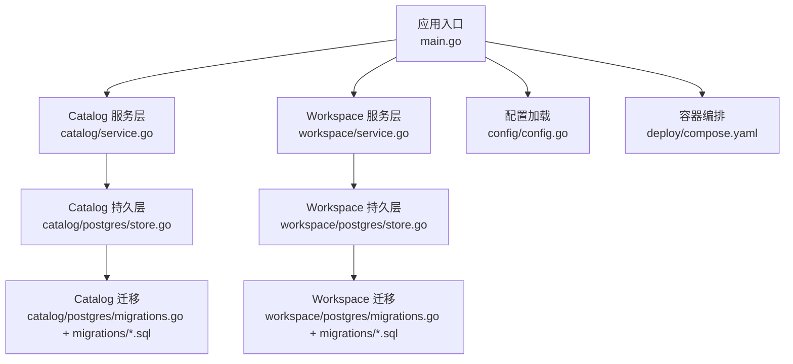
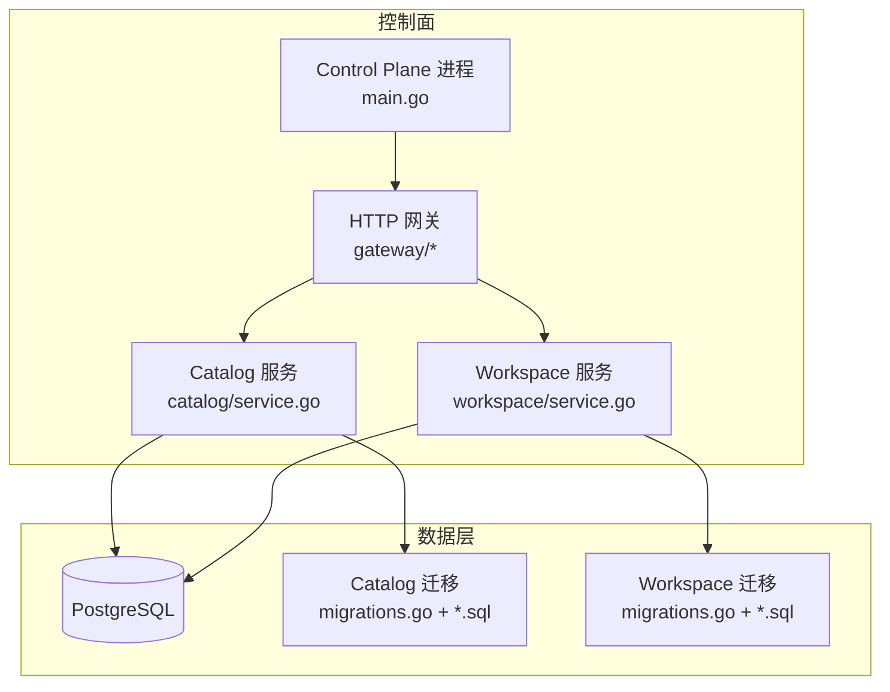
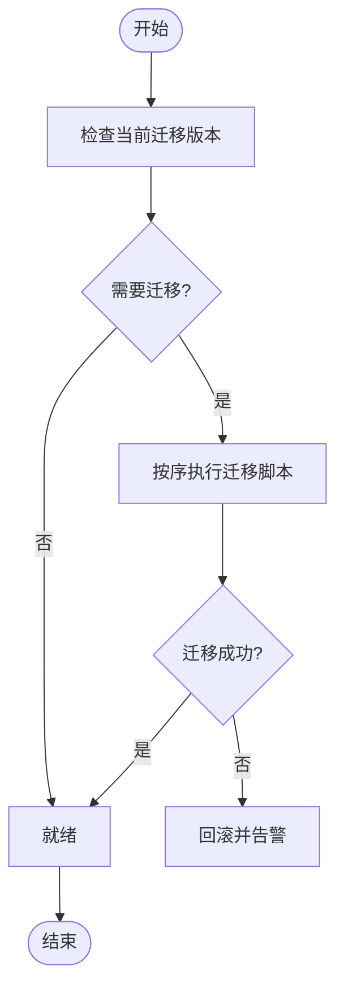
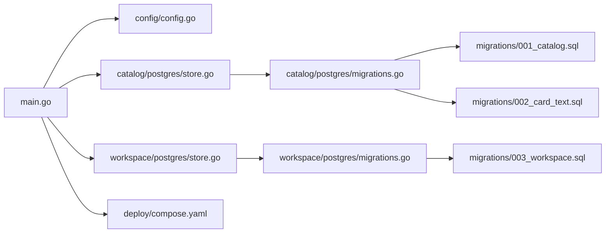

# 数据一致性

<cite>
**本文引用的文件**   
- [apps/control-plane/cmd/control-plane/main.go](file://apps/control-plane/cmd/control-plane/main.go)
- [apps/control-plane/internal/catalog/postgres/migrations.go](file://apps/control-plane/internal/catalog/postgres/migrations.go)
- [apps/control-plane/internal/catalog/postgres/store.go](file://apps/control-plane/internal/catalog/postgres/store.go)
- [apps/control-plane/internal/workspace/postgres/migrations.go](file://apps/control-plane/internal/workspace/postgres/migrations.go)
- [apps/control-plane/internal/workspace/postgres/store.go](file://apps/control-plane/internal/workspace/postgres/store.go)
- [apps/control-plane/migrations/001_catalog.sql](file://apps/control-plane/migrations/001_catalog.sql)
- [apps/control-plane/migrations/002_card_text.sql](file://apps/control-plane/migrations/002_card_text.sql)
- [apps/control-plane/migrations/003_workspace.sql](file://apps/control-plane/migrations/003_workspace.sql)
- [apps/control-plane/internal/config/config.go](file://apps/control-plane/internal/config/config.go)
- [deploy/compose.yaml](file://deploy/compose.yaml)
- [docs/decisions/0004-catalog-persistence-and-consistency.md](file://docs/decisions/0004-catalog-persistence-and-consistency.md)
</cite>

## 目录
1. [简介](#简介)
2. [项目结构](#项目结构)
3. [核心组件](#核心组件)
4. [架构总览](#架构总览)
5. [详细组件分析](#详细组件分析)
6. [依赖关系分析](#依赖关系分析)
7. [性能考虑](#性能考虑)
8. [故障排查指南](#故障排查指南)
9. [结论](#结论)
10. [附录](#附录)

## 简介
本文件面向 NeKiro 平台在分布式环境下的数据一致性与事务管理，覆盖数据库连接池、查询优化与索引策略、数据迁移流程与版本兼容、缓存策略、读写分离、备份恢复、完整性约束与业务规则验证，以及问题排查与性能调优建议。文档以控制面（Control Plane）的目录与服务为切入点，结合决策文档与部署配置进行说明。

## 项目结构
NeKiro 的控制面位于 apps/control-plane，包含：
- 入口程序：cmd/control-plane/main.go
- 领域服务：catalog、workspace、gateway、invocation 等
- 持久化实现：postgres 子包提供迁移与存储实现
- 迁移脚本：migrations 目录存放 SQL 迁移
- 配置：internal/config/config.go
- 部署：deploy/compose.yaml

图表来源
- [apps/control-plane/cmd/control-plane/main.go](file://apps/control-plane/cmd/control-plane/main.go)
- [apps/control-plane/internal/catalog/postgres/store.go](file://apps/control-plane/internal/catalog/postgres/store.go)
- [apps/control-plane/internal/workspace/postgres/store.go](file://apps/control-plane/internal/workspace/postgres/store.go)
- [apps/control-plane/internal/catalog/postgres/migrations.go](file://apps/control-plane/internal/catalog/postgres/migrations.go)
- [apps/control-plane/internal/workspace/postgres/migrations.go](file://apps/control-plane/internal/workspace/postgres/migrations.go)
- [apps/control-plane/migrations/001_catalog.sql](file://apps/control-plane/migrations/001_catalog.sql)
- [apps/control-plane/migrations/002_card_text.sql](file://apps/control-plane/migrations/002_card_text.sql)
- [apps/control-plane/migrations/003_workspace.sql](file://apps/control-plane/migrations/003_workspace.sql)
- [apps/control-plane/internal/config/config.go](file://apps/control-plane/internal/config/config.go)
- [deploy/compose.yaml](file://deploy/compose.yaml)

章节来源
- [apps/control-plane/cmd/control-plane/main.go](file://apps/control-plane/cmd/control-plane/main.go)
- [apps/control-plane/internal/config/config.go](file://apps/control-plane/internal/config/config.go)
- [deploy/compose.yaml](file://deploy/compose.yaml)

## 核心组件
- 应用入口与控制流
  - 负责初始化配置、启动 HTTP 网关、注册路由、拉起后台任务（如健康检查、指标上报等）。
  - 通过配置模块加载数据库连接参数、迁移开关、日志级别等。
- Catalog 领域
  - 服务层封装业务用例；持久层使用 Postgres 存储，并通过迁移模块保证 schema 演进。
- Workspace 领域
  - 服务层封装工作区相关用例；持久层同样基于 Postgres，具备独立迁移与存储实现。
- 迁移系统
  - 每个领域维护独立的迁移文件与迁移执行器，按版本号顺序执行，确保向后兼容。
- 配置与部署
  - 配置集中管理；compose 定义数据库与服务的运行拓扑。

章节来源
- [apps/control-plane/cmd/control-plane/main.go](file://apps/control-plane/cmd/control-plane/main.go)
- [apps/control-plane/internal/catalog/postgres/store.go](file://apps/control-plane/internal/catalog/postgres/store.go)
- [apps/control-plane/internal/workspace/postgres/store.go](file://apps/control-plane/internal/workspace/postgres/store.go)
- [apps/control-plane/internal/catalog/postgres/migrations.go](file://apps/control-plane/internal/catalog/postgres/migrations.go)
- [apps/control-plane/internal/workspace/postgres/migrations.go](file://apps/control-plane/internal/workspace/postgres/migrations.go)
- [apps/control-plane/internal/config/config.go](file://apps/control-plane/internal/config/config.go)

## 架构总览
下图展示控制面在单机或容器编排中的典型部署形态，强调数据路径与一致性边界。

图表来源
- [apps/control-plane/cmd/control-plane/main.go](file://apps/control-plane/cmd/control-plane/main.go)
- [apps/control-plane/internal/catalog/postgres/store.go](file://apps/control-plane/internal/catalog/postgres/store.go)
- [apps/control-plane/internal/workspace/postgres/store.go](file://apps/control-plane/internal/workspace/postgres/store.go)
- [apps/control-plane/internal/catalog/postgres/migrations.go](file://apps/control-plane/internal/catalog/postgres/migrations.go)
- [apps/control-plane/internal/workspace/postgres/migrations.go](file://apps/control-plane/internal/workspace/postgres/migrations.go)
- [apps/control-plane/migrations/001_catalog.sql](file://apps/control-plane/migrations/001_catalog.sql)
- [apps/control-plane/migrations/002_card_text.sql](file://apps/control-plane/migrations/002_card_text.sql)
- [apps/control-plane/migrations/003_workspace.sql](file://apps/control-plane/migrations/003_workspace.sql)

## 详细组件分析

### 数据库连接与事务
- 连接管理
  - 由配置模块注入数据库连接参数，服务启动时建立连接池并复用。
  - 连接池大小、空闲超时、最大生命周期等参数应在配置中显式声明，避免默认值导致资源争用或泄漏。
- 事务边界
  - 写操作应包裹在事务中，遵循“最小事务”原则，减少锁持有时间。
  - 跨表更新需保证原子性；失败时回滚，避免部分提交导致的脏读。
- 并发与隔离
  - 根据业务选择合适的事务隔离级别；对热点行采用乐观锁或版本号字段降低冲突。
  - 长事务应避免，防止阻塞清理与复制延迟。

章节来源
- [apps/control-plane/internal/config/config.go](file://apps/control-plane/internal/config/config.go)
- [apps/control-plane/internal/catalog/postgres/store.go](file://apps/control-plane/internal/catalog/postgres/store.go)
- [apps/control-plane/internal/workspace/postgres/store.go](file://apps/control-plane/internal/workspace/postgres/store.go)

### 查询优化与索引策略
- 索引设计
  - 针对高频过滤条件、排序与连接键建立索引；避免过度索引影响写入性能。
  - 复合索引顺序应与常见查询谓词匹配。
- 查询模式
  - 优先使用覆盖索引减少回表；分页采用游标或基于索引的 keyset 分页替代 OFFSET。
  - 避免 SELECT *，仅拉取必要列，降低网络与序列化开销。
- 统计信息与计划
  - 定期 ANALYZE 更新统计信息；对复杂查询使用 EXPLAIN 分析执行计划，必要时引入物化视图或中间表。

章节来源
- [apps/control-plane/internal/catalog/postgres/store.go](file://apps/control-plane/internal/catalog/postgres/store.go)
- [apps/control-plane/internal/workspace/postgres/store.go](file://apps/control-plane/internal/workspace/postgres/store.go)

### 数据迁移与版本兼容
- 迁移组织
  - 每个领域维护独立迁移文件与执行器，按数字前缀顺序执行，确保幂等与可重入。
  - 迁移脚本与代码变更协同发布，禁止在未迁移的环境中上线新代码。
- 兼容性策略
  - 向前兼容：新增字段默认值、允许空值；删除字段先废弃再移除。
  - 向后兼容：旧版本客户端仍可读取新结构；接口变更通过版本化 API 处理。
- 回滚方案
  - 提供反向迁移或降级路径；灰度发布期间保留双写或影子库校验。

图表来源
- [apps/control-plane/internal/catalog/postgres/migrations.go](file://apps/control-plane/internal/catalog/postgres/migrations.go)
- [apps/control-plane/internal/workspace/postgres/migrations.go](file://apps/control-plane/internal/workspace/postgres/migrations.go)
- [apps/control-plane/migrations/001_catalog.sql](file://apps/control-plane/migrations/001_catalog.sql)
- [apps/control-plane/migrations/002_card_text.sql](file://apps/control-plane/migrations/002_card_text.sql)
- [apps/control-plane/migrations/003_workspace.sql](file://apps/control-plane/migrations/003_workspace.sql)

章节来源
- [apps/control-plane/internal/catalog/postgres/migrations.go](file://apps/control-plane/internal/catalog/postgres/migrations.go)
- [apps/control-plane/internal/workspace/postgres/migrations.go](file://apps/control-plane/internal/workspace/postgres/migrations.go)
- [apps/control-plane/migrations/001_catalog.sql](file://apps/control-plane/migrations/001_catalog.sql)
- [apps/control-plane/migrations/002_card_text.sql](file://apps/control-plane/migrations/002_card_text.sql)
- [apps/control-plane/migrations/003_workspace.sql](file://apps/control-plane/migrations/003_workspace.sql)

### 缓存策略
- 分层缓存
  - 本地内存缓存用于热点只读数据，设置合理 TTL 与失效策略。
  - 分布式缓存用于跨实例共享，注意缓存穿透、雪崩与击穿防护。
- 一致性保障
  - 采用 Cache-Aside 模式，先更新数据库再删除缓存；必要时加锁避免并发重建。
  - 对强一致场景禁用缓存或采用短 TTL+重试补偿。
- 监控与观测
  - 记录命中率、延迟、错误率；异常时快速降级到直连数据库。

[本节为通用指导，不直接分析具体文件]

### 读写分离
- 架构模式
  - 主库承担写与强一致读；从库承担读放大场景，通过复制保持最终一致。
- 路由策略
  - 按请求类型或标签将读请求路由至从库；写请求强制走主库。
- 一致性权衡
  - 明确业务对新鲜度的要求；对关键路径使用主库或增加一致性标记。

[本节为通用指导，不直接分析具体文件]

### 备份与恢复
- 备份策略
  - 全量+增量组合；异地多副本；加密与访问控制。
- 恢复演练
  - 定期演练恢复流程，验证 RPO/RTO 目标；记录恢复步骤与回滚预案。
- 迁移期保护
  - 大表变更前后分别备份；灰度阶段保留快照以便快速回退。

[本节为通用指导，不直接分析具体文件]

### 数据完整性约束与业务规则验证
- 约束
  - 利用主键、唯一键、外键、非空、检查约束保证域内与域间一致性。
- 业务规则
  - 在服务层进行前置校验与后置断言；对幂等键与去重逻辑进行保护。
- 审计与追踪
  - 记录关键变更事件，便于回溯与合规审计。

[本节为通用指导，不直接分析具体文件]

## 依赖关系分析
控制面各模块之间的依赖关系如下：

图表来源
- [apps/control-plane/cmd/control-plane/main.go](file://apps/control-plane/cmd/control-plane/main.go)
- [apps/control-plane/internal/config/config.go](file://apps/control-plane/internal/config/config.go)
- [apps/control-plane/internal/catalog/postgres/store.go](file://apps/control-plane/internal/catalog/postgres/store.go)
- [apps/control-plane/internal/workspace/postgres/store.go](file://apps/control-plane/internal/workspace/postgres/store.go)
- [apps/control-plane/internal/catalog/postgres/migrations.go](file://apps/control-plane/internal/catalog/postgres/migrations.go)
- [apps/control-plane/internal/workspace/postgres/migrations.go](file://apps/control-plane/internal/workspace/postgres/migrations.go)
- [apps/control-plane/migrations/001_catalog.sql](file://apps/control-plane/migrations/001_catalog.sql)
- [apps/control-plane/migrations/002_card_text.sql](file://apps/control-plane/migrations/002_card_text.sql)
- [apps/control-plane/migrations/003_workspace.sql](file://apps/control-plane/migrations/003_workspace.sql)
- [deploy/compose.yaml](file://deploy/compose.yaml)

章节来源
- [apps/control-plane/cmd/control-plane/main.go](file://apps/control-plane/cmd/control-plane/main.go)
- [apps/control-plane/internal/config/config.go](file://apps/control-plane/internal/config/config.go)
- [apps/control-plane/internal/catalog/postgres/store.go](file://apps/control-plane/internal/catalog/postgres/store.go)
- [apps/control-plane/internal/workspace/postgres/store.go](file://apps/control-plane/internal/workspace/postgres/store.go)
- [apps/control-plane/internal/catalog/postgres/migrations.go](file://apps/control-plane/internal/catalog/postgres/migrations.go)
- [apps/control-plane/internal/workspace/postgres/migrations.go](file://apps/control-plane/internal/workspace/postgres/migrations.go)
- [apps/control-plane/migrations/001_catalog.sql](file://apps/control-plane/migrations/001_catalog.sql)
- [apps/control-plane/migrations/002_card_text.sql](file://apps/control-plane/migrations/002_card_text.sql)
- [apps/control-plane/migrations/003_workspace.sql](file://apps/control-plane/migrations/003_workspace.sql)
- [deploy/compose.yaml](file://deploy/compose.yaml)

## 性能考虑
- 连接池
  - 根据 QPS、CPU 核数与 IO 能力估算池大小；监控等待队列与超时。
- 索引与扫描
  - 关注全表扫描与临时文件；优化 WHERE、JOIN、ORDER BY 与 LIMIT。
- 事务与锁
  - 缩短事务范围；避免死锁；对热点行采用分片或分区。
- 批处理与异步
  - 批量写入合并事务；异步落盘与消息队列削峰填谷。
- 观察性
  - 采集慢查询、锁等待、复制延迟、缓存命中率等指标，建立告警阈值。

[本节为通用指导，不直接分析具体文件]

## 故障排查指南
- 常见问题定位
  - 连接池耗尽：检查最大连接数、活跃连接、泄露点与慢查询。
  - 迁移失败：核对版本状态、幂等性、依赖对象是否存在。
  - 数据不一致：比对主从复制延迟、事务边界与缓存失效策略。
- 诊断手段
  - 启用慢查询日志与 EXPLAIN ANALYZE；查看锁等待与死锁报告。
  - 使用分布式追踪关联一次请求的全链路耗时与错误。
- 应急措施
  - 快速回滚到上一稳定版本；切换只读或限流；必要时暂停非关键写入。

章节来源
- [apps/control-plane/internal/catalog/postgres/migrations.go](file://apps/control-plane/internal/catalog/postgres/migrations.go)
- [apps/control-plane/internal/workspace/postgres/migrations.go](file://apps/control-plane/internal/workspace/postgres/migrations.go)
- [apps/control-plane/internal/catalog/postgres/store.go](file://apps/control-plane/internal/catalog/postgres/store.go)
- [apps/control-plane/internal/workspace/postgres/store.go](file://apps/control-plane/internal/workspace/postgres/store.go)

## 结论
NeKiro 控制面通过清晰的模块化设计与基于 Postgres 的持久化实现，结合领域级迁移与配置化管理，为数据一致性与可运维性提供了坚实基础。在生产环境中，应配合合理的连接池与索引策略、完善的迁移与回滚机制、严格的缓存与读写分离治理，以及完备的备份恢复与观测体系，持续保障数据正确性与系统稳定性。

[本节为总结性内容，不直接分析具体文件]

## 附录
- 参考决策
  - 关于目录持久化与一致性的决策文档，可作为理解设计取舍的重要背景材料。

章节来源
- [docs/decisions/0004-catalog-persistence-and-consistency.md](file://docs/decisions/0004-catalog-persistence-and-consistency.md)