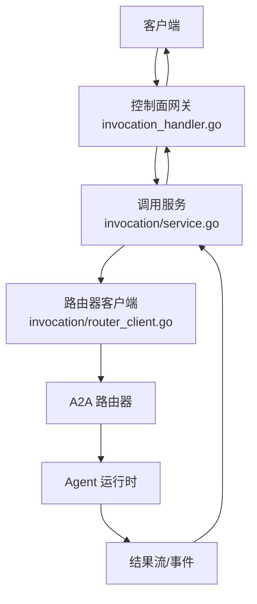
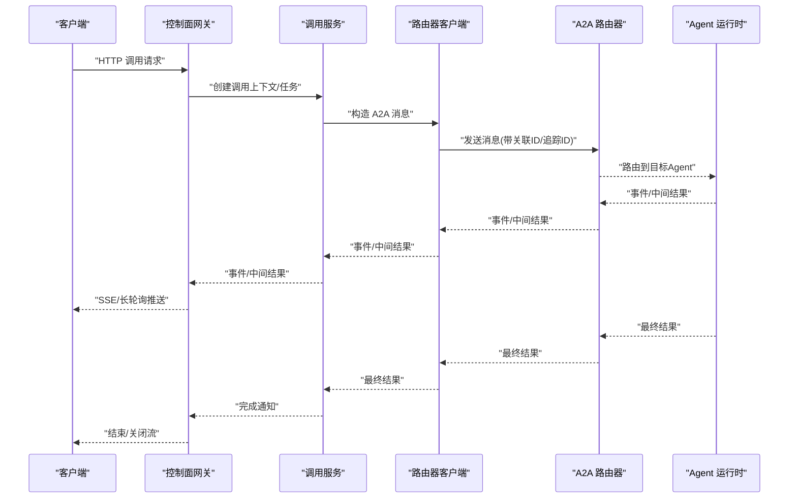
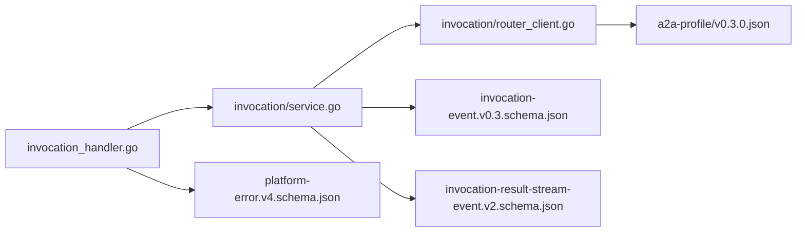
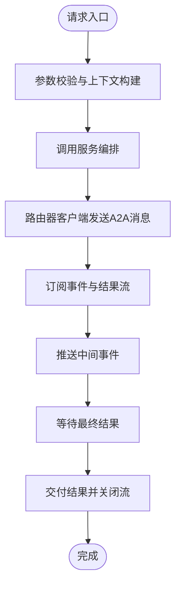

# 数据流设计

<cite>
**本文引用的文件**   
- [apps/control-plane/cmd/control-plane/main.go](file://apps/control-plane/cmd/control-plane/main.go)
- [apps/control-plane/internal/gateway/invocation_handler.go](file://apps/control-plane/internal/gateway/invocation_handler.go)
- [apps/control-plane/internal/invocation/service.go](file://apps/control-plane/internal/invocation/service.go)
- [apps/control-plane/internal/invocation/router_client.go](file://apps/control-plane/internal/invocation/router_client.go)
- [contracts/openapi/control-plane-invocation.v4.yaml](file://contracts/openapi/control-plane-invocation.v4.yaml)
- [contracts/a2a-profile/v0.3.0.json](file://contracts/a2a-profile/v0.3.0.json)
- [contracts/schemas/invocation-event.v0.3.schema.json](file://contracts/schemas/invocation-event.v0.3.schema.json)
- [contracts/schemas/invocation-result-stream-event.v2.schema.json](file://contracts/schemas/invocation-result-stream-event.v2.schema.json)
- [contracts/schemas/platform-error.v4.schema.json](file://contracts/schemas/platform-error.v4.schema.json)
- [contracts/runtime_contracts.go](file://contracts/runtime_contracts.go)
- [contracts/runtime_contracts_validation.go](file://contracts/runtime_contracts_validation.go)
- [contracts/result_contracts.go](file://contracts/result_contracts.go)
- [deploy/compose.yaml](file://deploy/compose.yaml)
</cite>

## 目录
1. [简介](#简介)
2. [项目结构](#项目结构)
3. [核心组件](#核心组件)
4. [架构总览](#架构总览)
5. [详细组件分析](#详细组件分析)
6. [依赖分析](#依赖分析)
7. [性能考虑](#性能考虑)
8. [故障排查指南](#故障排查指南)
9. [结论](#结论)
10. [附录](#附录)

## 简介
本文件面向 NeKiro 平台的数据流设计，聚焦从客户端请求到服务响应的完整路径、A2A 协议的消息传递机制与事件驱动架构、异步调用流程与结果回传机制、组件间序列化格式与传输协议，并配套数据流图与时序图。文档同时记录数据一致性保证与错误恢复策略，帮助读者快速理解系统如何可靠地编排跨工作区、跨代理的调用链路与结果投递。

## 项目结构
NeKiro 控制面位于 apps/control-plane，负责网关路由、调用编排、与路由器交互以及持久化元数据；合约定义集中在 contracts，包含 OpenAPI、A2A Profile、事件与结果流 Schema 等；部署配置在 deploy/compose.yaml。

图表来源
- [apps/control-plane/internal/gateway/invocation_handler.go](file://apps/control-plane/internal/gateway/invocation_handler.go)
- [apps/control-plane/internal/invocation/service.go](file://apps/control-plane/internal/invocation/service.go)
- [apps/control-plane/internal/invocation/router_client.go](file://apps/control-plane/internal/invocation/router_client.go)

章节来源
- [apps/control-plane/cmd/control-plane/main.go](file://apps/control-plane/cmd/control-plane/main.go)
- [deploy/compose.yaml](file://deploy/compose.yaml)

## 核心组件
- 控制面网关：暴露 HTTP API，接收调用请求，校验参数，生成上下文标识，转发至调用服务。
- 调用服务：编排一次调用的生命周期，维护任务状态、关联 ID、追踪 ID，协调与路由器的通信，处理结果流与事件。
- 路由器客户端：封装与 A2A 路由器的内部接口调用，负责将调用分发到目标 Agent 实例，并订阅其事件与结果流。
- 合约与 Schema：OpenAPI 定义外部 API；A2A Profile 定义消息语义；事件与结果流 Schema 约束序列化格式；平台错误 Schema 统一错误表达。

章节来源
- [apps/control-plane/internal/gateway/invocation_handler.go](file://apps/control-plane/internal/gateway/invocation_handler.go)
- [apps/control-plane/internal/invocation/service.go](file://apps/control-plane/internal/invocation/service.go)
- [apps/control-plane/internal/invocation/router_client.go](file://apps/control-plane/internal/invocation/router_client.go)
- [contracts/openapi/control-plane-invocation.v4.yaml](file://contracts/openapi/control-plane-invocation.v4.yaml)
- [contracts/a2a-profile/v0.3.0.json](file://contracts/a2a-profile/v0.3.0.json)
- [contracts/schemas/invocation-event.v0.3.schema.json](file://contracts/schemas/invocation-event.v0.3.schema.json)
- [contracts/schemas/invocation-result-stream-event.v2.schema.json](file://contracts/schemas/invocation-result-stream-event.v2.schema.json)
- [contracts/schemas/platform-error.v4.schema.json](file://contracts/schemas/platform-error.v4.schema.json)

## 架构总览
下图展示端到端数据流：客户端通过控制面网关发起调用，网关将请求交给调用服务；调用服务通过路由器客户端向 A2A 路由器发送消息；目标 Agent 执行后，以事件和结果流的形式回传给调用服务，再由网关推送给客户端。

图表来源
- [apps/control-plane/internal/gateway/invocation_handler.go](file://apps/control-plane/internal/gateway/invocation_handler.go)
- [apps/control-plane/internal/invocation/service.go](file://apps/control-plane/internal/invocation/service.go)
- [apps/control-plane/internal/invocation/router_client.go](file://apps/control-plane/internal/invocation/router_client.go)
- [contracts/a2a-profile/v0.3.0.json](file://contracts/a2a-profile/v0.3.0.json)
- [contracts/schemas/invocation-event.v0.3.schema.json](file://contracts/schemas/invocation-event.v0.3.schema.json)
- [contracts/schemas/invocation-result-stream-event.v2.schema.json](file://contracts/schemas/invocation-result-stream-event.v2.schema.json)

## 详细组件分析

### 网关层（HTTP 入口）
- 职责：接收控制面调用 API，解析请求体，校验必填字段，生成调用上下文（如 invocationId、rootTaskId、traceId），并将请求委派给调用服务。
- 输出：对同步调用返回 JSON 响应；对需要流式结果的调用建立 SSE 或长连接，持续推送事件与结果片段。
- 错误：使用平台错误 Schema 编码错误信息，确保客户端可一致解析。

章节来源
- [apps/control-plane/internal/gateway/invocation_handler.go](file://apps/control-plane/internal/gateway/invocation_handler.go)
- [contracts/openapi/control-plane-invocation.v4.yaml](file://contracts/openapi/control-plane-invocation.v4.yaml)
- [contracts/schemas/platform-error.v4.schema.json](file://contracts/schemas/platform-error.v4.schema.json)

### 调用服务（编排与状态）
- 职责：维护一次调用的生命周期，包括创建任务、跟踪状态、聚合来自路由器的中间事件与最终结果、持久化必要元数据。
- 异步流程：当调用进入异步模式时，服务会注册回调通道，等待路由器客户端上报事件与结果，再按约定格式推送给网关。
- 一致性：为每次调用分配稳定的关联标识，确保事件与结果能够正确归集；必要时进行幂等处理以避免重复投递。

章节来源
- [apps/control-plane/internal/invocation/service.go](file://apps/control-plane/internal/invocation/service.go)
- [contracts/schemas/invocation-event.v0.3.schema.json](file://contracts/schemas/invocation-event.v0.3.schema.json)
- [contracts/schemas/invocation-result-stream-event.v2.schema.json](file://contracts/schemas/invocation-result-stream-event.v2.schema.json)

### 路由器客户端（A2A 集成）
- 职责：将调用服务的消息转换为 A2A 协议消息，携带必要的上下文头与关联标识，发送至 A2A 路由器；订阅事件与结果流，反序列化为内部事件模型。
- 协议：遵循 A2A Profile 的消息结构与语义，包括消息类型、角色、内容部分、任务状态等。
- 可靠性：实现重试与退避策略，处理网络抖动与临时不可用；对超时与取消信号进行处理，向上游传播错误。

章节来源
- [apps/control-plane/internal/invocation/router_client.go](file://apps/control-plane/internal/invocation/router_client.go)
- [contracts/a2a-profile/v0.3.0.json](file://contracts/a2a-profile/v0.3.0.json)

### 合约与 Schema（序列化与传输）
- OpenAPI：定义控制面调用接口的请求/响应结构、状态码与错误模型。
- A2A Profile：定义消息对象、任务对象、事件对象及流式结果对象的语义与字段约束。
- 事件与结果流 Schema：分别约束事件与结果流的 JSON 结构，确保上下游一致解析。
- 平台错误 Schema：统一错误码、错误消息与附加信息，便于客户端诊断。

章节来源
- [contracts/openapi/control-plane-invocation.v4.yaml](file://contracts/openapi/control-plane-invocation.v4.yaml)
- [contracts/a2a-profile/v0.3.0.json](file://contracts/a2a-profile/v0.3.0.json)
- [contracts/schemas/invocation-event.v0.3.schema.json](file://contracts/schemas/invocation-event.v0.3.schema.json)
- [contracts/schemas/invocation-result-stream-event.v2.schema.json](file://contracts/schemas/invocation-result-stream-event.v2.schema.json)
- [contracts/schemas/platform-error.v4.schema.json](file://contracts/schemas/platform-error.v4.schema.json)

### 运行时契约与验证
- 运行时契约：描述调用在服务侧的执行边界、信任与失败策略、嵌套调用与投影规则等。
- 验证：对传入的 A2A 消息与事件进行结构校验，确保符合 Schema 要求，避免下游因非法数据而崩溃。

章节来源
- [contracts/runtime_contracts.go](file://contracts/runtime_contracts.go)
- [contracts/runtime_contracts_validation.go](file://contracts/runtime_contracts_validation.go)

### 结果交付契约
- 结果交付：定义最终结果与中间结果的投递方式、去重与幂等策略、错误分支的处理。
- 流式结果：支持分片结果的事件流，客户端可按顺序消费并合并得到完整结果。

章节来源
- [contracts/result_contracts.go](file://contracts/result_contracts.go)

## 依赖分析
- 组件耦合：网关仅依赖调用服务；调用服务依赖路由器客户端；路由器客户端依赖 A2A 路由器与合约 Schema。
- 外部依赖：OpenAPI 用于接口契约；A2A Profile 用于消息语义；Schema 用于序列化校验。
- 潜在循环：当前分层清晰，未见直接循环依赖。

图表来源
- [apps/control-plane/internal/gateway/invocation_handler.go](file://apps/control-plane/internal/gateway/invocation_handler.go)
- [apps/control-plane/internal/invocation/service.go](file://apps/control-plane/internal/invocation/service.go)
- [apps/control-plane/internal/invocation/router_client.go](file://apps/control-plane/internal/invocation/router_client.go)
- [contracts/a2a-profile/v0.3.0.json](file://contracts/a2a-profile/v0.3.0.json)
- [contracts/schemas/invocation-event.v0.3.schema.json](file://contracts/schemas/invocation-event.v0.3.schema.json)
- [contracts/schemas/invocation-result-stream-event.v2.schema.json](file://contracts/schemas/invocation-result-stream-event.v2.schema.json)
- [contracts/schemas/platform-error.v4.schema.json](file://contracts/schemas/platform-error.v4.schema.json)

章节来源
- [apps/control-plane/cmd/control-plane/main.go](file://apps/control-plane/cmd/control-plane/main.go)
- [deploy/compose.yaml](file://deploy/compose.yaml)

## 性能考虑
- 流式处理：优先采用事件流与结果流减少大对象一次性传输带来的内存压力。
- 背压与限流：在网关与服务之间、服务与路由器之间实施合理的缓冲与限流，防止雪崩。
- 连接复用：与路由器的连接应复用，降低握手开销。
- 序列化优化：尽量使用轻量级 JSON 结构，避免冗余字段；对热点路径启用缓存与批处理。

[本节为通用指导，不直接分析具体文件]

## 故障排查指南
- 常见错误：
  - 请求参数缺失或类型不符：检查 OpenAPI 契约与网关校验逻辑。
  - 事件/结果流中断：确认关联 ID 与追踪 ID 是否一致，检查路由器与 Agent 的健康状况。
  - 超时与取消：查看调用服务的超时配置与取消信号传播。
- 定位方法：
  - 基于 traceId 串联日志，定位各阶段耗时与异常点。
  - 对比事件与结果流 Schema，确认数据结构是否符合预期。
  - 使用平台错误 Schema 的错误码与消息进行快速分类。

章节来源
- [contracts/openapi/control-plane-invocation.v4.yaml](file://contracts/openapi/control-plane-invocation.v4.yaml)
- [contracts/schemas/platform-error.v4.schema.json](file://contracts/schemas/platform-error.v4.schema.json)
- [contracts/schemas/invocation-event.v0.3.schema.json](file://contracts/schemas/invocation-event.v0.3.schema.json)
- [contracts/schemas/invocation-result-stream-event.v2.schema.json](file://contracts/schemas/invocation-result-stream-event.v2.schema.json)

## 结论
NeKiro 平台通过控制面网关、调用服务与路由器客户端的分层协作，结合 A2A 协议与严格的 Schema 约束，实现了高内聚、低耦合的数据流编排。事件驱动与流式结果提升了吞吐与用户体验，配合一致的错误模型与幂等策略，保障了系统的可靠性与可观测性。

[本节为总结，不直接分析具体文件]

## 附录

### 数据一致性保证
- 关联标识：为每次调用分配稳定的 invocationId、rootTaskId、traceId，贯穿全链路，确保事件与结果正确归集。
- 幂等与去重：对关键操作（如创建任务、投递结果）实现幂等键，避免重复处理。
- 事务与持久化：在关键节点持久化状态变更，保证至少一次投递与最终一致性。

章节来源
- [contracts/schemas/invocation-event.v0.3.schema.json](file://contracts/schemas/invocation-event.v0.3.schema.json)
- [contracts/schemas/invocation-result-stream-event.v2.schema.json](file://contracts/schemas/invocation-result-stream-event.v2.schema.json)
- [contracts/runtime_contracts.go](file://contracts/runtime_contracts.go)

### 错误恢复策略
- 重试与退避：对临时性错误（网络抖动、上游繁忙）采用指数退避与最大重试次数限制。
- 超时与取消：设置合理超时时间，及时释放资源并向上游反馈错误。
- 降级与熔断：在检测到上游不可用时，快速失败并返回平台错误，避免级联故障。

章节来源
- [contracts/schemas/platform-error.v4.schema.json](file://contracts/schemas/platform-error.v4.schema.json)
- [contracts/runtime_contracts.go](file://contracts/runtime_contracts.go)

### 数据流图（代码映射）

图表来源
- [apps/control-plane/internal/gateway/invocation_handler.go](file://apps/control-plane/internal/gateway/invocation_handler.go)
- [apps/control-plane/internal/invocation/service.go](file://apps/control-plane/internal/invocation/service.go)
- [apps/control-plane/internal/invocation/router_client.go](file://apps/control-plane/internal/invocation/router_client.go)