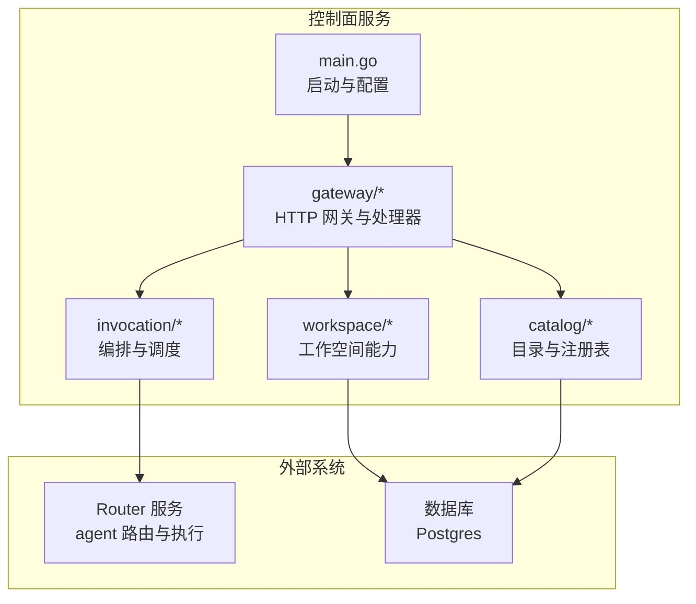
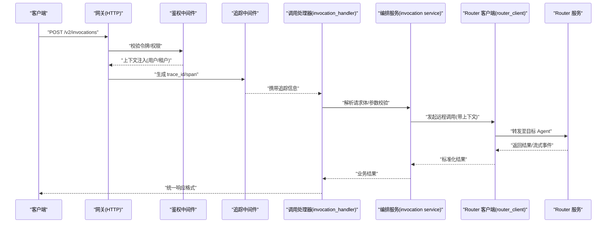
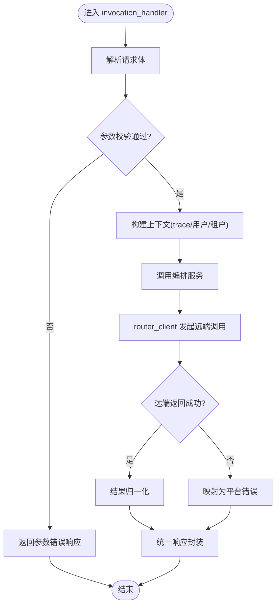
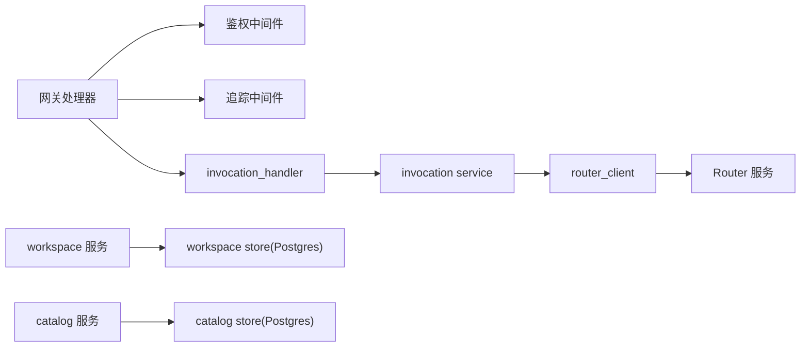

# 请求响应流程

<cite>
**本文引用的文件**   
- [apps/control-plane/cmd/control-plane/main.go](file://apps/control-plane/cmd/control-plane/main.go)
- [apps/control-plane/internal/gateway/auth.go](file://apps/control-plane/internal/gateway/auth.go)
- [apps/control-plane/internal/gateway/errors.go](file://apps/control-plane/internal/gateway/errors.go)
- [apps/control-plane/internal/gateway/invocation_handler.go](file://apps/control-plane/internal/gateway/invocation_handler.go)
- [apps/control-plane/internal/gateway/workspace_handler.go](file://apps/control-plane/internal/gateway/workspace_handler.go)
- [apps/control-plane/internal/gateway/catalog_handler.go](file://apps/control-plane/internal/gateway/catalog_handler.go)
- [apps/control-plane/internal/gateway/trace.go](file://apps/control-plane/internal/gateway/trace.go)
- [apps/control-plane/internal/invocation/service.go](file://apps/control-plane/internal/invocation/service.go)
- [apps/control-plane/internal/invocation/router_client.go](file://apps/control-plane/internal/invocation/router_client.go)
- [contracts/openapi/control-plane.v2.yaml](file://contracts/openapi/control-plane.v2.yaml)
- [contracts/openapi/router-agent.v1.yaml](file://contracts/openapi/router-agent.v1.yaml)
</cite>

## 目录
1. [简介](#简介)
2. [项目结构](#项目结构)
3. [核心组件](#核心组件)
4. [架构总览](#架构总览)
5. [详细组件分析](#详细组件分析)
6. [依赖分析](#依赖分析)
7. [性能考虑](#性能考虑)
8. [故障排查指南](#故障排查指南)
9. [结论](#结论)
10. [附录](#附录)

## 简介
本文件面向 NeKiro 平台，系统化描述 HTTP 请求从网关层到业务服务的完整处理路径，覆盖路由机制、中间件处理链、认证授权、参数验证、数据转换、响应格式化、错误处理策略、超时控制与性能优化。文档同时提供时序图、流程图和可操作的 API 调用示例与调试方法，帮助读者快速理解并高效排障。

## 项目结构
NeKiro 的控制面服务位于 apps/control-plane 下，入口为 main.go；HTTP 网关与路由在 internal/gateway；具体业务能力由 invocation、workspace、catalog 等子模块实现；OpenAPI 契约定义在 contracts/openapi。

图表来源
- [apps/control-plane/cmd/control-plane/main.go](file://apps/control-plane/cmd/control-plane/main.go)
- [apps/control-plane/internal/gateway/invocation_handler.go](file://apps/control-plane/internal/gateway/invocation_handler.go)
- [apps/control-plane/internal/invocation/service.go](file://apps/control-plane/internal/invocation/service.go)
- [apps/control-plane/internal/invocation/router_client.go](file://apps/control-plane/internal/invocation/router_client.go)
- [apps/control-plane/internal/workspace/store.go](file://apps/control-plane/internal/workspace/postgres/store.go)
- [apps/control-plane/internal/catalog/store.go](file://apps/control-plane/internal/catalog/postgres/store.go)

章节来源
- [apps/control-plane/cmd/control-plane/main.go](file://apps/control-plane/cmd/control-plane/main.go)
- [contracts/openapi/control-plane.v2.yaml](file://contracts/openapi/control-plane.v2.yaml)

## 核心组件
- 网关与路由：负责 HTTP 接入、鉴权、追踪、参数校验、路由分发与响应封装。
- 业务服务：按领域划分（invocation、workspace、catalog），承载核心逻辑与持久化访问。
- 外部集成：通过 router_client 与 Router 服务交互，完成 agent 发现与任务执行。
- 契约与校验：基于 OpenAPI 契约进行请求/响应约束与一致性测试。

章节来源
- [apps/control-plane/internal/gateway/invocation_handler.go](file://apps/control-plane/internal/gateway/invocation_handler.go)
- [apps/control-plane/internal/invocation/service.go](file://apps/control-plane/internal/invocation/service.go)
- [apps/control-plane/internal/invocation/router_client.go](file://apps/control-plane/internal/invocation/router_client.go)
- [contracts/openapi/control-plane.v2.yaml](file://contracts/openapi/control-plane.v2.yaml)

## 架构总览
下图展示一次典型“创建调用”的端到端流程：客户端经网关进入，依次经过鉴权、追踪、参数校验，再路由至 invocation 服务，最终通过 router_client 转发至 Router 执行。

图表来源
- [apps/control-plane/internal/gateway/invocation_handler.go](file://apps/control-plane/internal/gateway/invocation_handler.go)
- [apps/control-plane/internal/invocation/service.go](file://apps/control-plane/internal/invocation/service.go)
- [apps/control-plane/internal/invocation/router_client.go](file://apps/control-plane/internal/invocation/router_client.go)
- [apps/control-plane/internal/gateway/auth.go](file://apps/control-plane/internal/gateway/auth.go)
- [apps/control-plane/internal/gateway/trace.go](file://apps/control-plane/internal/gateway/trace.go)

## 详细组件分析

### 网关与路由
- 路由注册：入口服务将 HTTP 路径映射到对应处理器（如 /v2/invocations -> invocation_handler）。
- 中间件链：鉴权 -> 追踪 -> 日志/限流（可选）-> 处理器。
- 响应封装：统一包装成功/失败响应，设置标准状态码与头部。

章节来源
- [apps/control-plane/cmd/control-plane/main.go](file://apps/control-plane/cmd/control-plane/main.go)
- [apps/control-plane/internal/gateway/invocation_handler.go](file://apps/control-plane/internal/gateway/invocation_handler.go)
- [apps/control-plane/internal/gateway/workspace_handler.go](file://apps/control-plane/internal/gateway/workspace_handler.go)
- [apps/control-plane/internal/gateway/catalog_handler.go](file://apps/control-plane/internal/gateway/catalog_handler.go)

#### 鉴权中间件
- 职责：校验令牌、提取主体信息、注入上下文、拒绝非法请求。
- 行为：对未认证或无权限的请求直接返回错误响应，不进入后续链路。

章节来源
- [apps/control-plane/internal/gateway/auth.go](file://apps/control-plane/internal/gateway/auth.go)

#### 追踪中间件
- 职责：生成 trace_id、span，注入请求上下文，记录关键耗时。
- 输出：在响应头中回传 trace_id，便于跨服务联调。

章节来源
- [apps/control-plane/internal/gateway/trace.go](file://apps/control-plane/internal/gateway/trace.go)

#### 错误处理与统一响应
- 统一错误模型：将内部异常转换为平台错误对象，包含错误码、消息与关联 ID。
- 状态码映射：根据错误类型映射到合适的 HTTP 状态码。

章节来源
- [apps/control-plane/internal/gateway/errors.go](file://apps/control-plane/internal/gateway/errors.go)

### 调用编排（Invocation）
- 参数校验：依据 OpenAPI 契约对请求体进行结构与字段校验。
- 数据转换：将外部请求转换为内部领域模型，确保类型安全。
- 远端调用：通过 router_client 向 Router 服务发起调用，支持同步与流式。
- 结果归一化：将不同后端返回统一为标准结果结构。

图表来源
- [apps/control-plane/internal/gateway/invocation_handler.go](file://apps/control-plane/internal/gateway/invocation_handler.go)
- [apps/control-plane/internal/invocation/service.go](file://apps/control-plane/internal/invocation/service.go)
- [apps/control-plane/internal/invocation/router_client.go](file://apps/control-plane/internal/invocation/router_client.go)
- [apps/control-plane/internal/gateway/errors.go](file://apps/control-plane/internal/gateway/errors.go)

章节来源
- [apps/control-plane/internal/invocation/service.go](file://apps/control-plane/internal/invocation/service.go)
- [apps/control-plane/internal/invocation/router_client.go](file://apps/control-plane/internal/invocation/router_client.go)

### 工作空间与目录服务
- 工作空间：提供创建工作空间、查询安装信息等能力，读写 Postgres。
- 目录：管理 Agent 卡片、版本与发布，供路由选择使用。

章节来源
- [apps/control-plane/internal/workspace/service.go](file://apps/control-plane/internal/workspace/service.go)
- [apps/control-plane/internal/workspace/postgres/store.go](file://apps/control-plane/internal/workspace/postgres/store.go)
- [apps/control-plane/internal/catalog/service.go](file://apps/control-plane/internal/catalog/service.go)
- [apps/control-plane/internal/catalog/postgres/store.go](file://apps/control-plane/internal/catalog/postgres/store.go)

## 依赖分析
- 网关层依赖鉴权与追踪中间件，并将请求分派给各业务处理器。
- 编排服务依赖 router_client 与外部 Router 服务通信。
- workspace 与 catalog 依赖数据库存储实现。

图表来源
- [apps/control-plane/internal/gateway/invocation_handler.go](file://apps/control-plane/internal/gateway/invocation_handler.go)
- [apps/control-plane/internal/invocation/service.go](file://apps/control-plane/internal/invocation/service.go)
- [apps/control-plane/internal/invocation/router_client.go](file://apps/control-plane/internal/invocation/router_client.go)
- [apps/control-plane/internal/workspace/postgres/store.go](file://apps/control-plane/internal/workspace/postgres/store.go)
- [apps/control-plane/internal/catalog/postgres/store.go](file://apps/control-plane/internal/catalog/postgres/store.go)

章节来源
- [apps/control-plane/internal/gateway/invocation_handler.go](file://apps/control-plane/internal/gateway/invocation_handler.go)
- [apps/control-plane/internal/invocation/service.go](file://apps/control-plane/internal/invocation/service.go)
- [apps/control-plane/internal/invocation/router_client.go](file://apps/control-plane/internal/invocation/router_client.go)

## 性能考虑
- 连接池与并发：数据库连接池与远端 HTTP 客户端连接复用，避免频繁握手。
- 超时控制：为远端调用与数据库操作设置合理超时，防止雪崩。
- 流式传输：长时任务采用 SSE/流式返回，降低首字节延迟。
- 缓存策略：热点元数据（如目录）可引入本地缓存，减少数据库压力。
- 压测与观测：结合追踪与指标采集，定位瓶颈。

[本节为通用指导，无需源码引用]

## 故障排查指南
- 查看响应头中的 trace_id，用于跨服务链路定位。
- 检查鉴权失败原因：令牌过期、签名错误或权限不足。
- 核对 OpenAPI 契约，确认请求体结构与必填字段。
- 观察远端调用错误码与超时日志，必要时调整超时阈值。
- 使用统一错误模型中的错误码与消息快速定位问题域。

章节来源
- [apps/control-plane/internal/gateway/trace.go](file://apps/control-plane/internal/gateway/trace.go)
- [apps/control-plane/internal/gateway/errors.go](file://apps/control-plane/internal/gateway/errors.go)
- [contracts/openapi/control-plane.v2.yaml](file://contracts/openapi/control-plane.v2.yaml)

## 结论
NeKiro 控制面以网关为中心，通过鉴权与追踪中间件保障安全与可观测性，再由业务服务完成领域逻辑与外部集成。统一的参数校验、数据转换与错误模型提升了稳定性与可维护性。配合合理的超时与连接策略，可在高并发场景下保持良好性能。

[本节为总结性内容，无需源码引用]

## 附录

### API 调用示例（基于 OpenAPI 契约）
- 创建调用
  - 方法：POST
  - 路径：/v2/invocations
  - 请求头：Authorization、X-Trace-Id（可选）
  - 请求体：参考 control-plane.v2.yaml 中对应 schema
  - 响应：统一响应格式，包含 data 与 error 字段
- 查询工作空间
  - 方法：GET
  - 路径：/v2/workspaces/{id}
  - 响应：工作空间详情

章节来源
- [contracts/openapi/control-plane.v2.yaml](file://contracts/openapi/control-plane.v2.yaml)

### 调试方法
- 启用详细日志：在网关与业务服务开启 debug 级别日志。
- 透传 trace_id：在请求头携带 X-Trace-Id，便于全链路检索。
- 本地联调：使用 OpenAPI 契约生成客户端或脚本进行自动化测试。
- 断点与快照：在关键节点（鉴权、校验、远端调用）打点，捕获上下文。

章节来源
- [apps/control-plane/internal/gateway/trace.go](file://apps/control-plane/internal/gateway/trace.go)
- [contracts/openapi/control-plane.v2.yaml](file://contracts/openapi/control-plane.v2.yaml)