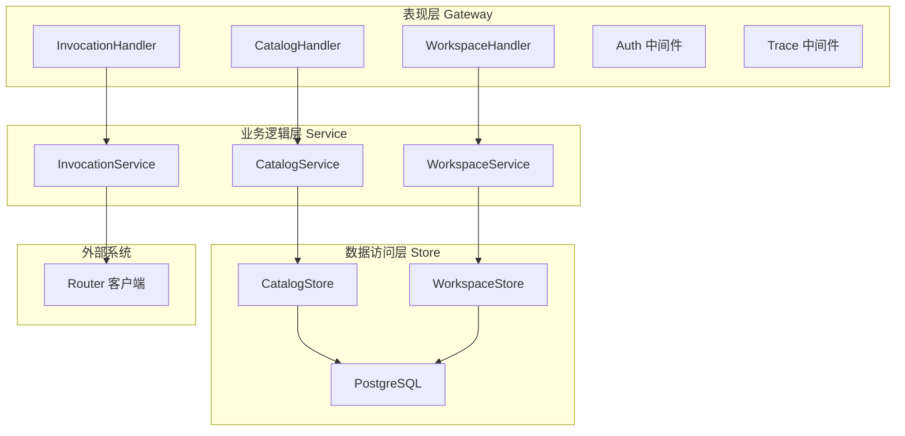
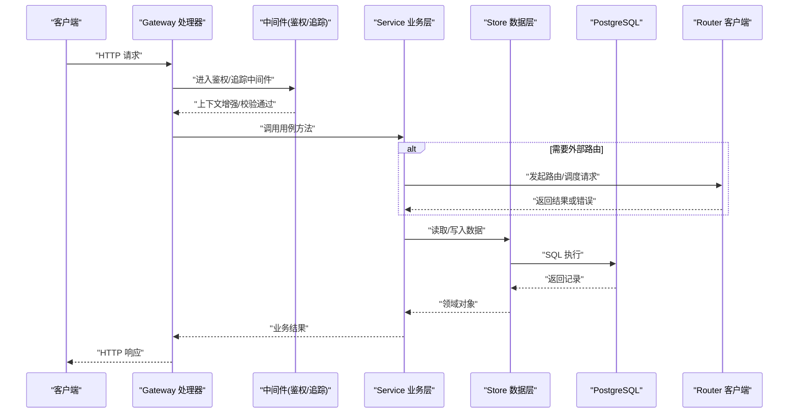
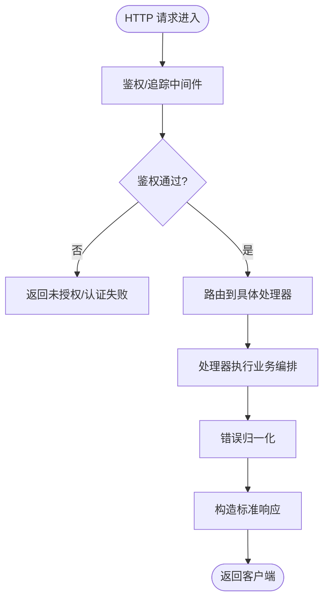
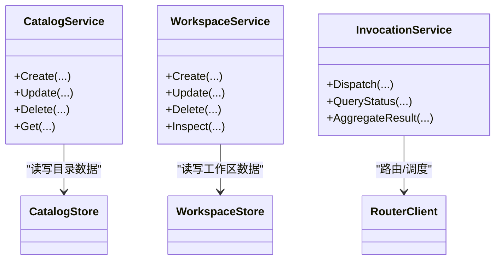
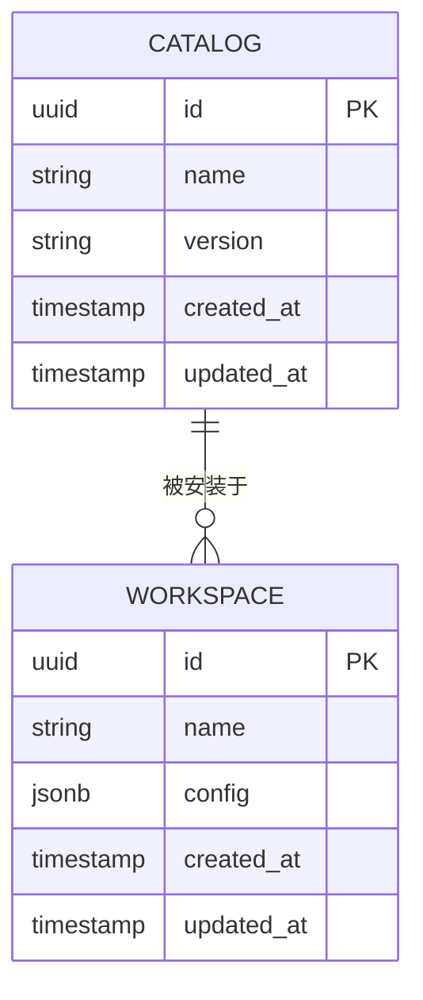
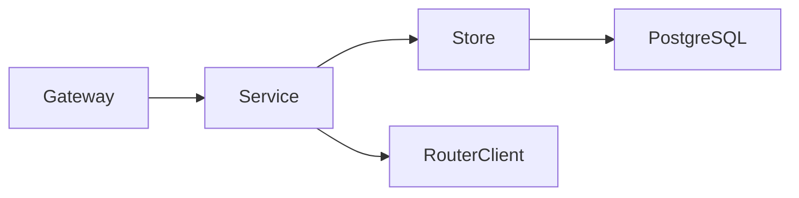

# 分层架构模式

<cite>
**本文引用的文件**   
- [main.go](file://apps/control-plane/cmd/control-plane/main.go)
- [auth.go](file://apps/control-plane/internal/gateway/auth.go)
- [catalog_handler.go](file://apps/control-plane/internal/gateway/catalog_handler.go)
- [invocation_handler.go](file://apps/control-plane/internal/gateway/invocation_handler.go)
- [workspace_handler.go](file://apps/control-plane/internal/gateway/workspace_handler.go)
- [errors.go](file://apps/control-plane/internal/gateway/errors.go)
- [trace.go](file://apps/control-plane/internal/gateway/trace.go)
- [service.go](file://apps/control-plane/internal/catalog/service.go)
- [store.go](file://apps/control-plane/internal/catalog/store.go)
- [migrations.go](file://apps/control-plane/internal/catalog/postgres/migrations.go)
- [router_client.go](file://apps/control-plane/internal/invocation/router_client.go)
- [service.go](file://apps/control-plane/internal/invocation/service.go)
- [service.go](file://apps/control-plane/internal/workspace/service.go)
- [store.go](file://apps/control-plane/internal/workspace/store.go)
- [migrations.go](file://apps/control-plane/internal/workspace/postgres/migrations.go)
</cite>

## 目录
1. [简介](#简介)
2. [项目结构](#项目结构)
3. [核心组件](#核心组件)
4. [架构总览](#架构总览)
5. [详细组件分析](#详细组件分析)
6. [依赖关系分析](#依赖关系分析)
7. [性能考虑](#性能考虑)
8. [故障排查指南](#故障排查指南)
9. [结论](#结论)
10. [附录](#附录)

## 简介
本文件面向 NeKiro 控制面服务，系统化阐述其分层架构模式：表现层（Gateway）、业务逻辑层（Service）与数据访问层（Store）。文档聚焦三层职责边界、接口契约、请求处理流程、中间件机制、测试策略与可维护性/可扩展性收益，并配以架构图与数据流向图，帮助读者快速理解与落地。

## 项目结构
NeKiro 控制面采用按领域分层的组织方式：
- 表现层（Gateway）：HTTP 路由与处理器，负责协议解析、鉴权、追踪、错误归一化等横切关注点。
- 业务逻辑层（Service）：编排领域用例，协调 Store 与外部系统（如 Router），实现事务与一致性策略。
- 数据访问层（Store）：封装持久化细节（PostgreSQL），提供领域无关的数据操作接口；迁移脚本位于对应子包中。

图表来源
- [catalog_handler.go:1-200](file://apps/control-plane/internal/gateway/catalog_handler.go#L1-200)
- [invocation_handler.go:1-200](file://apps/control-plane/internal/gateway/invocation_handler.go#L1-200)
- [workspace_handler.go:1-200](file://apps/control-plane/internal/gateway/workspace_handler.go#L1-200)
- [auth.go:1-200](file://apps/control-plane/internal/gateway/auth.go#L1-200)
- [trace.go:1-200](file://apps/control-plane/internal/gateway/trace.go#L1-200)
- [service.go](file://apps/control-plane/internal/catalog/service.go)
- [service.go](file://apps/control-plane/internal/invocation/service.go)
- [service.go](file://apps/control-plane/internal/workspace/service.go)
- [store.go](file://apps/control-plane/internal/catalog/store.go)
- [store.go](file://apps/control-plane/internal/workspace/store.go)
- [router_client.go:1-200](file://apps/control-plane/internal/invocation/router_client.go#L1-200)

章节来源
- [main.go:1-200](file://apps/control-plane/cmd/control-plane/main.go#L1-L200)
- [catalog_handler.go:1-200](file://apps/control-plane/internal/gateway/catalog_handler.go#L1-L200)
- [invocation_handler.go:1-200](file://apps/control-plane/internal/gateway/invocation_handler.go#L1-L200)
- [workspace_handler.go:1-200](file://apps/control-plane/internal/gateway/workspace_handler.go#L1-L200)
- [auth.go:1-200](file://apps/control-plane/internal/gateway/auth.go#L1-L200)
- [trace.go:1-200](file://apps/control-plane/internal/gateway/trace.go#L1-L200)
- [service.go](file://apps/control-plane/internal/catalog/service.go)
- [service.go](file://apps/control-plane/internal/invocation/service.go)
- [service.go](file://apps/control-plane/internal/workspace/service.go)
- [store.go](file://apps/control-plane/internal/catalog/store.go)
- [store.go](file://apps/control-plane/internal/workspace/store.go)
- [router_client.go:1-200](file://apps/control-plane/internal/invocation/router_client.go#L1-L200)

## 核心组件
- 表现层（Gateway）
  - 职责：接收 HTTP 请求，执行鉴权、追踪、参数校验、错误归一化，调用 Service 完成用例编排，返回响应。
  - 关键处理器：目录 Catalog、工作区 Workspace、调用 Invocation。
  - 横切能力：鉴权中间件、追踪中间件、统一错误码映射。
- 业务逻辑层（Service）
  - 职责：实现领域用例，组合多个 Store 调用与外部系统（Router）交互，保证业务一致性与幂等性。
  - 关键服务：CatalogService、WorkspaceService、InvocationService。
- 数据访问层（Store）
  - 职责：封装数据库访问细节，暴露领域语义的 CRUD 与查询方法；迁移脚本由独立模块管理。
  - 关键存储：CatalogStore、WorkspaceStore，底层为 PostgreSQL。

章节来源
- [catalog_handler.go:1-200](file://apps/control-plane/internal/gateway/catalog_handler.go#L1-L200)
- [workspace_handler.go:1-200](file://apps/control-plane/internal/gateway/workspace_handler.go#L1-L200)
- [invocation_handler.go:1-200](file://apps/control-plane/internal/gateway/invocation_handler.go#L1-L200)
- [auth.go:1-200](file://apps/control-plane/internal/gateway/auth.go#L1-L200)
- [trace.go:1-200](file://apps/control-plane/internal/gateway/trace.go#L1-L200)
- [errors.go:1-200](file://apps/control-plane/internal/gateway/errors.go#L1-L200)
- [service.go](file://apps/control-plane/internal/catalog/service.go)
- [service.go](file://apps/control-plane/internal/workspace/service.go)
- [service.go](file://apps/control-plane/internal/invocation/service.go)
- [store.go](file://apps/control-plane/internal/catalog/store.go)
- [store.go](file://apps/control-plane/internal/workspace/store.go)
- [migrations.go](file://apps/control-plane/internal/catalog/postgres/migrations.go)
- [migrations.go](file://apps/control-plane/internal/workspace/postgres/migrations.go)

## 架构总览
下图展示从 HTTP 入口到数据库的完整链路，以及中间件在请求路径中的位置。

图表来源
- [catalog_handler.go:1-200](file://apps/control-plane/internal/gateway/catalog_handler.go#L1-L200)
- [workspace_handler.go:1-200](file://apps/control-plane/internal/gateway/workspace_handler.go#L1-L200)
- [invocation_handler.go:1-200](file://apps/control-plane/internal/gateway/invocation_handler.go#L1-L200)
- [auth.go:1-200](file://apps/control-plane/internal/gateway/auth.go#L1-L200)
- [trace.go:1-200](file://apps/control-plane/internal/gateway/trace.go#L1-L200)
- [service.go](file://apps/control-plane/internal/catalog/service.go)
- [service.go](file://apps/control-plane/internal/workspace/service.go)
- [service.go](file://apps/control-plane/internal/invocation/service.go)
- [store.go](file://apps/control-plane/internal/catalog/store.go)
- [store.go](file://apps/control-plane/internal/workspace/store.go)
- [router_client.go:1-200](file://apps/control-plane/internal/invocation/router_client.go#L1-L200)

## 详细组件分析

### 表现层（Gateway）
- 职责边界
  - 仅做协议适配、鉴权、追踪、参数校验、错误归一化与响应格式化。
  - 不承载复杂业务规则，避免侵入 Service。
- 中间件机制
  - 鉴权中间件：校验令牌/权限，注入用户上下文。
  - 追踪中间件：生成/透传 traceId，记录请求耗时与关键事件。
- 错误处理
  - 将内部错误映射为标准平台错误，便于客户端稳定消费。
- 典型处理器
  - Catalog 处理器：目录资源的增删改查与版本管理。
  - Workspace 处理器：工作区生命周期与元数据操作。
  - Invocation 处理器：调用编排与状态查询。

图表来源
- [auth.go:1-200](file://apps/control-plane/internal/gateway/auth.go#L1-L200)
- [trace.go:1-200](file://apps/control-plane/internal/gateway/trace.go#L1-L200)
- [errors.go:1-200](file://apps/control-plane/internal/gateway/errors.go#L1-L200)
- [catalog_handler.go:1-200](file://apps/control-plane/internal/gateway/catalog_handler.go#L1-L200)
- [workspace_handler.go:1-200](file://apps/control-plane/internal/gateway/workspace_handler.go#L1-L200)
- [invocation_handler.go:1-200](file://apps/control-plane/internal/gateway/invocation_handler.go#L1-L200)

章节来源
- [auth.go:1-200](file://apps/control-plane/internal/gateway/auth.go#L1-L200)
- [trace.go:1-200](file://apps/control-plane/internal/gateway/trace.go#L1-L200)
- [errors.go:1-200](file://apps/control-plane/internal/gateway/errors.go#L1-L200)
- [catalog_handler.go:1-200](file://apps/control-plane/internal/gateway/catalog_handler.go#L1-L200)
- [workspace_handler.go:1-200](file://apps/control-plane/internal/gateway/workspace_handler.go#L1-L200)
- [invocation_handler.go:1-200](file://apps/control-plane/internal/gateway/invocation_handler.go#L1-L200)

### 业务逻辑层（Service）
- 职责边界
  - 编排跨 Store 的外部调用，实现用例级一致性、重试与幂等。
  - 对上层暴露稳定的领域 API，屏蔽底层实现细节。
- 关键服务
  - CatalogService：目录项的创建、更新、删除、查询与版本控制。
  - WorkspaceService：工作区的创建、配置、状态管理与清理。
  - InvocationService：调用任务的创建、分发、状态跟踪与结果聚合。
- 对外部系统的集成
  - 通过 Router 客户端进行任务路由与远端执行，遵循超时与熔断策略。

图表来源
- [service.go](file://apps/control-plane/internal/catalog/service.go)
- [service.go](file://apps/control-plane/internal/workspace/service.go)
- [service.go](file://apps/control-plane/internal/invocation/service.go)
- [store.go](file://apps/control-plane/internal/catalog/store.go)
- [store.go](file://apps/control-plane/internal/workspace/store.go)
- [router_client.go:1-200](file://apps/control-plane/internal/invocation/router_client.go#L1-L200)

章节来源
- [service.go](file://apps/control-plane/internal/catalog/service.go)
- [service.go](file://apps/control-plane/internal/workspace/service.go)
- [service.go](file://apps/control-plane/internal/invocation/service.go)
- [router_client.go:1-200](file://apps/control-plane/internal/invocation/router_client.go#L1-L200)

### 数据访问层（Store）
- 职责边界
  - 仅关注数据存取，不掺杂业务规则。
  - 提供领域语义的方法名，隐藏 SQL 细节。
- 关键存储
  - CatalogStore：目录表结构的增删改查、游标分页等。
  - WorkspaceStore：工作区表结构的增删改查、索引优化查询。
- 迁移管理
  - 各域 migrations 包负责 DDL/DML 的版本化管理与回滚策略。

图表来源
- [store.go](file://apps/control-plane/internal/catalog/store.go)
- [store.go](file://apps/control-plane/internal/workspace/store.go)
- [migrations.go](file://apps/control-plane/internal/catalog/postgres/migrations.go)
- [migrations.go](file://apps/control-plane/internal/workspace/postgres/migrations.go)

章节来源
- [store.go](file://apps/control-plane/internal/catalog/store.go)
- [store.go](file://apps/control-plane/internal/workspace/store.go)
- [migrations.go](file://apps/control-plane/internal/catalog/postgres/migrations.go)
- [migrations.go](file://apps/control-plane/internal/workspace/postgres/migrations.go)

## 依赖关系分析
- 单向依赖
  - Gateway → Service → Store/RouterClient
  - Store → 数据库驱动（PostgreSQL）
- 低耦合高内聚
  - 每层通过清晰接口通信，变更影响范围可控。
- 潜在循环依赖规避
  - Service 不反向依赖 Gateway；Store 不感知上层业务。

图表来源
- [catalog_handler.go:1-200](file://apps/control-plane/internal/gateway/catalog_handler.go#L1-L200)
- [workspace_handler.go:1-200](file://apps/control-plane/internal/gateway/workspace_handler.go#L1-L200)
- [invocation_handler.go:1-200](file://apps/control-plane/internal/gateway/invocation_handler.go#L1-L200)
- [service.go](file://apps/control-plane/internal/catalog/service.go)
- [service.go](file://apps/control-plane/internal/workspace/service.go)
- [service.go](file://apps/control-plane/internal/invocation/service.go)
- [store.go](file://apps/control-plane/internal/catalog/store.go)
- [store.go](file://apps/control-plane/internal/workspace/store.go)
- [router_client.go:1-200](file://apps/control-plane/internal/invocation/router_client.go#L1-L200)

章节来源
- [main.go:1-200](file://apps/control-plane/cmd/control-plane/main.go#L1-L200)
- [catalog_handler.go:1-200](file://apps/control-plane/internal/gateway/catalog_handler.go#L1-L200)
- [workspace_handler.go:1-200](file://apps/control-plane/internal/gateway/workspace_handler.go#L1-L200)
- [invocation_handler.go:1-200](file://apps/control-plane/internal/gateway/invocation_handler.go#L1-L200)
- [service.go](file://apps/control-plane/internal/catalog/service.go)
- [service.go](file://apps/control-plane/internal/workspace/service.go)
- [service.go](file://apps/control-plane/internal/invocation/service.go)
- [store.go](file://apps/control-plane/internal/catalog/store.go)
- [store.go](file://apps/control-plane/internal/workspace/store.go)
- [router_client.go:1-200](file://apps/control-plane/internal/invocation/router_client.go#L1-L200)

## 性能考虑
- 连接池与并发
  - 合理配置数据库连接池大小，避免连接耗尽；使用 goroutine 并发时注意限流与背压。
- 缓存与热点
  - 对读多写少的目录/工作区元数据引入本地/分布式缓存，降低热点查询压力。
- 超时与重试
  - 对 Router 客户端设置合理的超时与退避重试，防止雪崩。
- 分页与游标
  - 列表接口采用游标分页，避免深分页导致的性能退化。
- 追踪开销
  - 追踪采样率可配置，生产环境建议开启采样以降低开销。

[本节为通用指导，无需源码引用]

## 故障排查指南
- 常见问题定位
  - 鉴权失败：检查鉴权中间件的令牌校验与上下文注入。
  - 追踪缺失：确认追踪中间件是否启用且 traceId 正确透传。
  - 数据库异常：查看 Store 层错误映射与迁移版本一致性。
  - 外部调用失败：检查 Router 客户端超时、重试与熔断配置。
- 错误归一化
  - 使用统一错误类型与状态码，便于前端与监控告警联动。
- 日志与指标
  - 在关键路径埋点，输出结构化日志与核心指标（QPS、P99、错误率）。

章节来源
- [auth.go:1-200](file://apps/control-plane/internal/gateway/auth.go#L1-L200)
- [trace.go:1-200](file://apps/control-plane/internal/gateway/trace.go#L1-L200)
- [errors.go:1-200](file://apps/control-plane/internal/gateway/errors.go#L1-L200)
- [store.go](file://apps/control-plane/internal/catalog/store.go)
- [store.go](file://apps/control-plane/internal/workspace/store.go)
- [router_client.go:1-200](file://apps/control-plane/internal/invocation/router_client.go#L1-L200)

## 结论
分层架构使 NeKiro 控制面具备清晰的职责边界与良好的扩展性：
- 可维护性：变更局限在单一层内，降低回归风险。
- 可扩展性：新增领域只需扩展 Service/Store，网关侧以中间件形式复用横切能力。
- 可观测性：中间件集中实现鉴权与追踪，统一错误归一化，提升排障效率。

[本节为总结性内容，无需源码引用]

## 附录
- 测试策略
  - 表现层：基于 HTTP 的集成测试，覆盖鉴权失败、追踪透传、错误归一化场景。
  - 业务层：单元测试为主，使用桩/模拟替代 Store 与 Router 客户端，验证用例分支与边界条件。
  - 数据层：针对 Store 编写单测与集成测试，确保 SQL 正确性与迁移兼容性。
- 边界条件
  - 空值与非法输入校验、重复提交幂等、并发冲突与乐观锁、资源不存在与软删除。
- 最佳实践
  - 接口优先设计、最小权限原则、失败快速返回、可插拔中间件、可配置开关。

章节来源
- [catalog_handler_test.go:1-200](file://apps/control-plane/internal/gateway/catalog_handler_test.go#L1-L200)
- [invocation_handler_test.go:1-200](file://apps/control-plane/internal/gateway/invocation_handler_test.go#L1-L200)
- [workspace_handler_test.go:1-200](file://apps/control-plane/internal/gateway/workspace_handler_test.go#L1-L200)
- [service_test.go](file://apps/control-plane/internal/catalog/service_test.go)
- [service_test.go](file://apps/control-plane/internal/workspace/service_test.go)
- [service_test.go](file://apps/control-plane/internal/invocation/service_test.go)
- [store_test.go](file://apps/control-plane/internal/workspace/postgres/store_test.go)
- [migrations_test.go](file://apps/control-plane/internal/catalog/postgres/migrations_test.go)
- [migrations_test.go](file://apps/control-plane/internal/workspace/postgres/migrations_test.go)