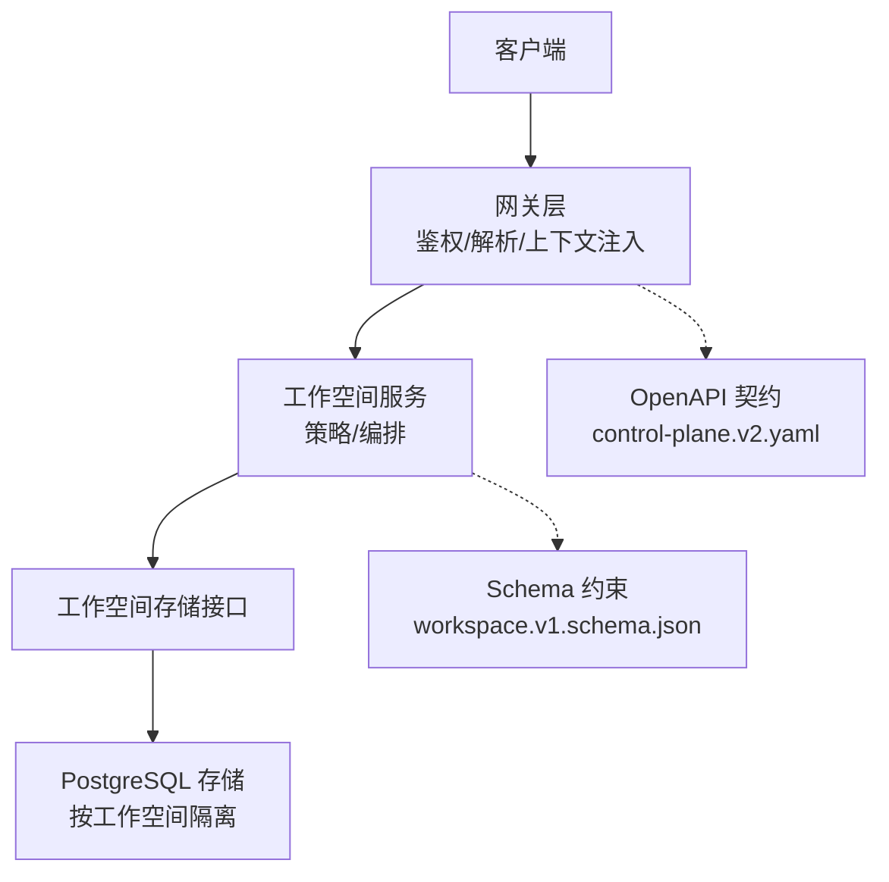
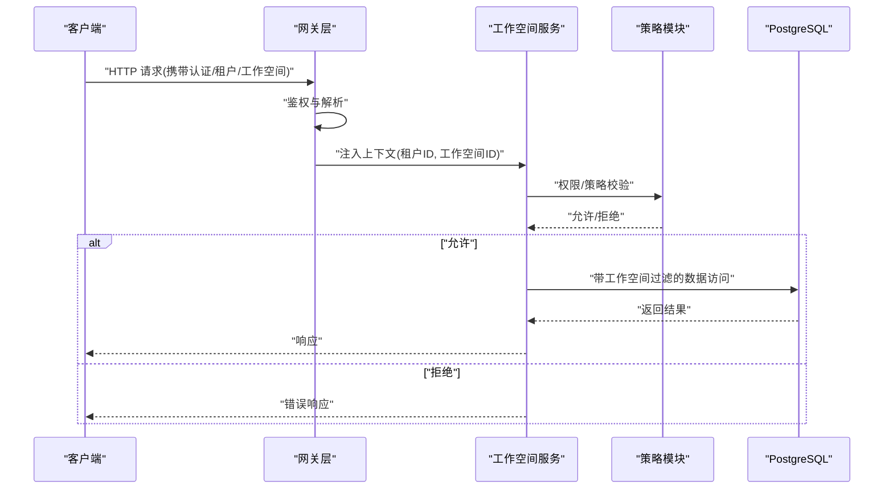
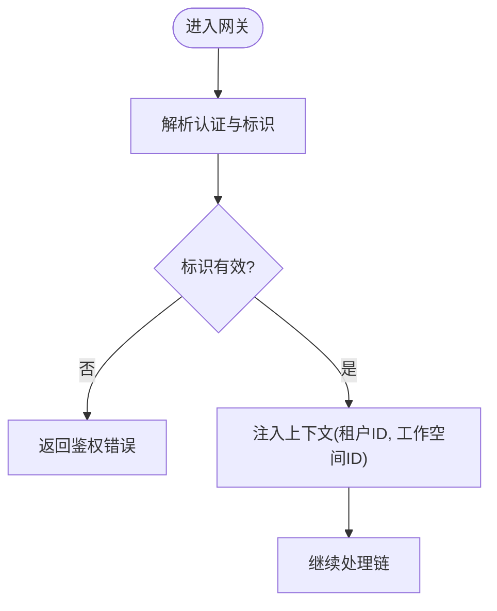
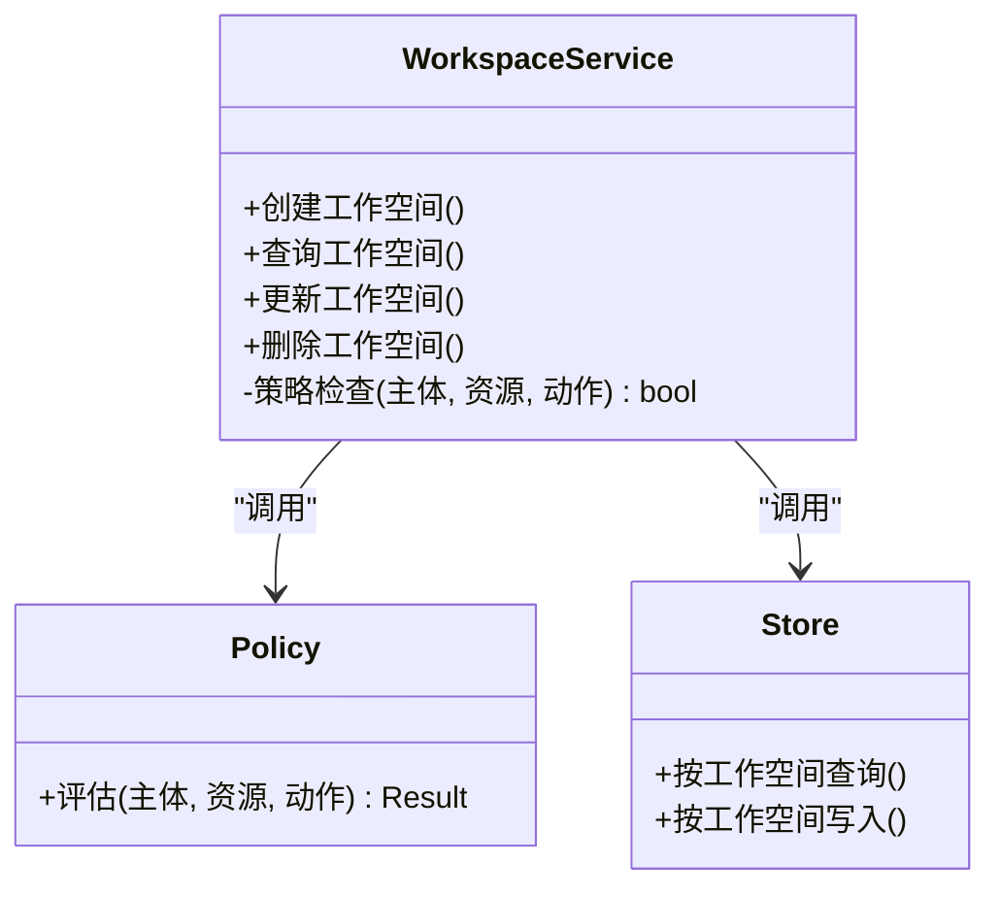
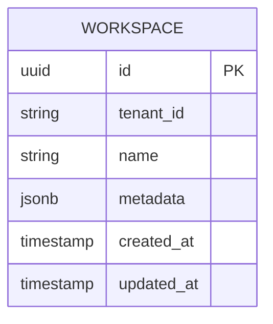
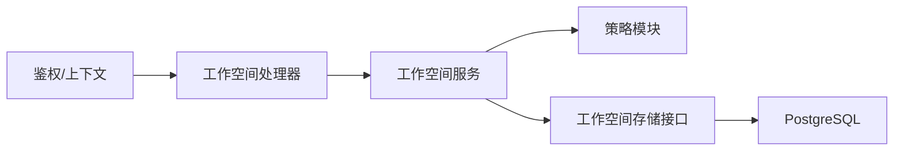

# 多租户隔离模式

<cite>
**本文引用的文件**   
- [apps/control-plane/cmd/control-plane/main.go](file://apps/control-plane/cmd/control-plane/main.go)
- [apps/control-plane/internal/gateway/auth.go](file://apps/control-plane/internal/gateway/auth.go)
- [apps/control-plane/internal/gateway/workspace_handler.go](file://apps/control-plane/internal/gateway/workspace_handler.go)
- [apps/control-plane/internal/workspace/service.go](file://apps/control-plane/internal/workspace/service.go)
- [apps/control-plane/internal/workspace/store.go](file://apps/control-plane/internal/workspace/store.go)
- [apps/control-plane/internal/workspace/postgres/store.go](file://apps/control-plane/internal/workspace/postgres/store.go)
- [apps/control-plane/internal/workspace/policy.go](file://apps/control-plane/internal/workspace/policy.go)
- [contracts/openapi/control-plane.v2.yaml](file://contracts/openapi/control-plane.v2.yaml)
- [contracts/schemas/workspace.v1.schema.json](file://contracts/schemas/workspace.v1.schema.json)
- [deploy/compose.yaml](file://deploy/compose.yaml)
</cite>

## 目录
1. [简介](#简介)
2. [项目结构](#项目结构)
3. [核心组件](#核心组件)
4. [架构总览](#架构总览)
5. [详细组件分析](#详细组件分析)
6. [依赖分析](#依赖分析)
7. [性能考虑](#性能考虑)
8. [故障排查指南](#故障排查指南)
9. [结论](#结论)
10. [附录](#附录)

## 简介
本文件面向 NeKiro 平台的多租户隔离模式，聚焦工作空间（Workspace）作为租户边界的设计与实现。文档覆盖以下主题：
- 资源隔离策略与数据隔离机制
- 权限模型与访问控制策略
- 租户标识传播与上下文管理
- 资源配额管理与限流策略
- 多租户架构图与数据隔离示意图
- 租户生命周期管理与迁移策略
- 安全考虑与性能优化方案

## 项目结构
NeKiro 的控制面位于 apps/control-plane，围绕“网关层 + 领域服务 + 持久化”的分层组织。多租户相关的关键路径包括：
- 网关鉴权与请求解析：从请求头/令牌中提取租户与工作空间标识，注入上下文
- 工作空间服务：基于工作空间 ID 进行业务编排、策略校验与调用路由
- 工作空间存储：以工作空间为维度进行数据读写，确保跨租户数据隔离
- OpenAPI 契约与 Schema：定义工作空间实体与 API 语义，约束输入输出

图表来源
- [apps/control-plane/internal/gateway/auth.go](file://apps/control-plane/internal/gateway/auth.go)
- [apps/control-plane/internal/gateway/workspace_handler.go](file://apps/control-plane/internal/gateway/workspace_handler.go)
- [apps/control-plane/internal/workspace/service.go](file://apps/control-plane/internal/workspace/service.go)
- [apps/control-plane/internal/workspace/store.go](file://apps/control-plane/internal/workspace/store.go)
- [apps/control-plane/internal/workspace/postgres/store.go](file://apps/control-plane/internal/workspace/postgres/store.go)
- [contracts/openapi/control-plane.v2.yaml](file://contracts/openapi/control-plane.v2.yaml)
- [contracts/schemas/workspace.v1.schema.json](file://contracts/schemas/workspace.v1.schema.json)

章节来源
- [apps/control-plane/cmd/control-plane/main.go](file://apps/control-plane/cmd/control-plane/main.go)
- [apps/control-plane/internal/gateway/auth.go](file://apps/control-plane/internal/gateway/auth.go)
- [apps/control-plane/internal/gateway/workspace_handler.go](file://apps/control-plane/internal/gateway/workspace_handler.go)
- [apps/control-plane/internal/workspace/service.go](file://apps/control-plane/internal/workspace/service.go)
- [apps/control-plane/internal/workspace/store.go](file://apps/control-plane/internal/workspace/store.go)
- [apps/control-plane/internal/workspace/postgres/store.go](file://apps/control-plane/internal/workspace/postgres/store.go)
- [contracts/openapi/control-plane.v2.yaml](file://contracts/openapi/control-plane.v2.yaml)
- [contracts/schemas/workspace.v1.schema.json](file://contracts/schemas/workspace.v1.schema.json)

## 核心组件
- 网关鉴权与上下文注入
  - 负责从请求中解析认证信息，提取租户与工作空间标识，并注入到后续处理链的上下文中
  - 对未携带或非法标识的请求进行拒绝，避免跨租户越权
- 工作空间服务
  - 在业务层强制使用工作空间上下文进行所有资源操作
  - 结合策略模块执行访问控制与能力校验
- 工作空间存储
  - 提供以工作空间为维度的数据访问抽象
  - 底层 Postgres 实现通过 SQL 条件强制附加工作空间过滤，保证数据隔离
- 策略与权限
  - 在工作空间服务内集成策略判断，决定某用户/角色是否具备对目标资源的访问能力
- 契约与约束
  - OpenAPI 契约定义工作空间相关 API 的语义与参数
  - Schema 对工作空间实体字段进行约束，保障数据一致性

章节来源
- [apps/control-plane/internal/gateway/auth.go](file://apps/control-plane/internal/gateway/auth.go)
- [apps/control-plane/internal/gateway/workspace_handler.go](file://apps/control-plane/internal/gateway/workspace_handler.go)
- [apps/control-plane/internal/workspace/service.go](file://apps/control-plane/internal/workspace/service.go)
- [apps/control-plane/internal/workspace/policy.go](file://apps/control-plane/internal/workspace/policy.go)
- [apps/control-plane/internal/workspace/store.go](file://apps/control-plane/internal/workspace/store.go)
- [apps/control-plane/internal/workspace/postgres/store.go](file://apps/control-plane/internal/workspace/postgres/store.go)
- [contracts/openapi/control-plane.v2.yaml](file://contracts/openapi/control-plane.v2.yaml)
- [contracts/schemas/workspace.v1.schema.json](file://contracts/schemas/workspace.v1.schema.json)

## 架构总览
下图展示多租户在多层的落地方式：网关层解析租户与工作空间，服务层以工作空间为边界进行策略与编排，存储层以工作空间为键进行数据隔离。

图表来源
- [apps/control-plane/internal/gateway/auth.go](file://apps/control-plane/internal/gateway/auth.go)
- [apps/control-plane/internal/gateway/workspace_handler.go](file://apps/control-plane/internal/gateway/workspace_handler.go)
- [apps/control-plane/internal/workspace/service.go](file://apps/control-plane/internal/workspace/service.go)
- [apps/control-plane/internal/workspace/policy.go](file://apps/control-plane/internal/workspace/policy.go)
- [apps/control-plane/internal/workspace/postgres/store.go](file://apps/control-plane/internal/workspace/postgres/store.go)

## 详细组件分析

### 组件A：网关鉴权与上下文注入
职责
- 解析认证信息，提取租户与工作空间标识
- 将标识注入到请求上下文，供下游服务使用
- 对缺失或非法标识进行快速失败

关键流程
- 读取请求头/令牌中的租户与工作空间标识
- 校验格式与有效性
- 将标识写入上下文并传递给处理器

图表来源
- [apps/control-plane/internal/gateway/auth.go](file://apps/control-plane/internal/gateway/auth.go)
- [apps/control-plane/internal/gateway/workspace_handler.go](file://apps/control-plane/internal/gateway/workspace_handler.go)

章节来源
- [apps/control-plane/internal/gateway/auth.go](file://apps/control-plane/internal/gateway/auth.go)
- [apps/control-plane/internal/gateway/workspace_handler.go](file://apps/control-plane/internal/gateway/workspace_handler.go)

### 组件B：工作空间服务与策略
职责
- 在服务层强制使用工作空间上下文进行所有资源操作
- 结合策略模块执行访问控制与能力校验
- 协调调用路由与编排

类关系图

图表来源
- [apps/control-plane/internal/workspace/service.go](file://apps/control-plane/internal/workspace/service.go)
- [apps/control-plane/internal/workspace/policy.go](file://apps/control-plane/internal/workspace/policy.go)
- [apps/control-plane/internal/workspace/store.go](file://apps/control-plane/internal/workspace/store.go)

章节来源
- [apps/control-plane/internal/workspace/service.go](file://apps/control-plane/internal/workspace/service.go)
- [apps/control-plane/internal/workspace/policy.go](file://apps/control-plane/internal/workspace/policy.go)
- [apps/control-plane/internal/workspace/store.go](file://apps/control-plane/internal/workspace/store.go)

### 组件C：工作空间存储与数据隔离
职责
- 提供以工作空间为维度的数据访问抽象
- 底层 Postgres 实现通过 SQL 条件强制附加工作空间过滤，确保跨租户数据隔离

数据模型图

图表来源
- [apps/control-plane/internal/workspace/postgres/store.go](file://apps/control-plane/internal/workspace/postgres/store.go)
- [contracts/schemas/workspace.v1.schema.json](file://contracts/schemas/workspace.v1.schema.json)

章节来源
- [apps/control-plane/internal/workspace/postgres/store.go](file://apps/control-plane/internal/workspace/postgres/store.go)
- [contracts/schemas/workspace.v1.schema.json](file://contracts/schemas/workspace.v1.schema.json)

### 组件D：API 契约与约束
职责
- 通过 OpenAPI 契约定义工作空间相关 API 的语义、参数与响应
- 通过 Schema 对工作空间实体字段进行约束，保障数据一致性

章节来源
- [contracts/openapi/control-plane.v2.yaml](file://contracts/openapi/control-plane.v2.yaml)
- [contracts/schemas/workspace.v1.schema.json](file://contracts/schemas/workspace.v1.schema.json)

## 依赖分析
- 组件耦合
  - 网关层依赖鉴权与上下文注入逻辑，向下传递租户与工作空间标识
  - 工作空间服务依赖策略模块与存储接口，遵循“先策略后数据”的顺序
  - 存储实现强依赖数据库连接与 SQL 构建，需确保所有查询均附带工作空间过滤
- 外部依赖
  - PostgreSQL 作为持久化后端
  - OpenAPI 契约用于前后端一致性与自动化测试

图表来源
- [apps/control-plane/internal/gateway/auth.go](file://apps/control-plane/internal/gateway/auth.go)
- [apps/control-plane/internal/gateway/workspace_handler.go](file://apps/control-plane/internal/gateway/workspace_handler.go)
- [apps/control-plane/internal/workspace/service.go](file://apps/control-plane/internal/workspace/service.go)
- [apps/control-plane/internal/workspace/policy.go](file://apps/control-plane/internal/workspace/policy.go)
- [apps/control-plane/internal/workspace/store.go](file://apps/control-plane/internal/workspace/store.go)
- [apps/control-plane/internal/workspace/postgres/store.go](file://apps/control-plane/internal/workspace/postgres/store.go)

章节来源
- [apps/control-plane/internal/gateway/auth.go](file://apps/control-plane/internal/gateway/auth.go)
- [apps/control-plane/internal/gateway/workspace_handler.go](file://apps/control-plane/internal/gateway/workspace_handler.go)
- [apps/control-plane/internal/workspace/service.go](file://apps/control-plane/internal/workspace/service.go)
- [apps/control-plane/internal/workspace/policy.go](file://apps/control-plane/internal/workspace/policy.go)
- [apps/control-plane/internal/workspace/store.go](file://apps/control-plane/internal/workspace/store.go)
- [apps/control-plane/internal/workspace/postgres/store.go](file://apps/control-plane/internal/workspace/postgres/store.go)

## 性能考虑
- 索引与查询优化
  - 在所有涉及工作空间的表上建立复合索引，优先包含工作空间键，提升按工作空间过滤的查询性能
- 连接池与并发
  - 合理配置数据库连接池大小，避免在高并发下出现连接耗尽
- 缓存策略
  - 对只读且变化不频繁的工作空间元数据进行缓存，降低热点查询压力
- 限流与背压
  - 在网关层实施基于租户与工作空间的速率限制，防止单租户占用过多资源
- 批处理与分页
  - 大数据量场景采用分页与批量操作，减少单次事务负载

[本节为通用指导，无需特定文件引用]

## 故障排查指南
常见问题与定位要点
- 鉴权失败
  - 检查请求头/令牌是否包含有效的租户与工作空间标识
  - 确认网关解析逻辑是否正确注入上下文
- 权限不足
  - 核对策略规则是否覆盖当前主体与资源动作
  - 验证策略配置是否随租户差异化生效
- 数据不可见或越权
  - 核查存储层 SQL 是否始终附加工作空间过滤条件
  - 审计日志中是否记录工作空间上下文
- 性能问题
  - 观察慢查询是否缺少工作空间索引
  - 监控连接池使用率与超时情况

章节来源
- [apps/control-plane/internal/gateway/auth.go](file://apps/control-plane/internal/gateway/auth.go)
- [apps/control-plane/internal/workspace/policy.go](file://apps/control-plane/internal/workspace/policy.go)
- [apps/control-plane/internal/workspace/postgres/store.go](file://apps/control-plane/internal/workspace/postgres/store.go)

## 结论
NeKiro 的多租户隔离以“工作空间”为核心边界，贯穿网关鉴权、服务编排与存储访问各层。通过在网关层解析与注入租户与工作空间标识，在服务层强制执行策略校验，并在存储层以工作空间为键进行数据隔离，平台实现了清晰、可审计且可扩展的多租户能力。配合合理的索引、缓存、限流与监控策略，可在保障安全性的同时获得良好的性能表现。

[本节为总结性内容，无需特定文件引用]

## 附录

### 租户标识传播与上下文管理
- 传播路径
  - 客户端 -> 网关鉴权 -> 工作空间处理器 -> 工作空间服务 -> 策略模块 -> 存储实现
- 上下文内容
  - 租户标识、工作空间标识、主体身份与角色
- 最佳实践
  - 所有中间层必须透传上下文，禁止丢弃或篡改
  - 在日志与追踪中记录工作空间上下文，便于审计与排障

章节来源
- [apps/control-plane/internal/gateway/auth.go](file://apps/control-plane/internal/gateway/auth.go)
- [apps/control-plane/internal/gateway/workspace_handler.go](file://apps/control-plane/internal/gateway/workspace_handler.go)
- [apps/control-plane/internal/workspace/service.go](file://apps/control-plane/internal/workspace/service.go)

### 资源配额与限流策略
- 配额维度
  - 按租户与工作空间维度统计资源使用（如并发、QPS、存储用量）
- 限流位置
  - 网关层实施全局与细粒度限流
  - 服务层对关键路径进行二次限流与熔断
- 告警与降级
  - 当接近配额阈值时触发告警与降级策略，保护系统稳定性

[本节为通用指导，无需特定文件引用]

### 租户生命周期管理与迁移策略
- 生命周期阶段
  - 创建、激活、暂停、恢复、归档、删除
- 迁移策略
  - 数据迁移需保持工作空间键不变，确保历史数据可追溯
  - 版本兼容：新旧版本并行运行期间，确保 API 与 Schema 向后兼容
- 回滚与演练
  - 制定回滚计划并进行演练，确保变更风险可控

[本节为通用指导，无需特定文件引用]

### 安全考虑
- 最小权限原则
  - 仅授予必要的访问能力，默认拒绝
- 输入校验与输出净化
  - 严格校验工作空间标识与输入参数，防止注入与越权
- 审计与合规
  - 记录关键操作的租户与工作空间上下文，满足审计要求

[本节为通用指导，无需特定文件引用]

### 部署与环境
- 容器编排
  - 使用 Compose 启动控制面与数据库，便于本地开发与演示
- 环境变量
  - 数据库连接、日志级别、限流阈值等通过环境变量注入

章节来源
- [deploy/compose.yaml](file://deploy/compose.yaml)