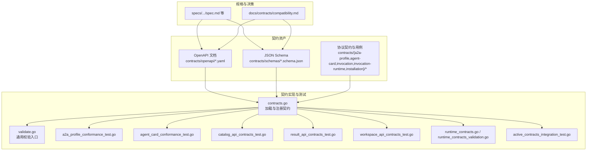
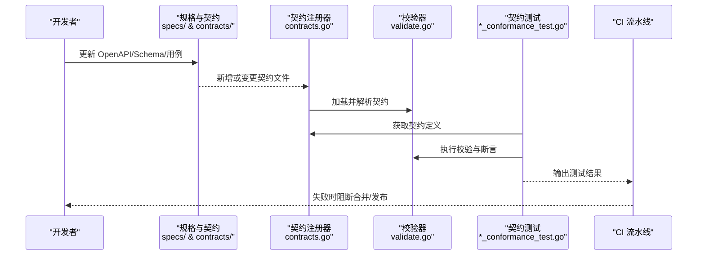
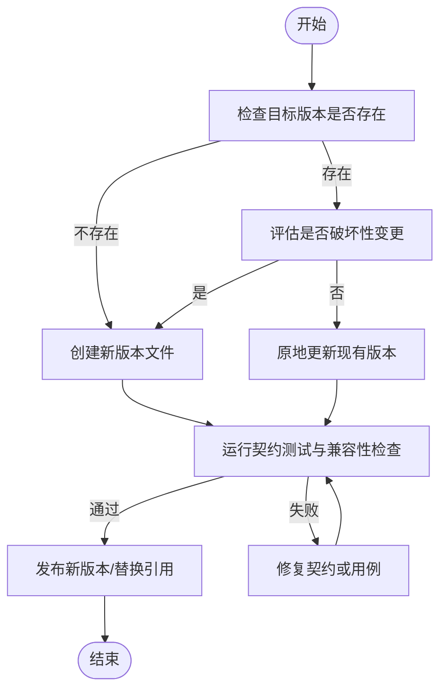
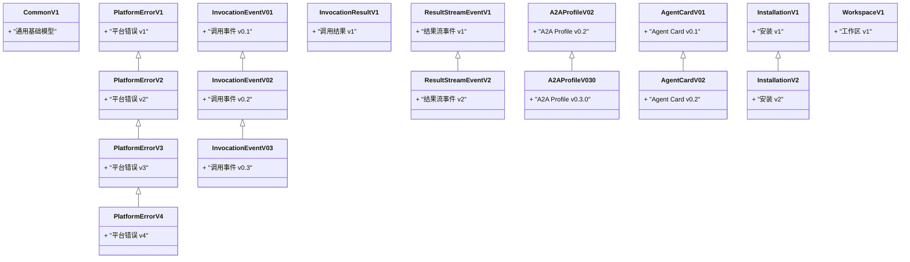
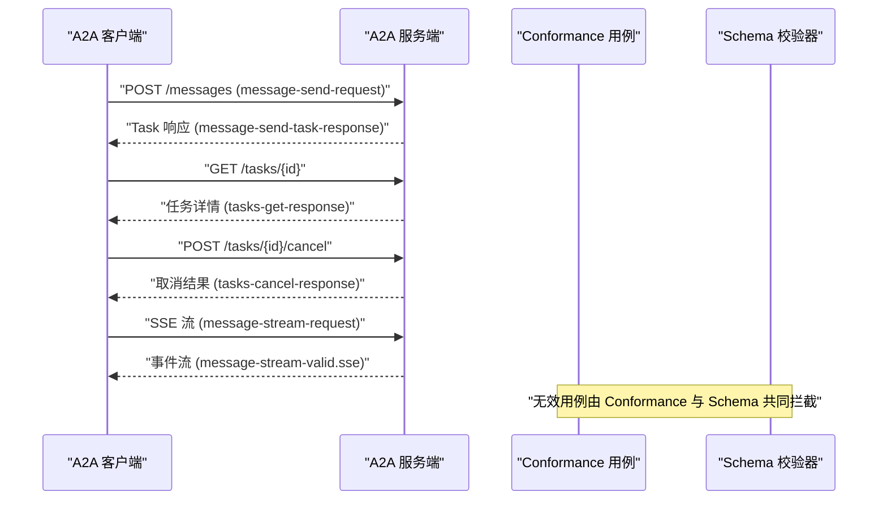
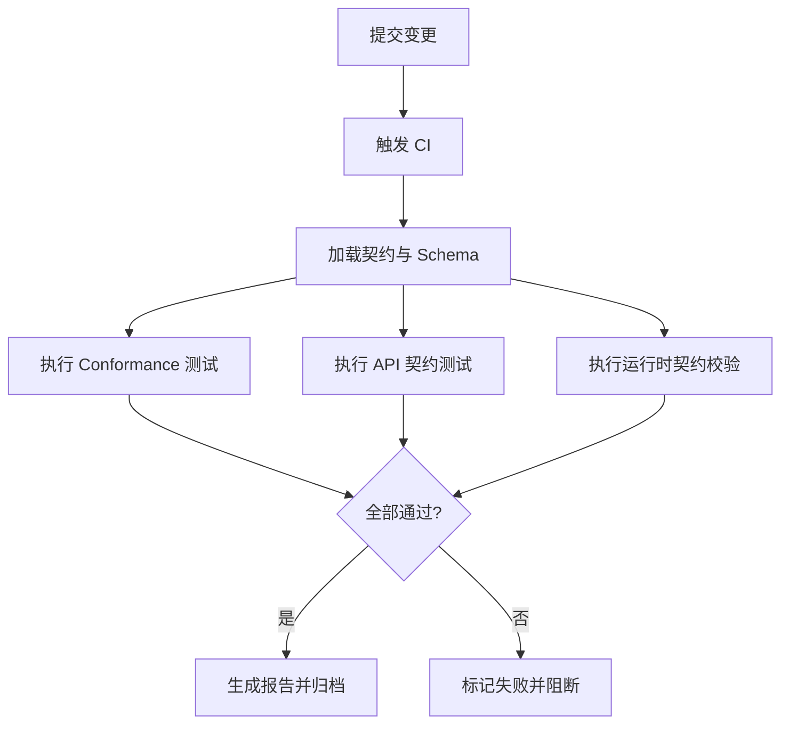
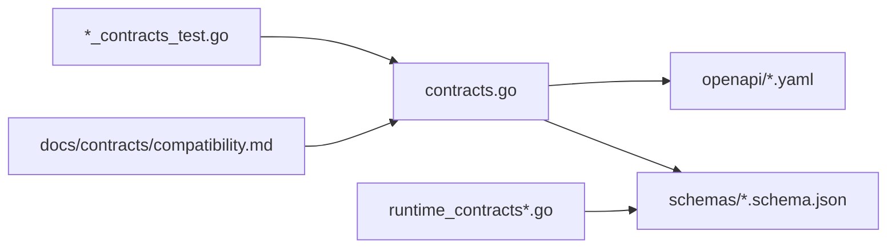

# 契约驱动开发模式

<cite>
**本文引用的文件**   
- [README.md](file://README.md)
- [contracts/contracts.go](file://contracts/contracts.go)
- [contracts/validate.go](file://contracts/validate.go)
- [contracts/a2a_profile_conformance_test.go](file://contracts/a2a_profile_conformance_test.go)
- [contracts/agent_card_conformance_test.go](file://contracts/agent_card_conformance_test.go)
- [contracts/catalog_api_contracts_test.go](file://contracts/catalog_api_contracts_test.go)
- [contracts/result_api_contracts_test.go](file://contracts/result_api_contracts_test.go)
- [contracts/workspace_api_contracts_test.go](file://contracts/workspace_api_contracts_test.go)
- [contracts/runtime_contracts.go](file://contracts/runtime_contracts.go)
- [contracts/runtime_contracts_validation.go](file://contracts/runtime_contracts_validation.go)
- [contracts/active_contracts_integration_test.go](file://contracts/active_contracts_integration_test.go)
- [contracts/openapi/control-plane.v1.yaml](file://contracts/openapi/control-plane.v1.yaml)
- [contracts/openapi/control-plane.v2.yaml](file://contracts/openapi/control-plane.v2.yaml)
- [contracts/openapi/control-plane.v3.yaml](file://contracts/openapi/control-plane.v3.yaml)
- [contracts/openapi/control-plane-invocation.v4.yaml](file://contracts/openapi/control-plane-invocation.v4.yaml)
- [contracts/openapi/router-agent.v1.yaml](file://contracts/openapi/router-agent.v1.yaml)
- [contracts/openapi/router-internal.v1.yaml](file://contracts/openapi/router-internal.v1.yaml)
- [contracts/openapi/router-internal.v2.yaml](file://contracts/openapi/router-internal.v2.yaml)
- [contracts/openapi/router-internal.v3.yaml](file://contracts/openapi/router-internal.v3.yaml)
- [contracts/schemas/common.v1.schema.json](file://contracts/schemas/common.v1.schema.json)
- [contracts/schemas/platform-error.v1.schema.json](file://contracts/schemas/platform-error.v1.schema.json)
- [contracts/schemas/platform-error.v2.schema.json](file://contracts/schemas/platform-error.v2.schema.json)
- [contracts/schemas/platform-error.v3.schema.json](file://contracts/schemas/platform-error.v3.schema.json)
- [contracts/schemas/platform-error.v4.schema.json](file://contracts/schemas/platform-error.v4.schema.json)
- [contracts/schemas/invocation-result.v1.schema.json](file://contracts/schemas/invocation-result.v1.schema.json)
- [contracts/schemas/invocation-event.v0.1.schema.json](file://contracts/schemas/invocation-event.v0.1.schema.json)
- [contracts/schemas/invocation-event.v0.2.schema.json](file://contracts/schemas/invocation-event.v0.2.schema.json)
- [contracts/schemas/invocation-event.v0.3.schema.json](file://contracts/schemas/invocation-event.v0.3.schema.json)
- [contracts/schemas/invocation-result-stream-event.v1.schema.json](file://contracts/schemas/invocation-result-stream-event.v1.schema.json)
- [contracts/schemas/invocation-result-stream-event.v2.schema.json](file://contracts/schemas/invocation-result-stream-event.v2.schema.json)
- [contracts/schemas/a2a-profile.v0.2.schema.json](file://contracts/schemas/a2a-profile.v0.2.schema.json)
- [contracts/schemas/a2a-profile.v0.3.0.schema.json](file://contracts/schemas/a2a-profile.v0.3.0.schema.json)
- [contracts/schemas/agent-card.v0.1.schema.json](file://contracts/schemas/agent-card.v0.1.schema.json)
- [contracts/schemas/agent-card.v0.2.schema.json](file://contracts/schemas/agent-card.v0.2.schema.json)
- [contracts/schemas/installation.v1.schema.json](file://contracts/schemas/installation.v1.schema.json)
- [contracts/schemas/installation.v2.schema.json](file://contracts/schemas/installation.v2.schema.json)
- [contracts/schemas/workspace.v1.schema.json](file://contracts/schemas/workspace.v1.schema.json)
- [contracts/a2a-profile/v0.3.0/profile.v0.2.json](file://contracts/a2a-profile/v0.3.0/profile.v0.2.json)
- [contracts/a2a-profile/v0.3.0/conformance/manifest.json](file://contracts/a2a-profile/v0.3.0/conformance/manifest.json)
- [contracts/a2a-profile/v0.3.0/conformance/message-send-request.json](file://contracts/a2a-profile/v0.3.0/conformance/message-send-request.json)
- [contracts/a2a-profile/v0.3.0/conformance/message-send-task-response.json](file://contracts/a2a-profile/v0.3.0/conformance/message-send-task-response.json)
- [contracts/a2a-profile/v0.3.0/conformance/tasks-get-request.json](file://contracts/a2a-profile/v0.3.0/conformance/tasks-get-request.json)
- [contracts/a2a-profile/v0.3.0/conformance/tasks-get-response.json](file://contracts/a2a-profile/v0.3.0/conformance/tasks-get-response.json)
- [contracts/a2a-profile/v0.3.0/conformance/tasks-cancel-request.json](file://contracts/a2a-profile/v0.3.0/conformance/tasks-cancel-request.json)
- [contracts/a2a-profile/v0.3.0/conformance/tasks-cancel-response.json](file://contracts/a2a-profile/v0.3.0/conformance/tasks-cancel-not-found-response.json)
- [contracts/a2a-profile/v0.3.0/conformance/message-stream-request.json](file://contracts/a2a-profile/v0.3.0/conformance/message-stream-request.json)
- [contracts/a2a-profile/v0.3.0/conformance/message-stream-valid.sse](file://contracts/a2a-profile/v0.3.0/conformance/message-stream-valid.sse)
- [contracts/a2a-profile/v0.3.0/conformance/message-stream-artifact-after-last-chunk.sse](file://contracts/a2a-profile/v0.3.0/conformance/message-stream-artifact-after-last-chunk.sse)
- [contracts/a2a-profile/v0.3.0/conformance/message-stream-context-mismatch.sse](file://contracts/a2a-profile/v0.3.0/conformance/message-stream-context-mismatch.sse)
- [contracts/a2a-profile/v0.3.0/conformance/message-stream-eof-without-terminal.sse](file://contracts/a2a-profile/v0.3.0/conformance/message-stream-eof-without-terminal.sse)
- [contracts/a2a-profile/v0.3.0/conformance/message-stream-event-after-terminal.sse](file://contracts/a2a-profile/v0.3.0/conformance/message-stream-event-after-terminal.sse)
- [contracts/a2a-profile/v0.3.0/conformance/invalid-array-response-id-response.json](file://contracts/a2a-profile/v0.3.0/conformance/invalid-array-response-id-response.json)
- [contracts/a2a-profile/v0.3.0/conformance/invalid-boolean-response-id-response.json](file://contracts/a2a-profile/v0.3.0/conformance/invalid-boolean-response-id-response.json)
- [contracts/a2a-profile/v0.3.0/conformance/invalid-jsonrpc-version-response.json](file://contracts/a2a-profile/v0.3.0/conformance/invalid-jsonrpc-version-response.json)
- [contracts/a2a-profile/v0.3.0/conformance/invalid-missing-result-and-error-response.json](file://contracts/a2a-profile/v0.3.0/conformance/invalid-missing-result-and-error-response.json)
- [contracts/a2a-profile/v0.3.0/conformance/invalid-object-response-id-response.json](file://contracts/a2a-profile/v0.3.0/conformance/invalid-object-response-id-response.json)
- [contracts/a2a-profile/v0.3.0/conformance/invalid-response-id-response.json](file://contracts/a2a-profile/v0.3.0/conformance/invalid-response-id-response.json)
- [contracts/a2a-profile/v0.3.0/conformance/message-send-empty-id-response.json](file://contracts/a2a-profile/v0.3.0/conformance/message-send-empty-id-response.json)
- [contracts/a2a-profile/v0.3.0/conformance/message-send-invalid-kind-response.json](file://contracts/a2a-profile/v0.3.0/conformance/message-send-invalid-kind-response.json)
- [contracts/a2a-profile/v0.3.0/conformance/message-send-no-parts-response.json](file://contracts/a2a-profile/v0.3.0/conformance/message-send-no-parts-response.json)
- [contracts/a2a-profile/v0.3.0/conformance/message-send-user-role-response.json](file://contracts/a2a-profile/v0.3.0/conformance/message-send-user-role-response.json)
- [contracts/a2a-profile/v0.3.0/conformance/tasks-get-arbitrary-state-response.json](file://contracts/a2a-profile/v0.3.0/conformance/tasks-get-arbitrary-state-response.json)
- [contracts/a2a-profile/v0.3.0/conformance/tasks-get-auth-required-response.json](file://contracts/a2a-profile/v0.3.0/conformance/tasks-get-auth-required-response.json)
- [contracts/a2a-profile/v0.3.0/conformance/tasks-get-not-found-response.json](file://contracts/a2a-profile/v0.3.0/conformance/tasks-get-not-found-response.json)
- [contracts/a2a-profile/v0.3.0/conformance/tasks-get-rejected-response.json](file://contracts/a2a-profile/v0.3.0/conformance/tasks-get-rejected-response.json)
- [contracts/a2a-profile/v0.3.0/conformance/tasks-cancel-not-cancelable-response.json](file://contracts/a2a-profile/v0.3.0/conformance/tasks-cancel-not-cancelable-response.json)
- [contracts/agent-card/v0.2/conformance/manifest.json](file://contracts/agent-card/v0.2/conformance/manifest.json)
- [contracts/agent-card/v0.2/conformance/valid-baseline.json](file://contracts/agent-card/v0.2/conformance/valid-baseline.json)
- [contracts/agent-card/v0.2/conformance/invalid-structural-missing-name.json](file://contracts/agent-card/v0.2/conformance/invalid-structural-missing-name.json)
- [contracts/agent-card/v0.2/conformance/semantic-rules.md](file://contracts/agent-card/v0.2/semantic-rules.md)
- [contracts/invocation/v1/conformance/manifest.json](file://contracts/invocation/v1/conformance/manifest.json)
- [contracts/invocation/v1/conformance/event-matching-correlation.json](file://contracts/invocation/v1/conformance/event-matching-correlation.json)
- [contracts/invocation/v1/conformance/stream-matching-correlation.json](file://contracts/invocation/v1/conformance/stream-matching-correlation.json)
- [contracts/invocation-runtime/v1/conformance/manifest.json](file://contracts/invocation-runtime/v1/conformance/manifest.json)
- [contracts/invocation-runtime/v1/conformance/errors.json](file://contracts/invocation-runtime/v1/conformance/errors.json)
- [contracts/invocation-runtime/v1/conformance/lifecycle.json](file://contracts/invocation-runtime/v1/conformance/lifecycle.json)
- [contracts/invocation-runtime/v1/conformance/media.json](file://contracts/invocation-runtime/v1/conformance/media.json)
- [contracts/invocation-runtime/v1/conformance/nested.json](file://contracts/invocation-runtime/v1/conformance/nested.json)
- [contracts/invocation-runtime/v1/conformance/projection.json](file://contracts/invocation-runtime/v1/conformance/projection.json)
- [contracts/invocation-runtime/v1/conformance/result-stream.json](file://contracts/invocation-runtime/v1/conformance/result-stream.json)
- [contracts/installation/v2/semantic-rules.md](file://contracts/installation/v2/semantic-rules.md)
- [contracts/invocation/v1/semantic-rules.md](file://contracts/invocation/v1/semantic-rules.md)
- [contracts/runtime_contracts_test.go](file://contracts/runtime_contracts_test.go)
- [contracts/result_contracts.go](file://contracts/result_contracts.go)
- [contracts/result_contracts_test.go](file://contracts/result_contracts_test.go)
- [contracts/agent_card_semantics.go](file://contracts/agent_card_semantics.go)
- [contracts/installation_contracts.go](file://contracts/installation_contracts.go)
- [docs/contracts/compatibility.md](file://docs/contracts/compatibility.md)
- [specs/001-complete-invocation-contracts/spec.md](file://specs/001-complete-invocation-contracts/spec.md)
- [specs/001-complete-invocation-contracts/data-model.md](file://specs/001-complete-invocation-contracts/data-model.md)
- [specs/001-complete-invocation-contracts/contracts/a2a-conformance.md](file://specs/001-complete-invocation-contracts/contracts/a2a-conformance.md)
- [specs/001-complete-invocation-contracts/contracts/directional-internal-api.md](file://specs/001-complete-invocation-contracts/contracts/directional-internal-api.md)
- [specs/001-complete-invocation-contracts/contracts/result-delivery.md](file://specs/001-complete-invocation-contracts/contracts/result-delivery.md)
- [specs/001-complete-invocation-contracts/plan.md](file://specs/001-complete-invocation-contracts/plan.md)
- [specs/001-complete-invocation-contracts/tasks.md](file://specs/001-complete-invocation-contracts/tasks.md)
- [specs/001-complete-invocation-contracts/research.md](file://specs/001-complete-invocation-contracts/research.md)
- [specs/001-complete-invocation-contracts/quickstart.md](file://specs/001-complete-invocation-contracts/quickstart.md)
- [specs/001-complete-invocation-contracts/checklists/requirements.md](file://specs/001-complete-invocation-contracts/checklists/requirements.md)
</cite>

## 目录
1. [简介](#简介)
2. [项目结构](#项目结构)
3. [核心组件](#核心组件)
4. [架构总览](#架构总览)
5. [详细组件分析](#详细组件分析)
6. [依赖分析](#依赖分析)
7. [性能考虑](#性能考虑)
8. [故障排查指南](#故障排查指南)
9. [结论](#结论)
10. [附录](#附录)

## 简介
本文件面向 NeKiro 平台，系统化阐述“契约驱动开发（Contract-Driven Development, CDD）”模式在平台中的落地实践。内容覆盖：
- 基于 OpenAPI 规范的 API 设计与版本管理策略
- JSON Schema 在数据验证与约束定义中的作用
- A2A 协议的契约定义与兼容性保证机制
- 契约测试的实施方式与自动化验证流程
- 契约文件结构与命名规范
- 契约变更的管理流程与向后兼容策略
- 契约驱动对团队协作与质量保证的价值

## 项目结构
NeKiro 将契约资产集中沉淀于 contracts 目录，按协议域与版本进行组织；OpenAPI 文档位于 contracts/openapi；JSON Schema 位于 contracts/schemas；各协议的 conformance 用例与语义规则分别存放于对应子目录。Go 侧的契约校验、测试与运行时契约逻辑集中在 contracts 包中。

图表来源
- [contracts/contracts.go](file://contracts/contracts.go)
- [contracts/validate.go](file://contracts/validate.go)
- [contracts/a2a_profile_conformance_test.go](file://contracts/a2a_profile_conformance_test.go)
- [contracts/agent_card_conformance_test.go](file://contracts/agent_card_conformance_test.go)
- [contracts/catalog_api_contracts_test.go](file://contracts/catalog_api_contracts_test.go)
- [contracts/result_api_contracts_test.go](file://contracts/result_api_contracts_test.go)
- [contracts/workspace_api_contracts_test.go](file://contracts/workspace_api_contracts_test.go)
- [contracts/runtime_contracts.go](file://contracts/runtime_contracts.go)
- [contracts/runtime_contracts_validation.go](file://contracts/runtime_contracts_validation.go)
- [contracts/active_contracts_integration_test.go](file://contracts/active_contracts_integration_test.go)
- [docs/contracts/compatibility.md](file://docs/contracts/compatibility.md)

章节来源
- [contracts/contracts.go](file://contracts/contracts.go)
- [contracts/validate.go](file://contracts/validate.go)
- [contracts/a2a_profile_conformance_test.go](file://contracts/a2a_profile_conformance_test.go)
- [contracts/agent_card_conformance_test.go](file://contracts/agent_card_conformance_test.go)
- [contracts/catalog_api_contracts_test.go](file://contracts/catalog_api_contracts_test.go)
- [contracts/result_api_contracts_test.go](file://contracts/result_api_contracts_test.go)
- [contracts/workspace_api_contracts_test.go](file://contracts/workspace_api_contracts_test.go)
- [contracts/runtime_contracts.go](file://contracts/runtime_contracts.go)
- [contracts/runtime_contracts_validation.go](file://contracts/runtime_contracts_validation.go)
- [contracts/active_contracts_integration_test.go](file://contracts/active_contracts_integration_test.go)
- [docs/contracts/compatibility.md](file://docs/contracts/compatibility.md)

## 核心组件
- 契约注册与发现：通过统一的契约注册器集中管理 OpenAPI 与 JSON Schema，供测试与运行时使用。
- 通用校验器：提供 JSON Schema 校验能力，贯穿 API 请求/响应、事件与流式结果。
- 协议级契约：
  - A2A Profile：消息发送、任务查询、取消、SSE 流式传输等用例与无效用例集合。
  - Agent Card：结构性与语义规则校验。
  - Invocation：调用事件与流匹配规则。
  - Invocation Runtime：生命周期、错误、媒体类型、嵌套、投影、结果流等。
  - Installation：安装相关语义规则。
- 集成与回归测试：针对控制面、路由、结果投递、工作区等 API 的契约测试。
- 兼容性策略：在 docs/contracts/compatibility.md 中明确向后兼容原则与演进策略。

章节来源
- [contracts/contracts.go](file://contracts/contracts.go)
- [contracts/validate.go](file://contracts/validate.go)
- [contracts/a2a_profile_conformance_test.go](file://contracts/a2a_profile_conformance_test.go)
- [contracts/agent_card_conformance_test.go](file://contracts/agent_card_conformance_test.go)
- [contracts/runtime_contracts.go](file://contracts/runtime_contracts.go)
- [contracts/runtime_contracts_validation.go](file://contracts/runtime_contracts_validation.go)
- [docs/contracts/compatibility.md](file://docs/contracts/compatibility.md)

## 架构总览
契约驱动的整体架构围绕“契约即事实源”，以 OpenAPI 和 JSON Schema 为权威描述，结合 conformance 用例与语义规则，形成从设计到实现的闭环。

图表来源
- [contracts/contracts.go](file://contracts/contracts.go)
- [contracts/validate.go](file://contracts/validate.go)
- [contracts/a2a_profile_conformance_test.go](file://contracts/a2a_profile_conformance_test.go)
- [contracts/agent_card_conformance_test.go](file://contracts/agent_card_conformance_test.go)
- [contracts/catalog_api_contracts_test.go](file://contracts/catalog_api_contracts_test.go)
- [contracts/result_api_contracts_test.go](file://contracts/result_api_contracts_test.go)
- [contracts/workspace_api_contracts_test.go](file://contracts/workspace_api_contracts_test.go)

## 详细组件分析

### OpenAPI 设计与版本管理
- 版本化策略：采用路径与文件名显式版本，如 control-plane.v1.yaml、control-plane.v2.yaml、router-internal.v1.yaml 等，便于并行维护多版本。
- 分层边界：区分对外 API（如 router-agent）、内部 API（router-internal、control-plane-internal）与调用面（control-plane-invocation），明确不同消费方与稳定性承诺。
- 变更治理：新增版本不破坏既有版本；旧版本保留至迁移完成；新特性优先以新版本暴露。

图表来源
- [contracts/openapi/control-plane.v1.yaml](file://contracts/openapi/control-plane.v1.yaml)
- [contracts/openapi/control-plane.v2.yaml](file://contracts/openapi/control-plane.v2.yaml)
- [contracts/openapi/control-plane.v3.yaml](file://contracts/openapi/control-plane.v3.yaml)
- [contracts/openapi/control-plane-invocation.v4.yaml](file://contracts/openapi/control-plane-invocation.v4.yaml)
- [contracts/openapi/router-agent.v1.yaml](file://contracts/openapi/router-agent.v1.yaml)
- [contracts/openapi/router-internal.v1.yaml](file://contracts/openapi/router-internal.v1.yaml)
- [contracts/openapi/router-internal.v2.yaml](file://contracts/openapi/router-internal.v2.yaml)
- [contracts/openapi/router-internal.v3.yaml](file://contracts/openapi/router-internal.v3.yaml)

章节来源
- [contracts/openapi/control-plane.v1.yaml](file://contracts/openapi/control-plane.v1.yaml)
- [contracts/openapi/control-plane.v2.yaml](file://contracts/openapi/control-plane.v2.yaml)
- [contracts/openapi/control-plane.v3.yaml](file://contracts/openapi/control-plane.v3.yaml)
- [contracts/openapi/control-plane-invocation.v4.yaml](file://contracts/openapi/control-plane-invocation.v4.yaml)
- [contracts/openapi/router-agent.v1.yaml](file://contracts/openapi/router-agent.v1.yaml)
- [contracts/openapi/router-internal.v1.yaml](file://contracts/openapi/router-internal.v1.yaml)
- [contracts/openapi/router-internal.v2.yaml](file://contracts/openapi/router-internal.v2.yaml)
- [contracts/openapi/router-internal.v3.yaml](file://contracts/openapi/router-internal.v3.yaml)

### JSON Schema 数据验证与约束
- 作用范围：用于校验平台错误、通用模型、工作区、安装、A2A Profile、Agent Card、调用事件与结果流等。
- 约束要点：字段必填、枚举值、格式、最小/最大长度、数组项约束、对象嵌套结构等。
- 版本化：同 OpenAPI，按 schema 版本独立演进，避免跨版本耦合。

图表来源
- [contracts/schemas/common.v1.schema.json](file://contracts/schemas/common.v1.schema.json)
- [contracts/schemas/platform-error.v1.schema.json](file://contracts/schemas/platform-error.v1.schema.json)
- [contracts/schemas/platform-error.v2.schema.json](file://contracts/schemas/platform-error.v2.schema.json)
- [contracts/schemas/platform-error.v3.schema.json](file://contracts/schemas/platform-error.v3.schema.json)
- [contracts/schemas/platform-error.v4.schema.json](file://contracts/schemas/platform-error.v4.schema.json)
- [contracts/schemas/invocation-event.v0.1.schema.json](file://contracts/schemas/invocation-event.v0.1.schema.json)
- [contracts/schemas/invocation-event.v0.2.schema.json](file://contracts/schemas/invocation-event.v0.2.schema.json)
- [contracts/schemas/invocation-event.v0.3.schema.json](file://contracts/schemas/invocation-event.v0.3.schema.json)
- [contracts/schemas/invocation-result.v1.schema.json](file://contracts/schemas/invocation-result.v1.schema.json)
- [contracts/schemas/invocation-result-stream-event.v1.schema.json](file://contracts/schemas/invocation-result-stream-event.v1.schema.json)
- [contracts/schemas/invocation-result-stream-event.v2.schema.json](file://contracts/schemas/invocation-result-stream-event.v2.schema.json)
- [contracts/schemas/a2a-profile.v0.2.schema.json](file://contracts/schemas/a2a-profile.v0.2.schema.json)
- [contracts/schemas/a2a-profile.v0.3.0.schema.json](file://contracts/schemas/a2a-profile.v0.3.0.schema.json)
- [contracts/schemas/agent-card.v0.1.schema.json](file://contracts/schemas/agent-card.v0.1.schema.json)
- [contracts/schemas/agent-card.v0.2.schema.json](file://contracts/schemas/agent-card.v0.2.schema.json)
- [contracts/schemas/installation.v1.schema.json](file://contracts/schemas/installation.v1.schema.json)
- [contracts/schemas/installation.v2.schema.json](file://contracts/schemas/installation.v2.schema.json)
- [contracts/schemas/workspace.v1.schema.json](file://contracts/schemas/workspace.v1.schema.json)

章节来源
- [contracts/schemas/common.v1.schema.json](file://contracts/schemas/common.v1.schema.json)
- [contracts/schemas/platform-error.v1.schema.json](file://contracts/schemas/platform-error.v1.schema.json)
- [contracts/schemas/platform-error.v2.schema.json](file://contracts/schemas/platform-error.v2.schema.json)
- [contracts/schemas/platform-error.v3.schema.json](file://contracts/schemas/platform-error.v3.schema.json)
- [contracts/schemas/platform-error.v4.schema.json](file://contracts/schemas/platform-error.v4.schema.json)
- [contracts/schemas/invocation-event.v0.1.schema.json](file://contracts/schemas/invocation-event.v0.1.schema.json)
- [contracts/schemas/invocation-event.v0.2.schema.json](file://contracts/schemas/invocation-event.v0.2.schema.json)
- [contracts/schemas/invocation-event.v0.3.schema.json](file://contracts/schemas/invocation-event.v0.3.schema.json)
- [contracts/schemas/invocation-result.v1.schema.json](file://contracts/schemas/invocation-result.v1.schema.json)
- [contracts/schemas/invocation-result-stream-event.v1.schema.json](file://contracts/schemas/invocation-result-stream-event.v1.schema.json)
- [contracts/schemas/invocation-result-stream-event.v2.schema.json](file://contracts/schemas/invocation-result-stream-event.v2.schema.json)
- [contracts/schemas/a2a-profile.v0.2.schema.json](file://contracts/schemas/a2a-profile.v0.2.schema.json)
- [contracts/schemas/a2a-profile.v0.3.0.schema.json](file://contracts/schemas/a2a-profile.v0.3.0.schema.json)
- [contracts/schemas/agent-card.v0.1.schema.json](file://contracts/schemas/agent-card.v0.1.schema.json)
- [contracts/schemas/agent-card.v0.2.schema.json](file://contracts/schemas/agent-card.v0.2.schema.json)
- [contracts/schemas/installation.v1.schema.json](file://contracts/schemas/installation.v1.schema.json)
- [contracts/schemas/installation.v2.schema.json](file://contracts/schemas/installation.v2.schema.json)
- [contracts/schemas/workspace.v1.schema.json](file://contracts/schemas/workspace.v1.schema.json)

### A2A 协议契约与兼容性保证
- 契约范围：消息发送、任务查询/取消、SSE 流式传输、上下文与 ID 一致性、错误与状态组合等。
- 兼容性保证：
  - 正向兼容：服务端可接受客户端更宽松的字段（在不破坏语义前提下）。
  - 反向兼容：客户端需忽略未知字段，遵循“已知最小集”。
  - 版本隔离：profile 与 schema 均按版本演进，避免强耦合。
- 用例覆盖：包含有效路径与大量无效路径（如非法 id、缺失 result/error、SSE 乱序等），确保鲁棒性。

图表来源
- [contracts/a2a-profile/v0.3.0/profile.v0.2.json](file://contracts/a2a-profile/v0.3.0/profile.v0.2.json)
- [contracts/a2a-profile/v0.3.0/conformance/manifest.json](file://contracts/a2a-profile/v0.3.0/conformance/manifest.json)
- [contracts/a2a-profile/v0.3.0/conformance/message-send-request.json](file://contracts/a2a-profile/v0.3.0/conformance/message-send-request.json)
- [contracts/a2a-profile/v0.3.0/conformance/message-send-task-response.json](file://contracts/a2a-profile/v0.3.0/conformance/message-send-task-response.json)
- [contracts/a2a-profile/v0.3.0/conformance/tasks-get-request.json](file://contracts/a2a-profile/v0.3.0/conformance/tasks-get-request.json)
- [contracts/a2a-profile/v0.3.0/conformance/tasks-get-response.json](file://contracts/a2a-profile/v0.3.0/conformance/tasks-get-response.json)
- [contracts/a2a-profile/v0.3.0/conformance/tasks-cancel-request.json](file://contracts/a2a-profile/v0.3.0/conformance/tasks-cancel-request.json)
- [contracts/a2a-profile/v0.3.0/conformance/tasks-cancel-response.json](file://contracts/a2a-profile/v0.3.0/conformance/tasks-cancel-response.json)
- [contracts/a2a-profile/v0.3.0/conformance/message-stream-request.json](file://contracts/a2a-profile/v0.3.0/conformance/message-stream-request.json)
- [contracts/a2a-profile/v0.3.0/conformance/message-stream-valid.sse](file://contracts/a2a-profile/v0.3.0/conformance/message-stream-valid.sse)
- [contracts/a2a-profile/v0.3.0/conformance/message-stream-artifact-after-last-chunk.sse](file://contracts/a2a-profile/v0.3.0/conformance/message-stream-artifact-after-last-chunk.sse)
- [contracts/a2a-profile/v0.3.0/conformance/message-stream-context-mismatch.sse](file://contracts/a2a-profile/v0.3.0/conformance/message-stream-context-mismatch.sse)
- [contracts/a2a-profile/v0.3.0/conformance/message-stream-eof-without-terminal.sse](file://contracts/a2a-profile/v0.3.0/conformance/message-stream-eof-without-terminal.sse)
- [contracts/a2a-profile/v0.3.0/conformance/message-stream-event-after-terminal.sse](file://contracts/a2a-profile/v0.3.0/conformance/message-stream-event-after-terminal.sse)
- [contracts/a2a-profile/v0.3.0/conformance/invalid-array-response-id-response.json](file://contracts/a2a-profile/v0.3.0/conformance/invalid-array-response-id-response.json)
- [contracts/a2a-profile/v0.3.0/conformance/invalid-boolean-response-id-response.json](file://contracts/a2a-profile/v0.3.0/conformance/invalid-boolean-response-id-response.json)
- [contracts/a2a-profile/v0.3.0/conformance/invalid-jsonrpc-version-response.json](file://contracts/a2a-profile/v0.3.0/conformance/invalid-jsonrpc-version-response.json)
- [contracts/a2a-profile/v0.3.0/conformance/invalid-missing-result-and-error-response.json](file://contracts/a2a-profile/v0.3.0/conformance/invalid-missing-result-and-error-response.json)
- [contracts/a2a-profile/v0.3.0/conformance/invalid-object-response-id-response.json](file://contracts/a2a-profile/v0.3.0/conformance/invalid-object-response-id-response.json)
- [contracts/a2a-profile/v0.3.0/conformance/invalid-response-id-response.json](file://contracts/a2a-profile/v0.3.0/conformance/invalid-response-id-response.json)
- [contracts/a2a-profile/v0.3.0/conformance/message-send-empty-id-response.json](file://contracts/a2a-profile/v0.3.0/conformance/message-send-empty-id-response.json)
- [contracts/a2a-profile/v0.3.0/conformance/message-send-invalid-kind-response.json](file://contracts/a2a-profile/v0.3.0/conformance/message-send-invalid-kind-response.json)
- [contracts/a2a-profile/v0.3.0/conformance/message-send-no-parts-response.json](file://contracts/a2a-profile/v0.3.0/conformance/message-send-no-parts-response.json)
- [contracts/a2a-profile/v0.3.0/conformance/message-send-user-role-response.json](file://contracts/a2a-profile/v0.3.0/conformance/message-send-user-role-response.json)
- [contracts/a2a-profile/v0.3.0/conformance/tasks-get-arbitrary-state-response.json](file://contracts/a2a-profile/v0.3.0/conformance/tasks-get-arbitrary-state-response.json)
- [contracts/a2a-profile/v0.3.0/conformance/tasks-get-auth-required-response.json](file://contracts/a2a-profile/v0.3.0/conformance/tasks-get-auth-required-response.json)
- [contracts/a2a-profile/v0.3.0/conformance/tasks-get-not-found-response.json](file://contracts/a2a-profile/v0.3.0/conformance/tasks-get-not-found-response.json)
- [contracts/a2a-profile/v0.3.0/conformance/tasks-get-rejected-response.json](file://contracts/a2a-profile/v0.3.0/conformance/tasks-get-rejected-response.json)
- [contracts/a2a-profile/v0.3.0/conformance/tasks-cancel-not-cancelable-response.json](file://contracts/a2a-profile/v0.3.0/conformance/tasks-cancel-not-cancelable-response.json)

章节来源
- [contracts/a2a-profile/v0.3.0/profile.v0.2.json](file://contracts/a2a-profile/v0.3.0/profile.v0.2.json)
- [contracts/a2a-profile/v0.3.0/conformance/manifest.json](file://contracts/a2a-profile/v0.3.0/conformance/manifest.json)
- [contracts/a2a-profile/v0.3.0/conformance/message-send-request.json](file://contracts/a2a-profile/v0.3.0/conformance/message-send-request.json)
- [contracts/a2a-profile/v0.3.0/conformance/message-send-task-response.json](file://contracts/a2a-profile/v0.3.0/conformance/message-send-task-response.json)
- [contracts/a2a-profile/v0.3.0/conformance/tasks-get-request.json](file://contracts/a2a-profile/v0.3.0/conformance/tasks-get-request.json)
- [contracts/a2a-profile/v0.3.0/conformance/tasks-get-response.json](file://contracts/a2a-profile/v0.3.0/conformance/tasks-get-response.json)
- [contracts/a2a-profile/v0.3.0/conformance/tasks-cancel-request.json](file://contracts/a2a-profile/v0.3.0/conformance/tasks-cancel-request.json)
- [contracts/a2a-profile/v0.3.0/conformance/tasks-cancel-response.json](file://contracts/a2a-profile/v0.3.0/conformance/tasks-cancel-response.json)
- [contracts/a2a-profile/v0.3.0/conformance/message-stream-request.json](file://contracts/a2a-profile/v0.3.0/conformance/message-stream-request.json)
- [contracts/a2a-profile/v0.3.0/conformance/message-stream-valid.sse](file://contracts/a2a-profile/v0.3.0/conformance/message-stream-valid.sse)
- [contracts/a2a-profile/v0.3.0/conformance/message-stream-artifact-after-last-chunk.sse](file://contracts/a2a-profile/v0.3.0/conformance/message-stream-artifact-after-last-chunk.sse)
- [contracts/a2a-profile/v0.3.0/conformance/message-stream-context-mismatch.sse](file://contracts/a2a-profile/v0.3.0/conformance/message-stream-context-mismatch.sse)
- [contracts/a2a-profile/v0.3.0/conformance/message-stream-eof-without-terminal.sse](file://contracts/a2a-profile/v0.3.0/conformance/message-stream-eof-without-terminal.sse)
- [contracts/a2a-profile/v0.3.0/conformance/message-stream-event-after-terminal.sse](file://contracts/a2a-profile/v0.3.0/conformance/message-stream-event-after-terminal.sse)
- [contracts/a2a-profile/v0.3.0/conformance/invalid-array-response-id-response.json](file://contracts/a2a-profile/v0.3.0/conformance/invalid-array-response-id-response.json)
- [contracts/a2a-profile/v0.3.0/conformance/invalid-boolean-response-id-response.json](file://contracts/a2a-profile/v0.3.0/conformance/invalid-boolean-response-id-response.json)
- [contracts/a2a-profile/v0.3.0/conformance/invalid-jsonrpc-version-response.json](file://contracts/a2a-profile/v0.3.0/conformance/invalid-jsonrpc-version-response.json)
- [contracts/a2a-profile/v0.3.0/conformance/invalid-missing-result-and-error-response.json](file://contracts/a2a-profile/v0.3.0/conformance/invalid-missing-result-and-error-response.json)
- [contracts/a2a-profile/v0.3.0/conformance/invalid-object-response-id-response.json](file://contracts/a2a-profile/v0.3.0/conformance/invalid-object-response-id-response.json)
- [contracts/a2a-profile/v0.3.0/conformance/invalid-response-id-response.json](file://contracts/a2a-profile/v0.3.0/conformance/invalid-response-id-response.json)
- [contracts/a2a-profile/v0.3.0/conformance/message-send-empty-id-response.json](file://contracts/a2a-profile/v0.3.0/conformance/message-send-empty-id-response.json)
- [contracts/a2a-profile/v0.3.0/conformance/message-send-invalid-kind-response.json](file://contracts/a2a-profile/v0.3.0/conformance/message-send-invalid-kind-response.json)
- [contracts/a2a-profile/v0.3.0/conformance/message-send-no-parts-response.json](file://contracts/a2a-profile/v0.3.0/conformance/message-send-no-parts-response.json)
- [contracts/a2a-profile/v0.3.0/conformance/message-send-user-role-response.json](file://contracts/a2a-profile/v0.3.0/conformance/message-send-user-role-response.json)
- [contracts/a2a-profile/v0.3.0/conformance/tasks-get-arbitrary-state-response.json](file://contracts/a2a-profile/v0.3.0/conformance/tasks-get-arbitrary-state-response.json)
- [contracts/a2a-profile/v0.3.0/conformance/tasks-get-auth-required-response.json](file://contracts/a2a-profile/v0.3.0/conformance/tasks-get-auth-required-response.json)
- [contracts/a2a-profile/v0.3.0/conformance/tasks-get-not-found-response.json](file://contracts/a2a-profile/v0.3.0/conformance/tasks-get-not-found-response.json)
- [contracts/a2a-profile/v0.3.0/conformance/tasks-get-rejected-response.json](file://contracts/a2a-profile/v0.3.0/conformance/tasks-get-rejected-response.json)
- [contracts/a2a-profile/v0.3.0/conformance/tasks-cancel-not-cancelable-response.json](file://contracts/a2a-profile/v0.3.0/conformance/tasks-cancel-not-cancelable-response.json)

### 契约测试与自动化验证
- 测试类型：
  - 协议级 conformance 测试：A2A Profile、Agent Card、Invocation、Invocation Runtime、Installation。
  - API 契约测试：Catalog、Result、Workspace 等接口。
  - 运行时契约：服务启动期与运行期的契约校验。
  - 活跃契约集成测试：确保当前生效契约一致。
- 自动化流程：
  - 本地：go test 触发所有契约测试。
  - CI：拉取代码后执行契约测试，失败则阻断构建/发布。
  - 报告：输出失败用例明细，定位具体契约与数据。

图表来源
- [contracts/a2a_profile_conformance_test.go](file://contracts/a2a_profile_conformance_test.go)
- [contracts/agent_card_conformance_test.go](file://contracts/agent_card_conformance_test.go)
- [contracts/catalog_api_contracts_test.go](file://contracts/catalog_api_contracts_test.go)
- [contracts/result_api_contracts_test.go](file://contracts/result_api_contracts_test.go)
- [contracts/workspace_api_contracts_test.go](file://contracts/workspace_api_contracts_test.go)
- [contracts/runtime_contracts.go](file://contracts/runtime_contracts.go)
- [contracts/runtime_contracts_validation.go](file://contracts/runtime_contracts_validation.go)
- [contracts/active_contracts_integration_test.go](file://contracts/active_contracts_integration_test.go)

章节来源
- [contracts/a2a_profile_conformance_test.go](file://contracts/a2a_profile_conformance_test.go)
- [contracts/agent_card_conformance_test.go](file://contracts/agent_card_conformance_test.go)
- [contracts/catalog_api_contracts_test.go](file://contracts/catalog_api_contracts_test.go)
- [contracts/result_api_contracts_test.go](file://contracts/result_api_contracts_test.go)
- [contracts/workspace_api_contracts_test.go](file://contracts/workspace_api_contracts_test.go)
- [contracts/runtime_contracts.go](file://contracts/runtime_contracts.go)
- [contracts/runtime_contracts_validation.go](file://contracts/runtime_contracts_validation.go)
- [contracts/active_contracts_integration_test.go](file://contracts/active_contracts_integration_test.go)

### 契约文件结构与命名规范
- 目录组织：
  - contracts/openapi：按服务与用途划分的 OpenAPI YAML，文件名含版本号。
  - contracts/schemas：JSON Schema，文件名含版本号。
  - contracts/{a2a-profile,agent-card,invocation,invocation-runtime,installation}：协议契约与 conformance 用例、语义规则。
- 命名约定：
  - OpenAPI：{服务}-{用途}.v{主版本}.yaml，如 control-plane.v1.yaml、router-internal.v2.yaml。
  - Schema：{实体}.v{版本}.schema.json，如 platform-error.v4.schema.json。
  - 协议目录：按协议名与主版本划分，conformance 下 manifest.json 作为索引。
- 版本策略：
  - 主版本变更代表破坏性变更，需新建文件并保留旧版直至迁移完成。
  - 次版本/补丁仅扩展非破坏性能力，尽量原地更新。

章节来源
- [contracts/openapi/control-plane.v1.yaml](file://contracts/openapi/control-plane.v1.yaml)
- [contracts/openapi/router-internal.v2.yaml](file://contracts/openapi/router-internal.v2.yaml)
- [contracts/schemas/platform-error.v4.schema.json](file://contracts/schemas/platform-error.v4.schema.json)
- [contracts/a2a-profile/v0.3.0/conformance/manifest.json](file://contracts/a2a-profile/v0.3.0/conformance/manifest.json)
- [contracts/agent-card/v0.2/conformance/manifest.json](file://contracts/agent-card/v0.2/conformance/manifest.json)
- [contracts/invocation/v1/conformance/manifest.json](file://contracts/invocation/v1/conformance/manifest.json)
- [contracts/invocation-runtime/v1/conformance/manifest.json](file://contracts/invocation-runtime/v1/conformance/manifest.json)

### 契约变更管理与向后兼容策略
- 变更流程：
  - 提出变更：在 specs 中记录需求与影响面。
  - 更新契约：修改 OpenAPI/Schema/用例，必要时新增版本。
  - 评审与测试：通过 conformance 与 API 契约测试。
  - 发布与迁移：逐步替换引用，保留旧版本兼容窗口。
- 兼容策略：
  - 新增字段默认可选，禁止删除必填字段。
  - 枚举值只增不改，历史值保持兼容。
  - SSE 事件顺序与终止条件严格定义，避免客户端误判。
  - 错误码与错误体结构稳定，新增错误类型需兼容处理。

章节来源
- [docs/contracts/compatibility.md](file://docs/contracts/compatibility.md)
- [contracts/a2a-profile/v0.3.0/conformance/message-stream-valid.sse](file://contracts/a2a-profile/v0.3.0/conformance/message-stream-valid.sse)
- [contracts/a2a-profile/v0.3.0/conformance/message-stream-event-after-terminal.sse](file://contracts/a2a-profile/v0.3.0/conformance/message-stream-event-after-terminal.sse)
- [contracts/schemas/platform-error.v4.schema.json](file://contracts/schemas/platform-error.v4.schema.json)

### 契约驱动对团队协作与质量保证的价值
- 统一事实源：OpenAPI 与 Schema 成为前后端、测试与运维的共同语言。
- 左移质量：在设计与实现早期即可通过契约测试发现问题。
- 降低耦合：版本化契约使多团队并行演进成为可能。
- 可观测与可回溯：conformance 用例与语义规则为问题定位提供依据。

[本节为概念性总结，无需列出具体文件来源]

## 依赖分析
- 契约注册器依赖 OpenAPI 与 Schema 文件，测试依赖注册器提供的契约定义。
- 运行时契约校验依赖 Schema 与语义规则。
- 外部依赖：JSON Schema 校验库、OpenAPI 解析库（由 Go 模块管理）。

图表来源
- [contracts/contracts.go](file://contracts/contracts.go)
- [contracts/validate.go](file://contracts/validate.go)
- [contracts/runtime_contracts.go](file://contracts/runtime_contracts.go)
- [contracts/runtime_contracts_validation.go](file://contracts/runtime_contracts_validation.go)
- [docs/contracts/compatibility.md](file://docs/contracts/compatibility.md)

章节来源
- [contracts/contracts.go](file://contracts/contracts.go)
- [contracts/validate.go](file://contracts/validate.go)
- [contracts/runtime_contracts.go](file://contracts/runtime_contracts.go)
- [contracts/runtime_contracts_validation.go](file://contracts/runtime_contracts_validation.go)
- [docs/contracts/compatibility.md](file://docs/contracts/compatibility.md)

## 性能考虑
- 契约加载与缓存：建议在应用启动时一次性加载契约与 Schema，并在内存中缓存，避免重复 IO。
- 校验批量化：批量请求场景下复用校验上下文，减少解析开销。
- 流式校验：对 SSE 事件进行增量校验，避免全量缓冲。
- 测试优化：并行执行 conformance 用例，缩短反馈时间。

[本节为通用建议，无需列出具体文件来源]

## 故障排查指南
- 常见失败原因：
  - Schema 不匹配：字段缺失、类型不符、枚举越界。
  - OpenAPI 不一致：路径/方法/参数与实现差异。
  - SSE 事件异常：顺序错乱、缺少终止事件、上下文不匹配。
  - 语义规则违反：权限、ID 关联、生命周期阶段不正确。
- 定位步骤：
  - 查看失败用例对应的 manifest 与输入数据。
  - 对比最新 Schema/OpenAPI 变更点。
  - 启用调试日志，捕获请求/响应与事件流。
  - 复现最小用例，逐步缩小范围。

章节来源
- [contracts/a2a-profile/v0.3.0/conformance/manifest.json](file://contracts/a2a-profile/v0.3.0/conformance/manifest.json)
- [contracts/a2a-profile/v0.3.0/conformance/message-stream-context-mismatch.sse](file://contracts/a2a-profile/v0.3.0/conformance/message-stream-context-mismatch.sse)
- [contracts/a2a-profile/v0.3.0/conformance/message-stream-eof-without-terminal.sse](file://contracts/a2a-profile/v0.3.0/conformance/message-stream-eof-without-terminal.sse)
- [contracts/agent-card/v0.2/conformance/manifest.json](file://contracts/agent-card/v0.2/conformance/manifest.json)
- [contracts/invocation/v1/conformance/manifest.json](file://contracts/invocation/v1/conformance/manifest.json)
- [contracts/invocation-runtime/v1/conformance/manifest.json](file://contracts/invocation-runtime/v1/conformance/manifest.json)

## 结论
通过将 OpenAPI 与 JSON Schema 作为契约事实源，并结合 conformance 用例与语义规则，NeKiro 实现了端到端的契约驱动开发。该模式显著提升了团队协作效率与系统质量，降低了版本演进风险。建议持续完善兼容性策略与自动化流程，确保契约在快速迭代中保持稳定与可信。

[本节为总结性内容，无需列出具体文件来源]

## 附录
- 参考规格与背景：
  - 完整调用契约规格与数据模型
  - A2A 一致性要求
  - 方向性内部 API 约定
  - 结果投递策略
  - 实施计划与任务分解

章节来源
- [specs/001-complete-invocation-contracts/spec.md](file://specs/001-complete-invocation-contracts/spec.md)
- [specs/001-complete-invocation-contracts/data-model.md](file://specs/001-complete-invocation-contracts/data-model.md)
- [specs/001-complete-invocation-contracts/contracts/a2a-conformance.md](file://specs/001-complete-invocation-contracts/contracts/a2a-conformance.md)
- [specs/001-complete-invocation-contracts/contracts/directional-internal-api.md](file://specs/001-complete-invocation-contracts/contracts/directional-internal-api.md)
- [specs/001-complete-invocation-contracts/contracts/result-delivery.md](file://specs/001-complete-invocation-contracts/contracts/result-delivery.md)
- [specs/001-complete-invocation-contracts/plan.md](file://specs/001-complete-invocation-contracts/plan.md)
- [specs/001-complete-invocation-contracts/tasks.md](file://specs/001-complete-invocation-contracts/tasks.md)
- [specs/001-complete-invocation-contracts/research.md](file://specs/001-complete-invocation-contracts/research.md)
- [specs/001-complete-invocation-contracts/quickstart.md](file://specs/001-complete-invocation-contracts/quickstart.md)
- [specs/001-complete-invocation-contracts/checklists/requirements.md](file://specs/001-complete-invocation-contracts/checklists/requirements.md)