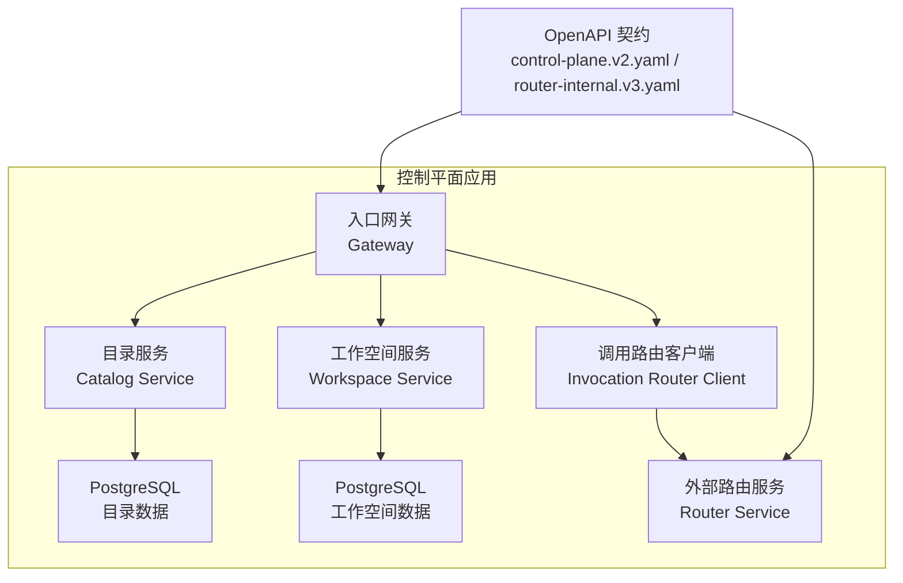
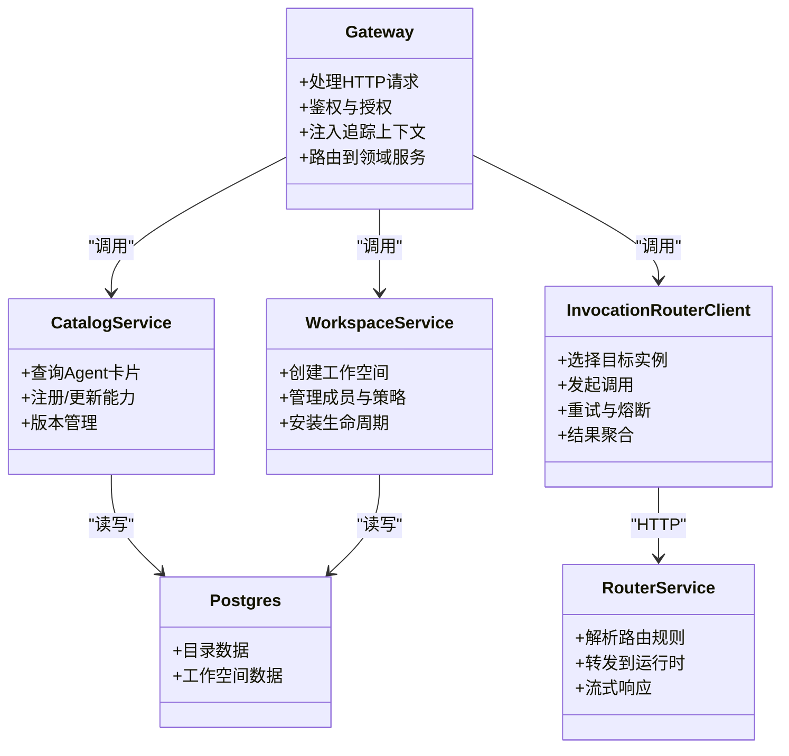
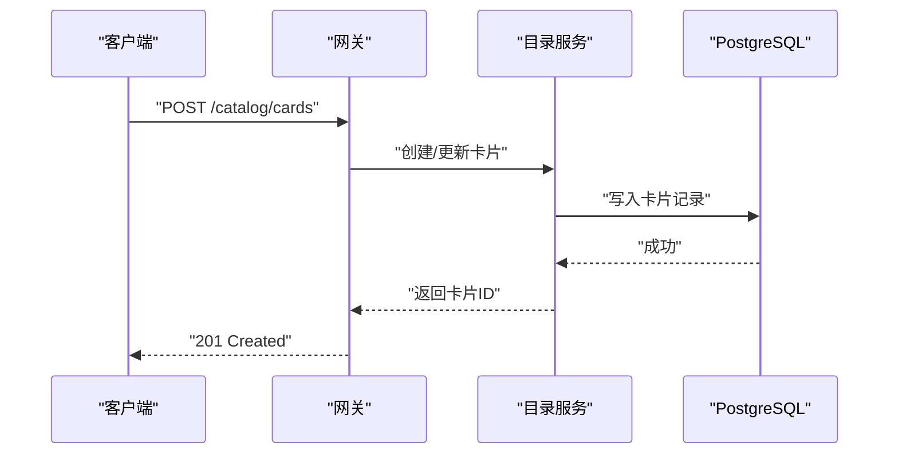
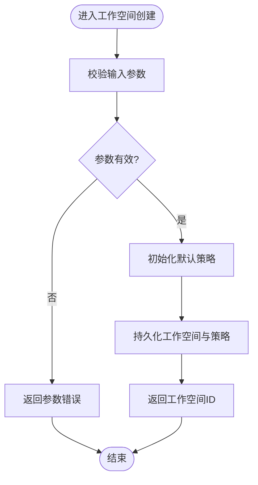
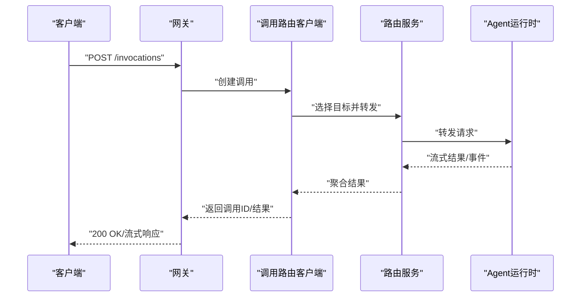
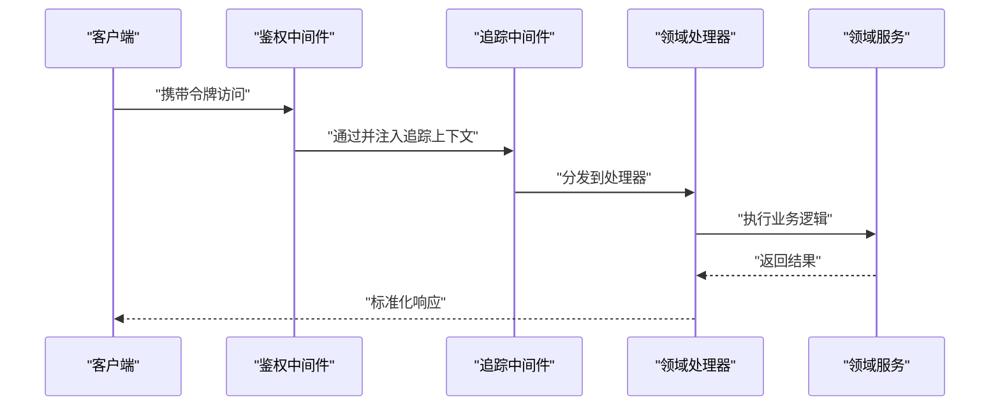
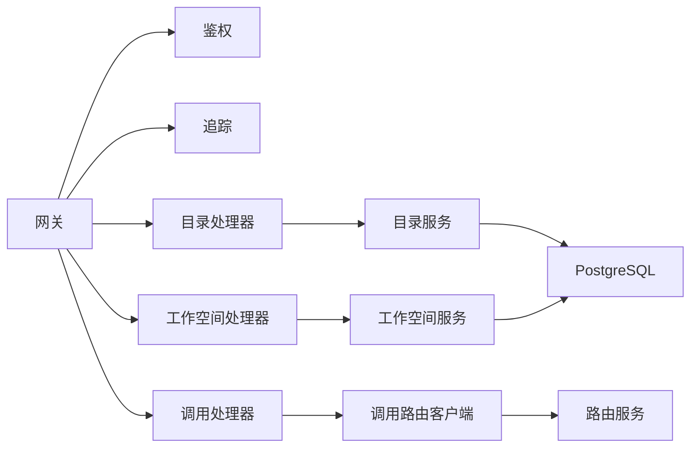

# 微服务架构模式

<cite>
**本文引用的文件**   
- [main.go](file://apps/control-plane/cmd/control-plane/main.go)
- [config.go](file://apps/control-plane/internal/config/config.go)
- [service.go](file://apps/control-plane/internal/catalog/service.go)
- [store.go](file://apps/control-plane/internal/catalog/store.go)
- [migrations.go](file://apps/control-plane/internal/catalog/postgres/migrations.go)
- [model.go](file://apps/control-plane/internal/workspace/model.go)
- [service.go](file://apps/control-plane/internal/workspace/service.go)
- [store.go](file://apps/control-plane/internal/workspace/store.go)
- [migrations.go](file://apps/control-plane/internal/workspace/postgres/migrations.go)
- [invocation_handler.go](file://apps/control-plane/internal/gateway/invocation_handler.go)
- [catalog_handler.go](file://apps/control-plane/internal/gateway/catalog_handler.go)
- [workspace_handler.go](file://apps/control-plane/internal/gateway/workspace_handler.go)
- [auth.go](file://apps/control-plane/internal/gateway/auth.go)
- [trace.go](file://apps/control-plane/internal/gateway/trace.go)
- [router_client.go](file://apps/control-plane/internal/invocation/router_client.go)
- [control-plane.v2.yaml](file://contracts/openapi/control-plane.v2.yaml)
- [router-internal.v3.yaml](file://contracts/openapi/router-internal.v3.yaml)
- [compose.yaml](file://deploy/compose.yaml)
</cite>

## 目录
1. [简介](#简介)
2. [项目结构](#项目结构)
3. [核心组件](#核心组件)
4. [架构总览](#架构总览)
5. [详细组件分析](#详细组件分析)
6. [依赖关系分析](#依赖关系分析)
7. [性能与可扩展性](#性能与可扩展性)
8. [故障隔离与容错](#故障隔离与容错)
9. [服务发现与注册](#服务发现与注册)
10. [配置管理](#配置管理)
11. [部署拓扑与资源隔离](#部署拓扑与资源隔离)
12. [监控、日志与链路追踪](#监控日志与链路追踪)
13. [排障指南](#排障指南)
14. [结论](#结论)

## 简介
本文件面向 NeKiro 控制平面，系统化阐述其微服务拆分策略与实现要点。围绕目录服务（Catalog）、工作空间服务（Workspace）、调用路由服务（Invocation Router）三大独立域，说明服务边界、职责划分、通信机制、负载均衡与故障隔离设计；并给出服务发现与注册、配置管理、服务治理方案，以及部署拓扑、资源隔离、监控日志与链路追踪的实现方式。文档同时提供代码级架构图与关键流程时序图，帮助读者快速理解从入口网关到下游服务的端到端路径。

## 项目结构
控制平面采用“单进程多模块”的 Go 工程组织，按领域能力拆分为 catalog、workspace、gateway、invocation 等内部包，并通过 OpenAPI 契约定义对外接口。部署以容器化为主，使用 Compose 编排本地开发环境。

图表来源
- [main.go:1-200](file://apps/control-plane/cmd/control-plane/main.go#L1-L200)
- [catalog_handler.go:1-200](file://apps/control-plane/internal/gateway/catalog_handler.go#L1-L200)
- [workspace_handler.go:1-200](file://apps/control-plane/internal/gateway/workspace_handler.go#L1-L200)
- [invocation_handler.go:1-200](file://apps/control-plane/internal/gateway/invocation_handler.go#L1-L200)
- [router_client.go:1-200](file://apps/control-plane/internal/invocation/router_client.go#L1-L200)
- [control-plane.v2.yaml](file://contracts/openapi/control-plane.v2.yaml)
- [router-internal.v3.yaml](file://contracts/openapi/router-internal.v3.yaml)

章节来源
- [main.go:1-200](file://apps/control-plane/cmd/control-plane/main.go#L1-L200)
- [config.go:1-200](file://apps/control-plane/internal/config/config.go#L1-L200)
- [compose.yaml:1-200](file://deploy/compose.yaml#L1-L200)

## 核心组件
- 入口网关（Gateway）：统一暴露 REST API，负责鉴权、限流、请求校验、链路追踪上下文注入，并将请求分发至对应领域服务或下游路由服务。
- 目录服务（Catalog）：维护 Agent 卡片、能力描述、版本与安装信息，提供查询与变更接口，持久化至 PostgreSQL。
- 工作空间服务（Workspace）：管理工作空间生命周期、成员与权限、安装状态等，持久化至 PostgreSQL。
- 调用路由客户端（Invocation Router Client）：封装对路由服务的 HTTP 调用，负责选择目标实例、重试与熔断、结果聚合与错误映射。
- 路由服务（Router Service，外部）：根据目录与服务发现信息，将调用请求路由到具体 Agent 运行时实例，支持流式返回与事件投递。

章节来源
- [catalog_handler.go:1-200](file://apps/control-plane/internal/gateway/catalog_handler.go#L1-L200)
- [workspace_handler.go:1-200](file://apps/control-plane/internal/gateway/workspace_handler.go#L1-L200)
- [invocation_handler.go:1-200](file://apps/control-plane/internal/gateway/invocation_handler.go#L1-L200)
- [service.go](file://apps/control-plane/internal/catalog/service.go)
- [service.go](file://apps/control-plane/internal/workspace/service.go)
- [router_client.go:1-200](file://apps/control-plane/internal/invocation/router_client.go#L1-L200)

## 架构总览
控制平面作为平台控制面，承担“声明式模型 + 调度编排”的职责。对外通过 OpenAPI 暴露稳定接口，对内通过 HTTP 与路由服务交互，数据库层采用关系型存储保证强一致性与事务能力。

图表来源
- [main.go:1-200](file://apps/control-plane/cmd/control-plane/main.go#L1-L200)
- [catalog_handler.go:1-200](file://apps/control-plane/internal/gateway/catalog_handler.go#L1-L200)
- [workspace_handler.go:1-200](file://apps/control-plane/internal/gateway/workspace_handler.go#L1-L200)
- [invocation_handler.go:1-200](file://apps/control-plane/internal/gateway/invocation_handler.go#L1-L200)
- [router_client.go:1-200](file://apps/control-plane/internal/invocation/router_client.go#L1-L200)

## 详细组件分析

### 目录服务（Catalog）
- 职责：维护 Agent 卡片、能力清单、版本与安装元数据；提供查询与变更接口；确保数据一致性。
- 关键实现：
  - 服务层封装业务逻辑与校验，存储层对接 PostgreSQL，迁移脚本保障 schema 演进。
  - 游标分页用于大数据量列表查询优化。
- 数据模型：包含卡片标识、名称、版本、能力集合、安装信息等字段。
- 典型流程：注册/更新卡片 → 校验与落库 → 返回确认；查询卡片 → 条件过滤 → 游标分页返回。

图表来源
- [catalog_handler.go:1-200](file://apps/control-plane/internal/gateway/catalog_handler.go#L1-L200)
- [service.go](file://apps/control-plane/internal/catalog/service.go)
- [store.go](file://apps/control-plane/internal/catalog/store.go)
- [migrations.go](file://apps/control-plane/internal/catalog/postgres/migrations.go)

章节来源
- [service.go](file://apps/control-plane/internal/catalog/service.go)
- [store.go](file://apps/control-plane/internal/catalog/store.go)
- [migrations.go](file://apps/control-plane/internal/catalog/postgres/migrations.go)
- [cursor.go](file://apps/control-plane/internal/catalog/cursor.go)

### 工作空间服务（Workspace）
- 职责：管理工作空间生命周期、成员与策略、安装状态与巡检结果。
- 关键实现：
  - 服务层负责策略校验、状态机流转；存储层对接 PostgreSQL；迁移脚本管理 schema。
  - 游标分页用于安装列表与巡检历史查询。
- 数据模型：包含工作空间标识、名称、策略、成员、安装记录、巡检结果等。
- 典型流程：创建工作空间 → 初始化默认策略 → 落库 → 返回；安装 Agent → 触发巡检 → 更新状态。

图表来源
- [workspace_handler.go:1-200](file://apps/control-plane/internal/gateway/workspace_handler.go#L1-L200)
- [service.go](file://apps/control-plane/internal/workspace/service.go)
- [store.go](file://apps/control-plane/internal/workspace/store.go)
- [migrations.go](file://apps/control-plane/internal/workspace/postgres/migrations.go)
- [cursor.go](file://apps/control-plane/internal/workspace/cursor.go)

章节来源
- [model.go](file://apps/control-plane/internal/workspace/model.go)
- [service.go](file://apps/control-plane/internal/workspace/service.go)
- [store.go](file://apps/control-plane/internal/workspace/store.go)
- [migrations.go](file://apps/control-plane/internal/workspace/postgres/migrations.go)
- [policy.go](file://apps/control-plane/internal/workspace/policy.go)

### 调用路由服务（Invocation Router）
- 职责：接收来自控制平面的调用请求，依据目录信息与路由策略选择目标 Agent 运行时实例，建立连接并转发请求，支持流式结果与事件。
- 关键实现：
  - 路由客户端封装 HTTP 调用、重试、熔断、超时与错误映射。
  - 与路由服务通过 OpenAPI 契约交互，确保版本兼容与语义一致。
- 典型流程：解析调用上下文 → 选择目标实例 → 发起调用 → 流式返回结果 → 记录审计与追踪。

图表来源
- [invocation_handler.go:1-200](file://apps/control-plane/internal/gateway/invocation_handler.go#L1-L200)
- [router_client.go:1-200](file://apps/control-plane/internal/invocation/router_client.go#L1-L200)
- [router-internal.v3.yaml](file://contracts/openapi/router-internal.v3.yaml)

章节来源
- [invocation_handler.go:1-200](file://apps/control-plane/internal/gateway/invocation_handler.go#L1-L200)
- [router_client.go:1-200](file://apps/control-plane/internal/invocation/router_client.go#L1-L200)
- [router-internal.v3.yaml](file://contracts/openapi/router-internal.v3.yaml)

### 入口网关（Gateway）
- 职责：统一入口、鉴权、限流、请求校验、链路追踪上下文注入、错误标准化。
- 关键实现：
  - 鉴权中间件校验令牌与权限。
  - 追踪中间件注入 trace_id/span_id 并传播到下游。
  - 错误处理器统一返回平台错误格式。

图表来源
- [auth.go](file://apps/control-plane/internal/gateway/auth.go)
- [trace.go](file://apps/control-plane/internal/gateway/trace.go)
- [catalog_handler.go:1-200](file://apps/control-plane/internal/gateway/catalog_handler.go#L1-L200)
- [workspace_handler.go:1-200](file://apps/control-plane/internal/gateway/workspace_handler.go#L1-L200)
- [invocation_handler.go:1-200](file://apps/control-plane/internal/gateway/invocation_handler.go#L1-L200)

章节来源
- [auth.go](file://apps/control-plane/internal/gateway/auth.go)
- [trace.go](file://apps/control-plane/internal/gateway/trace.go)
- [catalog_handler.go:1-200](file://apps/control-plane/internal/gateway/catalog_handler.go#L1-L200)
- [workspace_handler.go:1-200](file://apps/control-plane/internal/gateway/workspace_handler.go#L1-L200)
- [invocation_handler.go:1-200](file://apps/control-plane/internal/gateway/invocation_handler.go#L1-L200)

## 依赖关系分析
- 入口网关依赖鉴权与追踪中间件，并调用各领域服务处理器。
- 目录与工作空间服务依赖各自存储层与迁移脚本，均指向 PostgreSQL。
- 调用路由客户端依赖路由服务内部 OpenAPI 契约，确保跨服务通信稳定性。

图表来源
- [main.go:1-200](file://apps/control-plane/cmd/control-plane/main.go#L1-L200)
- [auth.go](file://apps/control-plane/internal/gateway/auth.go)
- [trace.go](file://apps/control-plane/internal/gateway/trace.go)
- [catalog_handler.go:1-200](file://apps/control-plane/internal/gateway/catalog_handler.go#L1-L200)
- [workspace_handler.go:1-200](file://apps/control-plane/internal/gateway/workspace_handler.go#L1-L200)
- [invocation_handler.go:1-200](file://apps/control-plane/internal/gateway/invocation_handler.go#L1-L200)
- [router_client.go:1-200](file://apps/control-plane/internal/invocation/router_client.go#L1-L200)

章节来源
- [main.go:1-200](file://apps/control-plane/cmd/control-plane/main.go#L1-L200)
- [router_client.go:1-200](file://apps/control-plane/internal/invocation/router_client.go#L1-L200)

## 性能与可扩展性
- 水平扩展：网关与路由服务无状态，可多副本部署；目录与工作空间服务可通过分库分表或读写分离提升吞吐。
- 连接池与超时：为 HTTP 客户端与数据库连接设置合理的最大空闲数、超时与重试策略，避免雪崩。
- 缓存与索引：热点查询引入缓存层（如 Redis），数据库侧针对常用查询列建立索引，减少慢查询。
- 流式传输：长时任务与结果流采用 SSE/流式协议，降低内存占用与延迟。

[本节为通用指导，不直接分析具体文件]

## 故障隔离与容错
- 熔断与退避：对下游调用实施熔断与指数退避，失败率阈值触发快速失败，保护上游。
- 重试与幂等：仅对安全操作进行有限次重试，确保幂等键与去重逻辑，避免重复执行。
- 超时与降级：设置合理超时时间，超时后返回降级响应或队列化后续处理。
- 错误标准化：统一错误码与消息，便于前端展示与运维排查。

章节来源
- [router_client.go:1-200](file://apps/control-plane/internal/invocation/router_client.go#L1-L200)
- [invocation_handler.go:1-200](file://apps/control-plane/internal/gateway/invocation_handler.go#L1-L200)

## 服务发现与注册
- 当前实现：在本地开发环境中通过 Compose 编排，服务间通过固定域名或服务名解析；生产环境建议引入服务网格或注册中心（如 Consul/Kubernetes Service）。
- 推荐方案：
  - 基于 Kubernetes Service 的服务发现，结合 Ingress/Gateway 暴露入口。
  - 使用 Sidecar 代理（如 Envoy/Istio）实现自动重试、熔断与流量治理。
  - 健康检查与就绪探针确保滚动升级与故障自愈。

章节来源
- [compose.yaml:1-200](file://deploy/compose.yaml#L1-L200)

## 配置管理
- 配置来源：环境变量、配置文件与启动参数；敏感信息通过密钥管理服务注入。
- 配置项分类：
  - 运行时配置：端口、日志级别、超时、重试次数。
  - 数据源配置：数据库连接串、连接池大小、SSL/TLS。
  - 外部依赖：路由服务地址、鉴权服务地址、追踪上报端点。
- 动态更新：支持热重载配置项（如日志级别、开关），避免重启影响。

章节来源
- [config.go:1-200](file://apps/control-plane/internal/config/config.go#L1-L200)

## 部署拓扑与资源隔离
- 部署单元：每个服务独立容器镜像，按副本数与资源限制部署。
- 资源隔离：通过 CPU/内存限制与 QoS 等级保障关键服务优先级。
- 网络隔离：命名空间与网络策略限制跨域访问，仅开放必要端口。
- 数据持久化：PostgreSQL 使用持久卷，定期备份与恢复演练。

章节来源
- [compose.yaml:1-200](file://deploy/compose.yaml#L1-L200)

## 监控、日志与链路追踪
- 指标采集：暴露 Prometheus 指标（QPS、延迟、错误率、连接池使用率）。
- 日志聚合：结构化 JSON 日志，统一收集到 ELK/Loki，关联 trace_id。
- 链路追踪：在网关注入 trace_id，透传到下游服务与数据库，形成完整调用链。
- 告警规则：基于错误率、延迟、资源使用率设定阈值告警。

章节来源
- [trace.go](file://apps/control-plane/internal/gateway/trace.go)
- [invocation_handler.go:1-200](file://apps/control-plane/internal/gateway/invocation_handler.go#L1-L200)

## 排障指南
- 常见问题定位：
  - 鉴权失败：检查令牌有效期、签名算法与权限范围。
  - 路由失败：核对路由规则、目标实例健康状态与网络连通性。
  - 数据库异常：查看连接池、慢查询与锁等待。
- 诊断工具：
  - 启用调试日志与采样追踪，导出 trace_id 进行链路分析。
  - 使用健康检查与就绪探针验证服务可用性。
  - 回放请求与对比契约测试用例，定位兼容性问题。

章节来源
- [auth.go](file://apps/control-plane/internal/gateway/auth.go)
- [invocation_handler.go:1-200](file://apps/control-plane/internal/gateway/invocation_handler.go#L1-L200)
- [router_client.go:1-200](file://apps/control-plane/internal/invocation/router_client.go#L1-L200)

## 结论
NeKiro 控制平面通过清晰的领域拆分与稳定的 OpenAPI 契约，构建了高内聚、低耦合的微服务架构。目录、工作空间与调用路由三大域各司其职，配合鉴权、追踪与错误标准化，提升了系统的可观测性与可维护性。在生产环境中，建议引入服务网格与注册中心，完善弹性伸缩、流量治理与故障自愈能力，以实现更高的可用性与扩展性。