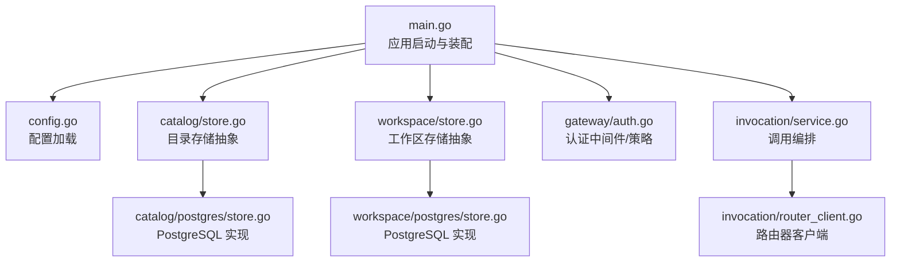
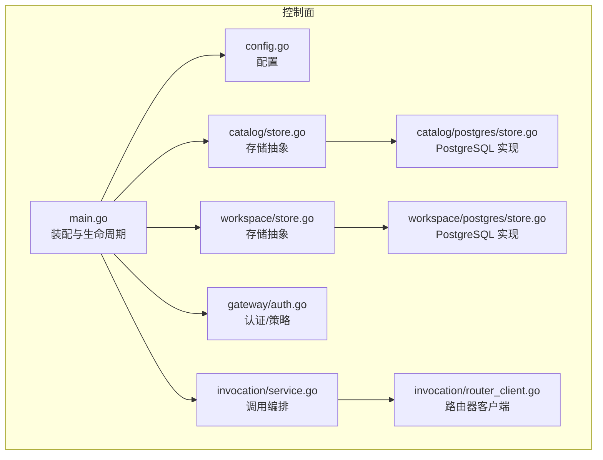
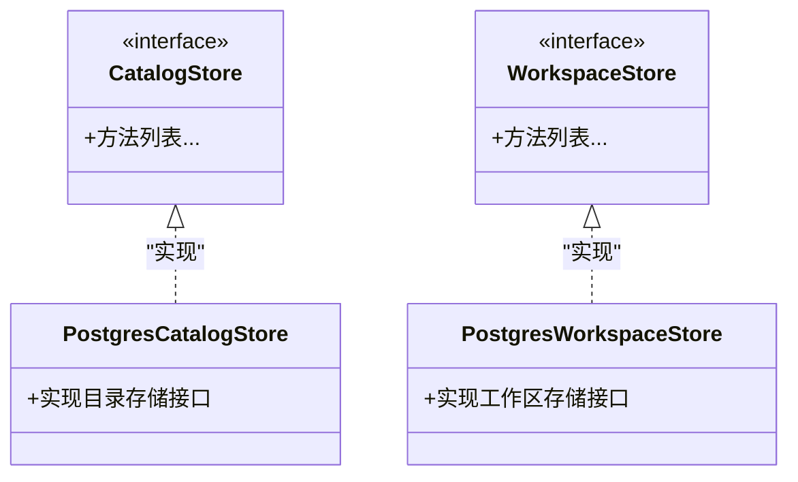
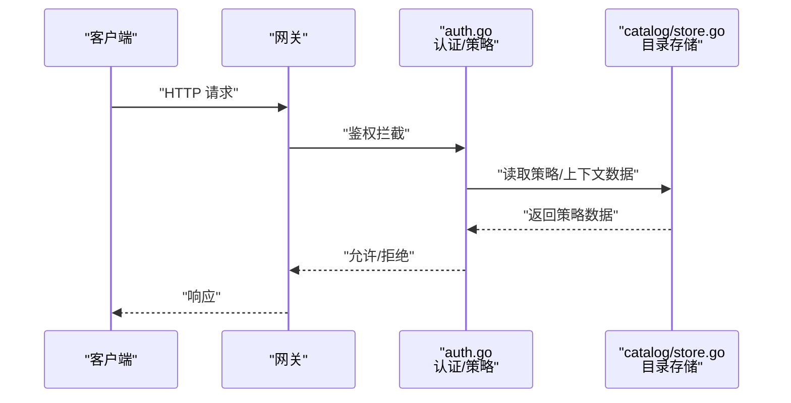
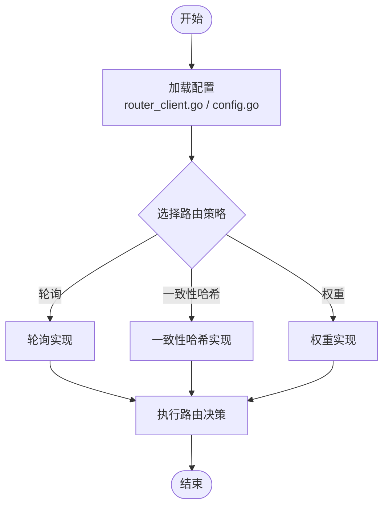
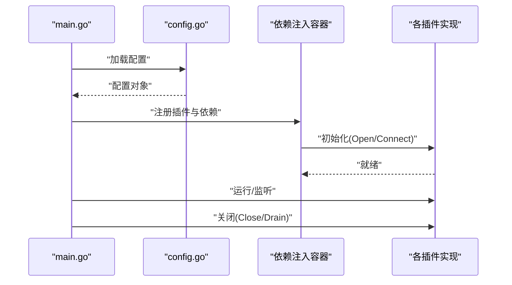
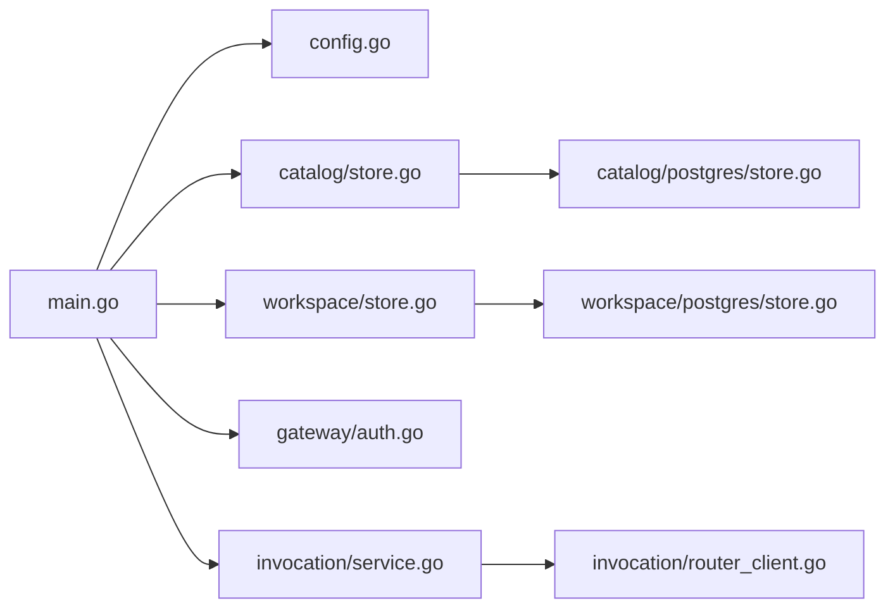

# 插件化架构模式

<cite>
**本文引用的文件**   
- [apps/control-plane/cmd/control-plane/main.go](file://apps/control-plane/cmd/control-plane/main.go)
- [apps/control-plane/internal/config/config.go](file://apps/control-plane/internal/config/config.go)
- [apps/control-plane/internal/catalog/store.go](file://apps/control-plane/internal/catalog/store.go)
- [apps/control-plane/internal/catalog/postgres/store.go](file://apps/control-plane/internal/catalog/postgres/store.go)
- [apps/control-plane/internal/workspace/store.go](file://apps/control-plane/internal/workspace/store.go)
- [apps/control-plane/internal/workspace/postgres/store.go](file://apps/control-plane/internal/workspace/postgres/store.go)
- [apps/control-plane/internal/gateway/auth.go](file://apps/control-plane/internal/gateway/auth.go)
- [apps/control-plane/internal/invocation/service.go](file://apps/control-plane/internal/invocation/service.go)
- [apps/control-plane/internal/invocation/router_client.go](file://apps/control-plane/internal/invocation/router_client.go)
</cite>

## 目录
1. [简介](#简介)
2. [项目结构](#项目结构)
3. [核心组件](#核心组件)
4. [架构总览](#架构总览)
5. [详细组件分析](#详细组件分析)
6. [依赖分析](#依赖分析)
7. [性能考虑](#性能考虑)
8. [故障排查指南](#故障排查指南)
9. [结论](#结论)
10. [附录](#附录)

## 简介
本文件面向 NeKiro 平台的插件化架构，聚焦以下目标：
- 存储后端的可插拔设计：抽象接口定义与 PostgreSQL 实现
- 认证机制的扩展点设计与策略引擎的插件化实现
- 路由算法的可配置性与自定义路由器开发方式
- 插件生命周期管理与依赖注入机制
- 插件接口定义与实现示例（以路径引用形式）
- 插件开发规范与最佳实践
- 插件化对系统扩展性的提升

## 项目结构
NeKiro 控制面采用分层与按领域划分相结合的组织方式。关键目录与职责如下：
- apps/control-plane/cmd/control-plane/main.go：应用启动、装配与依赖注入入口
- apps/control-plane/internal/config/config.go：配置加载与运行时参数解析
- internal/catalog/*：目录服务领域（含存储抽象与 PostgreSQL 实现）
- internal/workspace/*：工作区服务领域（含存储抽象与 PostgreSQL 实现）
- internal/gateway/*：网关层（鉴权、HTTP 处理器等）
- internal/invocation/*：调用编排与路由器客户端

图表来源
- [apps/control-plane/cmd/control-plane/main.go](file://apps/control-plane/cmd/control-plane/main.go)
- [apps/control-plane/internal/config/config.go](file://apps/control-plane/internal/config/config.go)
- [apps/control-plane/internal/catalog/store.go](file://apps/control-plane/internal/catalog/store.go)
- [apps/control-plane/internal/catalog/postgres/store.go](file://apps/control-plane/internal/catalog/postgres/store.go)
- [apps/control-plane/internal/workspace/store.go](file://apps/control-plane/internal/workspace/store.go)
- [apps/control-plane/internal/workspace/postgres/store.go](file://apps/control-plane/internal/workspace/postgres/store.go)
- [apps/control-plane/internal/gateway/auth.go](file://apps/control-plane/internal/gateway/auth.go)
- [apps/control-plane/internal/invocation/service.go](file://apps/control-plane/internal/invocation/service.go)
- [apps/control-plane/internal/invocation/router_client.go](file://apps/control-plane/internal/invocation/router_client.go)

章节来源
- [apps/control-plane/cmd/control-plane/main.go](file://apps/control-plane/cmd/control-plane/main.go)
- [apps/control-plane/internal/config/config.go](file://apps/control-plane/internal/config/config.go)

## 核心组件
本节概述插件化架构中的关键抽象与实现位置，便于读者快速定位源码路径。

- 存储抽象与实现
  - 目录存储抽象：[apps/control-plane/internal/catalog/store.go](file://apps/control-plane/internal/catalog/store.go)
  - 目录存储 PostgreSQL 实现：[apps/control-plane/internal/catalog/postgres/store.go](file://apps/control-plane/internal/catalog/postgres/store.go)
  - 工作区存储抽象：[apps/control-plane/internal/workspace/store.go](file://apps/control-plane/internal/workspace/store.go)
  - 工作区存储 PostgreSQL 实现：[apps/control-plane/internal/workspace/postgres/store.go](file://apps/control-plane/internal/workspace/postgres/store.go)

- 认证与策略
  - 认证中间件/策略入口：[apps/control-plane/internal/gateway/auth.go](file://apps/control-plane/internal/gateway/auth.go)

- 路由与调用编排
  - 调用编排服务：[apps/control-plane/internal/invocation/service.go](file://apps/control-plane/internal/invocation/service.go)
  - 路由器客户端：[apps/control-plane/internal/invocation/router_client.go](file://apps/control-plane/internal/invocation/router_client.go)

- 应用装配与依赖注入
  - 应用主入口与装配：[apps/control-plane/cmd/control-plane/main.go](file://apps/control-plane/cmd/control-plane/main.go)
  - 配置加载：[apps/control-plane/internal/config/config.go](file://apps/control-plane/internal/config/config.go)

章节来源
- [apps/control-plane/internal/catalog/store.go](file://apps/control-plane/internal/catalog/store.go)
- [apps/control-plane/internal/catalog/postgres/store.go](file://apps/control-plane/internal/catalog/postgres/store.go)
- [apps/control-plane/internal/workspace/store.go](file://apps/control-plane/internal/workspace/store.go)
- [apps/control-plane/internal/workspace/postgres/store.go](file://apps/control-plane/internal/workspace/postgres/store.go)
- [apps/control-plane/internal/gateway/auth.go](file://apps/control-plane/internal/gateway/auth.go)
- [apps/control-plane/internal/invocation/service.go](file://apps/control-plane/internal/invocation/service.go)
- [apps/control-plane/internal/invocation/router_client.go](file://apps/control-plane/internal/invocation/router_client.go)
- [apps/control-plane/cmd/control-plane/main.go](file://apps/control-plane/cmd/control-plane/main.go)
- [apps/control-plane/internal/config/config.go](file://apps/control-plane/internal/config/config.go)

## 架构总览
下图展示控制面的整体架构与插件化边界：存储后端通过接口解耦；认证策略可替换；路由选择通过客户端与策略组合实现；应用启动时完成依赖注入与生命周期管理。

图表来源
- [apps/control-plane/cmd/control-plane/main.go](file://apps/control-plane/cmd/control-plane/main.go)
- [apps/control-plane/internal/config/config.go](file://apps/control-plane/internal/config/config.go)
- [apps/control-plane/internal/catalog/store.go](file://apps/control-plane/internal/catalog/store.go)
- [apps/control-plane/internal/catalog/postgres/store.go](file://apps/control-plane/internal/catalog/postgres/store.go)
- [apps/control-plane/internal/workspace/store.go](file://apps/control-plane/internal/workspace/store.go)
- [apps/control-plane/internal/workspace/postgres/store.go](file://apps/control-plane/internal/workspace/postgres/store.go)
- [apps/control-plane/internal/gateway/auth.go](file://apps/control-plane/internal/gateway/auth.go)
- [apps/control-plane/internal/invocation/service.go](file://apps/control-plane/internal/invocation/service.go)
- [apps/control-plane/internal/invocation/router_client.go](file://apps/control-plane/internal/invocation/router_client.go)

## 详细组件分析

### 存储后端可插拔设计
- 抽象接口定义
  - 目录存储抽象位于：[apps/control-plane/internal/catalog/store.go](file://apps/control-plane/internal/catalog/store.go)
  - 工作区存储抽象位于：[apps/control-plane/internal/workspace/store.go](file://apps/control-plane/internal/workspace/store.go)
- PostgreSQL 实现
  - 目录存储实现位于：[apps/control-plane/internal/catalog/postgres/store.go](file://apps/control-plane/internal/catalog/postgres/store.go)
  - 工作区存储实现位于：[apps/control-plane/internal/workspace/postgres/store.go](file://apps/control-plane/internal/workspace/postgres/store.go)
- 设计要点
  - 通过接口隔离持久化细节，业务层仅依赖抽象
  - 不同存储后端（如内存、其他数据库）可通过实现同一接口进行替换
  - 迁移脚本与初始化逻辑与具体实现分离，便于独立演进

图表来源
- [apps/control-plane/internal/catalog/store.go](file://apps/control-plane/internal/catalog/store.go)
- [apps/control-plane/internal/workspace/store.go](file://apps/control-plane/internal/workspace/store.go)
- [apps/control-plane/internal/catalog/postgres/store.go](file://apps/control-plane/internal/catalog/postgres/store.go)
- [apps/control-plane/internal/workspace/postgres/store.go](file://apps/control-plane/internal/workspace/postgres/store.go)

章节来源
- [apps/control-plane/internal/catalog/store.go](file://apps/control-plane/internal/catalog/store.go)
- [apps/control-plane/internal/catalog/postgres/store.go](file://apps/control-plane/internal/catalog/postgres/store.go)
- [apps/control-plane/internal/workspace/store.go](file://apps/control-plane/internal/workspace/store.go)
- [apps/control-plane/internal/workspace/postgres/store.go](file://apps/control-plane/internal/workspace/postgres/store.go)

### 认证机制的扩展点与策略引擎
- 扩展点位置
  - 认证中间件/策略入口：[apps/control-plane/internal/gateway/auth.go](file://apps/control-plane/internal/gateway/auth.go)
- 可扩展性建议
  - 将“认证提供者”和“授权策略”分别抽象为可插拔组件
  - 支持多策略组合（例如：JWT 校验 + 基于角色的访问控制）
  - 通过配置开关或注册表动态启用/禁用策略

图表来源
- [apps/control-plane/internal/gateway/auth.go](file://apps/control-plane/internal/gateway/auth.go)
- [apps/control-plane/internal/catalog/store.go](file://apps/control-plane/internal/catalog/store.go)

章节来源
- [apps/control-plane/internal/gateway/auth.go](file://apps/control-plane/internal/gateway/auth.go)

### 路由算法的可配置性与自定义路由器
- 相关组件
  - 调用编排服务：[apps/control-plane/internal/invocation/service.go](file://apps/control-plane/internal/invocation/service.go)
  - 路由器客户端：[apps/control-plane/internal/invocation/router_client.go](file://apps/control-plane/internal/invocation/router_client.go)
- 可配置性
  - 通过配置项选择路由策略（如轮询、一致性哈希、权重等）
  - 在装配阶段根据配置注入不同的路由器实现
- 自定义路由器开发
  - 定义统一的路由器接口（若尚未存在，建议在 invocation 域内新增）
  - 实现新策略并注册到装配器中
  - 通过配置切换策略，无需修改业务代码

图表来源
- [apps/control-plane/internal/invocation/router_client.go](file://apps/control-plane/internal/invocation/router_client.go)
- [apps/control-plane/internal/config/config.go](file://apps/control-plane/internal/config/config.go)

章节来源
- [apps/control-plane/internal/invocation/service.go](file://apps/control-plane/internal/invocation/service.go)
- [apps/control-plane/internal/invocation/router_client.go](file://apps/control-plane/internal/invocation/router_client.go)
- [apps/control-plane/internal/config/config.go](file://apps/control-plane/internal/config/config.go)

### 插件生命周期管理与依赖注入
- 装配入口
  - 应用主入口负责创建实例、组装依赖、启动服务：[apps/control-plane/cmd/control-plane/main.go](file://apps/control-plane/cmd/control-plane/main.go)
- 配置驱动
  - 从配置文件加载运行时参数，决定启用哪些插件与策略：[apps/control-plane/internal/config/config.go](file://apps/control-plane/internal/config/config.go)
- 生命周期建议
  - 初始化：在装配阶段完成连接池、缓存、策略注册
  - 运行：提供健康检查与指标上报
  - 关闭：优雅停止，释放资源（数据库连接、定时器、监听器等）

图表来源
- [apps/control-plane/cmd/control-plane/main.go](file://apps/control-plane/cmd/control-plane/main.go)
- [apps/control-plane/internal/config/config.go](file://apps/control-plane/internal/config/config.go)

章节来源
- [apps/control-plane/cmd/control-plane/main.go](file://apps/control-plane/cmd/control-plane/main.go)
- [apps/control-plane/internal/config/config.go](file://apps/control-plane/internal/config/config.go)

### 插件接口定义与实现示例（路径指引）
- 存储插件
  - 接口定义：[apps/control-plane/internal/catalog/store.go](file://apps/control-plane/internal/catalog/store.go)、[apps/control-plane/internal/workspace/store.go](file://apps/control-plane/internal/workspace/store.go)
  - 实现示例：[apps/control-plane/internal/catalog/postgres/store.go](file://apps/control-plane/internal/catalog/postgres/store.go)、[apps/control-plane/internal/workspace/postgres/store.go](file://apps/control-plane/internal/workspace/postgres/store.go)
- 认证策略插件
  - 入口与策略组合点：[apps/control-plane/internal/gateway/auth.go](file://apps/control-plane/internal/gateway/auth.go)
- 路由策略插件
  - 客户端与策略选择点：[apps/control-plane/internal/invocation/router_client.go](file://apps/control-plane/internal/invocation/router_client.go)

章节来源
- [apps/control-plane/internal/catalog/store.go](file://apps/control-plane/internal/catalog/store.go)
- [apps/control-plane/internal/workspace/store.go](file://apps/control-plane/internal/workspace/store.go)
- [apps/control-plane/internal/catalog/postgres/store.go](file://apps/control-plane/internal/catalog/postgres/store.go)
- [apps/control-plane/internal/workspace/postgres/store.go](file://apps/control-plane/internal/workspace/postgres/store.go)
- [apps/control-plane/internal/gateway/auth.go](file://apps/control-plane/internal/gateway/auth.go)
- [apps/control-plane/internal/invocation/router_client.go](file://apps/control-plane/internal/invocation/router_client.go)

### 插件开发规范与最佳实践
- 接口优先
  - 所有可插拔能力均应以接口为边界，避免直接耦合实现
- 配置驱动
  - 通过配置项控制启用/禁用与行为参数，减少硬编码分支
- 错误处理
  - 明确错误类型与恢复策略，区分可重试与不可重试错误
- 资源管理
  - 遵循初始化-运行-关闭的生命周期，确保资源释放与优雅停机
- 可观测性
  - 暴露健康检查、指标与结构化日志，便于运维排障
- 测试策略
  - 针对接口编写单元测试，使用内存实现或桩进行集成验证

[本节为通用指导，不直接分析具体文件]

### 插件化对系统扩展性的提升
- 横向扩展
  - 存储后端可替换，便于在不同环境或云厂商间迁移
- 功能演进
  - 认证与路由策略可按需演进，不影响既有业务
- 团队自治
  - 不同团队可并行开发各自插件，降低耦合度
- 灰度与回滚
  - 通过配置切换策略，支持灰度发布与快速回滚

[本节为概念性说明，不直接分析具体文件]

## 依赖分析
下图展示主要模块间的依赖关系，突出插件化边界与装配点。

图表来源
- [apps/control-plane/cmd/control-plane/main.go](file://apps/control-plane/cmd/control-plane/main.go)
- [apps/control-plane/internal/config/config.go](file://apps/control-plane/internal/config/config.go)
- [apps/control-plane/internal/catalog/store.go](file://apps/control-plane/internal/catalog/store.go)
- [apps/control-plane/internal/catalog/postgres/store.go](file://apps/control-plane/internal/catalog/postgres/store.go)
- [apps/control-plane/internal/workspace/store.go](file://apps/control-plane/internal/workspace/store.go)
- [apps/control-plane/internal/workspace/postgres/store.go](file://apps/control-plane/internal/workspace/postgres/store.go)
- [apps/control-plane/internal/gateway/auth.go](file://apps/control-plane/internal/gateway/auth.go)
- [apps/control-plane/internal/invocation/service.go](file://apps/control-plane/internal/invocation/service.go)
- [apps/control-plane/internal/invocation/router_client.go](file://apps/control-plane/internal/invocation/router_client.go)

章节来源
- [apps/control-plane/cmd/control-plane/main.go](file://apps/control-plane/cmd/control-plane/main.go)
- [apps/control-plane/internal/config/config.go](file://apps/control-plane/internal/config/config.go)
- [apps/control-plane/internal/catalog/store.go](file://apps/control-plane/internal/catalog/store.go)
- [apps/control-plane/internal/catalog/postgres/store.go](file://apps/control-plane/internal/catalog/postgres/store.go)
- [apps/control-plane/internal/workspace/store.go](file://apps/control-plane/internal/workspace/store.go)
- [apps/control-plane/internal/workspace/postgres/store.go](file://apps/control-plane/internal/workspace/postgres/store.go)
- [apps/control-plane/internal/gateway/auth.go](file://apps/control-plane/internal/gateway/auth.go)
- [apps/control-plane/internal/invocation/service.go](file://apps/control-plane/internal/invocation/service.go)
- [apps/control-plane/internal/invocation/router_client.go](file://apps/control-plane/internal/invocation/router_client.go)

## 性能考虑
- 连接池与并发
  - 数据库连接池大小与超时策略应结合负载调优
- 缓存与幂等
  - 对热点读路径引入缓存，注意一致性与失效策略
- 路由开销
  - 路由策略应避免高复杂度计算，必要时引入本地缓存
- 背压与限流
  - 在高并发场景下增加限流与熔断保护
- 可观测性
  - 采集关键指标（延迟、吞吐、错误率），建立告警阈值

[本节为通用指导，不直接分析具体文件]

## 故障排查指南
- 常见问题
  - 配置缺失或错误导致插件无法加载
  - 数据库连接失败或连接池耗尽
  - 认证策略未正确注册导致鉴权失败
  - 路由策略选择不符合预期
- 排查步骤
  - 检查配置文件与装配顺序
  - 查看健康检查端点与日志
  - 验证数据库连通性与权限
  - 使用最小化配置复现问题
- 定位参考
  - 装配入口：[apps/control-plane/cmd/control-plane/main.go](file://apps/control-plane/cmd/control-plane/main.go)
  - 配置加载：[apps/control-plane/internal/config/config.go](file://apps/control-plane/internal/config/config.go)
  - 认证策略：[apps/control-plane/internal/gateway/auth.go](file://apps/control-plane/internal/gateway/auth.go)
  - 路由客户端：[apps/control-plane/internal/invocation/router_client.go](file://apps/control-plane/internal/invocation/router_client.go)

章节来源
- [apps/control-plane/cmd/control-plane/main.go](file://apps/control-plane/cmd/control-plane/main.go)
- [apps/control-plane/internal/config/config.go](file://apps/control-plane/internal/config/config.go)
- [apps/control-plane/internal/gateway/auth.go](file://apps/control-plane/internal/gateway/auth.go)
- [apps/control-plane/internal/invocation/router_client.go](file://apps/control-plane/internal/invocation/router_client.go)

## 结论
通过将存储、认证与路由等关键能力抽象为可插拔组件，并在装配阶段完成依赖注入与生命周期管理，NeKiro 平台实现了高内聚、低耦合的架构形态。该设计显著提升了系统的可维护性与扩展性，使团队能够以插件为单位独立演进，同时保持整体稳定与可控。

[本节为总结性内容，不直接分析具体文件]

## 附录
- 术语
  - 插件：可插拔的功能单元，通过接口与宿主解耦
  - 策略：可替换的行为实现，通常由配置驱动
  - 装配：在应用启动时将依赖注入到组件的过程
- 参考路径
  - 存储抽象与实现：见“核心组件”与“详细组件分析”
  - 认证与路由：见“详细组件分析”
  - 装配与生命周期：见“详细组件分析”

[本节为补充信息，不直接分析具体文件]