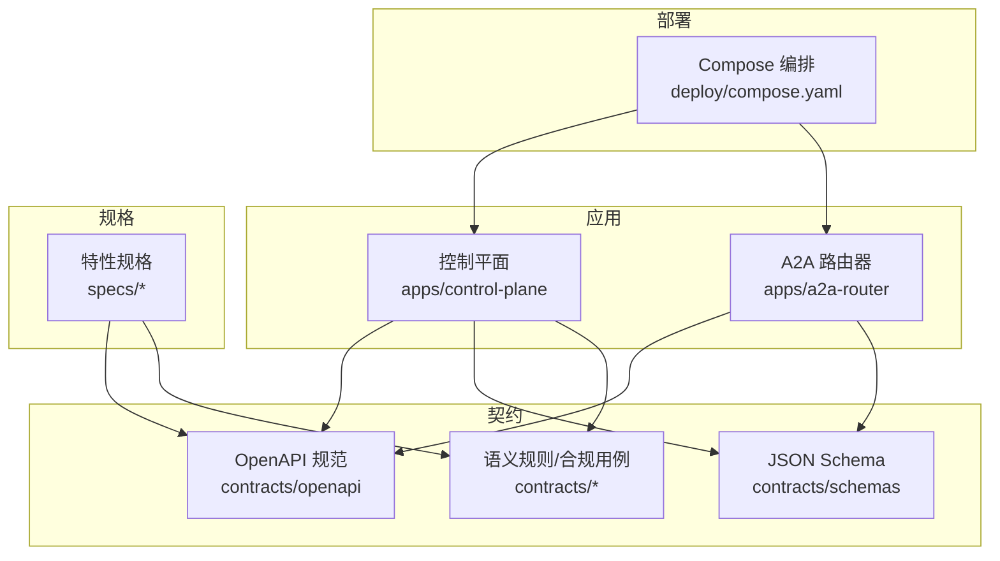
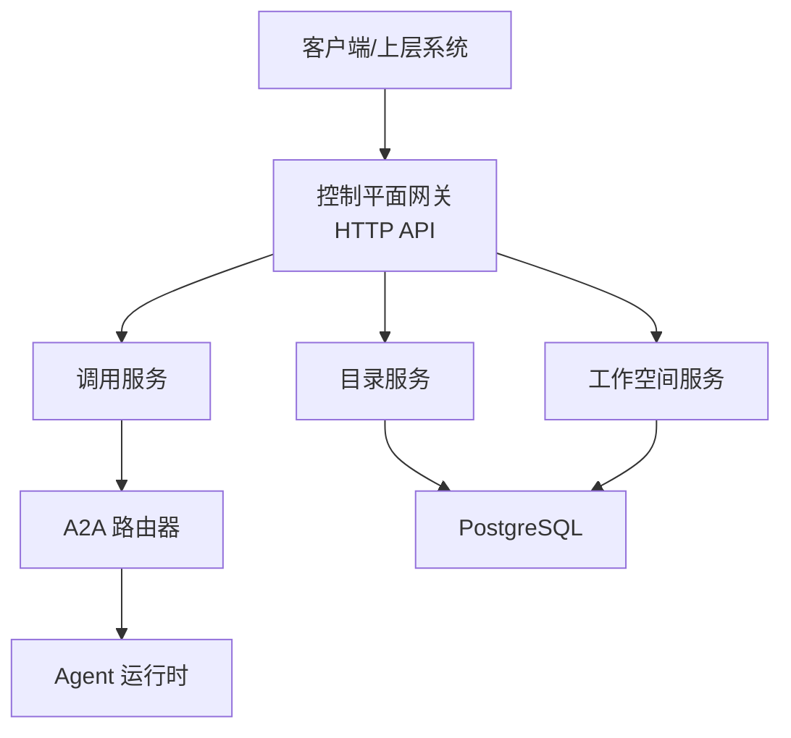
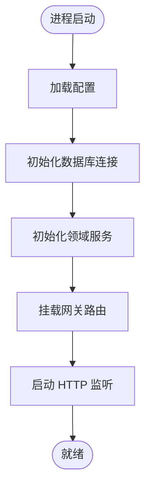
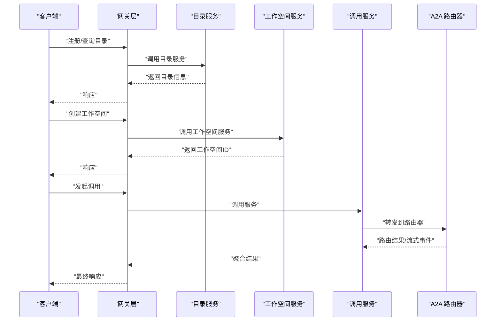
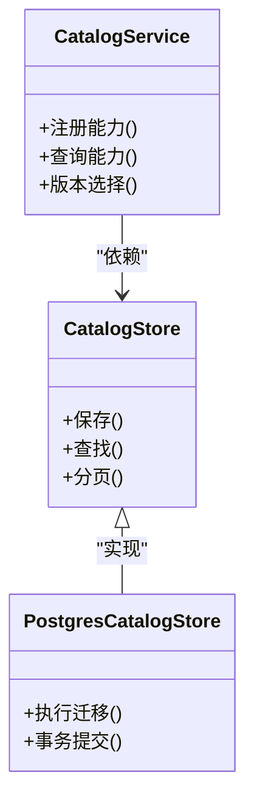
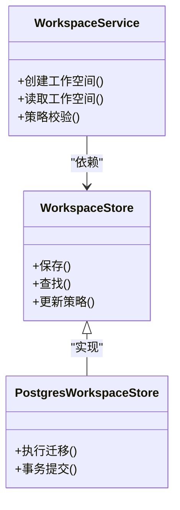
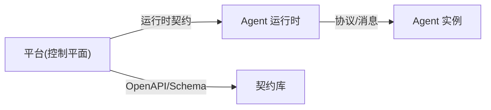
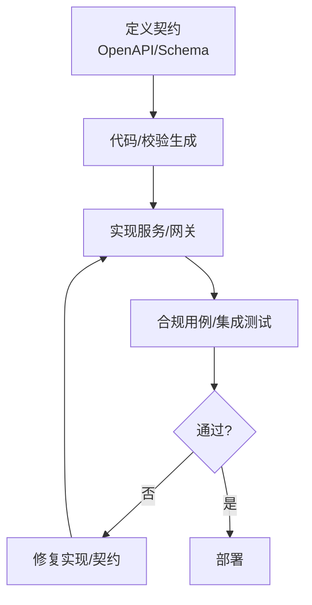
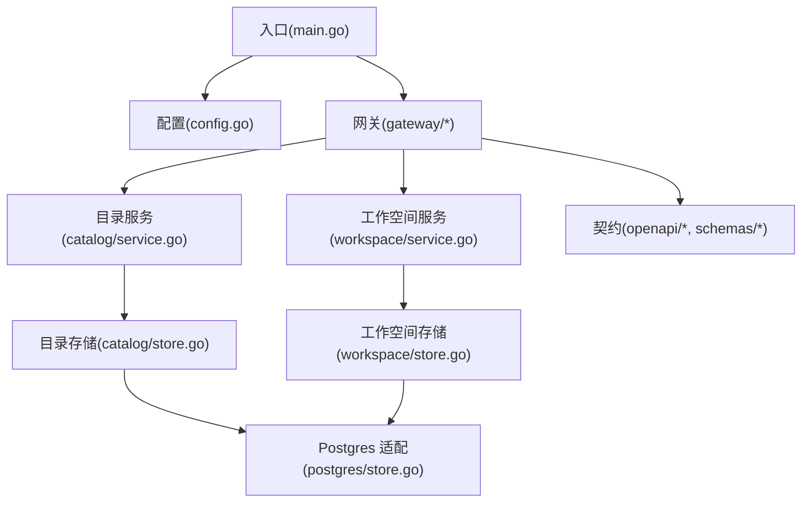

# 架构模式

<cite>
**本文引用的文件**   
- [README.md](file://README.md)
- [go.mod](file://go.mod)
- [deploy/compose.yaml](file://deploy/compose.yaml)
- [apps/control-plane/cmd/control-plane/main.go](file://apps/control-plane/cmd/control-plane/main.go)
- [apps/control-plane/internal/config/config.go](file://apps/control-plane/internal/config/config.go)
- [apps/control-plane/internal/gateway/catalog_handler.go](file://apps/control-plane/internal/gateway/catalog_handler.go)
- [apps/control-plane/internal/gateway/invocation_handler.go](file://apps/control-plane/internal/gateway/invocation_handler.go)
- [apps/control-plane/internal/gateway/workspace_handler.go](file://apps/control-plane/internal/gateway/workspace_handler.go)
- [apps/control-plane/internal/catalog/service.go](file://apps/control-plane/internal/catalog/service.go)
- [apps/control-plane/internal/catalog/store.go](file://apps/control-plane/internal/catalog/store.go)
- [apps/control-plane/internal/catalog/postgres/store.go](file://apps/control-plane/internal/catalog/postgres/store.go)
- [apps/control-plane/internal/workspace/service.go](file://apps/control-plane/internal/workspace/service.go)
- [apps/control-plane/internal/workspace/store.go](file://apps/control-plane/internal/workspace/store.go)
- [apps/control-plane/internal/workspace/postgres/store.go](file://apps/control-plane/internal/workspace/postgres/store.go)
- [contracts/openapi/control-plane.v2.yaml](file://contracts/openapi/control-plane.v2.yaml)
- [contracts/openapi/router-internal.v3.yaml](file://contracts/openapi/router-internal.v3.yaml)
- [contracts/runtime_contracts.go](file://contracts/runtime_contracts.go)
- [contracts/runtime_contracts_validation.go](file://contracts/runtime_contracts_validation.go)
- [contracts/active_contracts_integration_test.go](file://contracts/active_contracts_integration_test.go)
- [docs/decisions/0001-go-backend-stack.md](file://docs/decisions/0001-go-backend-stack.md)
- [docs/decisions/0003-runtime-agnostic-platform-boundary.md](file://docs/decisions/0003-runtime-agnostic-platform-boundary.md)
- [docs/decisions/0004-catalog-persistence-and-consistency.md](file://docs/decisions/0004-catalog-persistence-and-consistency.md)
- [specs/001-complete-invocation-contracts/spec.md](file://specs/001-complete-invocation-contracts/spec.md)
- [specs/002-catalog-registry-discovery/spec.md](file://specs/002-catalog-registry-discovery/spec.md)
- [specs/011-invocation-runtime-contracts/spec.md](file://specs/011-invocation-runtime-contracts/spec.md)
</cite>

## 目录
1. [简介](#简介)
2. [项目结构](#项目结构)
3. [核心组件](#核心组件)
4. [架构总览](#架构总览)
5. [详细组件分析](#详细组件分析)
6. [依赖分析](#依赖分析)
7. [性能考虑](#性能考虑)
8. [故障排查指南](#故障排查指南)
9. [结论](#结论)
10. [附录](#附录)

## 简介
本文件为 NeKiro 平台的架构模式文档，聚焦以下方面：
- 微服务架构模式与控制平面/数据平面分离
- 分层架构与插件化设计
- 运行时无关的平台边界定义
- 目录持久化与一致性策略的选择原因
- 契约驱动开发（Contract-Driven Development）的实施方式与优势
- 架构图与组件交互流程图
- 架构约束与设计原则

NeKiro 通过控制平面提供能力注册、发现、编排与治理，数据平面由路由与服务实例承载实际调用。平台以 OpenAPI 与 JSON Schema 为核心契约，贯穿实现、测试与部署全生命周期。

## 项目结构
仓库采用多模块组织，关键目录与职责如下：
- apps/control-plane：控制平面服务，包含网关层、领域服务与存储适配
- contracts：平台对外与内部契约（OpenAPI、JSON Schema、语义规则、合规用例）
- specs：按特性划分的规格说明与契约清单
- docs/decisions：架构决策记录（ADR）
- deploy：部署配置（Compose）
- go.*：Go 工程元信息

图表来源
- [deploy/compose.yaml](file://deploy/compose.yaml)
- [contracts/openapi/control-plane.v2.yaml](file://contracts/openapi/control-plane.v2.yaml)
- [contracts/openapi/router-internal.v3.yaml](file://contracts/openapi/router-internal.v3.yaml)

章节来源
- [README.md](file://README.md)
- [go.mod](file://go.mod)
- [deploy/compose.yaml](file://deploy/compose.yaml)

## 核心组件
- 控制平面入口与装配
  - 入口程序负责加载配置、初始化网关与领域服务、启动 HTTP 服务器
  - 配置模块集中管理运行参数与环境变量
- 网关层（HTTP API）
  - 目录相关接口：注册、查询、版本管理等
  - 工作空间相关接口：创建、读取、策略等
  - 调用相关接口：发起调用、状态查询、结果投递等
- 领域服务
  - 目录服务：封装目录业务逻辑，协调存储层
  - 工作空间服务：封装工作空间业务逻辑，协调存储层
- 存储层
  - 目录与工作空间的 Postgres 适配器，含迁移脚本与游标分页
- 契约与验证
  - OpenAPI 与 JSON Schema 作为契约基线
  - 运行时契约校验与集成测试保障兼容性

章节来源
- [apps/control-plane/cmd/control-plane/main.go](file://apps/control-plane/cmd/control-plane/main.go)
- [apps/control-plane/internal/config/config.go](file://apps/control-plane/internal/config/config.go)
- [apps/control-plane/internal/gateway/catalog_handler.go](file://apps/control-plane/internal/gateway/catalog_handler.go)
- [apps/control-plane/internal/gateway/workspace_handler.go](file://apps/control-plane/internal/gateway/workspace_handler.go)
- [apps/control-plane/internal/gateway/invocation_handler.go](file://apps/control-plane/internal/gateway/invocation_handler.go)
- [apps/control-plane/internal/catalog/service.go](file://apps/control-plane/internal/catalog/service.go)
- [apps/control-plane/internal/catalog/store.go](file://apps/control-plane/internal/catalog/store.go)
- [apps/control-plane/internal/catalog/postgres/store.go](file://apps/control-plane/internal/catalog/postgres/store.go)
- [apps/control-plane/internal/workspace/service.go](file://apps/control-plane/internal/workspace/service.go)
- [apps/control-plane/internal/workspace/store.go](file://apps/control-plane/internal/workspace/store.go)
- [apps/control-plane/internal/workspace/postgres/store.go](file://apps/control-plane/internal/workspace/postgres/store.go)

## 架构总览
NeKiro 采用“控制平面 + 数据平面”的解耦设计：
- 控制平面：提供能力注册、发现、编排、策略与审计；面向管理与运维
- 数据平面：由 A2A 路由器与 Agent 运行时组成，承载高吞吐、低延迟的实际调用路径
- 平台边界：以“运行时无关”的契约为界，屏蔽底层运行时差异

图表来源
- [apps/control-plane/cmd/control-plane/main.go](file://apps/control-plane/cmd/control-plane/main.go)
- [apps/control-plane/internal/gateway/catalog_handler.go](file://apps/control-plane/internal/gateway/catalog_handler.go)
- [apps/control-plane/internal/gateway/workspace_handler.go](file://apps/control-plane/internal/gateway/workspace_handler.go)
- [apps/control-plane/internal/gateway/invocation_handler.go](file://apps/control-plane/internal/gateway/invocation_handler.go)
- [apps/control-plane/internal/catalog/service.go](file://apps/control-plane/internal/catalog/service.go)
- [apps/control-plane/internal/workspace/service.go](file://apps/control-plane/internal/workspace/service.go)
- [apps/control-plane/internal/catalog/postgres/store.go](file://apps/control-plane/internal/catalog/postgres/store.go)
- [apps/control-plane/internal/workspace/postgres/store.go](file://apps/control-plane/internal/workspace/postgres/store.go)

## 详细组件分析

### 控制平面入口与配置
- 入口负责：
  - 解析配置项（数据库连接、端口、日志级别等）
  - 初始化各领域服务与存储适配器
  - 挂载网关路由并启动 HTTP 监听
- 配置模块：
  - 从环境变量或配置文件加载
  - 提供强类型配置对象供服务使用

图表来源
- [apps/control-plane/cmd/control-plane/main.go](file://apps/control-plane/cmd/control-plane/main.go)
- [apps/control-plane/internal/config/config.go](file://apps/control-plane/internal/config/config.go)

章节来源
- [apps/control-plane/cmd/control-plane/main.go](file://apps/control-plane/cmd/control-plane/main.go)
- [apps/control-plane/internal/config/config.go](file://apps/control-plane/internal/config/config.go)

### 网关层（HTTP API）
- 目录处理器：处理能力注册、查询、版本管理等请求，委托目录服务
- 工作空间处理器：创建工作空间、读取状态、策略校验等
- 调用处理器：接收调用请求，进行鉴权与上下文组装，委托调用服务

图表来源
- [apps/control-plane/internal/gateway/catalog_handler.go](file://apps/control-plane/internal/gateway/catalog_handler.go)
- [apps/control-plane/internal/gateway/workspace_handler.go](file://apps/control-plane/internal/gateway/workspace_handler.go)
- [apps/control-plane/internal/gateway/invocation_handler.go](file://apps/control-plane/internal/gateway/invocation_handler.go)
- [apps/control-plane/internal/catalog/service.go](file://apps/control-plane/internal/catalog/service.go)
- [apps/control-plane/internal/workspace/service.go](file://apps/control-plane/internal/workspace/service.go)

章节来源
- [apps/control-plane/internal/gateway/catalog_handler.go](file://apps/control-plane/internal/gateway/catalog_handler.go)
- [apps/control-plane/internal/gateway/workspace_handler.go](file://apps/control-plane/internal/gateway/workspace_handler.go)
- [apps/control-plane/internal/gateway/invocation_handler.go](file://apps/control-plane/internal/gateway/invocation_handler.go)

### 目录服务与存储
- 目录服务：
  - 提供能力注册、版本选择、可见性过滤等能力
  - 维护游标分页与一致性快照
- 存储层：
  - Postgres 适配器负责读写目录实体
  - 迁移脚本保证数据库结构演进

图表来源
- [apps/control-plane/internal/catalog/service.go](file://apps/control-plane/internal/catalog/service.go)
- [apps/control-plane/internal/catalog/store.go](file://apps/control-plane/internal/catalog/store.go)
- [apps/control-plane/internal/catalog/postgres/store.go](file://apps/control-plane/internal/catalog/postgres/store.go)

章节来源
- [apps/control-plane/internal/catalog/service.go](file://apps/control-plane/internal/catalog/service.go)
- [apps/control-plane/internal/catalog/store.go](file://apps/control-plane/internal/catalog/store.go)
- [apps/control-plane/internal/catalog/postgres/store.go](file://apps/control-plane/internal/catalog/postgres/store.go)

### 工作空间服务与存储
- 工作空间服务：
  - 管理工作空间生命周期、策略与安装边界
- 存储层：
  - Postgres 适配器负责工作空间实体与策略持久化

图表来源
- [apps/control-plane/internal/workspace/service.go](file://apps/control-plane/internal/workspace/service.go)
- [apps/control-plane/internal/workspace/store.go](file://apps/control-plane/internal/workspace/store.go)
- [apps/control-plane/internal/workspace/postgres/store.go](file://apps/control-plane/internal/workspace/postgres/store.go)

章节来源
- [apps/control-plane/internal/workspace/service.go](file://apps/control-plane/internal/workspace/service.go)
- [apps/control-plane/internal/workspace/store.go](file://apps/control-plane/internal/workspace/store.go)
- [apps/control-plane/internal/workspace/postgres/store.go](file://apps/control-plane/internal/workspace/postgres/store.go)

### 插件化设计与运行时无关边界
- 插件化体现在：
  - 存储抽象：不同存储后端通过统一接口接入
  - 网关处理器：按功能域拆分，便于扩展新能力
  - 路由与运行时：通过运行时契约隔离，支持多种 Agent 运行时
- 运行时无关边界：
  - 以运行时契约定义平台与运行时的交互面
  - 通过语义规则与合规用例确保跨运行时兼容

图表来源
- [contracts/runtime_contracts.go](file://contracts/runtime_contracts.go)
- [contracts/runtime_contracts_validation.go](file://contracts/runtime_contracts_validation.go)
- [docs/decisions/0003-runtime-agnostic-platform-boundary.md](file://docs/decisions/0003-runtime-agnostic-platform-boundary.md)

章节来源
- [contracts/runtime_contracts.go](file://contracts/runtime_contracts.go)
- [contracts/runtime_contracts_validation.go](file://contracts/runtime_contracts_validation.go)
- [docs/decisions/0003-runtime-agnostic-platform-boundary.md](file://docs/decisions/0003-runtime-agnostic-platform-boundary.md)

### 契约驱动开发（CDD）实施与优势
- 实施方式：
  - 以 OpenAPI 与 JSON Schema 作为契约基线
  - 在网关与服务中基于契约生成/校验请求与响应
  - 通过合规用例与集成测试持续验证兼容性
- 优势：
  - 前后端/平台与运行时并行开发
  - 变更风险可控，回归测试自动化
  - 跨团队协作清晰，接口演进可追溯

图表来源
- [contracts/openapi/control-plane.v2.yaml](file://contracts/openapi/control-plane.v2.yaml)
- [contracts/openapi/router-internal.v3.yaml](file://contracts/openapi/router-internal.v3.yaml)
- [contracts/active_contracts_integration_test.go](file://contracts/active_contracts_integration_test.go)

章节来源
- [contracts/openapi/control-plane.v2.yaml](file://contracts/openapi/control-plane.v2.yaml)
- [contracts/openapi/router-internal.v3.yaml](file://contracts/openapi/router-internal.v3.yaml)
- [contracts/active_contracts_integration_test.go](file://contracts/active_contracts_integration_test.go)

## 依赖分析
- 直接依赖
  - 控制平面依赖网关、领域服务与存储适配器
  - 存储适配器依赖数据库驱动与迁移工具
  - 契约库被网关与服务用于校验与生成
- 间接依赖
  - 部署编排（Compose）拉起控制平面与数据库
  - 规格文档驱动契约与实现的一致性

图表来源
- [apps/control-plane/cmd/control-plane/main.go](file://apps/control-plane/cmd/control-plane/main.go)
- [apps/control-plane/internal/config/config.go](file://apps/control-plane/internal/config/config.go)
- [apps/control-plane/internal/gateway/catalog_handler.go](file://apps/control-plane/internal/gateway/catalog_handler.go)
- [apps/control-plane/internal/gateway/workspace_handler.go](file://apps/control-plane/internal/gateway/workspace_handler.go)
- [apps/control-plane/internal/catalog/service.go](file://apps/control-plane/internal/catalog/service.go)
- [apps/control-plane/internal/workspace/service.go](file://apps/control-plane/internal/workspace/service.go)
- [apps/control-plane/internal/catalog/store.go](file://apps/control-plane/internal/catalog/store.go)
- [apps/control-plane/internal/workspace/store.go](file://apps/control-plane/internal/workspace/store.go)
- [apps/control-plane/internal/catalog/postgres/store.go](file://apps/control-plane/internal/catalog/postgres/store.go)
- [apps/control-plane/internal/workspace/postgres/store.go](file://apps/control-plane/internal/workspace/postgres/store.go)
- [contracts/openapi/control-plane.v2.yaml](file://contracts/openapi/control-plane.v2.yaml)

章节来源
- [go.mod](file://go.mod)
- [deploy/compose.yaml](file://deploy/compose.yaml)

## 性能考虑
- 控制平面侧
  - 目录与工作空间查询建议启用缓存与游标分页
  - 调用分发走异步通道，避免同步阻塞
- 存储侧
  - 合理索引目录与工作空间关键字段
  - 迁移脚本幂等执行，避免锁竞争
- 网络与序列化
  - 遵循最小载荷原则，减少不必要的字段传输
  - 对长时任务采用流式事件与增量推送

[本节为通用指导，不直接分析具体文件]

## 故障排查指南
- 常见问题定位
  - 配置错误：检查环境变量与配置加载顺序
  - 数据库连接失败：确认连接串、权限与迁移状态
  - 契约不一致：运行合规用例与集成测试，定位差异点
- 诊断手段
  - 开启结构化日志与链路追踪
  - 使用 OpenAPI 校验器与 Schema 验证器快速定位问题

章节来源
- [apps/control-plane/internal/config/config.go](file://apps/control-plane/internal/config/config.go)
- [contracts/active_contracts_integration_test.go](file://contracts/active_contracts_integration_test.go)

## 结论
NeKiro 通过控制平面与数据平面解耦、分层与插件化设计，结合运行时无关的平台边界与契约驱动开发，实现了高内聚、低耦合、可扩展与可演进的架构体系。目录持久化与一致性策略以 Postgres 为基础，配合迁移与游标分页，兼顾一致性与可用性。契约库与合规用例贯穿全生命周期，显著降低协作成本与回归风险。

[本节为总结性内容，不直接分析具体文件]

## 附录

### 架构决策摘要
- 后端技术栈选择：Go 语言生态与并发模型契合平台需求
- 运行时无关平台边界：以运行时契约定义平台与运行时的交互面
- 目录持久化与一致性：选择关系型数据库与事务保证，辅以迁移与游标分页
- 最小工作空间安装边界：明确工作空间作为部署与策略的最小单元
- 调用运行时信任与失败策略：定义可信边界与失败重试/熔断策略

章节来源
- [docs/decisions/0001-go-backend-stack.md](file://docs/decisions/0001-go-backend-stack.md)
- [docs/decisions/0003-runtime-agnostic-platform-boundary.md](file://docs/decisions/0003-runtime-agnostic-platform-boundary.md)
- [docs/decisions/0004-catalog-persistence-and-consistency.md](file://docs/decisions/0004-catalog-persistence-and-consistency.md)

### 规格与契约参考
- 完整调用契约：涵盖端到端调用流程、事件与结果交付
- 目录注册与发现：定义目录模型、版本策略与发现机制
- 运行时契约：定义平台与运行时之间的消息、生命周期与错误模型

章节来源
- [specs/001-complete-invocation-contracts/spec.md](file://specs/001-complete-invocation-contracts/spec.md)
- [specs/002-catalog-registry-discovery/spec.md](file://specs/002-catalog-registry-discovery/spec.md)
- [specs/011-invocation-runtime-contracts/spec.md](file://specs/011-invocation-runtime-contracts/spec.md)