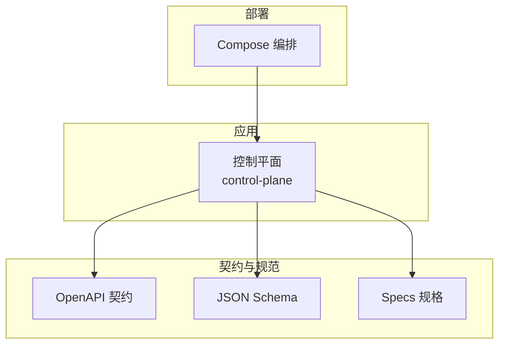
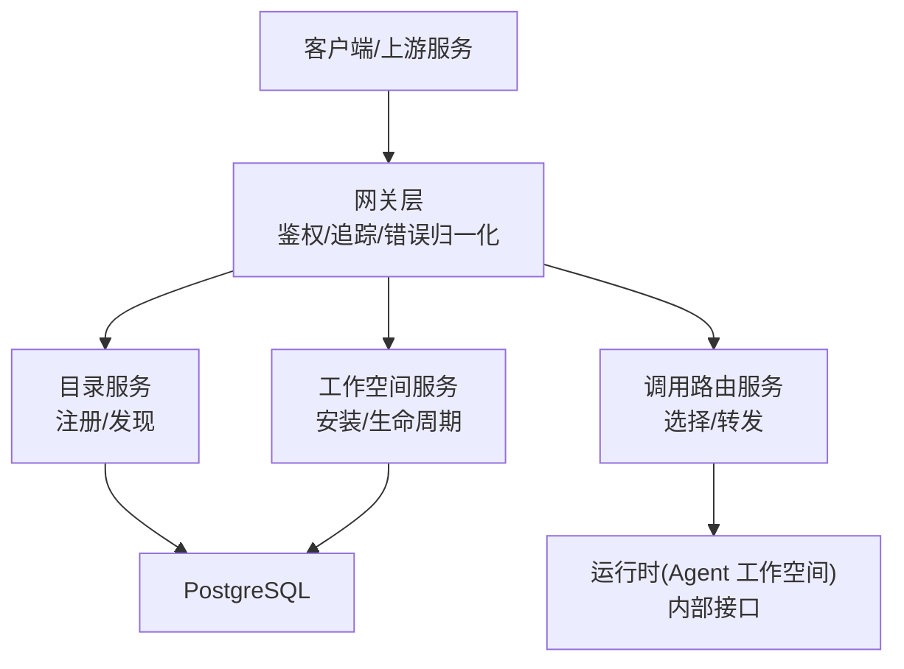
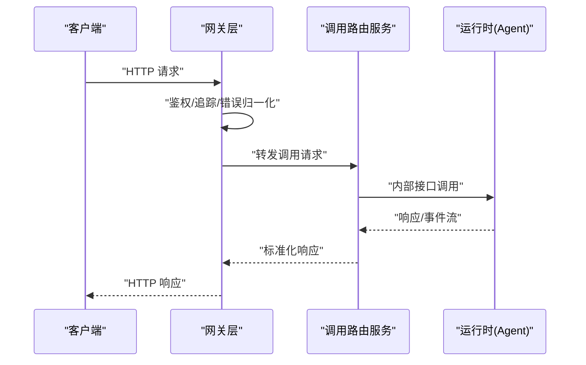
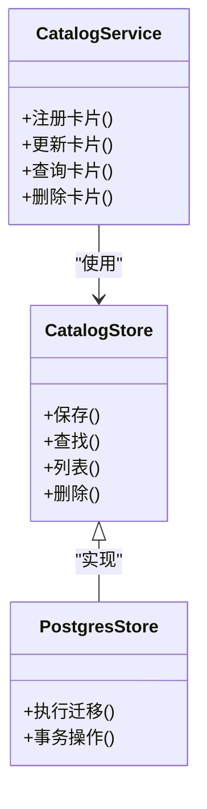
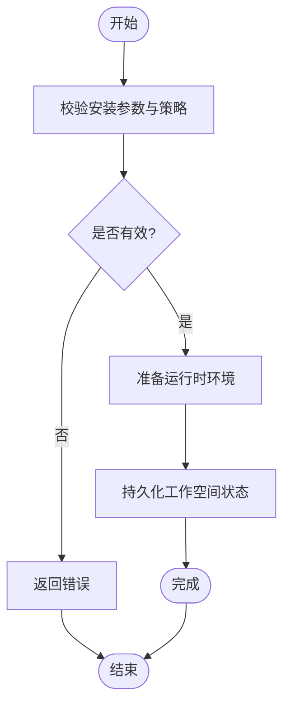
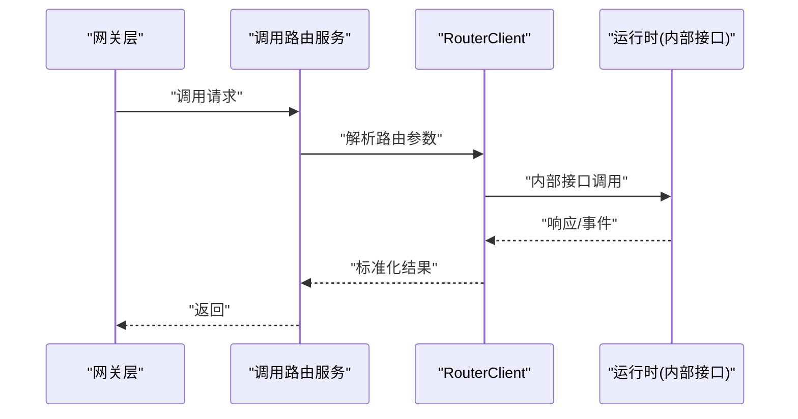
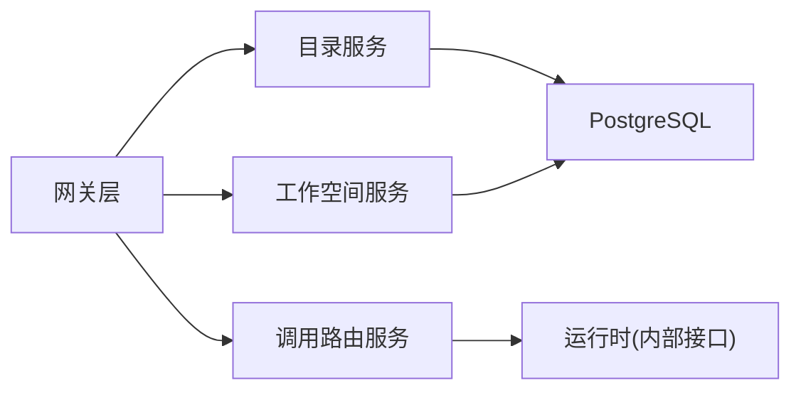

# 架构设计

<cite>
**本文引用的文件**   
- [README.md](file://README.md)
- [go.mod](file://go.mod)
- [deploy/compose.yaml](file://deploy/compose.yaml)
- [apps/control-plane/cmd/control-plane/main.go](file://apps/control-plane/cmd/control-plane/main.go)
- [apps/control-plane/internal/config/config.go](file://apps/control-plane/internal/config/config.go)
- [apps/control-plane/internal/gateway/auth.go](file://apps/control-plane/internal/gateway/auth.go)
- [apps/control-plane/internal/gateway/catalog_handler.go](file://apps/control-plane/internal/gateway/catalog_handler.go)
- [apps/control-plane/internal/gateway/invocation_handler.go](file://apps/control-plane/internal/gateway/invocation_handler.go)
- [apps/control-plane/internal/gateway/workspace_handler.go](file://apps/control-plane/internal/gateway/workspace_handler.go)
- [apps/control-plane/internal/gateway/errors.go](file://apps/control-plane/internal/gateway/errors.go)
- [apps/control-plane/internal/gateway/trace.go](file://apps/control-plane/internal/gateway/trace.go)
- [apps/control-plane/internal/catalog/service.go](file://apps/control-plane/internal/catalog/service.go)
- [apps/control-plane/internal/catalog/store.go](file://apps/control-plane/internal/catalog/store.go)
- [apps/control-plane/internal/catalog/postgres/store.go](file://apps/control-plane/internal/catalog/postgres/store.go)
- [apps/control-plane/internal/catalog/model.go](file://apps/control-plane/internal/catalog/model.go)
- [apps/control-plane/internal/workspace/service.go](file://apps/control-plane/internal/workspace/service.go)
- [apps/control-plane/internal/workspace/store.go](file://apps/control-plane/internal/workspace/store.go)
- [apps/control-plane/internal/workspace/postgres/store.go](file://apps/control-plane/internal/workspace/postgres/store.go)
- [apps/control-plane/internal/workspace/model.go](file://apps/control-plane/internal/workspace/model.go)
- [apps/control-plane/internal/invocation/service.go](file://apps/control-plane/internal/invocation/service.go)
- [apps/control-plane/internal/invocation/router_client.go](file://apps/control-plane/internal/invocation/router_client.go)
- [contracts/openapi/control-plane.v2.yaml](file://contracts/openapi/control-plane.v2.yaml)
- [contracts/openapi/router-internal.v3.yaml](file://contracts/openapi/router-internal.v3.yaml)
- [contracts/schemas/platform-error.v4.schema.json](file://contracts/schemas/platform-error.v4.schema.json)
- [docs/architecture/platform-direction.md](file://docs/architecture/platform-direction.md)
- [docs/decisions/0001-go-backend-stack.md](file://docs/decisions/0001-go-backend-stack.md)
- [docs/decisions/0004-catalog-persistence-and-consistency.md](file://docs/decisions/0004-catalog-persistence-and-consistency.md)
- [specs/002-catalog-registry-discovery/spec.md](file://specs/002-catalog-registry-discovery/spec.md)
- [specs/003-workspace-installation-contracts/spec.md](file://specs/003-workspace-installation-contracts/spec.md)
- [specs/012-control-plane-invocation-dispatch/spec.md](file://specs/012-control-plane-invocation-dispatch/spec.md)
</cite>

## 目录
1. [简介](#简介)
2. [项目结构](#项目结构)
3. [核心组件](#核心组件)
4. [架构总览](#架构总览)
5. [详细组件分析](#详细组件分析)
6. [依赖分析](#依赖分析)
7. [性能考虑](#性能考虑)
8. [故障排查指南](#故障排查指南)
9. [结论](#结论)
10. [附录](#附录)

## 简介
本文件为 NeKiro 平台的架构设计文档，聚焦控制平面与相关子系统的高层设计、组件划分、交互模式、数据流与集成方式。平台采用微服务化思想，当前实现以“控制平面”为核心，提供目录服务、工作空间服务、网关层与调用路由等能力；并通过 OpenAPI 契约与运行时（Agent 工作空间）解耦，确保跨版本兼容与可演进性。

## 项目结构
仓库采用多模块组织：
- apps：应用与服务实现，当前包含 control-plane 主服务
- contracts：OpenAPI 规范、JSON Schema 与一致性测试用例
- specs：需求规格与契约说明
- docs：架构方向、决策记录与运行手册
- deploy：部署编排（Compose）
- sdks：SDK（预留）

图表来源
- [apps/control-plane/cmd/control-plane/main.go:1-200](file://apps/control-plane/cmd/control-plane/main.go#L1-L200)
- [contracts/openapi/control-plane.v2.yaml:1-200](file://contracts/openapi/control-plane.v2.yaml#L1-L200)
- [deploy/compose.yaml:1-200](file://deploy/compose.yaml#L1-L200)

章节来源
- [README.md:1-200](file://README.md#L1-L200)
- [go.mod:1-200](file://go.mod#L1-L200)
- [deploy/compose.yaml:1-200](file://deploy/compose.yaml#L1-L200)

## 核心组件
- 网关层（Gateway）
  - 职责：统一入口、鉴权、限流、追踪、错误归一化、请求转发
  - 关键文件：auth.go、catalog_handler.go、invocation_handler.go、workspace_handler.go、errors.go、trace.go
- 目录服务（Catalog Service）
  - 职责：Agent 卡注册、发现、版本管理、能力声明
  - 关键文件：service.go、store.go、postgres/store.go、model.go
- 工作空间服务（Workspace Service）
  - 职责：安装、创建、读取、生命周期管理、策略与权限
  - 关键文件：service.go、store.go、postgres/store.go、model.go、policy.go
- 调用路由（Invocation Router Client）
  - 职责：根据目录与工作空间信息选择目标运行时、建立调用通道、透传上下文与追踪
  - 关键文件：router_client.go、service.go

章节来源
- [apps/control-plane/internal/gateway/catalog_handler.go:1-200](file://apps/control-plane/internal/gateway/catalog_handler.go#L1-L200)
- [apps/control-plane/internal/gateway/invocation_handler.go:1-200](file://apps/control-plane/internal/gateway/invocation_handler.go#L1-L200)
- [apps/control-plane/internal/gateway/workspace_handler.go:1-200](file://apps/control-plane/internal/gateway/workspace_handler.go#L1-L200)
- [apps/control-plane/internal/catalog/service.go:1-200](file://apps/control-plane/internal/catalog/service.go#L1-L200)
- [apps/control-plane/internal/workspace/service.go:1-200](file://apps/control-plane/internal/workspace/service.go#L1-L200)
- [apps/control-plane/internal/invocation/service.go:1-200](file://apps/control-plane/internal/invocation/service.go#L1-L200)

## 架构总览
NeKiro 控制平面作为系统边界内的中枢，对外暴露 REST API，对内协调目录、工作空间与调用路由。运行时（Agent 工作空间）通过内部接口与控制平面交互，遵循 OpenAPI 契约。

图表来源
- [apps/control-plane/cmd/control-plane/main.go:1-200](file://apps/control-plane/cmd/control-plane/main.go#L1-L200)
- [apps/control-plane/internal/gateway/catalog_handler.go:1-200](file://apps/control-plane/internal/gateway/catalog_handler.go#L1-L200)
- [apps/control-plane/internal/gateway/workspace_handler.go:1-200](file://apps/control-plane/internal/gateway/workspace_handler.go#L1-L200)
- [apps/control-plane/internal/gateway/invocation_handler.go:1-200](file://apps/control-plane/internal/gateway/invocation_handler.go#L1-L200)
- [apps/control-plane/internal/catalog/service.go:1-200](file://apps/control-plane/internal/catalog/service.go#L1-L200)
- [apps/control-plane/internal/workspace/service.go:1-200](file://apps/control-plane/internal/workspace/service.go#L1-L200)
- [apps/control-plane/internal/invocation/service.go:1-200](file://apps/control-plane/internal/invocation/service.go#L1-L200)
- [contracts/openapi/control-plane.v2.yaml:1-200](file://contracts/openapi/control-plane.v2.yaml#L1-L200)
- [contracts/openapi/router-internal.v3.yaml:1-200](file://contracts/openapi/router-internal.v3.yaml#L1-L200)

## 详细组件分析

### 网关层（Gateway）
- 功能要点
  - 鉴权：基于中间件校验令牌/上下文，拒绝非法访问
  - 错误归一化：将领域错误映射为标准平台错误
  - 追踪：注入并透传 trace/correlation ID
  - 路由分发：按路径/方法分派到具体 Handler
- 关键流程（以调用为例）
  - 接收请求 → 鉴权 → 解析参数 → 调用调用路由服务 → 返回结果或错误

图表来源
- [apps/control-plane/internal/gateway/invocation_handler.go:1-200](file://apps/control-plane/internal/gateway/invocation_handler.go#L1-L200)
- [apps/control-plane/internal/invocation/service.go:1-200](file://apps/control-plane/internal/invocation/service.go#L1-L200)
- [contracts/openapi/control-plane.v2.yaml:1-200](file://contracts/openapi/control-plane.v2.yaml#L1-L200)

章节来源
- [apps/control-plane/internal/gateway/auth.go:1-200](file://apps/control-plane/internal/gateway/auth.go#L1-L200)
- [apps/control-plane/internal/gateway/errors.go:1-200](file://apps/control-plane/internal/gateway/errors.go#L1-L200)
- [apps/control-plane/internal/gateway/trace.go:1-200](file://apps/control-plane/internal/gateway/trace.go#L1-L200)

### 目录服务（Catalog）
- 功能要点
  - Agent 卡注册与更新：描述能力、端点、权限范围
  - 查询与过滤：按名称、版本、标签检索
  - 持久化：PostgreSQL，迁移脚本保障结构演进
- 数据模型关系（概念）
  - 目录项包含元数据、能力清单、版本信息与状态
  - 与运行时通过端点地址关联

图表来源
- [apps/control-plane/internal/catalog/service.go:1-200](file://apps/control-plane/internal/catalog/service.go#L1-L200)
- [apps/control-plane/internal/catalog/store.go:1-200](file://apps/control-plane/internal/catalog/store.go#L1-L200)
- [apps/control-plane/internal/catalog/postgres/store.go:1-200](file://apps/control-plane/internal/catalog/postgres/store.go#L1-L200)
- [apps/control-plane/internal/catalog/model.go:1-200](file://apps/control-plane/internal/catalog/model.go#L1-L200)

章节来源
- [apps/control-plane/internal/catalog/service.go:1-200](file://apps/control-plane/internal/catalog/service.go#L1-L200)
- [apps/control-plane/internal/catalog/store.go:1-200](file://apps/control-plane/internal/catalog/store.go#L1-L200)
- [apps/control-plane/internal/catalog/postgres/store.go:1-200](file://apps/control-plane/internal/catalog/postgres/store.go#L1-L200)
- [apps/control-plane/internal/catalog/model.go:1-200](file://apps/control-plane/internal/catalog/model.go#L1-L200)
- [specs/002-catalog-registry-discovery/spec.md:1-200](file://specs/002-catalog-registry-discovery/spec.md#L1-L200)

### 工作空间服务（Workspace）
- 功能要点
  - 安装与生命周期：创建、启动、停止、销毁
  - 策略与权限：隔离、访问控制、配额
  - 持久化：PostgreSQL，迁移脚本
- 典型流程（安装）
  - 接收安装请求 → 校验策略 → 初始化资源 → 写入状态 → 返回实例标识

图表来源
- [apps/control-plane/internal/workspace/service.go:1-200](file://apps/control-plane/internal/workspace/service.go#L1-L200)
- [apps/control-plane/internal/workspace/store.go:1-200](file://apps/control-plane/internal/workspace/store.go#L1-L200)
- [apps/control-plane/internal/workspace/postgres/store.go:1-200](file://apps/control-plane/internal/workspace/postgres/store.go#L1-L200)
- [apps/control-plane/internal/workspace/policy.go:1-200](file://apps/control-plane/internal/workspace/policy.go#L1-L200)

章节来源
- [apps/control-plane/internal/workspace/service.go:1-200](file://apps/control-plane/internal/workspace/service.go#L1-L200)
- [apps/control-plane/internal/workspace/store.go:1-200](file://apps/control-plane/internal/workspace/store.go#L1-L200)
- [apps/control-plane/internal/workspace/postgres/store.go:1-200](file://apps/control-plane/internal/workspace/postgres/store.go#L1-L200)
- [apps/control-plane/internal/workspace/policy.go:1-200](file://apps/control-plane/internal/workspace/policy.go#L1-L200)
- [specs/003-workspace-installation-contracts/spec.md:1-200](file://specs/003-workspace-installation-contracts/spec.md#L1-L200)

### 调用路由（Invocation Router）
- 功能要点
  - 选择策略：基于目录与工作空间信息选择目标运行时
  - 上下文透传：携带用户身份、租户、追踪ID
  - 失败处理：重试、熔断、降级（可扩展）
- 与内部接口的契约
  - 通过 router-internal OpenAPI 定义内部通信协议

图表来源
- [apps/control-plane/internal/invocation/service.go:1-200](file://apps/control-plane/internal/invocation/service.go#L1-L200)
- [apps/control-plane/internal/invocation/router_client.go:1-200](file://apps/control-plane/internal/invocation/router_client.go#L1-L200)
- [contracts/openapi/router-internal.v3.yaml:1-200](file://contracts/openapi/router-internal.v3.yaml#L1-L200)

章节来源
- [apps/control-plane/internal/invocation/service.go:1-200](file://apps/control-plane/internal/invocation/service.go#L1-L200)
- [apps/control-plane/internal/invocation/router_client.go:1-200](file://apps/control-plane/internal/invocation/router_client.go#L1-L200)
- [specs/012-control-plane-invocation-dispatch/spec.md:1-200](file://specs/012-control-plane-invocation-dispatch/spec.md#L1-L200)

## 依赖分析
- 外部依赖
  - PostgreSQL：目录与工作空间持久化
  - OpenAPI 契约：控制平面与内部接口
  - JSON Schema：平台错误与通用类型约束
- 内部耦合
  - 网关层对业务服务的弱耦合（通过接口/服务抽象）
  - 存储层通过 store 抽象与 postgres 实现分离，便于替换

图表来源
- [apps/control-plane/cmd/control-plane/main.go:1-200](file://apps/control-plane/cmd/control-plane/main.go#L1-L200)
- [contracts/openapi/control-plane.v2.yaml:1-200](file://contracts/openapi/control-plane.v2.yaml#L1-L200)
- [contracts/openapi/router-internal.v3.yaml:1-200](file://contracts/openapi/router-internal.v3.yaml#L1-L200)
- [contracts/schemas/platform-error.v4.schema.json:1-200](file://contracts/schemas/platform-error.v4.schema.json#L1-L200)

章节来源
- [go.mod:1-200](file://go.mod#L1-L200)
- [contracts/schemas/platform-error.v4.schema.json:1-200](file://contracts/schemas/platform-error.v4.schema.json#L1-L200)

## 性能考虑
- 连接池与并发
  - 数据库连接池大小与超时配置需结合负载调优
  - HTTP 服务端并发度与 goroutine 池限制
- 缓存与幂等
  - 目录查询热点可引入只读缓存
  - 调用路由支持幂等键以避免重复执行
- 背压与限流
  - 网关层增加速率限制与队列缓冲
- 观测性
  - 指标采集、结构化日志、分布式追踪贯穿请求链路

[本节为通用指导，不直接分析具体文件]

## 故障排查指南
- 常见错误分类
  - 鉴权失败：检查令牌格式、签名与过期时间
  - 路由失败：确认目录条目存在且可达、网络连通性
  - 持久化错误：检查迁移状态、表结构与权限
- 定位手段
  - 启用追踪 ID，串联请求链路
  - 收集平台错误码与消息，对照 Schema 定位根因
  - 查看数据库迁移日志与连接池指标

章节来源
- [apps/control-plane/internal/gateway/errors.go:1-200](file://apps/control-plane/internal/gateway/errors.go#L1-L200)
- [contracts/schemas/platform-error.v4.schema.json:1-200](file://contracts/schemas/platform-error.v4.schema.json#L1-L200)
- [apps/control-plane/internal/gateway/trace.go:1-200](file://apps/control-plane/internal/gateway/trace.go#L1-L200)

## 结论
NeKiro 控制平面以清晰的边界与契约驱动的方式组织系统，通过网关层统一入口、目录与工作空间服务承载核心能力、调用路由对接运行时，形成高内聚低耦合的微服务式架构。配合 OpenAPI 与 JSON Schema 的强契约约束，平台具备良好的可演进性与兼容性。后续可在可观测性、弹性伸缩与容灾方面持续增强。

[本节为总结性内容，不直接分析具体文件]

## 附录

### 技术栈与版本兼容性
- 后端语言：Go（见技术栈决策）
- 契约：OpenAPI v3（控制平面与内部接口）
- 数据：PostgreSQL（迁移脚本管理结构演进）
- 部署：Docker Compose（本地与轻量环境）

章节来源
- [docs/decisions/0001-go-backend-stack.md:1-200](file://docs/decisions/0001-go-backend-stack.md#L1-L200)
- [contracts/openapi/control-plane.v2.yaml:1-200](file://contracts/openapi/control-plane.v2.yaml#L1-L200)
- [contracts/openapi/router-internal.v3.yaml:1-200](file://contracts/openapi/router-internal.v3.yaml#L1-L200)
- [deploy/compose.yaml:1-200](file://deploy/compose.yaml#L1-L200)

### 基础设施需求
- 计算：控制平面进程（可水平扩展）
- 存储：PostgreSQL 集群（主从/高可用）
- 网络：内部服务网格或直连（依据部署拓扑）
- 安全：TLS 终止、密钥管理、最小权限原则

章节来源
- [deploy/compose.yaml:1-200](file://deploy/compose.yaml#L1-L200)
- [docs/architecture/platform-direction.md:1-200](file://docs/architecture/platform-direction.md#L1-L200)

### 可扩展性与部署拓扑
- 水平扩展：无状态网关与业务服务可多副本部署
- 数据分区：按租户/工作空间进行逻辑隔离
- 灰度发布：基于目录版本与路由策略逐步放量

章节来源
- [specs/002-catalog-registry-discovery/spec.md:1-200](file://specs/002-catalog-registry-discovery/spec.md#L1-L200)
- [specs/003-workspace-installation-contracts/spec.md:1-200](file://specs/003-workspace-installation-contracts/spec.md#L1-L200)

### 横切关注点
- 安全性
  - 鉴权与授权在网关层集中处理
  - 内部接口遵循最小暴露原则
- 监控与可观测性
  - 指标、日志、追踪三件套贯穿全链路
- 灾难恢复
  - 数据库备份与回滚策略
  - 服务重启与自愈机制

章节来源
- [apps/control-plane/internal/gateway/auth.go:1-200](file://apps/control-plane/internal/gateway/auth.go#L1-L200)
- [apps/control-plane/internal/gateway/trace.go:1-200](file://apps/control-plane/internal/gateway/trace.go#L1-L200)
- [docs/decisions/0004-catalog-persistence-and-consistency.md:1-200](file://docs/decisions/0004-catalog-persistence-and-consistency.md#L1-L200)