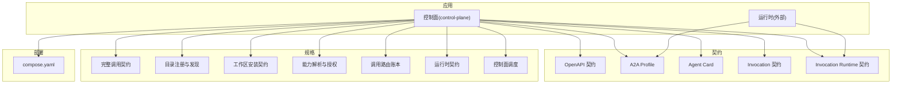
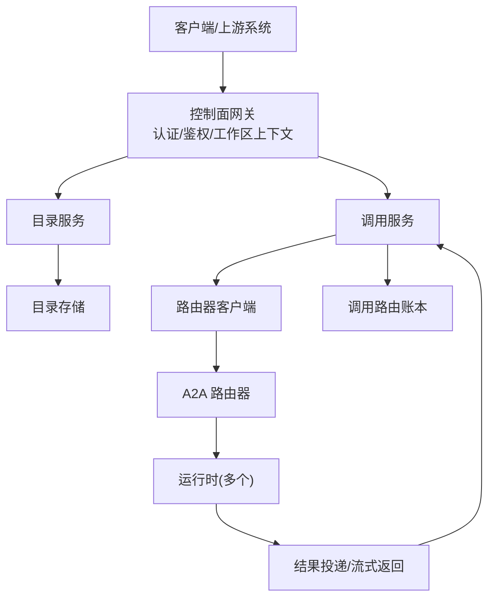
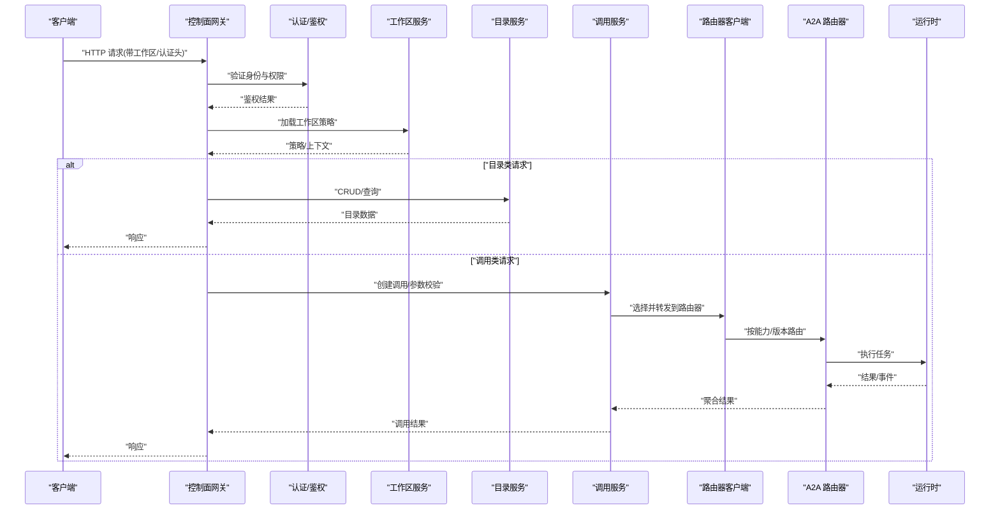
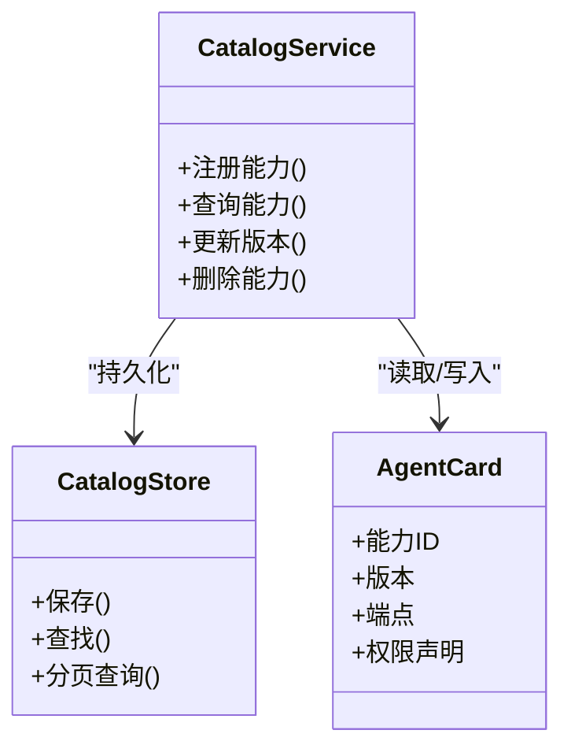
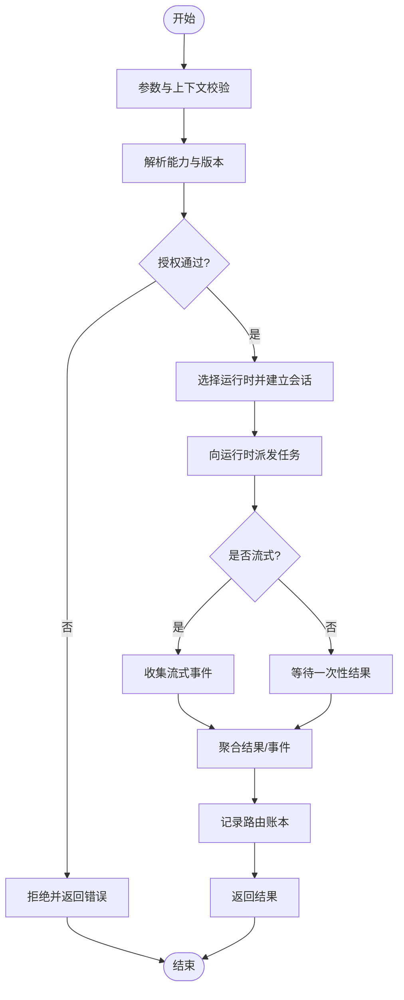
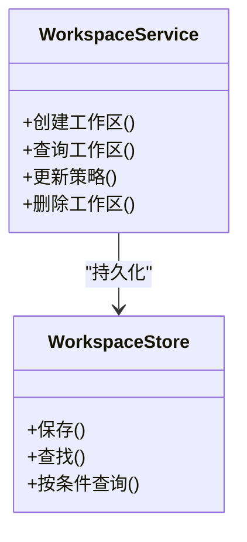
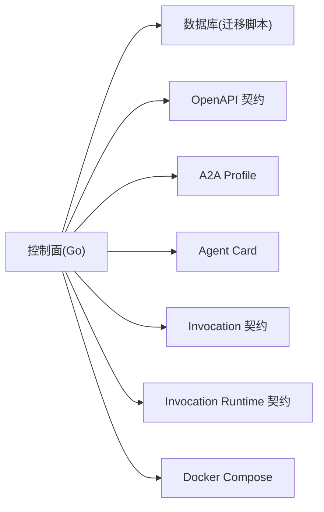

# 系统概览

<cite>
**本文引用的文件**   
- [README.md](file://README.md)
- [go.mod](file://go.mod)
- [deploy/compose.yaml](file://deploy/compose.yaml)
- [apps/control-plane/cmd/control-plane/main.go](file://apps/control-plane/cmd/control-plane/main.go)
- [apps/control-plane/internal/config/config.go](file://apps/control-plane/internal/config/config.go)
- [apps/control-plane/internal/gateway/auth.go](file://apps/control-plane/internal/gateway/auth.go)
- [apps/control-plane/internal/gateway/catalog_handler.go](file://apps/control-plane/internal/gateway/catalog_handler.go)
- [apps/control-plane/internal/gateway/invocation_handler.go](file://apps/control-plane/internal/gateway/invocation_handler.go)
- [apps/control-plane/internal/gateway/workspace_handler.go](file://apps/control-plane/internal/gateway/workspace_handler.go)
- [apps/control-plane/internal/invocation/service.go](file://apps/control-plane/internal/invocation/service.go)
- [apps/control-plane/internal/invocation/router_client.go](file://apps/control-plane/internal/invocation/router_client.go)
- [apps/control-plane/internal/catalog/service.go](file://apps/control-plane/internal/catalog/service.go)
- [apps/control-plane/internal/catalog/store.go](file://apps/control-plane/internal/catalog/store.go)
- [apps/control-plane/internal/workspace/service.go](file://apps/control-plane/internal/workspace/service.go)
- [apps/control-plane/internal/workspace/store.go](file://apps/control-plane/internal/workspace/store.go)
- [contracts/openapi/control-plane.v2.yaml](file://contracts/openapi/control-plane.v2.yaml)
- [contracts/openapi/router-agent.v1.yaml](file://contracts/openapi/router-agent.v1.yaml)
- [contracts/openapi/router-internal.v3.yaml](file://contracts/openapi/router-internal.v3.yaml)
- [contracts/a2a-profile/v0.3.0.json](file://contracts/a2a-profile/v0.3.0.json)
- [contracts/agent-card/v0.2/semantic-rules.md](file://contracts/agent-card/v0.2/semantic-rules.md)
- [contracts/installation/v2/semantic-rules.md](file://contracts/installation/v2/semantic-rules.md)
- [contracts/invocation/v1/semantic-rules.md](file://contracts/invocation/v1/semantic-rules.md)
- [contracts/invocation-runtime/v1/semantic-rules.md](file://contracts/invocation-runtime/v1/semantic-rules.md)
- [contracts/platform-error.v4.schema.json](file://contracts/platform-error.v4.schema.json)
- [specs/001-complete-invocation-contracts/spec.md](file://specs/001-complete-invocation-contracts/spec.md)
- [specs/002-catalog-registry-discovery/spec.md](file://specs/002-catalog-registry-discovery/spec.md)
- [specs/003-workspace-installation-contracts/spec.md](file://specs/003-workspace-installation-contracts/spec.md)
- [specs/006-resolve-authorize-capability/spec.md](file://specs/006-resolve-authorize-capability/spec.md)
- [specs/010-invocation-routing-ledger/spec.md](file://specs/010-invocation-routing-ledger/spec.md)
- [specs/011-invocation-runtime-contracts/spec.md](file://specs/011-invocation-runtime-contracts/spec.md)
- [specs/012-control-plane-invocation-dispatch/spec.md](file://specs/012-control-plane-invocation-dispatch/spec.md)
- [docs/architecture/platform-direction.md](file://docs/architecture/platform-direction.md)
- [docs/decisions/0001-go-backend-stack.md](file://docs/decisions/0001-go-backend-stack.md)
- [docs/decisions/0002-invocation-result-transport-and-internal-api-direction.md](file://docs/decisions/0002-invocation-result-transport-and-internal-api-direction.md)
- [docs/decisions/0003-runtime-agnostic-platform-boundary.md](file://docs/decisions/0003-runtime-agnostic-platform边界.md)
- [docs/decisions/0004-catalog-persistence-and-consistency.md](file://docs/decisions/0004-catalog-persistence-and-consistency.md)
- [docs/decisions/0005-minimal-workspace-installation-boundary.md](file://docs/decisions/0005-minimal-workspace-installation-boundary.md)
- [docs/decisions/0006-invocation-runtime-trust-and-failure-policy.md](file://docs/decisions/0006-invocation-runtime-trust-and-failure-policy.md)
- [docs/roadmap/after-workspace-next-plan.md](file://docs/roadmap/after-workspace-next-plan.md)
</cite>

## 目录
1. [简介](#简介)
2. [项目结构](#项目结构)
3. [核心组件](#核心组件)
4. [架构总览](#架构总览)
5. [详细组件分析](#详细组件分析)
6. [依赖分析](#依赖分析)
7. [性能考虑](#性能考虑)
8. [故障排查指南](#故障排查指南)
9. [结论](#结论)
10. [附录](#附录)

## 简介
NeKiro AI Agent 平台旨在为多租户、可编排的 AI Agent 提供统一的控制面与契约驱动的运行环境。平台通过“智能路由 + 工作区隔离 + 契约化接口”的方式，将不同运行时（Agent SDK、外部服务）以标准化方式接入，实现跨租户的安全调用、能力发现与结果投递。其核心价值主张包括：
- 多租户与工作区隔离：以工作区为单位进行资源与权限隔离，确保数据与访问边界清晰。
- 契约驱动开发：以 OpenAPI、A2A Profile、Agent Card、Invocation 等契约为核心，驱动前后端与运行时的协同演进。
- 智能路由与可观测性：基于能力解析与策略决策，将调用精准路由至目标运行时，并贯穿追踪与审计。
- 生命周期管理：从安装、注册、发布到版本管理与下线的全链路治理。

本概览文档面向产品、研发与运维读者，帮助快速理解平台愿景、架构理念、关键特性与演进路线。

## 项目结构
仓库采用多应用与契约分离的组织方式：
- apps：平台核心应用与控制面实现（control-plane），以及未来扩展的路由器（a2a-router）。
- contracts：契约定义（OpenAPI、JSON Schema、语义规则、一致性测试用例），作为跨团队与跨语言的唯一事实来源。
- specs：按主题划分的规格说明与任务拆解，覆盖调用链、目录注册、工作区、能力解析、路由账本、运行时契约等。
- docs：架构方向、技术决策、路线图与本地开发手册。
- deploy：部署编排（Compose）。
- tests：集成与一致性测试。

图表来源
- [deploy/compose.yaml](file://deploy/compose.yaml)
- [contracts/openapi/control-plane.v2.yaml](file://contracts/openapi/control-plane.v2.yaml)
- [contracts/a2a-profile/v0.3.0.json](file://contracts/a2a-profile/v0.3.0.json)
- [contracts/agent-card/v0.2/semantic-rules.md](file://contracts/agent-card/v0.2/semantic-rules.md)
- [contracts/invocation/v1/semantic-rules.md](file://contracts/invocation/v1/semantic-rules.md)
- [contracts/invocation-runtime/v1/semantic-rules.md](file://contracts/invocation-runtime/v1/semantic-rules.md)
- [specs/001-complete-invocation-contracts/spec.md](file://specs/001-complete-invocation-contracts/spec.md)
- [specs/002-catalog-registry-discovery/spec.md](file://specs/002-catalog-registry-discovery/spec.md)
- [specs/003-workspace-installation-contracts/spec.md](file://specs/003-workspace-installation-contracts/spec.md)
- [specs/006-resolve-authorize-capability/spec.md](file://specs/006-resolve-authorize-capability/spec.md)
- [specs/010-invocation-routing-ledger/spec.md](file://specs/010-invocation-routing-ledger/spec.md)
- [specs/011-invocation-runtime-contracts/spec.md](file://specs/011-invocation-runtime-contracts/spec.md)
- [specs/012-control-plane-invocation-dispatch/spec.md](file://specs/012-control-plane-invocation-dispatch/spec.md)

章节来源
- [README.md](file://README.md)
- [deploy/compose.yaml](file://deploy/compose.yaml)

## 核心组件
- 控制面（Control Plane）
  - 网关层：对外暴露 OpenAPI，处理认证、鉴权、工作区上下文、目录与调用入口。
  - 目录服务：维护 Agent 能力注册、版本与可见性，支撑发现与选择。
  - 调用服务：负责调用编排、路由决策、结果收集与错误归一化。
  - 工作区服务：管理工作区生命周期、策略与隔离边界。
- 契约体系
  - OpenAPI：控制面与路由器内部/外部 API 的版本化契约。
  - A2A Profile / Agent Card：描述 Agent 能力、权限与端点。
  - Invocation / Invocation Runtime：统一调用协议与运行时交互规范。
  - JSON Schema：平台错误、工作区等通用模型校验。
- 规格与决策
  - 规格（specs）：对关键能力的端到端说明与验收标准。
  - 决策（docs/decisions）：记录技术选型与边界约束。

章节来源
- [apps/control-plane/cmd/control-plane/main.go](file://apps/control-plane/cmd/control-plane/main.go)
- [apps/control-plane/internal/config/config.go](file://apps/control-plane/internal/config/config.go)
- [apps/control-plane/internal/gateway/auth.go](file://apps/control-plane/internal/gateway/auth.go)
- [apps/control-plane/internal/gateway/catalog_handler.go](file://apps/control-plane/internal/gateway/catalog_handler.go)
- [apps/control-plane/internal/gateway/invocation_handler.go](file://apps/control-plane/internal/gateway/invocation_handler.go)
- [apps/control-plane/internal/gateway/workspace_handler.go](file://apps/control-plane/internal/gateway/workspace_handler.go)
- [apps/control-plane/internal/invocation/service.go](file://apps/control-plane/internal/invocation/service.go)
- [apps/control-plane/internal/invocation/router_client.go](file://apps/control-plane/internal/invocation/router_client.go)
- [apps/control-plane/internal/catalog/service.go](file://apps/control-plane/internal/catalog/service.go)
- [apps/control-plane/internal/catalog/store.go](file://apps/control-plane/internal/catalog/store.go)
- [apps/control-plane/internal/workspace/service.go](file://apps/control-plane/internal/workspace/service.go)
- [apps/control-plane/internal/workspace/store.go](file://apps/control-plane/internal/workspace/store.go)
- [contracts/openapi/control-plane.v2.yaml](file://contracts/openapi/control-plane.v2.yaml)
- [contracts/openapi/router-agent.v1.yaml](file://contracts/openapi/router-agent.v1.yaml)
- [contracts/openapi/router-internal.v3.yaml](file://contracts/openapi/router-internal.v3.yaml)
- [contracts/a2a-profile/v0.3.0.json](file://contracts/a2a-profile/v0.3.0.json)
- [contracts/agent-card/v0.2/semantic-rules.md](file://contracts/agent-card/v0.2/semantic-rules.md)
- [contracts/invocation/v1/semantic-rules.md](file://contracts/invocation/v1/semantic-rules.md)
- [contracts/invocation-runtime/v1/semantic-rules.md](file://contracts/invocation-runtime/v1/semantic-rules.md)
- [contracts/platform-error.v4.schema.json](file://contracts/platform-error.v4.schema.json)
- [specs/001-complete-invocation-contracts/spec.md](file://specs/001-complete-invocation-contracts/spec.md)
- [specs/002-catalog-registry-discovery/spec.md](file://specs/002-catalog-registry-discovery/spec.md)
- [specs/003-workspace-installation-contracts/spec.md](file://specs/003-workspace-installation-contracts/spec.md)
- [specs/006-resolve-authorize-capability/spec.md](file://specs/006-resolve-authorize-capability/spec.md)
- [specs/010-invocation-routing-ledger/spec.md](file://specs/010-invocation-routing-ledger/spec.md)
- [specs/011-invocation-runtime-contracts/spec.md](file://specs/011-invocation-runtime-contracts/spec.md)
- [specs/012-control-plane-invocation-dispatch/spec.md](file://specs/012-control-plane-invocation-dispatch/spec.md)

## 架构总览
平台采用“控制面 + 运行时”解耦架构。控制面负责能力注册、发现、路由与编排；运行时承载具体 Agent 逻辑。二者通过契约（A2A Profile、Agent Card、Invocation、Runtime）进行协作，并通过 OpenAPI 暴露稳定接口。

图表来源
- [apps/control-plane/internal/gateway/invocation_handler.go](file://apps/control-plane/internal/gateway/invocation_handler.go)
- [apps/control-plane/internal/invocation/service.go](file://apps/control-plane/internal/invocation/service.go)
- [apps/control-plane/internal/invocation/router_client.go](file://apps/control-plane/internal/invocation/router_client.go)
- [contracts/openapi/router-agent.v1.yaml](file://contracts/openapi/router-agent.v1.yaml)
- [contracts/openapi/router-internal.v3.yaml](file://contracts/openapi/router-internal.v3.yaml)
- [contracts/invocation/v1/semantic-rules.md](file://contracts/invocation/v1/semantic-rules.md)
- [contracts/invocation-runtime/v1/semantic-rules.md](file://contracts/invocation-runtime/v1/semantic-rules.md)
- [specs/010-invocation-routing-ledger/spec.md](file://specs/010-invocation-routing-ledger/spec.md)

## 详细组件分析

### 控制面网关层
职责
- 统一入口：接收来自客户端的请求，解析工作区上下文与认证信息。
- 鉴权与策略：结合工作区策略与能力权限，决定请求是否允许进入后续流程。
- 路由分发：根据请求类型分发至目录或调用处理分支。

关键路径
- 认证与上下文注入
- 目录相关接口（注册、查询、版本管理）
- 调用相关接口（发起、状态查询、结果获取）

图表来源
- [apps/control-plane/internal/gateway/auth.go](file://apps/control-plane/internal/gateway/auth.go)
- [apps/control-plane/internal/gateway/workspace_handler.go](file://apps/control-plane/internal/gateway/workspace_handler.go)
- [apps/control-plane/internal/gateway/catalog_handler.go](file://apps/control-plane/internal/gateway/catalog_handler.go)
- [apps/control-plane/internal/gateway/invocation_handler.go](file://apps/control-plane/internal/gateway/invocation_handler.go)
- [apps/control-plane/internal/invocation/service.go](file://apps/control-plane/internal/invocation/service.go)
- [apps/control-plane/internal/invocation/router_client.go](file://apps/control-plane/internal/invocation/router_client.go)
- [contracts/openapi/control-plane.v2.yaml](file://contracts/openapi/control-plane.v2.yaml)
- [contracts/openapi/router-agent.v1.yaml](file://contracts/openapi/router-agent.v1.yaml)
- [contracts/openapi/router-internal.v3.yaml](file://contracts/openapi/router-internal.v3.yaml)

章节来源
- [apps/control-plane/internal/gateway/auth.go](file://apps/control-plane/internal/gateway/auth.go)
- [apps/control-plane/internal/gateway/catalog_handler.go](file://apps/control-plane/internal/gateway/catalog_handler.go)
- [apps/control-plane/internal/gateway/invocation_handler.go](file://apps/control-plane/internal/gateway/invocation_handler.go)
- [apps/control-plane/internal/gateway/workspace_handler.go](file://apps/control-plane/internal/gateway/workspace_handler.go)
- [contracts/openapi/control-plane.v2.yaml](file://contracts/openapi/control-plane.v2.yaml)

### 目录服务（Catalog）
职责
- 维护 Agent 能力元数据、版本与可见性。
- 支持按工作区/租户维度进行注册与发现。
- 为路由与授权提供依据。

数据结构与关系
- 能力卡片（Agent Card）：描述能力、权限、端点与版本。
- 目录条目：包含能力标识、版本、工作区绑定与状态。

图表来源
- [apps/control-plane/internal/catalog/service.go](file://apps/control-plane/internal/catalog/service.go)
- [apps/control-plane/internal/catalog/store.go](file://apps/control-plane/internal/catalog/store.go)
- [contracts/agent-card/v0.2/semantic-rules.md](file://contracts/agent-card/v0.2/semantic-rules.md)

章节来源
- [apps/control-plane/internal/catalog/service.go](file://apps/control-plane/internal/catalog/service.go)
- [apps/control-plane/internal/catalog/store.go](file://apps/control-plane/internal/catalog/store.go)
- [specs/002-catalog-registry-discovery/spec.md](file://specs/002-catalog-registry-discovery/spec.md)

### 调用服务与路由（Invocation & Router）
职责
- 编排调用生命周期：创建、跟踪、重试、超时、结果聚合。
- 基于能力与策略选择目标运行时，并通过路由器完成实际转发。
- 维护调用路由账本，用于审计与排障。

图表来源
- [apps/control-plane/internal/invocation/service.go](file://apps/control-plane/internal/invocation/service.go)
- [apps/control-plane/internal/invocation/router_client.go](file://apps/control-plane/internal/invocation/router_client.go)
- [contracts/invocation/v1/semantic-rules.md](file://contracts/invocation/v1/semantic-rules.md)
- [contracts/invocation-runtime/v1/semantic-rules.md](file://contracts/invocation-runtime/v1/semantic-rules.md)
- [specs/010-invocation-routing-ledger/spec.md](file://specs/010-invocation-routing-ledger/spec.md)

章节来源
- [apps/control-plane/internal/invocation/service.go](file://apps/control-plane/internal/invocation/service.go)
- [apps/control-plane/internal/invocation/router_client.go](file://apps/control-plane/internal/invocation/router_client.go)
- [specs/012-control-plane-invocation-dispatch/spec.md](file://specs/012-control-plane-invocation-dispatch/spec.md)

### 工作区服务（Workspace）
职责
- 管理工作区生命周期：创建、启用、禁用、销毁。
- 维护工作区策略与隔离边界，影响目录可见性与调用授权。
- 为网关层提供上下文与策略加载。

图表来源
- [apps/control-plane/internal/workspace/service.go](file://apps/control-plane/internal/workspace/service.go)
- [apps/control-plane/internal/workspace/store.go](file://apps/control-plane/internal/workspace/store.go)
- [specs/003-workspace-installation-contracts/spec.md](file://specs/003-workspace-installation-contracts/spec.md)

章节来源
- [apps/control-plane/internal/workspace/service.go](file://apps/control-plane/internal/workspace/service.go)
- [apps/control-plane/internal/workspace/store.go](file://apps/control-plane/internal/workspace/store.go)
- [specs/003-workspace-installation-contracts/spec.md](file://specs/003-workspace-installation-contracts/spec.md)

### 契约与兼容性
- OpenAPI：控制面 v2、路由器 agent v1、路由器内部 v3 等版本化契约，保证跨进程/跨语言兼容。
- A2A Profile v0.3.0：定义 Agent 间通信与消息格式。
- Agent Card v0.2：能力描述与权限语义规则。
- Invocation v1 与 Invocation Runtime v1：调用协议与运行时交互语义。
- Platform Error v4：统一错误模型，便于前端与下游一致处理。

章节来源
- [contracts/openapi/control-plane.v2.yaml](file://contracts/openapi/control-plane.v2.yaml)
- [contracts/openapi/router-agent.v1.yaml](file://contracts/openapi/router-agent.v1.yaml)
- [contracts/openapi/router-internal.v3.yaml](file://contracts/openapi/router-internal.v3.yaml)
- [contracts/a2a-profile/v0.3.0.json](file://contracts/a2a-profile/v0.3.0.json)
- [contracts/agent-card/v0.2/semantic-rules.md](file://contracts/agent-card/v0.2/semantic-rules.md)
- [contracts/invocation/v1/semantic-rules.md](file://contracts/invocation/v1/semantic-rules.md)
- [contracts/invocation-runtime/v1/semantic-rules.md](file://contracts/invocation-runtime/v1/semantic-rules.md)
- [contracts/platform-error.v4.schema.json](file://contracts/platform-error.v4.schema.json)

## 依赖分析
- 语言与工具链
  - Go 后端栈：高性能、强并发、生态成熟，适合网关与服务编排场景。
  - Docker Compose：简化本地与演示环境的编排。
- 契约与测试
  - 契约驱动：OpenAPI/Schema/语义规则作为单一事实来源，配合一致性测试保障演进安全。
- 外部依赖
  - 数据库：目录与工作区持久化（迁移脚本位于 control-plane/migrations）。
  - 网络：与 A2A 路由器及运行时通过 HTTP/SSE 等协议交互。

图表来源
- [go.mod](file://go.mod)
- [deploy/compose.yaml](file://deploy/compose.yaml)
- [apps/control-plane/internal/catalog/store.go](file://apps/control-plane/internal/catalog/store.go)
- [apps/control-plane/internal/workspace/store.go](file://apps/control-plane/internal/workspace/store.go)

章节来源
- [go.mod](file://go.mod)
- [deploy/compose.yaml](file://deploy/compose.yaml)
- [docs/decisions/0001-go-backend-stack.md](file://docs/decisions/0001-go-backend-stack.md)

## 性能考虑
- 路由与并发
  - 网关层应使用连接池与超时控制，避免长尾阻塞。
  - 调用服务在流式场景下需背压与限流，防止内存膨胀。
- 缓存与幂等
  - 目录查询热点可引入只读缓存，降低存储压力。
  - 调用幂等键与去重机制，避免重复执行。
- 可观测性
  - 全链路追踪 ID 贯穿网关、路由与运行时，便于定位瓶颈。
- 资源隔离
  - 工作区级配额与速率限制，保障多租户公平性。

[本节为通用指导，不直接分析具体文件]

## 故障排查指南
- 常见错误分类
  - 认证/鉴权失败：检查网关认证头与工作区策略。
  - 能力未找到/版本不匹配：核对目录中能力注册与版本范围。
  - 调用超时/中断：查看路由账本与运行时健康状态。
  - 结果不一致：确认幂等键与重试策略。
- 定位步骤
  - 通过调用 ID 检索路由账本，定位失败阶段。
  - 检查 OpenAPI 契约版本与实际实现差异。
  - 核对 A2A Profile 与 Agent Card 的端点与权限声明。
- 参考错误模型
  - 平台错误模型 v4：统一错误码与消息结构，便于前端展示与自动化处理。

章节来源
- [contracts/platform-error.v4.schema.json](file://contracts/platform-error.v4.schema.json)
- [apps/control-plane/internal/gateway/errors.go](file://apps/control-plane/internal/gateway/errors.go)
- [specs/010-invocation-routing-ledger/spec.md](file://specs/010-invocation-routing-ledger/spec.md)

## 结论
NeKiro AI Agent 平台以契约为核心、以工作区为边界、以路由为枢纽，构建了可扩展、可治理、可观测的 AI Agent 基础设施。通过明确的职责划分与稳定的接口约定，平台能够在多租户环境下高效地编排与调度各类运行时，持续支撑业务创新与规模化落地。

[本节为总结性内容，不直接分析具体文件]

## 附录

### 用户角色与使用场景
- 开发者
  - 注册与发布 Agent 能力（Agent Card），定义权限与端点。
  - 基于 Invocation 契约开发与调试调用流程。
- 平台管理员
  - 管理工作区与策略，配置路由与可见性规则。
  - 监控调用账本与错误分布，优化性能与稳定性。
- 业务方/集成方
  - 通过控制面 OpenAPI 发起调用，消费结构化结果。
  - 在多工作区环境中复用能力，实现跨域编排。

[本节为概念性内容，不直接分析具体文件]

### 技术栈选择与优势
- Go 后端栈：高并发、低延迟、易于部署，契合网关与服务编排需求。
- 契约优先：OpenAPI/Schema/语义规则驱动设计与测试，降低集成成本。
- 容器化编排：Compose 简化本地与演示环境，利于快速迭代。

章节来源
- [docs/decisions/0001-go-backend-stack.md](file://docs/decisions/0001-go-backend-stack.md)
- [docs/decisions/0002-invocation-result-transport-and-internal-api-direction.md](file://docs/decisions/0002-invocation-result-transport-and-internal-api-direction.md)
- [docs/decisions/0003-runtime-agnostic-platform边界.md](file://docs/decisions/0003-runtime-agnostic-platform边界.md)
- [docs/decisions/0004-catalog-persistence-and-consistency.md](file://docs/decisions/0004-catalog-persistence-and-consistency.md)
- [docs/decisions/0005-minimal-workspace-installation-boundary.md](file://docs/decisions/0005-minimal-workspace-installation-boundary.md)
- [docs/decisions/0006-invocation-runtime-trust-and-failure-policy.md](file://docs/decisions/0006-invocation-runtime-trust-and-failure-policy.md)

### 生命周期管理与演进路线图
- 生命周期
  - 安装与初始化：工作区创建、策略下发、目录初始化。
  - 注册与发布：Agent Card 提交、版本校验、目录生效。
  - 调用与编排：能力解析、路由选择、结果投递与审计。
  - 下线与归档：版本退役、历史保留与清理策略。
- 路线图要点
  - 完善路由账本与可观测性。
  - 强化多租户隔离与配额治理。
  - 扩展运行时适配与插件化能力。
  - 提升契约一致性测试覆盖率与自动化回归。

章节来源
- [docs/architecture/platform-direction.md](file://docs/architecture/platform-direction.md)
- [docs/roadmap/after-workspace-next-plan.md](file://docs/roadmap/after-workspace-next-plan.md)
- [specs/003-workspace-installation-contracts/spec.md](file://specs/003-workspace-installation-contracts/spec.md)
- [specs/006-resolve-authorize-capability/spec.md](file://specs/006-resolve-authorize-capability/spec.md)
- [specs/010-invocation-routing-ledger/spec.md](file://specs/010-invocation-routing-ledger/spec.md)
- [specs/011-invocation-runtime-contracts/spec.md](file://specs/011-invocation-runtime-contracts/spec.md)
- [specs/012-control-plane-invocation-dispatch/spec.md](file://specs/012-control-plane-invocation-dispatch/spec.md)