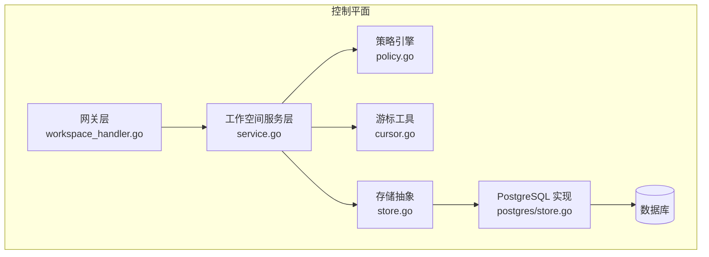
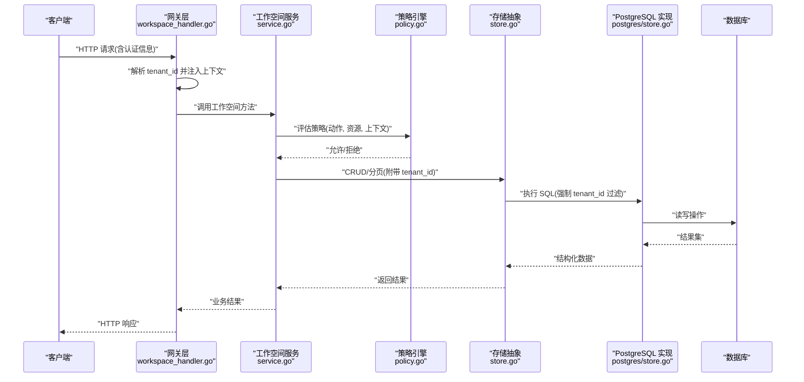
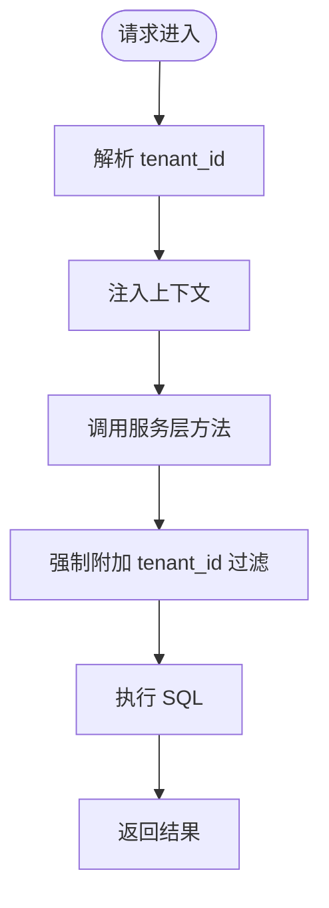
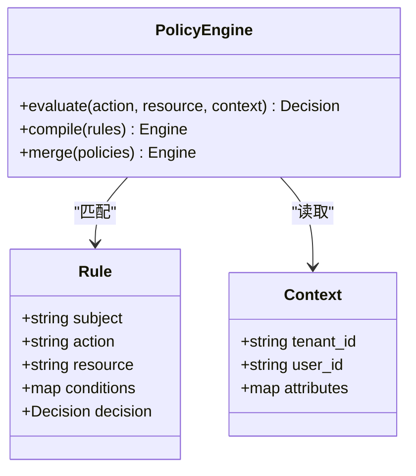
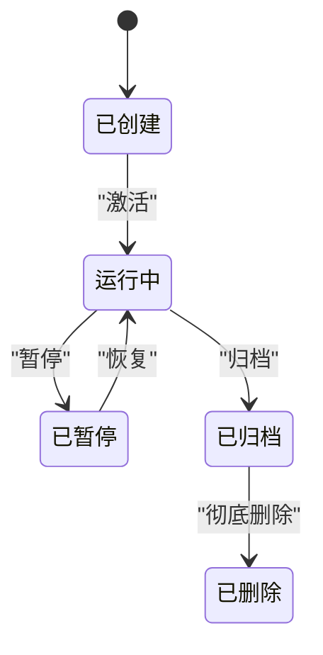
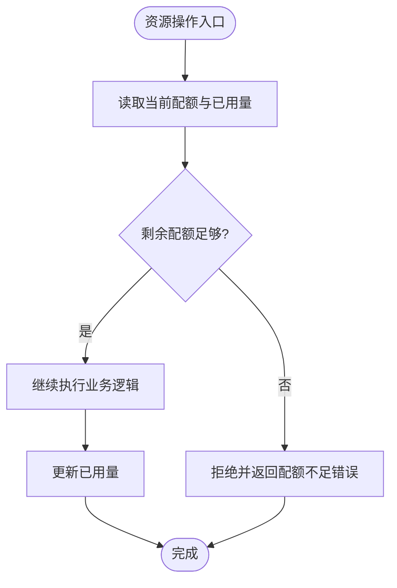
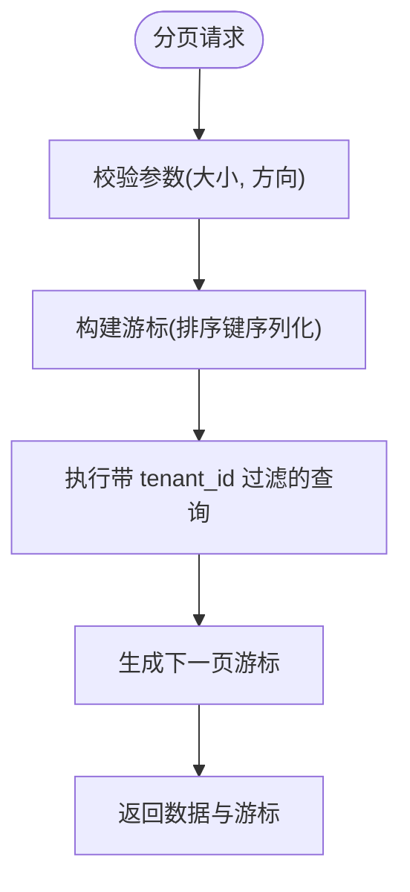
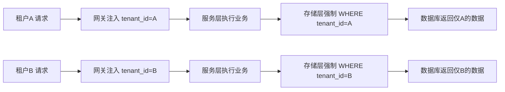
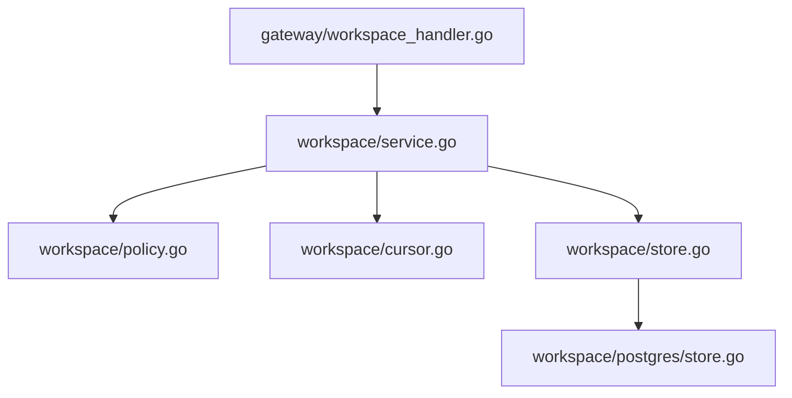

# 工作空间服务

<cite>
**本文引用的文件**   
- [apps/control-plane/cmd/control-plane/main.go](file://apps/control-plane/cmd/control-plane/main.go)
- [apps/control-plane/internal/workspace/service.go](file://apps/control-plane/internal/workspace/service.go)
- [apps/control-plane/internal/workspace/store.go](file://apps/control-plane/internal/workspace/store.go)
- [apps/control-plane/internal/workspace/postgres/store.go](file://apps/control-plane/internal/workspace/postgres/store.go)
- [apps/control-plane/internal/workspace/policy.go](file://apps/control-plane/internal/workspace/policy.go)
- [apps/control-plane/internal/workspace/cursor.go](file://apps/control-plane/internal/workspace/cursor.go)
- [apps/control-plane/internal/workspace/model.go](file://apps/control-plane/internal/workspace/model.go)
- [apps/control-plane/internal/gateway/workspace_handler.go](file://apps/control-plane/internal/gateway/workspace_handler.go)
- [apps/control-plane/migrations/003_workspace.sql](file://apps/control-plane/migrations/003_workspace.sql)
</cite>

## 目录
1. [简介](#简介)
2. [项目结构](#项目结构)
3. [核心组件](#核心组件)
4. [架构总览](#架构总览)
5. [详细组件分析](#详细组件分析)
6. [依赖分析](#依赖分析)
7. [性能考虑](#性能考虑)
8. [故障排查指南](#故障排查指南)
9. [结论](#结论)
10. [附录](#附录)

## 简介
本文件为 NeKiro 控制平面中的“工作空间服务”提供组件级设计文档。重点覆盖：
- 多租户隔离架构的设计理念与实现机制
- 权限策略引擎的工作原理（策略定义、评估算法、执行流程）
- 工作空间生命周期管理与资源配额控制
- 数据库访问层与游标分页机制
- 工作空间间的数据隔离与安全边界
并配套多租户架构图、权限模型图与关键业务流程图，帮助读者快速理解系统设计与落地细节。

## 项目结构
工作空间服务位于 control-plane 应用内部，采用分层组织：
- 网关层：HTTP 路由与请求处理，负责鉴权上下文注入与工作空间参数校验
- 服务层：编排工作空间业务逻辑，包括创建、读取、更新、删除、策略评估与配额检查
- 存储层：抽象数据访问接口，PostgreSQL 具体实现负责持久化与游标分页
- 迁移脚本：数据库表结构与初始数据变更

图表来源
- [apps/control-plane/internal/gateway/workspace_handler.go](file://apps/control-plane/internal/gateway/workspace_handler.go)
- [apps/control-plane/internal/workspace/service.go](file://apps/control-plane/internal/workspace/service.go)
- [apps/control-plane/internal/workspace/policy.go](file://apps/control-plane/internal/workspace/policy.go)
- [apps/control-plane/internal/workspace/cursor.go](file://apps/control-plane/internal/workspace/cursor.go)
- [apps/control-plane/internal/workspace/store.go](file://apps/control-plane/internal/workspace/store.go)
- [apps/control-plane/internal/workspace/postgres/store.go](file://apps/control-plane/internal/workspace/postgres/store.go)

章节来源
- [apps/control-plane/cmd/control-plane/main.go](file://apps/control-plane/cmd/control-plane/main.go)
- [apps/control-plane/internal/gateway/workspace_handler.go](file://apps/control-plane/internal/gateway/workspace_handler.go)
- [apps/control-plane/internal/workspace/service.go](file://apps/control-plane/internal/workspace/service.go)
- [apps/control-plane/internal/workspace/store.go](file://apps/control-plane/internal/workspace/store.go)
- [apps/control-plane/internal/workspace/postgres/store.go](file://apps/control-plane/internal/workspace/postgres/store.go)
- [apps/control-plane/migrations/003_workspace.sql](file://apps/control-plane/migrations/003_workspace.sql)

## 核心组件
- 工作空间服务（Service）
  - 职责：编排工作空间的创建、查询、更新、删除；在操作前进行策略评估与配额校验；维护工作空间状态机；协调存储层完成事务性写入。
  - 关键点：所有对外暴露的 API 均通过网关层进入，服务层统一注入 tenant_id 上下文，确保跨租户隔离。
- 策略引擎（Policy）
  - 职责：基于策略规则对当前用户/角色/环境上下文进行评估，决定是否允许对工作空间执行某项操作。
  - 关键点：支持细粒度条件（如命名空间、标签、资源上限），可组合多条策略形成最终决策。
- 存储抽象（Store）
  - 职责：定义工作空间数据的增删改查与分页接口；屏蔽底层数据库差异。
- PostgreSQL 实现（Postgres Store）
  - 职责：实现 SQL 查询、索引优化、游标分页；保证多租户字段（tenant_id）在所有查询中强制携带。
- 游标分页（Cursor）
  - 职责：将排序键序列化为稳定游标值，避免深翻页性能问题与重复/遗漏。
- 数据模型（Model）
  - 职责：定义工作空间实体、策略对象、分页响应等数据结构。

章节来源
- [apps/control-plane/internal/workspace/service.go](file://apps/control-plane/internal/workspace/service.go)
- [apps/control-plane/internal/workspace/policy.go](file://apps/control-plane/internal/workspace/policy.go)
- [apps/control-plane/internal/workspace/store.go](file://apps/control-plane/internal/workspace/store.go)
- [apps/control-plane/internal/workspace/postgres/store.go](file://apps/control-plane/internal/workspace/postgres/store.go)
- [apps/control-plane/internal/workspace/cursor.go](file://apps/control-plane/internal/workspace/cursor.go)
- [apps/control-plane/internal/workspace/model.go](file://apps/control-plane/internal/workspace/model.go)

## 架构总览
下图展示多租户工作空间服务的端到端调用链与隔离点：
- 网关层从请求头或令牌解析出 tenant_id，并将其注入到后续处理的上下文中
- 服务层在执行任何写操作前调用策略引擎与配额检查
- 存储层强制附加 tenant_id 过滤条件，确保数据不可越界访问
- 游标分页用于高效遍历工作空间列表

图表来源
- [apps/control-plane/internal/gateway/workspace_handler.go](file://apps/control-plane/internal/gateway/workspace_handler.go)
- [apps/control-plane/internal/workspace/service.go](file://apps/control-plane/internal/workspace/service.go)
- [apps/control-plane/internal/workspace/policy.go](file://apps/control-plane/internal/workspace/policy.go)
- [apps/control-plane/internal/workspace/store.go](file://apps/control-plane/internal/workspace/store.go)
- [apps/control-plane/internal/workspace/postgres/store.go](file://apps/control-plane/internal/workspace/postgres/store.go)

## 详细组件分析

### 多租户隔离架构
设计理念
- 强隔离：每个工作空间属于单一租户，所有数据行包含 tenant_id，并在所有查询中强制使用
- 上下文驱动：网关层解析并注入 tenant_id，贯穿整个请求链路
- 最小权限：默认拒绝，仅当策略明确允许时才放行

实现要点
- 网关层在鉴权后提取 tenant_id，放入请求上下文
- 服务层所有方法均以 tenant_id 作为入参或从上下文获取
- 存储层封装所有 SQL，确保 WHERE tenant_id = ? 始终存在
- 游标分页也需包含 tenant_id 以保证排序稳定性与安全性

图表来源
- [apps/control-plane/internal/gateway/workspace_handler.go](file://apps/control-plane/internal/gateway/workspace_handler.go)
- [apps/control-plane/internal/workspace/store.go](file://apps/control-plane/internal/workspace/store.go)
- [apps/control-plane/internal/workspace/postgres/store.go](file://apps/control-plane/internal/workspace/postgres/store.go)

章节来源
- [apps/control-plane/internal/gateway/workspace_handler.go](file://apps/control-plane/internal/gateway/workspace_handler.go)
- [apps/control-plane/internal/workspace/store.go](file://apps/control-plane/internal/workspace/store.go)
- [apps/control-plane/internal/workspace/postgres/store.go](file://apps/control-plane/internal/workspace/postgres/store.go)

### 权限策略引擎
工作原理
- 策略定义：以声明式规则描述允许/拒绝的条件（如主体、资源、动作、环境）
- 评估算法：按优先级顺序匹配策略，短路求值，返回最终决策
- 执行流程：在服务层入口处调用策略评估，拒绝则直接返回错误；允许则继续执行业务逻辑

图表来源
- [apps/control-plane/internal/workspace/policy.go](file://apps/control-plane/internal/workspace/policy.go)

章节来源
- [apps/control-plane/internal/workspace/policy.go](file://apps/control-plane/internal/workspace/policy.go)

### 工作空间生命周期管理
生命周期阶段
- 初始化：创建工作空间元数据、默认策略与配额
- 运行：读写工作空间数据、执行策略评估、配额检查
- 更新：调整策略、配额、名称、描述等
- 归档/删除：软删除或硬删除，清理关联资源

章节来源
- [apps/control-plane/internal/workspace/service.go](file://apps/control-plane/internal/workspace/service.go)
- [apps/control-plane/migrations/003_workspace.sql](file://apps/control-plane/migrations/003_workspace.sql)

### 资源配额控制
控制目标
- 限制工作空间内资源数量（如任务数、会话数、存储用量等）
- 防止单租户占用过多系统资源，保障整体稳定性

实现思路
- 在创建/更新资源时，根据当前配额与已用额度计算是否允许
- 配额变更需幂等且具备审计日志
- 配额超限返回明确的错误码，便于客户端重试或升级

章节来源
- [apps/control-plane/internal/workspace/service.go](file://apps/control-plane/internal/workspace/service.go)

### 数据库访问层与游标分页
访问层设计
- 抽象接口：定义工作空间实体的 CRUD 与分页查询
- 具体实现：PostgreSQL 实现，使用索引与预编译语句提升性能
- 安全约束：所有查询强制附加 tenant_id 过滤，杜绝跨租户泄露

游标分页机制
- 选择稳定排序键（如 created_at + id）
- 将上一页最后一条记录的排序键序列化为游标
- 下一页查询使用该游标进行范围过滤，避免深翻页导致的性能退化

图表来源
- [apps/control-plane/internal/workspace/cursor.go](file://apps/control-plane/internal/workspace/cursor.go)
- [apps/control-plane/internal/workspace/store.go](file://apps/control-plane/internal/workspace/store.go)
- [apps/control-plane/internal/workspace/postgres/store.go](file://apps/control-plane/internal/workspace/postgres/store.go)

章节来源
- [apps/control-plane/internal/workspace/cursor.go](file://apps/control-plane/internal/workspace/cursor.go)
- [apps/control-plane/internal/workspace/store.go](file://apps/control-plane/internal/workspace/store.go)
- [apps/control-plane/internal/workspace/postgres/store.go](file://apps/control-plane/internal/workspace/postgres/store.go)

### 工作空间间的数据隔离与安全边界
隔离策略
- 行级隔离：所有表包含 tenant_id，查询必须携带该条件
- 连接级隔离：数据库连接池可按租户配置（可选扩展）
- 应用级隔离：服务层与存储层均不信任外部传入的 tenant_id，仅从可信上下文获取
- 审计与告警：记录跨租户访问尝试与异常行为

章节来源
- [apps/control-plane/internal/workspace/store.go](file://apps/control-plane/internal/workspace/store.go)
- [apps/control-plane/internal/workspace/postgres/store.go](file://apps/control-plane/internal/workspace/postgres/store.go)

## 依赖分析
组件耦合关系
- 网关层依赖服务层，负责上下文注入与参数校验
- 服务层依赖策略引擎与存储抽象，编排业务逻辑
- 存储抽象依赖 PostgreSQL 实现，屏蔽 SQL 细节
- 游标工具被服务层与存储层共同使用，保证分页一致性

图表来源
- [apps/control-plane/internal/gateway/workspace_handler.go](file://apps/control-plane/internal/gateway/workspace_handler.go)
- [apps/control-plane/internal/workspace/service.go](file://apps/control-plane/internal/workspace/service.go)
- [apps/control-plane/internal/workspace/policy.go](file://apps/control-plane/internal/workspace/policy.go)
- [apps/control-plane/internal/workspace/cursor.go](file://apps/control-plane/internal/workspace/cursor.go)
- [apps/control-plane/internal/workspace/store.go](file://apps/control-plane/internal/workspace/store.go)
- [apps/control-plane/internal/workspace/postgres/store.go](file://apps/control-plane/internal/workspace/postgres/store.go)

章节来源
- [apps/control-plane/internal/gateway/workspace_handler.go](file://apps/control-plane/internal/gateway/workspace_handler.go)
- [apps/control-plane/internal/workspace/service.go](file://apps/control-plane/internal/workspace/service.go)
- [apps/control-plane/internal/workspace/store.go](file://apps/control-plane/internal/workspace/store.go)
- [apps/control-plane/internal/workspace/postgres/store.go](file://apps/control-plane/internal/workspace/postgres/store.go)

## 性能考虑
- 索引优化：为 tenant_id 与常用排序键建立复合索引，加速过滤与排序
- 游标分页：避免 OFFSET 深翻页，使用基于游标的范围查询
- 批量操作：在配额统计与审计日志中尽量使用批量写入
- 缓存策略：对热点只读数据（如策略模板）引入本地缓存，注意失效与一致性
- 连接池：合理设置最大连接数与超时，避免数据库拥塞

[本节为通用指导，无需特定文件引用]

## 故障排查指南
常见问题
- 跨租户访问：确认网关是否正确注入 tenant_id，存储层是否强制附加过滤条件
- 策略误判：检查策略规则优先级与条件匹配，必要时增加调试日志
- 配额超限：核对配额阈值与已用量统计逻辑，确认幂等性与并发安全
- 分页异常：验证游标序列化/反序列化逻辑与排序键唯一性

定位步骤
- 在网关与服务层入口添加请求追踪 ID，串联日志
- 在策略评估前后输出关键上下文与中间结果
- 在存储层打印关键 SQL 与参数，确认 tenant_id 是否存在
- 针对配额相关路径，输出当前配额、已用量与计算过程

章节来源
- [apps/control-plane/internal/gateway/workspace_handler.go](file://apps/control-plane/internal/gateway/workspace_handler.go)
- [apps/control-plane/internal/workspace/service.go](file://apps/control-plane/internal/workspace/service.go)
- [apps/control-plane/internal/workspace/policy.go](file://apps/control-plane/internal/workspace/policy.go)
- [apps/control-plane/internal/workspace/postgres/store.go](file://apps/control-plane/internal/workspace/postgres/store.go)

## 结论
工作空间服务通过“上下文驱动的租户隔离 + 声明式策略引擎 + 强约束的存储层”实现了高内聚、低耦合的多租户架构。配合游标分页与配额控制，既保证了性能与可扩展性，又确保了数据安全与合规。建议在生产环境中完善审计与监控，持续优化索引与策略评估路径，进一步提升系统的稳定性与可观测性。

[本节为总结性内容，无需特定文件引用]

## 附录
- 数据模型概览
  - 工作空间实体：包含标识、名称、描述、状态、创建时间、更新时间、租户标识等
  - 策略对象：包含主体、动作、资源、条件与决策
  - 分页响应：包含数据列表、下一页游标、总数（可选）

章节来源
- [apps/control-plane/internal/workspace/model.go](file://apps/control-plane/internal/workspace/model.go)
- [apps/control-plane/migrations/003_workspace.sql](file://apps/control-plane/migrations/003_workspace.sql)