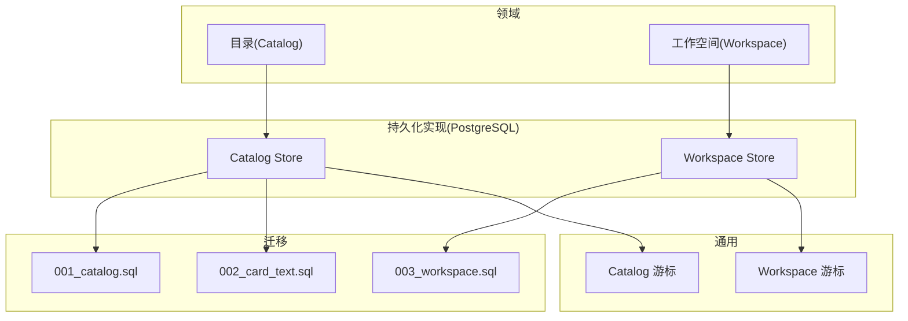
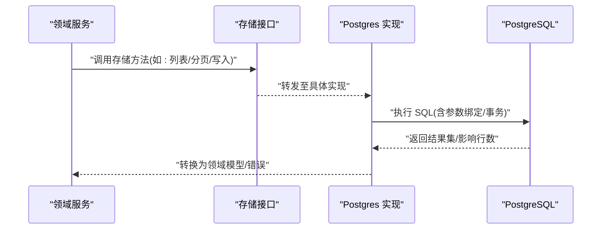
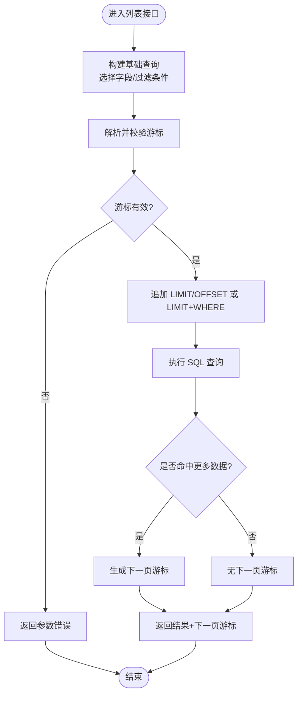
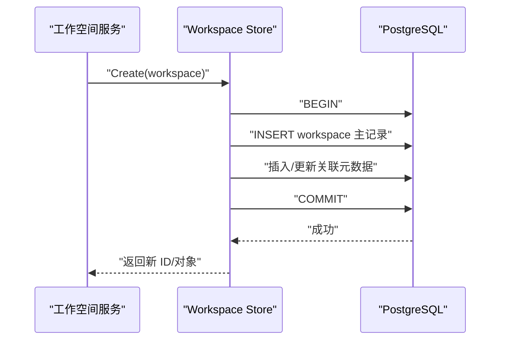
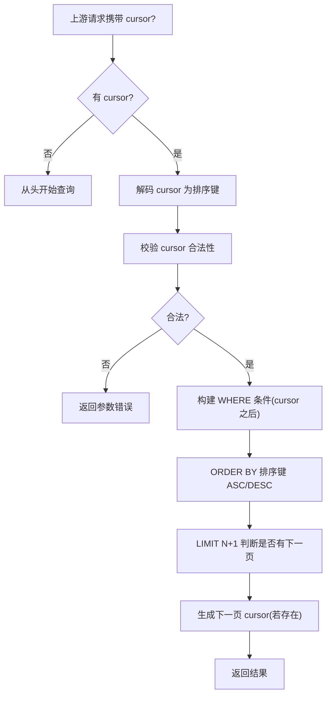
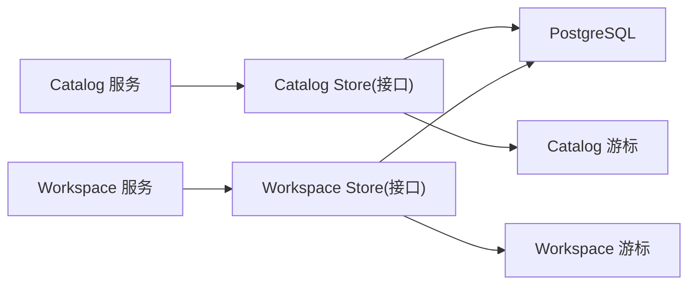

# 数据存储层

<cite>
**本文引用的文件**   
- [apps/control-plane/internal/catalog/postgres/store.go](file://apps/control-plane/internal/catalog/postgres/store.go)
- [apps/control-plane/internal/catalog/postgres/migrations.go](file://apps/control-plane/internal/catalog/postgres/migrations.go)
- [apps/control-plane/internal/catalog/cursor.go](file://apps/control-plane/internal/catalog/cursor.go)
- [apps/control-plane/internal/workspace/postgres/store.go](file://apps/control-plane/internal/workspace/postgres/store.go)
- [apps/control-plane/internal/workspace/postgres/migrations.go](file://apps/control-plane/internal/workspace/postgres/migrations.go)
- [apps/control-plane/internal/workspace/cursor.go](file://apps/control-plane/internal/workspace/cursor.go)
- [apps/control-plane/migrations/001_catalog.sql](file://apps/control-plane/migrations/001_catalog.sql)
- [apps/control-plane/migrations/002_card_text.sql](file://apps/control-plane/migrations/002_card_text.sql)
- [apps/control-plane/migrations/003_workspace.sql](file://apps/control-plane/migrations/003_workspace.sql)
</cite>

## 目录
1. [简介](#简介)
2. [项目结构](#项目结构)
3. [核心组件](#核心组件)
4. [架构总览](#架构总览)
5. [详细组件分析](#详细组件分析)
6. [依赖关系分析](#依赖关系分析)
7. [性能考虑](#性能考虑)
8. [故障排查指南](#故障排查指南)
9. [结论](#结论)
10. [附录](#附录)

## 简介
本文件面向 NeKiro 工作空间与目录（Catalog）的数据存储层，聚焦以下目标：
- 数据库表结构设计、索引策略与查询优化方案
- 存储接口抽象与 PostgreSQL 具体实现
- 游标分页机制的实现原理（游标生成、验证与查询构建）
- 事务处理策略、并发控制与数据一致性保证
- 迁移脚本说明、备份恢复策略与性能监控指标
- 复杂查询示例、批量操作模式与错误处理最佳实践

## 项目结构
数据存储层按领域划分，每个领域包含“接口定义 + 通用逻辑 + 具体实现”三层：
- 领域服务层：catalog、workspace
- 持久化实现：postgres（PostgreSQL 驱动）
- 迁移脚本：migrations（SQL 文件）
- 通用能力：cursor（游标分页）

图表来源
- [apps/control-plane/internal/catalog/postgres/store.go](file://apps/control-plane/internal/catalog/postgres/store.go)
- [apps/control-plane/internal/workspace/postgres/store.go](file://apps/control-plane/internal/workspace/postgres/store.go)
- [apps/control-plane/migrations/001_catalog.sql](file://apps/control-plane/migrations/001_catalog.sql)
- [apps/control-plane/migrations/002_card_text.sql](file://apps/control-plane/migrations/002_card_text.sql)
- [apps/control-plane/migrations/003_workspace.sql](file://apps/control-plane/migrations/003_workspace.sql)
- [apps/control-plane/internal/catalog/cursor.go](file://apps/control-plane/internal/catalog/cursor.go)
- [apps/control-plane/internal/workspace/cursor.go](file://apps/control-plane/internal/workspace/cursor.go)

章节来源
- [apps/control-plane/internal/catalog/postgres/store.go](file://apps/control-plane/internal/catalog/postgres/store.go)
- [apps/control-plane/internal/workspace/postgres/store.go](file://apps/control-plane/internal/workspace/postgres/store.go)
- [apps/control-plane/internal/catalog/cursor.go](file://apps/control-plane/internal/catalog/cursor.go)
- [apps/control-plane/internal/workspace/cursor.go](file://apps/control-plane/internal/workspace/cursor.go)
- [apps/control-plane/migrations/001_catalog.sql](file://apps/control-plane/migrations/001_catalog.sql)
- [apps/control-plane/migrations/002_card_text.sql](file://apps/control-plane/migrations/002_card_text.sql)
- [apps/control-plane/migrations/003_workspace.sql](file://apps/control-plane/migrations/003_workspace.sql)

## 核心组件
- 存储接口抽象
  - 目录（Catalog）存储接口：定义资源的增删改查、列表与游标分页等能力。
  - 工作空间（Workspace）存储接口：定义工作空间的创建、读取、更新、删除与列表等能力。
- PostgreSQL 具体实现
  - Catalog Postgres Store：基于 SQL 语句与参数绑定访问数据库，负责映射领域模型到行记录。
  - Workspace Postgres Store：同上，针对工作空间领域建模与查询。
- 游标分页
  - Catalog 游标：提供基于有序键的游标编码/解码与校验，用于高效稳定分页。
  - Workspace 游标：同目录游标，但作用于工作空间主键或排序键。
- 迁移管理
  - 迁移执行器：在应用启动时加载并顺序执行 SQL 迁移文件，确保数据库版本一致。
  - 迁移脚本：以 SQL 形式描述 DDL/DML，支持回滚与幂等设计。

章节来源
- [apps/control-plane/internal/catalog/postgres/store.go](file://apps/control-plane/internal/catalog/postgres/store.go)
- [apps/control-plane/internal/workspace/postgres/store.go](file://apps/control-plane/internal/workspace/postgres/store.go)
- [apps/control-plane/internal/catalog/cursor.go](file://apps/control-plane/internal/catalog/cursor.go)
- [apps/control-plane/internal/workspace/cursor.go](file://apps/control-plane/internal/workspace/cursor.go)
- [apps/control-plane/internal/catalog/postgres/migrations.go](file://apps/control-plane/internal/catalog/postgres/migrations.go)
- [apps/control-plane/internal/workspace/postgres/migrations.go](file://apps/control-plane/internal/workspace/postgres/migrations.go)

## 架构总览
下图展示从上层服务到数据库的调用路径与关键组件交互。

图表来源
- [apps/control-plane/internal/catalog/postgres/store.go](file://apps/control-plane/internal/catalog/postgres/store.go)
- [apps/control-plane/internal/workspace/postgres/store.go](file://apps/control-plane/internal/workspace/postgres/store.go)

## 详细组件分析

### 目录（Catalog）存储层
- 职责
  - 资源实体的 CRUD、条件过滤、排序与游标分页
  - 文本字段扩展（卡片文本）的读写
- 关键实现要点
  - 使用参数化查询避免注入风险
  - 通过唯一键/复合索引加速常见查询
  - 游标分页基于有序列（如 id 或时间戳）进行稳定翻页
- 典型流程（列表+游标分页）

图表来源
- [apps/control-plane/internal/catalog/postgres/store.go](file://apps/control-plane/internal/catalog/postgres/store.go)
- [apps/control-plane/internal/catalog/cursor.go](file://apps/control-plane/internal/catalog/cursor.go)

章节来源
- [apps/control-plane/internal/catalog/postgres/store.go](file://apps/control-plane/internal/catalog/postgres/store.go)
- [apps/control-plane/internal/catalog/cursor.go](file://apps/control-plane/internal/catalog/cursor.go)

### 工作空间（Workspace）存储层
- 职责
  - 工作空间生命周期管理（创建、读取、更新、删除）
  - 列表与游标分页
- 关键实现要点
  - 强一致写入：在事务中完成必要关联数据的原子更新
  - 并发安全：利用唯一约束与行级锁防止重复写入
- 典型流程（创建工作空间）

图表来源
- [apps/control-plane/internal/workspace/postgres/store.go](file://apps/control-plane/internal/workspace/postgres/store.go)

章节来源
- [apps/control-plane/internal/workspace/postgres/store.go](file://apps/control-plane/internal/workspace/postgres/store.go)

### 游标分页机制（Catalog 与 Workspace）
- 设计原则
  - 基于有序键（推荐主键或时间戳）生成不可伪造的游标
  - 游标仅携带必要信息，便于校验与反序列化为查询条件
- 实现步骤
  - 生成：将排序键与可选上下文编码为字符串
  - 验证：检查格式、范围与合法性
  - 查询构建：将游标解码为 WHERE 条件，配合 ORDER BY 与 LIMIT
- 流程图

图表来源
- [apps/control-plane/internal/catalog/cursor.go](file://apps/control-plane/internal/catalog/cursor.go)
- [apps/control-plane/internal/workspace/cursor.go](file://apps/control-plane/internal/workspace/cursor.go)

章节来源
- [apps/control-plane/internal/catalog/cursor.go](file://apps/control-plane/internal/catalog/cursor.go)
- [apps/control-plane/internal/workspace/cursor.go](file://apps/control-plane/internal/workspace/cursor.go)

### 迁移管理与脚本
- 迁移执行器
  - 启动时加载并按序号顺序执行 SQL 文件
  - 记录已执行版本，避免重复执行
- 脚本组织
  - 001_catalog.sql：目录相关表结构与初始数据
  - 002_card_text.sql：卡片文本扩展字段
  - 003_workspace.sql：工作空间相关表结构与索引
- 建议
  - 保持幂等：使用 IF NOT EXISTS、ON CONFLICT 等
  - 可回滚：为每个正向变更准备反向脚本（可在外部工具维护）

章节来源
- [apps/control-plane/internal/catalog/postgres/migrations.go](file://apps/control-plane/internal/catalog/postgres/migrations.go)
- [apps/control-plane/internal/workspace/postgres/migrations.go](file://apps/control-plane/internal/workspace/postgres/migrations.go)
- [apps/control-plane/migrations/001_catalog.sql](file://apps/control-plane/migrations/001_catalog.sql)
- [apps/control-plane/migrations/002_card_text.sql](file://apps/control-plane/migrations/002_card_text.sql)
- [apps/control-plane/migrations/003_workspace.sql](file://apps/control-plane/migrations/003_workspace.sql)

## 依赖关系分析
- 模块耦合
  - 领域服务依赖存储接口，降低对实现的耦合
  - Postgres 实现依赖数据库连接池与 SQL 驱动
  - 游标模块被两个领域的 Store 复用
- 外部依赖
  - PostgreSQL 数据库
  - 迁移执行器（由应用启动流程触发）

图表来源
- [apps/control-plane/internal/catalog/postgres/store.go](file://apps/control-plane/internal/catalog/postgres/store.go)
- [apps/control-plane/internal/workspace/postgres/store.go](file://apps/control-plane/internal/workspace/postgres/store.go)
- [apps/control-plane/internal/catalog/cursor.go](file://apps/control-plane/internal/catalog/cursor.go)
- [apps/control-plane/internal/workspace/cursor.go](file://apps/control-plane/internal/workspace/cursor.go)

## 性能考虑
- 索引策略
  - 为高频过滤与排序列建立单列或复合索引
  - 游标分页优先使用有序主键或单调递增时间戳，避免全表扫描
- 查询优化
  - 只选择必要字段，减少网络与序列化开销
  - 使用 EXPLAIN/EXPLAIN ANALYZE 定位慢查询
  - 合理设置 LIMIT，避免一次性拉取过多数据
- 连接与事务
  - 使用连接池，限制最大连接数与空闲超时
  - 短事务：尽量缩小事务边界，减少锁持有时间
- 批处理
  - 批量写入使用多值 INSERT 或 COPY（视场景）
  - 批量读取采用流式处理，避免内存峰值

[本节为通用指导，不直接分析具体文件]

## 故障排查指南
- 常见问题
  - 游标无效：检查排序键类型与编码格式；确认未跨页修改排序键
  - 死锁/锁等待：缩短事务、调整写入顺序、避免大事务
  - 迁移失败：核对版本号与幂等性；查看迁移日志定位失败语句
- 诊断手段
  - 启用慢查询日志与执行计划导出
  - 监控连接池使用率、事务时长与锁等待事件
  - 对热点表观察索引命中率与扫描类型

[本节为通用指导，不直接分析具体文件]

## 结论
NeKiro 的数据存储层以清晰的接口抽象与稳定的游标分页为核心，结合规范的迁移管理与合理的索引策略，提供了可扩展且高性能的持久化能力。建议在后续演进中持续完善监控指标、完善回滚脚本与压力测试用例，进一步提升稳定性与可观测性。

[本节为总结，不直接分析具体文件]

## 附录

### 表结构与索引（概念性说明）
- 目录（Catalog）
  - 主表：资源标识、名称、状态、时间戳等
  - 文本扩展表：卡片文本内容，按资源外键关联
  - 索引：主键、状态/标签过滤、更新时间排序
- 工作空间（Workspace）
  - 主表：工作空间标识、名称、所有者、状态、时间戳等
  - 索引：主键、所有者/状态过滤、更新时间排序

[本节为概念性说明，不直接分析具体文件]

### 复杂查询示例（思路）
- 带游标的分页列表：WHERE 排序键 > cursor 值 + ORDER BY + LIMIT
- 多条件组合过滤：先过滤后排序，确保索引覆盖过滤与排序列
- 聚合统计：使用 GROUP BY 与窗口函数，必要时物化视图

[本节为概念性说明，不直接分析具体文件]

### 批量操作模式（思路）
- 批量插入：拼接多值 INSERT 或使用批量 API
- 批量更新：基于主键集合的 CASE WHEN 更新
- 批量删除：IN 子句或临时表 JOIN 删除

[本节为概念性说明，不直接分析具体文件]

### 备份与恢复策略（思路）
- 定期全量备份 + 增量 WAL 归档
- 恢复演练：定期验证备份可用性与 RTO/RPO 达标
- 迁移前快照：在执行破坏性变更前创建快照

[本节为概念性说明，不直接分析具体文件]

### 性能监控指标（建议）
- 连接池：活跃连接、等待队列、空闲回收
- 事务：平均时长、长事务数量、锁等待
- 查询：QPS、P95/P99 延迟、慢查询数量
- 索引：扫描类型、回表比例、缺失索引告警

[本节为概念性说明，不直接分析具体文件]