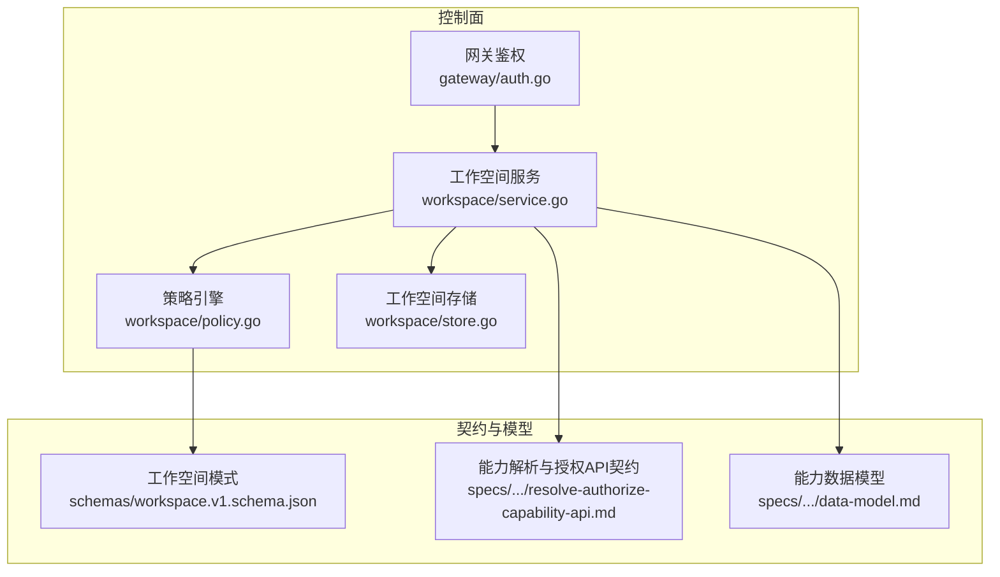
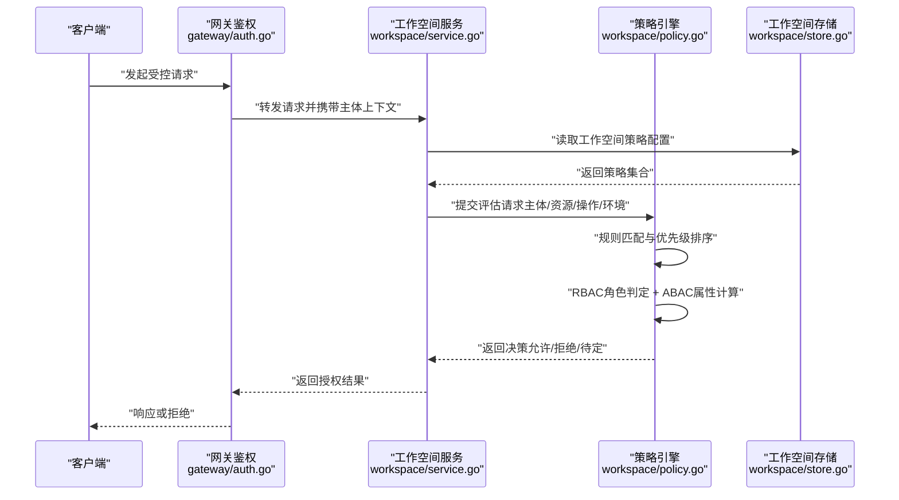
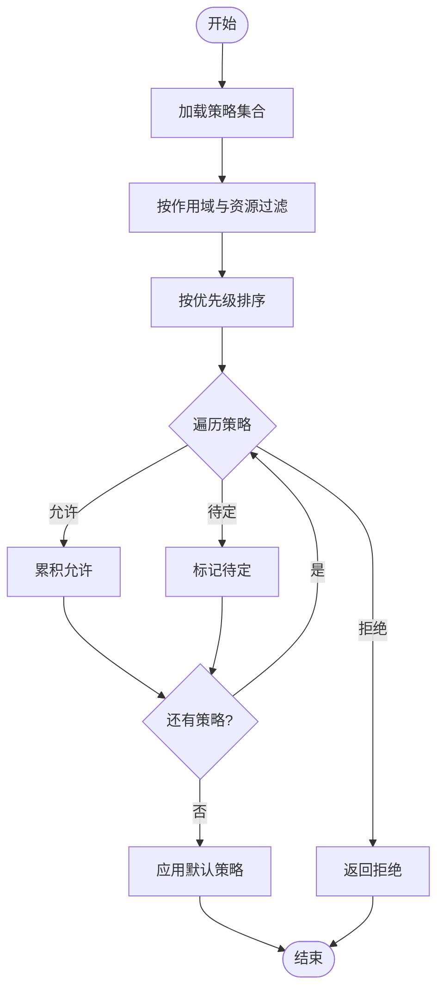
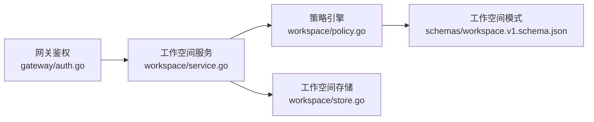
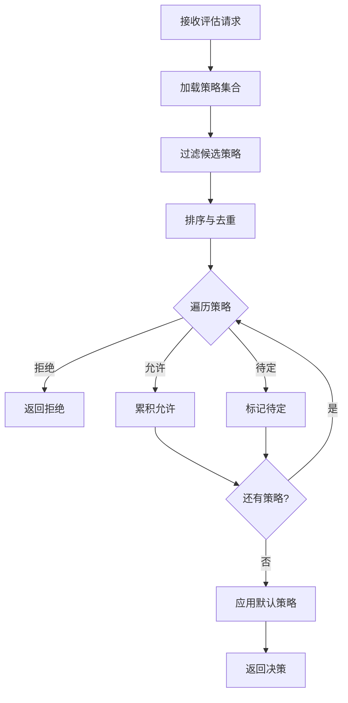

# 权限策略引擎

<cite>
**本文引用的文件**   
- [apps/control-plane/internal/workspace/policy.go](file://apps/control-plane/internal/workspace/policy.go)
- [apps/control-plane/internal/workspace/service.go](file://apps/control-plane/internal/workspace/service.go)
- [apps/control-plane/internal/gateway/auth.go](file://apps/control-plane/internal/gateway/auth.go)
- [contracts/schemas/workspace.v1.schema.json](file://contracts/schemas/workspace.v1.schema.json)
- [specs/006-resolve-authorize-capability/contracts/resolve-authorize-capability-api.md](file://specs/006-resolve-authorize-capability/contracts/resolve-authorize-capability-api.md)
- [specs/006-resolve-authorize-capability/data-model.md](file://specs/006-resolve-authorize-capability/data-model.md)
</cite>

## 目录
1. [简介](#简介)
2. [项目结构](#项目结构)
3. [核心组件](#核心组件)
4. [架构总览](#架构总览)
5. [详细组件分析](#详细组件分析)
6. [依赖关系分析](#依赖关系分析)
7. [性能考虑](#性能考虑)
8. [故障排查指南](#故障排查指南)
9. [结论](#结论)
10. [附录](#附录) 

## 简介
本技术文档聚焦 NeKiro 工作空间权限策略引擎，系统性阐述策略定义语法、评估算法与执行流程，覆盖基于角色的访问控制（RBAC）与基于属性的访问控制（ABAC）的实现要点。文档同时说明策略规则匹配机制、优先级处理与冲突解决策略，记录权限检查的执行路径与缓存优化建议，并给出支持的策略操作类型、资源标识符格式与作用域限制。文末提供配置示例、评估流程图、常见场景模板与最佳实践，帮助读者快速落地与调优。

## 项目结构
与权限策略相关的关键代码位于 control-plane 的工作空间模块与网关鉴权层，配合契约与数据模型规范：
- 策略定义与评估：workspace 模块中的策略文件与服务编排
- 鉴权入口：网关层的认证与授权拦截
- 策略数据模型与 API 契约：specs 与 contracts 下的数据模型与接口约定
- 持久化与迁移：workspace 存储实现（不在本文重点展开）

图表来源
- [apps/control-plane/internal/workspace/service.go](file://apps/control-plane/internal/workspace/service.go)
- [apps/control-plane/internal/workspace/policy.go](file://apps/control-plane/internal/workspace/policy.go)
- [apps/control-plane/internal/gateway/auth.go](file://apps/control-plane/internal/gateway/auth.go)
- [contracts/schemas/workspace.v1.schema.json](file://contracts/schemas/workspace.v1.schema.json)
- [specs/006-resolve-authorize-capability/contracts/resolve-authorize-capability-api.md](file://specs/006-resolve-authorize-capability/contracts/resolve-authorize-capability-api.md)
- [specs/006-resolve-authorize-capability/data-model.md](file://specs/006-resolve-authorize-capability/data-model.md)

章节来源
- [apps/control-plane/internal/workspace/service.go](file://apps/control-plane/internal/workspace/service.go)
- [apps/control-plane/internal/workspace/policy.go](file://apps/control-plane/internal/workspace/policy.go)
- [apps/control-plane/internal/gateway/auth.go](file://apps/control-plane/internal/gateway/auth.go)
- [contracts/schemas/workspace.v1.schema.json](file://contracts/schemas/workspace.v1.schema.json)
- [specs/006-resolve-authorize-capability/contracts/resolve-authorize-capability-api.md](file://specs/006-resolve-authorize-capability/contracts/resolve-authorize-capability-api.md)
- [specs/006-resolve-authorize-capability/data-model.md](file://specs/006-resolve-authorize-capability/data-model.md)

## 核心组件
- 策略引擎（policy.go）
  - 负责加载、校验、匹配与评估策略规则，支持 RBAC 角色绑定与 ABAC 属性条件组合。
  - 维护策略优先级与冲突消解顺序，确保可预测的决策结果。
- 工作空间服务（service.go）
  - 作为策略引擎的编排者，聚合上下文（用户、租户、资源、环境），调用策略引擎进行决策。
  - 负责将策略决策结果与业务动作关联，并触发审计日志。
- 网关鉴权（auth.go）
  - 在请求进入控制面之前完成身份识别与初步授权判断，必要时委托工作空间服务进行细粒度策略评估。
- 契约与数据模型（specs 与 contracts）
  - 明确“能力”（capability）的概念、操作类型、资源标识符与作用域约束。
  - 通过 JSON Schema 对工作空间策略数据进行结构化校验。

章节来源
- [apps/control-plane/internal/workspace/policy.go](file://apps/control-plane/internal/workspace/policy.go)
- [apps/control-plane/internal/workspace/service.go](file://apps/control-plane/internal/workspace/service.go)
- [apps/control-plane/internal/gateway/auth.go](file://apps/control-plane/internal/gateway/auth.go)
- [specs/006-resolve-authorize-capability/contracts/resolve-authorize-capability-api.md](file://specs/006-resolve-authorize-capability/contracts/resolve-authorize-capability-api.md)
- [specs/006-resolve-authorize-capability/data-model.md](file://specs/006-resolve-authorize-capability/data-model.md)
- [contracts/schemas/workspace.v1.schema.json](file://contracts/schemas/workspace.v1.schema.json)

## 架构总览
整体授权链路从网关进入，经由工作空间服务组装上下文，再交由策略引擎进行规则匹配与决策。策略数据来源于工作空间配置，并通过模式文件进行校验。

图表来源
- [apps/control-plane/internal/gateway/auth.go](file://apps/control-plane/internal/gateway/auth.go)
- [apps/control-plane/internal/workspace/service.go](file://apps/control-plane/internal/workspace/service.go)
- [apps/control-plane/internal/workspace/policy.go](file://apps/control-plane/internal/workspace/policy.go)
- [apps/control-plane/internal/workspace/store.go](file://apps/control-plane/internal/workspace/store.go)

## 详细组件分析

### 策略引擎（policy.go）
- 职责
  - 策略加载与校验：依据工作空间模式对策略进行结构校验。
  - 规则匹配：按作用域、资源标识符、操作类型进行筛选。
  - 决策评估：结合 RBAC 角色与 ABAC 属性条件，输出最终决策。
  - 优先级与冲突消解：定义明确的优先级顺序与冲突解决策略。
- 关键概念
  - 策略项：包含作用域、资源、操作、主体、条件等字段。
  - 作用域：限定策略生效范围（如租户、命名空间、工作空间）。
  - 资源标识符：统一格式用于定位目标资源。
  - 操作类型：读、写、管理、执行等语义化操作。
  - 主体：用户、服务账号、角色、组等。
  - 条件：ABAC 表达式，基于属性值进行布尔判定。
- 评估算法
  - 步骤一：收集候选策略（按作用域与资源匹配）。
  - 步骤二：按优先级排序（显式优先级 > 更具体作用域 > 最近更新时间等）。
  - 步骤三：依次评估，遇到显式拒绝则短路返回；否则继续累积允许。
  - 步骤四：若存在待定或未决分支，按默认策略回退。
- 复杂度与优化
  - 时间复杂度：O(n log n) 主要来源于排序；可通过索引与缓存降低。
  - 空间复杂度：O(n) 存储候选策略集。
  - 优化点：预编译 ABAC 表达式、索引化作用域与资源前缀、LRU 缓存决策结果。

图表来源
- [apps/control-plane/internal/workspace/policy.go](file://apps/control-plane/internal/workspace/policy.go)
- [contracts/schemas/workspace.v1.schema.json](file://contracts/schemas/workspace.v1.schema.json)

章节来源
- [apps/control-plane/internal/workspace/policy.go](file://apps/control-plane/internal/workspace/policy.go)
- [contracts/schemas/workspace.v1.schema.json](file://contracts/schemas/workspace.v1.schema.json)

### 工作空间服务（service.go）
- 职责
  - 组装评估上下文：主体身份、角色、资源元数据、环境属性。
  - 调用策略引擎进行决策，并将结果映射到业务语义。
  - 记录审计事件，便于追踪与合规。
- 集成点
  - 与存储交互获取策略配置。
  - 与网关鉴权协作，提供细粒度授权能力。
  - 与外部身份源对接，补充主体属性。

章节来源
- [apps/control-plane/internal/workspace/service.go](file://apps/control-plane/internal/workspace/service.go)

### 网关鉴权（auth.go）
- 职责
  - 解析请求头与令牌，建立主体上下文。
  - 对粗粒度路径进行快速放行或拒绝。
  - 对需要细粒度的请求委派至工作空间服务进行策略评估。
- 与策略引擎的关系
  - 网关不直接实现复杂策略逻辑，而是作为入口与代理，保证低耦合与高内聚。

章节来源
- [apps/control-plane/internal/gateway/auth.go](file://apps/control-plane/internal/gateway/auth.go)

### 契约与数据模型（specs 与 contracts）
- 能力（Capability）
  - 定义操作类型、资源标识符格式与作用域限制。
  - 为策略引擎提供统一的语义基础。
- 工作空间模式（Schema）
  - 对工作空间策略数据结构进行校验，确保一致性。
- API 契约
  - 明确“能力解析与授权”接口的输入输出，指导上层调用。

章节来源
- [specs/006-resolve-authorize-capability/contracts/resolve-authorize-capability-api.md](file://specs/006-resolve-authorize-capability/contracts/resolve-authorize-capability-api.md)
- [specs/006-resolve-authorize-capability/data-model.md](file://specs/006-resolve-authorize-capability/data-model.md)
- [contracts/schemas/workspace.v1.schema.json](file://contracts/schemas/workspace.v1.schema.json)

## 依赖关系分析
- 组件耦合
  - 网关仅依赖工作空间服务的授权接口，避免侵入策略细节。
  - 工作空间服务依赖策略引擎与存储，形成清晰的层次。
  - 策略引擎依赖模式文件进行校验，保持数据契约稳定。
- 外部依赖
  - 身份源：提供主体属性与角色信息。
  - 存储后端：持久化工作空间策略配置。
- 潜在循环依赖
  - 当前分层清晰，未见循环依赖风险。

图表来源
- [apps/control-plane/internal/gateway/auth.go](file://apps/control-plane/internal/gateway/auth.go)
- [apps/control-plane/internal/workspace/service.go](file://apps/control-plane/internal/workspace/service.go)
- [apps/control-plane/internal/workspace/policy.go](file://apps/control-plane/internal/workspace/policy.go)
- [apps/control-plane/internal/workspace/store.go](file://apps/control-plane/internal/workspace/store.go)
- [contracts/schemas/workspace.v1.schema.json](file://contracts/schemas/workspace.v1.schema.json)

章节来源
- [apps/control-plane/internal/gateway/auth.go](file://apps/control-plane/internal/gateway/auth.go)
- [apps/control-plane/internal/workspace/service.go](file://apps/control-plane/internal/workspace/service.go)
- [apps/control-plane/internal/workspace/policy.go](file://apps/control-plane/internal/workspace/policy.go)
- [apps/control-plane/internal/workspace/store.go](file://apps/control-plane/internal/workspace/store.go)
- [contracts/schemas/workspace.v1.schema.json](file://contracts/schemas/workspace.v1.schema.json)

## 性能考虑
- 缓存策略
  - 决策结果缓存：以（主体、资源、操作、环境）为键，设置合理 TTL。
  - 策略快照缓存：策略变更时失效对应缓存，减少重复加载。
  - 表达式缓存：预编译 ABAC 表达式，避免重复解析。
- 索引与过滤
  - 对作用域与资源前缀建立索引，加速候选策略筛选。
  - 使用位图或布隆过滤器快速排除无关策略。
- 评估优化
  - 短路求值：遇到显式拒绝立即返回。
  - 并行评估：对独立策略分支进行并发评估，合并结果。
- 监控与度量
  - 记录评估耗时、命中率、拒绝率等指标，持续优化。

[本节为通用性能建议，无需特定文件引用]

## 故障排查指南
- 常见问题
  - 策略未生效：检查作用域与资源标识符是否匹配，确认优先级与冲突消解顺序。
  - 评估超时：排查 ABAC 表达式复杂度，增加缓存与索引。
  - 决策不一致：核对策略版本与缓存失效策略，确保快照一致。
- 诊断步骤
  - 启用详细日志，记录评估上下文与命中策略。
  - 回放请求，复现问题并对比不同环境的策略差异。
  - 使用最小化策略集验证核心逻辑。

章节来源
- [apps/control-plane/internal/workspace/policy.go](file://apps/control-plane/internal/workspace/policy.go)
- [apps/control-plane/internal/workspace/service.go](file://apps/control-plane/internal/workspace/service.go)

## 结论
NeKiro 工作空间权限策略引擎通过清晰的分层与契约驱动设计，实现了可扩展的 RBAC 与 ABAC 混合授权模型。策略引擎专注于规则匹配与决策，工作空间服务负责上下文组装与编排，网关鉴权提供统一入口。借助缓存、索引与短路求值等优化手段，系统在高并发下仍具备良好性能。遵循本文提供的配置模板与最佳实践，可有效提升策略的可维护性与安全性。

[本节为总结性内容，无需特定文件引用]

## 附录

### 策略定义语法与示例
- 关键字段
  - 作用域：限定策略生效范围。
  - 资源：统一标识符格式，支持前缀匹配。
  - 操作：读、写、管理、执行等。
  - 主体：用户、服务账号、角色、组。
  - 条件：ABAC 表达式，基于属性值进行布尔判定。
  - 决策：允许、拒绝、待定。
- 示例（描述性）
  - 允许某角色在工作空间内读取指定资源前缀。
  - 拒绝非工作时间对敏感资源的写入。
  - 允许满足多属性条件的跨租户访问。

章节来源
- [contracts/schemas/workspace.v1.schema.json](file://contracts/schemas/workspace.v1.schema.json)
- [specs/006-resolve-authorize-capability/data-model.md](file://specs/006-resolve-authorize-capability/data-model.md)

### 评估流程图（代码级）

图表来源
- [apps/control-plane/internal/workspace/policy.go](file://apps/control-plane/internal/workspace/policy.go)

### 常见权限场景模板与最佳实践
- 场景模板
  - 只读访问：为特定角色授予读权限，限定资源前缀。
  - 管理员访问：赋予管理操作，但限制高危操作需额外审批。
  - 跨租户共享：基于属性条件（如标签、环境）开放有限访问。
- 最佳实践
  - 最小权限原则：仅授予必要权限。
  - 显式拒绝优先：对敏感资源使用显式拒绝策略。
  - 策略分层：全局策略与工作空间策略分离，便于治理。
  - 定期审计：审查策略命中与拒绝情况，及时清理冗余。

章节来源
- [specs/006-resolve-authorize-capability/contracts/resolve-authorize-capability-api.md](file://specs/006-resolve-authorize-capability/contracts/resolve-authorize-capability-api.md)
- [specs/006-resolve-authorize-capability/data-model.md](file://specs/006-resolve-authorize-capability/data-model.md)