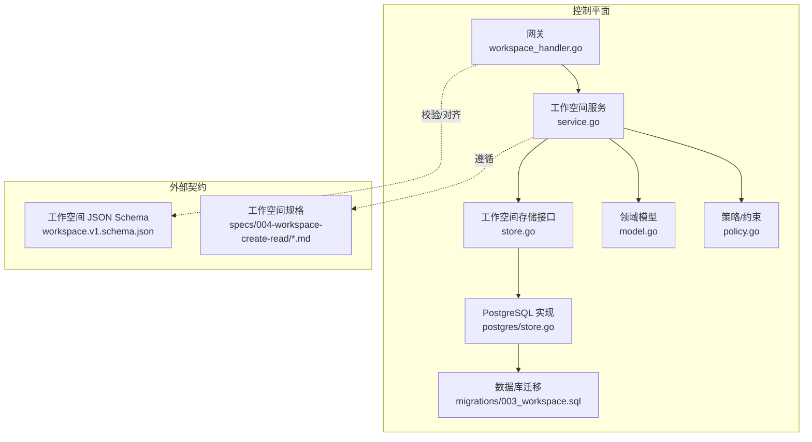
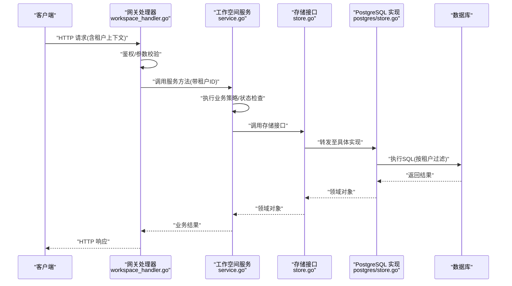
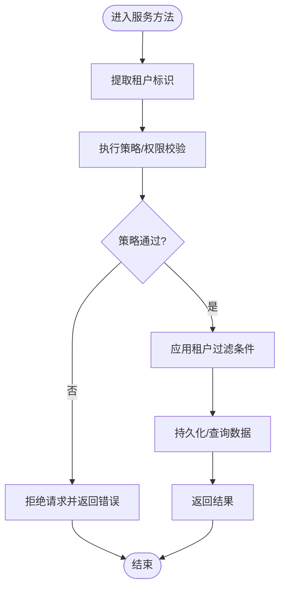
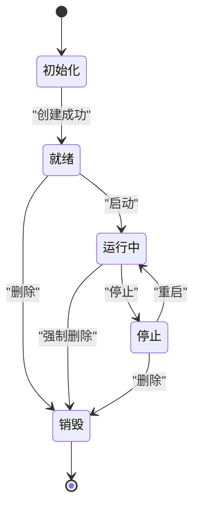
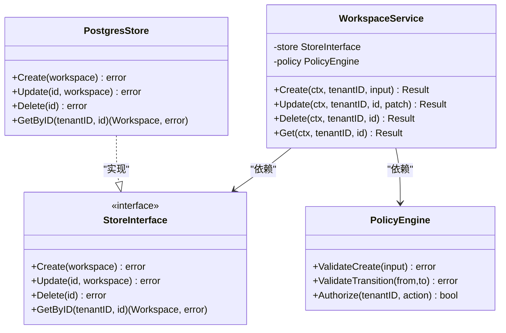
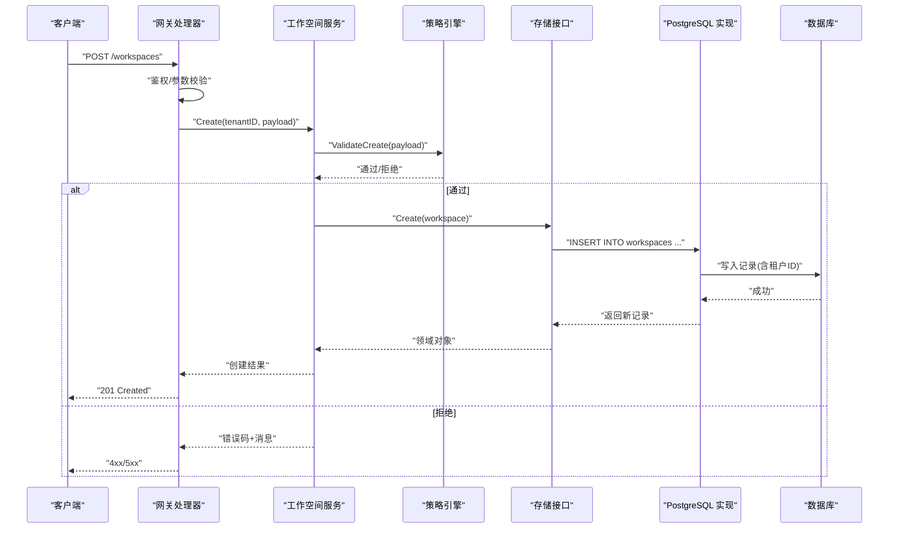
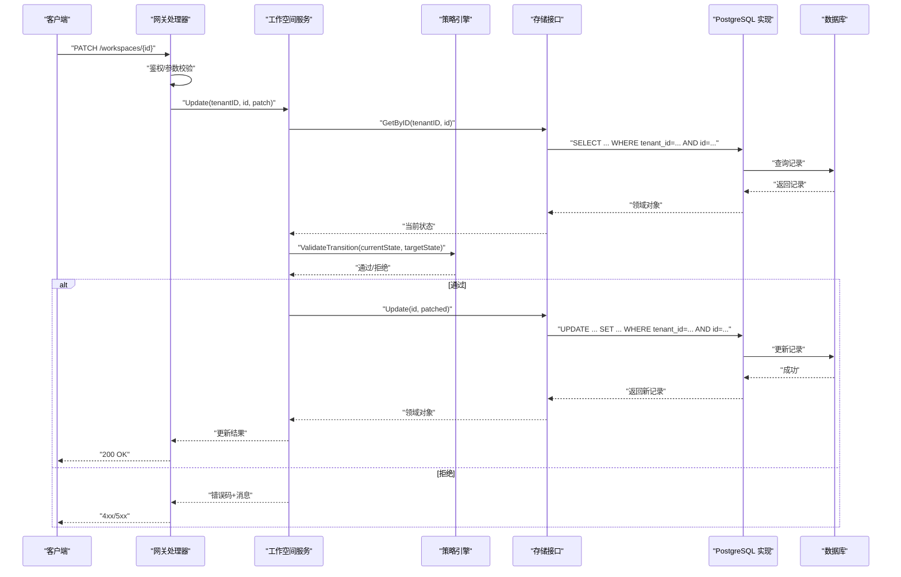
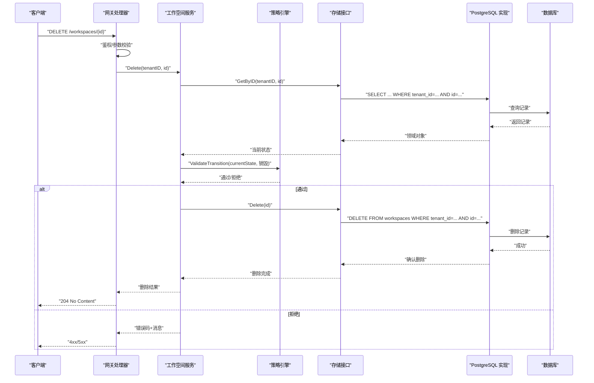
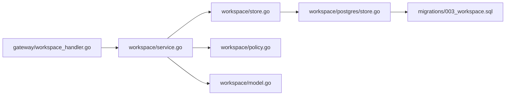

# 核心架构设计

<cite>
**本文引用的文件**   
- [apps/control-plane/cmd/control-plane/main.go](file://apps/control-plane/cmd/control-plane/main.go)
- [apps/control-plane/internal/workspace/service.go](file://apps/control-plane/internal/workspace/service.go)
- [apps/control-plane/internal/workspace/store.go](file://apps/control-plane/internal/workspace/store.go)
- [apps/control-plane/internal/workspace/postgres/store.go](file://apps/control-plane/internal/workspace/postgres/store.go)
- [apps/control-plane/internal/workspace/model.go](file://apps/control-plane/internal/workspace/model.go)
- [apps/control-plane/internal/workspace/policy.go](file://apps/control-plane/internal/workspace/policy.go)
- [apps/control-plane/internal/gateway/workspace_handler.go](file://apps/control-plane/internal/gateway/workspace_handler.go)
- [apps/control-plane/migrations/003_workspace.sql](file://apps/control-plane/migrations/003_workspace.sql)
- [contracts/schemas/workspace.v1.schema.json](file://contracts/schemas/workspace.v1.schema.json)
- [specs/004-workspace-create-read/data-model.md](file://specs/004-workspace-create-read/data-model.md)
- [specs/004-workspace-create-read/spec.md](file://specs/004-workspace-create-read/spec.md)
</cite>

## 目录
1. [简介](#简介)
2. [项目结构](#项目结构)
3. [核心组件](#核心组件)
4. [架构总览](#架构总览)
5. [详细组件分析](#详细组件分析)
6. [依赖分析](#依赖分析)
7. [性能考虑](#性能考虑)
8. [故障排查指南](#故障排查指南)
9. [结论](#结论)
10. [附录](#附录)

## 简介
本文件聚焦 NeKiro 控制平面中的“工作空间服务”核心架构，围绕多租户隔离、工作空间生命周期管理（创建、读取、更新、删除）、状态转换与资源隔离策略展开。文档同时覆盖数据模型定义、服务层接口设计与依赖注入模式，并通过架构图、时序图与状态转换图展示关键交互流程。

## 项目结构
控制平面中与工作空间相关的代码主要位于 apps/control-plane/internal/workspace 及其子模块，HTTP 网关入口在 gateway 层，持久化实现位于 postgres 子包，迁移脚本位于 migrations，契约与数据模型规范位于 contracts 与 specs。

图表来源
- [apps/control-plane/internal/gateway/workspace_handler.go](file://apps/control-plane/internal/gateway/workspace_handler.go)
- [apps/control-plane/internal/workspace/service.go](file://apps/control-plane/internal/workspace/service.go)
- [apps/control-plane/internal/workspace/store.go](file://apps/control-plane/internal/workspace/store.go)
- [apps/control-plane/internal/workspace/postgres/store.go](file://apps/control-plane/internal/workspace/postgres/store.go)
- [apps/control-plane/internal/workspace/model.go](file://apps/control-plane/internal/workspace/model.go)
- [apps/control-plane/internal/workspace/policy.go](file://apps/control-plane/internal/workspace/policy.go)
- [apps/control-plane/migrations/003_workspace.sql](file://apps/control-plane/migrations/003_workspace.sql)
- [contracts/schemas/workspace.v1.schema.json](file://contracts/schemas/workspace.v1.schema.json)
- [specs/004-workspace-create-read/spec.md](file://specs/004-workspace-create-read/spec.md)

章节来源
- [apps/control-plane/cmd/control-plane/main.go](file://apps/control-plane/cmd/control-plane/main.go)
- [apps/control-plane/internal/gateway/workspace_handler.go](file://apps/control-plane/internal/gateway/workspace_handler.go)
- [apps/control-plane/internal/workspace/service.go](file://apps/control-plane/internal/workspace/service.go)
- [apps/control-plane/internal/workspace/store.go](file://apps/control-plane/internal/workspace/store.go)
- [apps/control-plane/internal/workspace/postgres/store.go](file://apps/control-plane/internal/workspace/postgres/store.go)
- [apps/control-plane/internal/workspace/model.go](file://apps/control-plane/internal/workspace/model.go)
- [apps/control-plane/internal/workspace/policy.go](file://apps/control-plane/internal/workspace/policy.go)
- [apps/control-plane/migrations/003_workspace.sql](file://apps/control-plane/migrations/003_workspace.sql)
- [contracts/schemas/workspace.v1.schema.json](file://contracts/schemas/workspace.v1.schema.json)
- [specs/004-workspace-create-read/spec.md](file://specs/004-workspace-create-read/spec.md)

## 核心组件
- 网关处理器：负责 HTTP 请求路由、鉴权上下文提取（如租户标识）、参数校验与响应封装。
- 工作空间服务：编排业务逻辑，执行创建/更新/删除/查询等用例，调用策略与存储。
- 存储接口与实现：抽象工作空间数据的读写操作；PostgreSQL 实现提供具体 SQL 访问。
- 领域模型与策略：定义 Workspace 实体结构与字段约束，承载多租户隔离与状态机规则。
- 迁移与契约：通过 SQL 迁移维护表结构，通过 JSON Schema 与 Specs 保证 API 一致性。

章节来源
- [apps/control-plane/internal/gateway/workspace_handler.go](file://apps/control-plane/internal/gateway/workspace_handler.go)
- [apps/control-plane/internal/workspace/service.go](file://apps/control-plane/internal/workspace/service.go)
- [apps/control-plane/internal/workspace/store.go](file://apps/control-plane/internal/workspace/store.go)
- [apps/control-plane/internal/workspace/postgres/store.go](file://apps/control-plane/internal/workspace/postgres/store.go)
- [apps/control-plane/internal/workspace/model.go](file://apps/control-plane/internal/workspace/model.go)
- [apps/control-plane/internal/workspace/policy.go](file://apps/control-plane/internal/workspace/policy.go)
- [apps/control-plane/migrations/003_workspace.sql](file://apps/control-plane/migrations/003_workspace.sql)
- [contracts/schemas/workspace.v1.schema.json](file://contracts/schemas/workspace.v1.schema.json)
- [specs/004-workspace-create-read/spec.md](file://specs/004-workspace-create-read/spec.md)

## 架构总览
下图展示了从 HTTP 请求到数据库的完整链路，以及多租户隔离的关键点（租户 ID 贯穿请求上下文与数据行）。

图表来源
- [apps/control-plane/internal/gateway/workspace_handler.go](file://apps/control-plane/internal/gateway/workspace_handler.go)
- [apps/control-plane/internal/workspace/service.go](file://apps/control-plane/internal/workspace/service.go)
- [apps/control-plane/internal/workspace/store.go](file://apps/control-plane/internal/workspace/store.go)
- [apps/control-plane/internal/workspace/postgres/store.go](file://apps/control-plane/internal/workspace/postgres/store.go)

## 详细组件分析

### 多租户隔离设计与实现
- 租户标识来源：网关从请求上下文中解析租户标识并透传到服务层。
- 数据隔离：所有数据访问均强制附加租户过滤条件，确保跨租户不可见。
- 策略校验：服务层在执行变更前进行权限与状态策略校验，拒绝非法操作。
- 边界清晰：存储接口统一暴露，PostgreSQL 实现内聚地处理 SQL 层面的租户隔离。

图表来源
- [apps/control-plane/internal/workspace/service.go](file://apps/control-plane/internal/workspace/service.go)
- [apps/control-plane/internal/workspace/policy.go](file://apps/control-plane/internal/workspace/policy.go)
- [apps/control-plane/internal/workspace/postgres/store.go](file://apps/control-plane/internal/workspace/postgres/store.go)

章节来源
- [apps/control-plane/internal/gateway/workspace_handler.go](file://apps/control-plane/internal/gateway/workspace_handler.go)
- [apps/control-plane/internal/workspace/service.go](file://apps/control-plane/internal/workspace/service.go)
- [apps/control-plane/internal/workspace/policy.go](file://apps/control-plane/internal/workspace/policy.go)
- [apps/control-plane/internal/workspace/postgres/store.go](file://apps/control-plane/internal/workspace/postgres/store.go)

### 工作空间生命周期与状态转换
工作空间典型状态包括：初始化、就绪、运行中、停止、销毁等。状态转换受策略约束，仅允许合法转移。

图表来源
- [apps/control-plane/internal/workspace/policy.go](file://apps/control-plane/internal/workspace/policy.go)
- [apps/control-plane/internal/workspace/service.go](file://apps/control-plane/internal/workspace/service.go)

章节来源
- [apps/control-plane/internal/workspace/policy.go](file://apps/control-plane/internal/workspace/policy.go)
- [apps/control-plane/internal/workspace/service.go](file://apps/control-plane/internal/workspace/service.go)

### 核心数据模型：Workspace 实体
- 实体职责：表示一个工作空间实例，包含唯一标识、名称、描述、状态、租户标识、时间戳等。
- 字段含义与约束：
  - 标识符：全局唯一，作为主键或索引键。
  - 租户标识：用于多租户隔离，所有查询必须携带该条件。
  - 状态：受策略约束的状态枚举，禁止非法转换。
  - 元数据：名称、描述等辅助信息，具备长度与格式限制。
  - 时间戳：创建、更新时间，用于审计与幂等性判断。
- 契约对齐：JSON Schema 与 Specs 定义了字段类型、必填性与取值范围，服务层需与之保持一致。

章节来源
- [apps/control-plane/internal/workspace/model.go](file://apps/control-plane/internal/workspace/model.go)
- [contracts/schemas/workspace.v1.schema.json](file://contracts/schemas/workspace.v1.schema.json)
- [specs/004-workspace-create-read/data-model.md](file://specs/004-workspace-create-read/data-model.md)

### 服务层接口与依赖注入
- 接口设计：服务对外暴露创建工作空间、更新、删除、查询等方法；内部依赖存储接口与策略模块。
- 依赖注入：服务构造时注入存储接口与策略，便于测试替换与扩展不同持久化实现。
- 事务与一致性：对写操作采用事务包裹，确保状态与持久化的一致性。

图表来源
- [apps/control-plane/internal/workspace/service.go](file://apps/control-plane/internal/workspace/service.go)
- [apps/control-plane/internal/workspace/store.go](file://apps/control-plane/internal/workspace/store.go)
- [apps/control-plane/internal/workspace/postgres/store.go](file://apps/control-plane/internal/workspace/postgres/store.go)
- [apps/control-plane/internal/workspace/policy.go](file://apps/control-plane/internal/workspace/policy.go)

章节来源
- [apps/control-plane/internal/workspace/service.go](file://apps/control-plane/internal/workspace/service.go)
- [apps/control-plane/internal/workspace/store.go](file://apps/control-plane/internal/workspace/store.go)
- [apps/control-plane/internal/workspace/postgres/store.go](file://apps/control-plane/internal/workspace/postgres/store.go)
- [apps/control-plane/internal/workspace/policy.go](file://apps/control-plane/internal/workspace/policy.go)

### 业务流程：创建工作空间

图表来源
- [apps/control-plane/internal/gateway/workspace_handler.go](file://apps/control-plane/internal/gateway/workspace_handler.go)
- [apps/control-plane/internal/workspace/service.go](file://apps/control-plane/internal/workspace/service.go)
- [apps/control-plane/internal/workspace/policy.go](file://apps/control-plane/internal/workspace/policy.go)
- [apps/control-plane/internal/workspace/store.go](file://apps/control-plane/internal/workspace/store.go)
- [apps/control-plane/internal/workspace/postgres/store.go](file://apps/control-plane/internal/workspace/postgres/store.go)
- [apps/control-plane/migrations/003_workspace.sql](file://apps/control-plane/migrations/003_workspace.sql)

章节来源
- [apps/control-plane/internal/gateway/workspace_handler.go](file://apps/control-plane/internal/gateway/workspace_handler.go)
- [apps/control-plane/internal/workspace/service.go](file://apps/control-plane/internal/workspace/service.go)
- [apps/control-plane/internal/workspace/policy.go](file://apps/control-plane/internal/workspace/policy.go)
- [apps/control-plane/internal/workspace/store.go](file://apps/control-plane/internal/workspace/store.go)
- [apps/control-plane/internal/workspace/postgres/store.go](file://apps/control-plane/internal/workspace/postgres/store.go)
- [apps/control-plane/migrations/003_workspace.sql](file://apps/control-plane/migrations/003_workspace.sql)

### 业务流程：更新工作空间

图表来源
- [apps/control-plane/internal/gateway/workspace_handler.go](file://apps/control-plane/internal/gateway/workspace_handler.go)
- [apps/control-plane/internal/workspace/service.go](file://apps/control-plane/internal/workspace/service.go)
- [apps/control-plane/internal/workspace/policy.go](file://apps/control-plane/internal/workspace/policy.go)
- [apps/control-plane/internal/workspace/store.go](file://apps/control-plane/internal/workspace/store.go)
- [apps/control-plane/internal/workspace/postgres/store.go](file://apps/control-plane/internal/workspace/postgres/store.go)

章节来源
- [apps/control-plane/internal/gateway/workspace_handler.go](file://apps/control-plane/internal/gateway/workspace_handler.go)
- [apps/control-plane/internal/workspace/service.go](file://apps/control-plane/internal/workspace/service.go)
- [apps/control-plane/internal/workspace/policy.go](file://apps/control-plane/internal/workspace/policy.go)
- [apps/control-plane/internal/workspace/store.go](file://apps/control-plane/internal/workspace/store.go)
- [apps/control-plane/internal/workspace/postgres/store.go](file://apps/control-plane/internal/workspace/postgres/store.go)

### 业务流程：删除工作空间

图表来源
- [apps/control-plane/internal/gateway/workspace_handler.go](file://apps/control-plane/internal/gateway/workspace_handler.go)
- [apps/control-plane/internal/workspace/service.go](file://apps/control-plane/internal/workspace/service.go)
- [apps/control-plane/internal/workspace/policy.go](file://apps/control-plane/internal/workspace/policy.go)
- [apps/control-plane/internal/workspace/store.go](file://apps/control-plane/internal/workspace/store.go)
- [apps/control-plane/internal/workspace/postgres/store.go](file://apps/control-plane/internal/workspace/postgres/store.go)

章节来源
- [apps/control-plane/internal/gateway/workspace_handler.go](file://apps/control-plane/internal/gateway/workspace_handler.go)
- [apps/control-plane/internal/workspace/service.go](file://apps/control-plane/internal/workspace/service.go)
- [apps/control-plane/internal/workspace/policy.go](file://apps/control-plane/internal/workspace/policy.go)
- [apps/control-plane/internal/workspace/store.go](file://apps/control-plane/internal/workspace/store.go)
- [apps/control-plane/internal/workspace/postgres/store.go](file://apps/control-plane/internal/workspace/postgres/store.go)

## 依赖分析
- 组件耦合：网关仅依赖服务接口；服务依赖存储接口与策略；存储接口由 PostgreSQL 实现。
- 直接依赖：
  - 网关 -> 服务
  - 服务 -> 存储接口、策略
  - 存储接口 -> PostgreSQL 实现
- 间接依赖：
  - 服务 -> 领域模型、策略
  - PostgreSQL 实现 -> 迁移脚本（表结构）
- 潜在循环：无循环依赖，分层清晰。

图表来源
- [apps/control-plane/internal/gateway/workspace_handler.go](file://apps/control-plane/internal/gateway/workspace_handler.go)
- [apps/control-plane/internal/workspace/service.go](file://apps/control-plane/internal/workspace/service.go)
- [apps/control-plane/internal/workspace/store.go](file://apps/control-plane/internal/workspace/store.go)
- [apps/control-plane/internal/workspace/postgres/store.go](file://apps/control-plane/internal/workspace/postgres/store.go)
- [apps/control-plane/internal/workspace/policy.go](file://apps/control-plane/internal/workspace/policy.go)
- [apps/control-plane/internal/workspace/model.go](file://apps/control-plane/internal/workspace/model.go)
- [apps/control-plane/migrations/003_workspace.sql](file://apps/control-plane/migrations/003_workspace.sql)

章节来源
- [apps/control-plane/internal/gateway/workspace_handler.go](file://apps/control-plane/internal/gateway/workspace_handler.go)
- [apps/control-plane/internal/workspace/service.go](file://apps/control-plane/internal/workspace/service.go)
- [apps/control-plane/internal/workspace/store.go](file://apps/control-plane/internal/workspace/store.go)
- [apps/control-plane/internal/workspace/postgres/store.go](file://apps/control-plane/internal/workspace/postgres/store.go)
- [apps/control-plane/internal/workspace/policy.go](file://apps/control-plane/internal/workspace/policy.go)
- [apps/control-plane/internal/workspace/model.go](file://apps/control-plane/internal/workspace/model.go)
- [apps/control-plane/migrations/003_workspace.sql](file://apps/control-plane/migrations/003_workspace.sql)

## 性能考虑
- 查询优化：为租户标识与工作空间标识建立复合索引，避免全表扫描。
- 连接池：合理配置数据库连接池大小与超时，防止高并发下资源耗尽。
- 缓存策略：对热点只读数据（如工作空间元信息）引入缓存，降低数据库压力。
- 批量操作：在需要时采用批量插入/更新，减少往返次数。
- 幂等性：为创建与更新提供幂等键，避免重复提交导致的数据不一致。

[本节为通用指导，不直接分析具体文件]

## 故障排查指南
- 常见错误定位：
  - 鉴权失败：检查网关是否成功提取租户标识与权限。
  - 策略拒绝：查看策略引擎返回的错误码与原因。
  - 数据不存在：确认租户过滤条件是否正确，是否存在并发删除。
  - 数据库异常：检查连接池、迁移版本与 SQL 语法。
- 日志建议：
  - 在网关与服务层增加结构化日志，记录租户ID、请求ID、关键状态转换。
  - 在存储层记录慢查询与失败 SQL，便于性能分析与问题复现。
- 回滚与恢复：
  - 使用事务包裹写操作，失败自动回滚。
  - 保留审计字段（创建/更新时间），支持人工核对与恢复。

章节来源
- [apps/control-plane/internal/gateway/workspace_handler.go](file://apps/control-plane/internal/gateway/workspace_handler.go)
- [apps/control-plane/internal/workspace/service.go](file://apps/control-plane/internal/workspace/service.go)
- [apps/control-plane/internal/workspace/policy.go](file://apps/control-plane/internal/workspace/policy.go)
- [apps/control-plane/internal/workspace/postgres/store.go](file://apps/control-plane/internal/workspace/postgres/store.go)

## 结论
NeKiro 工作空间服务通过清晰的层次划分与依赖注入实现了良好的可测试性与可扩展性。多租户隔离在网关、服务与存储三层得到一致贯彻，策略引擎保障状态转换的合法性。结合迁移与契约校验，系统具备良好的演进能力与稳定性。

[本节为总结，不直接分析具体文件]

## 附录
- 相关规范与契约：
  - 工作空间数据模型与 API 规范参见 specs 与 contracts。
  - JSON Schema 用于运行时校验与文档生成。

章节来源
- [specs/004-workspace-create-read/spec.md](file://specs/004-workspace-create-read/spec.md)
- [specs/004-workspace-create-read/data-model.md](file://specs/004-workspace-create-read/data-model.md)
- [contracts/schemas/workspace.v1.schema.json](file://contracts/schemas/workspace.v1.schema.json)