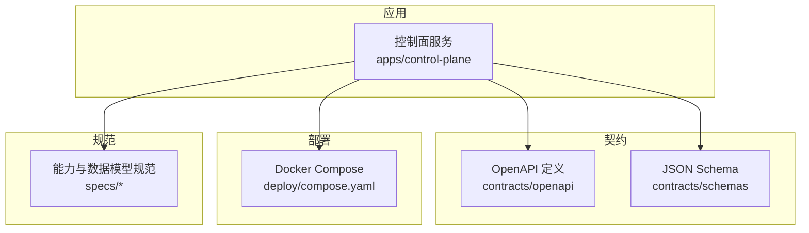
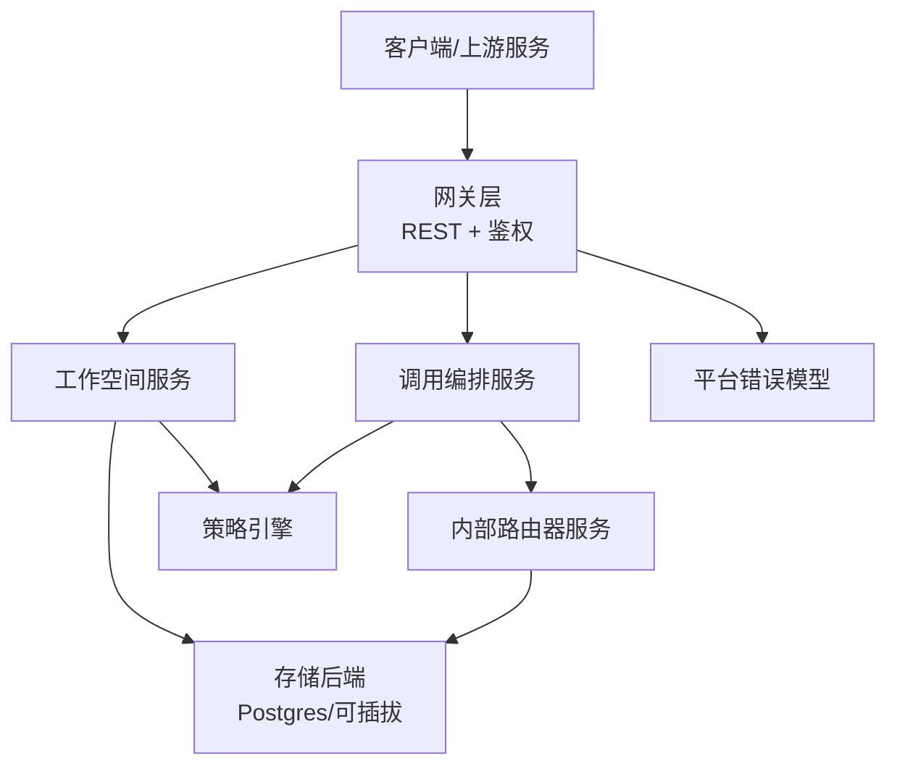
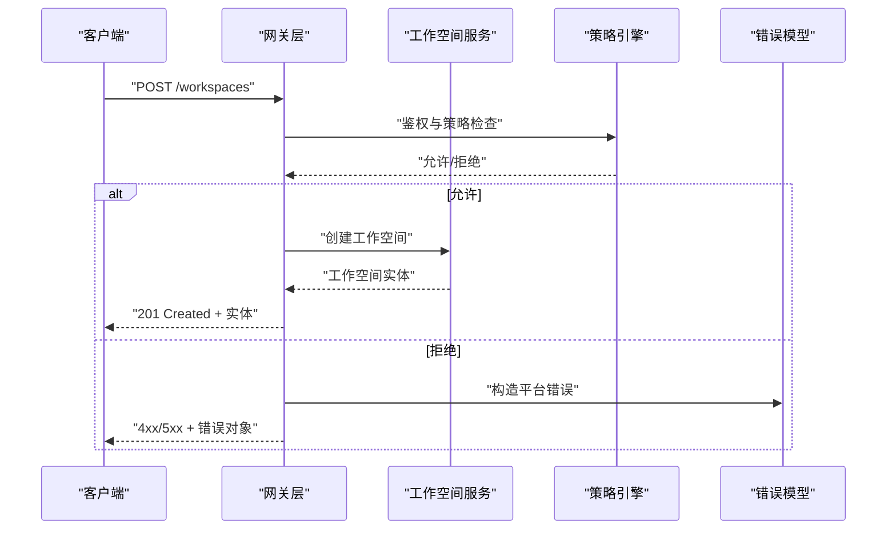
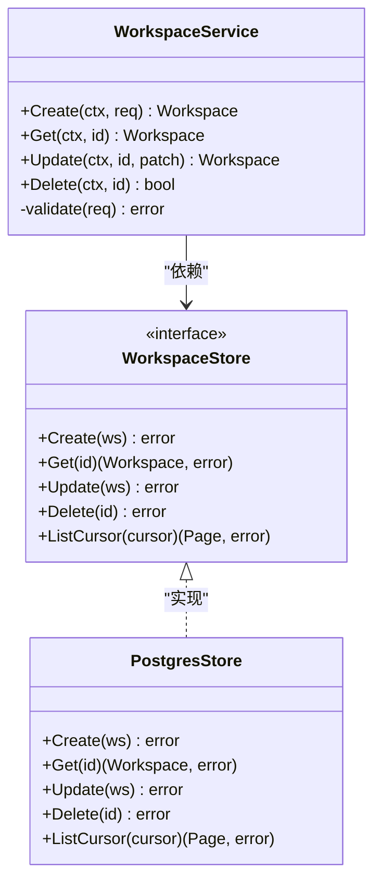
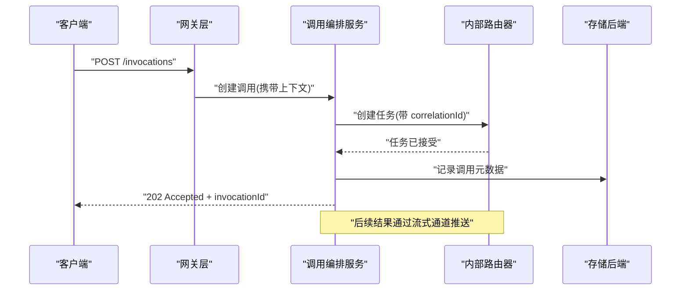
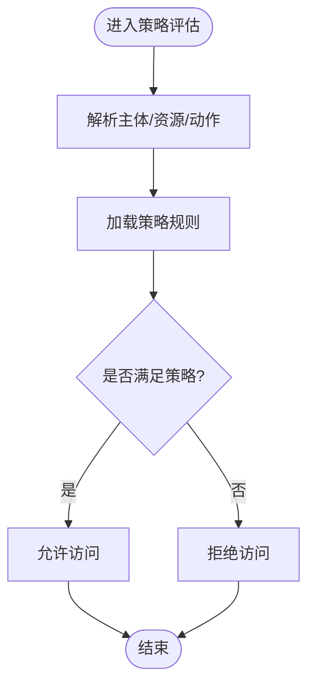
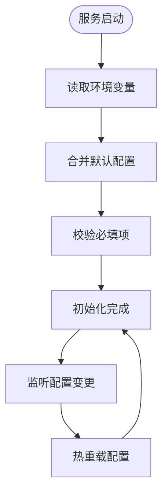
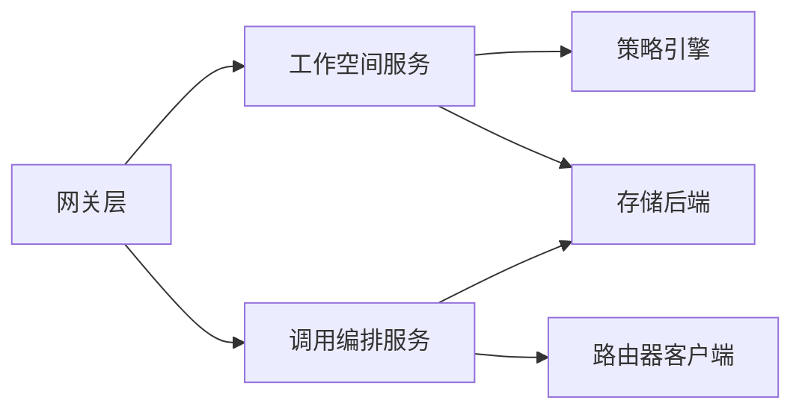

# 集成与扩展

<cite>
**本文引用的文件**   
- [README.md](file://README.md)
- [main.go](file://apps/control-plane/cmd/control-plane/main.go)
- [config.go](file://apps/control-plane/internal/config/config.go)
- [auth.go](file://apps/control-plane/internal/gateway/auth.go)
- [workspace_handler.go](file://apps/control-plane/internal/gateway/workspace_handler.go)
- [invocation_handler.go](file://apps/control-plane/internal/gateway/invocation_handler.go)
- [catalog_handler.go](file://apps/control-plane/internal/gateway/catalog_handler.go)
- [service.go](file://apps/control-plane/internal/workspace/service.go)
- [store.go](file://apps/control-plane/internal/workspace/store.go)
- [router_client.go](file://apps/control-plane/internal/invocation/router_client.go)
- [service.go](file://apps/control-plane/internal/invocation/service.go)
- [policy.go](file://apps/control-plane/internal/workspace/policy.go)
- [compose.yaml](file://deploy/compose.yaml)
- [control-plane.v2.yaml](file://contracts/openapi/control-plane.v2.yaml)
- [router-internal.v3.yaml](file://contracts/openapi/router-internal.v3.yaml)
- [platform-error.v4.yaml](file://contracts/schemas/platform-error.v4.yaml)
- [workspace.v1.schema.json](file://contracts/schemas/workspace.v1.schema.json)
- [006-resolve-authorize-capability-api.md](file://specs/006-resolve-authorize-capability/contracts/resolve-authorize-capability-api.md)
- [012-control-plane-invocation-dispatch.md](file://specs/012-control-plane-invocation-dispatch/data-model.md)
</cite>

## 目录
1. [简介](#简介)
2. [项目结构](#项目结构)
3. [核心组件](#核心组件)
4. [架构总览](#架构总览)
5. [详细组件分析](#详细组件分析)
6. [依赖分析](#依赖分析)
7. [性能考虑](#性能考虑)
8. [故障排查指南](#故障排查指南)
9. [结论](#结论)
10. [附录](#附录)

## 简介
本指南面向 NeKiro 工作空间服务的集成与扩展开发者，聚焦以下目标：
- 服务间通信接口设计：控制面对外 API、内部路由协议、错误模型与数据交换格式。
- 插件化架构：存储后端扩展点、认证提供者集成、自定义策略实现。
- 事件驱动与异步处理：发布订阅机制、流式结果投递与幂等性保障。
- 配置管理：环境变量、动态更新与多环境部署。
- 集成示例、测试策略与部署模板。
- 故障排查、性能监控与调试技巧。

## 项目结构
NeKiro 采用 Go 微服务分层组织方式，控制面位于 apps/control-plane，契约定义在 contracts，部署模板在 deploy，规范文档在 specs。

图表来源
- [main.go:1-200](file://apps/control-plane/cmd/control-plane/main.go#L1-L200)
- [control-plane.v2.yaml:1-200](file://contracts/openapi/control-plane.v2.yaml#L1-L200)
- [workspace.v1.schema.json:1-200](file://contracts/schemas/workspace.v1.schema.json#L1-L200)
- [compose.yaml:1-200](file://deploy/compose.yaml#L1-L200)

章节来源
- [README.md:1-200](file://README.md#L1-L200)
- [main.go:1-200](file://apps/control-plane/cmd/control-plane/main.go#L1-L200)

## 核心组件
- 网关层（Gateway）：暴露 RESTful API，负责鉴权、路由与请求校验。
- 工作空间服务（Workspace Service）：工作空间生命周期与状态管理，持久化到存储后端。
- 调用编排（Invocation Service）：将调用请求转发至路由器并跟踪执行状态。
- 路由器客户端（Router Client）：与内部路由器服务交互的 HTTP 客户端封装。
- 配置中心（Config）：集中加载环境变量与运行时配置。
- 策略引擎（Policy）：基于能力的授权与访问控制策略。

章节来源
- [workspace_handler.go:1-200](file://apps/control-plane/internal/gateway/workspace_handler.go#L1-L200)
- [invocation_handler.go:1-200](file://apps/control-plane/internal/gateway/invocation_handler.go#L1-L200)
- [catalog_handler.go:1-200](file://apps/control-plane/internal/gateway/catalog_handler.go#L1-L200)
- [service.go:1-200](file://apps/control-plane/internal/workspace/service.go#L1-L200)
- [store.go:1-200](file://apps/control-plane/internal/workspace/store.go#L1-L200)
- [router_client.go:1-200](file://apps/control-plane/internal/invocation/router_client.go#L1-L200)
- [service.go:1-200](file://apps/control-plane/internal/invocation/service.go#L1-L200)
- [config.go:1-200](file://apps/control-plane/internal/config/config.go#L1-L200)
- [policy.go:1-200](file://apps/control-plane/internal/workspace/policy.go#L1-L200)

## 架构总览
控制面作为统一入口，对外提供 OpenAPI 定义的 REST 接口；对内通过路由器内部 API 进行任务分发与结果回传。所有外部契约由 OpenAPI 与 JSON Schema 约束，错误模型统一使用平台错误模式。

图表来源
- [control-plane.v2.yaml:1-200](file://contracts/openapi/control-plane.v2.yaml#L1-L200)
- [router-internal.v3.yaml:1-200](file://contracts/openapi/router-internal.v3.yaml#L1-L200)
- [platform-error.v4.yaml:1-200](file://contracts/schemas/platform-error.v4.yaml#L1-L200)
- [workspace.v1.schema.json:1-200](file://contracts/schemas/workspace.v1.schema.json#L1-L200)
- [workspace_handler.go:1-200](file://apps/control-plane/internal/gateway/workspace_handler.go#L1-L200)
- [invocation_handler.go:1-200](file://apps/control-plane/internal/gateway/invocation_handler.go#L1-L200)
- [service.go:1-200](file://apps/control-plane/internal/workspace/service.go#L1-L200)
- [service.go:1-200](file://apps/control-plane/internal/invocation/service.go#L1-L200)
- [router_client.go:1-200](file://apps/control-plane/internal/invocation/router_client.go#L1-L200)
- [store.go:1-200](file://apps/control-plane/internal/workspace/store.go#L1-L200)
- [policy.go:1-200](file://apps/control-plane/internal/workspace/policy.go#L1-L200)

## 详细组件分析

### 网关层与外部 API
- 职责：接收外部请求，解析参数，鉴权，路由到对应服务，返回统一错误模型。
- 关键端点：工作空间 CRUD、调用发起与查询、目录检索。
- 鉴权：支持多种认证提供者，按策略注入上下文。
- 错误模型：遵循平台错误 v4 规范，包含错误码、消息与关联 ID。

图表来源
- [workspace_handler.go:1-200](file://apps/control-plane/internal/gateway/workspace_handler.go#L1-L200)
- [auth.go:1-200](file://apps/control-plane/internal/gateway/auth.go#L1-L200)
- [policy.go:1-200](file://apps/control-plane/internal/workspace/policy.go#L1-L200)
- [platform-error.v4.yaml:1-200](file://contracts/schemas/platform-error.v4.yaml#L1-L200)

章节来源
- [workspace_handler.go:1-200](file://apps/control-plane/internal/gateway/workspace_handler.go#L1-L200)
- [auth.go:1-200](file://apps/control-plane/internal/gateway/auth.go#L1-L200)
- [control-plane.v2.yaml:1-200](file://contracts/openapi/control-plane.v2.yaml#L1-L200)
- [platform-error.v4.yaml:1-200](file://contracts/schemas/platform-error.v4.yaml#L1-L200)

### 工作空间服务与存储后端
- 职责：工作空间实体的业务逻辑、状态机与一致性保证。
- 存储抽象：通过 store 接口解耦具体数据库实现，便于替换为不同后端。
- 事务与幂等：创建/更新操作需具备幂等键或版本控制，避免重复写入。
- 游标分页：cursor 用于高效分页与增量拉取。

图表来源
- [service.go:1-200](file://apps/control-plane/internal/workspace/service.go#L1-L200)
- [store.go:1-200](file://apps/control-plane/internal/workspace/store.go#L1-L200)
- [workspace.v1.schema.json:1-200](file://contracts/schemas/workspace.v1.schema.json#L1-L200)

章节来源
- [service.go:1-200](file://apps/control-plane/internal/workspace/service.go#L1-L200)
- [store.go:1-200](file://apps/control-plane/internal/workspace/store.go#L1-L200)
- [workspace.v1.schema.json:1-200](file://contracts/schemas/workspace.v1.schema.json#L1-L200)

### 调用编排与路由器内部协议
- 职责：将调用请求路由到合适的执行器，维护调用生命周期与追踪信息。
- 内部协议：遵循 router-internal v3，包含任务创建、状态查询与结果流式传输。
- 异步与流式：支持 SSE 或长轮询的结果推送，确保断线重连与去抖。
- 幂等与重试：基于 invocationId 与 rootTaskId 的幂等键，失败自动重试与退避。

图表来源
- [invocation_handler.go:1-200](file://apps/control-plane/internal/gateway/invocation_handler.go#L1-L200)
- [service.go:1-200](file://apps/control-plane/internal/invocation/service.go#L1-L200)
- [router_client.go:1-200](file://apps/control-plane/internal/invocation/router_client.go#L1-L200)
- [router-internal.v3.yaml:1-200](file://contracts/openapi/router-internal.v3.yaml#L1-L200)
- [012-control-plane-invocation-dispatch.md:1-200](file://specs/012-control-plane-invocation-dispatch/data-model.md#L1-L200)

章节来源
- [invocation_handler.go:1-200](file://apps/control-plane/internal/gateway/invocation_handler.go#L1-L200)
- [service.go:1-200](file://apps/control-plane/internal/invocation/service.go#L1-L200)
- [router_client.go:1-200](file://apps/control-plane/internal/invocation/router_client.go#L1-L200)
- [router-internal.v3.yaml:1-200](file://contracts/openapi/router-internal.v3.yaml#L1-L200)
- [012-control-plane-invocation-dispatch.md:1-200](file://specs/012-control-plane-invocation-dispatch/data-model.md#L1-L200)

### 策略与授权
- 能力解析：根据主体、资源与动作解析能力集。
- 策略评估：基于规则与上下文决定是否允许。
- 可扩展：支持自定义策略提供者与缓存层。

图表来源
- [policy.go:1-200](file://apps/control-plane/internal/workspace/policy.go#L1-L200)
- [006-resolve-authorize-capability-api.md:1-200](file://specs/006-resolve-authorize-capability/contracts/resolve-authorize-capability-api.md#L1-L200)

章节来源
- [policy.go:1-200](file://apps/control-plane/internal/workspace/policy.go#L1-L200)
- [006-resolve-authorize-capability-api.md:1-200](file://specs/006-resolve-authorize-capability/contracts/resolve-authorize-capability-api.md#L1-L200)

### 配置管理与环境变量
- 集中加载：从环境变量与配置文件合并加载。
- 热更新：支持运行时重新加载部分配置（如路由表、超时）。
- 安全：敏感信息通过密钥管理服务注入。

图表来源
- [config.go:1-200](file://apps/control-plane/internal/config/config.go#L1-L200)
- [main.go:1-200](file://apps/control-plane/cmd/control-plane/main.go#L1-L200)

章节来源
- [config.go:1-200](file://apps/control-plane/internal/config/config.go#L1-L200)
- [main.go:1-200](file://apps/control-plane/cmd/control-plane/main.go#L1-L200)

## 依赖分析
- 外部契约：OpenAPI 与 JSON Schema 强约束输入输出，降低集成成本。
- 内部依赖：网关层依赖工作空间服务、调用编排与策略引擎；调用编排依赖路由器客户端与存储。
- 潜在循环：应避免网关与服务之间的双向依赖，通过接口与事件解耦。

图表来源
- [workspace_handler.go:1-200](file://apps/control-plane/internal/gateway/workspace_handler.go#L1-L200)
- [invocation_handler.go:1-200](file://apps/control-plane/internal/gateway/invocation_handler.go#L1-L200)
- [service.go:1-200](file://apps/control-plane/internal/workspace/service.go#L1-L200)
- [service.go:1-200](file://apps/control-plane/internal/invocation/service.go#L1-L200)
- [router_client.go:1-200](file://apps/control-plane/internal/invocation/router_client.go#L1-L200)
- [policy.go:1-200](file://apps/control-plane/internal/workspace/policy.go#L1-L200)
- [store.go:1-200](file://apps/control-plane/internal/workspace/store.go#L1-L200)

章节来源
- [workspace_handler.go:1-200](file://apps/control-plane/internal/gateway/workspace_handler.go#L1-L200)
- [invocation_handler.go:1-200](file://apps/control-plane/internal/gateway/invocation_handler.go#L1-L200)
- [service.go:1-200](file://apps/control-plane/internal/workspace/service.go#L1-L200)
- [service.go:1-200](file://apps/control-plane/internal/invocation/service.go#L1-L200)
- [router_client.go:1-200](file://apps/control-plane/internal/invocation/router_client.go#L1-L200)
- [policy.go:1-200](file://apps/control-plane/internal/workspace/policy.go#L1-L200)
- [store.go:1-200](file://apps/control-plane/internal/workspace/store.go#L1-L200)

## 性能考虑
- 连接池：HTTP 客户端与数据库连接复用，合理设置最大空闲与超时。
- 并发控制：网关层限流与熔断，避免雪崩。
- 索引优化：工作空间与调用元数据表建立复合索引，提升查询效率。
- 流式传输：结果推送采用背压与窗口聚合，减少抖动。
- 缓存：策略与目录信息短期缓存，降低热点读压力。

[本节为通用指导，不直接分析具体文件]

## 故障排查指南
- 日志与追踪：为每个请求注入 traceId 与 correlationId，贯穿网关、服务与路由器。
- 错误定位：依据平台错误模型快速识别错误类型与来源。
- 健康检查：暴露 /health 与 /ready 端点，配合编排系统滚动重启。
- 慢查询：开启 SQL 慢查询日志，结合 APM 定位瓶颈。
- 重试与死信：对不可恢复错误入队死信队列，人工介入处理。

章节来源
- [platform-error.v4.yaml:1-200](file://contracts/schemas/platform-error.v4.yaml#L1-L200)
- [invocation_handler.go:1-200](file://apps/control-plane/internal/gateway/invocation_handler.go#L1-L200)
- [workspace_handler.go:1-200](file://apps/control-plane/internal/gateway/workspace_handler.go#L1-L200)

## 结论
通过统一的契约与清晰的插件边界，NeKiro 工作空间服务具备良好的可扩展性与可观测性。建议在生产环境中启用全链路追踪、指标采集与告警，持续优化性能与稳定性。

[本节为总结，不直接分析具体文件]

## 附录

### 集成示例（路径指引）
- 创建工作空间：参考工作空间处理器对外接口与 schema。
  - [workspace_handler.go:1-200](file://apps/control-plane/internal/gateway/workspace_handler.go#L1-L200)
  - [workspace.v1.schema.json:1-200](file://contracts/schemas/workspace.v1.schema.json#L1-L200)
- 发起调用并获取结果：参考调用处理器与路由器内部协议。
  - [invocation_handler.go:1-200](file://apps/control-plane/internal/gateway/invocation_handler.go#L1-L200)
  - [router-internal.v3.yaml:1-200](file://contracts/openapi/router-internal.v3.yaml#L1-L200)
- 鉴权与策略：参考认证与策略实现。
  - [auth.go:1-200](file://apps/control-plane/internal/gateway/auth.go#L1-L200)
  - [policy.go:1-200](file://apps/control-plane/internal/workspace/policy.go#L1-L200)

### 测试策略
- 单元测试：针对服务与策略逻辑编写用例，覆盖边界条件。
- 契约测试：基于 OpenAPI 与 JSON Schema 生成测试套件，验证兼容性与回归。
- 集成测试：使用 Docker Compose 拉起依赖，端到端验证工作空间与调用流程。
  - [compose.yaml:1-200](file://deploy/compose.yaml#L1-L200)

### 部署配置模板
- 使用 compose.yaml 快速搭建本地开发环境，按需替换镜像与端口映射。
  - [compose.yaml:1-200](file://deploy/compose.yaml#L1-L200)
- 环境变量清单：数据库连接、JWT 密钥、路由地址、日志级别等。
  - [config.go:1-200](file://apps/control-plane/internal/config/config.go#L1-L200)