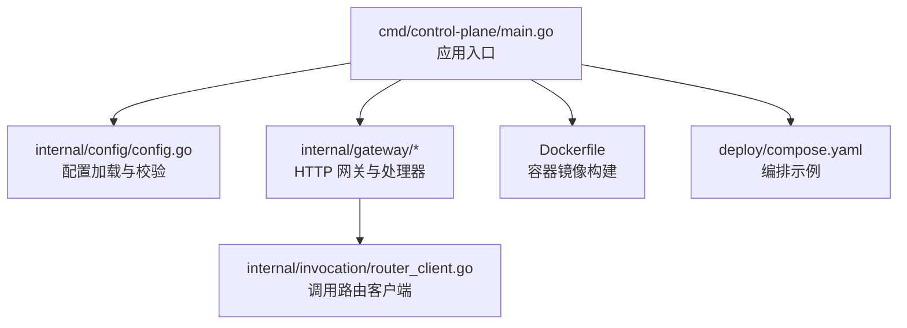
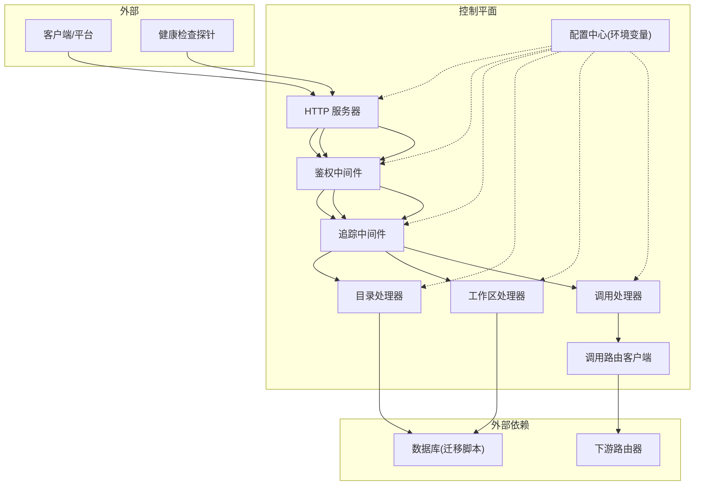
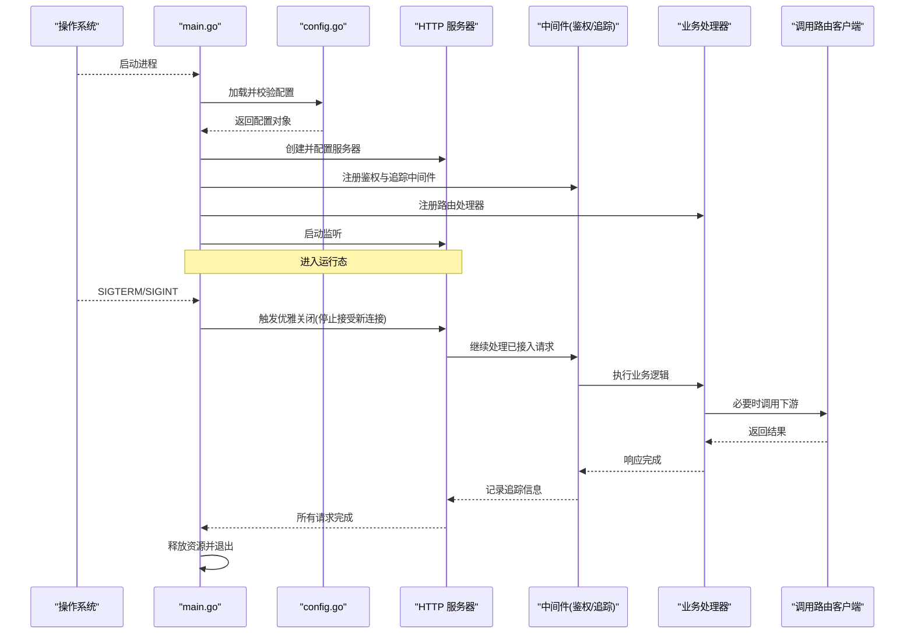
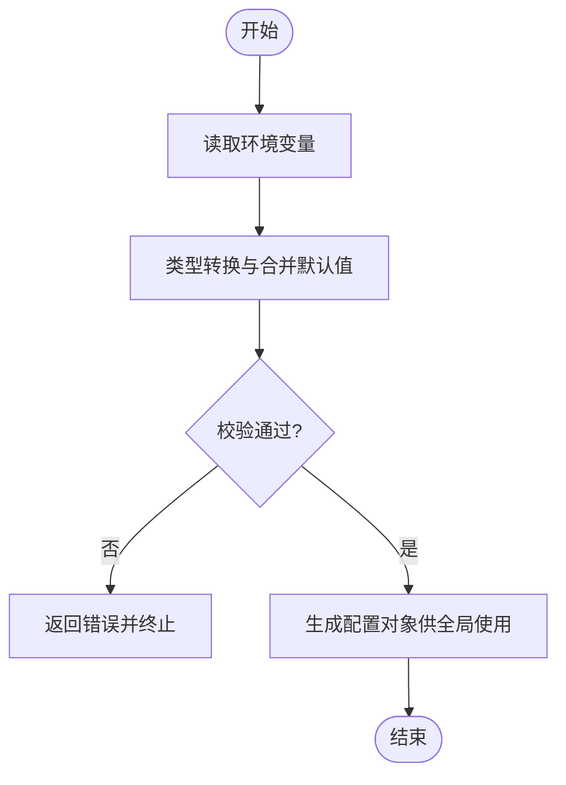
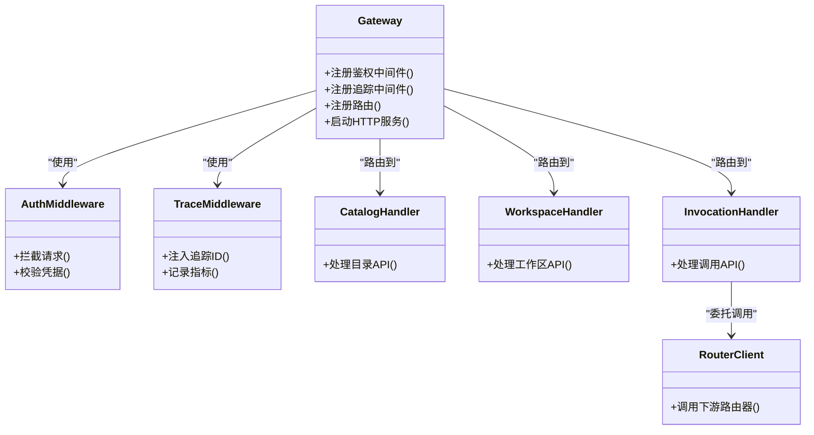
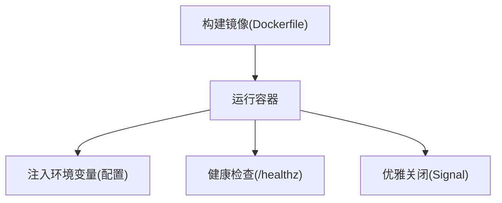
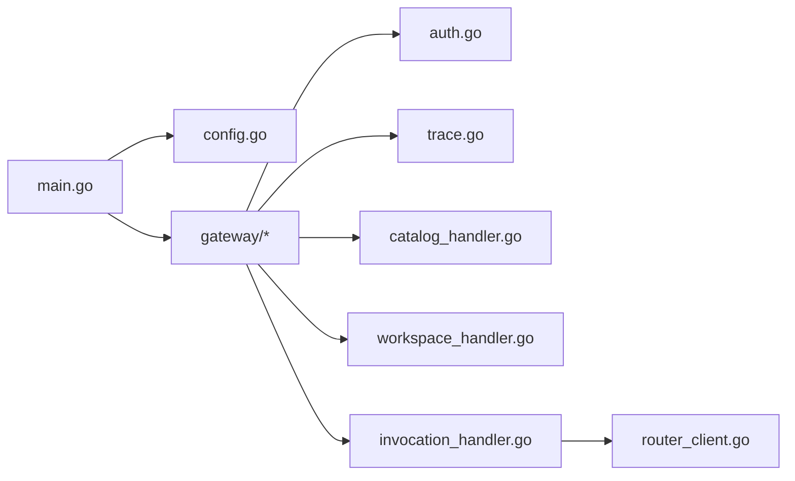

# 控制平面服务

<cite>
**本文引用的文件**   
- [apps/control-plane/cmd/control-plane/main.go](file://apps/control-plane/cmd/control-plane/main.go)
- [apps/control-plane/internal/config/config.go](file://apps/control-plane/internal/config/config.go)
- [apps/control-plane/internal/gateway/auth.go](file://apps/control-plane/internal/gateway/auth.go)
- [apps/control-plane/internal/gateway/trace.go](file://apps/control-plane/internal/gateway/trace.go)
- [apps/control-plane/internal/gateway/catalog_handler.go](file://apps/control-plane/internal/gateway/catalog_handler.go)
- [apps/control-plane/internal/gateway/invocation_handler.go](file://apps/control-plane/internal/gateway/invocation_handler.go)
- [apps/control-plane/internal/gateway/workspace_handler.go](file://apps/control-plane/internal/gateway/workspace_handler.go)
- [apps/control-plane/internal/invocation/router_client.go](file://apps/control-plane/internal/invocation/router_client.go)
- [apps/control-plane/Dockerfile](file://apps/control-plane/Dockerfile)
- [deploy/compose.yaml](file://deploy/compose.yaml)
</cite>

## 目录
1. [简介](#简介)
2. [项目结构](#项目结构)
3. [核心组件](#核心组件)
4. [架构总览](#架构总览)
5. [详细组件分析](#详细组件分析)
6. [依赖关系分析](#依赖关系分析)
7. [性能考虑](#性能考虑)
8. [故障排查指南](#故障排查指南)
9. [结论](#结论)
10. [附录](#附录)

## 简介
本文件为 NeKiro 控制平面服务的组件设计文档，聚焦于控制平面作为系统核心协调者的职责与实现。内容涵盖：
- 服务启动流程、依赖注入配置、HTTP 服务器初始化过程
- 配置管理系统（环境变量加载、配置验证、热重载机制）
- Docker 容器化部署的配置选项与最佳实践
- 服务生命周期管理、优雅关闭与健康检查机制
- 服务架构图与启动流程图

## 项目结构
控制平面位于 apps/control-plane 下，采用按功能域分层组织：
- cmd/control-plane: 应用入口与进程生命周期编排
- internal/config: 配置加载与校验
- internal/gateway: HTTP 网关层（路由、鉴权、追踪、业务处理器）
- internal/invocation: 调用路由客户端
- migrations: 数据库迁移脚本
- Dockerfile: 容器镜像构建定义
- deploy/compose.yaml: 本地/集成编排示例

图表来源
- [apps/control-plane/cmd/control-plane/main.go](file://apps/control-plane/cmd/control-plane/main.go)
- [apps/control-plane/internal/config/config.go](file://apps/control-plane/internal/config/config.go)
- [apps/control-plane/internal/gateway/catalog_handler.go](file://apps/control-plane/internal/gateway/catalog_handler.go)
- [apps/control-plane/internal/gateway/invocation_handler.go](file://apps/control-plane/internal/gateway/invocation_handler.go)
- [apps/control-plane/internal/gateway/workspace_handler.go](file://apps/control-plane/internal/gateway/workspace_handler.go)
- [apps/control-plane/internal/invocation/router_client.go](file://apps/control-plane/internal/invocation/router_client.go)
- [apps/control-plane/Dockerfile](file://apps/control-plane/Dockerfile)
- [deploy/compose.yaml](file://deploy/compose.yaml)

章节来源
- [apps/control-plane/cmd/control-plane/main.go](file://apps/control-plane/cmd/control-plane/main.go)
- [apps/control-plane/internal/config/config.go](file://apps/control-plane/internal/config/config.go)
- [apps/control-plane/Dockerfile](file://apps/control-plane/Dockerfile)
- [deploy/compose.yaml](file://deploy/compose.yaml)

## 核心组件
- 应用入口与生命周期编排
  - 负责解析配置、初始化日志与追踪、创建 HTTP 服务器、注册路由、监听端口、处理信号并优雅关闭。
- 配置管理
  - 从环境变量加载配置项，进行类型转换与必填校验，提供运行时访问接口；支持在后续扩展中实现热重载。
- HTTP 网关与处理器
  - 统一鉴权中间件、请求追踪中间件、领域处理器（目录、工作区、调用）。
- 调用路由客户端
  - 封装对下游路由器的 HTTP 调用，用于任务分发与结果回传。
- 容器化与编排
  - 通过 Dockerfile 构建最小镜像，配合 compose.yaml 完成本地/集成环境编排。

章节来源
- [apps/control-plane/cmd/control-plane/main.go](file://apps/control-plane/cmd/control-plane/main.go)
- [apps/control-plane/internal/config/config.go](file://apps/control-plane/internal/config/config.go)
- [apps/control-plane/internal/gateway/auth.go](file://apps/control-plane/internal/gateway/auth.go)
- [apps/control-plane/internal/gateway/trace.go](file://apps/control-plane/internal/gateway/trace.go)
- [apps/control-plane/internal/gateway/catalog_handler.go](file://apps/control-plane/internal/gateway/catalog_handler.go)
- [apps/control-plane/internal/gateway/invocation_handler.go](file://apps/control-plane/internal/gateway/invocation_handler.go)
- [apps/control-plane/internal/gateway/workspace_handler.go](file://apps/control-plane/internal/gateway/workspace_handler.go)
- [apps/control-plane/internal/invocation/router_client.go](file://apps/control-plane/internal/invocation/router_client.go)
- [apps/control-plane/Dockerfile](file://apps/control-plane/Dockerfile)
- [deploy/compose.yaml](file://deploy/compose.yaml)

## 架构总览
控制平面对外暴露 HTTP API，内部通过网关层进行鉴权与追踪，再委派到各业务处理器；调用路由通过路由器客户端转发至下游执行器。

图表来源
- [apps/control-plane/cmd/control-plane/main.go](file://apps/control-plane/cmd/control-plane/main.go)
- [apps/control-plane/internal/config/config.go](file://apps/control-plane/internal/config/config.go)
- [apps/control-plane/internal/gateway/auth.go](file://apps/control-plane/internal/gateway/auth.go)
- [apps/control-plane/internal/gateway/trace.go](file://apps/control-plane/internal/gateway/trace.go)
- [apps/control-plane/internal/gateway/catalog_handler.go](file://apps/control-plane/internal/gateway/catalog_handler.go)
- [apps/control-plane/internal/gateway/workspace_handler.go](file://apps/control-plane/internal/gateway/workspace_handler.go)
- [apps/control-plane/internal/gateway/invocation_handler.go](file://apps/control-plane/internal/gateway/invocation_handler.go)
- [apps/control-plane/internal/invocation/router_client.go](file://apps/control-plane/internal/invocation/router_client.go)

## 详细组件分析

### 应用入口与生命周期管理
- 职责
  - 加载配置并校验
  - 初始化日志与追踪
  - 创建 HTTP 服务器并注册路由
  - 监听端口，阻塞等待请求
  - 捕获系统信号，触发优雅关闭
- 关键流程
  - 启动阶段：解析配置 → 初始化依赖 → 启动 HTTP 服务
  - 运行阶段：接收请求 → 中间件链处理 → 处理器执行业务逻辑
  - 关闭阶段：停止接受新连接 → 等待活跃请求完成 → 释放资源 → 退出进程

图表来源
- [apps/control-plane/cmd/control-plane/main.go](file://apps/control-plane/cmd/control-plane/main.go)
- [apps/control-plane/internal/config/config.go](file://apps/control-plane/internal/config/config.go)
- [apps/control-plane/internal/gateway/auth.go](file://apps/control-plane/internal/gateway/auth.go)
- [apps/control-plane/internal/gateway/trace.go](file://apps/control-plane/internal/gateway/trace.go)
- [apps/control-plane/internal/gateway/catalog_handler.go](file://apps/control-plane/internal/gateway/catalog_handler.go)
- [apps/control-plane/internal/gateway/workspace_handler.go](file://apps/control-plane/internal/gateway/workspace_handler.go)
- [apps/control-plane/internal/gateway/invocation_handler.go](file://apps/control-plane/internal/gateway/invocation_handler.go)
- [apps/control-plane/internal/invocation/router_client.go](file://apps/control-plane/internal/invocation/router_client.go)

章节来源
- [apps/control-plane/cmd/control-plane/main.go](file://apps/control-plane/cmd/control-plane/main.go)

### 配置管理系统
- 数据来源
  - 环境变量为主，支持默认值与类型转换
- 配置项
  - 服务监听地址、端口、超时、鉴权密钥、追踪开关、下游路由器地址等
- 校验策略
  - 必填字段校验、范围校验、格式校验
- 热重载机制
  - 当前实现以启动时加载为主；可在配置对象上增加变更监听与回调，结合文件系统或配置中心实现热更新

图表来源
- [apps/control-plane/internal/config/config.go](file://apps/control-plane/internal/config/config.go)

章节来源
- [apps/control-plane/internal/config/config.go](file://apps/control-plane/internal/config/config.go)

### HTTP 服务器与网关层
- 中间件
  - 鉴权中间件：校验请求头/令牌，拒绝非法访问
  - 追踪中间件：注入上下文追踪 ID，记录请求耗时与关键事件
- 处理器
  - 目录处理器：管理服务目录相关能力
  - 工作区处理器：管理工作区安装与元数据
  - 调用处理器：负责任务调度的入口与编排
- 健康检查
  - 建议暴露 /healthz 端点，返回服务就绪状态，供负载均衡与编排系统探测

图表来源
- [apps/control-plane/internal/gateway/auth.go](file://apps/control-plane/internal/gateway/auth.go)
- [apps/control-plane/internal/gateway/trace.go](file://apps/control-plane/internal/gateway/trace.go)
- [apps/control-plane/internal/gateway/catalog_handler.go](file://apps/control-plane/internal/gateway/catalog_handler.go)
- [apps/control-plane/internal/gateway/workspace_handler.go](file://apps/control-plane/internal/gateway/workspace_handler.go)
- [apps/control-plane/internal/gateway/invocation_handler.go](file://apps/control-plane/internal/gateway/invocation_handler.go)
- [apps/control-plane/internal/invocation/router_client.go](file://apps/control-plane/internal/invocation/router_client.go)

章节来源
- [apps/control-plane/internal/gateway/auth.go](file://apps/control-plane/internal/gateway/auth.go)
- [apps/control-plane/internal/gateway/trace.go](file://apps/control-plane/internal/gateway/trace.go)
- [apps/control-plane/internal/gateway/catalog_handler.go](file://apps/control-plane/internal/gateway/catalog_handler.go)
- [apps/control-plane/internal/gateway/workspace_handler.go](file://apps/control-plane/internal/gateway/workspace_handler.go)
- [apps/control-plane/internal/gateway/invocation_handler.go](file://apps/control-plane/internal/gateway/invocation_handler.go)
- [apps/control-plane/internal/invocation/router_client.go](file://apps/control-plane/internal/invocation/router_client.go)

### 调用路由客户端
- 职责
  - 封装对下游路由器的 HTTP 调用，包括重试、超时、错误码映射
- 关键点
  - 基于配置动态选择目标地址
  - 将调用结果与追踪上下文透传给下游

章节来源
- [apps/control-plane/internal/invocation/router_client.go](file://apps/control-plane/internal/invocation/router_client.go)

### 容器化与编排
- Dockerfile
  - 多阶段构建，最小化镜像体积，仅包含运行时依赖
  - 设置非 root 用户运行，提升安全性
- Compose 编排
  - 定义服务、网络、卷挂载与环境变量
  - 提供健康检查与重启策略

图表来源
- [apps/control-plane/Dockerfile](file://apps/control-plane/Dockerfile)
- [deploy/compose.yaml](file://deploy/compose.yaml)

章节来源
- [apps/control-plane/Dockerfile](file://apps/control-plane/Dockerfile)
- [deploy/compose.yaml](file://deploy/compose.yaml)

## 依赖关系分析
- 模块内聚
  - gateway 层高内聚地聚合鉴权、追踪与处理器
  - invocation 层专注于与下游路由器的交互
- 外部依赖
  - 配置来源于环境变量
  - 健康检查由 HTTP 服务器暴露
  - 下游路由器通过 HTTP 协议通信

图表来源
- [apps/control-plane/cmd/control-plane/main.go](file://apps/control-plane/cmd/control-plane/main.go)
- [apps/control-plane/internal/config/config.go](file://apps/control-plane/internal/config/config.go)
- [apps/control-plane/internal/gateway/auth.go](file://apps/control-plane/internal/gateway/auth.go)
- [apps/control-plane/internal/gateway/trace.go](file://apps/control-plane/internal/gateway/trace.go)
- [apps/control-plane/internal/gateway/catalog_handler.go](file://apps/control-plane/internal/gateway/catalog_handler.go)
- [apps/control-plane/internal/gateway/workspace_handler.go](file://apps/control-plane/internal/gateway/workspace_handler.go)
- [apps/control-plane/internal/gateway/invocation_handler.go](file://apps/control-plane/internal/gateway/invocation_handler.go)
- [apps/control-plane/internal/invocation/router_client.go](file://apps/control-plane/internal/invocation/router_client.go)

章节来源
- [apps/control-plane/cmd/control-plane/main.go](file://apps/control-plane/cmd/control-plane/main.go)
- [apps/control-plane/internal/config/config.go](file://apps/control-plane/internal/config/config.go)
- [apps/control-plane/internal/gateway/auth.go](file://apps/control-plane/internal/gateway/auth.go)
- [apps/control-plane/internal/gateway/trace.go](file://apps/control-plane/internal/gateway/trace.go)
- [apps/control-plane/internal/gateway/catalog_handler.go](file://apps/control-plane/internal/gateway/catalog_handler.go)
- [apps/control-plane/internal/gateway/workspace_handler.go](file://apps/control-plane/internal/gateway/workspace_handler.go)
- [apps/control-plane/internal/gateway/invocation_handler.go](file://apps/control-plane/internal/gateway/invocation_handler.go)
- [apps/control-plane/internal/invocation/router_client.go](file://apps/control-plane/internal/invocation/router_client.go)

## 性能考虑
- 并发模型
  - HTTP 服务器默认并发处理请求，避免在处理器中进行阻塞操作
- 超时与限流
  - 合理设置请求超时、读写超时与最大并发数
- 追踪开销
  - 追踪中间件应轻量，避免频繁 I/O；可采样降低开销
- 资源清理
  - 确保连接池、goroutine 与临时资源在关闭路径中被正确释放

[本节为通用指导，不直接分析具体文件]

## 故障排查指南
- 启动失败
  - 检查环境变量是否完整、端口是否被占用、配置文件是否合法
- 鉴权失败
  - 核对鉴权中间件的密钥与请求头格式
- 调用下游失败
  - 检查路由器地址可达性、超时与重试策略
- 健康检查异常
  - 确认 /healthz 端点存在且返回正常状态码
- 优雅关闭问题
  - 观察是否有长事务或未完成的请求导致关闭延迟

章节来源
- [apps/control-plane/internal/gateway/auth.go](file://apps/control-plane/internal/gateway/auth.go)
- [apps/control-plane/internal/gateway/trace.go](file://apps/control-plane/internal/gateway/trace.go)
- [apps/control-plane/internal/invocation/router_client.go](file://apps/control-plane/internal/invocation/router_client.go)

## 结论
控制平面作为 NeKiro 的核心协调者，通过清晰的启动流程、严格的配置校验、健壮的网关中间件与明确的处理器边界，实现了高内聚、低耦合的架构。配合容器化与编排方案，可实现稳定可靠的部署与运维。建议在后续迭代中完善健康检查端点、引入配置热重载与更完善的指标采集，以提升可观测性与弹性。

[本节为总结性内容，不直接分析具体文件]

## 附录
- 环境变量清单（示例）
  - 服务监听地址与端口
  - 鉴权密钥与算法
  - 追踪开关与采样率
  - 下游路由器地址与超时
  - 日志级别与输出格式
- 健康检查端点
  - GET /healthz：返回服务就绪状态
- 优雅关闭信号
  - 监听 SIGTERM/SIGINT，停止接受新连接，等待活跃请求完成后再退出

[本节为补充说明，不直接分析具体文件]