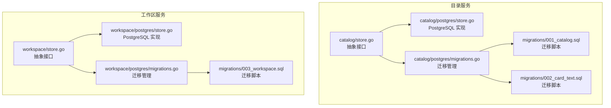
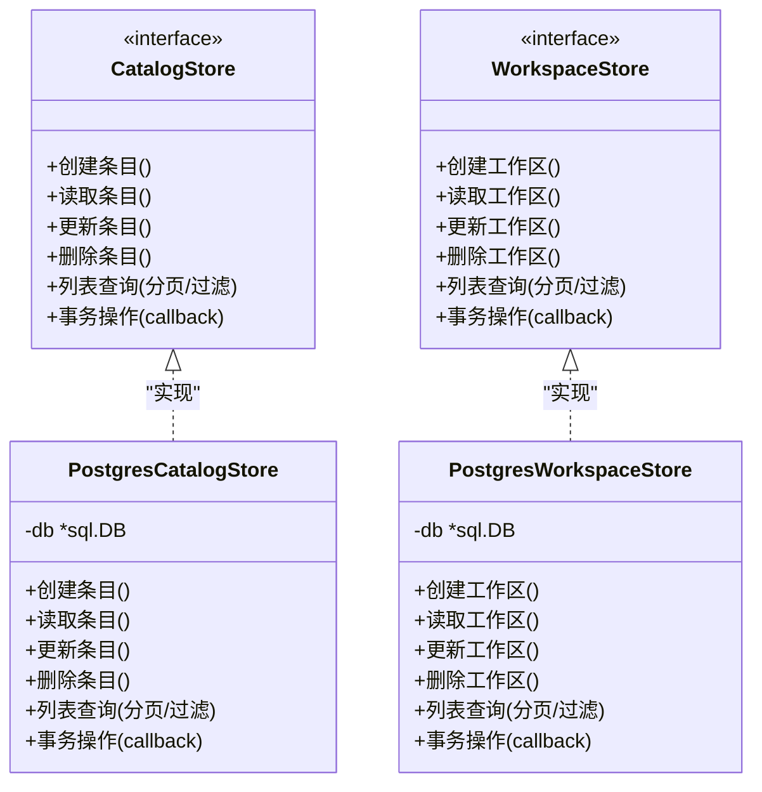
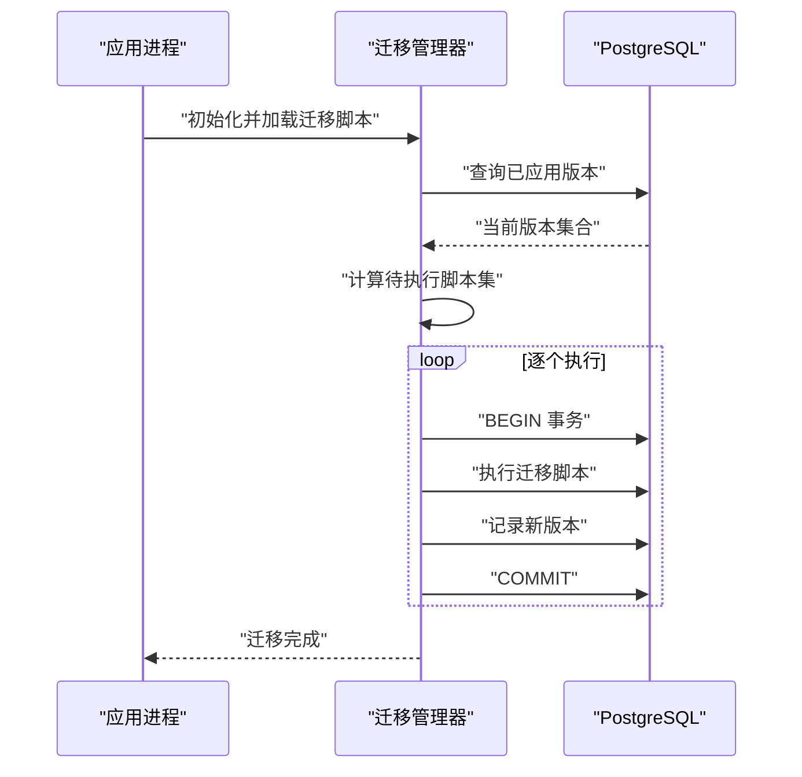
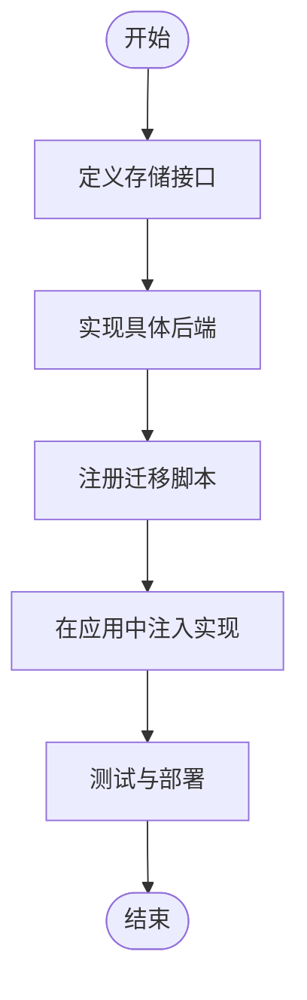
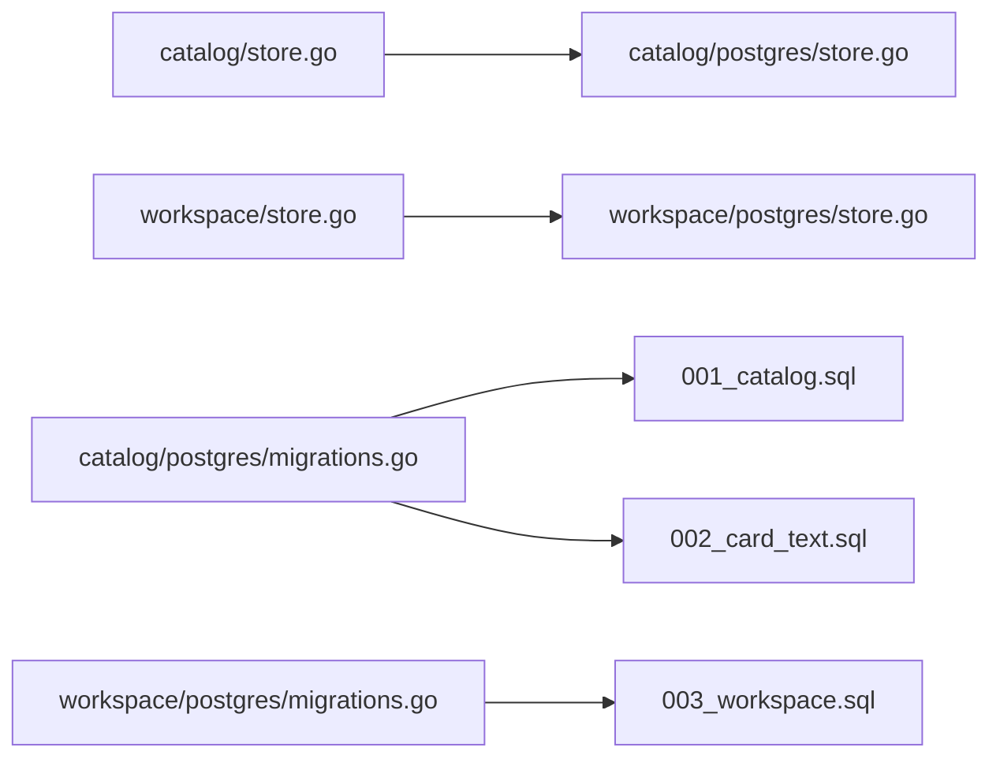

# 存储层实现

<cite>
**本文引用的文件**   
- [apps/control-plane/internal/catalog/postgres/store.go](file://apps/control-plane/internal/catalog/postgres/store.go)
- [apps/control-plane/internal/catalog/postgres/migrations.go](file://apps/control-plane/internal/catalog/postgres/migrations.go)
- [apps/control-plane/internal/catalog/store.go](file://apps/control-plane/internal/catalog/store.go)
- [apps/control-plane/internal/workspace/postgres/store.go](file://apps/control-plane/internal/workspace/postgres/store.go)
- [apps/control-plane/internal/workspace/postgres/migrations.go](file://apps/control-plane/internal/workspace/postgres/migrations.go)
- [apps/control-plane/internal/workspace/store.go](file://apps/control-plane/internal/workspace/store.go)
- [apps/control-plane/migrations/001_catalog.sql](file://apps/control-plane/migrations/001_catalog.sql)
- [apps/control-plane/migrations/002_card_text.sql](file://apps/control-plane/migrations/002_card_text.sql)
- [apps/control-plane/migrations/003_workspace.sql](file://apps/control-plane/migrations/003_workspace.sql)
</cite>

## 目录
1. [简介](#简介)
2. [项目结构](#项目结构)
3. [核心组件](#核心组件)
4. [架构总览](#架构总览)
5. [详细组件分析](#详细组件分析)
6. [依赖关系分析](#依赖关系分析)
7. [性能考虑](#性能考虑)
8. [故障排查指南](#故障排查指南)
9. [结论](#结论)
10. [附录](#附录)

## 简介
本技术文档聚焦于“目录服务”的存储层，围绕以下目标展开：
- 存储抽象接口设计：数据访问模式、事务管理与错误处理策略
- PostgreSQL 具体实现：表结构设计、索引优化与查询调优
- 数据库迁移脚本的管理与版本控制机制
- 连接池配置、事务隔离级别与并发访问控制
- 扩展点设计与自定义存储后端实现指南
- SQL 查询示例与性能监控指标

## 项目结构
存储层按领域划分（catalog、workspace），每个领域包含：
- 抽象接口定义（store.go）
- PostgreSQL 具体实现（postgres/store.go）
- 迁移管理（postgres/migrations.go）
- 迁移脚本（migrations/*.sql）

图表来源
- [apps/control-plane/internal/catalog/store.go](file://apps/control-plane/internal/catalog/store.go)
- [apps/control-plane/internal/catalog/postgres/store.go](file://apps/control-plane/internal/catalog/postgres/store.go)
- [apps/control-plane/internal/catalog/postgres/migrations.go](file://apps/control-plane/internal/catalog/postgres/migrations.go)
- [apps/control-plane/internal/workspace/store.go](file://apps/control-plane/internal/workspace/store.go)
- [apps/control-plane/internal/workspace/postgres/store.go](file://apps/control-plane/internal/workspace/postgres/store.go)
- [apps/control-plane/internal/workspace/postgres/migrations.go](file://apps/control-plane/internal/workspace/postgres/migrations.go)
- [apps/control-plane/migrations/001_catalog.sql](file://apps/control-plane/migrations/001_catalog.sql)
- [apps/control-plane/migrations/002_card_text.sql](file://apps/control-plane/migrations/002_card_text.sql)
- [apps/control-plane/migrations/003_workspace.sql](file://apps/control-plane/migrations/003_workspace.sql)

章节来源
- [apps/control-plane/internal/catalog/store.go](file://apps/control-plane/internal/catalog/store.go)
- [apps/control-plane/internal/catalog/postgres/store.go](file://apps/control-plane/internal/catalog/postgres/store.go)
- [apps/control-plane/internal/catalog/postgres/migrations.go](file://apps/control-plane/internal/catalog/postgres/migrations.go)
- [apps/control-plane/internal/workspace/store.go](file://apps/control-plane/internal/workspace/store.go)
- [apps/control-plane/internal/workspace/postgres/store.go](file://apps/control-plane/internal/workspace/postgres/store.go)
- [apps/control-plane/internal/workspace/postgres/migrations.go](file://apps/control-plane/internal/workspace/postgres/migrations.go)
- [apps/control-plane/migrations/001_catalog.sql](file://apps/control-plane/migrations/001_catalog.sql)
- [apps/control-plane/migrations/002_card_text.sql](file://apps/control-plane/migrations/002_card_text.sql)
- [apps/control-plane/migrations/003_workspace.sql](file://apps/control-plane/migrations/003_workspace.sql)

## 核心组件
- 抽象接口层
  - catalog/store.go：定义目录数据的读写、分页、游标等访问方法
  - workspace/store.go：定义工作区数据的读写、状态变更等方法
- PostgreSQL 实现层
  - catalog/postgres/store.go：基于 sql.DB/sqlx 的具体实现，封装 SQL 执行、事务边界、错误映射
  - workspace/postgres/store.go：同上，面向工作区领域
- 迁移管理层
  - catalog/postgres/migrations.go：注册并执行 catalog 相关迁移
  - workspace/postgres/migrations.go：注册并执行 workspace 相关迁移
- 迁移脚本
  - migrations/001_catalog.sql、002_card_text.sql、003_workspace.sql：DDL/DML 变更脚本，按版本号顺序执行

章节来源
- [apps/control-plane/internal/catalog/store.go](file://apps/control-plane/internal/catalog/store.go)
- [apps/control-plane/internal/workspace/store.go](file://apps/control-plane/internal/workspace/store.go)
- [apps/control-plane/internal/catalog/postgres/store.go](file://apps/control-plane/internal/catalog/postgres/store.go)
- [apps/control-plane/internal/workspace/postgres/store.go](file://apps/control-plane/internal/workspace/postgres/store.go)
- [apps/control-plane/internal/catalog/postgres/migrations.go](file://apps/control-plane/internal/catalog/postgres/migrations.go)
- [apps/control-plane/internal/workspace/postgres/migrations.go](file://apps/control-plane/internal/workspace/postgres/migrations.go)
- [apps/control-plane/migrations/001_catalog.sql](file://apps/control-plane/migrations/001_catalog.sql)
- [apps/control-plane/migrations/002_card_text.sql](file://apps/control-plane/migrations/002_card_text.sql)
- [apps/control-plane/migrations/003_workspace.sql](file://apps/control-plane/migrations/003_workspace.sql)

## 架构总览
存储层采用“接口 + 具体实现”的分层设计，上层通过接口调用，底层由 PostgreSQL 驱动完成持久化。迁移系统负责数据库版本演进，确保多实例部署时的一致性。

图表来源
- [apps/control-plane/internal/catalog/store.go](file://apps/control-plane/internal/catalog/store.go)
- [apps/control-plane/internal/workspace/store.go](file://apps/control-plane/internal/workspace/store.go)
- [apps/control-plane/internal/catalog/postgres/store.go](file://apps/control-plane/internal/catalog/postgres/store.go)
- [apps/control-plane/internal/workspace/postgres/store.go](file://apps/control-plane/internal/workspace/postgres/store.go)

## 详细组件分析

### 抽象接口设计（数据访问模式、事务管理、错误处理）
- 数据访问模式
  - 单条记录：按主键或业务键进行精确查找
  - 列表与分页：支持排序、过滤、游标翻页
  - 批量写入：在事务内合并多条写操作
- 事务管理
  - 提供统一的事务入口，内部使用 BeginTx/Commit/Rollback
  - 支持嵌套回调式事务，便于组合多个写操作
- 错误处理
  - 将数据库错误转换为领域错误类型，区分唯一约束冲突、不存在、权限不足等
  - 对超时、连接失败等基础设施错误进行包装，便于上层重试与熔断

章节来源
- [apps/control-plane/internal/catalog/store.go](file://apps/control-plane/internal/catalog/store.go)
- [apps/control-plane/internal/workspace/store.go](file://apps/control-plane/internal/workspace/store.go)

### PostgreSQL 具体实现（表结构、索引、查询调优）
- 表结构
  - catalog 相关表：由迁移脚本 001_catalog.sql、002_card_text.sql 定义
  - workspace 相关表：由迁移脚本 003_workspace.sql 定义
- 索引优化
  - 为常用查询条件建立复合索引（如按租户/命名空间/名称前缀）
  - 为外键字段建立索引以加速关联查询
  - 针对分页游标列建立有序索引，避免全表扫描
- 查询调优
  - 使用 EXPLAIN ANALYZE 验证执行计划
  - 限制返回列，减少网络与序列化开销
  - 合理设置 LIMIT/OFFSET 或使用游标翻页，避免深分页

章节来源
- [apps/control-plane/migrations/001_catalog.sql](file://apps/control-plane/migrations/001_catalog.sql)
- [apps/control-plane/migrations/002_card_text.sql](file://apps/control-plane/migrations/002_card_text.sql)
- [apps/control-plane/migrations/003_workspace.sql](file://apps/control-plane/migrations/003_workspace.sql)
- [apps/control-plane/internal/catalog/postgres/store.go](file://apps/control-plane/internal/catalog/postgres/store.go)
- [apps/control-plane/internal/workspace/postgres/store.go](file://apps/control-plane/internal/workspace/postgres/store.go)

### 迁移脚本管理与版本控制
- 迁移脚本组织
  - 按数字前缀命名，保证执行顺序
  - 每个脚本幂等且可回滚（建议提供 up/down 语义）
- 迁移执行流程
  - 启动时检查已应用版本
  - 依次执行未应用的迁移脚本
  - 记录迁移元数据，防止重复执行
- 并发安全
  - 使用分布式锁或数据库行级锁保证多实例串行执行迁移

图表来源
- [apps/control-plane/internal/catalog/postgres/migrations.go](file://apps/control-plane/internal/catalog/postgres/migrations.go)
- [apps/control-plane/internal/workspace/postgres/migrations.go](file://apps/control-plane/internal/workspace/postgres/migrations.go)
- [apps/control-plane/migrations/001_catalog.sql](file://apps/control-plane/migrations/001_catalog.sql)
- [apps/control-plane/migrations/002_card_text.sql](file://apps/control-plane/migrations/002_card_text.sql)
- [apps/control-plane/migrations/003_workspace.sql](file://apps/control-plane/migrations/003_workspace.sql)

章节来源
- [apps/control-plane/internal/catalog/postgres/migrations.go](file://apps/control-plane/internal/catalog/postgres/migrations.go)
- [apps/control-plane/internal/workspace/postgres/migrations.go](file://apps/control-plane/internal/workspace/postgres/migrations.go)
- [apps/control-plane/migrations/001_catalog.sql](file://apps/control-plane/migrations/001_catalog.sql)
- [apps/control-plane/migrations/002_card_text.sql](file://apps/control-plane/migrations/002_card_text.sql)
- [apps/control-plane/migrations/003_workspace.sql](file://apps/control-plane/migrations/003_workspace.sql)

### 连接池配置、事务隔离级别与并发访问控制
- 连接池配置
  - MaxOpenConns：根据 QPS 与 CPU 核数估算，避免过多连接导致上下文切换
  - MaxIdleConns：保持最小空闲连接，降低冷启动延迟
  - ConnMaxLifetime/ConnMaxIdleTime：定期回收长连接，避免中间件断连
- 事务隔离级别
  - 默认使用 READ COMMITTED，兼顾一致性与吞吐
  - 需要强一致读的场景可使用 REPEATABLE READ 或 SERIALIZABLE（谨慎评估性能）
- 并发访问控制
  - 使用行级锁（FOR UPDATE）保护热点记录更新
  - 使用唯一约束与冲突检测避免重复写入
  - 对批量写入使用分片或批大小限制，避免长事务

章节来源
- [apps/control-plane/internal/catalog/postgres/store.go](file://apps/control-plane/internal/catalog/postgres/store.go)
- [apps/control-plane/internal/workspace/postgres/store.go](file://apps/control-plane/internal/workspace/postgres/store.go)

### 扩展点设计与自定义存储后端实现指南
- 扩展点
  - 抽象接口作为扩展点，新增存储后端只需实现相同方法签名
  - 迁移管理器可扩展为插件式加载不同领域的迁移脚本
- 实现步骤
  - 定义新的 Store 接口（参考现有 store.go）
  - 实现具体后端（参考 postgres/store.go）
  - 注册迁移脚本（参考 migrations.go）
  - 在应用启动时注入具体实现

[此图为概念流程图，无需图表来源]

章节来源
- [apps/control-plane/internal/catalog/store.go](file://apps/control-plane/internal/catalog/store.go)
- [apps/control-plane/internal/workspace/store.go](file://apps/control-plane/internal/workspace/store.go)
- [apps/control-plane/internal/catalog/postgres/store.go](file://apps/control-plane/internal/catalog/postgres/store.go)
- [apps/control-plane/internal/workspace/postgres/store.go](file://apps/control-plane/internal/workspace/postgres/store.go)
- [apps/control-plane/internal/catalog/postgres/migrations.go](file://apps/control-plane/internal/catalog/postgres/migrations.go)
- [apps/control-plane/internal/workspace/postgres/migrations.go](file://apps/control-plane/internal/workspace/postgres/migrations.go)

## 依赖关系分析
- 模块耦合
  - 抽象接口与实现解耦，便于替换与测试
  - 迁移管理器仅依赖脚本与数据库连接，不感知业务逻辑
- 外部依赖
  - PostgreSQL 驱动与连接池库
  - 可选的 ORM/查询构建器（若使用）

图表来源
- [apps/control-plane/internal/catalog/store.go](file://apps/control-plane/internal/catalog/store.go)
- [apps/control-plane/internal/workspace/store.go](file://apps/control-plane/internal/workspace/store.go)
- [apps/control-plane/internal/catalog/postgres/store.go](file://apps/control-plane/internal/catalog/postgres/store.go)
- [apps/control-plane/internal/workspace/postgres/store.go](file://apps/control-plane/internal/workspace/postgres/store.go)
- [apps/control-plane/internal/catalog/postgres/migrations.go](file://apps/control-plane/internal/catalog/postgres/migrations.go)
- [apps/control-plane/internal/workspace/postgres/migrations.go](file://apps/control-plane/internal/workspace/postgres/migrations.go)
- [apps/control-plane/migrations/001_catalog.sql](file://apps/control-plane/migrations/001_catalog.sql)
- [apps/control-plane/migrations/002_card_text.sql](file://apps/control-plane/migrations/002_card_text.sql)
- [apps/control-plane/migrations/003_workspace.sql](file://apps/control-plane/migrations/003_workspace.sql)

章节来源
- [apps/control-plane/internal/catalog/store.go](file://apps/control-plane/internal/catalog/store.go)
- [apps/control-plane/internal/workspace/store.go](file://apps/control-plane/internal/workspace/store.go)
- [apps/control-plane/internal/catalog/postgres/store.go](file://apps/control-plane/internal/catalog/postgres/store.go)
- [apps/control-plane/internal/workspace/postgres/store.go](file://apps/control-plane/internal/workspace/postgres/store.go)
- [apps/control-plane/internal/catalog/postgres/migrations.go](file://apps/control-plane/internal/catalog/postgres/migrations.go)
- [apps/control-plane/internal/workspace/postgres/migrations.go](file://apps/control-plane/internal/workspace/postgres/migrations.go)
- [apps/control-plane/migrations/001_catalog.sql](file://apps/control-plane/migrations/001_catalog.sql)
- [apps/control-plane/migrations/002_card_text.sql](file://apps/control-plane/migrations/002_card_text.sql)
- [apps/control-plane/migrations/003_workspace.sql](file://apps/control-plane/migrations/003_workspace.sql)

## 性能考虑
- 索引策略
  - 为高频过滤列建立索引；复合索引遵循最左前缀原则
  - 避免过度索引，关注写入放大
- 查询优化
  - 使用覆盖索引减少回表
  - 避免 SELECT *，只取必要列
  - 使用 EXPLAIN ANALYZE 定位慢查询
- 事务与锁
  - 缩短事务范围，减少持有锁的时间
  - 使用乐观锁（版本号）替代悲观锁，提升并发度
- 连接池与资源
  - 调整 MaxOpenConns/MaxIdleConns 匹配负载
  - 启用语句缓存与预编译语句

[本节为通用指导，无需章节来源]

## 故障排查指南
- 常见问题
  - 连接池耗尽：检查 MaxOpenConns 与活跃事务数量
  - 死锁：分析事务顺序与锁粒度，必要时拆分事务
  - 迁移冲突：确认迁移脚本幂等性与并发执行保护
- 诊断手段
  - 开启慢查询日志与统计信息收集
  - 使用 pg_stat_statements 定位热点 SQL
  - 监控连接池指标与等待事件

章节来源
- [apps/control-plane/internal/catalog/postgres/store.go](file://apps/control-plane/internal/catalog/postgres/store.go)
- [apps/control-plane/internal/workspace/postgres/store.go](file://apps/control-plane/internal/workspace/postgres/store.go)
- [apps/control-plane/internal/catalog/postgres/migrations.go](file://apps/control-plane/internal/catalog/postgres/migrations.go)
- [apps/control-plane/internal/workspace/postgres/migrations.go](file://apps/control-plane/internal/workspace/postgres/migrations.go)

## 结论
本存储层通过清晰的抽象接口与 PostgreSQL 具体实现，结合完善的迁移管理与性能调优策略，提供了高可用、可扩展的数据持久化能力。建议在上线前充分压测索引与事务策略，并持续监控关键指标，确保稳定性与性能达标。

[本节为总结性内容，无需章节来源]

## 附录

### SQL 查询示例（参考路径）
- 目录条目查询与分页
  - 参考：[apps/control-plane/migrations/001_catalog.sql](file://apps/control-plane/migrations/001_catalog.sql)
  - 参考：[apps/control-plane/migrations/002_card_text.sql](file://apps/control-plane/migrations/002_card_text.sql)
- 工作区查询与状态更新
  - 参考：[apps/control-plane/migrations/003_workspace.sql](file://apps/control-plane/migrations/003_workspace.sql)
- 事务与锁示例
  - 参考：[apps/control-plane/internal/catalog/postgres/store.go](file://apps/control-plane/internal/catalog/postgres/store.go)
  - 参考：[apps/control-plane/internal/workspace/postgres/store.go](file://apps/control-plane/internal/workspace/postgres/store.go)

### 性能监控指标（参考路径）
- 连接池与事务
  - 参考：[apps/control-plane/internal/catalog/postgres/store.go](file://apps/control-plane/internal/catalog/postgres/store.go)
  - 参考：[apps/control-plane/internal/workspace/postgres/store.go](file://apps/control-plane/internal/workspace/postgres/store.go)
- 迁移执行与版本
  - 参考：[apps/control-plane/internal/catalog/postgres/migrations.go](file://apps/control-plane/internal/catalog/postgres/migrations.go)
  - 参考：[apps/control-plane/internal/workspace/postgres/migrations.go](file://apps/control-plane/internal/workspace/postgres/migrations.go)