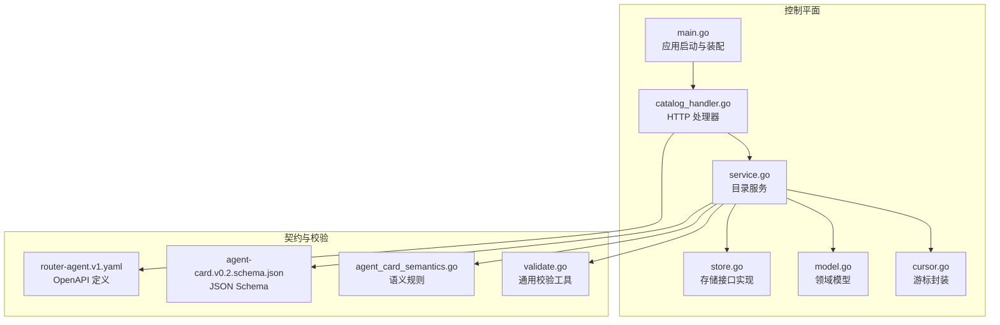
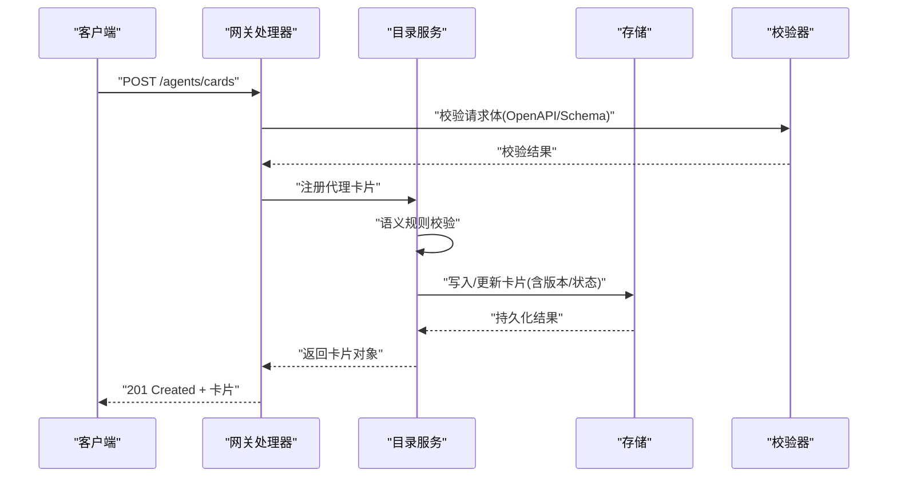
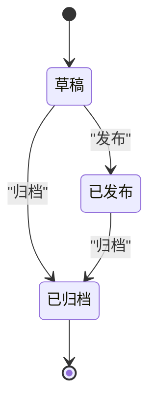
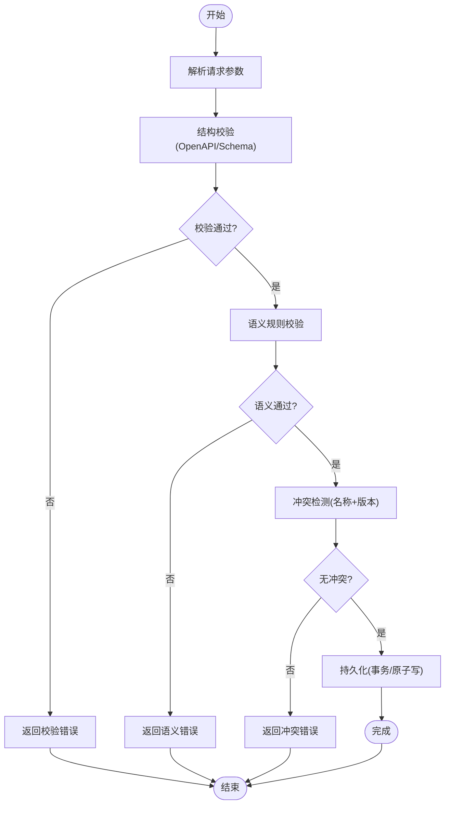
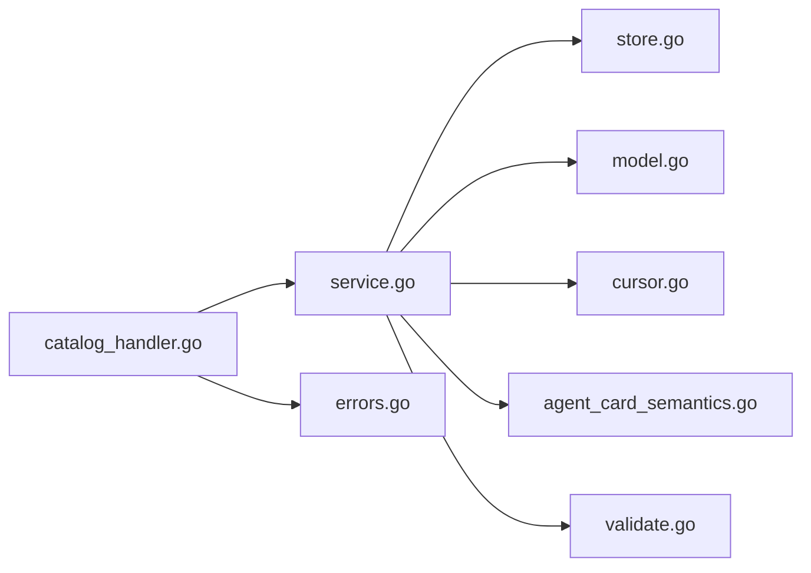

# 核心服务逻辑

<cite>
**本文引用的文件**   
- [apps/control-plane/cmd/control-plane/main.go](file://apps/control-plane/cmd/control-plane/main.go)
- [apps/control-plane/internal/catalog/service.go](file://apps/control-plane/internal/catalog/service.go)
- [apps/control-plane/internal/catalog/store.go](file://apps/control-plane/internal/catalog/store.go)
- [apps/control-plane/internal/catalog/model.go](file://apps/control-plane/internal/catalog/model.go)
- [apps/control-plane/internal/catalog/cursor.go](file://apps/control-plane/internal/catalog/cursor.go)
- [apps/control-plane/internal/gateway/catalog_handler.go](file://apps/control-plane/internal/gateway/catalog_handler.go)
- [apps/control-plane/internal/gateway/errors.go](file://apps/control-plane/internal/gateway/errors.go)
- [contracts/agent_card_semantics.go](file://contracts/agent_card_semantics.go)
- [contracts/validate.go](file://contracts/validate.go)
- [contracts/openapi/router-agent.v1.yaml](file://contracts/openapi/router-agent.v1.yaml)
- [contracts/schemas/agent-card.v0.2.schema.json](file://contracts/schemas/agent-card.v0.2.schema.json)
- [specs/002-catalog-registry-discovery/spec.md](file://specs/002-catalog-registry-discovery/spec.md)
- [specs/002-catalog-registry-discovery/data-model.md](file://specs/002-catalog-registry-discovery/data-model.md)
- [specs/002-catalog-registry-discovery/contracts/catalog-api.md](file://specs/002-catalog-registry-discovery/contracts/catalog-api.md)
</cite>

## 目录
1. [简介](#简介)
2. [项目结构](#项目结构)
3. [核心组件](#核心组件)
4. [架构总览](#架构总览)
5. [详细组件分析](#详细组件分析)
6. [依赖分析](#依赖分析)
7. [性能考虑](#性能考虑)
8. [故障排查指南](#故障排查指南)
9. [结论](#结论)
10. [附录](#附录)

## 简介
本文件聚焦“目录服务”的核心业务逻辑，围绕代理注册、发现与管理展开，重点说明：
- 代理卡片（Agent Card）的生命周期管理、版本控制与状态跟踪
- 服务接口定义、业务规则验证与数据转换流程
- 代理元数据处理、冲突解决策略与一致性保证
- 并发安全与性能优化策略
- 典型调用示例与错误处理路径

该服务位于控制平面中，提供对代理卡片的增删改查、分页游标查询以及基于语义规则的校验能力。

## 项目结构
目录服务相关代码主要分布在以下模块：
- 入口与装配：控制平面主程序负责初始化并挂载网关路由
- 网关层：HTTP 处理器将请求转换为领域服务调用
- 领域服务层：实现注册、发现、管理等核心算法与业务规则
- 存储层：持久化代理卡片及游标信息
- 契约与校验：OpenAPI 定义、JSON Schema 与语义规则校验

图表来源
- [apps/control-plane/cmd/control-plane/main.go](file://apps/control-plane/cmd/control-plane/main.go)
- [apps/control-plane/internal/gateway/catalog_handler.go](file://apps/control-plane/internal/gateway/catalog_handler.go)
- [apps/control-plane/internal/catalog/service.go](file://apps/control-plane/internal/catalog/service.go)
- [apps/control-plane/internal/catalog/store.go](file://apps/control-plane/internal/catalog/store.go)
- [apps/control-plane/internal/catalog/model.go](file://apps/control-plane/internal/catalog/model.go)
- [apps/control-plane/internal/catalog/cursor.go](file://apps/control-plane/internal/catalog/cursor.go)
- [contracts/openapi/router-agent.v1.yaml](file://contracts/openapi/router-agent.v1.yaml)
- [contracts/schemas/agent-card.v0.2.schema.json](file://contracts/schemas/agent-card.v0.2.schema.json)
- [contracts/agent_card_semantics.go](file://contracts/agent_card_semantics.go)
- [contracts/validate.go](file://contracts/validate.go)

章节来源
- [apps/control-plane/cmd/control-plane/main.go](file://apps/control-plane/cmd/control-plane/main.go)
- [apps/control-plane/internal/gateway/catalog_handler.go](file://apps/control-plane/internal/gateway/catalog_handler.go)
- [apps/control-plane/internal/catalog/service.go](file://apps/control-plane/internal/catalog/service.go)
- [apps/control-plane/internal/catalog/store.go](file://apps/control-plane/internal/catalog/store.go)
- [apps/control-plane/internal/catalog/model.go](file://apps/control-plane/internal/catalog/model.go)
- [apps/control-plane/internal/catalog/cursor.go](file://apps/control-plane/internal/catalog/cursor.go)
- [contracts/openapi/router-agent.v1.yaml](file://contracts/openapi/router-agent.v1.yaml)
- [contracts/schemas/agent-card.v0.2.schema.json](file://contracts/schemas/agent-card.v0.2.schema.json)
- [contracts/agent_card_semantics.go](file://contracts/agent_card_semantics.go)
- [contracts/validate.go](file://contracts/validate.go)

## 核心组件
- 目录服务（Catalog Service）
  - 职责：代理卡片的注册、更新、删除、查询；游标分页；版本与状态管理；语义规则校验；冲突检测与解决。
- 存储（Store）
  - 职责：持久化代理卡片、游标记录；提供事务或原子操作以保证一致性。
- 领域模型（Model）
  - 职责：定义代理卡片、版本、状态等数据结构与不变式。
- 游标（Cursor）
  - 职责：封装分页游标生成与解析，支持高效翻页。
- 网关处理器（Gateway Handler）
  - 职责：解析 HTTP 请求、参数校验、调用服务层、返回响应与错误。
- 契约与校验（Contracts & Validation）
  - 职责：OpenAPI 契约、JSON Schema 校验、语义规则校验。

章节来源
- [apps/control-plane/internal/catalog/service.go](file://apps/control-plane/internal/catalog/service.go)
- [apps/control-plane/internal/catalog/store.go](file://apps/control-plane/internal/catalog/store.go)
- [apps/control-plane/internal/catalog/model.go](file://apps/control-plane/internal/catalog/model.go)
- [apps/control-plane/internal/catalog/cursor.go](file://apps/control-plane/internal/catalog/cursor.go)
- [apps/control-plane/internal/gateway/catalog_handler.go](file://apps/control-plane/internal/gateway/catalog_handler.go)
- [contracts/agent_card_semantics.go](file://contracts/agent_card_semantics.go)
- [contracts/validate.go](file://contracts/validate.go)

## 架构总览
目录服务采用分层架构：网关层接收外部请求，服务层实现核心业务逻辑，存储层负责数据持久化。契约与校验贯穿各层，确保接口一致性与数据正确性。

图表来源
- [apps/control-plane/internal/gateway/catalog_handler.go](file://apps/control-plane/internal/gateway/catalog_handler.go)
- [apps/control-plane/internal/catalog/service.go](file://apps/control-plane/internal/catalog/service.go)
- [apps/control-plane/internal/catalog/store.go](file://apps/control-plane/internal/catalog/store.go)
- [contracts/agent_card_semantics.go](file://contracts/agent_card_semantics.go)
- [contracts/validate.go](file://contracts/validate.go)

## 详细组件分析

### 代理卡片生命周期管理
- 状态机
  - 草稿（Draft）：新创建或未发布
  - 已发布（Published）：对外可见并可被路由
  - 已归档（Archived）：不再参与路由但仍保留历史
- 状态转换规则
  - 草稿 → 已发布：通过发布接口触发，需满足语义规则与版本约束
  - 已发布 → 已归档：通过归档接口触发，禁止回退至草稿
  - 草稿 → 已归档：允许直接归档
- 版本控制
  - 每次变更递增版本号，保持历史可追溯
  - 发布时锁定当前版本为“活跃版本”，后续变更产生新版本
- 一致性保证
  - 使用存储层的事务或原子写操作，确保状态与版本同步更新
  - 冲突检测：基于唯一键（如名称+版本）进行乐观锁或幂等键控制

章节来源
- [apps/control-plane/internal/catalog/service.go](file://apps/control-plane/internal/catalog/service.go)
- [apps/control-plane/internal/catalog/model.go](file://apps/control-plane/internal/catalog/model.go)
- [apps/control-plane/internal/catalog/store.go](file://apps/control-plane/internal/catalog/store.go)

### 代理注册与发现算法
- 注册流程
  - 输入：代理卡片（包含元数据、端点、权限、版本等）
  - 校验：OpenAPI/Schema 结构校验 + 语义规则校验
  - 冲突检测：同名同版本冲突则拒绝或按策略合并
  - 持久化：写入存储并返回成功响应
- 发现流程
  - 条件过滤：按名称、标签、版本范围、状态筛选
  - 排序与分页：按更新时间或优先级排序，使用游标分页
  - 结果投影：仅返回必要字段，减少网络开销

图表来源
- [apps/control-plane/internal/gateway/catalog_handler.go](file://apps/control-plane/internal/gateway/catalog_handler.go)
- [apps/control-plane/internal/catalog/service.go](file://apps/control-plane/internal/catalog/service.go)
- [apps/control-plane/internal/catalog/store.go](file://apps/control-plane/internal/catalog/store.go)
- [contracts/agent_card_semantics.go](file://contracts/agent_card_semantics.go)
- [contracts/validate.go](file://contracts/validate.go)

章节来源
- [apps/control-plane/internal/catalog/service.go](file://apps/control-plane/internal/catalog/service.go)
- [apps/control-plane/internal/catalog/store.go](file://apps/control-plane/internal/catalog/store.go)
- [contracts/agent_card_semantics.go](file://contracts/agent_card_semantics.go)
- [contracts/validate.go](file://contracts/validate.go)

### 元数据处理与数据转换
- 元数据来源
  - 来自代理卡片的结构化字段（名称、描述、版本、端点、权限等）
  - 附加标签与扩展字段用于筛选与展示
- 转换逻辑
  - 入站：HTTP 请求体 → 领域模型（严格类型映射与必填校验）
  - 出站：领域模型 → API 响应（字段裁剪与格式化）
- 兼容性
  - 遵循 JSON Schema 与 OpenAPI 契约，确保跨版本兼容
  - 语义规则保证字段间关系与业务约束

章节来源
- [apps/control-plane/internal/catalog/model.go](file://apps/control-plane/internal/catalog/model.go)
- [contracts/schemas/agent-card.v0.2.schema.json](file://contracts/schemas/agent-card.v0.2.schema.json)
- [contracts/openapi/router-agent.v1.yaml](file://contracts/openapi/router-agent.v1.yaml)
- [contracts/agent_card_semantics.go](file://contracts/agent_card_semantics.go)

### 游标分页与一致性
- 游标设计
  - 基于时间戳或自增 ID 的不可变标记，避免偏移量分页的性能问题
  - 支持正向与反向遍历，便于列表滚动加载
- 一致性
  - 游标与快照读取在同一事务内，保证读一致性
  - 分页结果稳定，不受并发写入影响

章节来源
- [apps/control-plane/internal/catalog/cursor.go](file://apps/control-plane/internal/catalog/cursor.go)
- [apps/control-plane/internal/catalog/store.go](file://apps/control-plane/internal/catalog/store.go)

### 服务接口定义与调用示例
- 接口概览
  - 注册代理卡片：POST /agents/cards
  - 获取代理卡片：GET /agents/cards/{id}
  - 更新代理卡片：PUT /agents/cards/{id}
  - 删除代理卡片：DELETE /agents/cards/{id}
  - 列出代理卡片：GET /agents/cards?cursor=&limit=
- 调用示例（以注册为例）
  - 请求头：Content-Type: application/json
  - 请求体：符合 agent-card v0.2 schema 的 JSON
  - 成功响应：201 Created，返回卡片对象
  - 失败响应：400/409/500，携带平台错误结构
- 错误处理
  - 校验错误：返回具体字段级错误信息
  - 冲突错误：提示名称+版本冲突，建议增量更新
  - 系统错误：返回统一错误码与追踪 ID

章节来源
- [apps/control-plane/internal/gateway/catalog_handler.go](file://apps/control-plane/internal/gateway/catalog_handler.go)
- [contracts/openapi/router-agent.v1.yaml](file://contracts/openapi/router-agent.v1.yaml)
- [contracts/schemas/agent-card.v0.2.schema.json](file://contracts/schemas/agent-card.v0.2.schema.json)
- [apps/control-plane/internal/gateway/errors.go](file://apps/control-plane/internal/gateway/errors.go)

## 依赖分析
- 内部依赖
  - 网关处理器依赖目录服务与校验器
  - 目录服务依赖存储、模型与游标
- 外部依赖
  - OpenAPI 与 JSON Schema 作为契约驱动
  - 数据库迁移脚本与连接池配置（由上层装配）

图表来源
- [apps/control-plane/internal/gateway/catalog_handler.go](file://apps/control-plane/internal/gateway/catalog_handler.go)
- [apps/control-plane/internal/catalog/service.go](file://apps/control-plane/internal/catalog/service.go)
- [apps/control-plane/internal/catalog/store.go](file://apps/control-plane/internal/catalog/store.go)
- [apps/control-plane/internal/catalog/model.go](file://apps/control-plane/internal/catalog/model.go)
- [apps/control-plane/internal/catalog/cursor.go](file://apps/control-plane/internal/catalog/cursor.go)
- [apps/control-plane/internal/gateway/errors.go](file://apps/control-plane/internal/gateway/errors.go)
- [contracts/agent_card_semantics.go](file://contracts/agent_card_semantics.go)
- [contracts/validate.go](file://contracts/validate.go)

章节来源
- [apps/control-plane/internal/gateway/catalog_handler.go](file://apps/control-plane/internal/gateway/catalog_handler.go)
- [apps/control-plane/internal/catalog/service.go](file://apps/control-plane/internal/catalog/service.go)
- [apps/control-plane/internal/catalog/store.go](file://apps/control-plane/internal/catalog/store.go)
- [apps/control-plane/internal/catalog/model.go](file://apps/control-plane/internal/catalog/model.go)
- [apps/control-plane/internal/catalog/cursor.go](file://apps/control-plane/internal/catalog/cursor.go)
- [apps/control-plane/internal/gateway/errors.go](file://apps/control-plane/internal/gateway/errors.go)
- [contracts/agent_card_semantics.go](file://contracts/agent_card_semantics.go)
- [contracts/validate.go](file://contracts/validate.go)

## 性能考虑
- 索引与查询优化
  - 针对常用筛选字段建立复合索引（名称、状态、更新时间）
  - 游标分页替代 OFFSET，降低深翻页成本
- 缓存策略
  - 热点卡片只读缓存（TTL 与失效策略）
  - 发布事件驱动缓存刷新
- 批量操作
  - 批量注册/更新时使用事务批处理，减少往返
- 并发安全
  - 读写分离：读路径使用快照隔离
  - 写路径使用乐观锁或行级锁，避免死锁
- 资源限制
  - 请求体大小限制与超时控制
  - 限流与熔断保护后端存储

[本节为通用指导，不直接分析具体文件]

## 故障排查指南
- 常见错误
  - 校验失败：检查请求体是否符合 OpenAPI/Schema
  - 语义错误：核对字段关系与业务约束
  - 冲突错误：确认名称+版本是否唯一
  - 系统错误：查看错误码与追踪 ID，定位存储或上游依赖
- 诊断步骤
  - 启用请求日志与链路追踪
  - 检查数据库事务日志与锁等待
  - 对比期望与实际的卡片版本与状态
- 恢复策略
  - 重试幂等请求（带幂等键）
  - 回滚到上一个稳定版本
  - 清理无效游标与过期缓存

章节来源
- [apps/control-plane/internal/gateway/errors.go](file://apps/control-plane/internal/gateway/errors.go)
- [apps/control-plane/internal/catalog/service.go](file://apps/control-plane/internal/catalog/service.go)
- [apps/control-plane/internal/catalog/store.go](file://apps/control-plane/internal/catalog/store.go)

## 结论
目录服务通过清晰的分层与契约驱动，实现了代理卡片的可靠注册、发现与管理。其核心优势在于：
- 明确的生命周期与版本控制，保障可追溯与可回滚
- 严格的校验与语义规则，提升数据质量
- 游标分页与一致性读取，兼顾性能与稳定性
- 完善的错误处理与诊断能力，便于运维排障

建议在后续迭代中持续完善监控指标、灰度发布与自动化回归测试，进一步提升系统的可用性与可维护性。

## 附录
- 规范参考
  - 目录注册与发现规范：specs/002-catalog-registry-discovery/spec.md
  - 数据模型定义：specs/002-catalog-registry-discovery/data-model.md
  - 目录 API 契约：specs/002-catalog-registry-discovery/contracts/catalog-api.md

章节来源
- [specs/002-catalog-registry-discovery/spec.md](file://specs/002-catalog-registry-discovery/spec.md)
- [specs/002-catalog-registry-discovery/data-model.md](file://specs/002-catalog-registry-discovery/data-model.md)
- [specs/002-catalog-registry-discovery/contracts/catalog-api.md](file://specs/002-catalog-registry-discovery/contracts/catalog-api.md)