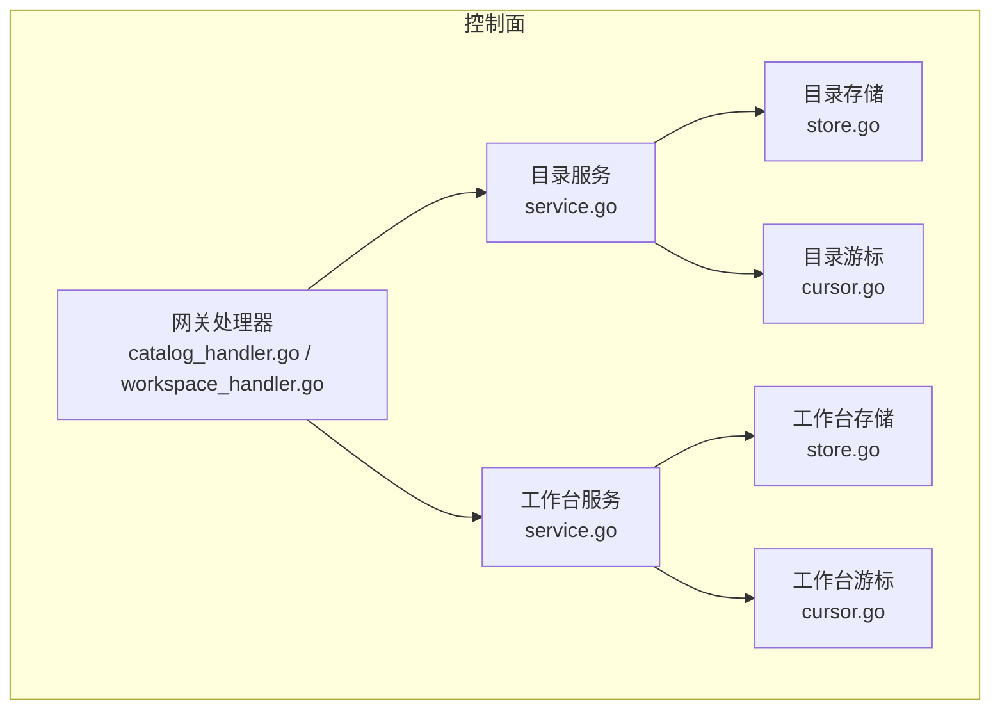
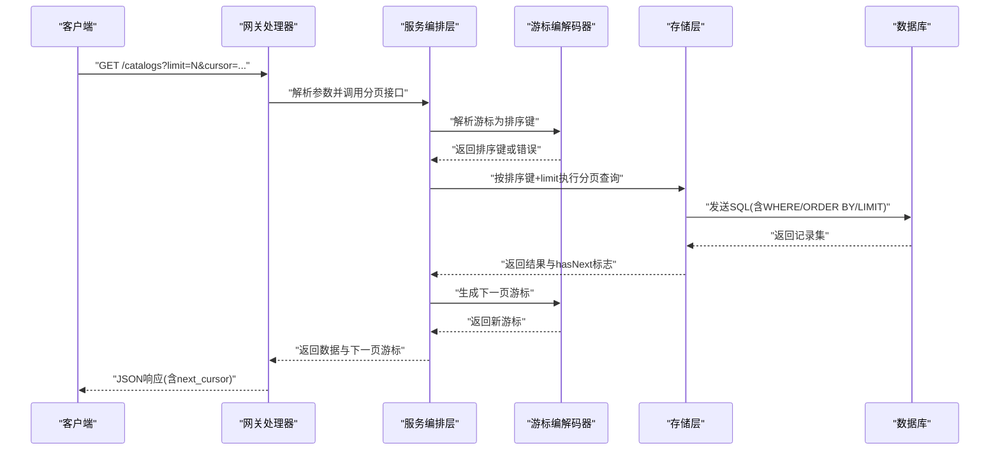
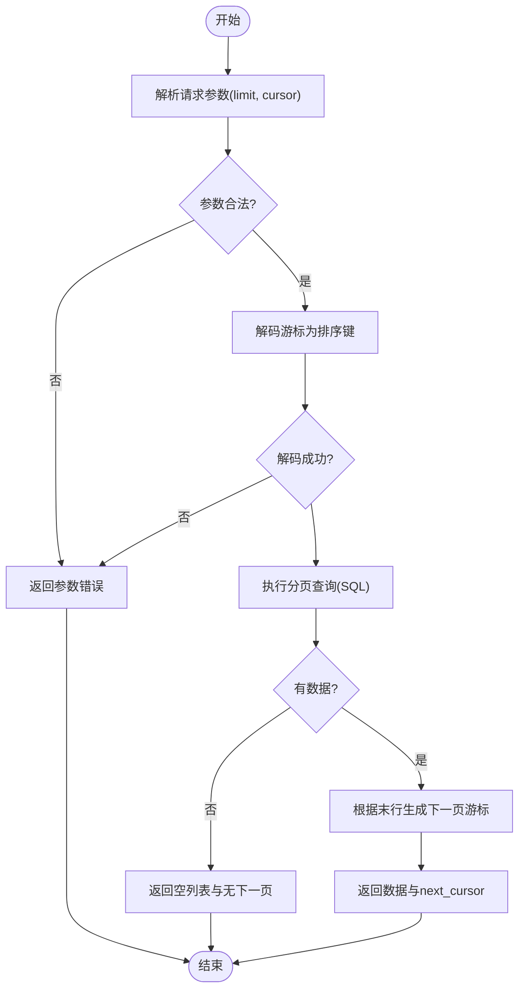
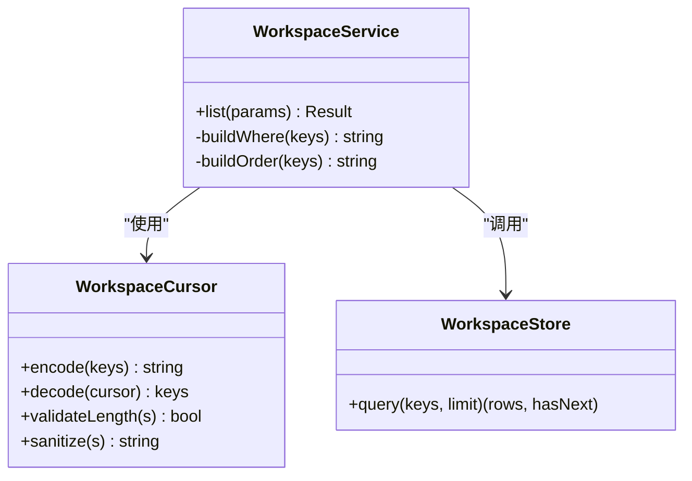
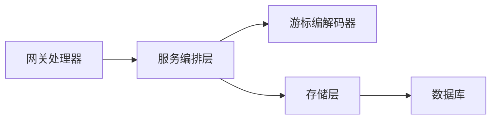

# 游标分页机制

<cite>
**本文引用的文件**   
- [apps/control-plane/internal/catalog/cursor.go](file://apps/control-plane/internal/catalog/cursor.go)
- [apps/control-plane/internal/catalog/cursor_test.go](file://apps/control-plane/internal/catalog/cursor_test.go)
- [apps/control-plane/internal/catalog/service.go](file://apps/control-plane/internal/catalog/service.go)
- [apps/control-plane/internal/catalog/store.go](file://apps/control-plane/internal/catalog/store.go)
- [apps/control-plane/internal/workspace/cursor.go](file://apps/control-plane/internal/workspace/cursor.go)
- [apps/control-plane/internal/workspace/cursor_test.go](file://apps/control-plane/internal/workspace/cursor_test.go)
- [apps/control-plane/internal/workspace/service.go](file://apps/control-plane/internal/workspace/service.go)
- [apps/control-plane/internal/workspace/store.go](file://apps/control-plane/internal/workspace/store.go)
- [apps/control-plane/internal/gateway/catalog_handler.go](file://apps/control-plane/internal/gateway/catalog_handler.go)
- [apps/control-plane/internal/gateway/workspace_handler.go](file://apps/control-plane/internal/gateway/workspace_handler.go)
- [contracts/openapi/control-plane.v2.yaml](file://contracts/openapi/control-plane.v2.yaml)
</cite>

## 目录
1. [简介](#简介)
2. [项目结构](#项目结构)
3. [核心组件](#核心组件)
4. [架构总览](#架构总览)
5. [详细组件分析](#详细组件分析)
6. [依赖关系分析](#依赖关系分析)
7. [性能考虑](#性能考虑)
8. [故障排查指南](#故障排查指南)
9. [结论](#结论)
10. [附录](#附录)

## 简介
本文件面向目录服务（Catalog）与工作台（Workspace）的游标分页机制，系统性阐述其实现原理、序列化/反序列化流程、查询优化策略、有效期与安全控制、API 使用示例、兼容性规范与版本升级策略，并给出性能基准与调优建议。文档旨在帮助开发者快速理解并正确集成游标分页能力，同时为运维与测试提供可操作的排障指引。

## 项目结构
本项目在控制面中为两个领域模块分别实现了游标分页：
- 目录服务（catalog）：负责 Agent Card 等资源的发现与检索
- 工作台（workspace）：管理工作台资源列表与分页

每个模块均包含：
- cursor.go：游标生成与解析的核心逻辑
- service.go：业务编排层，组合 store 与 cursor
- store.go：数据访问层，基于数据库执行带游标的查询
- cursor_test.go：针对游标编解码与边界条件的单元测试

图表来源
- [apps/control-plane/internal/gateway/catalog_handler.go](file://apps/control-plane/internal/gateway/catalog_handler.go)
- [apps/control-plane/internal/gateway/workspace_handler.go](file://apps/control-plane/internal/gateway/workspace_handler.go)
- [apps/control-plane/internal/catalog/service.go](file://apps/control-plane/internal/catalog/service.go)
- [apps/control-plane/internal/workspace/service.go](file://apps/control-plane/internal/workspace/service.go)
- [apps/control-plane/internal/catalog/store.go](file://apps/control-plane/internal/catalog/store.go)
- [apps/control-plane/internal/workspace/store.go](file://apps/control-plane/internal/workspace/store.go)
- [apps/control-plane/internal/catalog/cursor.go](file://apps/control-plane/internal/catalog/cursor.go)
- [apps/control-plane/internal/workspace/cursor.go](file://apps/control-plane/internal/workspace/cursor.go)

章节来源
- [apps/control-plane/internal/catalog/cursor.go](file://apps/control-plane/internal/catalog/cursor.go)
- [apps/control-plane/internal/catalog/service.go](file://apps/control-plane/internal/catalog/service.go)
- [apps/control-plane/internal/catalog/store.go](file://apps/control-plane/internal/catalog/store.go)
- [apps/control-plane/internal/workspace/cursor.go](file://apps/control-plane/internal/workspace/cursor.go)
- [apps/control-plane/internal/workspace/service.go](file://apps/control-plane/internal/workspace/service.go)
- [apps/control-plane/internal/workspace/store.go](file://apps/control-plane/internal/workspace/store.go)
- [apps/control-plane/internal/gateway/catalog_handler.go](file://apps/control-plane/internal/gateway/catalog_handler.go)
- [apps/control-plane/internal/gateway/workspace_handler.go](file://apps/control-plane/internal/gateway/workspace_handler.go)

## 核心组件
- 游标编解码器（Cursor Encoder/Decoder）
  - 职责：将排序键集合序列化为稳定字符串；从字符串解析回排序键
  - 关键特性：确定性编码、长度限制、非法输入校验、版本兼容字段预留
- 服务编排层（Service）
  - 职责：接收请求参数，解析游标，调用存储层执行分页查询，组装下一页游标
- 存储层（Store）
  - 职责：根据解析后的排序键与 limit 构建 SQL，返回结果集与是否还有下一页标记
- 网关处理器（Handler）
  - 职责：HTTP 入参校验、调用 Service、返回响应体与分页元信息

章节来源
- [apps/control-plane/internal/catalog/cursor.go](file://apps/control-plane/internal/catalog/cursor.go)
- [apps/control-plane/internal/catalog/service.go](file://apps/control-plane/internal/catalog/service.go)
- [apps/control-plane/internal/catalog/store.go](file://apps/control-plane/internal/catalog/store.go)
- [apps/control-plane/internal/workspace/cursor.go](file://apps/control-plane/internal/workspace/cursor.go)
- [apps/control-plane/internal/workspace/service.go](file://apps/control-plane/internal/workspace/service.go)
- [apps/control-plane/internal/workspace/store.go](file://apps/control-plane/internal/workspace/store.go)
- [apps/control-plane/internal/gateway/catalog_handler.go](file://apps/control-plane/internal/gateway/catalog_handler.go)
- [apps/control-plane/internal/gateway/workspace_handler.go](file://apps/control-plane/internal/gateway/workspace_handler.go)

## 架构总览
下图展示了从 HTTP 请求到数据库查询再到响应返回的完整调用链，以及游标在各层的流转。

图表来源
- [apps/control-plane/internal/gateway/catalog_handler.go](file://apps/control-plane/internal/gateway/catalog_handler.go)
- [apps/control-plane/internal/gateway/workspace_handler.go](file://apps/control-plane/internal/gateway/workspace_handler.go)
- [apps/control-plane/internal/catalog/service.go](file://apps/control-plane/internal/catalog/service.go)
- [apps/control-plane/internal/workspace/service.go](file://apps/control-plane/internal/workspace/service.go)
- [apps/control-plane/internal/catalog/cursor.go](file://apps/control-plane/internal/catalog/cursor.go)
- [apps/control-plane/internal/workspace/cursor.go](file://apps/control-plane/internal/workspace/cursor.go)
- [apps/control-plane/internal/catalog/store.go](file://apps/control-plane/internal/catalog/store.go)
- [apps/control-plane/internal/workspace/store.go](file://apps/control-plane/internal/workspace/store.go)

## 详细组件分析

### 目录服务游标（Catalog Cursor）
- 排序键设计
  - 通常由“创建时间 + 唯一ID”构成，确保全序且稳定
  - 若存在并列键，需引入次级键以保证严格单调性
- 序列化/反序列化
  - 编码器将多值排序键拼接为固定格式字符串，并进行长度截断与转义
  - 解码器对输入进行格式校验、类型转换与范围检查
- 服务编排
  - 解析游标后，构造 WHERE 条件与 ORDER BY，结合 LIMIT 获取一页数据
  - 根据本页最后一条记录的排序键生成下一页游标
- 存储层
  - 使用覆盖索引或复合索引以加速排序与过滤
  - 避免 SELECT *，仅选择必要字段以降低网络与内存开销

图表来源
- [apps/control-plane/internal/catalog/service.go](file://apps/control-plane/internal/catalog/service.go)
- [apps/control-plane/internal/catalog/cursor.go](file://apps/control-plane/internal/catalog/cursor.go)
- [apps/control-plane/internal/catalog/store.go](file://apps/control-plane/internal/catalog/store.go)

章节来源
- [apps/control-plane/internal/catalog/cursor.go](file://apps/control-plane/internal/catalog/cursor.go)
- [apps/control-plane/internal/catalog/service.go](file://apps/control-plane/internal/catalog/service.go)
- [apps/control-plane/internal/catalog/store.go](file://apps/control-plane/internal/catalog/store.go)
- [apps/control-plane/internal/catalog/cursor_test.go](file://apps/control-plane/internal/catalog/cursor_test.go)

### 工作台游标（Workspace Cursor）
- 排序键设计
  - 采用“更新时间 + 唯一ID”的组合，保证变更可见性与稳定性
- 序列化/反序列化
  - 与目录服务保持一致的编码约定，便于统一校验与扩展
- 服务编排与存储
  - 同目录服务模式，但排序键语义不同，注意索引设计与更新频率对性能的影响

图表来源
- [apps/control-plane/internal/workspace/cursor.go](file://apps/control-plane/internal/workspace/cursor.go)
- [apps/control-plane/internal/workspace/service.go](file://apps/control-plane/internal/workspace/service.go)
- [apps/control-plane/internal/workspace/store.go](file://apps/control-plane/internal/workspace/store.go)

章节来源
- [apps/control-plane/internal/workspace/cursor.go](file://apps/control-plane/internal/workspace/cursor.go)
- [apps/control-plane/internal/workspace/service.go](file://apps/control-plane/internal/workspace/service.go)
- [apps/control-plane/internal/workspace/store.go](file://apps/control-plane/internal/workspace/store.go)
- [apps/control-plane/internal/workspace/cursor_test.go](file://apps/control-plane/internal/workspace/cursor_test.go)

### API 使用示例与边界处理
- 基本分页
  - 首次请求不传 cursor，服务端返回 next_cursor
  - 后续请求携带 next_cursor 继续翻页
- 边界情况
  - limit 过大：服务端应限制最大页大小并返回错误提示
  - 游标过期或损坏：返回明确的参数错误码，客户端重试时清空游标重新拉取首屏
  - 数据并发写入：游标基于稳定排序键，不会重复或遗漏，但可能因插入导致“滑动窗口”现象
- 错误恢复
  - 网络失败：指数退避重试，保留上次游标
  - 服务端限流：遵循 Retry-After 头，降级为较小 limit

章节来源
- [apps/control-plane/internal/gateway/catalog_handler.go](file://apps/control-plane/internal/gateway/catalog_handler.go)
- [apps/control-plane/internal/gateway/workspace_handler.go](file://apps/control-plane/internal/gateway/workspace_handler.go)
- [contracts/openapi/control-plane.v2.yaml](file://contracts/openapi/control-plane.v2.yaml)

## 依赖关系分析
- 组件耦合
  - 网关处理器仅依赖服务编排层，不直接访问存储或游标，保持清晰分层
  - 服务编排层组合游标编解码器与存储层，职责单一
- 外部依赖
  - 数据库驱动与连接池配置影响游标分页吞吐
  - OpenAPI 契约定义了请求/响应结构与状态码，保障前后端一致性

图表来源
- [apps/control-plane/internal/gateway/catalog_handler.go](file://apps/control-plane/internal/gateway/catalog_handler.go)
- [apps/control-plane/internal/gateway/workspace_handler.go](file://apps/control-plane/internal/gateway/workspace_handler.go)
- [apps/control-plane/internal/catalog/service.go](file://apps/control-plane/internal/catalog/service.go)
- [apps/control-plane/internal/workspace/service.go](file://apps/control-plane/internal/workspace/service.go)
- [apps/control-plane/internal/catalog/cursor.go](file://apps/control-plane/internal/catalog/cursor.go)
- [apps/control-plane/internal/workspace/cursor.go](file://apps/control-plane/internal/workspace/cursor.go)
- [apps/control-plane/internal/catalog/store.go](file://apps/control-plane/internal/catalog/store.go)
- [apps/control-plane/internal/workspace/store.go](file://apps/control-plane/internal/workspace/store.go)

章节来源
- [apps/control-plane/internal/catalog/service.go](file://apps/control-plane/internal/catalog/service.go)
- [apps/control-plane/internal/workspace/service.go](file://apps/control-plane/internal/workspace/service.go)

## 性能考虑
- 索引设计
  - 为排序键建立复合索引，如 (created_at, id) 或 (updated_at, id)，确保 ORDER BY 与 WHERE 高效
  - 避免在排序列上使用函数或表达式，防止索引失效
- 查询优化
  - 使用覆盖索引减少回表
  - 限制返回字段，避免大对象字段参与排序
  - 合理设置 limit，默认值建议 20~50，上限不超过 200
- 内存使用控制
  - 流式读取数据库结果，避免一次性加载全部行
  - 游标字符串长度限制，防止恶意超长输入导致内存膨胀
- 缓存策略
  - 对热点只读列表可短期缓存上一页游标映射，但需注意数据一致性与失效策略
- 监控与观测
  - 记录分页查询耗时、游标解析失败率、下一页命中率等指标

[本节为通用性能指导，无需特定文件引用]

## 故障排查指南
- 常见问题
  - 游标解析失败：检查输入格式、长度限制与字符集
  - 分页错乱或重复：确认排序键是否具备严格单调性（含次级键）
  - 性能退化：检查慢查询日志与索引命中情况
- 定位步骤
  - 开启详细日志，打印解析后的排序键与生成的 SQL
  - 使用 EXPLAIN 分析执行计划，关注索引使用情况
  - 对比不同 limit 下的延迟与 CPU 占用
- 恢复措施
  - 客户端重置游标并重试
  - 临时降低 limit 缓解压力
  - 必要时重建索引或调整统计信息

章节来源
- [apps/control-plane/internal/catalog/cursor_test.go](file://apps/control-plane/internal/catalog/cursor_test.go)
- [apps/control-plane/internal/workspace/cursor_test.go](file://apps/control-plane/internal/workspace/cursor_test.go)

## 结论
本项目的游标分页机制通过稳定的排序键与统一的编解码约定，提供了高效、可扩展的分页能力。配合合理的索引设计与查询优化，可在高并发场景下保持稳定性能。建议在上线前完成兼容性测试与基准压测，并建立完善的监控与告警体系。

[本节为总结性内容，无需特定文件引用]

## 附录

### 游标格式规范与兼容性
- 格式约定
  - 多值排序键按固定顺序拼接，使用分隔符与转义规则保证可逆解析
  - 支持可选的版本字段，用于未来演进
- 兼容性要求
  - 向后兼容：新增字段必须可忽略
  - 向前兼容：旧客户端可继续使用旧版游标，服务端需能识别并降级处理
- 版本升级策略
  - 游标版本号随 API 版本同步
  - 废弃字段保留一段时间并提供迁移工具

章节来源
- [apps/control-plane/internal/catalog/cursor.go](file://apps/control-plane/internal/catalog/cursor.go)
- [apps/control-plane/internal/workspace/cursor.go](file://apps/control-plane/internal/workspace/cursor.go)
- [contracts/openapi/control-plane.v2.yaml](file://contracts/openapi/control-plane.v2.yaml)

### 有效期管理与安全
- 有效期管理
  - 游标本身不含时间戳，但可通过应用层策略限制其生命周期（例如 15 分钟）
  - 过期游标应返回明确错误，客户端自动重拉首屏
- 安全性与防重放
  - 对游标进行签名或附加随机盐，防止篡改与重放
  - 服务端校验游标来源与上下文（如租户、用户）
  - 限制游标长度与字符集，防止注入攻击

章节来源
- [apps/control-plane/internal/catalog/cursor.go](file://apps/control-plane/internal/catalog/cursor.go)
- [apps/control-plane/internal/workspace/cursor.go](file://apps/control-plane/internal/workspace/cursor.go)

### 性能基准与调优建议
- 基准方法
  - 在不同 limit 与数据集规模下测量 P95/P99 延迟与吞吐
  - 对比有无索引、不同排序键组合的性能差异
- 调优建议
  - 优先优化索引与 SQL，其次考虑缓存与连接池
  - 对热点接口实施限流与熔断，保护后端资源

[本节为通用指导，无需特定文件引用]