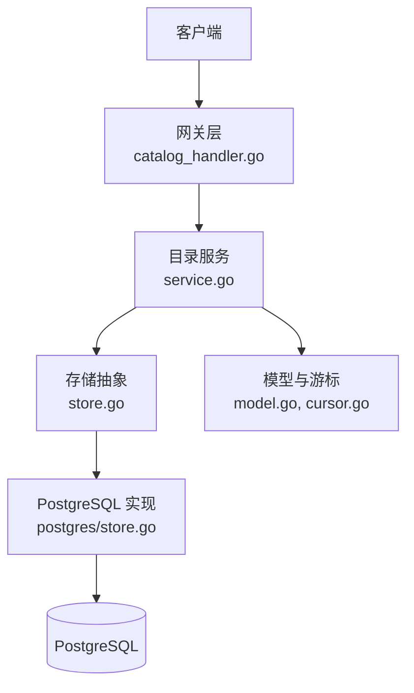
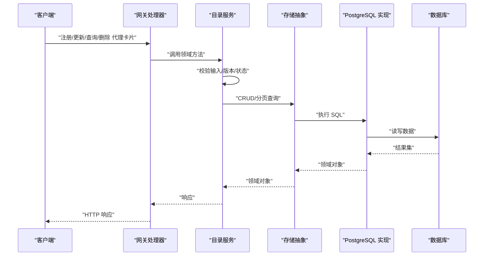
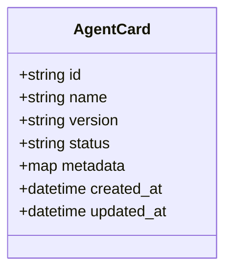
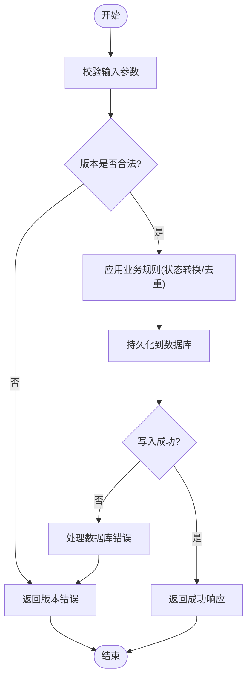
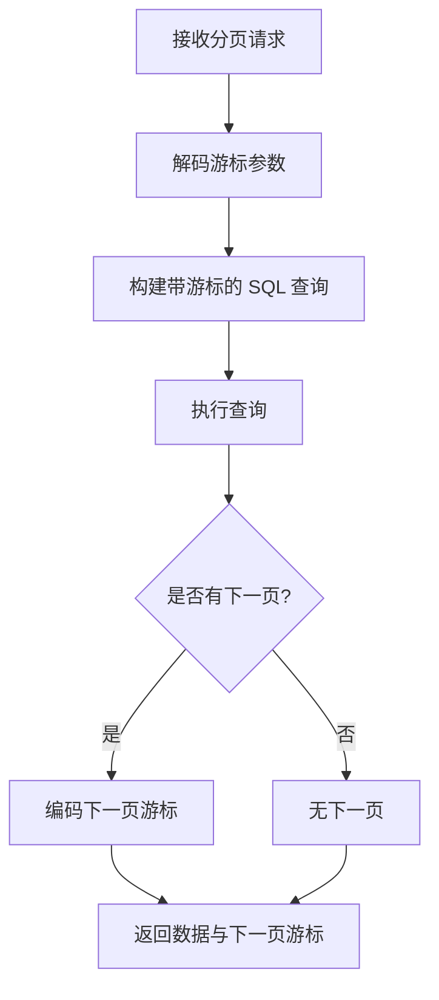
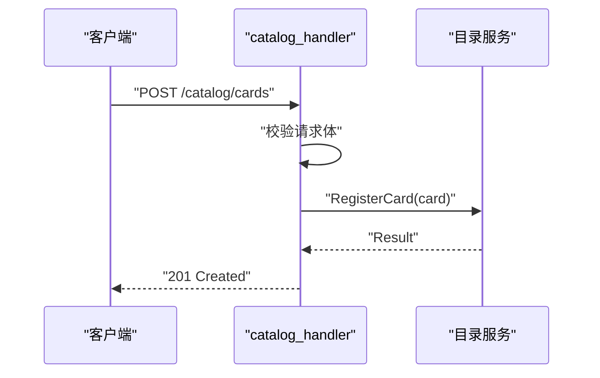
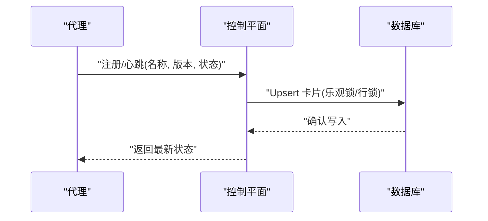
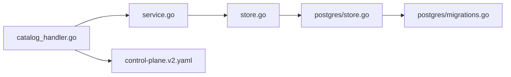

# 目录服务

<cite>
**本文引用的文件**   
- [apps/control-plane/cmd/control-plane/main.go](file://apps/control-plane/cmd/control-plane/main.go)
- [apps/control-plane/internal/catalog/service.go](file://apps/control-plane/internal/catalog/service.go)
- [apps/control-plane/internal/catalog/store.go](file://apps/control-plane/internal/catalog/store.go)
- [apps/control-plane/internal/catalog/postgres/store.go](file://apps/control-plane/internal/catalog/postgres/store.go)
- [apps/control-plane/internal/catalog/postgres/migrations.go](file://apps/control-plane/internal/catalog/postgres/migrations.go)
- [apps/control-plane/internal/catalog/model.go](file://apps/control-plane/internal/catalog/model.go)
- [apps/control-plane/internal/catalog/cursor.go](file://apps/control-plane/internal/catalog/cursor.go)
- [apps/control-plane/internal/gateway/catalog_handler.go](file://apps/control-plane/internal/gateway/catalog_handler.go)
- [contracts/openapi/control-plane.v2.yaml](file://contracts/openapi/control-plane.v2.yaml)
- [specs/002-catalog-registry-discovery/data-model.md](file://specs/002-catalog-registry-discovery/data-model.md)
- [specs/002-catalog-registry-discovery/contracts/catalog-api.md](file://specs/002-catalog-registry-discovery/contracts/catalog-api.md)
</cite>

## 目录
1. [简介](#简介)
2. [项目结构](#项目结构)
3. [核心组件](#核心组件)
4. [架构总览](#架构总览)
5. [详细组件分析](#详细组件分析)
6. [依赖分析](#依赖分析)
7. [性能考虑](#性能考虑)
8. [故障排查指南](#故障排查指南)
9. [结论](#结论)
10. [附录](#附录)

## 简介
本文件为 NeKiro 控制平面中的“目录服务”提供全面的组件设计文档。目录服务负责代理注册与发现、代理卡片（Agent Card）的持久化与版本管理、状态跟踪，以及基于游标的分页查询能力。存储层采用抽象接口与 PostgreSQL 具体实现分离的设计，便于扩展与测试。本文涵盖系统架构、数据流与时序图、CRUD 接口与业务规则、游标分页原理与优化策略，以及服务间通信协议和数据同步机制。

## 项目结构
目录服务位于 control-plane 应用内部，主要包含以下层次：
- 网关层：HTTP 路由与请求处理，将外部 API 调用转发至领域服务。
- 领域服务层：封装代理卡片的注册、更新、查询、删除等核心逻辑，维护版本与状态语义。
- 存储抽象层：定义统一的 Store 接口，屏蔽底层存储差异。
- 存储实现层：PostgreSQL 实现，包括迁移脚本与 SQL 操作。
- 模型与游标：领域模型定义与游标分页工具。

图表来源
- [apps/control-plane/internal/gateway/catalog_handler.go](file://apps/control-plane/internal/gateway/catalog_handler.go)
- [apps/control-plane/internal/catalog/service.go](file://apps/control-plane/internal/catalog/service.go)
- [apps/control-plane/internal/catalog/store.go](file://apps/control-plane/internal/catalog/store.go)
- [apps/control-plane/internal/catalog/postgres/store.go](file://apps/control-plane/internal/catalog/postgres/store.go)
- [apps/control-plane/internal/catalog/model.go](file://apps/control-plane/internal/catalog/model.go)
- [apps/control-plane/internal/catalog/cursor.go](file://apps/control-plane/internal/catalog/cursor.go)

章节来源
- [apps/control-plane/cmd/control-plane/main.go](file://apps/control-plane/cmd/control-plane/main.go)
- [apps/control-plane/internal/gateway/catalog_handler.go](file://apps/control-plane/internal/gateway/catalog_handler.go)
- [apps/control-plane/internal/catalog/service.go](file://apps/control-plane/internal/catalog/service.go)
- [apps/control-plane/internal/catalog/store.go](file://apps/control-plane/internal/catalog/store.go)
- [apps/control-plane/internal/catalog/postgres/store.go](file://apps/control-plane/internal/catalog/postgres/store.go)
- [apps/control-plane/internal/catalog/model.go](file://apps/control-plane/internal/catalog/model.go)
- [apps/control-plane/internal/catalog/cursor.go](file://apps/control-plane/internal/catalog/cursor.go)

## 核心组件
- 网关处理器：暴露 HTTP 接口，解析请求参数，校验输入，调用目录服务并返回响应。
- 目录服务：实现代理卡片的注册、更新、删除、查询、列表与游标分页；维护版本号与状态机；协调事务与一致性。
- 存储抽象：定义统一 CRUD 与分页接口，支持按名称、标签、版本等过滤。
- PostgreSQL 实现：使用迁移脚本初始化表结构，执行增删改查与游标分页查询。
- 模型与游标：定义 AgentCard 实体、版本字段、状态枚举；实现基于唯一键或时间戳的游标编码与解码。

章节来源
- [apps/control-plane/internal/gateway/catalog_handler.go](file://apps/control-plane/internal/gateway/catalog_handler.go)
- [apps/control-plane/internal/catalog/service.go](file://apps/control-plane/internal/catalog/service.go)
- [apps/control-plane/internal/catalog/store.go](file://apps/control-plane/internal/catalog/store.go)
- [apps/control-plane/internal/catalog/postgres/store.go](file://apps/control-plane/internal/catalog/postgres/store.go)
- [apps/control-plane/internal/catalog/model.go](file://apps/control-plane/internal/catalog/model.go)
- [apps/control-plane/internal/catalog/cursor.go](file://apps/control-plane/internal/catalog/cursor.go)

## 架构总览
目录服务遵循分层架构与依赖倒置原则：
- 网关层仅负责协议适配与参数校验，不持有业务逻辑。
- 领域服务编排业务规则，如版本冲突检测、状态转换合法性检查。
- 存储抽象隔离数据库细节，PostgreSQL 实现通过迁移确保 schema 演进。
- 游标分页在查询层完成，避免全表扫描与大偏移量带来的性能问题。

图表来源
- [apps/control-plane/internal/gateway/catalog_handler.go](file://apps/control-plane/internal/gateway/catalog_handler.go)
- [apps/control-plane/internal/catalog/service.go](file://apps/control-plane/internal/catalog/service.go)
- [apps/control-plane/internal/catalog/store.go](file://apps/control-plane/internal/catalog/store.go)
- [apps/control-plane/internal/catalog/postgres/store.go](file://apps/control-plane/internal/catalog/postgres/store.go)

## 详细组件分析

### 代理卡片模型与版本控制
- 模型字段：标识符、名称、版本、状态、元数据、创建/更新时间戳等。
- 版本控制：每次更新递增版本号，防止并发覆盖；支持按名称+版本精确查询。
- 状态跟踪：定义可用、不可用、下线等状态，状态转换需满足业务规则。

图表来源
- [apps/control-plane/internal/catalog/model.go](file://apps/control-plane/internal/catalog/model.go)

章节来源
- [apps/control-plane/internal/catalog/model.go](file://apps/control-plane/internal/catalog/model.go)
- [specs/002-catalog-registry-discovery/data-model.md](file://specs/002-catalog-registry-discovery/data-model.md)

### 存储抽象与 PostgreSQL 实现
- 存储抽象：定义 Create、Update、Delete、GetByNameVersion、ListWithCursor 等方法。
- PostgreSQL 实现：
  - 迁移脚本：初始化表结构与索引（名称、版本、状态）。
  - 查询优化：使用游标列（如 id 或 updated_at）进行高效分页，避免 OFFSET 大偏移。
  - 事务与锁：写操作使用行级锁或乐观锁保证一致性与幂等性。

图表来源
- [apps/control-plane/internal/catalog/store.go](file://apps/control-plane/internal/catalog/store.go)
- [apps/control-plane/internal/catalog/postgres/store.go](file://apps/control-plane/internal/catalog/postgres/store.go)
- [apps/control-plane/internal/catalog/postgres/migrations.go](file://apps/control-plane/internal/catalog/postgres/migrations.go)

章节来源
- [apps/control-plane/internal/catalog/store.go](file://apps/control-plane/internal/catalog/store.go)
- [apps/control-plane/internal/catalog/postgres/store.go](file://apps/control-plane/internal/catalog/postgres/store.go)
- [apps/control-plane/internal/catalog/postgres/migrations.go](file://apps/control-plane/internal/catalog/postgres/migrations.go)

### 游标分页查询实现与优化
- 游标列选择：优先使用单调递增的唯一键（如自增 id）或更新时间戳。
- 编码策略：将游标值与页大小编码为字符串，服务端解码后用于 WHERE 条件。
- 排序与稳定性：固定排序键（id ASC），避免不稳定排序导致重复或缺失记录。
- 性能优化：
  - 使用索引加速游标列与过滤条件。
  - 限制每页大小，避免过大结果集。
  - 避免 SELECT *，只选取必要字段。

图表来源
- [apps/control-plane/internal/catalog/cursor.go](file://apps/control-plane/internal/catalog/cursor.go)
- [apps/control-plane/internal/catalog/postgres/store.go](file://apps/control-plane/internal/catalog/postgres/store.go)

章节来源
- [apps/control-plane/internal/catalog/cursor.go](file://apps/control-plane/internal/catalog/cursor.go)
- [apps/control-plane/internal/catalog/postgres/store.go](file://apps/control-plane/internal/catalog/postgres/store.go)

### 网关层与 API 契约
- 路由映射：将 /catalog 相关路径映射到处理器方法。
- 请求校验：校验 JSON 结构、必填字段、版本格式、状态值。
- 错误处理：统一错误码与消息体，便于客户端重试与降级。
- OpenAPI 契约：定义接口规范、请求/响应结构、状态码。

图表来源
- [apps/control-plane/internal/gateway/catalog_handler.go](file://apps/control-plane/internal/gateway/catalog_handler.go)
- [contracts/openapi/control-plane.v2.yaml](file://contracts/openapi/control-plane.v2.yaml)

章节来源
- [apps/control-plane/internal/gateway/catalog_handler.go](file://apps/control-plane/internal/gateway/catalog_handler.go)
- [contracts/openapi/control-plane.v2.yaml](file://contracts/openapi/control-plane.v2.yaml)
- [specs/002-catalog-registry-discovery/contracts/catalog-api.md](file://specs/002-catalog-registry-discovery/contracts/catalog-api.md)

### 服务间通信协议与数据同步
- 通信协议：控制平面对外暴露 RESTful API，遵循 OpenAPI v2 契约。
- 数据同步：
  - 代理侧主动注册/心跳更新，携带最新版本号与状态。
  - 控制平面以最后一次有效写入为准，结合版本号实现幂等更新。
  - 可选事件驱动：通过消息队列广播变更，下游消费者拉取增量。

图表来源
- [apps/control-plane/internal/gateway/catalog_handler.go](file://apps/control-plane/internal/gateway/catalog_handler.go)
- [apps/control-plane/internal/catalog/postgres/store.go](file://apps/control-plane/internal/catalog/postgres/store.go)

章节来源
- [apps/control-plane/internal/gateway/catalog_handler.go](file://apps/control-plane/internal/gateway/catalog_handler.go)
- [apps/control-plane/internal/catalog/postgres/store.go](file://apps/control-plane/internal/catalog/postgres/store.go)

## 依赖分析
- 组件耦合：
  - 网关层依赖目录服务接口，不直接访问存储。
  - 目录服务依赖存储抽象，可替换不同实现。
  - PostgreSQL 实现依赖迁移脚本与连接池配置。
- 外部依赖：
  - OpenAPI 契约约束接口行为。
  - 数据库驱动与迁移工具。

图表来源
- [apps/control-plane/internal/gateway/catalog_handler.go](file://apps/control-plane/internal/gateway/catalog_handler.go)
- [apps/control-plane/internal/catalog/service.go](file://apps/control-plane/internal/catalog/service.go)
- [apps/control-plane/internal/catalog/store.go](file://apps/control-plane/internal/catalog/store.go)
- [apps/control-plane/internal/catalog/postgres/store.go](file://apps/control-plane/internal/catalog/postgres/store.go)
- [apps/control-plane/internal/catalog/postgres/migrations.go](file://apps/control-plane/internal/catalog/postgres/migrations.go)
- [contracts/openapi/control-plane.v2.yaml](file://contracts/openapi/control-plane.v2.yaml)

章节来源
- [apps/control-plane/internal/gateway/catalog_handler.go](file://apps/control-plane/internal/gateway/catalog_handler.go)
- [apps/control-plane/internal/catalog/service.go](file://apps/control-plane/internal/catalog/service.go)
- [apps/control-plane/internal/catalog/store.go](file://apps/control-plane/internal/catalog/store.go)
- [apps/control-plane/internal/catalog/postgres/store.go](file://apps/control-plane/internal/catalog/postgres/store.go)
- [apps/control-plane/internal/catalog/postgres/migrations.go](file://apps/control-plane/internal/catalog/postgres/migrations.go)
- [contracts/openapi/control-plane.v2.yaml](file://contracts/openapi/control-plane.v2.yaml)

## 性能考虑
- 游标分页：使用单调递增列作为游标，避免 OFFSET 导致的性能退化。
- 索引策略：对名称、版本、状态建立复合索引，提升过滤与排序效率。
- 连接池：合理设置最大连接数与空闲超时，避免资源耗尽。
- 批量操作：对于导入场景，使用批量插入减少往返开销。
- 缓存策略：热点卡片可在内存中缓存短生命周期副本，降低读放大。

## 故障排查指南
- 常见问题：
  - 版本冲突：客户端未携带最新版本号导致更新失败，应重试并获取最新状态。
  - 游标无效：客户端传递的游标过期或被截断，需重新从上一页末尾获取。
  - 数据库连接异常：检查连接池配置与网络连通性。
- 日志与追踪：
  - 关键路径打点：注册、更新、查询、删除均输出结构化日志。
  - 错误码分类：区分参数错误、业务规则错误、存储错误，便于客户端定位。

章节来源
- [apps/control-plane/internal/catalog/service.go](file://apps/control-plane/internal/catalog/service.go)
- [apps/control-plane/internal/catalog/postgres/store.go](file://apps/control-plane/internal/catalog/postgres/store.go)

## 结论
目录服务通过分层架构与存储抽象实现了高内聚、低耦合的代理注册与发现能力。版本控制与状态跟踪保障了数据一致性与可追溯性；游标分页提升了大规模数据的查询性能。OpenAPI 契约明确了服务边界，便于多语言客户端集成。建议在生产环境完善监控告警与容量规划，持续优化索引与连接池参数。

## 附录
- 数据模型参考：[specs/002-catalog-registry-discovery/data-model.md](file://specs/002-catalog-registry-discovery/data-model.md)
- API 契约参考：[specs/002-catalog-registry-discovery/contracts/catalog-api.md](file://specs/002-catalog-registry-discovery/contracts/catalog-api.md)
- OpenAPI 定义：[contracts/openapi/control-plane.v2.yaml](file://contracts/openapi/control-plane.v2.yaml)