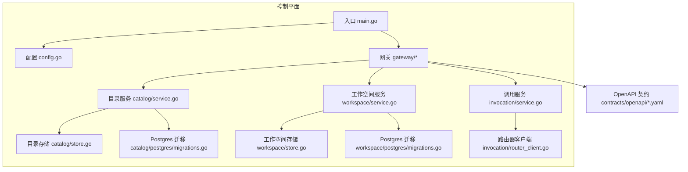
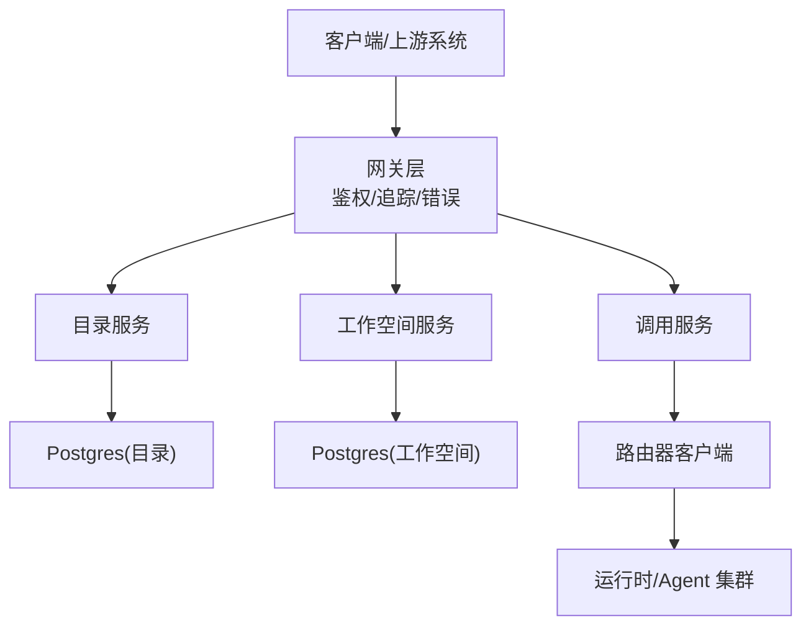
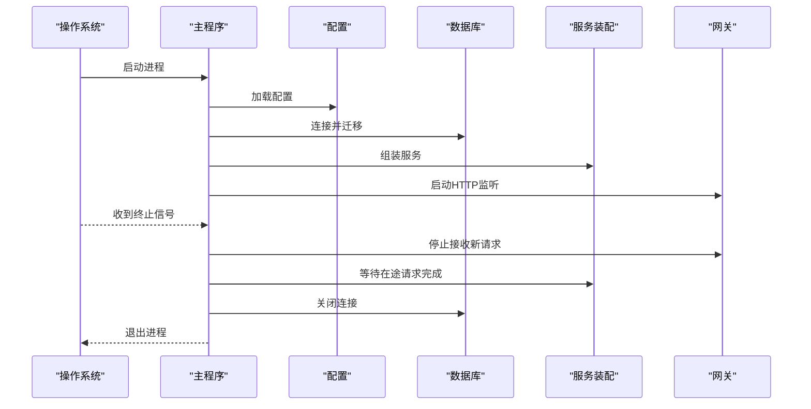
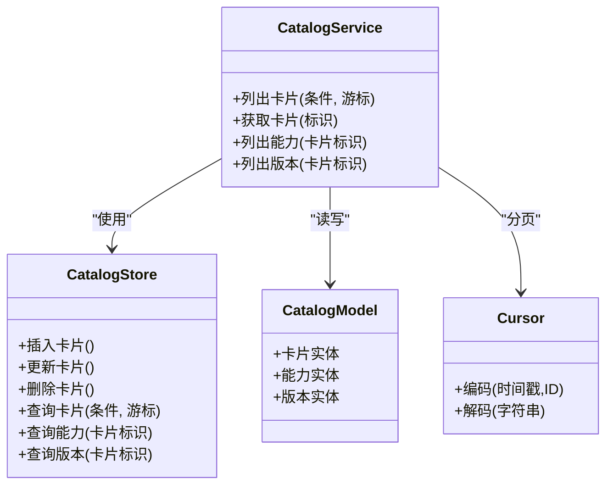
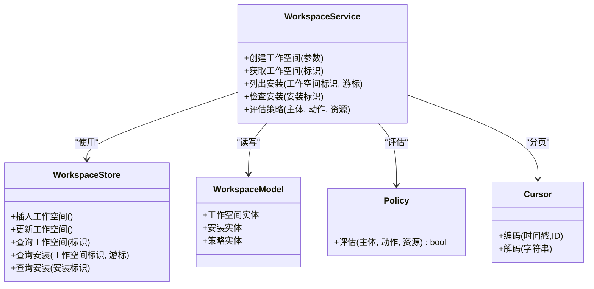
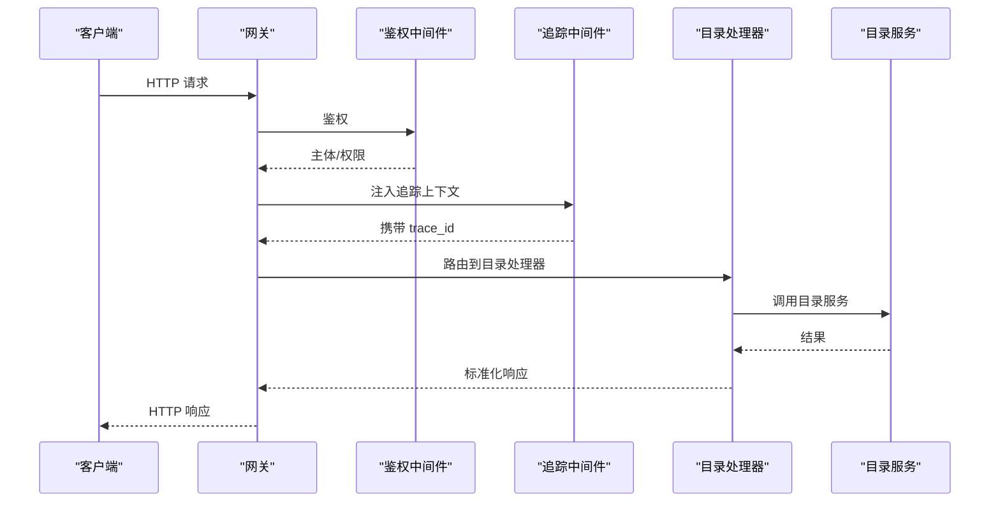
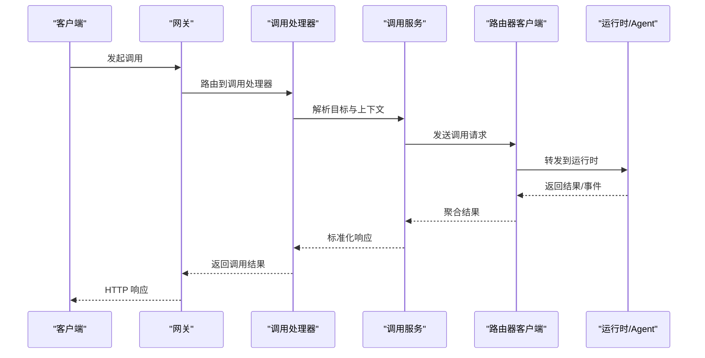
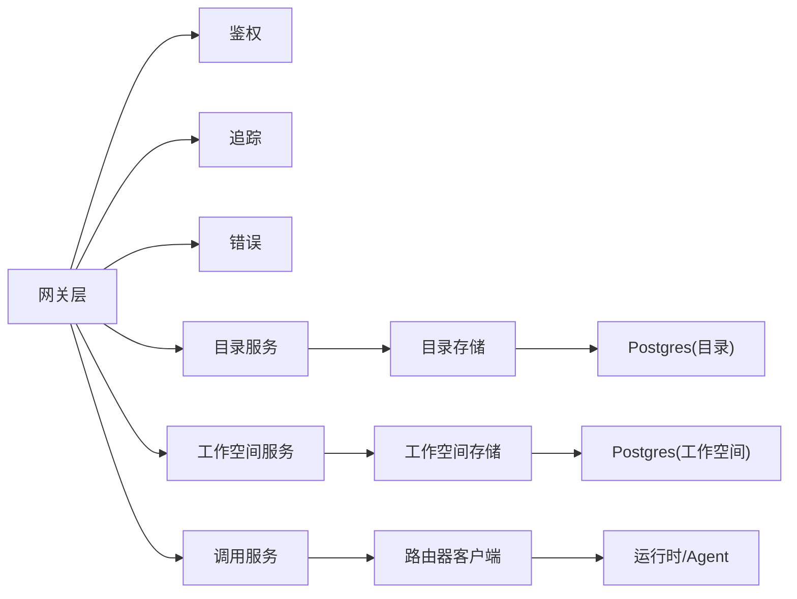

# 组件设计

<cite>
**本文引用的文件**   
- [main.go](file://apps/control-plane/cmd/control-plane/main.go)
- [config.go](file://apps/control-plane/internal/config/config.go)
- [service.go](file://apps/control-plane/internal/catalog/service.go)
- [store.go](file://apps/control-plane/internal/catalog/store.go)
- [model.go](file://apps/control-plane/internal/catalog/model.go)
- [cursor.go](file://apps/control-plane/internal/catalog/cursor.go)
- [migrations.go](file://apps/control-plane/internal/catalog/postgres/migrations.go)
- [store.go](file://apps/control-plane/internal/workspace/store.go)
- [service.go](file://apps/control-plane/internal/workspace/service.go)
- [model.go](file://apps/control-plane/internal/workspace/model.go)
- [policy.go](file://apps/control-plane/internal/workspace/policy.go)
- [cursor.go](file://apps/control-plane/internal/workspace/cursor.go)
- [migrations.go](file://apps/control-plane/internal/workspace/postgres/migrations.go)
- [auth.go](file://apps/control-plane/internal/gateway/auth.go)
- [catalog_handler.go](file://apps/control-plane/internal/gateway/catalog_handler.go)
- [workspace_handler.go](file://apps/control-plane/internal/gateway/workspace_handler.go)
- [invocation_handler.go](file://apps/control-plane/internal/gateway/invocation_handler.go)
- [trace.go](file://apps/control-plane/internal/gateway/trace.go)
- [errors.go](file://apps/control-plane/internal/gateway/errors.go)
- [router_client.go](file://apps/control-plane/internal/invocation/router_client.go)
- [service.go](file://apps/control-plane/internal/invocation/service.go)
- [control-plane.v2.yaml](file://contracts/openapi/control-plane.v2.yaml)
- [router-agent.v1.yaml](file://contracts/openapi/router-agent.v1.yaml)
- [router-internal.v3.yaml](file://contracts/openapi/router-internal.v3.yaml)
- [compose.yaml](file://deploy/compose.yaml)
</cite>

## 目录
1. [简介](#简介)
2. [项目结构](#项目结构)
3. [核心组件](#核心组件)
4. [架构总览](#架构总览)
5. [详细组件分析](#详细组件分析)
6. [依赖关系分析](#依赖关系分析)
7. [性能考量](#性能考量)
8. [故障排查指南](#故障排查指南)
9. [结论](#结论)
10. [附录](#附录)

## 简介
本设计文档面向 NeKiro 控制平面，聚焦于控制平面主程序、目录服务、工作空间服务、网关层与调用路由等核心组件的职责划分、接口定义、启动与生命周期管理、配置项与扩展点、错误处理与监控机制。文档同时提供架构图与数据流图，帮助读者快速理解系统结构与关键流程。

## 项目结构
控制平面位于 apps/control-plane 下，采用分层组织：
- cmd/control-plane: 应用入口与进程生命周期
- internal/config: 配置加载与校验
- internal/catalog: 目录注册表（Agent 卡片、能力、版本等）
- internal/workspace: 工作空间安装与元数据管理
- internal/gateway: HTTP 网关（鉴权、路由、错误、追踪）
- internal/invocation: 调用编排与路由器客户端
- migrations: 数据库迁移脚本
- contracts/openapi: OpenAPI 契约定义
- deploy/compose.yaml: 本地/集成部署编排

图示来源
- [main.go](file://apps/control-plane/cmd/control-plane/main.go)
- [config.go](file://apps/control-plane/internal/config/config.go)
- [catalog_handler.go](file://apps/control-plane/internal/gateway/catalog_handler.go)
- [workspace_handler.go](file://apps/control-plane/internal/gateway/workspace_handler.go)
- [invocation_handler.go](file://apps/control-plane/internal/gateway/invocation_handler.go)
- [service.go](file://apps/control-plane/internal/catalog/service.go)
- [store.go](file://apps/control-plane/internal/catalog/store.go)
- [service.go](file://apps/control-plane/internal/workspace/service.go)
- [store.go](file://apps/control-plane/internal/workspace/store.go)
- [service.go](file://apps/control-plane/internal/invocation/service.go)
- [router_client.go](file://apps/control-plane/internal/invocation/router_client.go)
- [migrations.go](file://apps/control-plane/internal/catalog/postgres/migrations.go)
- [migrations.go](file://apps/control-plane/internal/workspace/postgres/migrations.go)
- [control-plane.v2.yaml](file://contracts/openapi/control-plane.v2.yaml)

章节来源
- [main.go](file://apps/control-plane/cmd/control-plane/main.go)
- [config.go](file://apps/control-plane/internal/config/config.go)
- [control-plane.v2.yaml](file://contracts/openapi/control-plane.v2.yaml)

## 核心组件
- 控制平面主程序
  - 职责：进程启动、配置加载、服务初始化、优雅关停、健康检查与可观测性接入。
  - 关键点：集中装配网关、目录服务、工作空间服务、调用服务；注入配置与存储后端；注册中间件（鉴权、追踪）。
- 目录服务（Catalog）
  - 职责：维护 Agent 卡片、能力清单、版本与发布策略；提供查询与分页游标。
  - 关键点：基于 Postgres 的持久化；游标式分页；迁移驱动的数据模型演进。
- 工作空间服务（Workspace）
  - 职责：管理工作空间安装、状态、策略与资源拓扑；提供创建、读取、检查与生命周期操作。
  - 关键点：策略与权限模型；游标式分页；迁移驱动的数据模型演进。
- 网关层（Gateway）
  - 职责：对外暴露 REST API；统一鉴权、错误码、追踪上下文；将请求分发至各业务服务。
  - 关键点：按领域分处理器（目录、工作空间、调用）；错误规范化；链路追踪贯穿。
- 调用服务与路由器客户端（Invocation & Router Client）
  - 职责：根据目录与工作空间信息解析目标运行时，构造并转发调用；维护调用链路与结果投递。
  - 关键点：与外部路由器交互；遵循内部/代理侧契约；支持流式结果与事件。

章节来源
- [service.go](file://apps/control-plane/internal/catalog/service.go)
- [store.go](file://apps/control-plane/internal/catalog/store.go)
- [model.go](file://apps/control-plane/internal/catalog/model.go)
- [cursor.go](file://apps/control-plane/internal/catalog/cursor.go)
- [service.go](file://apps/control-plane/internal/workspace/service.go)
- [store.go](file://apps/control-plane/internal/workspace/store.go)
- [model.go](file://apps/control-plane/internal/workspace/model.go)
- [policy.go](file://apps/control-plane/internal/workspace/policy.go)
- [cursor.go](file://apps/control-plane/internal/workspace/cursor.go)
- [catalog_handler.go](file://apps/control-plane/internal/gateway/catalog_handler.go)
- [workspace_handler.go](file://apps/control-plane/internal/gateway/workspace_handler.go)
- [invocation_handler.go](file://apps/control-plane/internal/gateway/invocation_handler.go)
- [service.go](file://apps/control-plane/internal/invocation/service.go)
- [router_client.go](file://apps/control-plane/internal/invocation/router_client.go)

## 架构总览
控制平面作为中枢，向上通过网关暴露标准 API，向下对接目录与工作空间存储，并通过路由器客户端与执行侧通信。

图示来源
- [catalog_handler.go](file://apps/control-plane/internal/gateway/catalog_handler.go)
- [workspace_handler.go](file://apps/control-plane/internal/gateway/workspace_handler.go)
- [invocation_handler.go](file://apps/control-plane/internal/gateway/invocation_handler.go)
- [service.go](file://apps/control-plane/internal/catalog/service.go)
- [service.go](file://apps/control-plane/internal/workspace/service.go)
- [service.go](file://apps/control-plane/internal/invocation/service.go)
- [router_client.go](file://apps/control-plane/internal/invocation/router_client.go)
- [control-plane.v2.yaml](file://contracts/openapi/control-plane.v2.yaml)
- [router-agent.v1.yaml](file://contracts/openapi/router-agent.v1.yaml)
- [router-internal.v3.yaml](file://contracts/openapi/router-internal.v3.yaml)

## 详细组件分析

### 控制平面主程序
- 启动流程
  - 加载配置与环境变量
  - 初始化日志与可观测性
  - 建立数据库连接与运行迁移
  - 组装服务（目录、工作空间、调用）
  - 启动网关监听端口
  - 注册信号处理实现优雅关停
- 生命周期管理
  - 启动阶段完成所有依赖就绪检查
  - 运行期响应 SIGTERM/SIGINT 进行有序关闭
  - 健康端点用于负载均衡与健康探测

图示来源
- [main.go](file://apps/control-plane/cmd/control-plane/main.go)
- [config.go](file://apps/control-plane/internal/config/config.go)
- [migrations.go](file://apps/control-plane/internal/catalog/postgres/migrations.go)
- [migrations.go](file://apps/control-plane/internal/workspace/postgres/migrations.go)

章节来源
- [main.go](file://apps/control-plane/cmd/control-plane/main.go)
- [config.go](file://apps/control-plane/internal/config/config.go)

### 目录服务（Catalog）
- 职责
  - 维护 Agent 卡片、能力、版本、发布策略等元数据
  - 提供查询、过滤与游标分页
- 数据结构
  - 模型：卡片、能力、版本、索引等
  - 游标：基于时间戳或自增ID的分页指针
- 存储
  - 基于 Postgres 的 Store 抽象
  - 迁移脚本保证数据模型演进一致性
- 接口要点
  - 列出/获取卡片、能力详情、版本列表
  - 游标分页参数与返回结构

图示来源
- [service.go](file://apps/control-plane/internal/catalog/service.go)
- [store.go](file://apps/control-plane/internal/catalog/store.go)
- [model.go](file://apps/control-plane/internal/catalog/model.go)
- [cursor.go](file://apps/control-plane/internal/catalog/cursor.go)
- [migrations.go](file://apps/control-plane/internal/catalog/postgres/migrations.go)

章节来源
- [service.go](file://apps/control-plane/internal/catalog/service.go)
- [store.go](file://apps/control-plane/internal/catalog/store.go)
- [model.go](file://apps/control-plane/internal/catalog/model.go)
- [cursor.go](file://apps/control-plane/internal/catalog/cursor.go)
- [migrations.go](file://apps/control-plane/internal/catalog/postgres/migrations.go)

### 工作空间服务（Workspace）
- 职责
  - 管理工作空间安装、状态、策略与资源拓扑
  - 提供创建、读取、检查与生命周期操作
- 数据结构
  - 模型：工作空间、安装实例、策略、资源映射
  - 游标：分页指针
- 存储
  - 基于 Postgres 的 Store 抽象
  - 迁移脚本保证数据模型演进一致性
- 接口要点
  - 创建工作空间、查询工作空间、列出安装、检查安装状态
  - 策略评估与访问控制

图示来源
- [service.go](file://apps/control-plane/internal/workspace/service.go)
- [store.go](file://apps/control-plane/internal/workspace/store.go)
- [model.go](file://apps/control-plane/internal/workspace/model.go)
- [policy.go](file://apps/control-plane/internal/workspace/policy.go)
- [cursor.go](file://apps/control-plane/internal/workspace/cursor.go)
- [migrations.go](file://apps/control-plane/internal/workspace/postgres/migrations.go)

章节来源
- [service.go](file://apps/control-plane/internal/workspace/service.go)
- [store.go](file://apps/control-plane/internal/workspace/store.go)
- [model.go](file://apps/control-plane/internal/workspace/model.go)
- [policy.go](file://apps/control-plane/internal/workspace/policy.go)
- [cursor.go](file://apps/control-plane/internal/workspace/cursor.go)
- [migrations.go](file://apps/control-plane/internal/workspace/postgres/migrations.go)

### 网关层（Gateway）
- 职责
  - 统一鉴权、错误码、追踪上下文
  - 按领域分发到目录、工作空间、调用处理器
- 处理器
  - 目录处理器：映射目录 API 到目录服务
  - 工作空间处理器：映射工作空间 API 到工作空间服务
  - 调用处理器：映射调用 API 到调用服务
- 中间件
  - 鉴权：验证令牌、提取主体
  - 追踪：生成 trace_id、span_id，注入上下文
  - 错误：统一错误格式与状态码

图示来源
- [auth.go](file://apps/control-plane/internal/gateway/auth.go)
- [trace.go](file://apps/control-plane/internal/gateway/trace.go)
- [catalog_handler.go](file://apps/control-plane/internal/gateway/catalog_handler.go)
- [workspace_handler.go](file://apps/control-plane/internal/gateway/workspace_handler.go)
- [invocation_handler.go](file://apps/control-plane/internal/gateway/invocation_handler.go)
- [errors.go](file://apps/control-plane/internal/gateway/errors.go)
- [control-plane.v2.yaml](file://contracts/openapi/control-plane.v2.yaml)

章节来源
- [auth.go](file://apps/control-plane/internal/gateway/auth.go)
- [trace.go](file://apps/control-plane/internal/gateway/trace.go)
- [catalog_handler.go](file://apps/control-plane/internal/gateway/catalog_handler.go)
- [workspace_handler.go](file://apps/control-plane/internal/gateway/workspace_handler.go)
- [invocation_handler.go](file://apps/control-plane/internal/gateway/invocation_handler.go)
- [errors.go](file://apps/control-plane/internal/gateway/errors.go)
- [control-plane.v2.yaml](file://contracts/openapi/control-plane.v2.yaml)

### 调用服务与路由器客户端（Invocation & Router Client）
- 职责
  - 根据目录与工作空间信息解析目标运行时
  - 构造调用请求，转发至路由器客户端
  - 维护调用链路与结果投递（含流式）
- 契约
  - 与路由器内部/代理侧接口遵循 OpenAPI 契约
- 错误与重试
  - 对网络/超时/协议错误进行分类与重试策略
  - 失败时回退与降级策略

图示来源
- [invocation_handler.go](file://apps/control-plane/internal/gateway/invocation_handler.go)
- [service.go](file://apps/control-plane/internal/invocation/service.go)
- [router_client.go](file://apps/control-plane/internal/invocation/router_client.go)
- [router-agent.v1.yaml](file://contracts/openapi/router-agent.v1.yaml)
- [router-internal.v3.yaml](file://contracts/openapi/router-internal.v3.yaml)

章节来源
- [invocation_handler.go](file://apps/control-plane/internal/gateway/invocation_handler.go)
- [service.go](file://apps/control-plane/internal/invocation/service.go)
- [router_client.go](file://apps/control-plane/internal/invocation/router_client.go)
- [router-agent.v1.yaml](file://contracts/openapi/router-agent.v1.yaml)
- [router-internal.v3.yaml](file://contracts/openapi/router-internal.v3.yaml)

### 配置选项与扩展点
- 配置项
  - 服务器监听地址、端口、TLS 证书
  - 数据库连接串、最大连接数、迁移开关
  - 鉴权提供者、令牌校验规则
  - 追踪导出器（采样率、端点）
  - 调用超时、重试次数、熔断阈值
- 扩展点
  - 鉴权中间件：自定义认证源与授权策略
  - 错误格式化：自定义错误码与消息模板
  - 追踪注入：自定义上下文键与标签
  - 存储后端：为目录/工作空间实现新的 Store 接口
  - 路由器客户端：替换不同运行时适配器

章节来源
- [config.go](file://apps/control-plane/internal/config/config.go)
- [auth.go](file://apps/control-plane/internal/gateway/auth.go)
- [errors.go](file://apps/control-plane/internal/gateway/errors.go)
- [trace.go](file://apps/control-plane/internal/gateway/trace.go)
- [store.go](file://apps/control-plane/internal/catalog/store.go)
- [store.go](file://apps/control-plane/internal/workspace/store.go)
- [router_client.go](file://apps/control-plane/internal/invocation/router_client.go)

## 依赖关系分析
- 组件耦合
  - 网关层强依赖鉴权、追踪、错误模块
  - 目录/工作空间服务依赖各自 Store 与模型
  - 调用服务依赖路由器客户端与外部运行时
- 外部依赖
  - Postgres 数据库（目录与工作空间）
  - 外部路由器/运行时（遵循 OpenAPI 契约）
- 潜在循环依赖
  - 当前分层清晰，未发现直接循环导入
  - 建议保持服务间单向依赖（网关→服务→存储/客户端）

图示来源
- [auth.go](file://apps/control-plane/internal/gateway/auth.go)
- [trace.go](file://apps/control-plane/internal/gateway/trace.go)
- [errors.go](file://apps/control-plane/internal/gateway/errors.go)
- [catalog_handler.go](file://apps/control-plane/internal/gateway/catalog_handler.go)
- [workspace_handler.go](file://apps/control-plane/internal/gateway/workspace_handler.go)
- [invocation_handler.go](file://apps/control-plane/internal/gateway/invocation_handler.go)
- [service.go](file://apps/control-plane/internal/catalog/service.go)
- [store.go](file://apps/control-plane/internal/catalog/store.go)
- [service.go](file://apps/control-plane/internal/workspace/service.go)
- [store.go](file://apps/control-plane/internal/workspace/store.go)
- [service.go](file://apps/control-plane/internal/invocation/service.go)
- [router_client.go](file://apps/control-plane/internal/invocation/router_client.go)

章节来源
- [catalog_handler.go](file://apps/control-plane/internal/gateway/catalog_handler.go)
- [workspace_handler.go](file://apps/control-plane/internal/gateway/workspace_handler.go)
- [invocation_handler.go](file://apps/control-plane/internal/gateway/invocation_handler.go)
- [service.go](file://apps/control-plane/internal/catalog/service.go)
- [store.go](file://apps/control-plane/internal/catalog/store.go)
- [service.go](file://apps/control-plane/internal/workspace/service.go)
- [store.go](file://apps/control-plane/internal/workspace/store.go)
- [service.go](file://apps/control-plane/internal/invocation/service.go)
- [router_client.go](file://apps/control-plane/internal/invocation/router_client.go)

## 性能考量
- 数据库
  - 合理设置连接池大小与超时
  - 游标分页避免深翻页
  - 迁移在低峰期执行，必要时双写过渡
- 网关
  - 启用请求限流与并发限制
  - 短连接复用与超时控制
  - 追踪采样率调优减少开销
- 调用
  - 重试与退避策略
  - 熔断与舱壁隔离
  - 流式结果背压控制

[本节为通用指导，不直接分析具体文件]

## 故障排查指南
- 常见问题
  - 鉴权失败：检查令牌签发方、过期时间与权限范围
  - 数据库连接失败：核对连接串、网络可达性与迁移状态
  - 调用超时：检查路由器客户端配置与运行时可用性
  - 错误码不一致：确认网关错误格式化与契约一致
- 诊断手段
  - 查看网关错误日志与统一错误响应
  - 通过追踪 ID 定位跨组件调用链
  - 健康端点与指标采集辅助定位瓶颈

章节来源
- [errors.go](file://apps/control-plane/internal/gateway/errors.go)
- [trace.go](file://apps/control-plane/internal/gateway/trace.go)
- [auth.go](file://apps/control-plane/internal/gateway/auth.go)

## 结论
NeKiro 控制平面以网关为核心，结合目录与服务化的工作空间与调用能力，形成清晰的职责边界与可扩展的架构。通过统一的鉴权、追踪与错误处理，配合游标分页与迁移机制，系统在可维护性与可观测性方面具备良好基础。建议在后续迭代中持续完善错误分类、指标采集与自动化测试覆盖。

## 附录
- 部署参考
  - 使用 compose.yaml 编排本地开发环境，包含控制平面与依赖服务
- 契约参考
  - control-plane.v2.yaml：控制平面对外 API
  - router-agent.v1.yaml：路由器与 Agent 侧契约
  - router-internal.v3.yaml：路由器内部通信契约

章节来源
- [compose.yaml](file://deploy/compose.yaml)
- [control-plane.v2.yaml](file://contracts/openapi/control-plane.v2.yaml)
- [router-agent.v1.yaml](file://contracts/openapi/router-agent.v1.yaml)
- [router-internal.v3.yaml](file://contracts/openapi/router-internal.v3.yaml)