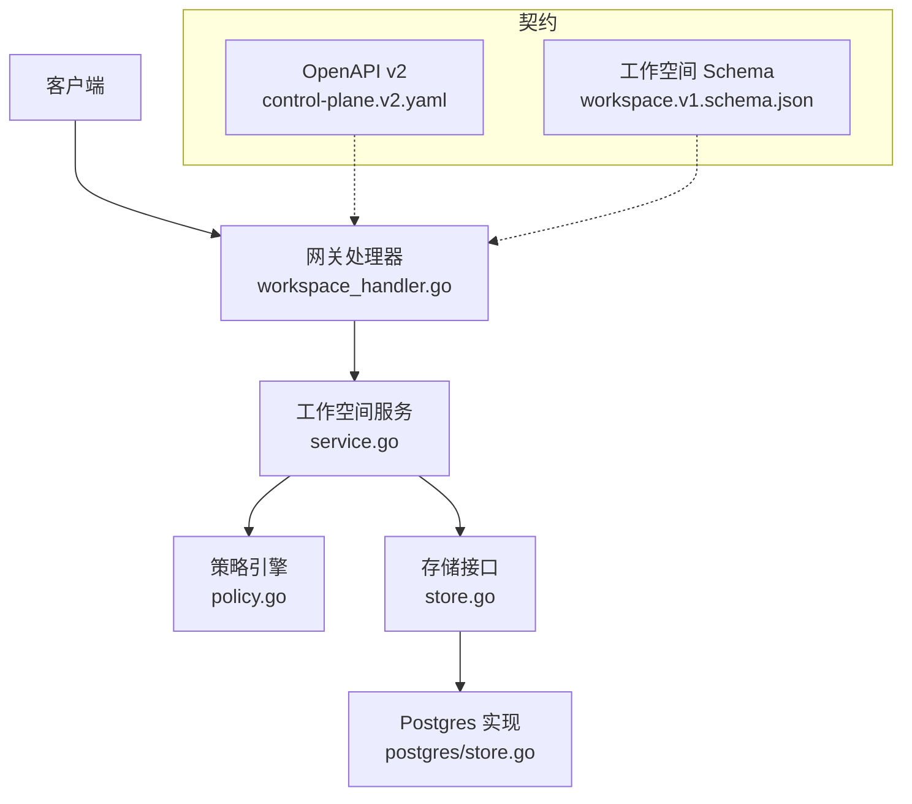
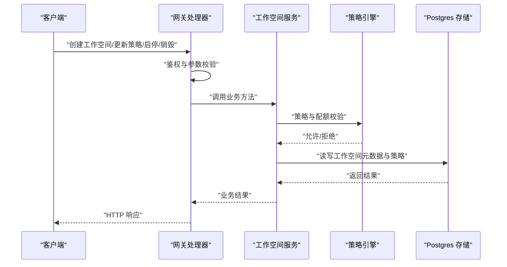
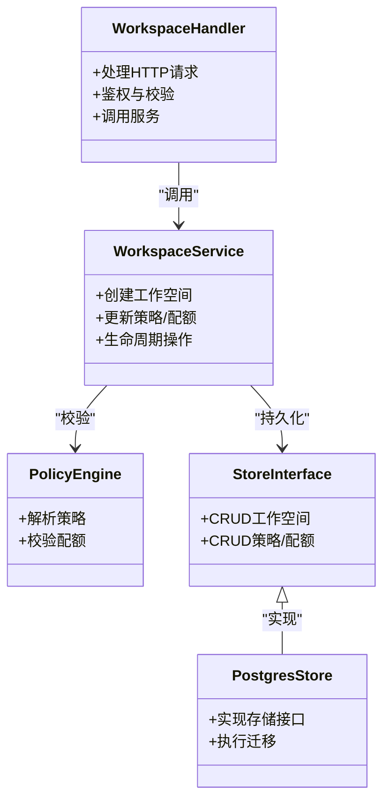
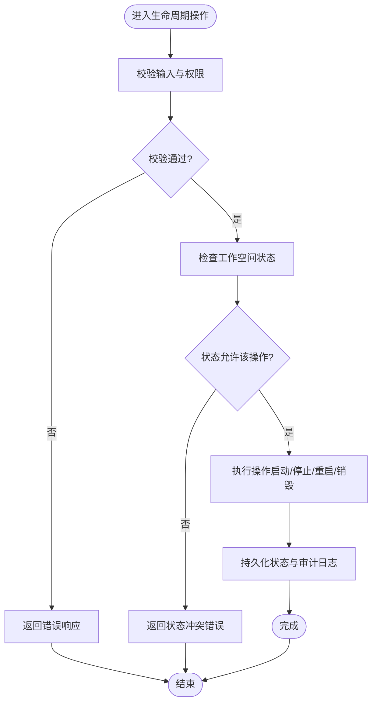

# 工作空间处理器

<cite>
**本文引用的文件**   
- [apps/control-plane/internal/gateway/workspace_handler.go](file://apps/control-plane/internal/gateway/workspace_handler.go)
- [apps/control-plane/internal/gateway/workspace_handler_test.go](file://apps/control-plane/internal/gateway/workspace_handler_test.go)
- [apps/control-plane/internal/workspace/service.go](file://apps/control-plane/internal/workspace/service.go)
- [apps/control-plane/internal/workspace/model.go](file://apps/control-plane/internal/workspace/model.go)
- [apps/control-plane/internal/workspace/store.go](file://apps/control-plane/internal/workspace/store.go)
- [apps/control-plane/internal/workspace/policy.go](file://apps/control-plane/internal/workspace/policy.go)
- [apps/control-plane/internal/workspace/postgres/store.go](file://apps/control-plane/internal/workspace/postgres/store.go)
- [apps/control-plane/internal/workspace/postgres/migrations.go](file://apps/control-plane/internal/workspace/postgres/migrations.go)
- [contracts/schemas/workspace.v1.schema.json](file://contracts/schemas/workspace.v1.schema.json)
- [contracts/openapi/control-plane.v2.yaml](file://contracts/openapi/control-plane.v2.yaml)
- [specs/004-workspace-create-read/contracts/workspace-create-read-api.md](file://specs/004-workspace-create-read/contracts/workspace-create-read-api.md)
- [specs/003-workspace-installation-contracts/contracts/workspace-installation-api.md](file://specs/003-workspace-installation-contracts/contracts/workspace-installation-api.md)
- [specs/008-installation-lifecycle/contracts/installation-lifecycle-api.md](file://specs/008-installation-lifecycle/contracts/installation-lifecycle-api.md)
</cite>

## 目录
1. [简介](#简介)
2. [项目结构](#项目结构)
3. [核心组件](#核心组件)
4. [架构总览](#架构总览)
5. [详细组件分析](#详细组件分析)
6. [依赖分析](#依赖分析)
7. [性能考虑](#性能考虑)
8. [故障排查指南](#故障排查指南)
9. [结论](#结论)
10. [附录](#附录)

## 简介
本文件为 NeKiro 网关层的工作空间处理器提供全面的 API 参考文档，聚焦多租户工作空间的创建、配置与管理接口，包括资源配额与策略配置；覆盖工作空间生命周期管理（启动、停止、重启、销毁）；解释隔离机制与数据安全保证；记录模板与批量部署能力；详述权限策略执行与审计日志；并给出状态监控与健康检查接口。文末提供完整示例与最佳实践建议，帮助使用者快速上手与安全运维。

## 项目结构
NeKiro 控制面中，工作空间相关能力由网关层处理器与内部工作空间服务共同实现：
- 网关层处理器负责 HTTP 路由、鉴权、请求校验与响应封装。
- 工作空间服务承载业务逻辑，协调存储与策略引擎。
- 持久化层基于 Postgres 实现工作空间元数据与策略的落盘。
- OpenAPI 与 Schema 定义对外契约与数据结构。

图表来源
- [apps/control-plane/internal/gateway/workspace_handler.go](file://apps/control-plane/internal/gateway/workspace_handler.go)
- [apps/control-plane/internal/workspace/service.go](file://apps/control-plane/internal/workspace/service.go)
- [apps/control-plane/internal/workspace/policy.go](file://apps/control-plane/internal/workspace/policy.go)
- [apps/control-plane/internal/workspace/store.go](file://apps/control-plane/internal/workspace/store.go)
- [apps/control-plane/internal/workspace/postgres/store.go](file://apps/control-plane/internal/workspace/postgres/store.go)
- [contracts/openapi/control-plane.v2.yaml](file://contracts/openapi/control-plane.v2.yaml)
- [contracts/schemas/workspace.v1.schema.json](file://contracts/schemas/workspace.v1.schema.json)

章节来源
- [apps/control-plane/internal/gateway/workspace_handler.go](file://apps/control-plane/internal/gateway/workspace_handler.go)
- [apps/control-plane/internal/workspace/service.go](file://apps/control-plane/internal/workspace/service.go)
- [contracts/openapi/control-plane.v2.yaml](file://contracts/openapi/control-plane.v2.yaml)
- [contracts/schemas/workspace.v1.schema.json](file://contracts/schemas/workspace.v1.schema.json)

## 核心组件
- 网关处理器：暴露 RESTful 接口，处理工作空间 CRUD、生命周期操作、策略与配额设置、批量部署、健康检查等。
- 工作空间服务：编排工作空间创建、更新、删除、启停、重启流程；调用策略引擎进行权限与配额校验；与存储交互完成持久化。
- 策略引擎：解析与执行工作空间级权限策略，支持多租户隔离与访问控制。
- 存储层：抽象 store 接口并提供 Postgres 实现，维护工作空间元数据、策略与版本信息。
- 契约与模型：OpenAPI 描述对外 API，Schema 约束工作空间数据结构。

章节来源
- [apps/control-plane/internal/gateway/workspace_handler.go](file://apps/control-plane/internal/gateway/workspace_handler.go)
- [apps/control-plane/internal/workspace/service.go](file://apps/control-plane/internal/workspace/service.go)
- [apps/control-plane/internal/workspace/policy.go](file://apps/control-plane/internal/workspace/policy.go)
- [apps/control-plane/internal/workspace/store.go](file://apps/control-plane/internal/workspace/store.go)
- [apps/control-plane/internal/workspace/postgres/store.go](file://apps/control-plane/internal/workspace/postgres/store.go)
- [contracts/openapi/control-plane.v2.yaml](file://contracts/openapi/control-plane.v2.yaml)
- [contracts/schemas/workspace.v1.schema.json](file://contracts/schemas/workspace.v1.schema.json)

## 架构总览
下图展示从客户端到工作空间服务的端到端调用路径，以及策略与存储的协作关系。

图表来源
- [apps/control-plane/internal/gateway/workspace_handler.go](file://apps/control-plane/internal/gateway/workspace_handler.go)
- [apps/control-plane/internal/workspace/service.go](file://apps/control-plane/internal/workspace/service.go)
- [apps/control-plane/internal/workspace/policy.go](file://apps/control-plane/internal/workspace/policy.go)
- [apps/control-plane/internal/workspace/postgres/store.go](file://apps/control-plane/internal/workspace/postgres/store.go)

## 详细组件分析

### 工作空间处理器（网关层）
职责
- 注册并处理工作空间相关 HTTP 路由。
- 解析请求体、查询参数与路径参数。
- 执行鉴权上下文提取与基础校验。
- 调用工作空间服务执行业务逻辑。
- 统一错误码与响应格式。

关键接口（按功能分组）
- 工作空间管理
  - 创建工作空间：POST /workspaces
  - 获取工作空间详情：GET /workspaces/{id}
  - 列出工作空间：GET /workspaces
  - 更新工作空间：PATCH /workspaces/{id}
  - 删除工作空间：DELETE /workspaces/{id}
- 策略与配额
  - 设置策略：PUT /workspaces/{id}/policy
  - 获取策略：GET /workspaces/{id}/policy
  - 设置配额：PUT /workspaces/{id}/quota
  - 获取配额：GET /workspaces/{id}/quota
- 生命周期
  - 启动：POST /workspaces/{id}/start
  - 停止：POST /workspaces/{id}/stop
  - 重启：POST /workspaces/{id}/restart
  - 销毁：POST /workspaces/{id}/destroy
- 模板与批量部署
  - 应用模板：POST /workspaces/templates/{templateId}/deploy
  - 批量部署：POST /workspaces/batch/deploy
- 监控与健康
  - 健康检查：GET /health
  - 工作空间状态：GET /workspaces/{id}/status

鉴权与审计
- 鉴权：通过网关中间件注入租户上下文，确保跨租户隔离。
- 审计：对关键操作（创建、更新策略、启停、销毁）记录审计事件，包含操作者、时间戳、目标工作空间 ID 与变更摘要。

错误处理
- 使用平台错误模式，返回标准错误结构与状态码。
- 常见错误：未授权、资源不存在、参数校验失败、配额超限、策略冲突、并发冲突。

章节来源
- [apps/control-plane/internal/gateway/workspace_handler.go](file://apps/control-plane/internal/gateway/workspace_handler.go)
- [apps/control-plane/internal/gateway/workspace_handler_test.go](file://apps/control-plane/internal/gateway/workspace_handler_test.go)
- [contracts/openapi/control-plane.v2.yaml](file://contracts/openapi/control-plane.v2.yaml)

### 工作空间服务（业务编排）
职责
- 编排工作空间全生命周期：创建、读取、更新、删除、启动、停止、重启、销毁。
- 调用策略引擎进行权限与配额校验。
- 与存储层交互完成元数据与策略持久化。
- 提供事务性保障与幂等性设计。

关键流程
- 创建工作空间
  - 校验输入与模板有效性
  - 生成唯一标识与初始策略/配额
  - 写入存储并返回结果
- 更新策略与配额
  - 解析策略与配额变更
  - 执行策略兼容性检查
  - 原子更新并返回新版本
- 生命周期操作
  - 启动：预检资源与策略，标记为运行态
  - 停止：优雅关闭，标记为已停止
  - 重启：先停止再启动
  - 销毁：清理关联资源，标记为已销毁

章节来源
- [apps/control-plane/internal/workspace/service.go](file://apps/control-plane/internal/workspace/service.go)
- [apps/control-plane/internal/workspace/model.go](file://apps/control-plane/internal/workspace/model.go)

### 策略引擎（权限与配额）
职责
- 解析工作空间级策略文档，评估访问控制规则。
- 校验资源配额是否满足当前与预期使用量。
- 提供策略版本管理与回滚支持。

策略要点
- 多租户隔离：基于租户 ID 与作用域限制访问。
- 最小权限原则：默认拒绝，显式授权。
- 配额上限：CPU、内存、并发请求数等可配置阈值。

章节来源
- [apps/control-plane/internal/workspace/policy.go](file://apps/control-plane/internal/workspace/policy.go)

### 存储层（Postgres 实现）
职责
- 提供工作空间元数据、策略与配额的增删改查。
- 维护迁移脚本，确保数据库结构演进。
- 支持事务与并发控制（如乐观锁）。

数据模型（概念）
- 工作空间：ID、名称、描述、状态、版本、创建/更新时间、租户 ID。
- 策略：工作空间 ID、策略文档、版本、生效时间。
- 配额：工作空间 ID、配额项、版本、生效时间。

章节来源
- [apps/control-plane/internal/workspace/store.go](file://apps/control-plane/internal/workspace/store.go)
- [apps/control-plane/internal/workspace/postgres/store.go](file://apps/control-plane/internal/workspace/postgres/store.go)
- [apps/control-plane/internal/workspace/postgres/migrations.go](file://apps/control-plane/internal/workspace/postgres/migrations.go)

### 契约与数据结构
- OpenAPI v2：定义工作空间相关 API 的路径、方法、请求/响应结构与错误码。
- Workspace Schema v1：定义工作空间实体的字段、类型与约束。

章节来源
- [contracts/openapi/control-plane.v2.yaml](file://contracts/openapi/control-plane.v2.yaml)
- [contracts/schemas/workspace.v1.schema.json](file://contracts/schemas/workspace.v1.schema.json)

## 依赖分析
工作空间处理器与服务之间的依赖关系如下：

图表来源
- [apps/control-plane/internal/gateway/workspace_handler.go](file://apps/control-plane/internal/gateway/workspace_handler.go)
- [apps/control-plane/internal/workspace/service.go](file://apps/control-plane/internal/workspace/service.go)
- [apps/control-plane/internal/workspace/policy.go](file://apps/control-plane/internal/workspace/policy.go)
- [apps/control-plane/internal/workspace/store.go](file://apps/control-plane/internal/workspace/store.go)
- [apps/control-plane/internal/workspace/postgres/store.go](file://apps/control-plane/internal/workspace/postgres/store.go)

章节来源
- [apps/control-plane/internal/gateway/workspace_handler.go](file://apps/control-plane/internal/gateway/workspace_handler.go)
- [apps/control-plane/internal/workspace/service.go](file://apps/control-plane/internal/workspace/service.go)
- [apps/control-plane/internal/workspace/store.go](file://apps/control-plane/internal/workspace/store.go)
- [apps/control-plane/internal/workspace/postgres/store.go](file://apps/control-plane/internal/workspace/postgres/store.go)

## 性能考虑
- 缓存热点数据：工作空间元数据与策略可使用本地或分布式缓存降低延迟。
- 异步任务：批量部署与销毁等耗时操作采用队列异步执行，避免阻塞主流程。
- 连接池与超时：合理配置数据库连接池与请求超时，防止资源耗尽。
- 幂等与重试：对写操作提供幂等键，配合客户端重试提升可靠性。
- 分页与过滤：列表接口支持分页与条件过滤，减少大结果集传输开销。

[本节为通用指导，不直接分析具体文件]

## 故障排查指南
常见问题与定位步骤
- 鉴权失败：检查网关中间件是否正确注入租户上下文与权限令牌。
- 策略冲突：查看策略版本与生效时间，确认是否存在并发更新导致冲突。
- 配额超限：核对当前使用量与配额上限，必要时调整配额或扩容资源。
- 生命周期异常：检查工作空间状态机转换是否合法，关注错误码与审计日志。
- 存储问题：验证数据库连通性与迁移状态，确认表结构与索引正常。

建议的调试手段
- 开启详细日志与追踪 ID，关联请求链路。
- 使用健康检查与工作空间状态接口观察系统状况。
- 回放审计日志，定位变更来源与影响范围。

章节来源
- [apps/control-plane/internal/gateway/workspace_handler.go](file://apps/control-plane/internal/gateway/workspace_handler.go)
- [apps/control-plane/internal/workspace/service.go](file://apps/control-plane/internal/workspace/service.go)
- [apps/control-plane/internal/workspace/policy.go](file://apps/control-plane/internal/workspace/policy.go)

## 结论
工作空间处理器在 NeKiro 控制面中承担多租户工作空间的核心管理能力，结合策略引擎与存储层实现了安全、可扩展且可观测的工作空间生命周期管理。通过明确的 API 契约与 Schema 约束，开发者可以稳定集成并构建上层自动化与治理工具。遵循最佳实践与性能优化建议，可在生产环境中获得高可用与高吞吐的体验。

[本节为总结，不直接分析具体文件]

## 附录

### 工作空间生命周期流程图

图表来源
- [apps/control-plane/internal/workspace/service.go](file://apps/control-plane/internal/workspace/service.go)
- [apps/control-plane/internal/workspace/policy.go](file://apps/control-plane/internal/workspace/policy.go)

### 示例与最佳实践
- 示例
  - 创建工作空间：提交名称、描述与初始策略/配额，等待返回工作空间 ID。
  - 设置策略：上传策略文档，指定作用域与规则，确认版本递增。
  - 启动工作空间：调用启动接口，监控状态至运行态。
  - 批量部署：使用模板批量创建多个工作空间，跟踪进度与结果。
  - 健康检查：定期轮询健康与工作空间状态，建立告警。
- 最佳实践
  - 使用幂等键与重试机制，避免重复操作造成不一致。
  - 策略与配额变更采用灰度发布与回滚策略。
  - 对敏感操作启用双人审批与审计留痕。
  - 定期备份工作空间元数据与策略，制定灾难恢复计划。
  - 监控关键指标：请求延迟、错误率、配额使用率与存储增长。

章节来源
- [specs/004-workspace-create-read/contracts/workspace-create-read-api.md](file://specs/004-workspace-create-read/contracts/workspace-create-read-api.md)
- [specs/003-workspace-installation-contracts/contracts/workspace-installation-api.md](file://specs/003-workspace-installation-contracts/contracts/workspace-installation-api.md)
- [specs/008-installation-lifecycle/contracts/installation-lifecycle-api.md](file://specs/008-installation-lifecycle/contracts/installation-lifecycle-api.md)