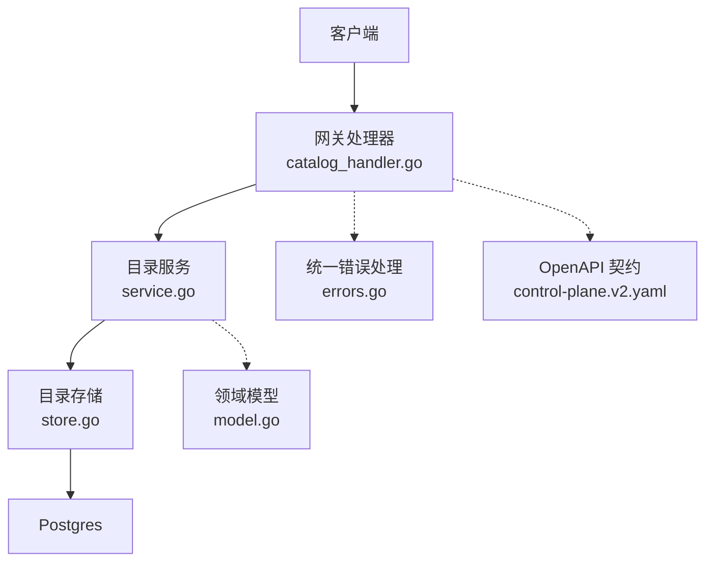
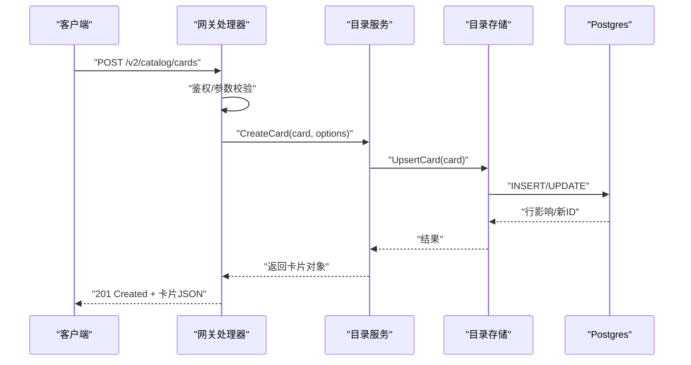
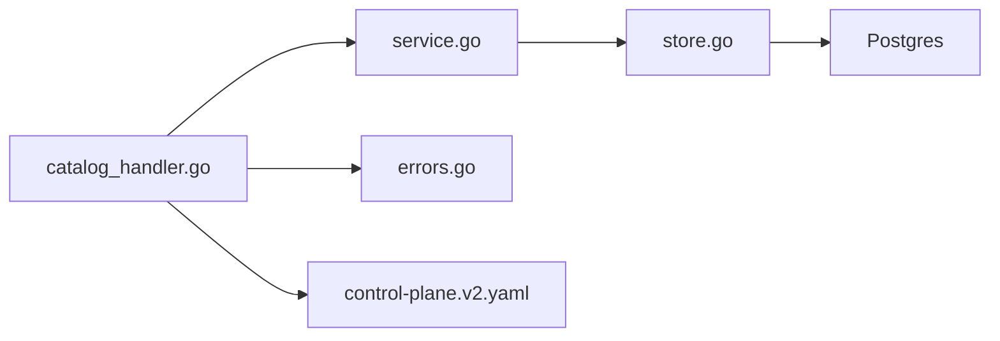

# 目录服务处理器

<cite>
**本文引用的文件**   
- [apps/control-plane/internal/gateway/catalog_handler.go](file://apps/control-plane/internal/gateway/catalog_handler.go)
- [apps/control-plane/internal/gateway/errors.go](file://apps/control-plane/internal/gateway/errors.go)
- [apps/control-plane/internal/catalog/service.go](file://apps/control-plane/internal/catalog/service.go)
- [apps/control-plane/internal/catalog/store.go](file://apps/control-plane/internal/catalog/store.go)
- [apps/control-plane/internal/catalog/model.go](file://apps/control-plane/internal/catalog/model.go)
- [contracts/openapi/control-plane.v2.yaml](file://contracts/openapi/control-plane.v2.yaml)
- [contracts/schemas/agent-card.v0.2.schema.json](file://contracts/schemas/agent-card.v0.2.schema.json)
- [specs/002-catalog-registry-discovery/contracts/catalog-api.md](file://specs/002-catalog-registry-discovery/contracts/catalog-api.md)
</cite>

## 目录
1. [简介](#简介)
2. [项目结构](#项目结构)
3. [核心组件](#核心组件)
4. [架构总览](#架构总览)
5. [详细组件分析](#详细组件分析)
6. [依赖分析](#依赖分析)
7. [性能考虑](#性能考虑)
8. [故障排查指南](#故障排查指南)
9. [结论](#结论)
10. [附录](#附录)

## 简介
本文件面向 NeKiro 网关层的“目录服务处理器”，聚焦代理注册、发现与管理相关的 RESTful API。文档覆盖：
- 代理卡片（Agent Card）的创建、更新、删除与查询接口
- 代理版本控制与兼容性检查机制
- 批量操作与分页查询的实现细节
- 完整的请求/响应示例、错误码定义与状态码说明
- 客户端集成示例与常见使用场景的代码片段路径

## 项目结构
目录服务在控制面中由网关层暴露 HTTP 接口，内部通过服务层访问持久化存储。关键位置如下：
- 网关层处理器：负责路由、鉴权、参数校验与错误映射
- 服务层：封装业务逻辑（如版本兼容、分页、批量）
- 存储层：对接数据库（Postgres），提供 CRUD 与游标分页能力
- OpenAPI 契约与 Schema：定义对外接口与数据模型约束

图表来源
- [apps/control-plane/internal/gateway/catalog_handler.go](file://apps/control-plane/internal/gateway/catalog_handler.go)
- [apps/control-plane/internal/catalog/service.go](file://apps/control-plane/internal/catalog/service.go)
- [apps/control-plane/internal/catalog/store.go](file://apps/control-plane/internal/catalog/store.go)
- [apps/control-plane/internal/gateway/errors.go](file://apps/control-plane/internal/gateway/errors.go)
- [contracts/openapi/control-plane.v2.yaml](file://contracts/openapi/control-plane.v2.yaml)

章节来源
- [apps/control-plane/internal/gateway/catalog_handler.go](file://apps/control-plane/internal/gateway/catalog_handler.go)
- [apps/control-plane/internal/catalog/service.go](file://apps/control-plane/internal/catalog/service.go)
- [apps/control-plane/internal/catalog/store.go](file://apps/control-plane/internal/catalog/store.go)
- [apps/control-plane/internal/catalog/model.go](file://apps/control-plane/internal/catalog/model.go)
- [contracts/openapi/control-plane.v2.yaml](file://contracts/openapi/control-plane.v2.yaml)

## 核心组件
- 网关处理器（CatalogHandler）
  - 职责：解析请求、鉴权、调用服务层、序列化响应、统一错误映射
  - 关键点：支持查询参数（分页、过滤）、批量写入、版本选择头
- 目录服务（CatalogService）
  - 职责：实现代理卡片的增删改查、版本兼容检查、游标分页、批量事务
  - 关键点：基于游标的分页、幂等键、版本策略（语义化版本或标签）
- 目录存储（CatalogStore）
  - 职责：对 Postgres 执行 SQL，提供按游标翻页、条件查询、批量插入/更新
  - 关键点：索引优化、事务边界、一致性保证
- 领域模型（Model）
  - 职责：定义 AgentCard、版本信息、元数据、状态字段
- 错误处理（Gateway Errors）
  - 职责：将内部错误转换为标准平台错误格式，包含错误码与消息

章节来源
- [apps/control-plane/internal/gateway/catalog_handler.go](file://apps/control-plane/internal/gateway/catalog_handler.go)
- [apps/control-plane/internal/catalog/service.go](file://apps/control-plane/internal/catalog/service.go)
- [apps/control-plane/internal/catalog/store.go](file://apps/control-plane/internal/catalog/store.go)
- [apps/control-plane/internal/catalog/model.go](file://apps/control-plane/internal/catalog/model.go)
- [apps/control-plane/internal/gateway/errors.go](file://apps/control-plane/internal/gateway/errors.go)

## 架构总览
目录服务采用分层架构：网关层仅做协议适配与错误映射；业务逻辑集中在服务层；存储层专注数据访问。OpenAPI 契约驱动前后端一致性与自动化测试。

图表来源
- [apps/control-plane/internal/gateway/catalog_handler.go](file://apps/control-plane/internal/gateway/catalog_handler.go)
- [apps/control-plane/internal/catalog/service.go](file://apps/control-plane/internal/catalog/service.go)
- [apps/control-plane/internal/catalog/store.go](file://apps/control-plane/internal/catalog/store.go)

## 详细组件分析

### 代理卡片生命周期管理 API
以下端点用于代理卡片的创建、更新、删除与查询。所有路径前缀为 /v2/catalog/cards。

- 创建代理卡片
  - 方法：POST
  - URL：/v2/catalog/cards
  - 请求体：遵循 agent-card v0.2 schema
  - 响应：201 Created，返回已创建的卡片对象
  - 备注：支持幂等键以避免重复提交

- 更新代理卡片
  - 方法：PUT
  - URL：/v2/catalog/cards/{cardId}
  - 路径参数：cardId（字符串）
  - 请求体：完整卡片对象
  - 响应：200 OK，返回更新后的卡片对象

- 部分更新代理卡片
  - 方法：PATCH
  - URL：/v2/catalog/cards/{cardId}
  - 路径参数：cardId（字符串）
  - 请求体：增量字段集合
  - 响应：200 OK，返回合并后的卡片对象

- 删除代理卡片
  - 方法：DELETE
  - URL：/v2/catalog/cards/{cardId}
  - 路径参数：cardId（字符串）
  - 响应：204 No Content

- 查询单个代理卡片
  - 方法：GET
  - URL：/v2/catalog/cards/{cardId}
  - 路径参数：cardId（字符串）
  - 响应：200 OK，返回卡片对象

- 列出代理卡片（分页）
  - 方法：GET
  - URL：/v2/catalog/cards
  - 查询参数：
    - cursor：游标（上次返回的下一页游标）
    - limit：每页大小（正整数）
    - filter.*：可选过滤条件（例如名称、标签、版本等）
  - 响应：200 OK，返回卡片列表与下一页游标

- 批量创建/更新代理卡片
  - 方法：POST
  - URL：/v2/catalog/cards/batch
  - 请求体：卡片数组
  - 响应：200 OK，返回每条记录的处理结果（成功/失败明细）

- 版本选择与兼容性
  - 请求头：Accept-Version（可选）
  - 行为：服务端根据 Accept-Version 选择兼容版本并返回对应表示

章节来源
- [apps/control-plane/internal/gateway/catalog_handler.go](file://apps/control-plane/internal/gateway/catalog_handler.go)
- [contracts/openapi/control-plane.v2.yaml](file://contracts/openapi/control-plane.v2.yaml)
- [specs/002-catalog-registry-discovery/contracts/catalog-api.md](file://specs/002-catalog-registry-discovery/contracts/catalog-api.md)

### 代理卡片数据结构与校验
- 数据模型
  - 卡片标识、名称、描述、版本、能力集、端点、权限、元数据、时间戳等
- 校验规则
  - 遵循 agent-card v0.2 schema，缺失必填字段或类型不匹配将触发校验错误
- 版本控制
  - 使用语义化版本或标签；服务端进行兼容性检查，拒绝不兼容变更

章节来源
- [apps/control-plane/internal/catalog/model.go](file://apps/control-plane/internal/catalog/model.go)
- [contracts/schemas/agent-card.v0.2.schema.json](file://contracts/schemas/agent-card.v0.2.schema.json)

### 版本控制与兼容性检查机制
- 版本选择
  - 客户端通过 Accept-Version 指定期望版本
  - 服务端返回满足兼容性的最近版本表示
- 兼容性检查
  - 新增字段：向后兼容
  - 移除字段：向前不兼容，需升级客户端
  - 变更字段类型：视为破坏性变更，需提升主版本
- 冲突解决
  - 并发更新时采用乐观锁或最后写入胜出策略（以具体实现为准）

章节来源
- [apps/control-plane/internal/catalog/service.go](file://apps/control-plane/internal/catalog/service.go)
- [contracts/schemas/agent-card.v0.2.schema.json](file://contracts/schemas/agent-card.v0.2.schema.json)

### 分页与游标实现
- 游标分页
  - 使用稳定排序键（如更新时间或唯一 ID）生成游标
  - 请求参数：cursor、limit
  - 响应包含 nextCursor 用于翻页
- 性能建议
  - 对排序键建立索引
  - 限制最大 limit 值防止大结果集

章节来源
- [apps/control-plane/internal/catalog/service.go](file://apps/control-plane/internal/catalog/service.go)
- [apps/control-plane/internal/catalog/store.go](file://apps/control-plane/internal/catalog/store.go)

### 批量操作实现
- 批量写入
  - 支持一次性提交多条卡片记录
  - 返回逐条结果，便于定位失败项
- 事务与一致性
  - 建议在单事务内执行批量操作，确保原子性
- 限流与重试
  - 客户端应实现指数退避重试，避免雪崩

章节来源
- [apps/control-plane/internal/catalog/service.go](file://apps/control-plane/internal/catalog/service.go)
- [apps/control-plane/internal/catalog/store.go](file://apps/control-plane/internal/catalog/store.go)

### 错误处理与状态码
- 通用错误格式
  - 包含错误码、消息、详情（可选）
- 常见状态码
  - 200 OK：成功
  - 201 Created：资源已创建
  - 204 No Content：删除成功
  - 400 Bad Request：请求参数或校验失败
  - 404 Not Found：资源不存在
  - 409 Conflict：版本冲突或重复提交
  - 422 Unprocessable Entity：语义校验失败（如版本不兼容）
  - 500 Internal Server Error：服务器内部错误
- 错误码定义
  - 参考平台错误模式（Platform Error）

章节来源
- [apps/control-plane/internal/gateway/errors.go](file://apps/control-plane/internal/gateway/errors.go)
- [contracts/openapi/control-plane.v2.yaml](file://contracts/openapi/control-plane.v2.yaml)

### 客户端集成示例与常见场景
- 基本流程
  - 注册代理卡片 -> 查询卡片 -> 更新卡片 -> 删除卡片
- 分页遍历
  - 循环读取直到 nextCursor 为空
- 批量导入
  - 分批次提交，记录失败项并重试
- 版本选择
  - 设置 Accept-Version 获取兼容版本

代码片段路径
- [apps/control-plane/internal/gateway/catalog_handler_test.go](file://apps/control-plane/internal/gateway/catalog_handler_test.go)
- [tests/integration/catalog/catalog_test.go](file://tests/integration/catalog/catalog_test.go)

## 依赖分析
- 组件耦合
  - 网关处理器依赖服务层，服务层依赖存储层
  - 错误处理模块被网关层统一使用
- 外部依赖
  - Postgres 作为持久化后端
  - OpenAPI 契约驱动接口一致性
- 潜在风险
  - 存储层慢查询影响整体延迟
  - 批量操作过大导致事务超时

图表来源
- [apps/control-plane/internal/gateway/catalog_handler.go](file://apps/control-plane/internal/gateway/catalog_handler.go)
- [apps/control-plane/internal/catalog/service.go](file://apps/control-plane/internal/catalog/service.go)
- [apps/control-plane/internal/catalog/store.go](file://apps/control-plane/internal/catalog/store.go)
- [apps/control-plane/internal/gateway/errors.go](file://apps/control-plane/internal/gateway/errors.go)
- [contracts/openapi/control-plane.v2.yaml](file://contracts/openapi/control-plane.v2.yaml)

章节来源
- [apps/control-plane/internal/gateway/catalog_handler.go](file://apps/control-plane/internal/gateway/catalog_handler.go)
- [apps/control-plane/internal/catalog/service.go](file://apps/control-plane/internal/catalog/service.go)
- [apps/control-plane/internal/catalog/store.go](file://apps/control-plane/internal/catalog/store.go)
- [apps/control-plane/internal/gateway/errors.go](file://apps/control-plane/internal/gateway/errors.go)
- [contracts/openapi/control-plane.v2.yaml](file://contracts/openapi/control-plane.v2.yaml)

## 性能考虑
- 索引设计
  - 对排序键与常用过滤字段建立索引
- 分页策略
  - 使用游标而非偏移量，避免深翻页性能问题
- 批量写入
  - 合理控制批次大小，结合事务与重试
- 缓存
  - 对热点卡片可引入读缓存（注意一致性）

[本节为通用指导，无需特定文件引用]

## 故障排查指南
- 常见问题
  - 400/422：检查请求体是否符合 schema 与语义规则
  - 404：确认 cardId 是否存在
  - 409：并发更新冲突，建议使用幂等键或重试
  - 500：查看服务端日志与数据库连接状态
- 调试建议
  - 启用请求追踪与结构化日志
  - 使用 OpenAPI 契约进行自动化回归测试

章节来源
- [apps/control-plane/internal/gateway/errors.go](file://apps/control-plane/internal/gateway/errors.go)
- [apps/control-plane/internal/gateway/catalog_handler_test.go](file://apps/control-plane/internal/gateway/catalog_handler_test.go)

## 结论
目录服务处理器通过清晰的层次划分与严格的契约约束，提供了稳定可靠的代理注册、发现与管理能力。借助游标分页、批量操作与版本兼容性检查，系统在高吞吐与一致性之间取得良好平衡。建议在生产环境完善监控与告警，持续优化索引与批处理策略。

[本节为总结，无需特定文件引用]

## 附录

### API 端点速查表
- POST /v2/catalog/cards
- PUT /v2/catalog/cards/{cardId}
- PATCH /v2/catalog/cards/{cardId}
- DELETE /v2/catalog/cards/{cardId}
- GET /v2/catalog/cards/{cardId}
- GET /v2/catalog/cards?cursor=&limit=&filter.*=
- POST /v2/catalog/cards/batch

章节来源
- [contracts/openapi/control-plane.v2.yaml](file://contracts/openapi/control-plane.v2.yaml)
- [specs/002-catalog-registry-discovery/contracts/catalog-api.md](file://specs/002-catalog-registry-discovery/contracts/catalog-api.md)

### 数据模型与校验
- 代理卡片遵循 agent-card v0.2 schema
- 关键字段包括标识、名称、版本、能力、端点、权限、元数据、时间戳

章节来源
- [contracts/schemas/agent-card.v0.2.schema.json](file://contracts/schemas/agent-card.v0.2.schema.json)
- [apps/control-plane/internal/catalog/model.go](file://apps/control-plane/internal/catalog/model.go)