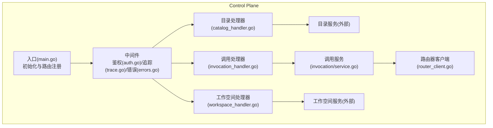
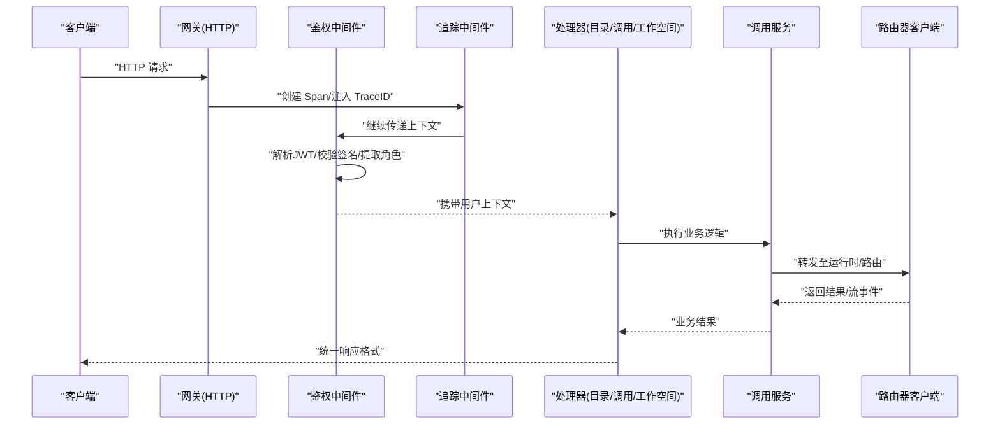
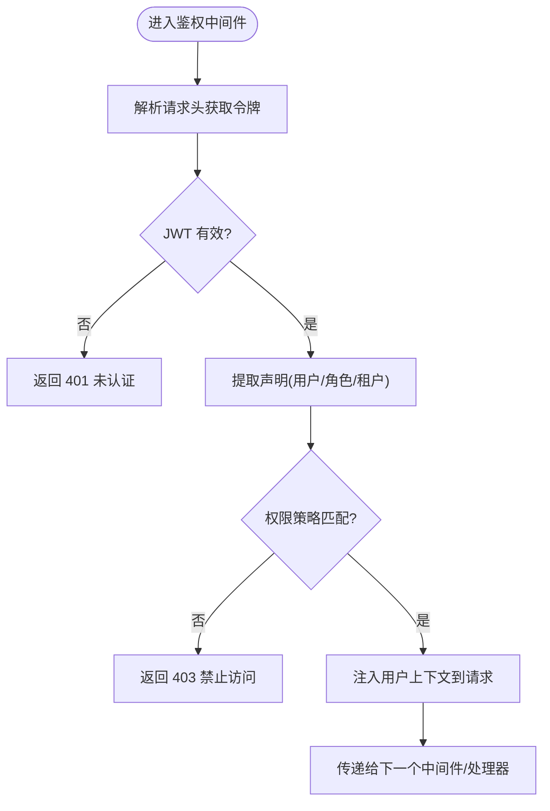
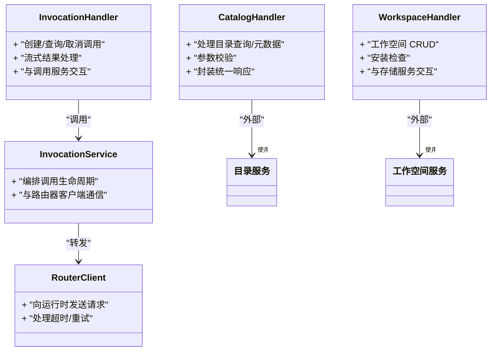
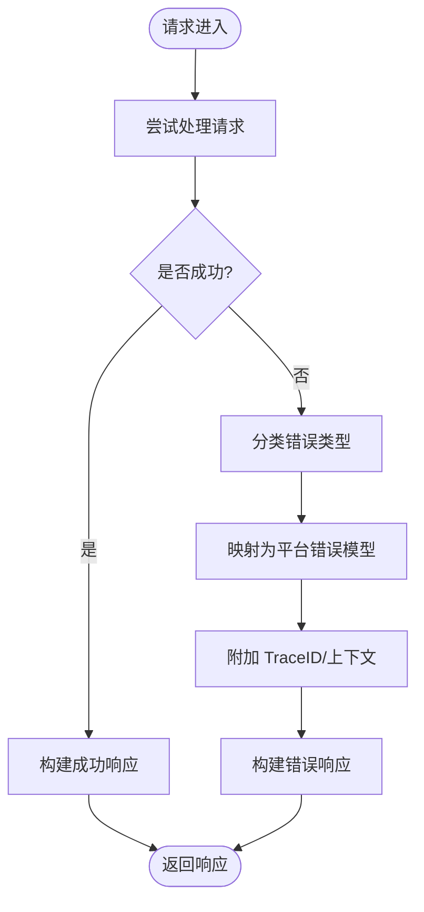
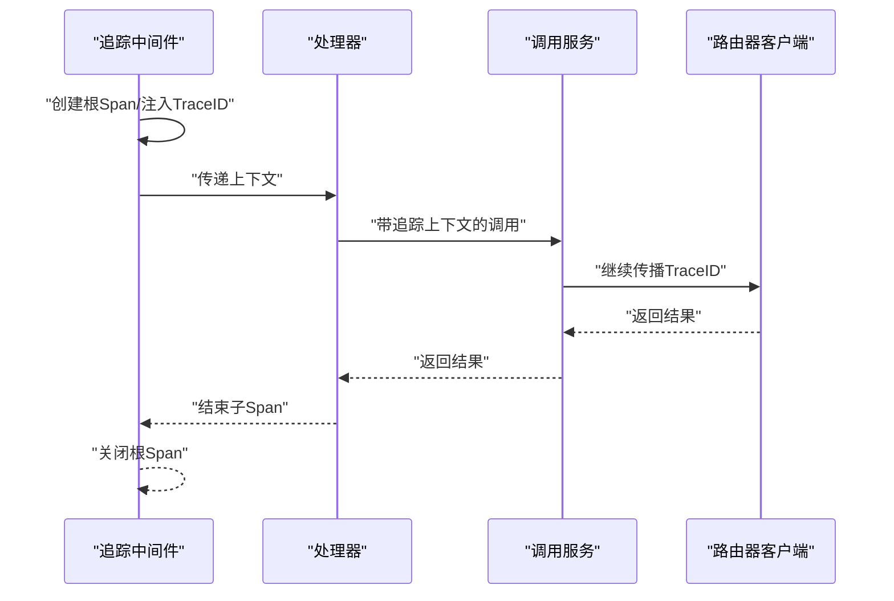
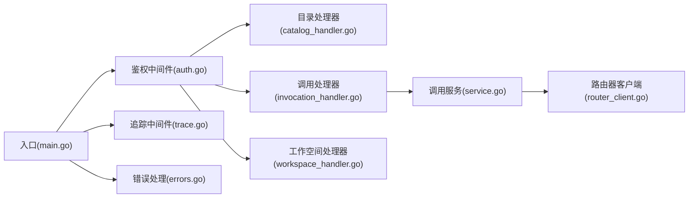

# 网关层

<cite>
**本文引用的文件**   
- [main.go](file://apps/control-plane/cmd/control-plane/main.go)
- [auth.go](file://apps/control-plane/internal/gateway/auth.go)
- [catalog_handler.go](file://apps/control-plane/internal/gateway/catalog_handler.go)
- [invocation_handler.go](file://apps/control-plane/internal/gateway/invocation_handler.go)
- [workspace_handler.go](file://apps/control-plane/internal/gateway/workspace_handler.go)
- [errors.go](file://apps/control-plane/internal/gateway/errors.go)
- [trace.go](file://apps/control-plane/internal/gateway/trace.go)
- [service.go](file://apps/control-plane/internal/invocation/service.go)
- [router_client.go](file://apps/control-plane/internal/invocation/router_client.go)
- [config.go](file://apps/control-plane/internal/config/config.go)
</cite>

## 目录
1. [简介](#简介)
2. [项目结构](#项目结构)
3. [核心组件](#核心组件)
4. [架构总览](#架构总览)
5. [详细组件分析](#详细组件分析)
6. [依赖分析](#依赖分析)
7. [性能考虑](#性能考虑)
8. [故障排查指南](#故障排查指南)
9. [结论](#结论)
10. [附录](#附录)

## 简介
本文件面向 NeKiro 控制面中的网关层，聚焦统一 API 入口、请求路由机制、认证授权中间件（JWT 验证、权限检查、会话管理）、处理器职责划分与处理流程、错误处理策略与统一响应格式、异常转换机制、分布式追踪集成与日志规范。文档同时提供架构图、请求处理流程图与中间件链示意图，帮助读者快速理解网关层的整体设计与实现要点。

## 项目结构
网关层位于 control-plane 应用内部，采用“HTTP 路由 + 中间件 + 处理器”的分层组织方式：
- HTTP 入口与路由注册：由应用启动入口负责初始化并挂载路由。
- 中间件：包含鉴权、追踪、错误包装等横切能力。
- 处理器：按领域划分为目录、调用、工作空间三大处理器，分别承载对应业务域的路由处理逻辑。
- 服务层：调用下游服务（如编排器/路由器）完成具体业务执行。
- 配置：集中管理网关相关配置项。

图表来源
- [main.go](file://apps/control-plane/cmd/control-plane/main.go)
- [auth.go](file://apps/control-plane/internal/gateway/auth.go)
- [trace.go](file://apps/control-plane/internal/gateway/trace.go)
- [errors.go](file://apps/control-plane/internal/gateway/errors.go)
- [catalog_handler.go](file://apps/control-plane/internal/gateway/catalog_handler.go)
- [invocation_handler.go](file://apps/control-plane/internal/gateway/invocation_handler.go)
- [workspace_handler.go](file://apps/control-plane/internal/gateway/workspace_handler.go)
- [service.go](file://apps/control-plane/internal/invocation/service.go)
- [router_client.go](file://apps/control-plane/internal/invocation/router_client.go)

章节来源
- [main.go](file://apps/control-plane/cmd/control-plane/main.go)
- [config.go](file://apps/control-plane/internal/config/config.go)

## 核心组件
- 统一 API 入口与路由
  - 负责创建 HTTP 服务器、加载配置、注册路由与中间件，并将请求分发到各处理器。
- 认证授权中间件
  - 解析与校验 JWT，注入用户上下文，进行基于角色的访问控制（RBAC）或资源级权限检查，维护会话信息。
- 处理器
  - 目录处理器：处理目录相关的查询与元数据操作。
  - 调用处理器：处理任务/调用的发起、状态查询与结果流式返回。
  - 工作空间处理器：管理工作空间的创建、读取、更新与删除等操作。
- 错误处理与统一响应
  - 将业务异常转换为平台统一的错误模型，附带标准化状态码与错误码，便于前端与 SDK 消费。
- 分布式追踪与日志
  - 在请求进入时生成 trace/span，贯穿处理器与服务调用链路；结构化日志记录关键事件与上下文。

章节来源
- [auth.go](file://apps/control-plane/internal/gateway/auth.go)
- [catalog_handler.go](file://apps/control-plane/internal/gateway/catalog_handler.go)
- [invocation_handler.go](file://apps/control-plane/internal/gateway/invocation_handler.go)
- [workspace_handler.go](file://apps/control-plane/internal/gateway/workspace_handler.go)
- [errors.go](file://apps/control-plane/internal/gateway/errors.go)
- [trace.go](file://apps/control-plane/internal/gateway/trace.go)
- [service.go](file://apps/control-plane/internal/invocation/service.go)
- [router_client.go](file://apps/control-plane/internal/invocation/router_client.go)

## 架构总览
网关层作为控制面的对外边界，承担以下职责：
- 统一入口：所有外部请求通过网关进入，屏蔽后端多服务的差异。
- 安全边界：集中进行身份认证与授权，确保最小权限原则。
- 可观测性：内置追踪与日志，保障问题定位效率。
- 协议适配：对上游契约（OpenAPI/JSON-RPC）进行适配与校验。

图表来源
- [main.go](file://apps/control-plane/cmd/control-plane/main.go)
- [auth.go](file://apps/control-plane/internal/gateway/auth.go)
- [trace.go](file://apps/control-plane/internal/gateway/trace.go)
- [catalog_handler.go](file://apps/control-plane/internal/gateway/catalog_handler.go)
- [invocation_handler.go](file://apps/control-plane/internal/gateway/invocation_handler.go)
- [workspace_handler.go](file://apps/control-plane/internal/gateway/workspace_handler.go)
- [service.go](file://apps/control-plane/internal/invocation/service.go)
- [router_client.go](file://apps/control-plane/internal/invocation/router_client.go)

## 详细组件分析

### 统一 API 入口与路由机制
- 入口职责
  - 初始化配置、构建 HTTP 引擎、注册全局中间件与路由分组。
  - 将不同领域的处理器挂载到相应路径前缀，形成清晰的命名空间。
- 路由策略
  - 基于路径前缀区分领域：/catalog、/invocations、/workspaces。
  - 支持 RESTful 风格与 JSON-RPC 风格的兼容映射（依据 OpenAPI 契约）。
- 上下文传递
  - 使用请求上下文传递用户信息、租户标识、追踪 ID 等。

章节来源
- [main.go](file://apps/control-plane/cmd/control-plane/main.go)
- [config.go](file://apps/control-plane/internal/config/config.go)

### 认证授权中间件（JWT、权限检查、会话管理）
- JWT 验证
  - 从请求头提取令牌，校验签名、过期时间与受众/发行者。
  - 失败则直接返回未认证错误。
- 权限检查
  - 基于角色与资源维度进行授权决策，支持细粒度能力（如 read/write/admin）。
  - 结合工作空间/目录/调用等资源上下文进行动态判断。
- 会话管理
  - 将用户信息、角色集合、租户 ID 注入请求上下文，供后续处理器使用。
  - 可选刷新令牌与会话续期策略。

图表来源
- [auth.go](file://apps/control-plane/internal/gateway/auth.go)

章节来源
- [auth.go](file://apps/control-plane/internal/gateway/auth.go)

### 处理器职责与处理流程
- 目录处理器
  - 负责目录资源的查询、版本管理与元数据检索。
  - 典型流程：鉴权 -> 参数校验 -> 查询目录存储/服务 -> 封装响应。
- 调用处理器
  - 负责调用的创建、状态查询、取消与结果流式传输。
  - 典型流程：鉴权 -> 构造调用上下文 -> 调用服务层 -> 路由客户端转发 -> 返回结果或流事件。
- 工作空间处理器
  - 负责工作空间的生命周期管理（CRUD）与安装检查。
  - 典型流程：鉴权 -> 参数校验 -> 调用工作空间服务 -> 持久化/缓存 -> 返回结果。

图表来源
- [catalog_handler.go](file://apps/control-plane/internal/gateway/catalog_handler.go)
- [invocation_handler.go](file://apps/control-plane/internal/gateway/invocation_handler.go)
- [workspace_handler.go](file://apps/control-plane/internal/gateway/workspace_handler.go)
- [service.go](file://apps/control-plane/internal/invocation/service.go)
- [router_client.go](file://apps/control-plane/internal/invocation/router_client.go)

章节来源
- [catalog_handler.go](file://apps/control-plane/internal/gateway/catalog_handler.go)
- [invocation_handler.go](file://apps/control-plane/internal/gateway/invocation_handler.go)
- [workspace_handler.go](file://apps/control-plane/internal/gateway/workspace_handler.go)
- [service.go](file://apps/control-plane/internal/invocation/service.go)
- [router_client.go](file://apps/control-plane/internal/invocation/router_client.go)

### 错误处理策略、统一响应格式与异常转换
- 错误分类
  - 网络/超时错误、参数校验错误、业务规则错误、系统内部错误。
- 统一响应格式
  - 成功：包含数据体与请求标识。
  - 失败：包含错误码、错误消息、关联的 trace ID，便于追踪。
- 异常转换
  - 将底层异常转换为平台错误模型，保证对外一致性。
  - 敏感信息脱敏，避免泄露内部细节。

图表来源
- [errors.go](file://apps/control-plane/internal/gateway/errors.go)

章节来源
- [errors.go](file://apps/control-plane/internal/gateway/errors.go)

### 分布式追踪集成与日志记录规范
- 追踪集成
  - 在网关入口处创建根 Span，注入 TraceID 到下游服务调用。
  - 处理器与服务层埋点，覆盖关键步骤（鉴权、路由、I/O）。
- 日志规范
  - 结构化日志输出，包含请求 ID、TraceID、用户 ID、资源标识、耗时。
  - 分级记录（INFO/WARN/ERROR），避免打印敏感数据。

图表来源
- [trace.go](file://apps/control-plane/internal/gateway/trace.go)
- [invocation_handler.go](file://apps/control-plane/internal/gateway/invocation_handler.go)
- [service.go](file://apps/control-plane/internal/invocation/service.go)
- [router_client.go](file://apps/control-plane/internal/invocation/router_client.go)

章节来源
- [trace.go](file://apps/control-plane/internal/gateway/trace.go)

## 依赖分析
- 组件耦合
  - 处理器依赖服务层，服务层依赖路由器客户端，形成清晰的分层。
  - 中间件与处理器松耦合，通过上下文传递共享状态。
- 外部依赖
  - 数据库/存储：目录与工作空间持久化。
  - 运行时/路由器：调用转发与结果回传。
- 潜在循环依赖
  - 当前分层避免了循环依赖；若新增跨域调用需引入接口抽象。

图表来源
- [main.go](file://apps/control-plane/cmd/control-plane/main.go)
- [auth.go](file://apps/control-plane/internal/gateway/auth.go)
- [trace.go](file://apps/control-plane/internal/gateway/trace.go)
- [errors.go](file://apps/control-plane/internal/gateway/errors.go)
- [catalog_handler.go](file://apps/control-plane/internal/gateway/catalog_handler.go)
- [invocation_handler.go](file://apps/control-plane/internal/gateway/invocation_handler.go)
- [workspace_handler.go](file://apps/control-plane/internal/gateway/workspace_handler.go)
- [service.go](file://apps/control-plane/internal/invocation/service.go)
- [router_client.go](file://apps/control-plane/internal/invocation/router_client.go)

章节来源
- [main.go](file://apps/control-plane/cmd/control-plane/main.go)
- [auth.go](file://apps/control-plane/internal/gateway/auth.go)
- [trace.go](file://apps/control-plane/internal/gateway/trace.go)
- [errors.go](file://apps/control-plane/internal/gateway/errors.go)
- [catalog_handler.go](file://apps/control-plane/internal/gateway/catalog_handler.go)
- [invocation_handler.go](file://apps/control-plane/internal/gateway/invocation_handler.go)
- [workspace_handler.go](file://apps/control-plane/internal/gateway/workspace_handler.go)
- [service.go](file://apps/control-plane/internal/invocation/service.go)
- [router_client.go](file://apps/control-plane/internal/invocation/router_client.go)

## 性能考虑
- 连接池与超时
  - 合理设置 HTTP 客户端连接池大小与读写超时，避免资源耗尽。
- 并发与限流
  - 针对热点接口实施速率限制与熔断降级，保护后端服务。
- 流式处理
  - 调用结果采用流式传输，减少内存占用与端到端延迟。
- 缓存策略
  - 目录元数据等读多写少场景可使用本地/分布式缓存提升吞吐。
- 追踪开销
  - 采样策略平衡可观测性与性能，避免全量采样造成额外负载。

## 故障排查指南
- 常见问题
  - 401 未认证：检查 JWT 签名、过期时间、颁发者与受众配置。
  - 403 禁止访问：核对用户角色与资源权限策略。
  - 5xx 服务端错误：查看错误码与 TraceID，定位服务层异常。
- 诊断步骤
  - 根据响应中的 TraceID 拉取链路日志，确认中间件与处理器阶段。
  - 检查路由器客户端的超时与重试配置，确认下游运行时的健康状态。
  - 审查错误转换逻辑，确保敏感信息已脱敏且错误码语义明确。

章节来源
- [errors.go](file://apps/control-plane/internal/gateway/errors.go)
- [auth.go](file://apps/control-plane/internal/gateway/auth.go)
- [trace.go](file://apps/control-plane/internal/gateway/trace.go)

## 结论
NeKiro 网关层以统一入口、中间件链与领域处理器为核心，实现了清晰的分层与职责分离。通过 JWT 鉴权、RBAC 权限检查与结构化追踪日志，提供了安全、可观测的 API 边界。错误处理与统一响应提升了系统的稳定性与可维护性。建议在后续迭代中持续优化限流、缓存与采样策略，进一步提升吞吐与可观测性。

## 附录
- 术语
  - 网关：控制面对外的统一入口。
  - 处理器：按领域划分的请求处理单元。
  - 中间件：横切能力的复用组件（鉴权、追踪、错误处理）。
  - 追踪：分布式链路追踪，用于问题定位与性能分析。