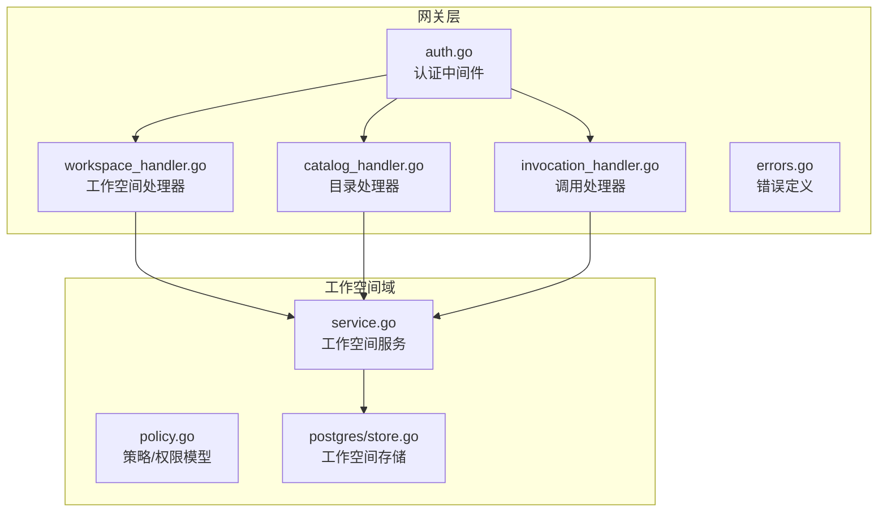
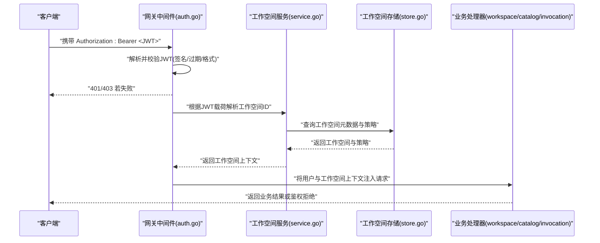
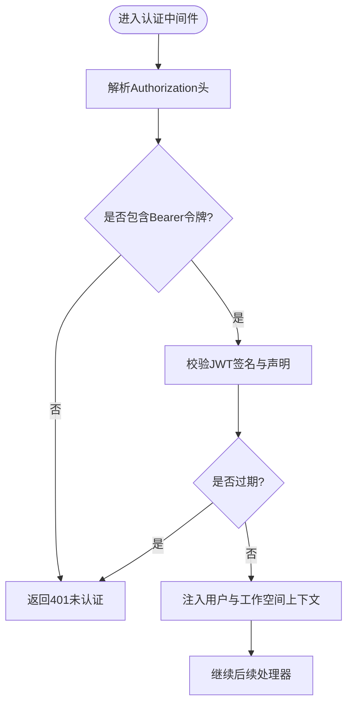
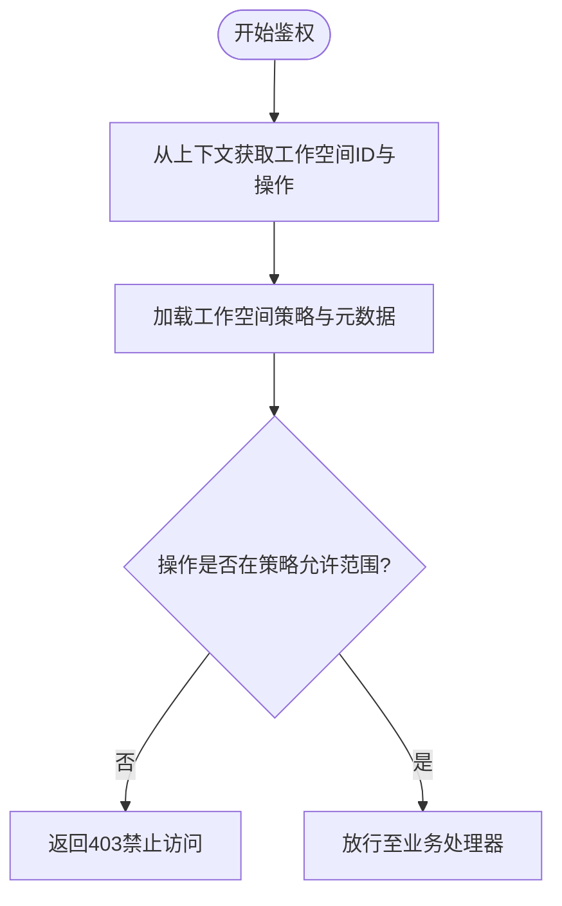
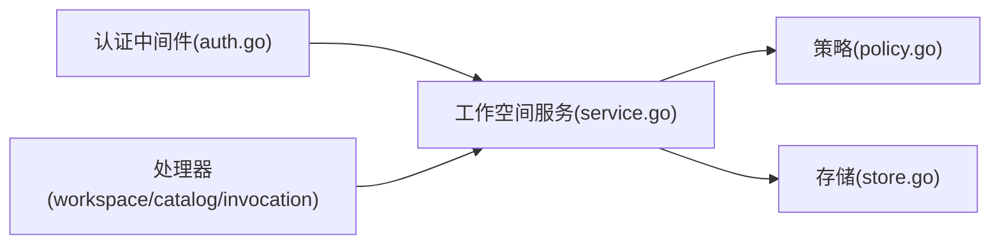

# 认证授权中间件

<cite>
**本文引用的文件**   
- [auth.go](file://apps/control-plane/internal/gateway/auth.go)
- [errors.go](file://apps/control-plane/internal/gateway/errors.go)
- [workspace_handler.go](file://apps/control-plane/internal/gateway/workspace_handler.go)
- [catalog_handler.go](file://apps/control-plane/internal/gateway/catalog_handler.go)
- [invocation_handler.go](file://apps/control-plane/internal/gateway/invocation_handler.go)
- [policy.go](file://apps/control-plane/internal/workspace/policy.go)
- [service.go](file://apps/control-plane/internal/workspace/service.go)
- [store.go](file://apps/control-plane/internal/workspace/postgres/store.go)
</cite>

## 目录
1. [简介](#简介)
2. [项目结构](#项目结构)
3. [核心组件](#核心组件)
4. [架构总览](#架构总览)
5. [详细组件分析](#详细组件分析)
6. [依赖关系分析](#依赖关系分析)
7. [性能考虑](#性能考虑)
8. [故障排查指南](#故障排查指南)
9. [结论](#结论)
10. [附录](#附录)

## 简介
本文件面向 NeKiro 控制面网关层的认证与授权中间件，聚焦以下目标：
- JWT 令牌验证机制：令牌格式、签名校验、过期处理
- 权限检查逻辑：基于工作空间隔离的细粒度访问控制
- 会话管理：用户上下文传递与状态保持
- 认证失败处理流程与错误响应格式
- 提供认证流程图、权限决策树与安全最佳实践
- 给出在处理器中获取用户信息与权限上下文的示例路径

## 项目结构
NeKiro 控制面位于 apps/control-plane 下。与认证授权相关的核心代码集中在 internal/gateway 与 internal/workspace 两个包：
- gateway 包：HTTP 入口、中间件、处理器（认证、工作空间、目录、调用）
- workspace 包：工作空间领域模型、策略与持久化（PostgreSQL）

图表来源
- [auth.go](file://apps/control-plane/internal/gateway/auth.go)
- [workspace_handler.go](file://apps/control-plane/internal/gateway/workspace_handler.go)
- [catalog_handler.go](file://apps/control-plane/internal/gateway/catalog_handler.go)
- [invocation_handler.go](file://apps/control-plane/internal/gateway/invocation_handler.go)
- [errors.go](file://apps/control-plane/internal/gateway/errors.go)
- [policy.go](file://apps/control-plane/internal/workspace/policy.go)
- [service.go](file://apps/control-plane/internal/workspace/service.go)
- [store.go](file://apps/control-plane/internal/workspace/postgres/store.go)

章节来源
- [auth.go](file://apps/control-plane/internal/gateway/auth.go)
- [workspace_handler.go](file://apps/control-plane/internal/gateway/workspace_handler.go)
- [catalog_handler.go](file://apps/control-plane/internal/gateway/catalog_handler.go)
- [invocation_handler.go](file://apps/control-plane/internal/gateway/invocation_handler.go)
- [errors.go](file://apps/control-plane/internal/gateway/errors.go)
- [policy.go](file://apps/control-plane/internal/workspace/policy.go)
- [service.go](file://apps/control-plane/internal/workspace/service.go)
- [store.go](file://apps/control-plane/internal/workspace/postgres/store.go)

## 核心组件
- 认证中间件：负责解析请求头中的 JWT，校验签名与有效期，并将已认证的用户与工作空间信息注入到请求上下文，供后续处理器使用。
- 工作空间策略：定义工作空间维度的权限模型与策略判定逻辑，确保跨租户的数据隔离与最小权限访问。
- 错误处理：统一认证与鉴权失败的错误类型与 HTTP 响应格式，便于客户端识别与重试。

章节来源
- [auth.go](file://apps/control-plane/internal/gateway/auth.go)
- [errors.go](file://apps/control-plane/internal/gateway/errors.go)
- [policy.go](file://apps/control-plane/internal/workspace/policy.go)

## 架构总览
下图展示了从客户端发起请求到认证、鉴权、执行业务处理的完整链路，以及关键数据在上下文中的传递。

图表来源
- [auth.go](file://apps/control-plane/internal/gateway/auth.go)
- [service.go](file://apps/control-plane/internal/workspace/service.go)
- [store.go](file://apps/control-plane/internal/workspace/postgres/store.go)
- [workspace_handler.go](file://apps/control-plane/internal/gateway/workspace_handler.go)
- [catalog_handler.go](file://apps/control-plane/internal/gateway/catalog_handler.go)
- [invocation_handler.go](file://apps/control-plane/internal/gateway/invocation_handler.go)

## 详细组件分析

### JWT 令牌验证机制
- 令牌位置与格式
  - 期望通过标准 Authorization 头部携带 Bearer Token。
  - 令牌为 JWT，包含必要声明（如用户标识、工作空间标识、签发时间、过期时间等）。
- 签名验证
  - 使用配置的公钥或密钥对进行签名校验，确保令牌未被篡改且由可信签发者签发。
- 过期处理
  - 校验过期时间，拒绝过期令牌；必要时支持刷新策略（由上层策略决定）。
- 上下文注入
  - 校验通过后，将用户标识与工作空间标识写入请求上下文，供下游处理器读取。

图表来源
- [auth.go](file://apps/control-plane/internal/gateway/auth.go)
- [errors.go](file://apps/control-plane/internal/gateway/errors.go)

章节来源
- [auth.go](file://apps/control-plane/internal/gateway/auth.go)
- [errors.go](file://apps/control-plane/internal/gateway/errors.go)

### 权限检查与基于工作空间的细粒度访问控制
- 工作空间隔离
  - 每个请求必须绑定一个工作空间 ID，所有资源访问均限定在该工作空间范围内。
- 策略模型
  - 策略定义允许的操作集合与条件约束，结合工作空间元数据进行判定。
- 决策流程
  - 从请求上下文提取工作空间 ID 与操作意图。
  - 加载该工作空间的策略与元数据。
  - 依据策略规则判定是否允许访问。
  - 拒绝时返回明确的鉴权失败响应。

图表来源
- [policy.go](file://apps/control-plane/internal/workspace/policy.go)
- [service.go](file://apps/control-plane/internal/workspace/service.go)
- [store.go](file://apps/control-plane/internal/workspace/postgres/store.go)

章节来源
- [policy.go](file://apps/control-plane/internal/workspace/policy.go)
- [service.go](file://apps/control-plane/internal/workspace/service.go)
- [store.go](file://apps/control-plane/internal/workspace/postgres/store.go)

### 会话管理与上下文传递
- 无状态会话
  - 采用 JWT 作为无状态会话载体，服务端不维护长连接会话状态。
- 上下文传播
  - 认证中间件将用户与工作空间信息注入请求上下文，处理器通过上下文读取当前身份与作用域。
- 安全边界
  - 所有敏感操作均需再次校验工作空间作用域，避免越权访问。

章节来源
- [auth.go](file://apps/control-plane/internal/gateway/auth.go)
- [workspace_handler.go](file://apps/control-plane/internal/gateway/workspace_handler.go)
- [catalog_handler.go](file://apps/control-plane/internal/gateway/catalog_handler.go)
- [invocation_handler.go](file://apps/control-plane/internal/gateway/invocation_handler.go)

### 认证失败处理与错误响应格式
- 常见失败场景
  - 缺少或非法 Authorization 头
  - JWT 签名无效或签发者不可信
  - 令牌过期
  - 工作空间不存在或无权访问
- 错误响应
  - 未认证：返回 401，提示需要有效的 Bearer 令牌。
  - 禁止访问：返回 403，提示权限不足或工作空间隔离限制。
  - 其他错误：返回 4xx/5xx，附带结构化错误码与消息。

章节来源
- [errors.go](file://apps/control-plane/internal/gateway/errors.go)

### 在处理器中获取用户信息与权限上下文
- 工作空间处理器
  - 从请求上下文读取当前用户与工作空间 ID，用于后续资源定位与权限校验。
- 目录处理器
  - 在工作空间作用域内检索目录项，确保仅返回当前工作空间可见的资源。
- 调用处理器
  - 在执行远程调用前，再次校验工作空间与操作权限，保证调用链路的访问控制一致性。

章节来源
- [workspace_handler.go](file://apps/control-plane/internal/gateway/workspace_handler.go)
- [catalog_handler.go](file://apps/control-plane/internal/gateway/catalog_handler.go)
- [invocation_handler.go](file://apps/control-plane/internal/gateway/invocation_handler.go)

## 依赖关系分析
- 模块耦合
  - 认证中间件依赖工作空间服务以解析工作空间上下文。
  - 工作空间服务依赖策略与存储以完成权限判定与数据访问。
- 外部依赖
  - PostgreSQL 存储工作空间元数据与策略配置。
- 潜在风险
  - 避免循环依赖：中间件不应直接访问存储，需通过服务层。
  - 明确接口契约：策略与服务之间的输入输出应稳定可测试。

图表来源
- [auth.go](file://apps/control-plane/internal/gateway/auth.go)
- [service.go](file://apps/control-plane/internal/workspace/service.go)
- [policy.go](file://apps/control-plane/internal/workspace/policy.go)
- [store.go](file://apps/control-plane/internal/workspace/postgres/store.go)
- [workspace_handler.go](file://apps/control-plane/internal/gateway/workspace_handler.go)
- [catalog_handler.go](file://apps/control-plane/internal/gateway/catalog_handler.go)
- [invocation_handler.go](file://apps/control-plane/internal/gateway/invocation_handler.go)

章节来源
- [auth.go](file://apps/control-plane/internal/gateway/auth.go)
- [service.go](file://apps/control-plane/internal/workspace/service.go)
- [policy.go](file://apps/control-plane/internal/workspace/policy.go)
- [store.go](file://apps/control-plane/internal/workspace/postgres/store.go)
- [workspace_handler.go](file://apps/control-plane/internal/gateway/workspace_handler.go)
- [catalog_handler.go](file://apps/control-plane/internal/gateway/catalog_handler.go)
- [invocation_handler.go](file://apps/control-plane/internal/gateway/invocation_handler.go)

## 性能考虑
- 令牌校验开销
  - 建议缓存公钥或密钥材料，减少重复 I/O。
  - 对频繁访问的工作空间策略进行本地缓存，降低数据库压力。
- 上下文传递
  - 使用轻量级上下文对象，避免复制大对象。
- 错误快速失败
  - 在中间件阶段尽早返回 401/403，减少不必要的业务处理。

[本节为通用指导，无需特定文件引用]

## 故障排查指南
- 常见问题
  - 401 未认证：检查 Authorization 头是否存在且格式正确；确认 JWT 签名与签发者配置。
  - 403 禁止访问：检查工作空间 ID 是否正确；确认策略是否允许当前操作。
  - 工作空间不存在：确认工作空间已创建且对当前用户可见。
- 日志与追踪
  - 记录认证失败的关键字段（如工作空间 ID、操作类型），便于定位问题。
  - 在关键路径添加追踪 ID，关联一次请求的完整链路。

章节来源
- [errors.go](file://apps/control-plane/internal/gateway/errors.go)

## 结论
NeKiro 网关层的认证授权中间件通过 JWT 无状态认证与工作空间策略驱动的细粒度鉴权，实现了清晰的安全边界与可扩展的访问控制。建议在部署中强化密钥管理、策略缓存与监控告警，以提升安全性与稳定性。

[本节为总结性内容，无需特定文件引用]

## 附录
- 安全最佳实践
  - 使用强加密算法与足够长度的密钥，定期轮换。
  - 严格校验 JWT 签发者与受众，防止令牌被误用。
  - 对所有敏感操作执行二次鉴权，确保工作空间作用域一致。
  - 最小权限原则：默认拒绝，显式授权。
  - 审计与合规：记录关键认证与鉴权事件，满足审计要求。

[本节为通用指导，无需特定文件引用]