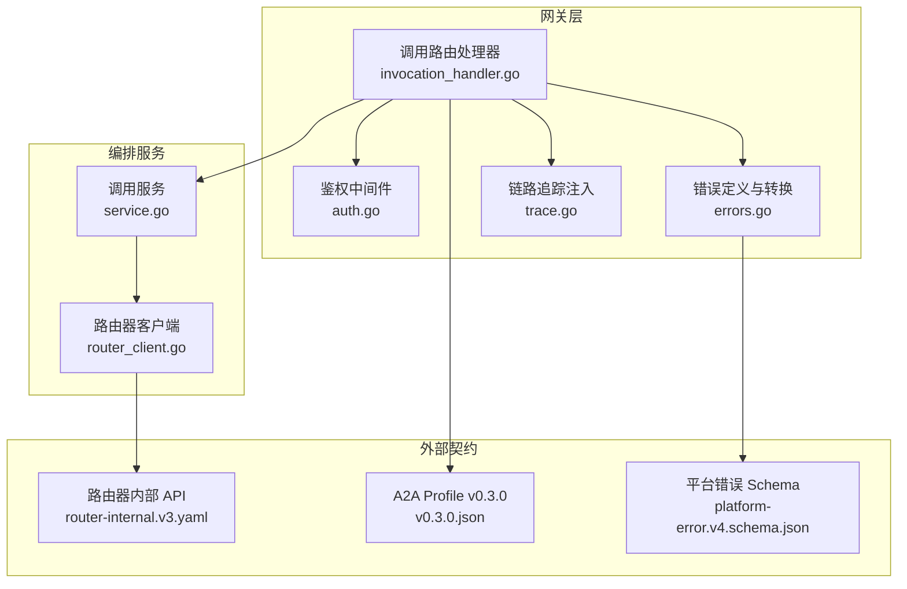
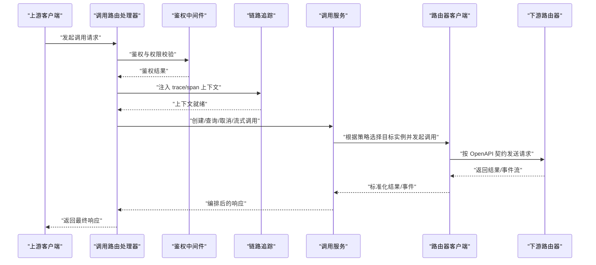
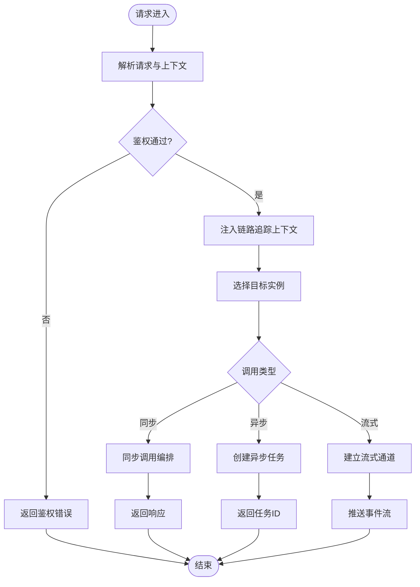
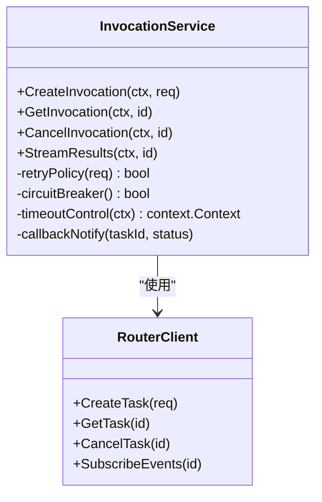
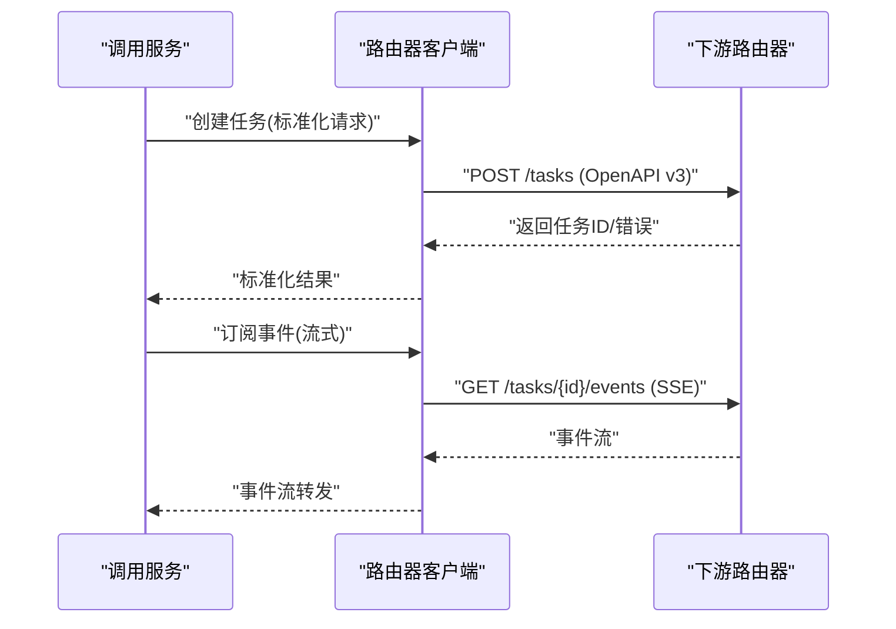
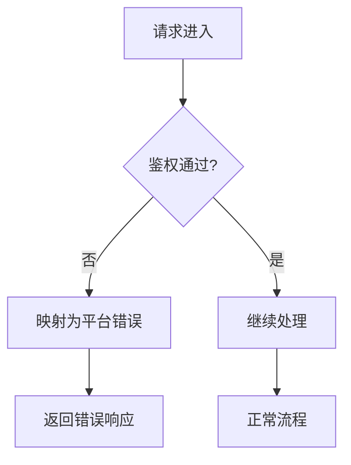
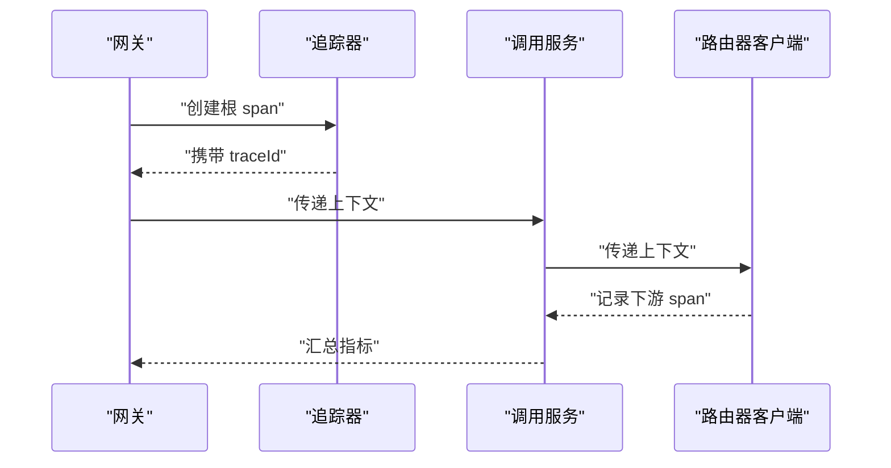
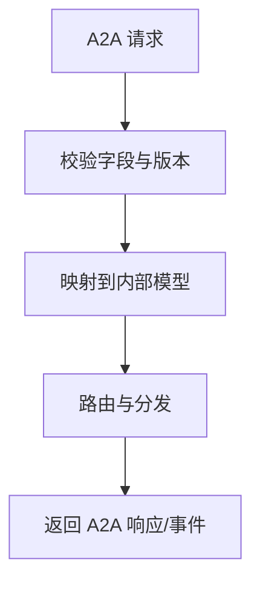
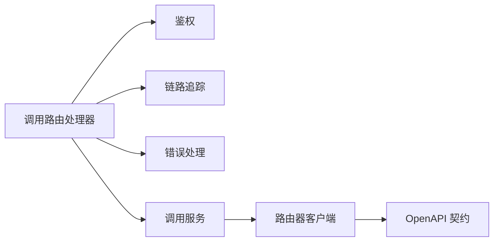

# 调用路由处理器

<cite>
**本文引用的文件**   
- [apps/control-plane/internal/gateway/invocation_handler.go](file://apps/control-plane/internal/gateway/invocation_handler.go)
- [apps/control-plane/internal/gateway/auth.go](file://apps/control-plane/internal/gateway/auth.go)
- [apps/control-plane/internal/gateway/errors.go](file://apps/control-plane/internal/gateway/errors.go)
- [apps/control-plane/internal/gateway/trace.go](file://apps/control-plane/internal/gateway/trace.go)
- [apps/control-plane/internal/invocation/service.go](file://apps/control-plane/internal/invocation/service.go)
- [apps/control-plane/internal/invocation/router_client.go](file://apps/control-plane/internal/invocation/router_client.go)
- [contracts/openapi/router-internal.v3.yaml](file://contracts/openapi/router-internal.v3.yaml)
- [contracts/a2a-profile/v0.3.0.json](file://contracts/a2a-profile/v0.3.0.json)
- [contracts/schemas/platform-error.v4.schema.json](file://contracts/schemas/platform-error.v4.schema.json)
</cite>

## 目录
1. [简介](#简介)
2. [项目结构](#项目结构)
3. [核心组件](#核心组件)
4. [架构总览](#架构总览)
5. [详细组件分析](#详细组件分析)
6. [依赖分析](#依赖分析)
7. [性能考虑](#性能考虑)
8. [故障排查指南](#故障排查指南)
9. [结论](#结论)
10. [附录](#附录)

## 简介
本技术文档聚焦于 NeKiro 网关层的“调用路由处理器”，围绕智能请求分发机制、A2A 协议消息处理与转发、异步调用流程（回调与状态跟踪）、超时控制、重试策略、熔断保护、链路追踪与监控指标，以及路由配置与故障排查进行系统化说明。目标是帮助开发者快速理解并正确使用该组件，同时为运维与排障提供可操作指引。

## 项目结构
NeKiro 的网关层位于 control-plane 内部，调用路由相关代码主要分布在 gateway 与 invocation 两个子包中：
- gateway 包负责 HTTP 入口、鉴权、错误封装、链路追踪以及与上层编排服务的交互。
- invocation 包负责调用生命周期管理、与下游路由器的通信、以及调用结果与事件的处理。

图表来源
- [apps/control-plane/internal/gateway/invocation_handler.go](file://apps/control-plane/internal/gateway/invocation_handler.go)
- [apps/control-plane/internal/gateway/auth.go](file://apps/control-plane/internal/gateway/auth.go)
- [apps/control-plane/internal/gateway/errors.go](file://apps/control-plane/internal/gateway/errors.go)
- [apps/control-plane/internal/gateway/trace.go](file://apps/control-plane/internal/gateway/trace.go)
- [apps/control-plane/internal/invocation/service.go](file://apps/control-plane/internal/invocation/service.go)
- [apps/control-plane/internal/invocation/router_client.go](file://apps/control-plane/internal/invocation/router_client.go)
- [contracts/openapi/router-internal.v3.yaml](file://contracts/openapi/router-internal.v3.yaml)
- [contracts/a2a-profile/v0.3.0.json](file://contracts/a2a-profile/v0.3.0.json)
- [contracts/schemas/platform-error.v4.schema.json](file://contracts/schemas/platform-error.v4.schema.json)

章节来源
- [apps/control-plane/internal/gateway/invocation_handler.go](file://apps/control-plane/internal/gateway/invocation_handler.go)
- [apps/control-plane/internal/gateway/auth.go](file://apps/control-plane/internal/gateway/auth.go)
- [apps/control-plane/internal/gateway/errors.go](file://apps/control-plane/internal/gateway/errors.go)
- [apps/control-plane/internal/gateway/trace.go](file://apps/control-plane/internal/gateway/trace.go)
- [apps/control-plane/internal/invocation/service.go](file://apps/control-plane/internal/invocation/service.go)
- [apps/control-plane/internal/invocation/router_client.go](file://apps/control-plane/internal/invocation/router_client.go)
- [contracts/openapi/router-internal.v3.yaml](file://contracts/openapi/router-internal.v3.yaml)
- [contracts/a2a-profile/v0.3.0.json](file://contracts/a2a-profile/v0.3.0.json)
- [contracts/schemas/platform-error.v4.schema.json](file://contracts/schemas/platform-error.v4.schema.json)

## 核心组件
- 调用路由处理器（HTTP 入口）
  - 职责：接收上游调用请求，完成鉴权、上下文注入、参数校验、路由决策、调用编排与响应组装。
  - 关键能力：负载均衡选择目标实例、故障转移、A2A 协议适配、异步任务管理与回调、超时与重试、熔断降级、链路追踪与指标上报。
- 调用服务（编排）
  - 职责：维护调用生命周期、协调路由器客户端、聚合结果与事件、驱动重试与熔断。
- 路由器客户端（下游通信）
  - 职责：基于 OpenAPI 契约与下游路由器通信，执行实际的任务创建、查询、取消与流式读取。
- 鉴权与错误处理
  - 职责：统一鉴权中间件、错误码映射与平台错误 Schema 对齐。
- 链路追踪
  - 职责：注入 trace/span 上下文，透传到下游，便于端到端观测。

章节来源
- [apps/control-plane/internal/gateway/invocation_handler.go](file://apps/control-plane/internal/gateway/invocation_handler.go)
- [apps/control-plane/internal/invocation/service.go](file://apps/control-plane/internal/invocation/service.go)
- [apps/control-plane/internal/invocation/router_client.go](file://apps/control-plane/internal/invocation/router_client.go)
- [apps/control-plane/internal/gateway/auth.go](file://apps/control-plane/internal/gateway/auth.go)
- [apps/control-plane/internal/gateway/errors.go](file://apps/control-plane/internal/gateway/errors.go)
- [apps/control-plane/internal/gateway/trace.go](file://apps/control-plane/internal/gateway/trace.go)

## 架构总览
调用路由处理器作为网关侧的统一入口，将来自外部的 A2A 或平台调用请求转换为内部统一的调用模型，并通过调用服务与路由器客户端协同完成智能分发与可靠交付。

图表来源
- [apps/control-plane/internal/gateway/invocation_handler.go](file://apps/control-plane/internal/gateway/invocation_handler.go)
- [apps/control-plane/internal/gateway/auth.go](file://apps/control-plane/internal/gateway/auth.go)
- [apps/control-plane/internal/gateway/trace.go](file://apps/control-plane/internal/gateway/trace.go)
- [apps/control-plane/internal/invocation/service.go](file://apps/control-plane/internal/invocation/service.go)
- [apps/control-plane/internal/invocation/router_client.go](file://apps/control-plane/internal/invocation/router_client.go)
- [contracts/openapi/router-internal.v3.yaml](file://contracts/openapi/router-internal.v3.yaml)

## 详细组件分析

### 调用路由处理器（HTTP 入口）
- 功能要点
  - 解析请求体与路径参数，提取调用上下文（工作区、身份、能力集）。
  - 通过鉴权中间件验证访问令牌与权限范围。
  - 注入链路追踪上下文，确保跨进程传播。
  - 根据路由策略（如按工作区、能力标签、权重等）选择目标实例。
  - 调用编排服务完成后续流程，包括异步任务创建、流式结果订阅、取消与查询。
  - 统一错误码与平台错误 Schema 对齐，保证对外一致性。
- 关键流程
  - 同步调用：请求进入 -> 鉴权 -> 追踪 -> 路由选择 -> 调用编排 -> 返回响应。
  - 异步调用：创建任务 -> 返回任务 ID -> 支持轮询/回调/事件流获取结果。
  - 流式调用：建立 SSE 或长连接，持续推送增量结果。
- 负载均衡算法
  - 常见策略：加权随机、最少活跃数、一致性哈希（按工作区或用户标识），可按配置动态切换。
- 故障转移策略
  - 健康检查失败自动剔除；主备切换；多副本下优先选择低延迟节点。
- 服务发现集成
  - 从注册中心拉取可用实例列表，结合权重与健康状态计算候选集合。
- A2A 协议适配
  - 将 A2A Profile 的消息结构与平台内部调用模型互转，保持语义一致。
- 异步调用与回调
  - 支持回调 URL 通知；在任务状态变更时触发回调；提供幂等与去重保障。
- 超时控制
  - 分层超时：网关层、编排层、下游层分别设置；整体超时以最短为准。
- 重试策略
  - 针对幂等接口启用指数退避重试；非幂等接口默认不重试；可配置最大次数与抖动。
- 熔断保护
  - 基于错误率/慢调用比例阈值开启熔断；半开探测恢复；熔断期间快速失败。
- 链路追踪与监控
  - 每个调用生成唯一 traceId；记录关键 span（鉴权、路由、IO、下游 RTT）；暴露 QPS、P99、错误率、熔断开关等指标。

图表来源
- [apps/control-plane/internal/gateway/invocation_handler.go](file://apps/control-plane/internal/gateway/invocation_handler.go)
- [apps/control-plane/internal/gateway/auth.go](file://apps/control-plane/internal/gateway/auth.go)
- [apps/control-plane/internal/gateway/trace.go](file://apps/control-plane/internal/gateway/trace.go)
- [apps/control-plane/internal/invocation/service.go](file://apps/control-plane/internal/invocation/service.go)
- [apps/control-plane/internal/invocation/router_client.go](file://apps/control-plane/internal/invocation/router_client.go)

章节来源
- [apps/control-plane/internal/gateway/invocation_handler.go](file://apps/control-plane/internal/gateway/invocation_handler.go)
- [apps/control-plane/internal/gateway/auth.go](file://apps/control-plane/internal/gateway/auth.go)
- [apps/control-plane/internal/gateway/trace.go](file://apps/control-plane/internal/gateway/trace.go)
- [apps/control-plane/internal/invocation/service.go](file://apps/control-plane/internal/invocation/service.go)
- [apps/control-plane/internal/invocation/router_client.go](file://apps/control-plane/internal/invocation/router_client.go)

### 调用服务（编排）
- 职责
  - 维护调用生命周期（创建、运行、完成、失败、取消）。
  - 协调路由器客户端执行具体调用，聚合结果与事件。
  - 实现重试、熔断、超时控制与降级策略。
- 数据流
  - 输入：标准化后的调用请求与上下文。
  - 输出：同步响应、任务 ID、事件流句柄。
- 关键逻辑
  - 重试：对幂等接口采用指数退避与抖动；记录重试次数与原因。
  - 熔断：统计错误率与慢调用比例，达到阈值后短路；半开探测逐步恢复。
  - 超时：区分读超时与写超时；支持整体与分阶段超时。
  - 回调：任务状态变更时异步通知回调地址，保证幂等与去重。

图表来源
- [apps/control-plane/internal/invocation/service.go](file://apps/control-plane/internal/invocation/service.go)
- [apps/control-plane/internal/invocation/router_client.go](file://apps/control-plane/internal/invocation/router_client.go)

章节来源
- [apps/control-plane/internal/invocation/service.go](file://apps/control-plane/internal/invocation/service.go)
- [apps/control-plane/internal/invocation/router_client.go](file://apps/control-plane/internal/invocation/router_client.go)

### 路由器客户端（下游通信）
- 职责
  - 基于 OpenAPI 契约与下游路由器通信，执行任务创建、查询、取消与事件订阅。
  - 负责序列化/反序列化、错误码映射与重试边界。
- 契约对齐
  - 严格遵循 router-internal.v3.yaml 定义的接口与字段约束。
  - 与 A2A Profile v0.3.0 的消息结构保持一致性映射。

图表来源
- [apps/control-plane/internal/invocation/router_client.go](file://apps/control-plane/internal/invocation/router_client.go)
- [contracts/openapi/router-internal.v3.yaml](file://contracts/openapi/router-internal.v3.yaml)

章节来源
- [apps/control-plane/internal/invocation/router_client.go](file://apps/control-plane/internal/invocation/router_client.go)
- [contracts/openapi/router-internal.v3.yaml](file://contracts/openapi/router-internal.v3.yaml)

### 鉴权与错误处理
- 鉴权中间件
  - 校验访问令牌、作用域与工作区权限；拒绝非法请求。
- 错误处理
  - 统一错误码映射到平台错误 Schema（platform-error.v4.schema.json）。
  - 区分业务错误与系统错误，提供可观测性与告警依据。

图表来源
- [apps/control-plane/internal/gateway/auth.go](file://apps/control-plane/internal/gateway/auth.go)
- [apps/control-plane/internal/gateway/errors.go](file://apps/control-plane/internal/gateway/errors.go)
- [contracts/schemas/platform-error.v4.schema.json](file://contracts/schemas/platform-error.v4.schema.json)

章节来源
- [apps/control-plane/internal/gateway/auth.go](file://apps/control-plane/internal/gateway/auth.go)
- [apps/control-plane/internal/gateway/errors.go](file://apps/control-plane/internal/gateway/errors.go)
- [contracts/schemas/platform-error.v4.schema.json](file://contracts/schemas/platform-error.v4.schema.json)

### 链路追踪
- 注入点
  - 在网关入口处生成 traceId 并注入 span，透传到下游路由器与后端服务。
- 观测指标
  - 记录各阶段耗时、错误分类、重试次数、熔断状态等。
- 关联关系
  - 通过 correlationId 与 taskRootId 关联上下游事件与结果。

图表来源
- [apps/control-plane/internal/gateway/trace.go](file://apps/control-plane/internal/gateway/trace.go)
- [apps/control-plane/internal/invocation/service.go](file://apps/control-plane/internal/invocation/service.go)
- [apps/control-plane/internal/invocation/router_client.go](file://apps/control-plane/internal/invocation/router_client.go)

章节来源
- [apps/control-plane/internal/gateway/trace.go](file://apps/control-plane/internal/gateway/trace.go)
- [apps/control-plane/internal/invocation/service.go](file://apps/control-plane/internal/invocation/service.go)
- [apps/control-plane/internal/invocation/router_client.go](file://apps/control-plane/internal/invocation/router_client.go)

### A2A 协议消息处理与转发
- 消息格式转换
  - 将 A2A Profile v0.3.0 的请求/响应结构映射到平台内部调用模型，保持语义一致。
- 协议适配
  - 支持任务创建、查询、取消与事件流；对无效或缺失字段进行校验与提示。
- 兼容性
  - 遵循 profile 版本约束，提供向后兼容策略与弃用字段处理。

图表来源
- [contracts/a2a-profile/v0.3.0.json](file://contracts/a2a-profile/v0.3.0.json)
- [apps/control-plane/internal/gateway/invocation_handler.go](file://apps/control-plane/internal/gateway/invocation_handler.go)

章节来源
- [contracts/a2a-profile/v0.3.0.json](file://contracts/a2a-profile/v0.3.0.json)
- [apps/control-plane/internal/gateway/invocation_handler.go](file://apps/control-plane/internal/gateway/invocation_handler.go)

## 依赖分析
- 组件耦合
  - 调用路由处理器依赖鉴权、追踪与错误处理模块；编排服务依赖路由器客户端。
  - 路由器客户端强依赖 OpenAPI 契约，确保接口稳定性。
- 外部依赖
  - 服务发现与注册中心（用于实例列表与健康检查）。
  - 指标与追踪后端（Prometheus、OpenTelemetry 等）。
- 潜在循环依赖
  - 当前结构清晰，未见循环导入；建议保持单向依赖（gateway -> invocation -> router_client）。

图表来源
- [apps/control-plane/internal/gateway/invocation_handler.go](file://apps/control-plane/internal/gateway/invocation_handler.go)
- [apps/control-plane/internal/gateway/auth.go](file://apps/control-plane/internal/gateway/auth.go)
- [apps/control-plane/internal/gateway/trace.go](file://apps/control-plane/internal/gateway/trace.go)
- [apps/control-plane/internal/gateway/errors.go](file://apps/control-plane/internal/gateway/errors.go)
- [apps/control-plane/internal/invocation/service.go](file://apps/control-plane/internal/invocation/service.go)
- [apps/control-plane/internal/invocation/router_client.go](file://apps/control-plane/internal/invocation/router_client.go)
- [contracts/openapi/router-internal.v3.yaml](file://contracts/openapi/router-internal.v3.yaml)

章节来源
- [apps/control-plane/internal/gateway/invocation_handler.go](file://apps/control-plane/internal/gateway/invocation_handler.go)
- [apps/control-plane/internal/invocation/service.go](file://apps/control-plane/internal/invocation/service.go)
- [apps/control-plane/internal/invocation/router_client.go](file://apps/control-plane/internal/invocation/router_client.go)
- [contracts/openapi/router-internal.v3.yaml](file://contracts/openapi/router-internal.v3.yaml)

## 性能考虑
- 负载均衡
  - 优先选择低延迟与高健康度实例；避免热点倾斜。
- 超时与重试
  - 合理设置分层超时；幂等接口谨慎重试，避免雪崩。
- 熔断与降级
  - 动态阈值调整；熔断期间返回友好降级响应。
- 资源隔离
  - 按工作区或租户隔离线程池与连接池，防止相互影响。
- 缓存与预取
  - 对只读元数据（如实例清单）进行短期缓存，降低注册中心压力。

[本节为通用性能指导，无需特定文件引用]

## 故障排查指南
- 常见问题
  - 鉴权失败：检查令牌与作用域、工作区权限。
  - 路由失败：确认服务发现健康状态与权重配置。
  - 超时与重试：查看下游 RTT 与重试日志，评估是否需调优。
  - 熔断触发：观察错误率与慢调用比例，定位异常实例。
- 观测手段
  - 使用 traceId 串联全链路日志与指标。
  - 关注错误码与平台错误 Schema 的一致性。
- 回滚与恢复
  - 快速下线异常实例；逐步恢复流量；必要时启用降级策略。

章节来源
- [apps/control-plane/internal/gateway/errors.go](file://apps/control-plane/internal/gateway/errors.go)
- [contracts/schemas/platform-error.v4.schema.json](file://contracts/schemas/platform-error.v4.schema.json)

## 结论
调用路由处理器作为网关层的核心枢纽，实现了智能分发、协议适配、异步编排与可靠性保障。通过清晰的组件划分与契约约束，系统在可扩展性与可观测性方面具备良好基础。建议在生产环境中完善指标采集与告警规则，持续优化负载均衡与熔断策略，以提升整体稳定性与用户体验。

[本节为总结性内容，无需特定文件引用]

## 附录
- 路由配置示例（概念性）
  - 负载均衡策略：加权随机、最少活跃数、一致性哈希。
  - 故障转移：健康检查间隔、剔除阈值、恢复策略。
  - 超时与重试：分层超时、幂等判定、退避与抖动。
  - 熔断：错误率阈值、慢调用比例、半开探测窗口。
  - 回调：URL 白名单、幂等键、重试上限。
- A2A 协议参考
  - 消息结构、事件流与错误码规范参见 A2A Profile v0.3.0。

[本节为概念性附录，无需特定文件引用]