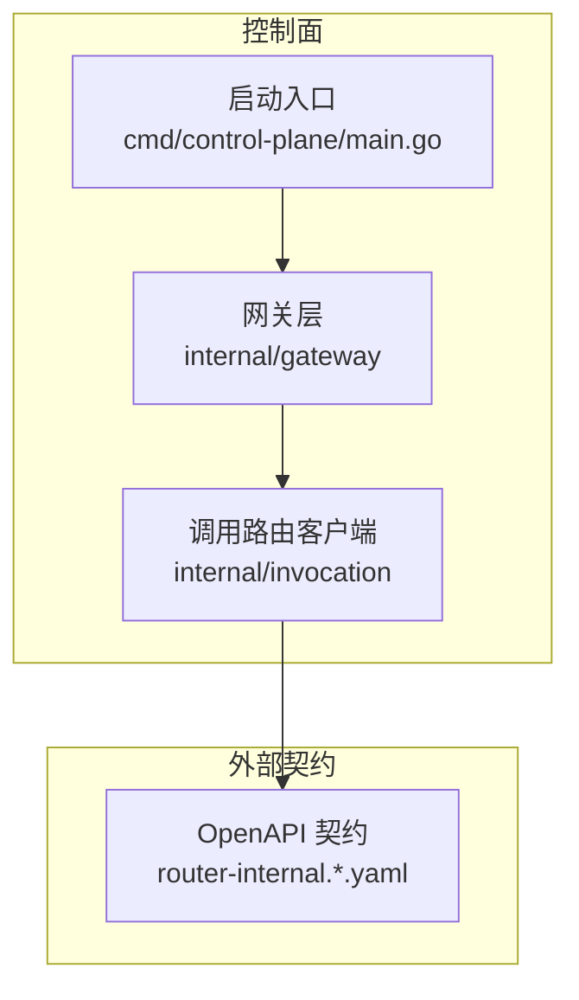
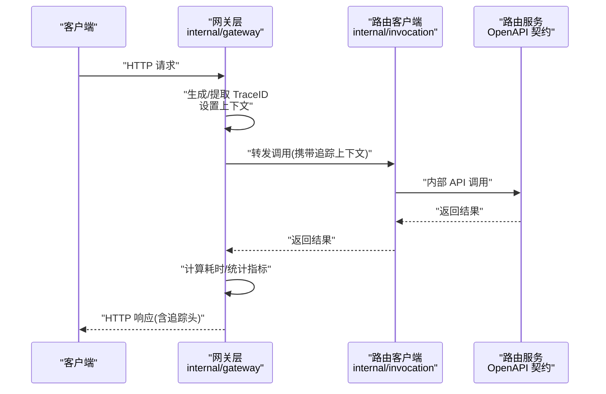
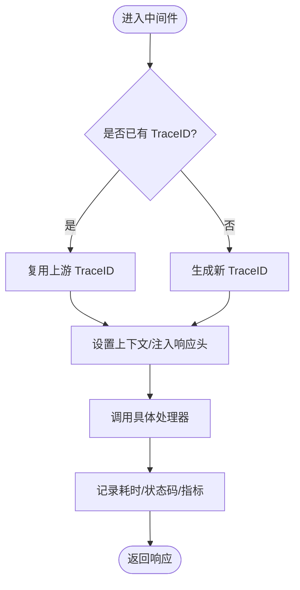
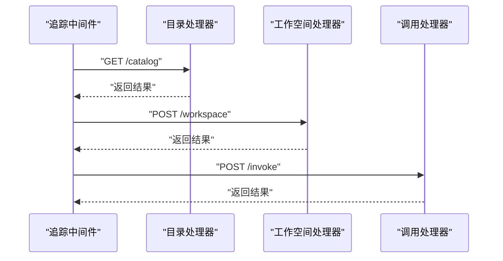
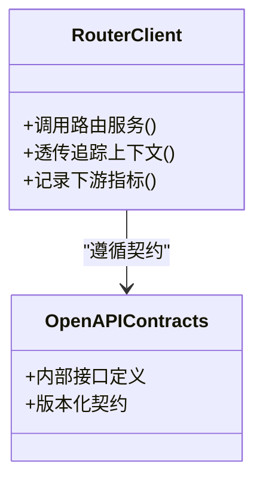
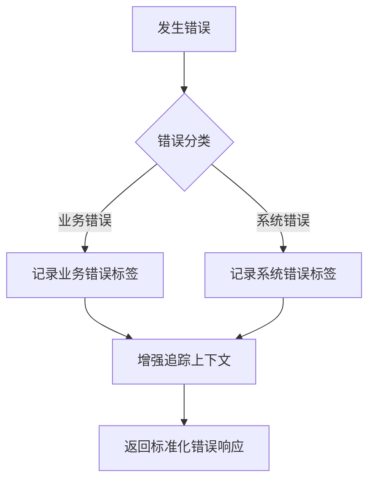
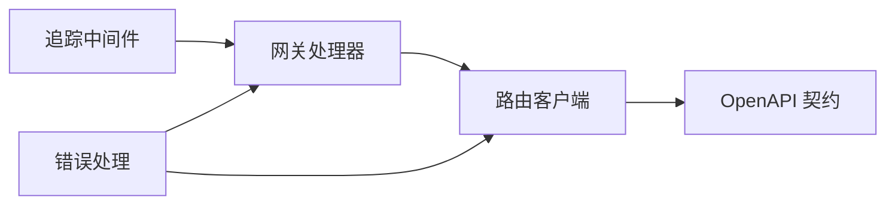

# 追踪监控

<cite>
**本文引用的文件**   
- [apps/control-plane/internal/gateway/trace.go](file://apps/control-plane/internal/gateway/trace.go)
- [apps/control-plane/internal/gateway/auth.go](file://apps/control-plane/internal/gateway/auth.go)
- [apps/control-plane/internal/gateway/catalog_handler.go](file://apps/control-plane/internal/gateway/catalog_handler.go)
- [apps/control-plane/internal/gateway/errors.go](file://apps/control-plane/internal/gateway/errors.go)
- [apps/control-plane/internal/gateway/invocation_handler.go](file://apps/control-plane/internal/gateway/invocation_handler.go)
- [apps/control-plane/internal/gateway/workspace_handler.go](file://apps/control-plane/internal/gateway/workspace_handler.go)
- [apps/control-plane/internal/invocation/router_client.go](file://apps/control-plane/internal/invocation/router_client.go)
- [apps/control-plane/cmd/control-plane/main.go](file://apps/control-plane/cmd/control-plane/main.go)
- [contracts/openapi/router-internal.v1.yaml](file://contracts/openapi/router-internal.v1.yaml)
- [contracts/openapi/router-internal.v2.yaml](file://contracts/openapi/router-internal.v2.yaml)
- [contracts/openapi/router-internal.v3.yaml](file://contracts/openapi/router-internal.v3.yaml)
</cite>

## 目录
1. [简介](#简介)
2. [项目结构](#项目结构)
3. [核心组件](#核心组件)
4. [架构总览](#架构总览)
5. [详细组件分析](#详细组件分析)
6. [依赖分析](#依赖分析)
7. [性能考虑](#性能考虑)
8. [故障诊断指南](#故障诊断指南)
9. [结论](#结论)
10. [附录](#附录)

## 简介
本技术文档聚焦 NeKiro 网关层的分布式追踪与监控能力，围绕以下目标展开：
- 分布式追踪集成方案：Trace ID 的生成、注入与跨服务传播机制。
- 请求链路追踪流程：从入口到各微服务的调用关系与上下文传递。
- 关键性能指标（KPI）收集与上报：响应时间、吞吐量、错误率等。
- 结构化日志规范与采集策略。
- 监控告警配置规则与阈值建议。
- 追踪数据可视化与分析工具集成。
- 性能瓶颈定位与故障诊断实践。

## 项目结构
NeKiro 控制面位于 apps/control-plane 下，网关层在 internal/gateway，路由客户端在 internal/invocation，对外 API 契约定义在 contracts/openapi。追踪相关实现集中在网关中间件与 HTTP 处理器中，并通过内部 OpenAPI 契约与下游路由服务交互。

图表来源
- [apps/control-plane/cmd/control-plane/main.go](file://apps/control-plane/cmd/control-plane/main.go)
- [apps/control-plane/internal/gateway/trace.go](file://apps/control-plane/internal/gateway/trace.go)
- [apps/control-plane/internal/invocation/router_client.go](file://apps/control-plane/internal/invocation/router_client.go)
- [contracts/openapi/router-internal.v1.yaml](file://contracts/openapi/router-internal.v1.yaml)

章节来源
- [apps/control-plane/cmd/control-plane/main.go](file://apps/control-plane/cmd/control-plane/main.go)
- [apps/control-plane/internal/gateway/trace.go](file://apps/control-plane/internal/gateway/trace.go)
- [apps/control-plane/internal/invocation/router_client.go](file://apps/control-plane/internal/invocation/router_client.go)
- [contracts/openapi/router-internal.v1.yaml](file://contracts/openapi/router-internal.v1.yaml)

## 核心组件
- 追踪中间件：负责为每个请求生成或提取 Trace ID，注入响应头，并记录请求/响应的关键信息。
- 网关处理器：对目录、工作空间、调用等接口进行统一处理，并在进入/退出时埋点。
- 路由客户端：向下游路由服务发起调用，透传追踪上下文。
- 错误处理：标准化错误码与消息，便于追踪与告警聚合。

章节来源
- [apps/control-plane/internal/gateway/trace.go](file://apps/control-plane/internal/gateway/trace.go)
- [apps/control-plane/internal/gateway/catalog_handler.go](file://apps/control-plane/internal/gateway/catalog_handler.go)
- [apps/control-plane/internal/gateway/workspace_handler.go](file://apps/control-plane/internal/gateway/workspace_handler.go)
- [apps/control-plane/internal/gateway/invocation_handler.go](file://apps/control-plane/internal/gateway/invocation_handler.go)
- [apps/control-plane/internal/gateway/errors.go](file://apps/control-plane/internal/gateway/errors.go)
- [apps/control-plane/internal/invocation/router_client.go](file://apps/control-plane/internal/invocation/router_client.go)

## 架构总览
下图展示了从客户端到网关再到下游路由服务的完整追踪链路，包括 Trace ID 的生成、传播与响应头的回写。

图表来源
- [apps/control-plane/internal/gateway/trace.go](file://apps/control-plane/internal/gateway/trace.go)
- [apps/control-plane/internal/invocation/router_client.go](file://apps/control-plane/internal/invocation/router_client.go)
- [contracts/openapi/router-internal.v1.yaml](file://contracts/openapi/router-internal.v1.yaml)

## 详细组件分析

### 追踪中间件（Trace Middleware）
职责
- 请求进入时生成或复用上游传入的 Trace ID。
- 将 Trace ID 写入响应头，确保端到端可观测。
- 记录请求方法、路径、状态码、耗时等关键指标。
- 提供结构化日志输出，便于集中采集与检索。

关键设计要点
- 若上游已携带追踪上下文，则优先复用；否则生成新的唯一标识。
- 使用统一的响应头键名，避免与业务字段冲突。
- 通过中间件模式保证所有处理器自动具备追踪能力。

图表来源
- [apps/control-plane/internal/gateway/trace.go](file://apps/control-plane/internal/gateway/trace.go)

章节来源
- [apps/control-plane/internal/gateway/trace.go](file://apps/control-plane/internal/gateway/trace.go)

### 网关处理器（Catalog / Workspace / Invocation）
职责
- 解析请求参数、鉴权校验、调用领域服务。
- 在处理器入口处记录开始时间，出口处记录结束时间与状态码。
- 结合中间件输出的追踪上下文，形成完整的链路片段。

典型流程
- Catalog 处理器：读取目录信息，记录查询耗时与缓存命中情况。
- Workspace 处理器：管理工作空间生命周期，记录变更操作与错误分支。
- Invocation 处理器：编排调用路由，透传追踪上下文至下游。

图表来源
- [apps/control-plane/internal/gateway/catalog_handler.go](file://apps/control-plane/internal/gateway/catalog_handler.go)
- [apps/control-plane/internal/gateway/workspace_handler.go](file://apps/control-plane/internal/gateway/workspace_handler.go)
- [apps/control-plane/internal/gateway/invocation_handler.go](file://apps/control-plane/internal/gateway/invocation_handler.go)

章节来源
- [apps/control-plane/internal/gateway/catalog_handler.go](file://apps/control-plane/internal/gateway/catalog_handler.go)
- [apps/control-plane/internal/gateway/workspace_handler.go](file://apps/control-plane/internal/gateway/workspace_handler.go)
- [apps/control-plane/internal/gateway/invocation_handler.go](file://apps/control-plane/internal/gateway/invocation_handler.go)

### 路由客户端（Router Client）
职责
- 封装对下游路由服务的 HTTP 调用。
- 透传追踪上下文（如 Trace ID），确保链路贯通。
- 记录下游调用耗时、重试次数与错误类型。

图表来源
- [apps/control-plane/internal/invocation/router_client.go](file://apps/control-plane/internal/invocation/router_client.go)
- [contracts/openapi/router-internal.v1.yaml](file://contracts/openapi/router-internal.v1.yaml)
- [contracts/openapi/router-internal.v2.yaml](file://contracts/openapi/router-internal.v2.yaml)
- [contracts/openapi/router-internal.v3.yaml](file://contracts/openapi/router-internal.v3.yaml)

章节来源
- [apps/control-plane/internal/invocation/router_client.go](file://apps/control-plane/internal/invocation/router_client.go)
- [contracts/openapi/router-internal.v1.yaml](file://contracts/openapi/router-internal.v1.yaml)
- [contracts/openapi/router-internal.v2.yaml](file://contracts/openapi/router-internal.v2.yaml)
- [contracts/openapi/router-internal.v3.yaml](file://contracts/openapi/router-internal.v3.yaml)

### 错误处理（Errors）
职责
- 统一错误码与消息格式，便于追踪与告警聚合。
- 区分业务错误与系统错误，支持不同告警策略。
- 在追踪上下文中附加错误标签，提升排障效率。

图表来源
- [apps/control-plane/internal/gateway/errors.go](file://apps/control-plane/internal/gateway/errors.go)

章节来源
- [apps/control-plane/internal/gateway/errors.go](file://apps/control-plane/internal/gateway/errors.go)

## 依赖分析
- 中间件与处理器耦合度低：通过中间件注入上下文，处理器无需感知追踪细节。
- 路由客户端与 OpenAPI 契约强绑定：确保内部接口稳定演进。
- 错误处理模块被多处引用：统一错误语义，降低重复实现。

图表来源
- [apps/control-plane/internal/gateway/trace.go](file://apps/control-plane/internal/gateway/trace.go)
- [apps/control-plane/internal/gateway/catalog_handler.go](file://apps/control-plane/internal/gateway/catalog_handler.go)
- [apps/control-plane/internal/gateway/workspace_handler.go](file://apps/control-plane/internal/gateway/workspace_handler.go)
- [apps/control-plane/internal/gateway/invocation_handler.go](file://apps/control-plane/internal/gateway/invocation_handler.go)
- [apps/control-plane/internal/invocation/router_client.go](file://apps/control-plane/internal/invocation/router_client.go)
- [apps/control-plane/internal/gateway/errors.go](file://apps/control-plane/internal/gateway/errors.go)
- [contracts/openapi/router-internal.v1.yaml](file://contracts/openapi/router-internal.v1.yaml)

章节来源
- [apps/control-plane/internal/gateway/trace.go](file://apps/control-plane/internal/gateway/trace.go)
- [apps/control-plane/internal/gateway/catalog_handler.go](file://apps/control-plane/internal/gateway/catalog_handler.go)
- [apps/control-plane/internal/gateway/workspace_handler.go](file://apps/control-plane/internal/gateway/workspace_handler.go)
- [apps/control-plane/internal/gateway/invocation_handler.go](file://apps/control-plane/internal/gateway/invocation_handler.go)
- [apps/control-plane/internal/invocation/router_client.go](file://apps/control-plane/internal/invocation/router_client.go)
- [apps/control-plane/internal/gateway/errors.go](file://apps/control-plane/internal/gateway/errors.go)
- [contracts/openapi/router-internal.v1.yaml](file://contracts/openapi/router-internal.v1.yaml)

## 性能考虑
- 指标采集开销最小化：仅记录必要字段，避免在热路径中进行复杂计算。
- 异步上报：将指标与日志上报解耦，减少主流程延迟。
- 采样策略：在高流量场景下采用分层采样，平衡成本与可观测性。
- 超时与熔断：对下游调用设置合理超时与重试上限，防止雪崩。
- 资源隔离：为追踪与监控组件分配独立资源，避免影响核心业务。

[本节为通用指导，不直接分析具体文件]

## 故障诊断指南
- 基于 Trace ID 的全链路检索：在网关与下游服务中使用同一 Trace ID 串联日志与指标。
- 错误分类与告警：根据错误类型设置不同告警级别，快速定位问题范围。
- 慢请求定位：关注 P95/P99 延迟分布，结合热点接口与下游依赖进行根因分析。
- 容量与限流：观察吞吐与队列长度，识别容量瓶颈与限流触发点。
- 回归验证：发布后对比关键指标基线，及时发现异常波动。

[本节为通用指导，不直接分析具体文件]

## 结论
通过统一的追踪中间件、标准化的错误处理与稳定的内部契约，NeKiro 网关层实现了端到端的分布式追踪与基础监控能力。建议在后续迭代中完善指标上报通道、告警规则与可视化看板，进一步提升可观测性与运维效率。

[本节为总结性内容，不直接分析具体文件]

## 附录

### 结构化日志规范（建议）
- 字段建议：时间戳、Trace ID、Span ID、服务名、实例 ID、请求方法、路径、状态码、耗时、错误码、错误消息、用户/租户标识（可选）。
- 格式建议：JSON 行式输出，便于集中采集与索引。
- 敏感信息脱敏：避免记录密码、密钥、个人身份信息。

[本节为通用规范建议，不直接分析具体文件]

### 监控告警配置规则（建议）
- 错误率：超过阈值（如 1%）持续 N 分钟触发告警。
- 延迟：P95/P99 超过阈值（如 500ms/1s）持续 N 分钟触发告警。
- 吞吐：低于预期阈值的百分比（如 80%）持续 N 分钟触发告警。
- 资源：CPU/内存/连接池使用率超过阈值触发告警。

[本节为通用配置建议，不直接分析具体文件]

### 可视化与分析工具集成（建议）
- 日志：ELK/Opensearch/Loki 等集中式日志平台。
- 指标：Prometheus/Grafana 等时序数据库与可视化面板。
- 追踪：Jaeger/Zipkin/OpenTelemetry Collector 等链路追踪后端。
- 告警：Alertmanager/企业 IM/邮件/短信等多渠道通知。

[本节为通用工具建议，不直接分析具体文件]