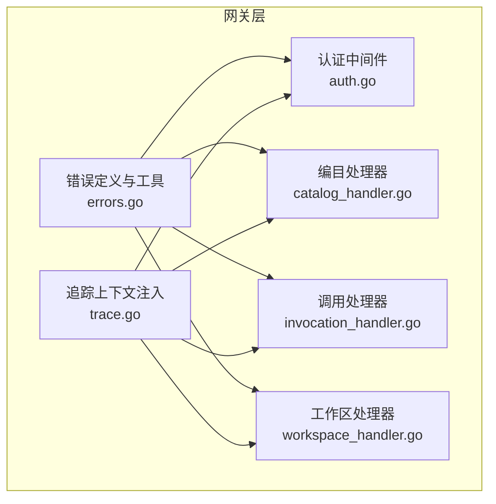
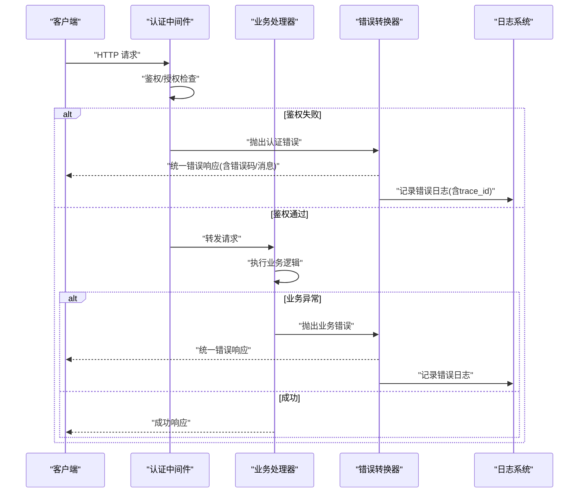
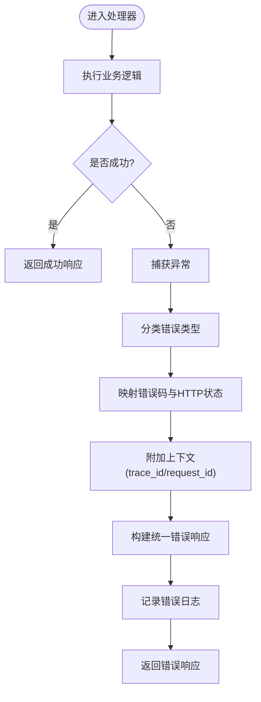
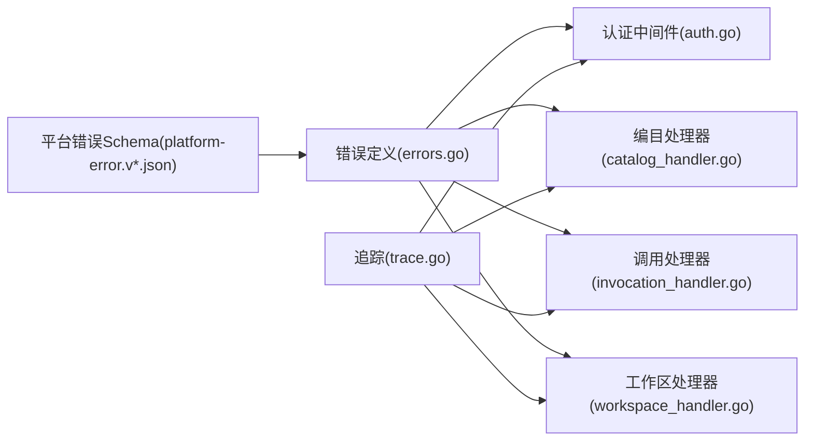

# 错误处理机制

<cite>
**本文引用的文件**   
- [errors.go](file://apps/control-plane/internal/gateway/errors.go)
- [auth.go](file://apps/control-plane/internal/gateway/auth.go)
- [catalog_handler.go](file://apps/control-plane/internal/gateway/catalog_handler.go)
- [invocation_handler.go](file://apps/control-plane/internal/gateway/invocation_handler.go)
- [workspace_handler.go](file://apps/control-plane/internal/gateway/workspace_handler.go)
- [trace.go](file://apps/control-plane/internal/gateway/trace.go)
- [platform-error.v1.schema.json](file://contracts/schemas/platform-error.v1.schema.json)
- [platform-error.v2.schema.json](file://contracts/schemas/platform-error.v2.schema.json)
- [platform-error.v3.schema.json](file://contracts/schemas/platform-error.v3.schema.json)
- [platform-error.v4.schema.json](file://contracts/schemas/platform-error.v4.schema.json)
</cite>

## 目录
1. [简介](#简介)
2. [项目结构](#项目结构)
3. [核心组件](#核心组件)
4. [架构总览](#架构总览)
5. [详细组件分析](#详细组件分析)
6. [依赖分析](#依赖分析)
7. [性能考虑](#性能考虑)
8. [故障排查指南](#故障排查指南)
9. [结论](#结论)
10. [附录](#附录)

## 简介
本文件聚焦 NeKiro 网关层的错误处理机制，目标是：
- 统一错误响应格式的设计原则与结构定义
- 错误类型分类与处理策略（业务错误、系统错误、网络错误）
- 错误码命名规范与层次结构
- 异常捕获与转换流程，确保上层服务异常正确映射到 HTTP 响应
- 错误日志记录标准与调试信息输出格式
- 中间件实现与自定义错误类型的使用示例
- 错误排查与调试最佳实践

## 项目结构
NeKiro 控制面网关位于 apps/control-plane/internal/gateway 目录。错误处理相关代码集中在 errors.go，并在各处理器中通过中间件或显式调用进行使用。

图表来源
- [errors.go](file://apps/control-plane/internal/gateway/errors.go)
- [auth.go](file://apps/control-plane/internal/gateway/auth.go)
- [catalog_handler.go](file://apps/control-plane/internal/gateway/catalog_handler.go)
- [invocation_handler.go](file://apps/control-plane/internal/gateway/invocation_handler.go)
- [workspace_handler.go](file://apps/control-plane/internal/gateway/workspace_handler.go)
- [trace.go](file://apps/control-plane/internal/gateway/trace.go)

章节来源
- [errors.go](file://apps/control-plane/internal/gateway/errors.go)
- [auth.go](file://apps/control-plane/internal/gateway/auth.go)
- [catalog_handler.go](file://apps/control-plane/internal/gateway/catalog_handler.go)
- [invocation_handler.go](file://apps/control-plane/internal/gateway/invocation_handler.go)
- [workspace_handler.go](file://apps/control-plane/internal/gateway/workspace_handler.go)
- [trace.go](file://apps/control-plane/internal/gateway/trace.go)

## 核心组件
- 统一错误响应模型：遵循 contracts/schemas 下的 platform-error.*.schema.json 定义的 JSON Schema，保证对外错误体结构稳定、可演进。
- 错误类型与错误码：在 gateway/errors.go 中集中定义错误类别、错误码前缀与层级，便于跨模块复用与一致性。
- 中间件与处理器集成：认证中间件与各业务处理器在入口处捕获异常并转换为统一错误响应；追踪上下文贯穿请求链路，便于关联日志与错误。

章节来源
- [errors.go](file://apps/control-plane/internal/gateway/errors.go)
- [platform-error.v1.schema.json](file://contracts/schemas/platform-error.v1.schema.json)
- [platform-error.v2.schema.json](file://contracts/schemas/platform-error.v2.schema.json)
- [platform-error.v3.schema.json](file://contracts/schemas/platform-error.v3.schema.json)
- [platform-error.v4.schema.json](file://contracts/schemas/platform-error.v4.schema.json)

## 架构总览
网关层错误处理的关键路径：
- 请求进入后，先经过认证中间件，再路由至具体处理器
- 任何阶段抛出的异常都会被统一捕获，转换为符合 platform-error schema 的响应
- 错误日志伴随 trace_id 等上下文信息输出，便于定位问题

图表来源
- [auth.go](file://apps/control-plane/internal/gateway/auth.go)
- [catalog_handler.go](file://apps/control-plane/internal/gateway/catalog_handler.go)
- [invocation_handler.go](file://apps/control-plane/internal/gateway/invocation_handler.go)
- [workspace_handler.go](file://apps/control-plane/internal/gateway/workspace_handler.go)
- [errors.go](file://apps/control-plane/internal/gateway/errors.go)

## 详细组件分析

### 统一错误响应格式
- 设计原则
  - 稳定性：字段名与语义长期不变，新增字段需向后兼容
  - 可读性：面向人类与机器双读友好，包含错误码、消息、可选详情
  - 可观测性：携带 trace_id、request_id 等上下文，便于全链路追踪
  - 可扩展性：通过 schema 版本化演进，避免破坏现有消费者
- 结构定义
  - 参考 contracts/schemas 下 platform-error.v*.schema.json 的版本化定义，建议采用最新稳定版作为默认契约
  - 典型字段包括：错误码、消息、时间戳、请求标识、可选的错误详情数组
- 版本演进
  - 新增字段时保持旧字段可用，禁止删除已有字段
  - 通过版本号区分不兼容变更，消费者按能力选择版本

章节来源
- [platform-error.v1.schema.json](file://contracts/schemas/platform-error.v1.schema.json)
- [platform-error.v2.schema.json](file://contracts/schemas/platform-error.v2.schema.json)
- [platform-error.v3.schema.json](file://contracts/schemas/platform-error.v3.schema.json)
- [platform-error.v4.schema.json](file://contracts/schemas/platform-error.v4.schema.json)

### 错误类型与错误码规范
- 错误类型分类
  - 业务错误：参数校验失败、资源不存在、权限不足等
  - 系统错误：内部计算异常、状态不一致、不可恢复的内部错误
  - 网络错误：上游超时、连接失败、DNS 解析失败等
- 错误码命名规范
  - 采用“模块_子域_错误”三段式，如 GATEWAY_AUTH_INVALID_TOKEN
  - 前缀固定为模块级（如 GATEWAY），便于快速识别来源
  - 子域细化到功能域（如 AUTH、CATALOG、INVOCATION、WORKSPACE）
  - 错误名使用大写加下划线，语义清晰且唯一
- 层次结构
  - 一级：模块（GATEWAY）
  - 二级：子域（AUTH、CATALOG、INVOCATION、WORKSPACE）
  - 三级：具体错误（INVALID_TOKEN、NOT_FOUND、INTERNAL_ERROR 等）
- 错误码与 HTTP 状态码映射
  - 业务错误通常映射 4xx（如 400、401、403、404）
  - 系统错误映射 5xx（如 500、503）
  - 网络错误根据场景映射 4xx 或 5xx（如上游超时 504）

章节来源
- [errors.go](file://apps/control-plane/internal/gateway/errors.go)

### 异常捕获与转换流程
- 入口拦截
  - 认证中间件在鉴权阶段捕获异常并转换为统一错误响应
  - 各业务处理器在执行前后包裹 try/catch 或等效机制，捕获异常并转换
- 转换规则
  - 将领域异常映射为标准错误对象（包含错误码、消息、详情）
  - 附加 trace_id、request_id 等上下文
  - 根据错误类型选择合适 HTTP 状态码
- 日志记录
  - 所有错误均记录结构化日志，包含错误码、消息、堆栈摘要、上下文
  - 敏感信息脱敏（如令牌、密钥）

图表来源
- [auth.go](file://apps/control-plane/internal/gateway/auth.go)
- [catalog_handler.go](file://apps/control-plane/internal/gateway/catalog_handler.go)
- [invocation_handler.go](file://apps/control-plane/internal/gateway/invocation_handler.go)
- [workspace_handler.go](file://apps/control-plane/internal/gateway/workspace_handler.go)
- [errors.go](file://apps/control-plane/internal/gateway/errors.go)

章节来源
- [auth.go](file://apps/control-plane/internal/gateway/auth.go)
- [catalog_handler.go](file://apps/control-plane/internal/gateway/catalog_handler.go)
- [invocation_handler.go](file://apps/control-plane/internal/gateway/invocation_handler.go)
- [workspace_handler.go](file://apps/control-plane/internal/gateway/workspace_handler.go)
- [errors.go](file://apps/control-plane/internal/gateway/errors.go)

### 中间件与自定义错误类型
- 认证中间件
  - 负责鉴权与授权，失败时抛出认证错误并返回 401/403
  - 结合追踪上下文注入 trace_id，便于后续日志关联
- 自定义错误类型
  - 在 errors.go 中定义通用错误类型与构造器
  - 提供便捷方法用于创建常见错误（如参数错误、未找到、内部错误）
- 使用示例（说明性）
  - 在处理器中直接返回自定义错误对象，由统一转换层生成响应
  - 在中间件中捕获底层异常并转换为业务错误

章节来源
- [auth.go](file://apps/control-plane/internal/gateway/auth.go)
- [errors.go](file://apps/control-plane/internal/gateway/errors.go)

### 追踪与调试信息
- 追踪上下文
  - 通过 trace.go 注入 trace_id 到请求上下文，贯穿中间件与处理器
- 调试信息
  - 错误响应中包含 request_id，便于检索对应日志
  - 结构化日志包含错误码、消息、堆栈摘要、关键上下文键值对

章节来源
- [trace.go](file://apps/control-plane/internal/gateway/trace.go)

## 依赖分析
- 组件耦合
  - 错误定义与工具被认证中间件与各处理器共同依赖，形成低耦合高内聚的错误处理中心
  - 追踪上下文在各层共享，增强可观测性
- 外部契约
  - 统一错误响应严格遵循 platform-error schema，确保跨服务一致性与可演进性

图表来源
- [errors.go](file://apps/control-plane/internal/gateway/errors.go)
- [auth.go](file://apps/control-plane/internal/gateway/auth.go)
- [catalog_handler.go](file://apps/control-plane/internal/gateway/catalog_handler.go)
- [invocation_handler.go](file://apps/control-plane/internal/gateway/invocation_handler.go)
- [workspace_handler.go](file://apps/control-plane/internal/gateway/workspace_handler.go)
- [trace.go](file://apps/control-plane/internal/gateway/trace.go)
- [platform-error.v1.schema.json](file://contracts/schemas/platform-error.v1.schema.json)
- [platform-error.v2.schema.json](file://contracts/schemas/platform-error.v2.schema.json)
- [platform-error.v3.schema.json](file://contracts/schemas/platform-error.v3.schema.json)
- [platform-error.v4.schema.json](file://contracts/schemas/platform-error.v4.schema.json)

章节来源
- [errors.go](file://apps/control-plane/internal/gateway/errors.go)
- [auth.go](file://apps/control-plane/internal/gateway/auth.go)
- [catalog_handler.go](file://apps/control-plane/internal/gateway/catalog_handler.go)
- [invocation_handler.go](file://apps/control-plane/internal/gateway/invocation_handler.go)
- [workspace_handler.go](file://apps/control-plane/internal/gateway/workspace_handler.go)
- [trace.go](file://apps/control-plane/internal/gateway/trace.go)
- [platform-error.v1.schema.json](file://contracts/schemas/platform-error.v1.schema.json)
- [platform-error.v2.schema.json](file://contracts/schemas/platform-error.v2.schema.json)
- [platform-error.v3.schema.json](file://contracts/schemas/platform-error.v3.schema.json)
- [platform-error.v4.schema.json](file://contracts/schemas/platform-error.v4.schema.json)

## 性能考虑
- 错误路径开销最小化：仅在异常分支执行错误构建与日志记录
- 日志采样与限流：对高频错误进行采样，避免日志风暴
- 上下文传递高效：使用轻量级上下文对象，避免不必要的拷贝
- 错误码查找优化：预编译错误码表，减少运行时匹配成本

## 故障排查指南
- 快速定位
  - 从错误响应中提取 request_id，在日志系统中检索完整链路日志
  - 关注 trace_id，确认跨服务调用链路的断点
- 常见问题
  - 认证失败：检查 token 有效性、签名算法、过期时间
  - 资源未找到：核对资源 ID 与权限范围
  - 上游超时：检查下游服务健康度与超时配置
- 调试技巧
  - 开启调试级别日志，仅在生产环境谨慎使用
  - 对关键路径增加结构化日志，包含必要上下文键值对
  - 使用错误码与 HTTP 状态码组合快速判断错误性质

章节来源
- [auth.go](file://apps/control-plane/internal/gateway/auth.go)
- [catalog_handler.go](file://apps/control-plane/internal/gateway/catalog_handler.go)
- [invocation_handler.go](file://apps/control-plane/internal/gateway/invocation_handler.go)
- [workspace_handler.go](file://apps/control-plane/internal/gateway/workspace_handler.go)
- [errors.go](file://apps/control-plane/internal/gateway/errors.go)
- [trace.go](file://apps/control-plane/internal/gateway/trace.go)

## 结论
通过统一的错误响应格式、清晰的错误码规范、完善的异常捕获与转换流程，以及贯穿请求链路的追踪上下文，NeKiro 网关层实现了稳定、可观测、可维护的错误处理机制。配合严格的 schema 契约与日志标准，能够在复杂分布式环境中快速定位与解决问题。

## 附录
- 最佳实践清单
  - 始终使用统一错误响应格式
  - 明确错误码命名与层次结构
  - 在中间件与处理器边界处捕获并转换异常
  - 记录结构化日志并脱敏敏感信息
  - 使用 trace_id 与 request_id 进行全链路追踪
- 参考契约
  - platform-error.v*.schema.json 系列文件定义了错误响应的结构约束与演进策略