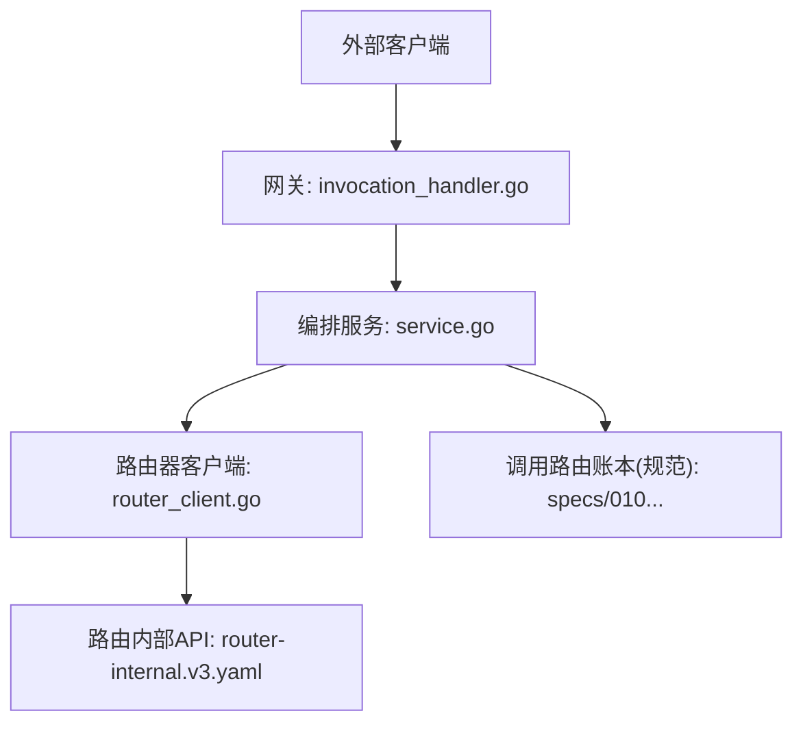
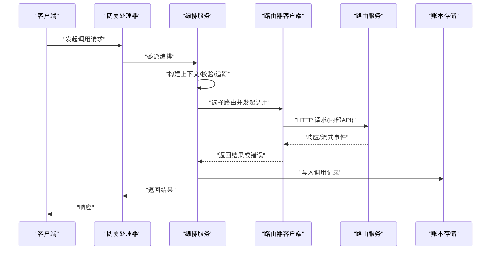
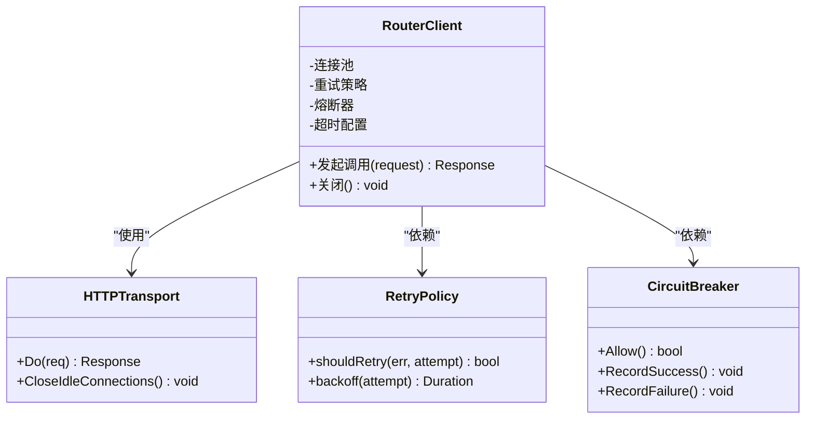
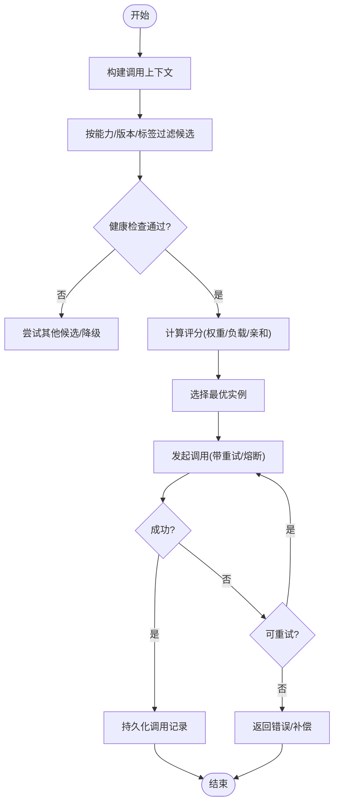
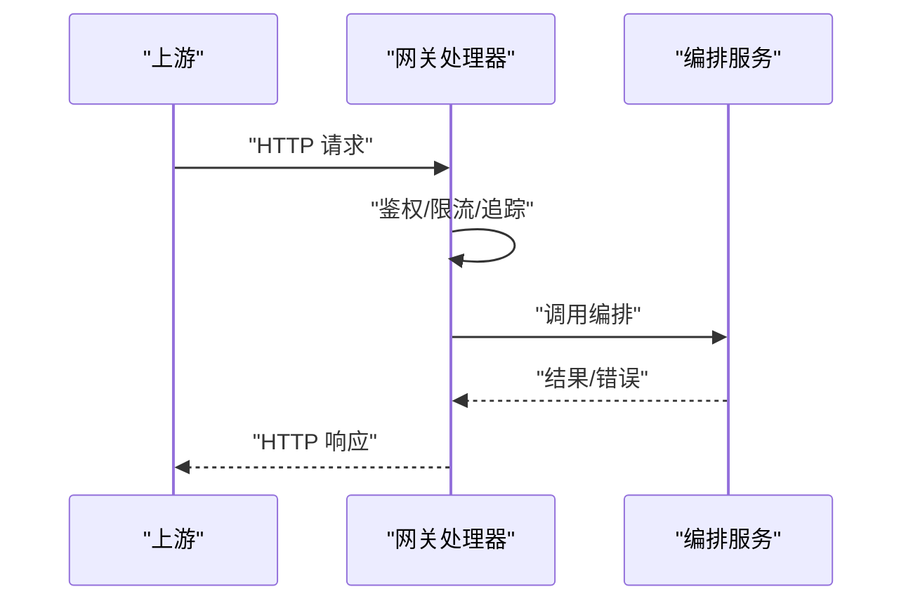
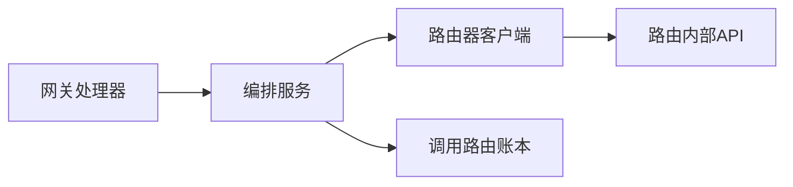
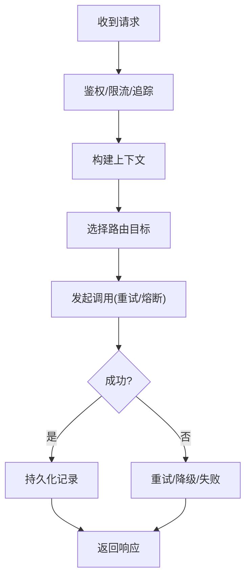
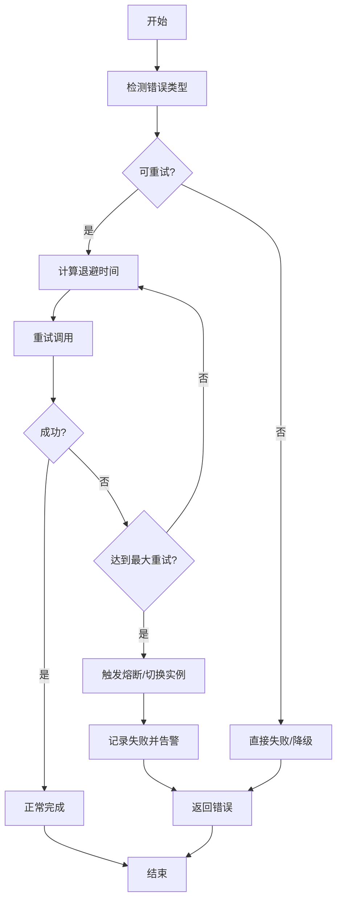

# 调用路由服务

<cite>
**本文引用的文件**   
- [apps/control-plane/internal/invocation/router_client.go](file://apps/control-plane/internal/invocation/router_client.go)
- [apps/control-plane/internal/invocation/service.go](file://apps/control-plane/internal/invocation/service.go)
- [apps/control-plane/internal/gateway/invocation_handler.go](file://apps/control-plane/internal/gateway/invocation_handler.go)
- [contracts/openapi/router-internal.v3.yaml](file://contracts/openapi/router-internal.v3.yaml)
- [specs/012-control-plane-invocation-dispatch/data-model.md](file://specs/012-control-plane-invocation-dispatch/data-model.md)
- [specs/012-control-plane-invocation-dispatch/spec.md](file://specs/012-control-plane-invocation-dispatch/spec.md)
- [specs/010-invocation-routing-ledger/data-model.md](file://specs/010-invocation-routing-ledger/data-model.md)
- [specs/010-invocation-routing-ledger/spec.md](file://specs/010-invocation-routing-ledger/spec.md)
</cite>

## 目录
1. [简介](#简介)
2. [项目结构](#项目结构)
3. [核心组件](#核心组件)
4. [架构总览](#架构总览)
5. [详细组件分析](#详细组件分析)
6. [依赖分析](#依赖分析)
7. [性能考虑](#性能考虑)
8. [故障排查指南](#故障排查指南)
9. [结论](#结论)
10. [附录](#附录)

## 简介
本文件面向 NeKiro 的“调用路由服务”，聚焦控制面在发起智能体调用时的路由客户端实现、请求分发与负载均衡策略、连接池与重试/故障转移机制、调用记录持久化与审计日志，以及与发现系统的集成和动态更新。文档同时提供架构图、请求分发流程图与故障恢复流程图，帮助读者快速理解端到端流程与关键设计决策。

## 项目结构
围绕“调用路由服务”的关键代码位于 control-plane 内部模块：
- 网关层接收外部调用并委派给编排服务
- 编排服务负责路由决策、调用执行与结果回传
- 路由器客户端封装对下游路由服务的 HTTP 调用（含连接管理、重试与错误处理）
- OpenAPI 契约定义路由内部接口
- 规范文档描述数据模型与调度语义

图表来源
- [apps/control-plane/internal/gateway/invocation_handler.go](file://apps/control-plane/internal/gateway/invocation_handler.go)
- [apps/control-plane/internal/invocation/service.go](file://apps/control-plane/internal/invocation/service.go)
- [apps/control-plane/internal/invocation/router_client.go](file://apps/control-plane/internal/invocation/router_client.go)
- [contracts/openapi/router-internal.v3.yaml](file://contracts/openapi/router-internal.v3.yaml)
- [specs/010-invocation-routing-ledger/data-model.md](file://specs/010-invocation-routing-ledger/data-model.md)

章节来源
- [apps/control-plane/internal/gateway/invocation_handler.go](file://apps/control-plane/internal/gateway/invocation_handler.go)
- [apps/control-plane/internal/invocation/service.go](file://apps/control-plane/internal/invocation/service.go)
- [apps/control-plane/internal/invocation/router_client.go](file://apps/control-plane/internal/invocation/router_client.go)
- [contracts/openapi/router-internal.v3.yaml](file://contracts/openapi/router-internal.v3.yaml)
- [specs/010-invocation-routing-ledger/data-model.md](file://specs/010-invocation-routing-ledger/data-model.md)

## 核心组件
- 网关处理器：解析请求、鉴权、追踪，并将调用委托给编排服务
- 编排服务：维护调用上下文、选择目标路由、协调重试与失败处理、落盘调用记录
- 路由器客户端：封装对路由内部 API 的 HTTP 调用，包含连接复用、超时、重试与熔断/降级策略
- 路由内部 API：由路由服务暴露，用于查询可用实例、下发路由指令或触发流式调用
- 调用路由账本：记录每次调用的元数据与状态，支撑审计与可观测性

章节来源
- [apps/control-plane/internal/gateway/invocation_handler.go](file://apps/control-plane/internal/gateway/invocation_handler.go)
- [apps/control-plane/internal/invocation/service.go](file://apps/control-plane/internal/invocation/service.go)
- [apps/control-plane/internal/invocation/router_client.go](file://apps/control-plane/internal/invocation/router_client.go)
- [contracts/openapi/router-internal.v3.yaml](file://contracts/openapi/router-internal.v3.yaml)
- [specs/010-invocation-routing-ledger/data-model.md](file://specs/010-invocation-routing-ledger/data-model.md)

## 架构总览
控制面作为“调用路由服务”的客户端，通过内部 API 与路由服务交互。整体职责划分如下：
- 网关层：统一入口，负责鉴权、限流、追踪与协议适配
- 编排层：业务编排，决定调用路径、参数转换、重试与补偿
- 路由客户端：稳定可靠的 HTTP 客户端，屏蔽底层网络细节
- 路由服务：基于服务发现与负载指标进行实例选择与流量调度
- 账本与审计：持久化调用轨迹，支持事后分析与合规审计

图表来源
- [apps/control-plane/internal/gateway/invocation_handler.go](file://apps/control-plane/internal/gateway/invocation_handler.go)
- [apps/control-plane/internal/invocation/service.go](file://apps/control-plane/internal/invocation/service.go)
- [apps/control-plane/internal/invocation/router_client.go](file://apps/control-plane/internal/invocation/router_client.go)
- [contracts/openapi/router-internal.v3.yaml](file://contracts/openapi/router-internal.v3.yaml)
- [specs/010-invocation-routing-ledger/data-model.md](file://specs/010-invocation-routing-ledger/data-model.md)

## 详细组件分析

### 路由器客户端（router_client）
职责
- 封装对路由内部 API 的 HTTP 调用
- 管理连接池（Keep-Alive、最大空闲连接、连接生命周期）
- 实现重试与退避策略（指数退避、抖动、幂等判断）
- 故障转移（多目标/多区域切换、健康检查）
- 超时与取消传播（上下文透传）

关键设计点
- 连接池参数：最大空闲连接、每主机最大空闲连接、连接存活时间、空闲回收周期
- 重试策略：仅对幂等请求重试；按错误类型区分是否重试；限制最大重试次数与总耗时
- 熔断与降级：连续失败阈值触发熔断，进入半开状态探测；降级时可选择备用路由或返回明确错误
- 追踪与度量：为每个请求注入 trace/span，记录延迟、错误码、重试次数

图表来源
- [apps/control-plane/internal/invocation/router_client.go](file://apps/control-plane/internal/invocation/router_client.go)
- [contracts/openapi/router-internal.v3.yaml](file://contracts/openapi/router-internal.v3.yaml)

章节来源
- [apps/control-plane/internal/invocation/router_client.go](file://apps/control-plane/internal/invocation/router_client.go)
- [contracts/openapi/router-internal.v3.yaml](file://contracts/openapi/router-internal.v3.yaml)

### 编排服务（invocation service）
职责
- 接收网关委派的调用，构建调用上下文（租户、工作区、能力、权限）
- 根据业务规则与优先级策略选择路由目标
- 协调重试、超时、取消与结果聚合
- 将调用记录写入账本，供审计与排障

路由决策要点
- 能力匹配：依据能力标识与版本约束筛选候选实例
- 权重与亲和：结合权重、地域亲和、会话亲和与标签匹配
- 健康与容量：剔除不健康实例，优先低负载节点
- 优先级策略：按租户等级、SLA、成本与稳定性综合排序

图表来源
- [apps/control-plane/internal/invocation/service.go](file://apps/control-plane/internal/invocation/service.go)
- [specs/012-control-plane-invocation-dispatch/spec.md](file://specs/012-control-plane-invocation-dispatch/spec.md)
- [specs/010-invocation-routing-ledger/data-model.md](file://specs/010-invocation-routing-ledger/data-model.md)

章节来源
- [apps/control-plane/internal/invocation/service.go](file://apps/control-plane/internal/invocation/service.go)
- [specs/012-control-plane-invocation-dispatch/spec.md](file://specs/012-control-plane-invocation-dispatch/spec.md)
- [specs/010-invocation-routing-ledger/data-model.md](file://specs/010-invocation-routing-ledger/data-model.md)

### 网关处理器（gateway invocation handler）
职责
- 解析请求、鉴权与授权
- 注入追踪 ID、租户与工作区信息
- 委派编排服务执行，并标准化响应格式

图表来源
- [apps/control-plane/internal/gateway/invocation_handler.go](file://apps/control-plane/internal/gateway/invocation_handler.go)
- [apps/control-plane/internal/invocation/service.go](file://apps/control-plane/internal/invocation/service.go)

章节来源
- [apps/control-plane/internal/gateway/invocation_handler.go](file://apps/control-plane/internal/gateway/invocation_handler.go)
- [apps/control-plane/internal/invocation/service.go](file://apps/control-plane/internal/invocation/service.go)

### 路由内部 API（router-internal）
- 定义路由服务对外暴露的内部接口，包括实例查询、路由决策、流式调用等
- 控制面通过该 API 获取可用实例列表与路由策略，或直接发起调用

章节来源
- [contracts/openapi/router-internal.v3.yaml](file://contracts/openapi/router-internal.v3.yaml)

### 调用记录与审计（路由账本）
- 记录每次调用的关键元数据：调用 ID、时间戳、租户/工作区、能力、目标实例、状态码、延迟、重试次数、错误信息等
- 支持分页查询与导出，便于审计与排障
- 与追踪系统联动，形成端到端链路视图

章节来源
- [specs/010-invocation-routing-ledger/data-model.md](file://specs/010-invocation-routing-ledger/data-model.md)
- [specs/010-invocation-routing-ledger/spec.md](file://specs/010-invocation-routing-ledger/spec.md)

## 依赖分析
- 组件耦合
  - 网关处理器依赖编排服务
  - 编排服务依赖路由器客户端与服务发现（通过路由内部 API）
  - 路由器客户端依赖 HTTP 传输层、重试策略与熔断器
- 外部依赖
  - 路由内部 API（OpenAPI 契约）
  - 账本存储（规范定义的数据模型）
  - 追踪与度量基础设施

图表来源
- [apps/control-plane/internal/gateway/invocation_handler.go](file://apps/control-plane/internal/gateway/invocation_handler.go)
- [apps/control-plane/internal/invocation/service.go](file://apps/control-plane/internal/invocation/service.go)
- [apps/control-plane/internal/invocation/router_client.go](file://apps/control-plane/internal/invocation/router_client.go)
- [contracts/openapi/router-internal.v3.yaml](file://contracts/openapi/router-internal.v3.yaml)
- [specs/010-invocation-routing-ledger/data-model.md](file://specs/010-invocation-routing-ledger/data-model.md)

章节来源
- [apps/control-plane/internal/gateway/invocation_handler.go](file://apps/control-plane/internal/gateway/invocation_handler.go)
- [apps/control-plane/internal/invocation/service.go](file://apps/control-plane/internal/invocation/service.go)
- [apps/control-plane/internal/invocation/router_client.go](file://apps/control-plane/internal/invocation/router_client.go)
- [contracts/openapi/router-internal.v3.yaml](file://contracts/openapi/router-internal.v3.yaml)
- [specs/010-invocation-routing-ledger/data-model.md](file://specs/010-invocation-routing-ledger/data-model.md)

## 性能考虑
- 连接池优化
  - 合理设置最大空闲连接与每主机上限，避免连接风暴
  - 启用 Keep-Alive，减少握手开销
  - 定期清理空闲连接，降低内存占用
- 重试与退避
  - 仅对幂等请求重试，避免副作用
  - 指数退避+随机抖动，降低雪崩风险
  - 限制最大重试次数与总耗时，保护上游
- 熔断与降级
  - 基于错误率与慢调用比例触发熔断
  - 半开状态逐步探测，快速恢复
  - 降级策略：选择次优实例或返回友好错误
- 超时与取消
  - 分层超时：网关、编排、客户端分别设置
  - 及时取消未完成的请求，释放资源
- 可观测性
  - 全链路追踪与指标上报，定位瓶颈与异常

[本节为通用指导，无需特定文件引用]

## 故障排查指南
常见问题与定位步骤
- 调用失败
  - 检查路由内部 API 连通性与健康状态
  - 查看重试与熔断日志，确认是否因错误率过高触发熔断
  - 核对超时配置与上游延迟分布
- 性能退化
  - 观察连接池利用率与等待队列长度
  - 检查热点实例与负载倾斜情况
  - 评估重试放大效应与退避策略
- 审计与合规
  - 通过调用路由账本检索指定调用 ID 的完整轨迹
  - 关联追踪 ID，还原端到端时序图

章节来源
- [apps/control-plane/internal/invocation/router_client.go](file://apps/control-plane/internal/invocation/router_client.go)
- [apps/control-plane/internal/invocation/service.go](file://apps/control-plane/internal/invocation/service.go)
- [specs/010-invocation-routing-ledger/data-model.md](file://specs/010-invocation-routing-ledger/data-model.md)

## 结论
NeKiro 的调用路由服务以“网关-编排-路由客户端-路由服务-账本”的分层架构实现高可靠、可观测的智能请求分发。通过连接池、重试与熔断的组合策略，以及基于能力、权重与健康的负载均衡，系统在可用性、一致性与性能之间取得平衡。配合调用路由账本与追踪体系，可实现完整的审计与排障能力。

[本节为总结性内容，无需特定文件引用]

## 附录

### 路由决策的业务规则与优先级策略
- 能力与版本匹配：精确匹配能力标识与兼容版本范围
- 亲和与隔离：租户亲和、地域亲和、会话亲和与故障域隔离
- 权重与容量：静态权重与动态容量（CPU/内存/队列长度）加权
- SLA 与成本：按 SLA 等级与成本预算调整优先级
- 健康与熔断：剔除不健康实例，遵循熔断与半开探测

章节来源
- [specs/012-control-plane-invocation-dispatch/spec.md](file://specs/012-control-plane-invocation-dispatch/spec.md)
- [specs/012-control-plane-invocation-dispatch/data-model.md](file://specs/012-control-plane-invocation-dispatch/data-model.md)

### 与服务发现系统的集成与动态更新
- 通过路由内部 API 获取最新实例清单与健康状态
- 本地缓存与增量更新，降低发现服务压力
- 变更事件驱动刷新路由表，保证最终一致性
- 冷启动与热更新：新实例上线后平滑纳入流量，下线实例优雅摘除

章节来源
- [contracts/openapi/router-internal.v3.yaml](file://contracts/openapi/router-internal.v3.yaml)
- [specs/012-control-plane-invocation-dispatch/spec.md](file://specs/012-control-plane-invocation-dispatch/spec.md)

### 请求分发流程图（端到端）

图表来源
- [apps/control-plane/internal/gateway/invocation_handler.go](file://apps/control-plane/internal/gateway/invocation_handler.go)
- [apps/control-plane/internal/invocation/service.go](file://apps/control-plane/internal/invocation/service.go)
- [apps/control-plane/internal/invocation/router_client.go](file://apps/control-plane/internal/invocation/router_client.go)
- [contracts/openapi/router-internal.v3.yaml](file://contracts/openapi/router-internal.v3.yaml)
- [specs/010-invocation-routing-ledger/data-model.md](file://specs/010-invocation-routing-ledger/data-model.md)

### 故障恢复流程图

图表来源
- [apps/control-plane/internal/invocation/router_client.go](file://apps/control-plane/internal/invocation/router_client.go)
- [apps/control-plane/internal/invocation/service.go](file://apps/control-plane/internal/invocation/service.go)