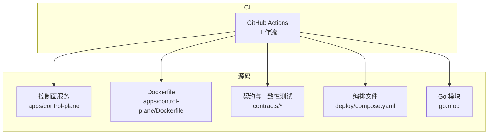
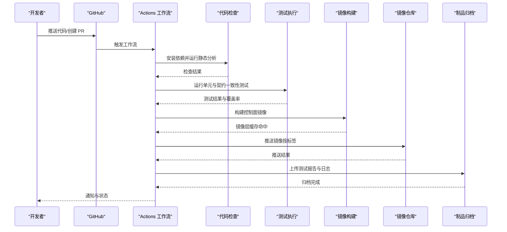
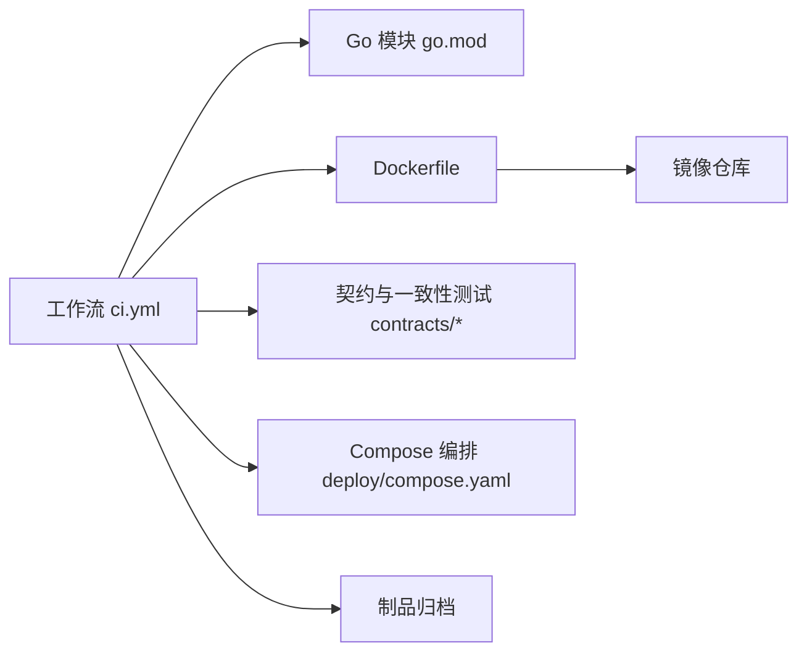

# CI/CD 流水线

<cite>
**本文引用的文件**   
- [ci.yml](file://.github/workflows/ci.yml)
- [Dockerfile](file://apps/control-plane/Dockerfile)
- [compose.yaml](file://deploy/compose.yaml)
- [go.mod](file://go.mod)
- [README.md](file://README.md)
</cite>

## 目录
1. [简介](#简介)
2. [项目结构](#项目结构)
3. [核心组件](#核心组件)
4. [架构总览](#架构总览)
5. [详细组件分析](#详细组件分析)
6. [依赖关系分析](#依赖关系分析)
7. [性能考虑](#性能考虑)
8. [故障排查指南](#故障排查指南)
9. [结论](#结论)
10. [附录](#附录)

## 简介
本文件为 NeKiro 平台的 CI/CD 流水线文档，聚焦于 GitHub Actions 工作流配置、代码检查与静态分析、自动化测试策略与覆盖率要求、制品管理与版本发布流程、环境部署与回滚策略，以及流水线故障排查与性能优化。同时记录自定义 Action 的开发与复用机制，帮助团队在持续集成与持续交付中保持一致性与可维护性。

## 项目结构
仓库采用多应用与契约驱动的组织方式：
- 应用服务位于 apps 目录，当前包含 control-plane 服务及其 Dockerfile。
- 契约定义位于 contracts 目录，包含 OpenAPI、Schema 与一致性测试用例。
- 部署编排使用 deploy/compose.yaml。
- CI 工作流定义在 .github/workflows/ci.yml。
- Go 模块根级 go.mod 管理依赖与工具链。

图表来源
- [ci.yml](file://.github/workflows/ci.yml)
- [Dockerfile](file://apps/control-plane/Dockerfile)
- [compose.yaml](file://deploy/compose.yaml)
- [go.mod](file://go.mod)

章节来源
- [README.md](file://README.md)
- [ci.yml](file://.github/workflows/ci.yml)
- [Dockerfile](file://apps/control-plane/Dockerfile)
- [compose.yaml](file://deploy/compose.yaml)
- [go.mod](file://go.mod)

## 核心组件
- 工作流触发与分支策略：定义在 .github/workflows/ci.yml，用于在推送或拉取请求时执行构建、检查与测试。
- 代码质量与静态分析：通过工作流步骤调用 Go 语言生态的 lint 与格式化工具（如 golangci-lint），确保代码风格与潜在问题被提前发现。
- 单元测试与契约一致性测试：基于 Go test 运行单元与契约一致性测试；对 contracts 下的 conformance 用例进行验证。
- 镜像构建与缓存：使用 Dockerfile 构建 control-plane 镜像，结合 GitHub Actions 缓存提升构建速度。
- 制品与发布：将构建产物（镜像、测试报告等）作为工件上传，并在满足条件时推进到发布阶段。
- 部署与回滚：通过 compose.yaml 提供本地与轻量环境的编排能力；生产部署建议配合容器注册表与编排平台实现灰度与回滚。

章节来源
- [ci.yml](file://.github/workflows/ci.yml)
- [Dockerfile](file://apps/control-plane/Dockerfile)
- [compose.yaml](file://deploy/compose.yaml)
- [go.mod](file://go.mod)

## 架构总览
下图展示从代码提交到制品产出的端到端流水线：

图表来源
- [ci.yml](file://.github/workflows/ci.yml)
- [Dockerfile](file://apps/control-plane/Dockerfile)

## 详细组件分析

### 工作流与任务编排
- 触发条件：建议在 main 分支推送与所有 PR 上触发，以保障主干稳定与变更质量。
- 并发与队列：为不同环境（如 dev/staging/prod）设置不同的 job 与并发策略，避免资源争用。
- 矩阵构建：可按 Go 版本或目标平台进行矩阵构建，确保跨版本兼容性。
- 缓存策略：对 Go 模块下载缓存与 Docker 层缓存进行配置，显著缩短冷启动时间。
- 并行化：将 lint、test、build 拆分为独立 job，利用并行加速整体时长。

章节来源
- [ci.yml](file://.github/workflows/ci.yml)

### 代码检查与静态分析
- 工具选择：推荐使用 golangci-lint 统一规则集，结合 gofmt/goimports 保证格式化一致。
- 规则治理：在项目内维护一份最小必要规则集，逐步收敛至企业规范。
- 失败策略：lint 失败应阻断合并，确保代码质量基线不被突破。
- 输出与报告：将分析报告作为工件归档，便于回溯与审计。

章节来源
- [ci.yml](file://.github/workflows/ci.yml)

### 自动化测试策略与覆盖率
- 测试分层：
  - 单元测试：覆盖核心逻辑与边界条件。
  - 契约一致性测试：基于 contracts 下的 conformance 用例验证 API 行为。
  - 集成测试：针对数据库迁移与外部依赖进行隔离式集成验证。
- 覆盖率要求：建议设定最低覆盖率阈值（例如 70% 行覆盖率），未达标则阻断合并。
- 数据准备：使用 fixtures 与内存数据库或临时容器，确保测试可重复与快速执行。
- 报告产出：生成覆盖率报告并上传至制品库，供后续评审与趋势分析。

章节来源
- [ci.yml](file://.github/workflows/ci.yml)
- [go.mod](file://go.mod)

### 镜像构建与制品管理
- 构建入口：使用 apps/control-plane/Dockerfile 构建控制面镜像。
- 多阶段构建：分离编译与运行阶段，减小镜像体积并提升安全性。
- 标签策略：按 commit SHA 打唯一标签，并按 tag 或分支名打语义化标签（如 v1.2.3）。
- 缓存优化：启用 Docker 层缓存与 Go 模块缓存，减少重复构建。
- 制品归档：将镜像、测试报告、日志等作为工件保存，便于追溯与审计。

章节来源
- [Dockerfile](file://apps/control-plane/Dockerfile)
- [ci.yml](file://.github/workflows/ci.yml)

### 版本发布流程
- 触发条件：仅在打 tag 时触发发布 job，避免误发。
- 校验前置：发布前需通过全部检查与测试，且覆盖率达标。
- 镜像推送：将镜像推送到受信任的镜像仓库，并保留历史版本。
- 发布说明：自动生成变更摘要与制品清单，便于运维与用户查阅。
- 安全扫描：对镜像进行漏洞扫描，严重级别以上阻断发布。

章节来源
- [ci.yml](file://.github/workflows/ci.yml)

### 环境部署与回滚策略
- 开发环境：使用 deploy/compose.yaml 快速拉起本地或 CI 中的轻量环境，用于冒烟测试与演示。
- 预发与生产：建议通过编排平台（如 Kubernetes）与镜像仓库进行灰度发布与蓝绿切换。
- 回滚策略：
  - 基于镜像标签的回滚：将服务版本回退至上一个稳定标签。
  - 健康检查与自动回滚：在探针失败时自动回滚到上一版本。
  - 数据迁移兼容：确保迁移脚本具备向下兼容或可逆方案。

章节来源
- [compose.yaml](file://deploy/compose.yaml)
- [ci.yml](file://.github/workflows/ci.yml)

### 自定义 Action 开发与复用
- 适用场景：封装重复性任务（如 Go 环境初始化、覆盖率统计、镜像签名等）。
- 开发要点：
  - 明确输入输出参数与环境变量。
  - 提供默认值与错误提示，增强健壮性。
  - 编写最小可用示例与测试用例。
- 复用机制：
  - 私有仓库托管 Action，通过版本号引用，确保可重现。
  - 在工作流中使用 uses 引入，并通过 with 传递参数。
  - 建立内部 Action 库与最佳实践文档，促进团队共享。

章节来源
- [ci.yml](file://.github/workflows/ci.yml)

## 依赖关系分析
- 工作流与源码：工作流依赖 Go 模块与 Dockerfile 的存在与正确性。
- 测试与契约：测试执行依赖 contracts 下的 conformance 用例与 schema 定义。
- 构建与制品：镜像构建依赖 Dockerfile 与镜像仓库权限。
- 部署与编排：部署依赖 compose.yaml 或编排平台配置。

图表来源
- [ci.yml](file://.github/workflows/ci.yml)
- [Dockerfile](file://apps/control-plane/Dockerfile)
- [compose.yaml](file://deploy/compose.yaml)
- [go.mod](file://go.mod)

章节来源
- [ci.yml](file://.github/workflows/ci.yml)
- [Dockerfile](file://apps/control-plane/Dockerfile)
- [compose.yaml](file://deploy/compose.yaml)
- [go.mod](file://go.mod)

## 性能考虑
- 缓存优先：充分利用 Go 模块缓存与 Docker 层缓存，减少网络 IO 与重复构建。
- 并行执行：拆分 lint、test、build 为独立 job，最大化利用并发。
- 增量构建：仅对变更包进行构建与测试，降低整体耗时。
- 资源优化：选择合适的 runner 规格，避免过度分配导致排队等待。
- 制品清理：定期清理旧工件与镜像，释放存储与带宽。

[本节为通用指导，不直接分析具体文件]

## 故障排查指南
- 工作流失败：
  - 查看 Actions 日志定位失败步骤与错误堆栈。
  - 确认环境变量与密钥是否正确注入。
  - 检查网络与外部依赖可达性。
- 测试失败：
  - 复现本地测试，确认是否为环境问题或数据竞争。
  - 检查契约一致性测试用例是否过期或与实际实现不一致。
- 构建失败：
  - 验证 Dockerfile 语法与基础镜像可用性。
  - 检查镜像仓库权限与网络代理设置。
- 部署失败：
  - 核对 compose.yaml 或服务编排配置。
  - 检查健康检查与探针配置，确认回滚策略生效。

章节来源
- [ci.yml](file://.github/workflows/ci.yml)
- [compose.yaml](file://deploy/compose.yaml)

## 结论
本流水线围绕“质量门禁、快速反馈、可靠制品、可控发布”的目标设计，通过代码检查、测试与覆盖率、镜像构建与制品管理、部署与回滚策略形成闭环。建议持续完善自定义 Action 库与最佳实践，推动团队在一致性与效率上取得平衡。

[本节为总结性内容，不直接分析具体文件]

## 附录
- 术语说明：
  - 制品：构建产物（镜像、报告、日志等）。
  - 契约一致性测试：基于约定用例验证 API 行为是否符合规范。
  - 灰度发布：逐步放量新版本，降低风险。
- 参考文件：
  - 工作流定义：.github/workflows/ci.yml
  - 镜像构建：apps/control-plane/Dockerfile
  - 编排文件：deploy/compose.yaml
  - 模块依赖：go.mod
  - 项目概览：README.md

章节来源
- [ci.yml](file://.github/workflows/ci.yml)
- [Dockerfile](file://apps/control-plane/Dockerfile)
- [compose.yaml](file://deploy/compose.yaml)
- [go.mod](file://go.mod)
- [README.md](file://README.md)