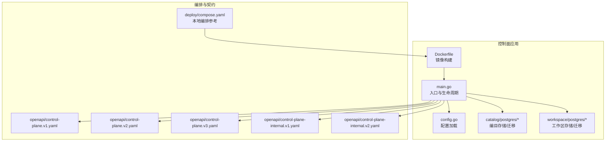
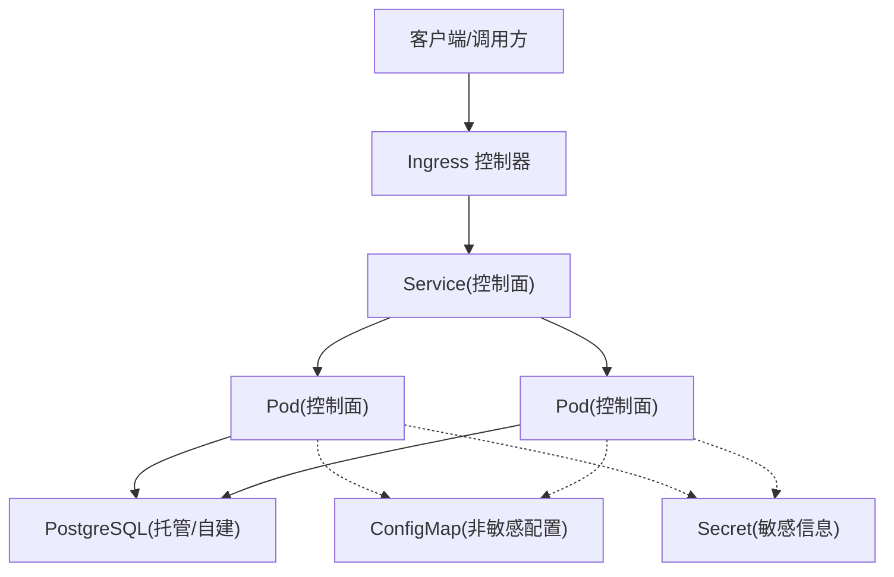
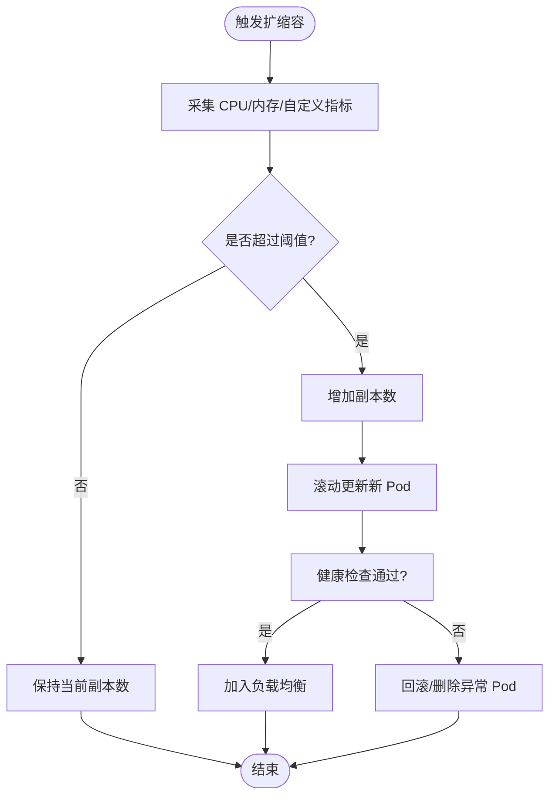
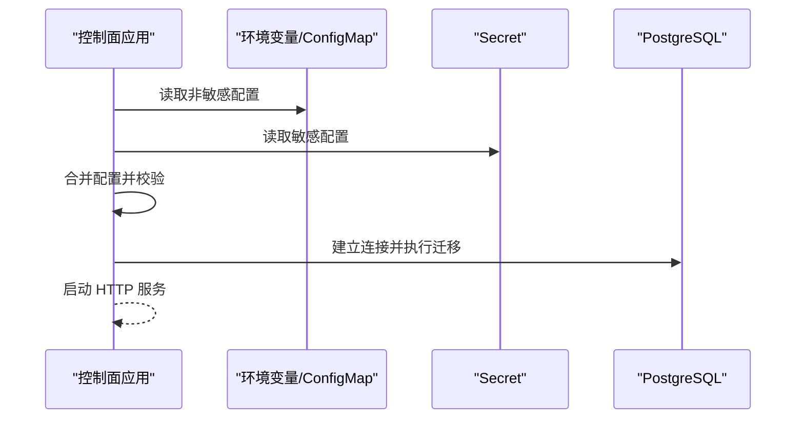
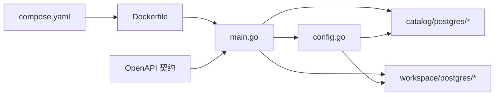

# Kubernetes 部署

<cite>
**本文引用的文件**   
- [README.md](file://README.md)
- [compose.yaml](file://deploy/compose.yaml)
- [Dockerfile](file://apps/control-plane/Dockerfile)
- [config.go](file://apps/control-plane/internal/config/config.go)
- [store.go](file://apps/control-plane/internal/catalog/postgres/store.go)
- [migrations.go](file://apps/control-plane/internal/catalog/postgres/migrations.go)
- [store.go](file://apps/control-plane/internal/workspace/postgres/store.go)
- [migrations.go](file://apps/control-plane/internal/workspace/postgres/migrations.go)
- [main.go](file://apps/control-plane/cmd/control-plane/main.go)
- [control-plane.v1.yaml](file://contracts/openapi/control-plane.v1.yaml)
- [control-plane.v2.yaml](file://contracts/openapi/control-plane.v2.yaml)
- [control-plane.v3.yaml](file://contracts/openapi/control-plane.v3.yaml)
- [control-plane-internal.v1.yaml](file://contracts/openapi/control-plane-internal.v1.yaml)
- [control-plane-internal.v2.yaml](file://contracts/openapi/control-plane-internal.v2.yaml)
</cite>

## 目录
1. [简介](#简介)
2. [项目结构](#项目结构)
3. [核心组件](#核心组件)
4. [架构总览](#架构总览)
5. [详细组件分析](#详细组件分析)
6. [依赖分析](#依赖分析)
7. [性能考虑](#性能考虑)
8. [故障排查指南](#故障排查指南)
9. [结论](#结论)
10. [附录](#附录)

## 简介
本文件为 NeKiro 平台的 Kubernetes 部署文档，聚焦控制面服务的容器化与编排。内容涵盖：
- Kubernetes 资源配置（Deployment、Service、ConfigMap、Secret）
- 命名空间隔离与资源配额管理
- Ingress 配置与外部访问策略
- 持久化存储与数据库连接管理
- 水平扩展与负载均衡设置
- Helm Chart 打包与版本管理方案
- 集群监控与日志收集建议

说明：仓库未提供现成的 Kubernetes YAML 或 Helm Chart，本文基于现有源码与配置文件进行设计性说明，并给出可落地的清单要点与最佳实践。

## 项目结构
NeKiro 的控制面服务位于 apps/control-plane，包含 Go 主程序、内部配置加载、PostgreSQL 迁移与数据访问层等。部署相关的关键位置如下：
- 应用入口与启动逻辑：cmd/control-plane/main.go
- 运行时配置读取：internal/config/config.go
- 数据库访问与迁移：internal/catalog/postgres/* 与 internal/workspace/postgres/*
- 容器镜像构建：Dockerfile
- 本地编排参考：deploy/compose.yaml
- API 契约定义：contracts/openapi/*.yaml

图表来源
- [main.go:1-200](file://apps/control-plane/cmd/control-plane/main.go#L1-L200)
- [config.go:1-200](file://apps/control-plane/internal/config/config.go#L1-L200)
- [store.go:1-200](file://apps/control-plane/internal/catalog/postgres/store.go#L1-L200)
- [migrations.go:1-200](file://apps/control-plane/internal/catalog/postgres/migrations.go#L1-L200)
- [store.go:1-200](file://apps/control-plane/internal/workspace/postgres/store.go#L1-L200)
- [migrations.go:1-200](file://apps/control-plane/internal/workspace/postgres/migrations.go#L1-L200)
- [Dockerfile:1-200](file://apps/control-plane/Dockerfile#L1-L200)
- [compose.yaml:1-200](file://deploy/compose.yaml#L1-L200)
- [control-plane.v1.yaml:1-200](file://contracts/openapi/control-plane.v1.yaml#L1-L200)
- [control-plane.v2.yaml:1-200](file://contracts/openapi/control-plane.v2.yaml#L1-L200)
- [control-plane.v3.yaml:1-200](file://contracts/openapi/control-plane.v3.yaml#L1-L200)
- [control-plane-internal.v1.yaml:1-200](file://contracts/openapi/control-plane-internal.v1.yaml#L1-L200)
- [control-plane-internal.v2.yaml:1-200](file://contracts/openapi/control-plane-internal.v2.yaml#L1-L200)

章节来源
- [README.md:1-200](file://README.md#L1-L200)
- [compose.yaml:1-200](file://deploy/compose.yaml#L1-L200)
- [Dockerfile:1-200](file://apps/control-plane/Dockerfile#L1-L200)
- [config.go:1-200](file://apps/control-plane/internal/config/config.go#L1-L200)
- [store.go:1-200](file://apps/control-plane/internal/catalog/postgres/store.go#L1-L200)
- [migrations.go:1-200](file://apps/control-plane/internal/catalog/postgres/migrations.go#L1-L200)
- [store.go:1-200](file://apps/control-plane/internal/workspace/postgres/store.go#L1-L200)
- [migrations.go:1-200](file://apps/control-plane/internal/workspace/postgres/migrations.go#L1-L200)
- [main.go:1-200](file://apps/control-plane/cmd/control-plane/main.go#L1-L200)
- [control-plane.v1.yaml:1-200](file://contracts/openapi/control-plane.v1.yaml#L1-L200)
- [control-plane.v2.yaml:1-200](file://contracts/openapi/control-plane.v2.yaml#L1-L200)
- [control-plane.v3.yaml:1-200](file://contracts/openapi/control-plane.v3.yaml#L1-L200)
- [control-plane-internal.v1.yaml:1-200](file://contracts/openapi/control-plane-internal.v1.yaml#L1-L200)
- [control-plane-internal.v2.yaml:1-200](file://contracts/openapi/control-plane-internal.v2.yaml#L1-L200)

## 核心组件
- 控制面服务（Control Plane）
  - 职责：对外暴露 OpenAPI 定义的 REST/gRPC 接口；协调编目与工作区数据；调用路由客户端执行任务。
  - 关键路径：入口 main.go 负责初始化配置、数据库连接、迁移与 HTTP 服务器；配置由 config.go 统一加载。
- 数据访问层
  - 编目模块：catalog/postgres/store.go 实现编目数据的读写；migrations.go 管理 SQL 迁移。
  - 工作区模块：workspace/postgres/store.go 实现工作区数据读写；migrations.go 管理 SQL 迁移。
- 容器镜像
  - Dockerfile 定义多阶段构建与运行环境，产出控制面镜像。
- 本地编排参考
  - deploy/compose.yaml 展示了服务间依赖关系（如 PostgreSQL），可作为 K8s 编排的参考。

章节来源
- [main.go:1-200](file://apps/control-plane/cmd/control-plane/main.go#L1-L200)
- [config.go:1-200](file://apps/control-plane/internal/config/config.go#L1-L200)
- [store.go:1-200](file://apps/control-plane/internal/catalog/postgres/store.go#L1-L200)
- [migrations.go:1-200](file://apps/control-plane/internal/catalog/postgres/migrations.go#L1-L200)
- [store.go:1-200](file://apps/control-plane/internal/workspace/postgres/store.go#L1-L200)
- [migrations.go:1-200](file://apps/control-plane/internal/workspace/postgres/migrations.go#L1-L200)
- [Dockerfile:1-200](file://apps/control-plane/Dockerfile#L1-L200)
- [compose.yaml:1-200](file://deploy/compose.yaml#L1-L200)

## 架构总览
下图展示控制面在 Kubernetes 中的典型部署形态：Ingress 将外部流量引入 Service，Service 转发到 Deployment 管理的 Pod；Pod 通过环境变量挂载 Secret 和 ConfigMap 获取数据库连接与运行时配置；数据库使用托管或自建 PostgreSQL，并通过 PVC 保障持久化。

图表来源
- [main.go:1-200](file://apps/control-plane/cmd/control-plane/main.go#L1-L200)
- [config.go:1-200](file://apps/control-plane/internal/config/config.go#L1-L200)
- [store.go:1-200](file://apps/control-plane/internal/catalog/postgres/store.go#L1-L200)
- [migrations.go:1-200](file://apps/control-plane/internal/catalog/postgres/migrations.go#L1-L200)
- [store.go:1-200](file://apps/control-plane/internal/workspace/postgres/store.go#L1-L200)
- [migrations.go:1-200](file://apps/control-plane/internal/workspace/postgres/migrations.go#L1-L200)

## 详细组件分析

### 命名空间隔离与资源配额
- 命名空间
  - 建议为 NeKiro 平台创建独立命名空间，用于隔离控制面、数据库及运维工具。
  - 结合 NetworkPolicy 限制跨命名空间访问，仅允许 Ingress 与必要服务通信。
- 资源配额
  - 使用 ResourceQuota 对命名空间设置 CPU/内存上限，防止单租户占用过多资源。
  - 使用 LimitRange 为每个 Pod/Container 设置默认请求与限制，避免无界分配。
- 安全上下文
  - 以非 root 用户运行容器，启用只读根文件系统，按需挂载卷。
  - 最小权限原则：仅授予必要的 RBAC 权限（若需要）。

章节来源
- [config.go:1-200](file://apps/control-plane/internal/config/config.go#L1-L200)
- [main.go:1-200](file://apps/control-plane/cmd/control-plane/main.go#L1-L200)

### 配置管理（ConfigMap 与 Secret）
- 配置来源
  - 应用通过 config.go 加载运行时配置，通常包括数据库连接串、端口、日志级别等。
- 推荐方式
  - 非敏感配置（如端口、超时、开关）放入 ConfigMap，并以环境变量或挂载文件形式注入。
  - 敏感信息（如数据库密码、密钥）放入 Secret，通过环境变量或文件挂载注入。
- 迁移配置
  - 数据库迁移脚本由 migrations.go 管理，建议在 CI/CD 中作为独立 Job 执行，或在启动时按策略自动迁移。

章节来源
- [config.go:1-200](file://apps/control-plane/internal/config/config.go#L1-L200)
- [migrations.go:1-200](file://apps/control-plane/internal/catalog/postgres/migrations.go#L1-L200)
- [migrations.go:1-200](file://apps/control-plane/internal/workspace/postgres/migrations.go#L1-L200)

### 持久化存储与数据库连接
- 数据库选型
  - 代码中使用 PostgreSQL 作为持久化后端（catalog 与 workspace 模块）。
- 连接管理
  - 通过环境变量或配置中心注入数据库连接参数（主机、端口、库名、用户名、密码）。
  - 建议开启连接池、最大空闲连接、连接超时与重试退避。
- 迁移策略
  - 使用 migrations.go 提供的迁移能力，确保 schema 升级与回滚策略明确。
  - 生产环境建议采用“向前兼容”的迁移策略，并在低峰期执行。

章节来源
- [store.go:1-200](file://apps/control-plane/internal/catalog/postgres/store.go#L1-L200)
- [migrations.go:1-200](file://apps/control-plane/internal/catalog/postgres/migrations.go#L1-L200)
- [store.go:1-200](file://apps/control-plane/internal/workspace/postgres/store.go#L1-L200)
- [migrations.go:1-200](file://apps/control-plane/internal/workspace/postgres/migrations.go#L1-L200)

### 水平扩展与负载均衡
- 副本数
  - 根据 QPS 与延迟目标设定 Deployment 的 replicas，并结合 HPA 基于 CPU/内存或自定义指标自动扩缩容。
- 健康检查
  - 配置 liveness/readiness 探针，确保流量仅在就绪实例上分发。
- 会话与状态
  - 控制面应设计为无状态，避免本地状态；如需缓存，使用外部 Redis 等共享存储。
- 负载均衡
  - Service 使用 ClusterIP 暴露给 Ingress 或内部网关；Ingress 控制器负责七层负载均衡与 TLS 终止。

章节来源
- [main.go:1-200](file://apps/control-plane/cmd/control-plane/main.go#L1-L200)
- [config.go:1-200](file://apps/control-plane/internal/config/config.go#L1-L200)

### Ingress 与外部访问策略
- 域名与 TLS
  - 通过 Ingress 绑定域名与证书，启用 HTTPS。
- 路由规则
  - 按路径或子域名区分控制面 API 与内部 API，结合鉴权中间件。
- 限流与安全
  - 在 Ingress 层启用速率限制、WAF 与 IP 白名单；对内部 API 使用网络策略限制访问源。

章节来源
- [control-plane.v1.yaml:1-200](file://contracts/openapi/control-plane.v1.yaml#L1-L200)
- [control-plane.v2.yaml:1-200](file://contracts/openapi/control-plane.v2.yaml#L1-L200)
- [control-plane.v3.yaml:1-200](file://contracts/openapi/control-plane.v3.yaml#L1-L200)
- [control-plane-internal.v1.yaml:1-200](file://contracts/openapi/control-plane-internal.v1.yaml#L1-L200)
- [control-plane-internal.v2.yaml:1-200](file://contracts/openapi/control-plane-internal.v2.yaml#L1-L200)

### 水平扩展流程（概念）

[此图为概念流程图，不直接映射具体源码文件]

### 配置加载流程（概念）

[此图为概念序列图，不直接映射具体源码文件]

## 依赖分析
控制面服务的主要依赖包括：
- 运行时配置（config.go）
- 数据库访问（catalog/postgres、workspace/postgres）
- 迁移脚本（catalog/postgres、workspace/postgres）
- 容器镜像（Dockerfile）
- 本地编排参考（compose.yaml）
- API 契约（OpenAPI 定义）

图表来源
- [main.go:1-200](file://apps/control-plane/cmd/control-plane/main.go#L1-L200)
- [config.go:1-200](file://apps/control-plane/internal/config/config.go#L1-L200)
- [store.go:1-200](file://apps/control-plane/internal/catalog/postgres/store.go#L1-L200)
- [migrations.go:1-200](file://apps/control-plane/internal/catalog/postgres/migrations.go#L1-L200)
- [store.go:1-200](file://apps/control-plane/internal/workspace/postgres/store.go#L1-L200)
- [migrations.go:1-200](file://apps/control-plane/internal/workspace/postgres/migrations.go#L1-L200)
- [Dockerfile:1-200](file://apps/control-plane/Dockerfile#L1-L200)
- [compose.yaml:1-200](file://deploy/compose.yaml#L1-L200)
- [control-plane.v1.yaml:1-200](file://contracts/openapi/control-plane.v1.yaml#L1-L200)
- [control-plane.v2.yaml:1-200](file://contracts/openapi/control-plane.v2.yaml#L1-L200)
- [control-plane.v3.yaml:1-200](file://contracts/openapi/control-plane.v3.yaml#L1-L200)
- [control-plane-internal.v1.yaml:1-200](file://contracts/openapi/control-plane-internal.v1.yaml#L1-L200)
- [control-plane-internal.v2.yaml:1-200](file://contracts/openapi/control-plane-internal.v2.yaml#L1-L200)

章节来源
- [main.go:1-200](file://apps/control-plane/cmd/control-plane/main.go#L1-L200)
- [config.go:1-200](file://apps/control-plane/internal/config/config.go#L1-L200)
- [store.go:1-200](file://apps/control-plane/internal/catalog/postgres/store.go#L1-L200)
- [migrations.go:1-200](file://apps/control-plane/internal/catalog/postgres/migrations.go#L1-L200)
- [store.go:1-200](file://apps/control-plane/internal/workspace/postgres/store.go#L1-L200)
- [migrations.go:1-200](file://apps/control-plane/internal/workspace/postgres/migrations.go#L1-L200)
- [Dockerfile:1-200](file://apps/control-plane/Dockerfile#L1-L200)
- [compose.yaml:1-200](file://deploy/compose.yaml#L1-L200)
- [control-plane.v1.yaml:1-200](file://contracts/openapi/control-plane.v1.yaml#L1-L200)
- [control-plane.v2.yaml:1-200](file://contracts/openapi/control-plane.v2.yaml#L1-L200)
- [control-plane.v3.yaml:1-200](file://contracts/openapi/control-plane.v3.yaml#L1-L200)
- [control-plane-internal.v1.yaml:1-200](file://contracts/openapi/control-plane-internal.v1.yaml#L1-L200)
- [control-plane-internal.v2.yaml:1-200](file://contracts/openapi/control-plane-internal.v2.yaml#L1-L200)

## 性能考虑
- 连接池与超时
  - 合理设置数据库连接池大小、空闲超时与查询超时，避免连接泄漏与长事务阻塞。
- 并发与背压
  - 在高并发场景下，结合队列或限流保护后端数据库；对慢查询添加索引与分页。
- 缓存与热点
  - 对热点数据引入缓存层（如 Redis），降低数据库压力。
- 弹性伸缩
  - 基于 CPU/内存或业务指标（QPS、P99 延迟）配置 HPA，配合合理的资源请求与限制。
- 优雅停机
  - 配置 SIGTERM 处理，完成正在处理的请求后再退出，避免中断。

[本节为通用指导，不直接分析具体文件]

## 故障排查指南
- 启动失败
  - 检查环境变量与 Secret 是否正确挂载；确认数据库可达且凭据正确。
  - 查看迁移日志，确认 schema 版本与应用期望一致。
- 连接错误
  - 验证网络策略与防火墙规则；检查数据库白名单与端口。
  - 调整连接池参数与重试策略。
- 性能问题
  - 使用 Prometheus/Grafana 监控 CPU/内存、连接池、慢查询；定位瓶颈。
  - 分析 Ingress 与 Service 的负载分布，必要时扩容或优化查询。
- 日志与追踪
  - 集中收集应用日志（stdout/stderr）至 ELK/Loki；结合分布式追踪定位链路问题。

章节来源
- [config.go:1-200](file://apps/control-plane/internal/config/config.go#L1-L200)
- [migrations.go:1-200](file://apps/control-plane/internal/catalog/postgres/migrations.go#L1-L200)
- [migrations.go:1-200](file://apps/control-plane/internal/workspace/postgres/migrations.go#L1-L200)
- [main.go:1-200](file://apps/control-plane/cmd/control-plane/main.go#L1-L200)

## 结论
NeKiro 控制面服务具备清晰的模块化结构与可扩展性。通过合理的 Kubernetes 编排（Deployment、Service、ConfigMap、Secret）、Ingress 外部访问、数据库迁移与水平扩展策略，可实现高可用与易维护的生产部署。建议结合监控与日志体系完善可观测性，并持续优化性能与稳定性。

[本节为总结性内容，不直接分析具体文件]

## 附录

### Helm Chart 打包与版本管理方案（建议）
- Chart 结构
  - values.yaml：存放可配置项（副本数、资源限制、数据库连接等）。
  - templates/deployment.yaml：渲染 Deployment，包含探针、环境变量、卷挂载。
  - templates/service.yaml：渲染 Service，暴露内部端口。
  - templates/configmap.yaml / secret.yaml：渲染配置与敏感信息。
  - templates/ingress.yaml：渲染 Ingress，绑定域名与 TLS。
  - templates/hpa.yaml：渲染 HPA，基于指标自动扩缩容。
  - templates/pvc.yaml（可选）：如需本地持久化卷。
- 版本管理
  - 使用语义化版本号（Chart.appVersion 与 image.tag 对齐）。
  - 在 CI/CD 中自动化构建镜像、推送镜像仓库、生成 Chart 包并归档。
- 发布策略
  - 蓝绿或金丝雀发布：通过 Ingress 权重切换或 Service 选择器变更实现。
  - 回滚策略：保留历史 Release，快速回滚到稳定版本。

[本节为概念性建议，不直接分析具体文件]

### 监控与日志收集（建议）
- 指标采集
  - 使用 Prometheus 抓取应用指标与 Kubelet 指标；Grafana 可视化。
- 日志收集
  - 使用 Fluent Bit/Fluentd 收集 stdout/stderr 日志，输出至 Elasticsearch/Loki。
- 告警
  - 基于 Prometheus Alertmanager 配置告警规则（CPU/内存、错误率、延迟）。
- 追踪
  - 集成 OpenTelemetry/Jaeger，记录关键请求链路。

[本节为概念性建议，不直接分析具体文件]