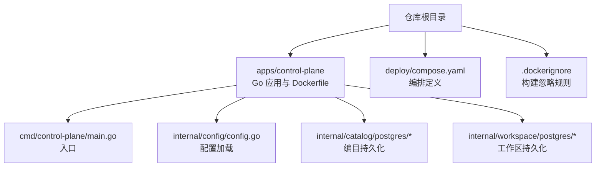
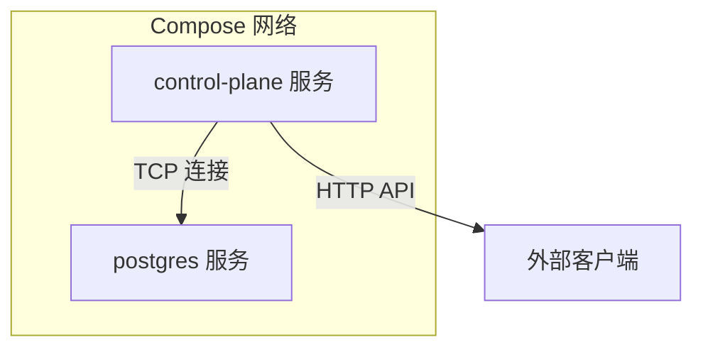
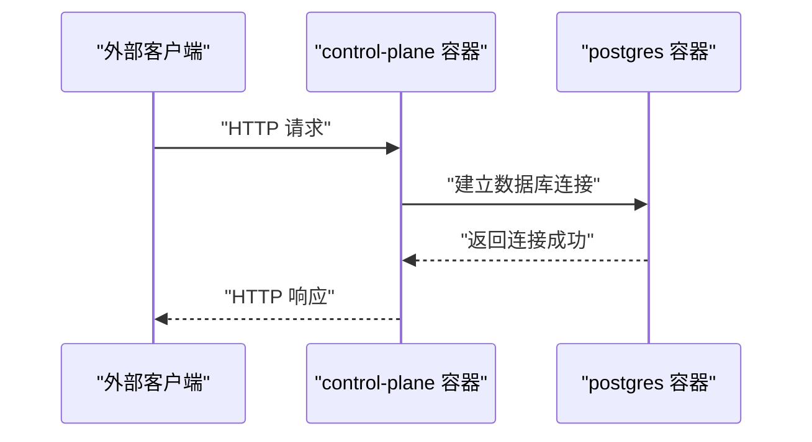
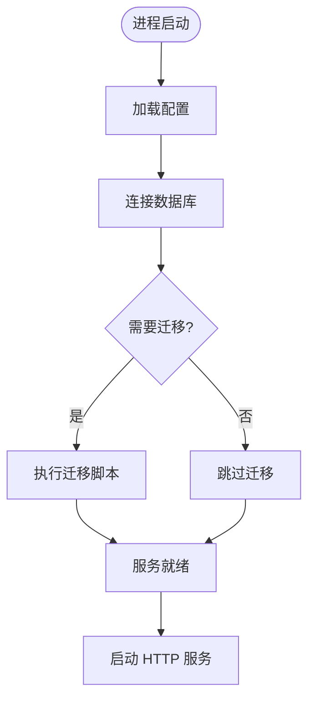
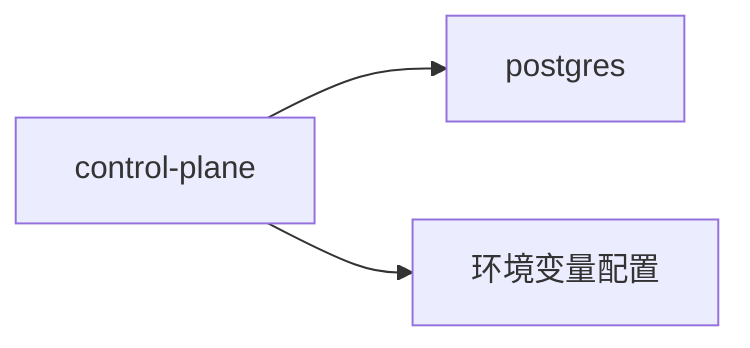

# 容器化部署

<cite>
**本文引用的文件**   
- [Dockerfile](file://apps/control-plane/Dockerfile)
- [.dockerignore](file://.dockerignore)
- [compose.yaml](file://deploy/compose.yaml)
- [main.go](file://apps/control-plane/cmd/control-plane/main.go)
- [config.go](file://apps/control-plane/internal/config/config.go)
- [store.go](file://apps/control-plane/internal/catalog/postgres/store.go)
- [migrations.go](file://apps/control-plane/internal/catalog/postgres/migrations.go)
- [store.go](file://apps/control-plane/internal/workspace/postgres/store.go)
- [migrations.go](file://apps/control-plane/internal/workspace/postgres/migrations.go)
</cite>

## 目录
1. [简介](#简介)
2. [项目结构](#项目结构)
3. [核心组件](#核心组件)
4. [架构总览](#架构总览)
5. [详细组件分析](#详细组件分析)
6. [依赖关系分析](#依赖关系分析)
7. [性能考虑](#性能考虑)
8. [故障排查指南](#故障排查指南)
9. [结论](#结论)
10. [附录](#附录)

## 简介
本文件面向 NeKiro 平台的容器化部署，聚焦以下目标：
- 说明控制面服务的 Docker 镜像构建过程与优化策略（多阶段构建、分层策略）
- 解释 Dockerfile 配置项与最佳实践
- 文档化 Docker Compose 编排配置（服务依赖、网络、数据卷）
- 说明容器间通信与服务发现方案
- 给出资源限制、健康检查与重启策略的配置建议
- 提供故障排查指南与性能优化建议

## 项目结构
NeKiro 的控制面应用位于 apps/control-plane，包含 Go 源码、数据库迁移脚本以及 Dockerfile。编排文件位于 deploy/compose.yaml。根目录包含 .dockerignore 用于镜像构建裁剪。

图表来源
- [Dockerfile](file://apps/control-plane/Dockerfile)
- [compose.yaml](file://deploy/compose.yaml)
- [.dockerignore](file://.dockerignore)
- [main.go](file://apps/control-plane/cmd/control-plane/main.go)
- [config.go](file://apps/control-plane/internal/config/config.go)
- [store.go](file://apps/control-plane/internal/catalog/postgres/store.go)
- [migrations.go](file://apps/control-plane/internal/catalog/postgres/migrations.go)
- [store.go](file://apps/control-plane/internal/workspace/postgres/store.go)
- [migrations.go](file://apps/control-plane/internal/workspace/postgres/migrations.go)

章节来源
- [Dockerfile](file://apps/control-plane/Dockerfile)
- [compose.yaml](file://deploy/compose.yaml)
- [.dockerignore](file://.dockerignore)

## 核心组件
- 控制面服务（Control Plane）
  - 入口程序负责启动 HTTP 网关、初始化配置、连接数据库并执行迁移
  - 通过内部配置模块加载运行时参数（如数据库连接、端口等）
  - 使用 Postgres 作为持久化存储，分别维护编目与工作区数据
- 编排器（Compose）
  - 定义控制面服务、Postgres 服务及其依赖、网络与数据卷
  - 提供本地开发/测试的一键拉起能力

章节来源
- [main.go](file://apps/control-plane/cmd/control-plane/main.go)
- [config.go](file://apps/control-plane/internal/config/config.go)
- [store.go](file://apps/control-plane/internal/catalog/postgres/store.go)
- [migrations.go](file://apps/control-plane/internal/catalog/postgres/migrations.go)
- [store.go](file://apps/control-plane/internal/workspace/postgres/store.go)
- [migrations.go](file://apps/control-plane/internal/workspace/postgres/migrations.go)

## 架构总览
下图展示了控制面服务与数据库在容器中的交互关系，以及 Compose 编排的拓扑。

图表来源
- [compose.yaml](file://deploy/compose.yaml)
- [main.go](file://apps/control-plane/cmd/control-plane/main.go)
- [store.go](file://apps/control-plane/internal/catalog/postgres/store.go)
- [migrations.go](file://apps/control-plane/internal/catalog/postgres/migrations.go)
- [store.go](file://apps/control-plane/internal/workspace/postgres/store.go)
- [migrations.go](file://apps/control-plane/internal/workspace/postgres/migrations.go)

## 详细组件分析

### 镜像构建与分层策略
- 多阶段构建
  - 构建阶段：安装 Go 工具链、下载依赖、编译二进制
  - 运行阶段：仅包含最小运行时与编译产物，显著减小镜像体积
- 分层优化要点
  - 将 go.mod/go.sum 单独拷贝并先执行依赖下载，利用缓存加速重复构建
  - 将源码拷贝与编译合并为少步操作，减少中间层
  - 使用 .dockerignore 排除无关文件（测试、文档、本地缓存等）
- 安全与可观测性
  - 以非 root 用户运行
  - 暴露必要端口，便于健康检查与监控
  - 输出结构化日志到 stdout/stderr

章节来源
- [Dockerfile](file://apps/control-plane/Dockerfile)
- [.dockerignore](file://.dockerignore)

### Dockerfile 配置选项与最佳实践
- 基础镜像选择
  - 使用官方精简运行时镜像，降低攻击面与体积
- 环境变量与配置注入
  - 通过环境变量注入数据库地址、端口、用户名、密码等敏感信息
  - 避免将密钥写入镜像层
- 健康检查
  - 在镜像中集成轻量健康检查端点或命令，配合 Compose healthcheck
- 时区与语言环境
  - 设置 TZ 与 LANG/LC_ALL，保证日志与时间戳一致

章节来源
- [Dockerfile](file://apps/control-plane/Dockerfile)

### Docker Compose 编排配置
- 服务定义
  - control-plane：依赖 postgres，挂载必要卷，设置健康检查与重启策略
  - postgres：持久化数据卷，设置初始数据库与凭据
- 网络配置
  - 默认桥接网络下，服务名即 DNS 名称，控制面通过服务名访问数据库
- 数据卷管理
  - 使用命名卷持久化数据库文件，避免容器重建导致数据丢失
- 依赖与健康检查
  - 使用 depends_on + condition: service_healthy 确保数据库就绪后再启动控制面
- 资源限制
  - 为关键服务设置 CPU/内存上限，防止资源争用

章节来源
- [compose.yaml](file://deploy/compose.yaml)

### 容器间通信与服务发现
- 通信机制
  - 控制面通过 TCP 连接 Postgres，连接字符串由环境变量注入
  - 控制面对外暴露 HTTP API，供外部客户端调用
- 服务发现
  - Compose 内置 DNS：服务名解析为对应容器的 IP
  - 生产环境可替换为更健壮的服务发现方案（如 K8s Service、Consul 等）

图表来源
- [compose.yaml](file://deploy/compose.yaml)
- [main.go](file://apps/control-plane/cmd/control-plane/main.go)
- [store.go](file://apps/control-plane/internal/catalog/postgres/store.go)
- [migrations.go](file://apps/control-plane/internal/catalog/postgres/migrations.go)
- [store.go](file://apps/control-plane/internal/workspace/postgres/store.go)
- [migrations.go](file://apps/control-plane/internal/workspace/postgres/migrations.go)

### 启动流程与数据库迁移
控制面启动后，会加载配置、连接数据库并执行必要的迁移，随后启动 HTTP 服务。

图表来源
- [main.go](file://apps/control-plane/cmd/control-plane/main.go)
- [config.go](file://apps/control-plane/internal/config/config.go)
- [migrations.go](file://apps/control-plane/internal/catalog/postgres/migrations.go)
- [migrations.go](file://apps/control-plane/internal/workspace/postgres/migrations.go)

章节来源
- [main.go](file://apps/control-plane/cmd/control-plane/main.go)
- [config.go](file://apps/control-plane/internal/config/config.go)
- [migrations.go](file://apps/control-plane/internal/catalog/postgres/migrations.go)
- [migrations.go](file://apps/control-plane/internal/workspace/postgres/migrations.go)

## 依赖关系分析
- 直接依赖
  - control-plane 依赖 postgres 服务（网络可达、凭据正确、端口开放）
  - control-plane 依赖运行时配置（环境变量）
- 间接依赖
  - 迁移脚本依赖数据库版本与兼容性
- 潜在循环依赖
  - 当前无循环依赖；若引入更多服务，需确保依赖图有向无环

图表来源
- [compose.yaml](file://deploy/compose.yaml)
- [config.go](file://apps/control-plane/internal/config/config.go)

章节来源
- [compose.yaml](file://deploy/compose.yaml)
- [config.go](file://apps/control-plane/internal/config/config.go)

## 性能考虑
- 镜像体积与构建速度
  - 合理拆分依赖与源码层，充分利用构建缓存
  - 使用 .dockerignore 剔除大文件或无关目录
- 运行时资源
  - 为控制面与数据库设置合理的 CPU/内存限制
  - 调整数据库连接池大小，避免过多并发导致抖动
- 网络与 I/O
  - 将数据库与业务服务部署在同一可用区，降低延迟
  - 使用持久卷并确保底层存储具备足够 IOPS
- 可观测性
  - 启用结构化日志与指标采集，结合健康检查实现自动恢复

[本节为通用指导，不直接分析具体文件]

## 故障排查指南
- 镜像构建失败
  - 检查 .dockerignore 是否误排除了必要文件
  - 确认 Go 依赖下载阶段缓存命中情况
- 服务无法启动
  - 查看控制面日志，确认配置加载与数据库连接状态
  - 验证 Compose 网络连通性与服务名解析
- 数据库连接错误
  - 核对数据库主机、端口、用户名、密码等环境变量
  - 检查数据库是否完成初始化与迁移
- 健康检查失败
  - 确认健康检查端点或命令返回值
  - 检查系统资源是否不足导致服务频繁重启

章节来源
- [compose.yaml](file://deploy/compose.yaml)
- [main.go](file://apps/control-plane/cmd/control-plane/main.go)
- [config.go](file://apps/control-plane/internal/config/config.go)

## 结论
通过多阶段构建与严格的分层策略，NeKiro 控制面镜像体积更小、构建更快、安全性更高。借助 Compose 的网络与数据卷能力，可在本地快速搭建完整环境。在生产环境中，建议引入更健壮的服务发现与资源治理方案，并结合健康检查与自动重启提升可用性。

[本节为总结性内容，不直接分析具体文件]

## 附录
- 常用命令
  - 构建镜像：在项目根目录执行 docker build 指向控制面 Dockerfile
  - 启动编排：使用 docker compose up 拉起所有服务
  - 查看日志：docker compose logs -f control-plane
- 参考路径
  - 控制面入口：[main.go](file://apps/control-plane/cmd/control-plane/main.go)
  - 配置加载：[config.go](file://apps/control-plane/internal/config/config.go)
  - 编目持久化：[store.go](file://apps/control-plane/internal/catalog/postgres/store.go)、[migrations.go](file://apps/control-plane/internal/catalog/postgres/migrations.go)
  - 工作区持久化：[store.go](file://apps/control-plane/internal/workspace/postgres/store.go)、[migrations.go](file://apps/control-plane/internal/workspace/postgres/migrations.go)
  - 编排定义：[compose.yaml](file://deploy/compose.yaml)
  - 构建忽略：[.dockerignore](file://.dockerignore)