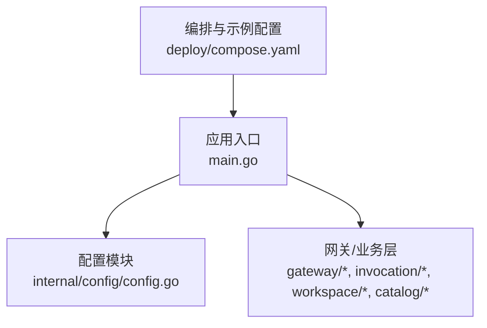
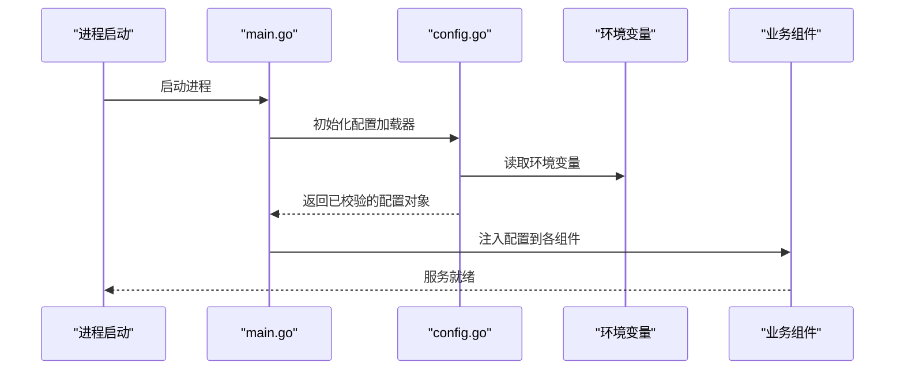
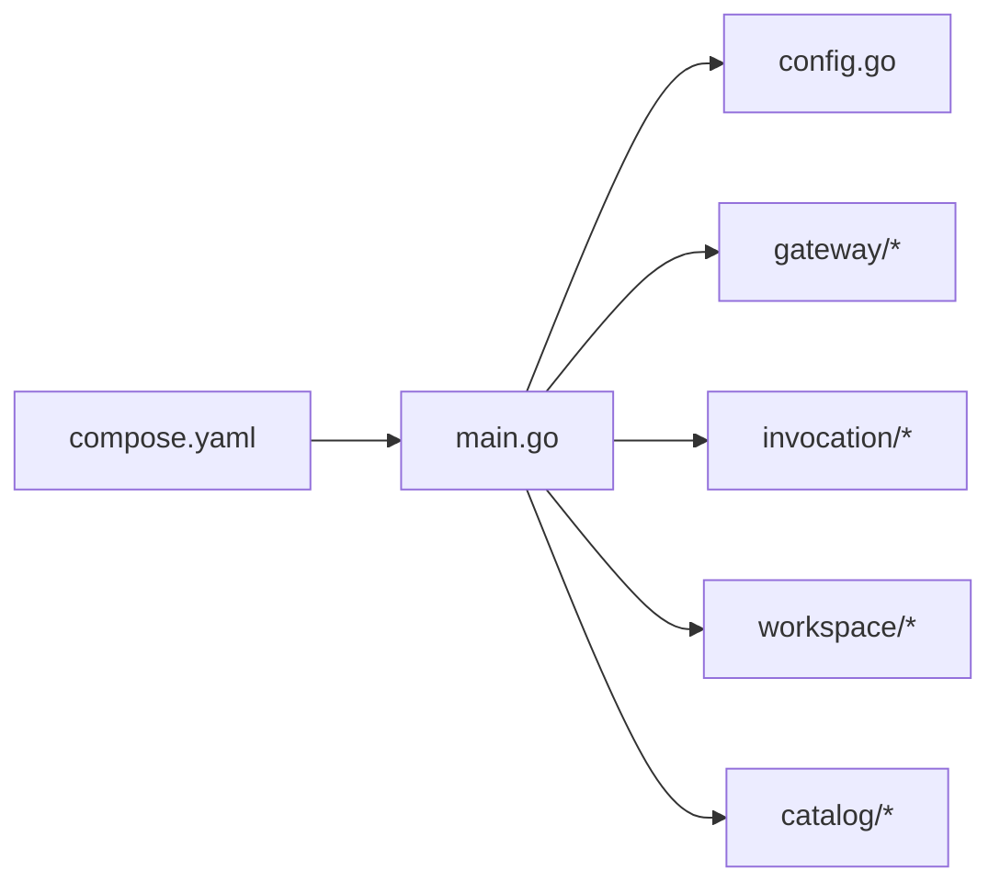

# 环境配置管理

<cite>
**本文引用的文件**   
- [apps/control-plane/cmd/control-plane/main.go](file://apps/control-plane/cmd/control-plane/main.go)
- [apps/control-plane/internal/config/config.go](file://apps/control-plane/internal/config/config.go)
- [deploy/compose.yaml](file://deploy/compose.yaml)
</cite>

## 目录
1. [简介](#简介)
2. [项目结构](#项目结构)
3. [核心组件](#核心组件)
4. [架构总览](#架构总览)
5. [详细组件分析](#详细组件分析)
6. [依赖分析](#依赖分析)
7. [性能考虑](#性能考虑)
8. [故障排查指南](#故障排查指南)
9. [结论](#结论)
10. [附录](#附录) 

## 简介
本文件面向 NeKiro 平台的环境配置管理，聚焦控制面服务的配置加载、校验与使用。文档涵盖：
- 配置文件结构与环境变量命名规范
- 不同环境的差异与管理策略
- 敏感信息的安全存储与处理
- 配置热重载与动态更新机制现状与建议
- 配置验证与默认值管理
- 配置迁移与版本兼容性处理方案
- 最佳实践与常见错误排查

## 项目结构
NeKiro 的控制面服务位于 apps/control-plane，其配置入口与实现集中在 internal/config 包，并在 cmd/control-plane/main.go 中完成初始化与注入。部署编排通过 deploy/compose.yaml 提供容器化运行示例。

图示来源
- [apps/control-plane/cmd/control-plane/main.go](file://apps/control-plane/cmd/control-plane/main.go)
- [apps/control-plane/internal/config/config.go](file://apps/control-plane/internal/config/config.go)
- [deploy/compose.yaml](file://deploy/compose.yaml)

章节来源
- [apps/control-plane/cmd/control-plane/main.go](file://apps/control-plane/cmd/control-plane/main.go)
- [apps/control-plane/internal/config/config.go](file://apps/control-plane/internal/config/config.go)
- [deploy/compose.yaml](file://deploy/compose.yaml)

## 核心组件
- 配置加载器：负责从环境变量与可选配置文件读取并解析为结构化配置对象。
- 配置校验器：对必填字段、取值范围、格式进行校验，失败时阻止启动或返回明确错误。
- 配置提供者：向业务层暴露只读的配置访问接口，避免直接读写全局变量。
- 运行时注入：在应用启动阶段将配置注入到各子系统（如数据库、网关、工作区等）。

章节来源
- [apps/control-plane/internal/config/config.go](file://apps/control-plane/internal/config/config.go)
- [apps/control-plane/cmd/control-plane/main.go](file://apps/control-plane/cmd/control-plane/main.go)

## 架构总览
下图展示了控制面服务在启动时的配置加载流程与环境变量的作用域。

图示来源
- [apps/control-plane/cmd/control-plane/main.go](file://apps/control-plane/cmd/control-plane/main.go)
- [apps/control-plane/internal/config/config.go](file://apps/control-plane/internal/config/config.go)

## 详细组件分析

### 配置模块（internal/config）
- 职责
  - 定义配置结构体与默认值
  - 从环境变量与可选配置文件合并加载
  - 执行类型转换与基础校验
  - 提供只读访问接口
- 关键设计点
  - 分层优先级：显式参数 > 配置文件 > 环境变量 > 默认值
  - 严格校验：缺失必填项或非法取值应快速失败
  - 不可变：对外暴露只读视图，避免运行时被意外修改
- 建议的扩展
  - 支持多环境覆盖（dev/staging/prod）
  - 增加配置变更监听与热重载能力（见“热重载”小节）

章节来源
- [apps/control-plane/internal/config/config.go](file://apps/control-plane/internal/config/config.go)

### 应用入口（cmd/control-plane/main.go）
- 职责
  - 初始化配置模块
  - 根据配置创建并启动各子系统（网关、路由、工作区、目录服务等）
  - 统一错误处理与优雅关闭
- 关键设计点
  - 启动即校验：配置不合法则立即退出，避免进入不一致状态
  - 依赖注入：将配置对象以参数形式传递给需要它的组件

章节来源
- [apps/control-plane/cmd/control-plane/main.go](file://apps/control-plane/cmd/control-plane/main.go)

### 部署与示例（deploy/compose.yaml）
- 职责
  - 提供本地/测试环境的容器编排示例
  - 展示如何通过环境变量注入配置
- 关键设计点
  - 将敏感信息放入外部密钥管理或宿主机的安全位置，不在仓库中硬编码
  - 区分开发环境与生产环境的差异化配置

章节来源
- [deploy/compose.yaml](file://deploy/compose.yaml)

## 依赖分析
- 内聚性
  - 配置模块独立于具体业务逻辑，仅关注数据加载与校验
- 耦合度
  - main.go 依赖配置模块；业务组件通过配置访问器间接依赖配置
- 外部依赖
  - 环境变量、文件系统（可选配置文件）、编排工具（compose）

图示来源
- [apps/control-plane/cmd/control-plane/main.go](file://apps/control-plane/cmd/control-plane/main.go)
- [apps/control-plane/internal/config/config.go](file://apps/control-plane/internal/config/config.go)
- [deploy/compose.yaml](file://deploy/compose.yaml)

章节来源
- [apps/control-plane/cmd/control-plane/main.go](file://apps/control-plane/cmd/control-plane/main.go)
- [apps/control-plane/internal/config/config.go](file://apps/control-plane/internal/config/config.go)
- [deploy/compose.yaml](file://deploy/compose.yaml)

## 性能考虑
- 配置加载应在启动阶段一次性完成，避免在请求路径中重复解析
- 对大体积配置（如白名单、规则表）建议使用只读缓存与懒加载
- 热重载需保证原子替换与并发安全，避免在读多写少场景下引入锁竞争

[本节为通用指导，无需源码引用]

## 故障排查指南
- 启动失败
  - 检查必填环境变量是否缺失或类型不正确
  - 查看配置校验错误日志，定位具体字段
- 运行时异常
  - 确认配置在运行时未被外部篡改
  - 核对不同环境下的配置差异（端口、地址、超时等）
- 连接问题
  - 校验网络可达性与凭据正确性
  - 检查代理、证书与域名解析

[本节为通用指导，无需源码引用]

## 结论
通过统一的配置模块与严格的启动期校验，NeKiro 控制面能够在多环境下保持一致的行为与可观测性。建议在后续迭代中完善热重载、配置审计与版本迁移工具链，进一步提升运维效率与安全性。

[本节为总结性内容，无需源码引用]

## 附录

### 环境变量命名规范
- 前缀与层级
  - 使用大写英文字母与下划线，按功能域分前缀，例如：NEKIRO_DB_、NEKIRO_GATEWAY_、NEKIRO_WORKSPACE_
- 唯一性与可读性
  - 名称应自解释，避免缩写歧义；跨模块共享的键应集中命名空间
- 类型约定
  - 布尔：true/false
  - 数值：整数或浮点字符串
  - 列表/映射：采用 JSON 字符串或分隔符约定（推荐 JSON）
- 默认值与必填
  - 非必填项需提供合理默认值；敏感或关键项必须显式设置

[本节为通用规范，无需源码引用]

### 配置文件结构与优先级
- 建议结构
  - 根级：通用配置
  - 子级：按功能域划分（数据库、网关、工作区、目录等）
- 优先级
  - 命令行参数 > 配置文件 > 环境变量 > 默认值
- 多环境覆盖
  - 通过环境变量选择环境标识，再加载对应覆盖文件

[本节为通用规范，无需源码引用]

### 敏感信息的安全存储与处理
- 禁止在代码与仓库中硬编码密钥、令牌、私钥等
- 推荐使用外部密钥管理服务（如 KMS、Secrets Manager、Vault）
- 在容器环境中通过挂载卷或环境变量注入，避免写入镜像层
- 最小权限原则：仅授予必要访问范围

[本节为通用规范，无需源码引用]

### 配置热重载与动态更新机制
- 现状
  - 当前仓库未包含显式的配置热重载实现
- 建议方案
  - 基于文件监听或配置中心事件驱动
  - 原子替换：构建新配置快照后，以无锁方式切换指针
  - 影响面评估：仅允许无状态或可平滑更新的配置项热更新
  - 回滚策略：保留上一版快照，失败自动回滚

[本节为通用建议，无需源码引用]

### 配置验证与默认值管理
- 验证策略
  - 启动期全量校验：必填、范围、格式、依赖关系
  - 运行时增量校验：针对热更新项做局部校验
- 默认值
  - 为所有非敏感项提供保守且安全的默认值
  - 默认值变更需遵循向后兼容原则

[本节为通用建议，无需源码引用]

### 配置迁移与版本兼容性
- 向后兼容
  - 新增字段需具备默认值；废弃字段保留一段时间并提供告警
- 迁移脚本
  - 提供从旧版本到新版本的自动迁移工具或步骤说明
- 灰度发布
  - 先小流量验证配置变更，逐步放量

[本节为通用建议，无需源码引用]

### 最佳实践
- 单一事实源：配置由配置模块统一管理，禁止散落的全局变量
- 显式优于隐式：关键行为通过配置显式声明
- 幂等与可观测：配置变更应可追踪、可回滚、可审计
- 环境隔离：不同环境使用不同的命名空间与密钥来源

[本节为通用建议，无需源码引用]

### 常见配置错误排查清单
- 缺少必填环境变量或拼写错误
- 类型不匹配（期望数字却传入字符串）
- 网络相关配置错误（主机名、端口、协议）
- 凭据过期或权限不足
- 配置文件语法错误（JSON/YAML）

[本节为通用建议，无需源码引用]